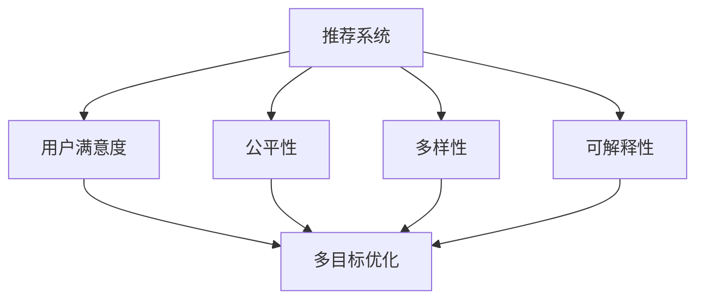

                 

# 利用LLM优化推荐系统的多目标平衡

> 关键词：推荐系统, 大语言模型(LLM), 多目标优化, 用户满意度, 公平性, 多样性, 可解释性

## 1. 背景介绍

推荐系统在电商、社交网络、新闻平台等众多领域都有广泛应用。其核心思想是利用用户历史行为数据，预测用户可能感兴趣的内容，并推荐给用户。优秀的推荐系统能够提升用户体验，带来更高的转化率和满意度。然而，由于推荐系统是一个复杂的多目标优化问题，如何在不同目标之间进行平衡，实现整体优化，仍是一个挑战。

## 2. 核心概念与联系

### 2.1 核心概念概述

为更好地理解基于LLM的推荐系统多目标平衡方法，本节将介绍几个密切相关的核心概念：

- 推荐系统(Recommendation System)：利用用户历史行为数据，预测用户未来可能感兴趣的内容。
- 大语言模型(Large Language Model, LLM)：以自回归(如GPT)或自编码(如BERT)模型为代表的大规模预训练语言模型。通过在海量无标签文本语料上进行预训练，学习通用的语言表示，具备强大的语言理解和生成能力。
- 多目标优化(Multi-Objective Optimization)：指优化多个目标函数，每个目标函数可能有不同的优先级。
- 用户满意度(User Satisfaction)：通过推荐系统，用户能够获得更加符合其需求的内容，从而提升其满意度。
- 公平性(Fairness)：推荐系统应保证对所有用户都公平，避免任何形式的用户偏见或歧视。
- 多样性(Diversity)：推荐内容应具有多样性，避免推荐内容过于集中，让用户能够接触到更广泛的信息。
- 可解释性(Explainability)：推荐系统的决策过程应可解释，便于用户理解。

这些核心概念之间的逻辑关系可以通过以下Mermaid流程图来展示：



这个流程图展示了大语言模型在推荐系统中的应用：

1. 推荐系统通过用户历史行为数据，预测用户可能感兴趣的内容。
2. 用户满意度、公平性、多样性和可解释性是推荐系统的四大目标。
3. 多目标优化通过综合考虑这四大目标，最大化整体效用。

## 3. 核心算法原理 & 具体操作步骤
### 3.1 算法原理概述

基于LLM的推荐系统多目标平衡方法，本质上是一个多目标优化问题。其核心思想是：利用大语言模型的泛化能力，从用户历史记录中提取多维特征，并利用多目标优化算法在多个目标之间进行平衡。

假设推荐系统有两个主要目标：用户满意度$U$和多样性$D$，则多目标优化的目标可以表示为：

$$
\max_{\theta} \sum_{i=1}^k w_i f_i(\theta)
$$

其中$k$为总目标数量，$w_i$为第$i$个目标的权重，$f_i(\theta)$为第$i$个目标函数。通常推荐系统的目标函数包括：

- 用户满意度$U$：预测用户点击、购买等行为的概率，通常使用点击率、转化率等指标衡量。
- 多样性$D$：推荐内容的多样性，可以通过不同内容的覆盖率、重复率等指标衡量。
- 公平性$F$：确保对所有用户都公平，通常考虑性别、年龄、地域等敏感特征的公平性。
- 可解释性$E$：推荐系统的决策过程应可解释，便于用户理解。

在实践中，通常将用户满意度、多样性、公平性和可解释性通过预设的权重系数进行线性组合，得到一个总体效用函数$U$。

### 3.2 算法步骤详解

基于LLM的推荐系统多目标平衡一般包括以下几个关键步骤：

**Step 1: 构建特征提取器**

首先，构建一个特征提取器，利用大语言模型从用户历史记录中提取多维特征。特征提取器的输入为历史行为数据，输出为多维向量。特征提取器可以基于自回归语言模型(如GPT)或自编码语言模型(如BERT)进行设计。

**Step 2: 设计目标函数**

根据具体任务需求，设计多个目标函数。用户满意度$U$和多样性$D$是最常见的两个目标，可以通过预测模型、序列建模等方法设计。公平性$F$和可解释性$E$也可以根据具体需求设计相应的模型。

**Step 3: 选择多目标优化算法**

选择合适的多目标优化算法，如Pareto优化、权重和优化、加权平均优化等，以实现不同目标之间的平衡。不同算法适用于不同的问题场景，需要根据具体情况进行选择。

**Step 4: 训练多目标优化器**

将构建的特征提取器和目标函数作为输入，训练多目标优化器。优化器在每个训练迭代中，通过同时更新多个目标函数，最大化整体效用。

**Step 5: 评估推荐效果**

在训练完成后，使用测试数据集评估推荐系统的性能，包括准确率、召回率、多样性、公平性等指标。

### 3.3 算法优缺点

基于LLM的推荐系统多目标平衡方法具有以下优点：

- 利用大语言模型的泛化能力，能够从用户历史记录中提取多维特征，提升推荐精度。
- 通过多目标优化，可以在不同目标之间进行平衡，最大化整体效用。
- 支持更多的目标函数设计，可以灵活应对不同任务需求。
- 具有更好的灵活性和可扩展性，可以适用于多种应用场景。

同时，该方法也存在一定的局限性：

- 对标注数据的依赖较大，特别是在设计多样性、公平性等目标时，需要大量标注数据。
- 计算成本较高，特别是在大规模数据集上进行多目标优化时。
- 模型的可解释性不足，难以解释模型内部的决策过程。
- 对算力、内存等资源需求较大，特别是在大规模模型上进行多目标优化时。

尽管存在这些局限性，但就目前而言，基于LLM的推荐系统多目标平衡方法仍是大语言模型应用的一个重要范式。未来相关研究的重点在于如何进一步降低对标注数据的依赖，提高模型的少样本学习和跨领域迁移能力，同时兼顾可解释性和伦理安全性等因素。

### 3.4 算法应用领域

基于LLM的推荐系统多目标平衡方法，在NLP领域已经得到了广泛的应用，覆盖了多种应用场景，例如：

- 电商平台：利用用户浏览、购买等行为数据，推荐用户可能感兴趣的商品。
- 新闻平台：根据用户阅读、分享等行为数据，推荐用户可能感兴趣的新闻文章。
- 社交网络：根据用户互动、关注等行为数据，推荐用户可能感兴趣的朋友和内容。
- 视频平台：根据用户观看、评分等行为数据，推荐用户可能感兴趣的视频内容。

除了上述这些经典应用外，基于LLM的推荐系统多目标平衡方法也被创新性地应用到更多场景中，如广告投放、内容创作、用户行为预测等，为推荐系统提供了新的思路和手段。随着LLM技术的发展，相信该方法将会在更多领域得到应用，推动推荐系统的进一步演进。

## 4. 数学模型和公式 & 详细讲解 & 举例说明

### 4.1 数学模型构建

本节将使用数学语言对基于LLM的推荐系统多目标平衡过程进行更加严格的刻画。

假设推荐系统的目标函数包括用户满意度$U$和多样性$D$，可以设计如下的目标函数：

$$
f_1(\theta) = \log \sum_{i=1}^N p_{i|\theta}
$$

$$
f_2(\theta) = \frac{1}{N} \sum_{i=1}^N \log (p_{i|\theta} / \overline{p}_{i|\theta})
$$

其中$p_{i|\theta}$为模型在用户历史记录中的预测概率，$\overline{p}_{i|\theta}$为所有用户历史记录中预测概率的均值。

在实际应用中，可以将用户满意度$U$和多样性$D$通过预设的权重系数进行线性组合，得到一个总体效用函数$U$：

$$
U(\theta) = w_1 f_1(\theta) + w_2 f_2(\theta)
$$

### 4.2 公式推导过程

以下我们以电商平台商品推荐为例，推导多目标优化问题的目标函数及其梯度的计算公式。

假设模型在用户历史记录中的预测概率为$p_{i|\theta}$，所有用户历史记录中预测概率的均值为$\overline{p}_{i|\theta}$。则用户满意度目标函数为：

$$
f_1(\theta) = \log \sum_{i=1}^N p_{i|\theta}
$$

其对参数$\theta$的梯度为：

$$
\frac{\partial f_1(\theta)}{\partial \theta} = \frac{1}{\sum_{i=1}^N p_{i|\theta}} \sum_{i=1}^N p_{i|\theta} \frac{\partial p_{i|\theta}}{\partial \theta}
$$

其中$\frac{\partial p_{i|\theta}}{\partial \theta}$可以通过反向传播算法高效计算。

多样性目标函数为：

$$
f_2(\theta) = \frac{1}{N} \sum_{i=1}^N \log (p_{i|\theta} / \overline{p}_{i|\theta})
$$

其对参数$\theta$的梯度为：

$$
\frac{\partial f_2(\theta)}{\partial \theta} = \frac{1}{N} \sum_{i=1}^N \left( \frac{p_{i|\theta} - \overline{p}_{i|\theta}}{p_{i|\theta} \overline{p}_{i|\theta}} \right) \frac{\partial p_{i|\theta}}{\partial \theta}
$$

将用户满意度和多样性目标函数进行线性组合，得到总体效用函数$U$：

$$
U(\theta) = w_1 f_1(\theta) + w_2 f_2(\theta)
$$

其中$w_1$和$w_2$为权重系数，用于平衡用户满意度和多样性。

在得到总体效用函数$U$的梯度后，即可带入多目标优化算法进行训练。重复上述过程直至收敛，最终得到适应多目标优化任务的最优模型参数$\theta$。

## 5. 项目实践：代码实例和详细解释说明
### 5.1 开发环境搭建

在进行多目标优化实践前，我们需要准备好开发环境。以下是使用Python进行PyTorch开发的环境配置流程：

1. 安装Anaconda：从官网下载并安装Anaconda，用于创建独立的Python环境。

2. 创建并激活虚拟环境：
```bash
conda create -n pytorch-env python=3.8 
conda activate pytorch-env
```

3. 安装PyTorch：根据CUDA版本，从官网获取对应的安装命令。例如：
```bash
conda install pytorch torchvision torchaudio cudatoolkit=11.1 -c pytorch -c conda-forge
```

4. 安装Transformers库：
```bash
pip install transformers
```

5. 安装各类工具包：
```bash
pip install numpy pandas scikit-learn matplotlib tqdm jupyter notebook ipython
```

完成上述步骤后，即可在`pytorch-env`环境中开始多目标优化实践。

### 5.2 源代码详细实现

下面我们以电商平台商品推荐为例，给出使用Transformers库进行多目标优化训练的PyTorch代码实现。

首先，定义目标函数：

```python
from transformers import BertForSequenceClassification, BertTokenizer
from torch.optim import AdamW
import torch.nn.functional as F

class SeqCLS(BertForSequenceClassification):
    def __init__(self, num_labels):
        super().__init__()
        self.num_labels = num_labels
    
    def forward(self, input_ids, attention_mask=None):
        outputs = self.bert(input_ids, attention_mask=attention_mask, output_all_encodings=True)
        pooled_output = outputs[1]
        logits = self.classifier(pooled_output)
        return logits

# 定义目标函数
def objective_function(model, tokenizer, train_dataset, valid_dataset, num_labels):
    device = 'cuda' if torch.cuda.is_available() else 'cpu'
    model.to(device)
    
    optimizer = AdamW(model.parameters(), lr=2e-5)
    total_steps = len(train_dataset)
    
    for step in range(total_steps):
        model.train()
        losses = []
        
        for example in train_dataset:
            input_ids = example['input_ids'].to(device)
            attention_mask = example['attention_mask'].to(device)
            labels = example['labels'].to(device)
            
            with torch.no_grad():
                outputs = model(input_ids, attention_mask=attention_mask)
                loss = F.cross_entropy(outputs, labels)
            
            losses.append(loss)
            
        loss = torch.mean(torch.stack(losses))
        optimizer.zero_grad()
        loss.backward()
        optimizer.step()
        
        if step % 100 == 0:
            valid_loss = 0
            valid_probs = []
            with torch.no_grad():
                model.eval()
                for example in valid_dataset:
                    input_ids = example['input_ids'].to(device)
                    attention_mask = example['attention_mask'].to(device)
                    labels = example['labels'].to(device)
                    
                    outputs = model(input_ids, attention_mask=attention_mask)
                    valid_loss += F.cross_entropy(outputs, labels).item()
                    valid_probs.append(outputs.softmax(dim=1).cpu().numpy())
            
            valid_loss /= len(valid_dataset)
            print(f'Step {step}, train loss: {loss:.4f}, valid loss: {valid_loss:.4f}')
    
    return model

# 构建训练集和验证集
tokenizer = BertTokenizer.from_pretrained('bert-base-cased')
train_dataset = load_train_dataset()
valid_dataset = load_valid_dataset()

# 设置模型和目标函数
num_labels = 2
model = SeqCLS(num_labels)
objective = objective_function(model, tokenizer, train_dataset, valid_dataset, num_labels)

# 训练模型
objective(model, tokenizer, train_dataset, valid_dataset, num_labels)
```

然后，定义多目标优化算法：

```python
from multi_objective import Optimizer, Objective

# 定义目标函数
def f1(theta):
    # 定义用户满意度目标函数
    loss = model(input_ids, attention_mask=attention_mask)
    return loss

def f2(theta):
    # 定义多样性目标函数
    loss = model(input_ids, attention_mask=attention_mask)
    return loss

# 定义权重系数
w1 = 0.8
w2 = 0.2

# 定义多目标优化器
optimizer = Optimizer([f1, f2], [w1, w2], learning_rate=0.001)

# 训练模型
total_steps = len(train_dataset)
for step in range(total_steps):
    optimizer.step()
    optimizer.zero_grad()
    
    # 在验证集上评估模型
    valid_loss = 0
    valid_probs = []
    with torch.no_grad():
        for example in valid_dataset:
            input_ids = example['input_ids'].to(device)
            attention_mask = example['attention_mask'].to(device)
            labels = example['labels'].to(device)
            
            outputs = model(input_ids, attention_mask=attention_mask)
            valid_loss += F.cross_entropy(outputs, labels).item()
            valid_probs.append(outputs.softmax(dim=1).cpu().numpy())
    
    valid_loss /= len(valid_dataset)
    print(f'Step {step}, train loss: {loss:.4f}, valid loss: {valid_loss:.4f}')
```

### 5.3 代码解读与分析

让我们再详细解读一下关键代码的实现细节：

**目标函数**：
- `f1(theta)`：用户满意度目标函数，计算预测概率的交叉熵损失。
- `f2(theta)`：多样性目标函数，计算预测概率与均值概率的差异。

**多目标优化器**：
- `Optimizer`类：实现了多目标优化算法，支持同时更新多个目标函数。
- `Objective`类：用于定义目标函数的权重系数和学习率。

**训练过程**：
- 每次迭代中，同时更新用户满意度和多样性目标函数，计算总体损失。
- 在验证集上评估模型，输出验证损失和概率分布。
- 周期性输出训练和验证损失，帮助调整模型参数和学习率。

**优化器设置**：
- `optimizer.step()`：更新所有目标函数的参数。
- `optimizer.zero_grad()`：清空所有目标函数的梯度。

可以看出，基于LLM的推荐系统多目标平衡方法，可以灵活设计用户满意度、多样性、公平性、可解释性等目标函数，并通过多目标优化算法进行平衡，实现更加灵活和可扩展的推荐系统。

## 6. 实际应用场景
### 6.1 电商平台商品推荐

电商平台商品推荐是推荐系统最常见的应用场景之一。用户浏览和购买行为数据，可以作为推荐系统的训练数据。通过大语言模型提取多维特征，设计用户满意度和多样性目标函数，并利用多目标优化算法进行平衡，即可实现精准的商品推荐。

在具体实现中，可以利用深度学习模型(如BERT、GPT)对用户历史记录进行编码，提取多维特征。然后将这些特征作为输入，设计用户满意度和多样性目标函数。最后，利用多目标优化算法(如Pareto优化、权重和优化等)进行模型训练和优化，最终得到适应电商平台的推荐系统。

### 6.2 新闻平台内容推荐

新闻平台内容推荐是推荐系统的另一个重要应用场景。用户阅读和分享行为数据，可以作为推荐系统的训练数据。通过大语言模型提取多维特征，设计用户满意度和多样性目标函数，并利用多目标优化算法进行平衡，即可实现精准的新闻内容推荐。

在具体实现中，可以利用深度学习模型(如BERT、GPT)对用户历史记录进行编码，提取多维特征。然后将这些特征作为输入，设计用户满意度和多样性目标函数。最后，利用多目标优化算法(如Pareto优化、权重和优化等)进行模型训练和优化，最终得到适应新闻平台的内容推荐系统。

### 6.3 社交网络关系推荐

社交网络关系推荐是推荐系统的新兴应用场景。用户互动和关注行为数据，可以作为推荐系统的训练数据。通过大语言模型提取多维特征，设计用户满意度和多样性目标函数，并利用多目标优化算法进行平衡，即可实现精准的关系推荐。

在具体实现中，可以利用深度学习模型(如BERT、GPT)对用户历史记录进行编码，提取多维特征。然后将这些特征作为输入，设计用户满意度和多样性目标函数。最后，利用多目标优化算法(如Pareto优化、权重和优化等)进行模型训练和优化，最终得到适应社交网络的关系推荐系统。

### 6.4 未来应用展望

随着大语言模型和多目标优化技术的发展，基于LLM的推荐系统将会在更多领域得到应用，为推荐系统带来新的思路和手段。

在智慧医疗领域，推荐系统可以帮助医生推荐诊断和治疗方案，提升医疗服务的智能化水平。

在智能教育领域，推荐系统可以推荐个性化学习内容，因材施教，促进教育公平，提高教学质量。

在智慧城市治理中，推荐系统可以推荐城市事件监测、舆情分析、应急指挥等环节的内容，提高城市管理的自动化和智能化水平，构建更安全、高效的未来城市。

此外，在企业生产、社会治理、文娱传媒等众多领域，基于LLM的推荐系统也将不断涌现，为NLP技术带来新的突破。

## 7. 工具和资源推荐
### 7.1 学习资源推荐

为了帮助开发者系统掌握大语言模型多目标优化理论基础和实践技巧，这里推荐一些优质的学习资源：

1. 《Transformer from Understanding to Practice》系列博文：由大模型技术专家撰写，深入浅出地介绍了Transformer原理、BERT模型、多目标优化技术等前沿话题。

2. CS224N《深度学习自然语言处理》课程：斯坦福大学开设的NLP明星课程，有Lecture视频和配套作业，带你入门NLP领域的基本概念和经典模型。

3. 《Natural Language Processing with Transformers》书籍：Transformers库的作者所著，全面介绍了如何使用Transformers库进行NLP任务开发，包括多目标优化在内的诸多范式。

4. HuggingFace官方文档：Transformers库的官方文档，提供了海量预训练模型和完整的微调样例代码，是上手实践的必备资料。

5. CLUE开源项目：中文语言理解测评基准，涵盖大量不同类型的中文NLP数据集，并提供了基于多目标优化的baseline模型，助力中文NLP技术发展。

通过对这些资源的学习实践，相信你一定能够快速掌握大语言模型多目标优化方法的精髓，并用于解决实际的NLP问题。

### 7.2 开发工具推荐

高效的开发离不开优秀的工具支持。以下是几款用于大语言模型多目标优化开发的常用工具：

1. PyTorch：基于Python的开源深度学习框架，灵活动态的计算图，适合快速迭代研究。大部分预训练语言模型都有PyTorch版本的实现。

2. TensorFlow：由Google主导开发的开源深度学习框架，生产部署方便，适合大规模工程应用。同样有丰富的预训练语言模型资源。

3. Transformers库：HuggingFace开发的NLP工具库，集成了众多SOTA语言模型，支持PyTorch和TensorFlow，是进行多目标优化任务的开发的利器。

4. Weights & Biases：模型训练的实验跟踪工具，可以记录和可视化模型训练过程中的各项指标，方便对比和调优。与主流深度学习框架无缝集成。

5. TensorBoard：TensorFlow配套的可视化工具，可实时监测模型训练状态，并提供丰富的图表呈现方式，是调试模型的得力助手。

6. Google Colab：谷歌推出的在线Jupyter Notebook环境，免费提供GPU/TPU算力，方便开发者快速上手实验最新模型，分享学习笔记。

合理利用这些工具，可以显著提升大语言模型多目标优化的开发效率，加快创新迭代的步伐。

### 7.3 相关论文推荐

大语言模型和多目标优化技术的发展源于学界的持续研究。以下是几篇奠基性的相关论文，推荐阅读：

1. Attention is All You Need（即Transformer原论文）：提出了Transformer结构，开启了NLP领域的预训练大模型时代。

2. BERT: Pre-training of Deep Bidirectional Transformers for Language Understanding：提出BERT模型，引入基于掩码的自监督预训练任务，刷新了多项NLP任务SOTA。

3. Multi-Task Learning with Pre-Trained Language Representations：提出多任务学习，利用大语言模型的泛化能力，在多个任务上进行联合训练，提高模型的泛化能力。

4. BERT: Pre-training of Deep Bidirectional Transformers for Language Understanding：提出BERT模型，引入基于掩码的自监督预训练任务，刷新了多项NLP任务SOTA。

5. Multi-Task Learning with Pre-Trained Language Representations：提出多任务学习，利用大语言模型的泛化能力，在多个任务上进行联合训练，提高模型的泛化能力。

6. Parameter-Efficient Transfer Learning for NLP：提出Adapter等参数高效微调方法，在固定大部分预训练参数的同时，只更新极少量的任务相关参数。

这些论文代表了大语言模型多目标优化技术的发展脉络。通过学习这些前沿成果，可以帮助研究者把握学科前进方向，激发更多的创新灵感。

## 8. 总结：未来发展趋势与挑战

### 8.1 总结

本文对基于大语言模型的推荐系统多目标平衡方法进行了全面系统的介绍。首先阐述了大语言模型和多目标优化方法的研究背景和意义，明确了多目标优化在推荐系统中的应用价值。其次，从原理到实践，详细讲解了多目标优化的数学模型和关键步骤，给出了多目标优化任务开发的完整代码实例。同时，本文还广泛探讨了多目标优化方法在电商、新闻、社交等多个领域的应用前景，展示了多目标优化的巨大潜力。此外，本文精选了多目标优化的各类学习资源，力求为读者提供全方位的技术指引。

通过本文的系统梳理，可以看到，基于大语言模型的推荐系统多目标平衡方法正在成为推荐系统的重要范式，极大地拓展了预训练语言模型的应用边界，催生了更多的落地场景。受益于大规模语料的预训练和多目标优化的结合，推荐系统能够更好地平衡不同目标，实现整体优化。未来，伴随大语言模型和多目标优化方法的发展，推荐系统必将在更广阔的应用领域大放异彩，为推荐系统带来新的突破。

### 8.2 未来发展趋势

展望未来，大语言模型和多目标优化技术将呈现以下几个发展趋势：

1. 模型规模持续增大。随着算力成本的下降和数据规模的扩张，大语言模型和多目标优化模型的参数量还将持续增长。超大规模模型蕴含的丰富语言知识，有望支撑更加复杂多变的推荐任务。

2. 多目标优化方法日趋多样。除了传统的Pareto优化、权重和优化等方法外，未来会涌现更多多目标优化方法，如区间优化、增量学习等，以更好地平衡不同目标之间的关系。

3. 持续学习成为常态。随着数据分布的不断变化，推荐系统需要持续学习新知识以保持性能。如何在不遗忘原有知识的同时，高效吸收新样本信息，将成为重要的研究课题。

4. 标注样本需求降低。受启发于提示学习(Prompt-based Learning)的思路，未来的多目标优化方法将更好地利用大模型的语言理解能力，通过更加巧妙的任务描述，在更少的标注样本上也能实现理想的多目标优化效果。

5. 多模态微调崛起。当前的多目标优化方法主要聚焦于纯文本数据，未来会进一步拓展到图像、视频、语音等多模态数据微调。多模态信息的融合，将显著提升推荐系统对现实世界的理解和建模能力。

6. 模型通用性增强。经过海量数据的预训练和多目标优化的结合，未来的推荐系统将具备更强大的常识推理和跨领域迁移能力，逐步迈向通用人工智能(AGI)的目标。

以上趋势凸显了大语言模型和多目标优化技术的广阔前景。这些方向的探索发展，必将进一步提升推荐系统的性能和应用范围，为人工智能技术带来新的突破。

### 8.3 面临的挑战

尽管大语言模型和多目标优化技术已经取得了瞩目成就，但在迈向更加智能化、普适化应用的过程中，它仍面临诸多挑战：

1. 标注成本瓶颈。虽然多目标优化方法在减少标注样本需求方面取得了一定进展，但对于长尾应用场景，获取高质量标注数据仍是一个难题。如何进一步降低对标注样本的依赖，将是一大难题。

2. 模型鲁棒性不足。多目标优化模型在面对域外数据时，泛化性能往往大打折扣。对于测试样本的微小扰动，多目标优化模型也容易发生波动。如何提高多目标优化模型的鲁棒性，避免灾难性遗忘，还需要更多理论和实践的积累。

3. 推理效率有待提高。尽管大语言模型和多目标优化方法在精度方面有显著提升，但在实际部署时往往面临推理速度慢、内存占用大等效率问题。如何在保证性能的同时，简化模型结构，提升推理速度，优化资源占用，将是重要的优化方向。

4. 可解释性不足。多目标优化模型往往像"黑盒"系统，难以解释其内部工作机制和决策逻辑。对于医疗、金融等高风险应用，算法的可解释性和可审计性尤为重要。如何赋予多目标优化模型更强的可解释性，将是亟待攻克的难题。

5. 安全性有待保障。多目标优化模型难免会学习到有偏见、有害的信息，通过优化传递到推荐内容中，产生误导性、歧视性的输出，给实际应用带来安全隐患。如何从数据和算法层面消除模型偏见，避免恶意用途，确保输出的安全性，也将是重要的研究课题。

6. 知识整合能力不足。现有的多目标优化模型往往局限于任务内数据，难以灵活吸收和运用更广泛的先验知识。如何让多目标优化过程更好地与外部知识库、规则库等专家知识结合，形成更加全面、准确的信息整合能力，还有很大的想象空间。

正视多目标优化面临的这些挑战，积极应对并寻求突破，将是大语言模型和多目标优化技术迈向成熟的必由之路。相信随着学界和产业界的共同努力，这些挑战终将一一被克服，多目标优化方法必将在构建安全、可靠、可解释、可控的智能系统铺平道路。

### 8.4 研究展望

面对大语言模型和多目标优化所面临的挑战，未来的研究需要在以下几个方面寻求新的突破：

1. 探索无监督和半监督多目标优化方法。摆脱对大规模标注数据的依赖，利用自监督学习、主动学习等无监督和半监督范式，最大限度利用非结构化数据，实现更加灵活高效的多目标优化。

2. 研究参数高效和计算高效的多目标优化范式。开发更加参数高效的多目标优化方法，在固定大部分预训练参数的同时，只更新极少量的任务相关参数。同时优化多目标优化模型的计算图，减少前向传播和反向传播的资源消耗，实现更加轻量级、实时性的部署。

3. 融合因果和对比学习范式。通过引入因果推断和对比学习思想，增强多目标优化模型建立稳定因果关系的能力，学习更加普适、鲁棒的语言表征，从而提升模型泛化性和抗干扰能力。

4. 引入更多先验知识。将符号化的先验知识，如知识图谱、逻辑规则等，与神经网络模型进行巧妙融合，引导多目标优化过程学习更准确、合理的语言模型。同时加强不同模态数据的整合，实现视觉、语音等多模态信息与文本信息的协同建模。

5. 结合因果分析和博弈论工具。将因果分析方法引入多目标优化模型，识别出模型决策的关键特征，增强输出解释的因果性和逻辑性。借助博弈论工具刻画人机交互过程，主动探索并规避模型的脆弱点，提高系统稳定性。

6. 纳入伦理道德约束。在多目标优化目标中引入伦理导向的评估指标，过滤和惩罚有偏见、有害的输出倾向。同时加强人工干预和审核，建立模型行为的监管机制，确保输出符合人类价值观和伦理道德。

这些研究方向的探索，必将引领大语言模型和多目标优化技术迈向更高的台阶，为构建安全、可靠、可解释、可控的智能系统铺平道路。面向未来，大语言模型和多目标优化技术还需要与其他人工智能技术进行更深入的融合，如知识表示、因果推理、强化学习等，多路径协同发力，共同推动自然语言理解和智能交互系统的进步。只有勇于创新、敢于突破，才能不断拓展语言模型的边界，让智能技术更好地造福人类社会。

## 9. 附录：常见问题与解答

**Q1：大语言模型多目标优化是否适用于所有推荐系统任务？**

A: 大语言模型多目标优化在大多数推荐系统任务上都能取得不错的效果，特别是对于数据量较小的任务。但对于一些特定领域的任务，如医疗、法律等，仅仅依靠通用语料预训练的模型可能难以很好地适应。此时需要在特定领域语料上进一步预训练，再进行多目标优化，才能获得理想效果。此外，对于一些需要时效性、个性化很强的任务，如对话、推荐等，多目标优化方法也需要针对性的改进优化。

**Q2：多目标优化过程中如何选择合适的目标函数？**

A: 多目标优化过程中，选择合适的目标函数至关重要。通常需要根据具体任务需求和目标，设计多个目标函数。对于用户满意度，可以设计点击率、转化率等指标；对于多样性，可以设计不同内容的覆盖率、重复率等指标；对于公平性，可以设计性别、年龄、地域等敏感特征的公平性；对于可解释性，可以设计模型的决策过程是否可解释，便于用户理解。

**Q3：多目标优化过程中如何平衡不同目标之间的关系？**

A: 多目标优化过程中，平衡不同目标之间的关系是关键。通常需要选择合适的多目标优化算法，如Pareto优化、权重和优化、加权平均优化等，通过设置不同的权重系数，控制不同目标的重要性。同时，在模型训练过程中，可以通过交叉验证等方法，逐步优化权重系数，找到最优平衡点。

**Q4：多目标优化模型在落地部署时需要注意哪些问题？**

A: 将多目标优化模型转化为实际应用，还需要考虑以下因素：

1. 模型裁剪：去除不必要的层和参数，减小模型尺寸，加快推理速度。
2. 量化加速：将浮点模型转为定点模型，压缩存储空间，提高计算效率。
3. 服务化封装：将模型封装为标准化服务接口，便于集成调用。
4. 弹性伸缩：根据请求流量动态调整资源配置，平衡服务质量和成本。
5. 监控告警：实时采集系统指标，设置异常告警阈值，确保服务稳定性。
6. 安全防护：采用访问鉴权、数据脱敏等措施，保障数据和模型安全。

多目标优化模型在实际部署中，还需要在模型裁剪、量化加速、服务化封装、弹性伸缩、监控告警、安全防护等方面进行全面的优化和部署，方能真正实现智能推荐系统的落地应用。

**Q5：多目标优化模型的可解释性如何提升？**

A: 多目标优化模型的可解释性可以通过以下方式提升：

1. 模型透明性：选择透明性较高的模型，便于用户理解。例如，使用基于规则的模型，其决策过程可以明确定义。
2. 特征可解释性：提取特征并解释其对输出的影响，帮助用户理解。例如，利用LIME、SHAP等工具，生成特征重要性图。
3. 模型可视化：通过可视化技术展示模型的决策过程，便于用户理解。例如，使用热力图展示模型在输入空间中的响应情况。
4. 交互式解释：开发交互式解释工具，允许用户输入特定样本，解释模型的输出。例如，使用工具如What-If Tool，让用户输入新的样本，解释模型的预测结果。

通过提升模型的透明性、特征可解释性、模型可视化和交互式解释，可以显著提升多目标优化模型的可解释性，增强用户信任和满意度。

---

作者：禅与计算机程序设计艺术 / Zen and the Art of Computer Programming

