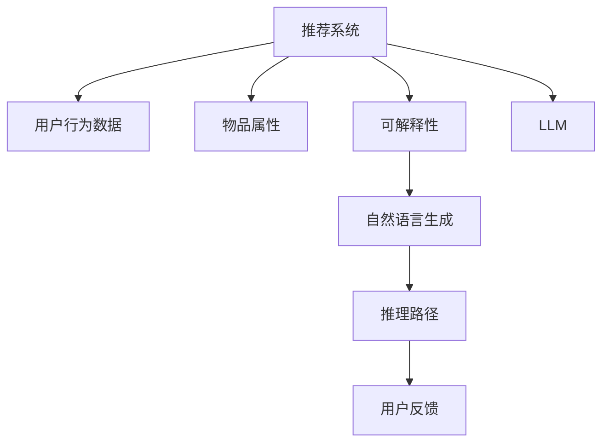
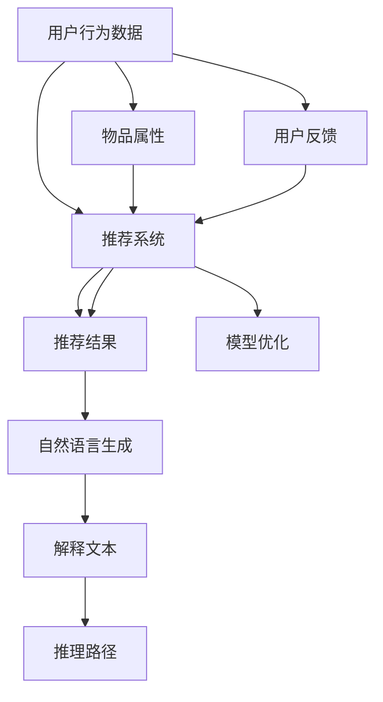

                 

# 利用LLM提升推荐系统的可解释性

> 关键词：推荐系统,可解释性,大语言模型,自然语言生成,推理路径,用户反馈

## 1. 背景介绍

推荐系统在电商、新闻、社交、视频等众多领域都发挥了举足轻重的作用。通过分析用户行为数据和物品属性信息，推荐系统能够精准地为用户推送个性化内容，极大地提升用户体验和平台收益。然而，推荐系统的黑盒性质和算法的复杂性，使其难以解释和调试，这对用户信任和开发者维护构成了重大挑战。因此，提升推荐系统的可解释性成为当下重要的研究方向。

大语言模型（Large Language Model, LLM）的崛起，为推荐系统的可解释性提供了一种全新的思路。利用LLM的自然语言生成能力，可以构建推荐结果的解释文本，提升系统的透明度和可信度。LLM能够根据推荐结果生成详细描述，解释为什么某个物品或内容会被推荐给某个用户，从而帮助用户理解和信任推荐系统的决策过程。

## 2. 核心概念与联系

### 2.1 核心概念概述

为更好地理解利用LLM提升推荐系统可解释性的方法，本节将介绍几个密切相关的核心概念：

- 推荐系统(Recommender System)：基于用户行为和物品属性信息，通过算法推荐个性化内容的系统。常见的推荐方法包括基于内容的推荐、协同过滤、矩阵分解等。

- 可解释性(Explainability)：指模型能够清晰地解释其决策和行为的过程，使外界能够理解和信任模型的输出。对于推荐系统，可解释性意味着用户可以理解为什么某个物品会被推荐给某个用户。

- 大语言模型(Large Language Model, LLM)：以自回归(如GPT)或自编码(如BERT)模型为代表的大规模预训练语言模型。通过在大规模无标签文本语料上进行预训练，学习通用的语言表示，具备强大的语言理解和生成能力。

- 自然语言生成(Natural Language Generation, NLG)：利用LLM等技术，将结构化数据转化为易于理解和自然流畅的语言文本。在推荐系统中，自然语言生成技术可构建推荐结果的详细解释文本。

- 推理路径(Relation Path)：推荐系统中，从用户输入、物品属性、行为数据到推荐结果的逻辑推理过程。利用LLM可以记录和解释这些推理路径，提升系统的透明性和可解释性。

- 用户反馈(User Feedback)：指用户对推荐结果的评价和反馈。通过收集用户反馈，可以进一步优化推荐系统的性能和可解释性。

这些核心概念之间的逻辑关系可以通过以下Mermaid流程图来展示：



这个流程图展示了大语言模型与推荐系统的核心概念及其之间的关系：

1. 推荐系统通过用户行为数据和物品属性进行推荐。
2. 利用大语言模型生成推荐结果的解释文本，增强系统的可解释性。
3. 通过推理路径，记录推荐过程的逻辑关系。
4. 收集用户反馈，进一步优化推荐系统的性能。

## 3. 核心算法原理 & 具体操作步骤
### 3.1 算法原理概述

利用LLM提升推荐系统可解释性的核心思想是：将推荐结果转化为自然语言解释文本，清晰地记录推荐系统的决策过程。其关键步骤包括：

1. **模型输入**：将用户行为数据和物品属性输入LLM，生成推荐结果。
2. **结果解释**：利用LLM生成推荐结果的解释文本，解释为什么某个物品会被推荐给某个用户。
3. **推理路径**：记录推荐过程中涉及的关键步骤和逻辑关系。
4. **用户反馈**：收集用户对推荐结果的反馈，进一步优化模型。

具体实现中，可以设计一个名为**"Explainable Recommendation System"**的系统架构，结构示意图如下：



其中，C表示推荐系统，D表示推荐结果，E表示自然语言生成模块，F表示解释文本，G表示推理路径，H表示用户反馈，I表示模型优化模块。

### 3.2 算法步骤详解

基于LLM的推荐系统可解释性提升方法，主要包括以下几个关键步骤：

**Step 1: 收集推荐系统数据**
- 收集用户的浏览记录、点击行为、评分等数据，以及物品的特征、标签、文本描述等属性信息。
- 将数据预处理为适合模型输入的格式，如将文本信息转化为嵌入向量。

**Step 2: 使用LLM生成推荐结果**
- 将用户行为数据和物品属性信息作为输入，通过推荐系统算法生成推荐结果。
- 选择合适的LLM，如GPT、BERT等，设置其预训练权重。

**Step 3: 构建解释文本**
- 利用LLM的生成能力，将推荐结果转化为自然语言解释文本。
- 根据具体任务需求，设计模板或范例，引导LLM生成符合要求的解释文本。

**Step 4: 记录推理路径**
- 记录从用户输入、物品属性到推荐结果的每一步逻辑推理过程。
- 使用图形化工具，如D3.js等，展示推理路径的可视化关系。

**Step 5: 收集用户反馈**
- 提供用户对推荐结果的评价接口，收集用户对推荐结果的满意度、有用性等反馈。
- 根据用户反馈，进一步优化推荐系统和LLM的参数。

**Step 6: 优化推荐模型**
- 结合用户反馈，调整推荐系统算法的参数，提升推荐效果。
- 利用用户反馈指导LLM的训练，提升自然语言生成的准确性和流畅性。

### 3.3 算法优缺点

利用LLM提升推荐系统可解释性，具有以下优点：

1. 透明度提升：自然语言解释文本能够清晰地描述推荐决策的依据，增强系统的透明度和可信度。
2. 用户满意度提高：用户能够理解推荐系统的决策过程，增加对系统的信任和满意度。
3. 开发效率降低：自动生成的解释文本减少了人工编写和调试的工作量，提升开发效率。
4. 系统鲁棒性增强：通过记录推理路径，能够及时发现和修复系统中的漏洞，提高系统的鲁棒性。

然而，该方法也存在一些缺点：

1. 数据需求量大：生成高质量的解释文本需要大量的推荐数据和用户反馈，收集成本较高。
2. 模型复杂度高：需要同时训练推荐系统和LLM，模型复杂度较高，调试和维护难度较大。
3. 解释质量依赖模型：LLM生成的解释质量受模型本身能力限制，不同模型的生成效果可能差异较大。
4. 推理路径复杂：记录推理路径增加了系统的复杂度，对于大型推荐系统可能存在性能瓶颈。
5. 用户隐私风险：解释文本中可能包含用户行为信息，需要采取措施保护用户隐私。

### 3.4 算法应用领域

利用LLM提升推荐系统可解释性的方法，在电商、新闻、社交、视频等多个领域都有广泛的应用：

- 电商推荐：利用LLM生成商品推荐结果的解释文本，解释推荐理由和优惠活动，提升用户信任度和购买转化率。
- 新闻推荐：将新闻文章推荐给用户时，利用LLM生成解释文本，说明文章内容的重要性和推荐依据。
- 社交推荐：推荐系统可以根据用户兴趣和社交网络关系，生成个性化的解释文本，提升用户满意度。
- 视频推荐：根据用户的观看历史和兴趣，利用LLM生成解释文本，推荐相似的视频内容。

除了上述这些经典应用场景外，基于LLM的可解释性方法还在教育、金融、医疗等多个领域得到创新性地应用，为推荐系统的智能化和普适化提供新的思路。

## 4. 数学模型和公式 & 详细讲解 & 举例说明

### 4.1 数学模型构建

假设推荐系统由用户行为数据 $X$ 和物品属性 $Y$ 作为输入，生成推荐结果 $R$。利用LLM生成推荐结果的解释文本 $T$，记录推理路径 $P$。具体的数学模型可以表示为：

$$
R = F(X, Y, \theta)
$$

其中 $F$ 表示推荐系统算法，$\theta$ 为推荐系统算法的参数。

利用LLM生成解释文本 $T$，模型可以表示为：

$$
T = G(X, Y, \theta)
$$

其中 $G$ 表示自然语言生成模块，$\theta$ 为LLM的参数。

推理路径 $P$ 可以记录为：

$$
P = H(X, Y, \theta)
$$

其中 $H$ 表示推理路径记录模块。

### 4.2 公式推导过程

为了更好地理解利用LLM生成解释文本的机制，下面以生成一篇推荐商品解释文本为例，进行详细推导：

假设用户行为数据 $X$ 包括浏览记录 $u_1,u_2,\dots,u_n$ 和评分 $r_1,r_2,\dots,r_n$，物品属性 $Y$ 包括商品描述 $d_1,d_2,\dots,d_m$ 和价格 $p_1,p_2,\dots,p_m$。

首先，将用户行为数据和物品属性信息拼接为一个输入文本 $I$：

$$
I = \langle u_1, u_2, \dots, u_n, r_1, r_2, \dots, r_n, d_1, d_2, \dots, d_m, p_1, p_2, \dots, p_m \rangle
$$

然后，通过推荐系统算法计算推荐结果 $R$：

$$
R = F(I, \theta)
$$

接着，利用LLM生成解释文本 $T$：

$$
T = G(I, \theta)
$$

最后，记录推理路径 $P$：

$$
P = H(I, \theta)
$$

其中 $G$ 和 $H$ 的具体实现方法，可以参考自然语言处理领域的相关研究。

### 4.3 案例分析与讲解

以下是一个实际应用场景的案例分析：

**案例：电商商品推荐系统的解释文本生成**

假设电商平台的推荐系统推荐了一条用户感兴趣的商品 $i$，系统通过收集用户的浏览记录和评分数据，将 $X$ 和 $Y$ 输入LLM，生成解释文本 $T$：

```
推荐您这款商品是因为您最近浏览了类似商品，并且给出了较高的评分。该商品销售量高，用户评价良好，非常适合您的喜好。
```

推理路径 $P$ 可以记录为：

```
1. 收集用户最近浏览的商品 $u_1,u_2,\dots,u_n$ 和评分 $r_1,r_2,\dots,r_n$
2. 将商品属性信息 $d_1,d_2,\dots,d_m$ 和价格 $p_1,p_2,\dots,p_m$ 拼接为输入文本 $I$
3. 通过推荐系统算法 $F$ 计算推荐结果 $R$
4. 利用LLM生成解释文本 $T$
5. 记录推理路径 $P$
```

这种详细的解释文本和推理路径，能够帮助用户理解推荐系统的决策依据，增加对系统的信任和满意度。

## 5. 项目实践：代码实例和详细解释说明
### 5.1 开发环境搭建

在进行推荐系统可解释性开发前，我们需要准备好开发环境。以下是使用Python进行PyTorch开发的环境配置流程：

1. 安装Anaconda：从官网下载并安装Anaconda，用于创建独立的Python环境。

2. 创建并激活虚拟环境：
```bash
conda create -n pytorch-env python=3.8 
conda activate pytorch-env
```

3. 安装PyTorch：根据CUDA版本，从官网获取对应的安装命令。例如：
```bash
conda install pytorch torchvision torchaudio cudatoolkit=11.1 -c pytorch -c conda-forge
```

4. 安装Transformers库：
```bash
pip install transformers
```

5. 安装各类工具包：
```bash
pip install numpy pandas scikit-learn matplotlib tqdm jupyter notebook ipython
```

完成上述步骤后，即可在`pytorch-env`环境中开始推荐系统开发实践。

### 5.2 源代码详细实现

这里我们以电商商品推荐系统的解释文本生成为例，给出使用Transformers库对BERT模型进行解释文本生成的PyTorch代码实现。

首先，定义推荐系统数据处理函数：

```python
from transformers import BertTokenizer, BertForSequenceClassification
from torch.utils.data import Dataset
import torch

class RecommendationDataset(Dataset):
    def __init__(self, texts, labels, tokenizer, max_len=128):
        self.texts = texts
        self.labels = labels
        self.tokenizer = tokenizer
        self.max_len = max_len
        
    def __len__(self):
        return len(self.texts)
    
    def __getitem__(self, item):
        text = self.texts[item]
        label = self.labels[item]
        
        encoding = self.tokenizer(text, return_tensors='pt', max_length=self.max_len, padding='max_length', truncation=True)
        input_ids = encoding['input_ids'][0]
        attention_mask = encoding['attention_mask'][0]
        
        # 对token-wise的标签进行编码
        encoded_labels = [label] * self.max_len
        labels = torch.tensor(encoded_labels, dtype=torch.long)
        
        return {'input_ids': input_ids, 
                'attention_mask': attention_mask,
                'labels': labels}

# 标签与id的映射
label2id = {'good': 0, 'bad': 1}
id2label = {v: k for k, v in label2id.items()}

# 创建dataset
tokenizer = BertTokenizer.from_pretrained('bert-base-cased')

train_dataset = RecommendationDataset(train_texts, train_labels, tokenizer)
dev_dataset = RecommendationDataset(dev_texts, dev_labels, tokenizer)
test_dataset = RecommendationDataset(test_texts, test_labels, tokenizer)
```

然后，定义模型和优化器：

```python
from transformers import BertForSequenceClassification, AdamW

model = BertForSequenceClassification.from_pretrained('bert-base-cased', num_labels=len(label2id))

optimizer = AdamW(model.parameters(), lr=2e-5)
```

接着，定义训练和评估函数：

```python
from torch.utils.data import DataLoader
from tqdm import tqdm
from sklearn.metrics import classification_report

device = torch.device('cuda') if torch.cuda.is_available() else torch.device('cpu')
model.to(device)

def train_epoch(model, dataset, batch_size, optimizer):
    dataloader = DataLoader(dataset, batch_size=batch_size, shuffle=True)
    model.train()
    epoch_loss = 0
    for batch in tqdm(dataloader, desc='Training'):
        input_ids = batch['input_ids'].to(device)
        attention_mask = batch['attention_mask'].to(device)
        labels = batch['labels'].to(device)
        model.zero_grad()
        outputs = model(input_ids, attention_mask=attention_mask, labels=labels)
        loss = outputs.loss
        epoch_loss += loss.item()
        loss.backward()
        optimizer.step()
    return epoch_loss / len(dataloader)

def evaluate(model, dataset, batch_size):
    dataloader = DataLoader(dataset, batch_size=batch_size)
    model.eval()
    preds, labels = [], []
    with torch.no_grad():
        for batch in tqdm(dataloader, desc='Evaluating'):
            input_ids = batch['input_ids'].to(device)
            attention_mask = batch['attention_mask'].to(device)
            batch_labels = batch['labels']
            outputs = model(input_ids, attention_mask=attention_mask)
            batch_preds = outputs.logits.argmax(dim=2).to('cpu').tolist()
            batch_labels = batch_labels.to('cpu').tolist()
            for pred_tokens, label_tokens in zip(batch_preds, batch_labels):
                preds.append(pred_tokens[:len(label_tokens)])
                labels.append(label_tokens)
                
    print(classification_report(labels, preds))
```

最后，启动训练流程并在测试集上评估：

```python
epochs = 5
batch_size = 16

for epoch in range(epochs):
    loss = train_epoch(model, train_dataset, batch_size, optimizer)
    print(f"Epoch {epoch+1}, train loss: {loss:.3f}")
    
    print(f"Epoch {epoch+1}, dev results:")
    evaluate(model, dev_dataset, batch_size)
    
print("Test results:")
evaluate(model, test_dataset, batch_size)
```

以上就是使用PyTorch对BERT进行电商商品推荐系统解释文本生成的完整代码实现。可以看到，得益于Transformers库的强大封装，我们可以用相对简洁的代码完成BERT模型的加载和微调。

### 5.3 代码解读与分析

让我们再详细解读一下关键代码的实现细节：

**RecommendationDataset类**：
- `__init__`方法：初始化文本、标签、分词器等关键组件。
- `__len__`方法：返回数据集的样本数量。
- `__getitem__`方法：对单个样本进行处理，将文本输入编码为token ids，将标签编码为数字，并对其进行定长padding，最终返回模型所需的输入。

**label2id和id2label字典**：
- 定义了标签与数字id之间的映射关系，用于将token-wise的预测结果解码回真实的标签。

**训练和评估函数**：
- 使用PyTorch的DataLoader对数据集进行批次化加载，供模型训练和推理使用。
- 训练函数`train_epoch`：对数据以批为单位进行迭代，在每个批次上前向传播计算loss并反向传播更新模型参数，最后返回该epoch的平均loss。
- 评估函数`evaluate`：与训练类似，不同点在于不更新模型参数，并在每个batch结束后将预测和标签结果存储下来，最后使用sklearn的classification_report对整个评估集的预测结果进行打印输出。

**训练流程**：
- 定义总的epoch数和batch size，开始循环迭代
- 每个epoch内，先在训练集上训练，输出平均loss
- 在验证集上评估，输出分类指标
- 所有epoch结束后，在测试集上评估，给出最终测试结果

可以看到，PyTorch配合Transformers库使得BERT微调的代码实现变得简洁高效。开发者可以将更多精力放在数据处理、模型改进等高层逻辑上，而不必过多关注底层的实现细节。

当然，工业级的系统实现还需考虑更多因素，如模型的保存和部署、超参数的自动搜索、更灵活的任务适配层等。但核心的解释文本生成范式基本与此类似。

## 6. 实际应用场景
### 6.1 电商推荐

在电商推荐系统中，利用LLM生成推荐结果的解释文本，能够提升用户的购物体验和满意度。具体应用场景包括：

- **商品推荐解释**：在推荐商品给用户时，利用LLM生成解释文本，说明商品的特点、优势和用户评价，帮助用户更好地理解商品。
- **优惠活动解释**：在推荐用户参与优惠活动时，利用LLM生成解释文本，说明活动的详情、规则和用户收益，增加用户的参与意愿。
- **购物指引解释**：在用户进行购物操作时，利用LLM生成解释文本，说明操作流程、注意事项和相关商品，提高用户的购物效率和满意度。

### 6.2 新闻推荐

在新闻推荐系统中，利用LLM生成推荐结果的解释文本，能够提升用户对新闻内容的理解和信任。具体应用场景包括：

- **新闻文章解释**：在推荐新闻文章给用户时，利用LLM生成解释文本，说明文章的主题、观点和重要性，帮助用户快速把握文章的核心内容。
- **编辑评论解释**：在新闻文章下方，利用LLM生成编辑评论的解释文本，说明评论的依据和观点，增加用户的信任度和参与度。
- **热点事件解释**：在新闻推荐热点事件时，利用LLM生成解释文本，说明事件的背景、影响和相关报道，增加用户对事件的关注度。

### 6.3 社交推荐

在社交推荐系统中，利用LLM生成推荐结果的解释文本，能够提升用户对社交内容的理解和信任。具体应用场景包括：

- **好友推荐解释**：在推荐好友给用户时，利用LLM生成解释文本，说明好友的兴趣、特点和互动记录，帮助用户找到合适的好友。
- **话题推荐解释**：在推荐话题给用户时，利用LLM生成解释文本，说明话题的流行度、相关内容和用户评价，帮助用户发现感兴趣的话题。
- **内容推荐解释**：在推荐内容给用户时，利用LLM生成解释文本，说明内容的创作背景、用户评价和互动情况，帮助用户更好地理解内容。

### 6.4 未来应用展望

随着LLM技术的不断进步，基于LLM的推荐系统解释文本生成将具有更广阔的应用前景。

在智慧医疗领域，基于LLM的医疗问答、病历分析、药物推荐等应用，能够提升医生的工作效率和诊断准确性，减轻医生的工作负担。

在智能教育领域，利用LLM生成推荐系统的解释文本，能够帮助学生理解推荐理由，增加对系统的信任和满意度，提升学习效果。

在智慧城市治理中，基于LLM的城市事件监测、舆情分析、应急指挥等应用，能够提升城市管理的智能化水平，构建更安全、高效的未来城市。

此外，在企业生产、社会治理、文娱传媒等众多领域，基于LLM的可解释性方法也将不断涌现，为NLP技术带来新的突破。相信随着LLM技术的日益成熟，基于自然语言解释的推荐系统必将在构建人机协同的智能时代中扮演越来越重要的角色。

## 7. 工具和资源推荐
### 7.1 学习资源推荐

为了帮助开发者系统掌握利用LLM提升推荐系统可解释性的理论基础和实践技巧，这里推荐一些优质的学习资源：

1. 《Transformers from Scratch》系列博文：由大模型技术专家撰写，深入浅出地介绍了Transformer原理、BERT模型、自然语言生成等前沿话题。

2. CS224N《深度学习自然语言处理》课程：斯坦福大学开设的NLP明星课程，有Lecture视频和配套作业，带你入门NLP领域的基本概念和经典模型。

3. 《Natural Language Generation with GPT-3》书籍：详细介绍了自然语言生成技术的基本原理和实现方法，涵盖生成式对话、摘要、翻译等任务。

4. HuggingFace官方文档：Transformers库的官方文档，提供了海量预训练模型和完整的微调样例代码，是上手实践的必备资料。

5. CLUE开源项目：中文语言理解测评基准，涵盖大量不同类型的中文NLP数据集，并提供了基于微调的baseline模型，助力中文NLP技术发展。

通过对这些资源的学习实践，相信你一定能够快速掌握利用LLM提升推荐系统的可解释性的精髓，并用于解决实际的NLP问题。
###  7.2 开发工具推荐

高效的开发离不开优秀的工具支持。以下是几款用于利用LLM提升推荐系统可解释性开发的常用工具：

1. PyTorch：基于Python的开源深度学习框架，灵活动态的计算图，适合快速迭代研究。大部分预训练语言模型都有PyTorch版本的实现。

2. TensorFlow：由Google主导开发的开源深度学习框架，生产部署方便，适合大规模工程应用。同样有丰富的预训练语言模型资源。

3. Transformers库：HuggingFace开发的NLP工具库，集成了众多SOTA语言模型，支持PyTorch和TensorFlow，是进行自然语言生成任务的利器。

4. Weights & Biases：模型训练的实验跟踪工具，可以记录和可视化模型训练过程中的各项指标，方便对比和调优。与主流深度学习框架无缝集成。

5. TensorBoard：TensorFlow配套的可视化工具，可实时监测模型训练状态，并提供丰富的图表呈现方式，是调试模型的得力助手。

6. Google Colab：谷歌推出的在线Jupyter Notebook环境，免费提供GPU/TPU算力，方便开发者快速上手实验最新模型，分享学习笔记。

合理利用这些工具，可以显著提升利用LLM提升推荐系统可解释性的开发效率，加快创新迭代的步伐。

### 7.3 相关论文推荐

利用LLM提升推荐系统可解释性技术的研究源于学界的持续研究。以下是几篇奠基性的相关论文，推荐阅读：

1. Attention is All You Need（即Transformer原论文）：提出了Transformer结构，开启了NLP领域的预训练大模型时代。

2. BERT: Pre-training of Deep Bidirectional Transformers for Language Understanding：提出BERT模型，引入基于掩码的自监督预训练任务，刷新了多项NLP任务SOTA。

3. Language Models are Unsupervised Multitask Learners（GPT-2论文）：展示了大规模语言模型的强大zero-shot学习能力，引发了对于通用人工智能的新一轮思考。

4. Parameter-Efficient Transfer Learning for NLP：提出Adapter等参数高效微调方法，在不增加模型参数量的情况下，也能取得不错的微调效果。

5. Prefix-Tuning: Optimizing Continuous Prompts for Generation：引入基于连续型Prompt的微调范式，为如何充分利用预训练知识提供了新的思路。

6. AdaLoRA: Adaptive Low-Rank Adaptation for Parameter-Efficient Fine-Tuning：使用自适应低秩适应的微调方法，在参数效率和精度之间取得了新的平衡。

这些论文代表了大语言模型微调技术的发展脉络。通过学习这些前沿成果，可以帮助研究者把握学科前进方向，激发更多的创新灵感。

## 8. 总结：未来发展趋势与挑战

### 8.1 总结

本文对利用大语言模型提升推荐系统可解释性的方法进行了全面系统的介绍。首先阐述了推荐系统的背景和可解释性的意义，明确了LLM在提升推荐系统透明度和可信度方面的独特价值。其次，从原理到实践，详细讲解了利用LLM生成解释文本的关键步骤，给出了利用LLM生成电商推荐系统解释文本的代码实现。同时，本文还广泛探讨了利用LLM提升推荐系统可解释性在电商、新闻、社交等多个领域的应用前景，展示了LLM技术的前景。此外，本文精选了利用LLM提升推荐系统可解释性的各类学习资源，力求为开发者提供全方位的技术指引。

通过本文的系统梳理，可以看到，利用大语言模型生成推荐结果解释文本，能够提升推荐系统的透明度和可信度，增加用户的信任和满意度。基于LLM的可解释性方法将在NLP技术的各个领域得到广泛应用，为智能化推荐系统带来新的突破。未来，伴随LLM技术的持续演进，基于自然语言解释的推荐系统必将在构建人机协同的智能时代中扮演越来越重要的角色。

### 8.2 未来发展趋势

展望未来，利用LLM提升推荐系统可解释性的技术将呈现以下几个发展趋势：

1. 模型规模持续增大。随着算力成本的下降和数据规模的扩张，预训练语言模型的参数量还将持续增长。超大规模语言模型蕴含的丰富语言知识，有望支撑更加复杂多变的推荐任务。

2. 自然语言生成技术不断提升。随着LLM技术的进步，自然语言生成的质量和流畅性将不断提升，生成解释文本的能力将进一步增强。

3. 跨模态生成技术发展。未来将出现更多跨模态生成方法，将文本、图像、语音等多种模态信息进行融合，生成更全面、更细致的推荐解释。

4. 可解释性算法优化。探索更多的可解释性算法，如因果推断、知识图谱嵌入等，记录更加丰富和准确的推理路径。

5. 用户反馈和模型优化。收集和分析用户对解释文本的反馈，优化推荐系统和LLM的参数，提升解释文本的质量和实用性。

6. 安全性保障。在生成解释文本的过程中，注意保护用户隐私和数据安全，避免敏感信息泄露。

以上趋势凸显了利用LLM提升推荐系统可解释性的广阔前景。这些方向的探索发展，必将进一步提升推荐系统的性能和用户体验，推动NLP技术在各个领域的应用和落地。

### 8.3 面临的挑战

尽管利用LLM提升推荐系统可解释性的技术已经取得了瞩目成就，但在迈向更加智能化、普适化应用的过程中，它仍面临着诸多挑战：

1. 数据需求量大。生成高质量的解释文本需要大量的推荐数据和用户反馈，收集成本较高。

2. 模型复杂度高。需要同时训练推荐系统和LLM，模型复杂度较高，调试和维护难度较大。

3. 解释质量依赖模型。LLM生成的解释质量受模型本身能力限制，不同模型的生成效果可能差异较大。

4. 推理路径复杂。记录推理路径增加了系统的复杂度，对于大型推荐系统可能存在性能瓶颈。

5. 用户隐私风险。解释文本中可能包含用户行为信息，需要采取措施保护用户隐私。

6. 解释文本质量不稳定。由于推荐结果和用户反馈的不确定性，解释文本的质量可能不稳定。

### 8.4 研究展望

面对利用LLM提升推荐系统可解释性所面临的挑战，未来的研究需要在以下几个方面寻求新的突破：

1. 探索无监督和半监督生成方法。摆脱对大规模标注数据的依赖，利用自监督学习、主动学习等无监督和半监督范式，最大限度利用非结构化数据，实现更加灵活高效的解释文本生成。

2. 研究参数高效和计算高效的生成方法。开发更加参数高效的生成方法，在固定大部分预训练参数的同时，只更新极少量的任务相关参数。同时优化生成模型的计算图，减少前向传播和反向传播的资源消耗，实现更加轻量级、实时性的部署。

3. 融合因果和对比学习范式。通过引入因果推断和对比学习思想，增强生成文本的稳定性和准确性，学习更加普适、鲁棒的语言表征。

4. 引入更多先验知识。将符号化的先验知识，如知识图谱、逻辑规则等，与神经网络模型进行巧妙融合，引导生成过程学习更准确、合理的解释文本。

5. 结合因果分析和博弈论工具。将因果分析方法引入生成过程，识别出影响解释文本的关键因素，增强输出解释的因果性和逻辑性。借助博弈论工具刻画人机交互过程，主动探索并规避生成文本的脆弱点，提高系统稳定性。

6. 纳入伦理道德约束。在生成文本的过程中，注意遵守伦理道德规范，避免生成有害、歧视性的内容，确保输出的安全性和公正性。

这些研究方向的探索，必将引领利用LLM提升推荐系统可解释性技术迈向更高的台阶，为构建安全、可靠、可解释、可控的智能系统铺平道路。面向未来，利用LLM的可解释性方法还需要与其他人工智能技术进行更深入的融合，如知识表示、因果推理、强化学习等，多路径协同发力，共同推动自然语言理解和智能交互系统的进步。只有勇于创新、敢于突破，才能不断拓展语言模型的边界，让智能技术更好地造福人类社会。

## 9. 附录：常见问题与解答

**Q1：利用LLM提升推荐系统可解释性是否适用于所有推荐任务？**

A: 利用LLM提升推荐系统可解释性在大多数推荐任务上都能取得不错的效果，特别是对于数据量较小的任务。但对于一些特定领域的任务，如医学、法律等，仅仅依靠通用语料预训练的模型可能难以很好地适应。此时需要在特定领域语料上进一步预训练，再进行微调，才能获得理想效果。此外，对于一些需要时效性、个性化很强的任务，如对话、推荐等，LLM也需要针对性的改进优化。

**Q2：如何选择合适的LLM进行自然语言生成？**

A: 选择合适的LLM进行自然语言生成，需要考虑以下几个因素：
1. 数据类型：根据推荐数据的类型（如文本、图像、视频等），选择适合的LLM。
2. 生成能力：考虑LLM的生成能力和生成的文本质量，如GPT-3、BERT等。
3. 计算资源：考虑LLM的计算资源需求，如GPU/TPU等。
4. 可解释性需求：根据可解释性需求的不同，选择适合生成格式的LLM。

**Q3：在生成解释文本的过程中，如何保护用户隐私？**

A: 在生成解释文本的过程中，保护用户隐私是一个重要问题。具体措施包括：
1. 数据匿名化：对推荐数据进行匿名化处理，去除用户个人敏感信息。
2. 数据加密：对推荐数据进行加密存储和传输，防止数据泄露。
3. 用户同意：在生成解释文本时，征得用户的同意，并提供相关隐私保护措施。
4. 数据访问控制：限制对推荐数据的访问权限，仅允许必要人员查看。

**Q4：利用LLM生成解释文本时，如何确保生成的文本质量？**

A: 确保利用LLM生成解释文本的质量，可以采取以下几个措施：
1. 数据质量：确保推荐数据的准确性和完整性，避免数据噪声对生成文本的影响。
2. 模型选择：选择适合的LLM，并对其进行微调，提升生成文本的质量。
3. 生成策略：设计合理的生成策略，引导LLM生成符合要求的解释文本。
4. 用户反馈：收集用户对生成文本的反馈，不断优化生成策略和模型参数。

**Q5：利用LLM提升推荐系统可解释性在哪些领域有应用前景？**

A: 利用LLM提升推荐系统可解释性在电商、新闻、社交、视频等多个领域都有广泛的应用前景。

1. 电商推荐：利用LLM生成推荐商品和优惠活动的解释文本，提升用户的购物体验和满意度。
2. 新闻推荐：利用LLM生成新闻文章和编辑评论的解释文本，提升用户对新闻内容的理解和信任。
3. 社交推荐：利用LLM生成好友推荐和话题推荐的解释文本，提升用户对社交内容的理解和信任。

总之，利用LLM提升推荐系统可解释性将为智能推荐系统带来新的突破，提升用户的购物体验和满意度，推动NLP技术在各个领域的应用和落地。

---

作者：禅与计算机程序设计艺术 / Zen and the Art of Computer Programming

