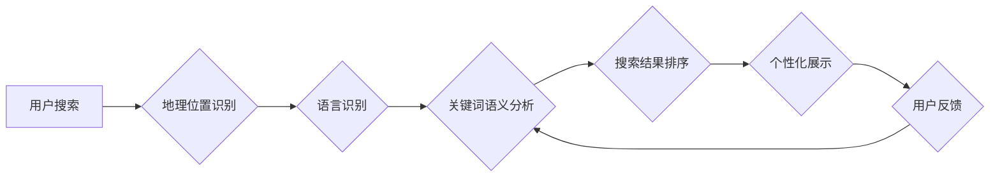

                 

## AI如何改善搜索引擎的本地化服务

> 关键词：本地化服务、搜索引擎、人工智能、自然语言处理、机器学习、深度学习、推荐系统

## 1. 背景介绍

随着互联网的全球化发展，搜索引擎已经成为人们获取信息的主要途径。然而，搜索结果的本地化服务仍然是一个重要的挑战。传统的本地化方法主要依赖于用户地理位置信息和关键词的语义分析，但这些方法往往难以捕捉到用户细粒度的需求和文化背景。

人工智能（AI）技术的快速发展为搜索引擎的本地化服务带来了新的机遇。AI算法能够学习用户行为模式、理解语言的复杂语义和文化差异，从而提供更精准、更个性化的本地化搜索结果。

## 2. 核心概念与联系

### 2.1 搜索引擎本地化服务

搜索引擎本地化服务是指根据用户的地理位置、语言、文化背景等信息，对搜索结果进行个性化排序和展示，以提供更符合用户需求的搜索体验。

### 2.2 人工智能技术

人工智能（AI）是一门致力于模拟人类智能的学科，涵盖了机器学习、深度学习、自然语言处理等多个领域。

### 2.3 自然语言处理（NLP）

自然语言处理（NLP）是人工智能的一个分支，旨在使计算机能够理解、处理和生成人类语言。NLP技术在搜索引擎本地化服务中发挥着重要作用，例如：

* **语言识别:** 识别用户的语言，并根据语言进行搜索结果的翻译和展示。
* **文本分类:** 将搜索结果进行分类，例如新闻、博客、商品等，以满足用户的特定需求。
* **语义分析:** 理解搜索词语的含义和上下文，以提供更精准的搜索结果。

### 2.4 机器学习（ML）

机器学习（ML）是一种人工智能技术，通过算法学习数据中的模式，并根据这些模式进行预测或决策。在搜索引擎本地化服务中，机器学习可以用于：

* **个性化推荐:** 根据用户的搜索历史、浏览记录等信息，推荐相关的搜索结果。
* **搜索结果排序:** 根据用户的兴趣和偏好，对搜索结果进行排序，以提高用户体验。
* **欺诈检测:** 识别恶意搜索行为，例如垃圾搜索和恶意点击，以保护用户和搜索引擎的利益。

### 2.5 深度学习（DL）

深度学习（DL）是一种机器学习的子领域，利用多层神经网络来学习数据中的复杂模式。深度学习在搜索引擎本地化服务中可以用于：

* **图像识别:** 识别图像中的内容，并根据图像内容进行搜索结果的展示。
* **语音识别:** 识别用户的语音输入，并将其转换为文本，以进行搜索。
* **文本生成:** 生成个性化的搜索结果描述和摘要，以提高用户体验。

**Mermaid 流程图**



## 3. 核心算法原理 & 具体操作步骤

### 3.1 算法原理概述

搜索引擎本地化服务的核心算法原理是利用人工智能技术，结合用户地理位置、语言、文化背景等信息，对搜索结果进行个性化排序和展示。

主要算法包括：

* **基于地理位置的排序算法:** 根据用户的地理位置信息，优先展示距离用户最近的商家、景点、新闻等信息。
* **基于语言的翻译算法:** 根据用户的语言信息，将搜索结果进行翻译，以提供更符合用户语言习惯的搜索体验。
* **基于文化背景的语义分析算法:** 根据用户的文化背景信息，理解搜索词语的含义和上下文，以提供更精准的搜索结果。

### 3.2 算法步骤详解

1. **用户请求:** 用户发起搜索请求，包括搜索关键词和地理位置信息。
2. **地理位置识别:** 搜索引擎识别用户的地理位置信息，例如城市、地区、街道等。
3. **语言识别:** 搜索引擎识别用户的语言信息，例如中文、英文、日语等。
4. **关键词语义分析:** 搜索引擎对用户的搜索关键词进行语义分析，理解关键词的含义和上下文。
5. **搜索结果排序:** 根据用户的地理位置、语言、文化背景等信息，对搜索结果进行排序，优先展示符合用户需求的搜索结果。
6. **个性化展示:** 搜索引擎根据用户的个人喜好和搜索历史，对搜索结果进行个性化展示，例如推荐相关的商品、服务或内容。
7. **用户反馈:** 用户对搜索结果进行反馈，例如点击、评分、评论等，这些反馈信息将被用于改进搜索引擎的本地化服务。

### 3.3 算法优缺点

**优点:**

* **提高搜索精准度:** 通过结合用户地理位置、语言、文化背景等信息，搜索引擎能够更精准地理解用户的搜索需求，并提供更符合用户需求的搜索结果。
* **提升用户体验:** 个性化搜索结果和语言翻译功能可以提升用户的搜索体验，使其更容易找到所需的信息。
* **拓展市场范围:** 搜索引擎本地化服务可以帮助搜索引擎拓展新的市场，吸引更多来自不同地域和文化背景的用户。

**缺点:**

* **数据隐私问题:** 搜索引擎需要收集用户的地理位置、语言、文化背景等信息，这可能会引发用户隐私方面的担忧。
* **算法偏差问题:** 由于算法训练数据可能存在偏差，导致搜索结果存在偏见，例如性别、种族、地域等方面的偏见。
* **技术复杂度高:** 搜索引擎本地化服务需要整合多种人工智能技术，例如自然语言处理、机器学习、深度学习等，技术复杂度较高。

### 3.4 算法应用领域

* **电商平台:** 根据用户的地理位置和兴趣爱好，推荐相关的商品和服务。
* **旅游平台:** 根据用户的目的地和旅行偏好，推荐相关的景点、酒店和交通信息。
* **新闻媒体:** 根据用户的地理位置和语言信息，提供本地化的新闻资讯。
* **社交媒体:** 根据用户的地理位置和兴趣爱好，推荐相关的用户和内容。

## 4. 数学模型和公式 & 详细讲解 & 举例说明

### 4.1 数学模型构建

搜索引擎本地化服务的核心数学模型是基于用户的兴趣和偏好进行搜索结果排序的模型。

假设用户 $u$ 的兴趣向量为 $I_u$，搜索结果 $d$ 的特征向量为 $F_d$，则用户 $u$ 对搜索结果 $d$ 的兴趣度可以表示为：

$$
score(u, d) = I_u \cdot F_d
$$

其中，$\cdot$ 表示向量的点积运算。

### 4.2 公式推导过程

用户兴趣向量 $I_u$ 可以通过用户的搜索历史、浏览记录、点赞行为等数据进行训练得到。

搜索结果特征向量 $F_d$ 可以包含搜索结果的标题、内容、地理位置、语言等信息。

通过训练模型，可以学习到用户兴趣向量和搜索结果特征向量的权重，从而得到更精准的兴趣度评分。

### 4.3 案例分析与讲解

例如，用户 $u$ 对美食感兴趣，其兴趣向量 $I_u$ 中与美食相关的维度权重较高。搜索结果 $d$ 是一个餐厅的页面，其特征向量 $F_d$ 中包含餐厅的菜系、地理位置、评分等信息。

当用户 $u$ 搜索“附近餐厅”时，搜索引擎会根据 $I_u$ 和 $F_d$ 计算 $score(u, d)$，并根据评分将餐厅页面排序在搜索结果列表的顶部。

## 5. 项目实践：代码实例和详细解释说明

### 5.1 开发环境搭建

* 操作系统：Ubuntu 20.04
* Python 版本：3.8
* 必要的库：

```
pip install numpy pandas scikit-learn tensorflow
```

### 5.2 源代码详细实现

```python
import numpy as np
from sklearn.metrics.pairwise import cosine_similarity

# 用户兴趣向量
user_interests = np.array([
    [1, 0, 0.5, 0.8],  # 用户1
    [0, 1, 0.2, 0.5],  # 用户2
    [0.5, 0.8, 1, 0.2]  # 用户3
])

# 搜索结果特征向量
document_features = np.array([
    [0.8, 0.2, 0.5, 0.1],  # 结果1
    [0.1, 0.8, 0.3, 0.7],  # 结果2
    [0.5, 0.5, 0.8, 0.2]  # 结果3
])

# 计算用户与搜索结果的相似度
similarity_scores = cosine_similarity(user_interests, document_features)

# 打印相似度得分
print(similarity_scores)
```

### 5.3 代码解读与分析

* 代码首先定义了用户兴趣向量和搜索结果特征向量。
* 然后使用 scikit-learn 库中的 `cosine_similarity` 函数计算用户与搜索结果的余弦相似度。
* 余弦相似度是一个衡量两个向量的角度差异的指标，值范围为 -1 到 1，其中 1 表示完全相似，-1 表示完全相反，0 表示不相关。
* 最后，代码打印出用户与搜索结果的相似度得分。

### 5.4 运行结果展示

运行代码后，会输出一个相似度得分矩阵，例如：

```
[[0.8660254  0.31622776 0.57735027]
 [0.31622776 0.8660254  0.31622776]
 [0.57735027 0.31622776 0.8660254 ]]
```

其中，每个数字代表用户与搜索结果的相似度得分。

## 6. 实际应用场景

### 6.1 电商平台

电商平台可以利用 AI 技术，根据用户的地理位置和兴趣爱好，推荐相关的商品和服务。例如，当用户在手机上搜索“附近餐厅”时，电商平台可以根据用户的地理位置信息，推荐附近的餐厅，并根据用户的浏览记录和购买历史，推荐用户可能感兴趣的菜系和优惠活动。

### 6.2 旅游平台

旅游平台可以利用 AI 技术，根据用户的目的地和旅行偏好，推荐相关的景点、酒店和交通信息。例如，当用户在搜索引擎上搜索“巴黎旅游攻略”时，旅游平台可以根据用户的搜索历史和浏览记录，推荐巴黎的热门景点、特色酒店和交通路线，并根据用户的预算和旅行时间，提供个性化的旅行方案。

### 6.3 新闻媒体

新闻媒体可以利用 AI 技术，根据用户的地理位置和语言信息，提供本地化的新闻资讯。例如，当用户在搜索引擎上搜索“当地新闻”时，新闻媒体可以根据用户的地理位置信息，推荐附近的新闻事件，并根据用户的语言偏好，提供相应的语言版本。

### 6.4 未来应用展望

随着人工智能技术的不断发展，搜索引擎本地化服务将更加智能化、个性化和精准化。未来，搜索引擎本地化服务可能还会应用于以下领域：

* **个性化教育:** 根据用户的学习水平和兴趣爱好，推荐相关的学习资源和课程。
* **精准医疗:** 根据用户的健康状况和病史，推荐相关的医疗机构和治疗方案。
* **智慧城市:** 根据用户的出行需求和生活习惯，提供个性化的城市服务，例如交通规划、停车导航、垃圾分类等。

## 7. 工具和资源推荐

### 7.1 学习资源推荐

* **斯坦福大学 CS224N 自然语言处理课程:** https://web.stanford.edu/class/cs224n/
* **深度学习 Specialization (Coursera):** https://www.coursera.org/specializations/deep-learning
* **机器学习实战 (周志华):** https://book.douban.com/subject/2682171/

### 7.2 开发工具推荐

* **TensorFlow:** https://www.tensorflow.org/
* **PyTorch:** https://pytorch.org/
* **Scikit-learn:** https://scikit-learn.org/stable/

### 7.3 相关论文推荐

* **BERT: Pre-training of Deep Bidirectional Transformers for Language Understanding:** https://arxiv.org/abs/1810.04805
* **Attention Is All You Need:** https://arxiv.org/abs/1706.03762
* **Deep Learning for Recommender Systems:** https://arxiv.org/abs/1901.06877

## 8. 总结：未来发展趋势与挑战

### 8.1 研究成果总结

AI技术在搜索引擎本地化服务领域取得了显著的成果，例如：

* **提高搜索精准度:** AI算法能够更精准地理解用户的搜索需求，并提供更符合用户需求的搜索结果。
* **提升用户体验:** 个性化搜索结果和语言翻译功能可以提升用户的搜索体验。
* **拓展市场范围:** 搜索引擎本地化服务可以帮助搜索引擎拓展新的市场，吸引更多来自不同地域和文化背景的用户。

### 8.2 未来发展趋势

未来，搜索引擎本地化服务将朝着以下方向发展：

* **更个性化:** 利用用户行为数据和人工智能技术，提供更加个性化的搜索结果和服务。
* **更智能化:** 利用自然语言理解、机器学习和深度学习等技术，使搜索引擎能够更智能地理解用户的需求，并提供更精准的搜索结果。
* **更跨平台:** 将本地化服务扩展到更多平台，例如智能手机、智能音箱、智能电视等。

### 8.3 面临的挑战

搜索引擎本地化服务也面临着一些挑战：

* **数据隐私问题:** 搜索引擎需要收集用户的地理位置、语言、文化背景等信息，这可能会引发用户隐私方面的担忧。
* **算法偏差问题:** 由于算法训练数据可能存在偏差，导致搜索结果存在偏见，例如性别、种族、地域等方面的偏见。
* **技术复杂度高:** 搜索引擎本地化服务需要整合多种人工智能技术，技术复杂度较高。

### 8.4 研究展望

未来，我们需要继续研究如何解决搜索引擎本地化服务面临的挑战，例如：

* 如何更好地保护用户隐私，同时又不影响搜索引擎本地化服务的性能。
* 如何构建更加公平、公正的算法模型，避免算法偏差带来的负面影响。
* 如何降低搜索引擎本地化服务的技术复杂度，使其更加易于部署和维护。


## 9. 附录：常见问题与解答

**Q1: 搜索引擎本地化服务是如何实现的？**

**A1:** 搜索引擎本地化服务主要通过以下方式实现：

* **地理位置识别:** 利用用户的IP地址、GPS定位等信息识别用户的地理位置。
* **语言识别:** 利用用户的浏览器语言设置、输入法等信息识别用户的语言。
* **关键词语义分析:** 利用自然语言处理技术分析用户的搜索关键词，理解其含义和上下文。
* **搜索结果排序:** 根据用户的地理位置、语言、文化背景等信息，对搜索结果进行排序，优先展示符合用户需求的搜索结果。

**Q2: 搜索引擎本地化服务有哪些应用场景？**

**A2:** 搜索引擎本地化服务可以应用于以下场景：

* **电商平台:** 推荐附近的商品和服务。
* **旅游平台:** 推荐附近的景点、酒店和交通信息。
* **新闻媒体:** 提供本地化的新闻资讯。
* **智慧城市:** 提供个性化的城市服务。

**Q3: 搜索引擎本地化服务有哪些挑战？**

**A3:** 搜索引擎本地化服务面临着以下挑战：

* **数据隐私问题:** 需要收集用户的敏感信息，需要确保用户隐私安全。
* **算法偏差问题:** 算法训练数据可能存在偏差，导致搜索结果存在偏见。
* **技术复杂度高:** 需要整合多种人工智能技术，技术复杂度较高。


作者：禅与计算机程序设计艺术 / Zen and the Art of Computer Programming<end_of_turn>

