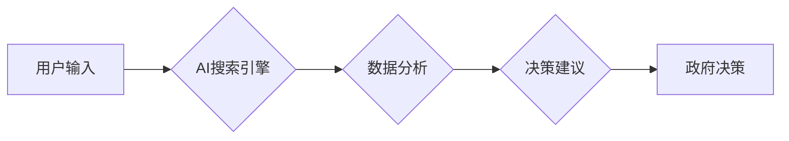

                 

## AI搜索引擎如何改变政府决策过程

> 关键词：人工智能、搜索引擎、政府决策、数据分析、机器学习、自然语言处理、可解释性、透明度

## 1. 背景介绍

在当今数据爆炸的时代，政府决策面临着前所未有的挑战。传统决策模式依赖于有限的专家知识和历史数据，难以应对复杂、多变的社会问题。人工智能（AI）技术的快速发展为政府决策提供了新的机遇。其中，AI搜索引擎作为一种强大的信息处理工具，能够帮助政府更有效地收集、分析和利用数据，从而做出更明智、更科学的决策。

政府决策涉及到广泛的领域，例如经济政策、社会福利、环境保护、公共安全等。这些领域的数据往往是分散、异构、海量的，难以进行有效整合和分析。AI搜索引擎能够通过自然语言处理（NLP）技术理解和处理复杂的人文文本，并结合机器学习（ML）算法从海量数据中挖掘出隐藏的模式和趋势。

## 2. 核心概念与联系

**2.1 核心概念**

* **AI搜索引擎:** 基于人工智能技术的搜索引擎，能够理解用户意图，并提供更精准、更相关的搜索结果。
* **数据分析:** 从数据中提取有价值的信息，用于支持决策。
* **机器学习:** 使计算机能够从数据中学习，并根据学习到的知识进行预测或分类。
* **自然语言处理:** 使计算机能够理解和处理人类语言。

**2.2 架构图**



**2.3 联系**

AI搜索引擎通过NLP技术理解用户输入，并将其转换为机器可理解的格式。然后，AI搜索引擎利用ML算法从海量数据中分析和挖掘信息，并生成决策建议。政府决策者可以根据这些建议进行决策。

## 3. 核心算法原理 & 具体操作步骤

**3.1 算法原理概述**

AI搜索引擎的核心算法原理包括信息检索、文本分析、机器学习等。

* **信息检索:** 旨在从海量数据中找到与用户查询相关的文档。常用的信息检索算法包括TF-IDF、BM25等。
* **文本分析:** 旨在理解文本的语义和结构。常用的文本分析技术包括词性标注、依存句法分析、主题建模等。
* **机器学习:** 旨在从数据中学习，并根据学习到的知识进行预测或分类。常用的机器学习算法包括支持向量机、决策树、神经网络等。

**3.2 算法步骤详解**

1. **数据预处理:** 对原始数据进行清洗、格式化和转换，使其能够被AI模型处理。
2. **特征提取:** 从文本数据中提取特征，例如关键词、词性、语法结构等。
3. **模型训练:** 利用机器学习算法对训练数据进行训练，学习到文本表示和关系。
4. **查询处理:** 对用户查询进行分析，并将其转换为机器可理解的格式。
5. **结果排序:** 根据模型预测结果，对搜索结果进行排序，并返回给用户。

**3.3 算法优缺点**

* **优点:** 能够处理海量数据，提供精准的搜索结果，并根据用户历史行为进行个性化推荐。
* **缺点:** 需要大量的训练数据，模型训练成本高，且模型的解释性较差。

**3.4 算法应用领域**

AI搜索引擎广泛应用于政府决策、法律研究、医疗诊断、金融分析等领域。

## 4. 数学模型和公式 & 详细讲解 & 举例说明

**4.1 数学模型构建**

AI搜索引擎的核心数学模型是信息检索模型，例如TF-IDF模型。

**4.2 公式推导过程**

TF-IDF模型的核心公式如下：

$$TF-IDF(t, d) = TF(t, d) \times IDF(t)$$

其中：

* $TF(t, d)$ 表示词语 $t$ 在文档 $d$ 中的词频。
* $IDF(t)$ 表示词语 $t$ 在整个语料库中的逆向文档频率。

**4.3 案例分析与讲解**

假设我们有一个语料库包含1000个文档，其中“人工智能”这个词语出现在100个文档中。那么，$IDF(人工智能)$ = log(1000/100) = 1。

如果一个文档包含5个“人工智能”这个词语，那么$TF(人工智能, d)$ = 5。

因此，这个文档中“人工智能”这个词语的TF-IDF值 = 5 * 1 = 5。

**4.4 举例说明**

TF-IDF值越高，表示该词语在该文档中越重要。

## 5. 项目实践：代码实例和详细解释说明

**5.1 开发环境搭建**

* Python 3.x
* scikit-learn
* NLTK
* Gensim

**5.2 源代码详细实现**

```python
from sklearn.feature_extraction.text import TfidfVectorizer
from nltk.corpus import stopwords

# 加载停用词列表
stop_words = set(stopwords.words('english'))

# 定义文本预处理函数
def preprocess_text(text):
    # 转换为小写
    text = text.lower()
    # 去除停用词
    words = [word for word in text.split() if word not in stop_words]
    # 返回处理后的文本
    return ' '.join(words)

# 定义训练数据
documents = [
    "This is the first document.",
    "This document is the second document.",
    "And this is the third one.",
    "Is this the first document?"
]

# 预处理文本数据
processed_documents = [preprocess_text(doc) for doc in documents]

# 创建TF-IDF向量化器
vectorizer = TfidfVectorizer()

# 将文本数据转换为TF-IDF向量
tfidf_matrix = vectorizer.fit_transform(processed_documents)

# 打印TF-IDF矩阵
print(tfidf_matrix.toarray())
```

**5.3 代码解读与分析**

这段代码演示了如何使用scikit-learn库中的TF-IDF向量化器对文本数据进行处理。

首先，定义了文本预处理函数，用于将文本转换为小写并去除停用词。

然后，定义了训练数据，并使用预处理函数对文本数据进行处理。

接着，创建了TF-IDF向量化器，并使用它将文本数据转换为TF-IDF向量。

最后，打印了TF-IDF矩阵，其中每个行代表一个文档，每个列代表一个词语，每个元素代表该词语在该文档中的TF-IDF值。

**5.4 运行结果展示**

运行这段代码后，会输出一个TF-IDF矩阵，其中每个元素代表该词语在该文档中的TF-IDF值。

## 6. 实际应用场景

**6.1 政策制定**

AI搜索引擎可以帮助政府分析社会热点、民意趋势和政策效果，为政策制定提供数据支持。例如，可以分析社交媒体数据，了解公众对特定政策的看法，并根据这些反馈进行调整。

**6.2 危机管理**

在突发事件发生时，AI搜索引擎可以帮助政府快速收集和分析相关信息，例如灾害情况、人员伤亡、物资需求等，以便做出及时有效的应对措施。

**6.3 公共服务**

AI搜索引擎可以帮助政府提供更便捷、更智能的公共服务，例如在线办理证件、查询政策信息、预约医疗服务等。

**6.4 未来应用展望**

随着AI技术的不断发展，AI搜索引擎在政府决策中的应用场景将更加广泛。例如，可以利用AI技术进行预测分析，帮助政府预判未来趋势，制定更有效的政策。

## 7. 工具和资源推荐

**7.1 学习资源推荐**

* **书籍:**
    * 《深度学习》
    * 《机器学习实战》
    * 《自然语言处理入门》
* **在线课程:**
    * Coursera
    * edX
    * Udacity

**7.2 开发工具推荐**

* **Python:** 
    * scikit-learn
    * NLTK
    * Gensim
* **云平台:**
    * AWS
    * Azure
    * Google Cloud

**7.3 相关论文推荐**

* **BERT:** Devlin et al. (2018)
* **GPT-3:** Brown et al. (2020)
* **Transformer:** Vaswani et al. (2017)

## 8. 总结：未来发展趋势与挑战

**8.1 研究成果总结**

AI搜索引擎在政府决策中的应用取得了显著成果，例如提高了决策效率、准确性和透明度。

**8.2 未来发展趋势**

* **更强大的AI模型:** 随着AI技术的不断发展，将会有更强大的AI模型用于政府决策，例如能够理解复杂语义、进行多模态分析的模型。
* **更个性化的决策支持:** AI搜索引擎将能够根据政府决策者的个人偏好和经验，提供更个性化的决策支持。
* **更注重可解释性:** 为了提高决策的透明度和可信度，AI搜索引擎将更加注重可解释性，能够解释其决策依据。

**8.3 面临的挑战**

* **数据质量:** AI搜索引擎的性能依赖于数据质量，政府需要确保数据的准确性、完整性和时效性。
* **算法偏见:** AI算法可能存在偏见，需要进行充分的测试和评估，以避免算法歧视。
* **伦理问题:** AI搜索引擎的应用可能引发一些伦理问题，例如隐私保护、算法透明度等，需要进行深入的探讨和研究。

**8.4 研究展望**

未来，AI搜索引擎将继续在政府决策领域发挥重要作用，帮助政府做出更明智、更科学的决策。


## 9. 附录：常见问题与解答

**9.1 如何评估AI搜索引擎的性能？**

常用的评估指标包括准确率、召回率、F1-score等。

**9.2 如何解决AI搜索引擎的算法偏见问题？**

可以通过数据预处理、算法设计和模型评估等方式来解决算法偏见问题。

**9.3 如何确保AI搜索引擎的透明度和可解释性？**

可以通过使用可解释性AI算法、提供决策依据解释等方式来提高AI搜索引擎的透明度和可解释性。


作者：禅与计算机程序设计艺术 / Zen and the Art of Computer Programming 
<end_of_turn>

