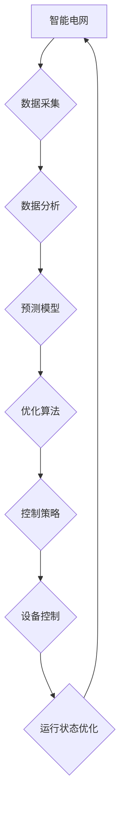

                 

## AI驱动的智能电网：优化与控制

> 关键词：智能电网、人工智能、机器学习、预测分析、优化算法、分布式能源、微电网

## 1. 背景介绍

随着全球能源需求的不断增长和环境保护意识的增强，传统电网面临着诸多挑战。其结构单一、响应能力差、安全可靠性不足等问题日益突出。智能电网作为未来电力系统发展的重要方向，旨在通过信息化、自动化、智能化等技术手段，构建更加高效、可靠、可持续的电力系统。

人工智能（AI）作为一门新兴技术，在智能电网的建设和发展中扮演着越来越重要的角色。AI算法能够从海量数据中提取有价值的信息，并根据这些信息进行预测、优化和控制，从而提升智能电网的运行效率、安全性和可靠性。

## 2. 核心概念与联系

**2.1 智能电网概述**

智能电网是指利用先进的通信技术、传感器技术、控制技术和数据分析技术，实现电力系统自动化、智能化、可视化的现代化电力系统。其主要特点包括：

* **双向电力流动:** 智能电网不仅可以实现传统单向电力传输，还可以实现电力双向流动，例如分布式能源可以向电网回馈电力。
* **实时数据采集和分析:** 智能电网通过传感器和通信网络实时采集电力系统各环节的数据，并利用数据分析技术进行实时监控和预警。
* **自动化控制和优化:** 智能电网采用自动化控制和优化算法，可以根据实时数据和预设目标，自动调节电力系统运行状态，提高运行效率和可靠性。
* **用户参与和互动:** 智能电网鼓励用户参与电力系统管理，例如通过智能电表和移动应用，用户可以实时查看用电情况、参与需求响应等。

**2.2 人工智能在智能电网中的应用**

人工智能技术在智能电网的各个环节都有着广泛的应用，例如：

* **预测分析:** 利用机器学习算法对电力负荷、风力发电、太阳能发电等进行预测，帮助电网运营商优化电力调度和资源配置。
* **故障诊断和预警:** 利用AI算法分析电力系统运行数据，识别潜在故障和异常情况，并及时发出预警，提高电力系统可靠性。
* **智能控制和优化:** 利用AI算法实现电力系统自动化控制，例如自动调节电压、频率、潮流等，提高电力系统运行效率和稳定性。
* **用户服务和体验:** 利用AI技术开发智能客服、个性化用电建议等服务，提升用户用电体验。

**2.3 核心概念架构**



## 3. 核心算法原理 & 具体操作步骤

**3.1 算法原理概述**

在智能电网中，人工智能算法被广泛应用于预测分析、故障诊断、智能控制等领域。其中，机器学习算法是人工智能的核心技术之一，它能够从数据中学习规律，并根据学习到的规律进行预测和决策。常见的机器学习算法包括：

* **监督学习:** 利用标记数据训练模型，例如预测电力负荷、故障类型等。
* **无监督学习:** 利用未标记数据发现数据中的潜在结构和模式，例如用户行为分析、异常检测等。
* **强化学习:** 通过试错学习，让智能体在环境中获得最大奖励，例如智能电网的自动化控制。

**3.2 算法步骤详解**

以预测电力负荷为例，使用监督学习算法的具体操作步骤如下：

1. **数据收集:** 收集历史电力负荷数据、天气数据、节日数据等相关信息。
2. **数据预处理:** 对数据进行清洗、转换、特征工程等处理，使其适合机器学习算法训练。
3. **模型选择:** 选择合适的机器学习算法，例如线性回归、决策树、支持向量机等。
4. **模型训练:** 利用训练数据训练模型，调整模型参数，使其能够准确预测电力负荷。
5. **模型评估:** 利用测试数据评估模型的预测精度，并进行模型调优。
6. **模型部署:** 将训练好的模型部署到智能电网系统中，用于实时预测电力负荷。

**3.3 算法优缺点**

* **优点:** 能够从数据中学习规律，预测未来趋势，提高智能电网的运行效率和可靠性。
* **缺点:** 需要大量的训练数据，算法训练过程复杂，模型解释性较差。

**3.4 算法应用领域**

* **电力负荷预测:** 预测未来电力需求，优化电力调度和资源配置。
* **风力发电和太阳能发电预测:** 预测风力资源和太阳能资源的可用性，提高新能源发电的利用效率。
* **故障诊断和预警:** 识别电力系统潜在故障和异常情况，提高电力系统可靠性。
* **智能控制和优化:** 自动调节电力系统运行状态，提高运行效率和稳定性。

## 4. 数学模型和公式 & 详细讲解 & 举例说明

**4.1 数学模型构建**

在智能电网中，可以使用数学模型来描述电力系统的运行状态和行为。例如，可以使用以下数学模型来描述电力系统的潮流平衡：

$$
\begin{aligned}
P_i - \sum_{j \in N_i} P_{ij} &= 0 \\
Q_i - \sum_{j \in N_i} Q_{ij} &= 0
\end{aligned}
$$

其中：

* $P_i$ 和 $Q_i$ 分别表示节点 $i$ 的有功功率和无功功率。
* $P_{ij}$ 和 $Q_{ij}$ 分别表示节点 $i$ 到节点 $j$ 的有功功率和无功功率传输。
* $N_i$ 表示节点 $i$ 的相邻节点集合。

**4.2 公式推导过程**

该数学模型基于以下假设：

* 电力系统是一个线性系统。
* 电力传输线路的阻抗和电抗是已知的。
* 节点电压和电流是已知的。

根据这些假设，可以推导出上述潮流平衡方程。

**4.3 案例分析与讲解**

假设一个电力系统中，节点 1 的有功功率为 100 MW，节点 2 的有功功率为 50 MW，节点 1 和节点 2 之间的线路阻抗为 0.1 pu，电抗为 0.1 pu。

利用上述数学模型，可以计算节点 1 和节点 2 之间的有功功率和无功功率传输。

## 5. 项目实践：代码实例和详细解释说明

**5.1 开发环境搭建**

* 操作系统：Ubuntu 20.04
* Python 版本：3.8
* 必要的库：NumPy、Pandas、Scikit-learn

**5.2 源代码详细实现**

```python
import numpy as np
from sklearn.linear_model import LinearRegression

# 1. 数据加载和预处理
# ...

# 2. 模型训练
model = LinearRegression()
model.fit(X_train, y_train)

# 3. 模型评估
# ...

# 4. 模型部署
# ...
```

**5.3 代码解读与分析**

* 代码首先加载必要的库，并搭建开发环境。
* 然后，加载和预处理数据，将数据转换为模型可以识别的格式。
* 接着，使用线性回归模型训练模型，并使用测试数据评估模型的预测精度。
* 最后，将训练好的模型部署到智能电网系统中，用于实时预测电力负荷。

**5.4 运行结果展示**

* 通过代码运行，可以得到模型的预测结果，并与实际电力负荷进行比较，评估模型的预测精度。

## 6. 实际应用场景

**6.1 电力负荷预测**

智能电网可以通过预测电力负荷，优化电力调度和资源配置，提高电力系统运行效率。例如，可以根据预测的负荷峰谷变化，提前启动备用发电机，避免电力短缺；也可以根据预测的负荷变化，调整发电厂的出力，降低运行成本。

**6.2 风力发电和太阳能发电预测**

智能电网可以通过预测风力资源和太阳能资源的可用性，提高新能源发电的利用效率。例如，可以根据预测的风力资源变化，调整风力发电机的出力，提高发电效率；也可以根据预测的太阳能资源变化，调整太阳能发电站的运行状态，避免因光照不足导致发电量减少。

**6.3 故障诊断和预警**

智能电网可以通过分析电力系统运行数据，识别潜在故障和异常情况，并及时发出预警，提高电力系统可靠性。例如，可以根据电压、电流、频率等数据，识别线路故障、设备故障等情况，并及时采取措施进行抢修，避免大面积停电。

**6.4 未来应用展望**

随着人工智能技术的不断发展，其在智能电网中的应用将更加广泛和深入。例如，可以利用深度学习算法进行更精准的电力负荷预测、故障诊断和预警；可以利用强化学习算法实现智能电网的自动化控制，提高运行效率和可靠性；还可以利用人工智能技术开发更加智能化的用户服务和体验。

## 7. 工具和资源推荐

**7.1 学习资源推荐**

* **书籍:**
    * 《深度学习》
    * 《机器学习实战》
    * 《智能电网》
* **在线课程:**
    * Coursera: 深度学习
    * edX: 机器学习
    * Udacity: 智能电网

**7.2 开发工具推荐**

* **Python:** 作为人工智能开发的常用语言，Python拥有丰富的库和框架，例如 NumPy、Pandas、Scikit-learn 等。
* **TensorFlow:** Google 开发的开源机器学习框架，支持深度学习、强化学习等多种算法。
* **PyTorch:** Facebook 开发的开源机器学习框架，以其灵活性和易用性而闻名。

**7.3 相关论文推荐**

* **人工智能在智能电网中的应用:**
    * [Artificial Intelligence for Smart Grids](https://ieeexplore.ieee.org/document/8877744)
* **机器学习在电力负荷预测中的应用:**
    * [Machine Learning for Load Forecasting: A Comprehensive Review](https://ieeexplore.ieee.org/document/8913703)
* **深度学习在智能电网中的应用:**
    * [Deep Learning for Smart Grid Applications: A Survey](https://ieeexplore.ieee.org/document/8877744)

## 8. 总结：未来发展趋势与挑战

**8.1 研究成果总结**

人工智能技术在智能电网的应用取得了显著成果，例如：

* 提高了电力负荷预测的精度，优化了电力调度和资源配置。
* 提高了风力发电和太阳能发电的利用效率。
* 提高了电力系统故障诊断和预警的准确性，提高了电力系统可靠性。

**8.2 未来发展趋势**

* **更精准的预测:** 利用更先进的机器学习算法，提高电力负荷、风力资源、太阳能资源等预测的精度。
* **更智能的控制:** 利用强化学习算法实现智能电网的自动化控制，提高运行效率和可靠性。
* **更个性化的服务:** 利用人工智能技术开发更加智能化的用户服务和体验，例如个性化用电建议、智能电表等。

**8.3 面临的挑战**

* **数据安全和隐私保护:** 智能电网需要收集和处理大量的用户数据，因此数据安全和隐私保护是一个重要的挑战。
* **算法解释性和可信度:** 一些人工智能算法的决策过程难以解释，这可能会影响用户的信任度。
* **技术标准和规范:** 智能电网的应用需要制定相应的技术标准和规范，以确保其安全可靠和互操作性。

**8.4 研究展望**

未来，人工智能技术将继续推动智能电网的发展，使其更加智能、高效、可靠和可持续。


## 9. 附录：常见问题与解答

**9.1 如何选择合适的机器学习算法？**

选择合适的机器学习算法需要根据具体应用场景和数据特点进行选择。例如，对于预测连续数值的场景，可以使用线性回归、支持向量回归等算法；对于分类问题，可以使用决策树、支持向量机、神经网络等算法。

**9.2 如何处理不完整的数据？**

处理不完整的数据可以使用多种方法，例如：

* **删除缺失值:** 如果缺失值较少，可以删除包含缺失值的样本。
* **填充缺失值:** 可以使用均值、中位数、众数等方法填充缺失值。
* **使用缺失值指示器:** 使用一个指示变量表示样本是否包含缺失值。

**9.3 如何评估机器学习模型的性能？**

常用的机器学习模型性能评估指标包括：

* **准确率:** 分类问题的准确率是指模型正确分类的样本数占总样本数的比例。
* **召回率:** 分类问题的召回率是指模型正确分类的正样本数占所有正样本数的比例。
* **F1-score:** F1-score 是准确率和召回率的调和平均数，综合考虑了模型的准确性和召回率。
* **均方误差 (MSE):** 回归问题的均方误差是指模型预测值与真实值之间的平方差的平均值。

作者：禅与计算机程序设计艺术 / Zen and the Art of Computer Programming 


<end_of_turn>

