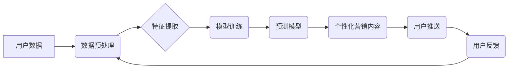

                 

## AI驱动的电商平台精准营销活动自动化

> 关键词：电商平台、精准营销、人工智能、机器学习、深度学习、推荐系统、自动化营销

## 1. 背景介绍

在当今数据爆炸的时代，电商平台面临着巨大的挑战和机遇。消费者日益增长的个性化需求和信息过载，使得传统的营销方式难以有效触达目标用户。精准营销成为电商平台提升转化率、提高用户体验的关键。而人工智能（AI）技术的快速发展为精准营销提供了强大的工具和手段。

AI驱动的精准营销活动自动化，是指利用人工智能技术，自动分析用户数据，识别用户画像，并根据用户行为、偏好等信息，精准推送个性化营销内容，实现营销活动的自动化和智能化。

## 2. 核心概念与联系

### 2.1  电商平台精准营销

电商平台精准营销是指通过对用户进行细分，针对不同用户群体的特点和需求，进行个性化的营销推广。其目标是提高营销活动的效率，降低营销成本，并提升用户体验。

### 2.2  人工智能（AI）

人工智能是指模拟人类智能行为的计算机系统。AI技术涵盖了机器学习、深度学习、自然语言处理、计算机视觉等多个领域。

### 2.3  机器学习（ML）

机器学习是人工智能的一个分支，它通过算法训练模型，使模型能够从数据中学习，并做出预测或决策。

### 2.4  深度学习（DL）

深度学习是机器学习的一个子集，它利用多层神经网络来模拟人类大脑的学习过程，能够处理更复杂的数据，并取得更优的性能。

### 2.5  推荐系统

推荐系统是基于用户行为和偏好，推荐用户感兴趣的内容或商品的系统。推荐系统是精准营销的重要组成部分，能够帮助电商平台提高用户粘性，促进销售。

**核心概念与架构流程图**



## 3. 核心算法原理 & 具体操作步骤

### 3.1  算法原理概述

AI驱动的电商平台精准营销活动自动化主要依赖于机器学习算法，例如协同过滤、内容过滤、混合推荐等。这些算法通过分析用户行为数据，识别用户兴趣和偏好，并预测用户可能感兴趣的商品或服务。

### 3.2  算法步骤详解

1. **数据收集与预处理:** 收集用户行为数据，例如浏览记录、购买历史、评价信息等，并进行清洗、转换、编码等预处理操作。

2. **特征提取:** 从用户数据中提取特征，例如用户年龄、性别、地理位置、购买频率、商品类别偏好等。

3. **模型训练:** 选择合适的机器学习算法，并利用训练数据训练模型。

4. **模型评估:** 使用测试数据评估模型的性能，例如准确率、召回率、F1-score等。

5. **模型部署:** 将训练好的模型部署到电商平台，并实时进行预测和推荐。

6. **结果分析与优化:** 分析模型的推荐结果，并根据用户反馈进行模型优化。

### 3.3  算法优缺点

**优点:**

* **精准度高:** 基于用户行为数据，能够精准识别用户兴趣和偏好。
* **自动化程度高:** 可以自动完成营销活动，节省人力成本。
* **可扩展性强:** 可以根据用户数据规模和需求进行扩展。

**缺点:**

* **数据依赖性强:** 需要大量高质量的用户数据才能训练出有效的模型。
* **算法复杂度高:** 需要专业的技术人员进行模型开发和维护。
* **隐私安全问题:** 需要妥善处理用户隐私数据。

### 3.4  算法应用领域

AI驱动的精准营销活动自动化在电商平台、社交媒体、金融服务、医疗保健等多个领域都有广泛的应用。

## 4. 数学模型和公式 & 详细讲解 & 举例说明

### 4.1  数学模型构建

在推荐系统中，常用的数学模型包括协同过滤模型和内容过滤模型。

**协同过滤模型:**

协同过滤模型基于用户的行为相似性进行推荐。假设用户A和用户B都喜欢商品X，那么用户A可能也喜欢用户B喜欢的其他商品。协同过滤模型通常使用矩阵分解技术来学习用户和商品之间的隐向量表示，并根据这些表示进行推荐。

**内容过滤模型:**

内容过滤模型基于商品的特征进行推荐。假设用户A喜欢商品X，并且商品X的特征包括“颜色”、“品牌”和“价格”，那么用户A可能也喜欢其他具有相同特征的商品。内容过滤模型通常使用机器学习算法，例如逻辑回归或支持向量机，来学习商品特征和用户偏好之间的关系。

### 4.2  公式推导过程

**协同过滤模型的矩阵分解公式:**

$$
R = U V^T
$$

其中：

* $R$ 是用户-商品评分矩阵。
* $U$ 是用户特征矩阵。
* $V$ 是商品特征矩阵。

**内容过滤模型的逻辑回归公式:**

$$
P(y=1|x) = \frac{1}{1+e^{-(w^Tx+b)}}
$$

其中：

* $P(y=1|x)$ 是用户点击商品的概率。
* $x$ 是商品特征向量。
* $w$ 是模型参数向量。
* $b$ 是模型偏置项。

### 4.3  案例分析与讲解

**案例:** 假设一个电商平台想要推荐用户可能感兴趣的书籍。

**协同过滤模型:**

* 首先，收集用户对书籍的评分数据。
* 然后，使用矩阵分解技术对用户和书籍进行特征提取。
* 最后，根据用户和书籍的特征向量，预测用户对其他书籍的评分。

**内容过滤模型:**

* 首先，提取书籍的特征，例如作者、出版社、主题、价格等。
* 然后，使用机器学习算法，例如逻辑回归，学习书籍特征和用户偏好之间的关系。
* 最后，根据用户对书籍特征的偏好，推荐用户可能感兴趣的书籍。

## 5. 项目实践：代码实例和详细解释说明

### 5.1  开发环境搭建

* Python 3.x
* TensorFlow 或 PyTorch
* Scikit-learn
* Pandas
* NumPy

### 5.2  源代码详细实现

```python
# 协同过滤模型示例代码

import pandas as pd
from sklearn.metrics.pairwise import cosine_similarity

# 加载用户-商品评分数据
ratings_data = pd.read_csv('ratings.csv')

# 计算用户-用户相似度矩阵
user_similarity = cosine_similarity(ratings_data.T)

# 获取用户ID
user_id = 1

# 获取用户ID对应的相似用户
similar_users = user_similarity[user_id].argsort()[:-10:-1]

# 获取相似用户喜欢的商品
similar_users_ratings = ratings_data.iloc[similar_users, :]

# 计算商品评分平均值
average_ratings = similar_users_ratings.mean(axis=0)

# 获取评分最高的商品
top_recommendations = average_ratings.sort_values(ascending=False).index

# 打印推荐结果
print(f'用户 {user_id} 的推荐商品：{top_recommendations}')
```

### 5.3  代码解读与分析

* 代码首先加载用户-商品评分数据。
* 然后，使用cosine_similarity函数计算用户-用户相似度矩阵。
* 根据用户ID，获取相似用户列表。
* 从相似用户喜欢的商品中计算商品评分平均值。
* 最后，根据商品评分平均值，获取评分最高的商品作为推荐结果。

### 5.4  运行结果展示

运行上述代码，将输出用户ID对应的推荐商品列表。

## 6. 实际应用场景

AI驱动的电商平台精准营销活动自动化在以下场景中具有广泛的应用：

### 6.1  个性化商品推荐

根据用户的浏览历史、购买记录、评价信息等数据，推荐用户可能感兴趣的商品。

### 6.2  精准广告投放

根据用户的兴趣爱好、行为特征等数据，精准投放广告，提高广告转化率。

### 6.3  用户画像分析

分析用户的行为数据，构建用户画像，了解用户的需求和偏好。

### 6.4  营销活动优化

根据营销活动的实时数据，优化营销策略，提高营销活动的效率。

## 7. 工具和资源推荐

### 7.1  学习资源推荐

* **书籍:**
    * 《深度学习》
    * 《机器学习实战》
    * 《推荐系统实践》
* **在线课程:**
    * Coursera: 深度学习
    * Udacity: 机器学习工程师
    * edX: 推荐系统

### 7.2  开发工具推荐

* **Python:** 
    * TensorFlow
    * PyTorch
    * Scikit-learn
* **云平台:**
    * AWS
    * Azure
    * Google Cloud

### 7.3  相关论文推荐

* **协同过滤:**
    * "Collaborative Filtering for Implicit Feedback Datasets"
    * "Matrix Factorization Techniques for Recommender Systems"
* **内容过滤:**
    * "Content-Based Recommendation Systems"
    * "A Survey of Content-Based Recommendation Systems"

## 8. 总结：未来发展趋势与挑战

### 8.1  研究成果总结

AI驱动的电商平台精准营销活动自动化取得了显著的成果，能够有效提高营销活动的效率和转化率。

### 8.2  未来发展趋势

* **更精准的推荐:** 利用更先进的机器学习算法和数据分析技术，实现更精准的商品推荐。
* **更个性化的营销:** 根据用户的个性化需求，定制化营销内容，提升用户体验。
* **更智能化的自动化:** 利用自然语言处理和计算机视觉等技术，实现更智能化的营销活动自动化。

### 8.3  面临的挑战

* **数据隐私安全:** 如何保护用户隐私数据，是AI驱动的精准营销活动面临的重要挑战。
* **算法解释性:** 许多机器学习算法的决策过程难以解释，这可能会导致用户对推荐结果的信任度降低。
* **模型可维护性:** 随着用户数据和业务需求的变化，模型需要不断更新和维护，这需要投入大量的技术资源。

### 8.4  研究展望

未来，AI驱动的电商平台精准营销活动自动化将朝着更精准、更个性化、更智能化的方向发展。研究者将继续探索更先进的机器学习算法和数据分析技术，以解决上述挑战，并推动AI驱动的精准营销活动在电商平台的更广泛应用。

## 9. 附录：常见问题与解答

**Q1: AI驱动的精准营销活动自动化会取代人工营销吗？**

**A1:** AI驱动的精准营销活动自动化可以提高营销活动的效率和精准度，但它并不会完全取代人工营销。人工营销仍然需要在一些场景中发挥作用，例如处理复杂的客户需求、进行情感沟通等。

**Q2: 如何保证AI驱动的精准营销活动自动化的数据隐私安全？**

**A2:** 

* 采用数据加密技术保护用户数据。
* 遵循数据隐私保护法规，例如GDPR和CCPA。
* 建立完善的数据安全管理体系。

**Q3: 如何评估AI驱动的精准营销活动自动化的效果？**

**A3:** 可以通过以下指标来评估AI驱动的精准营销活动自动化的效果：

* 点击率
* 转化率
* 销售额
* 用户满意度

作者：禅与计算机程序设计艺术 / Zen and the Art of Computer Programming


<end_of_turn>

