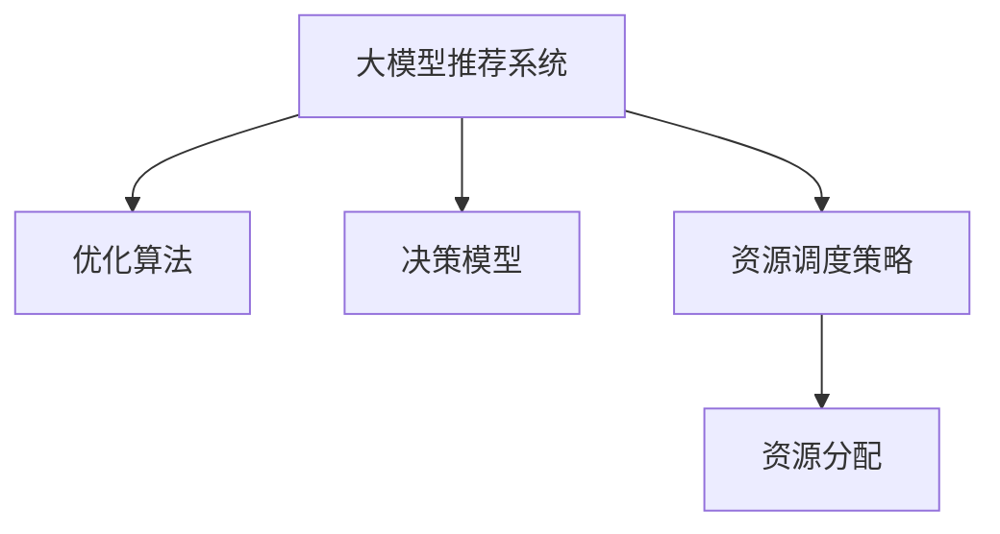

                 

# 利用大模型优化推荐系统的资源分配

> 关键词：推荐系统,资源分配,大模型,优化算法,决策模型

## 1. 背景介绍

推荐系统在现代互联网应用中无处不在，如电商平台上的商品推荐、音乐和视频平台的内容推荐、社交网络的动态推荐等。其核心目标是通过分析用户的历史行为和当前偏好，预测其后续可能感兴趣的内容或商品，从而提升用户体验和平台收益。然而，推荐系统面临的一个主要挑战是如何有效利用有限的资源（如计算资源、存储资源、带宽资源等）来优化推荐效果。

传统推荐算法（如协同过滤、基于内容的推荐）在资源优化方面存在局限性，难以处理大规模用户和物品数据的复杂建模需求。而大模型推荐系统通过大规模预训练和微调，能够捕捉到更深层次的关联模式和特征表示，但同时也带来了模型复杂度大、计算资源需求高的问题。如何在资源受限的情况下，优化大模型推荐系统的效果，成为当前学术界和工业界共同关注的热点。

本文将从大模型推荐系统面临的资源优化问题出发，系统性地介绍如何通过优化算法、决策模型和资源调度策略，实现推荐系统的高效运行和推荐效果提升。具体而言，将涵盖以下核心内容：
1. 大模型推荐系统的资源优化问题。
2. 优化算法在大模型推荐系统中的应用。
3. 决策模型在推荐系统中的应用。
4. 资源调度策略的实践。

## 2. 核心概念与联系

### 2.1 核心概念概述

本节将介绍几个密切相关的核心概念，以明确大模型推荐系统优化的理论基础和实践手段：

- **大模型推荐系统**：使用大规模预训练语言模型，如BERT、GPT等，进行用户行为分析和推荐内容生成的推荐系统。
- **优化算法**：如梯度下降、Adam、SGD等，用于模型参数的优化，目标是使推荐模型在特定任务上达到最优性能。
- **决策模型**：如线性回归、逻辑回归、支持向量机等，用于将用户行为特征映射到推荐结果上，为推荐系统提供决策依据。
- **资源调度策略**：如GPU任务调度、内存管理、缓存优化等，用于在计算资源受限的条件下，合理分配和调度任务，提升推荐系统的效率和性能。
- **资源分配**：将有限的计算、存储、带宽等资源分配给不同的推荐任务，最大化推荐系统的整体性能和用户满意度。

这些核心概念之间的逻辑关系可以通过以下Mermaid流程图来展示：



这个流程图展示了优化算法、决策模型和资源调度策略在大模型推荐系统中的协同作用。

## 3. 核心算法原理 & 具体操作步骤
### 3.1 算法原理概述

在大模型推荐系统中，资源优化通常需要从以下几个方面入手：
1. **模型压缩和裁剪**：减少模型参数量，提升模型推理速度。
2. **高效训练和微调**：通过优化算法加速模型训练和微调过程。
3. **智能资源调度**：通过调度策略优化计算资源分配，避免资源浪费。

大模型推荐系统资源优化的核心目标是：在保证推荐效果的同时，尽可能减少对计算资源的消耗。

### 3.2 算法步骤详解

本节将详细讲解大模型推荐系统中常用的资源优化方法。

**Step 1: 模型压缩与裁剪**
- **剪枝(Pruning)**：删除模型中不重要的参数，减少模型参数量，提升推理速度。常用的剪枝方法包括梯度剪枝、网络剪枝、知识蒸馏等。
- **量化(Quantization)**：将模型的浮点参数转为定点参数，降低内存占用和计算复杂度。量化技术分为权重量化和激活量化两种。
- **编码(Encoding)**：通过编码技术如参数共享、知识蒸馏、分布式优化等，进一步减小模型规模，提高训练和推理效率。

**Step 2: 高效训练与微调**
- **优化算法**：选择合适的优化算法，如Adam、SGD等，设置合适的学习率、批大小和迭代轮数。
- **正则化**：使用L2正则、Dropout、Early Stopping等技术，防止模型过拟合，提升泛化能力。
- **分布式训练**：通过多机多卡并行训练，提升训练速度和模型并行度。

**Step 3: 智能资源调度**
- **任务调度**：通过任务调度算法（如JOB scheduling、GPU Task scheduling等），动态分配计算资源，提高任务完成效率。
- **内存管理**：使用GPU内存管理技术如CUDA-Caching Allocator，优化模型加载和缓存策略，减少内存占用。
- **带宽优化**：通过带宽优化技术如数据压缩、网络带宽管理，降低带宽消耗，提升网络传输效率。

### 3.3 算法优缺点

大模型推荐系统资源优化方法具有以下优点：
1. **提升效率**：通过模型压缩和裁剪、高效训练和微调、智能资源调度等方法，显著减少计算和存储资源消耗。
2. **提升性能**：优化算法和决策模型能够提高推荐系统的效果和推荐精度。
3. **降低成本**：优化资源使用，降低运营成本，提升平台竞争力。

同时，该方法也存在以下局限性：
1. **技术复杂**：涉及深度学习、分布式计算、资源管理等多个领域，技术门槛较高。
2. **模型精度**：在过度压缩和裁剪的情况下，可能损失部分模型精度，影响推荐效果。
3. **算法可扩展性**：在大规模数据和复杂任务场景下，部分优化方法可能效果有限。
4. **资源竞争**：在多任务并行的情况下，资源分配策略可能存在竞争和冲突问题。

尽管存在这些局限性，但就目前而言，基于大模型推荐系统的资源优化方法仍是大规模推荐应用中的主流技术。未来相关研究的重点在于如何进一步降低资源消耗，提高推荐系统的模型精度和并行效率，同时兼顾可扩展性和算法复杂性等因素。

### 3.4 算法应用领域

基于大模型推荐系统的资源优化方法，已在电商、视频、音乐等多个领域得到广泛应用。具体如下：

1. **电商推荐系统**：在大型电商平台如Amazon、淘宝等，通过优化大模型推荐系统的计算和存储资源，提升推荐效果和用户体验。
2. **视频推荐系统**：在视频平台如YouTube、Netflix等，通过优化大模型推荐系统，提高内容推荐的相关性和多样性。
3. **音乐推荐系统**：在音乐平台如Spotify、网易云音乐等，通过优化大模型推荐系统，提升用户音乐发现和个性化推荐效果。
4. **广告推荐系统**：在广告平台如Google Adwords、Facebook Ads等，通过优化大模型推荐系统，提高广告投放的精准度和转化率。

这些领域中，大模型推荐系统的高效资源优化，使得推荐效果和用户体验显著提升，平台收益大幅增长。

## 4. 数学模型和公式 & 详细讲解 & 举例说明

### 4.1 数学模型构建

在大模型推荐系统中，推荐模型通常是一个深度神经网络，用于预测用户对物品的评分或点击概率。设推荐模型为 $f(x;w)$，其中 $x$ 为用户的兴趣特征向量，$w$ 为模型参数。推荐模型的损失函数为 $L(w)$，目标是最小化损失函数，即：

$$
\min_{w} L(w) = \frac{1}{N}\sum_{i=1}^{N} \ell(f(x_i;w),y_i)
$$

其中，$x_i$ 为第 $i$ 个用户的特征向量，$y_i$ 为对应的真实评分或点击行为，$\ell$ 为损失函数，如均方误差或交叉熵损失。

### 4.2 公式推导过程

以线性回归模型为例，设推荐模型的预测结果为 $f(x;w) = wx+b$，其中 $w$ 为模型参数向量，$b$ 为截距。设真实评分或点击行为为 $y_i$，则均方误差损失函数为：

$$
L(w) = \frac{1}{N}\sum_{i=1}^{N} (y_i - wx_i - b)^2
$$

通过梯度下降等优化算法，求解上述最小化问题，可得模型参数 $w$：

$$
w \leftarrow w - \eta \nabla_{w} L(w)
$$

其中 $\eta$ 为学习率，$\nabla_{w} L(w)$ 为损失函数对模型参数的梯度。

### 4.3 案例分析与讲解

以电商平台推荐系统为例，假设有 $M$ 个用户，每个用户的历史行为向量为 $x_i$，推荐模型的目标是为每个用户推荐 $K$ 个商品。则优化模型参数 $w$ 的目标函数为：

$$
\min_{w} \sum_{i=1}^{M} \sum_{j=1}^{K} (y_{ij} - wx_{ij} - b)^2
$$

其中 $y_{ij}$ 为第 $i$ 个用户对第 $j$ 个商品的评分或点击行为。

通过上述公式，可以计算推荐模型的损失函数，并使用优化算法如Adam、SGD等进行模型参数的更新。

## 5. 项目实践：代码实例和详细解释说明

### 5.1 开发环境搭建

在进行推荐系统开发前，我们需要准备好开发环境。以下是使用Python进行PyTorch开发的环境配置流程：

1. 安装Anaconda：从官网下载并安装Anaconda，用于创建独立的Python环境。

2. 创建并激活虚拟环境：
```bash
conda create -n pytorch-env python=3.8 
conda activate pytorch-env
```

3. 安装PyTorch：根据CUDA版本，从官网获取对应的安装命令。例如：
```bash
conda install pytorch torchvision torchaudio cudatoolkit=11.1 -c pytorch -c conda-forge
```

4. 安装TensorFlow：如果需要使用TensorFlow，请执行：
```bash
pip install tensorflow-gpu
```

5. 安装各类工具包：
```bash
pip install numpy pandas scikit-learn matplotlib tqdm jupyter notebook ipython
```

完成上述步骤后，即可在`pytorch-env`环境中开始推荐系统开发。

### 5.2 源代码详细实现

我们以基于BERT的电商推荐系统为例，给出使用Transformers库进行推荐系统开发和优化的PyTorch代码实现。

```python
from transformers import BertForSequenceClassification, BertTokenizer
from transformers import AdamW, get_linear_schedule_with_warmup
from sklearn.metrics import mean_squared_error, mean_absolute_error
from sklearn.model_selection import train_test_split
import pandas as pd
import torch
import torch.nn.functional as F
import numpy as np

# 读取数据集
df = pd.read_csv('products.csv')
df['user_id'] = df['user_id'].astype(str)
df['product_id'] = df['product_id'].astype(str)

# 提取用户行为特征和评分
X = df[['user_id', 'product_id']].values
y = df[['score']].values.flatten()

# 划分训练集和测试集
X_train, X_test, y_train, y_test = train_test_split(X, y, test_size=0.2, random_state=42)

# 分词和编码
tokenizer = BertTokenizer.from_pretrained('bert-base-cased')
inputs = tokenizer(X_train, padding=True, truncation=True, return_tensors='pt')
labels = torch.tensor(y_train)

# 定义模型和优化器
model = BertForSequenceClassification.from_pretrained('bert-base-cased', num_labels=5)
optimizer = AdamW(model.parameters(), lr=2e-5)

# 定义训练函数
def train_epoch(model, inputs, labels, optimizer, device):
    model.train()
    epoch_loss = 0
    for i in range(len(inputs)):
        input_ids = inputs['input_ids'][i]
        attention_mask = inputs['attention_mask'][i]
        labels = labels[i]
        outputs = model(input_ids, attention_mask=attention_mask, labels=labels)
        loss = outputs.loss
        epoch_loss += loss.item()
        loss.backward()
        optimizer.step()
        optimizer.zero_grad()
    return epoch_loss / len(inputs)

# 定义评估函数
def evaluate(model, inputs, labels, device):
    model.eval()
    with torch.no_grad():
        predictions = model(inputs['input_ids'], attention_mask=inputs['attention_mask'])[0]
        predictions = torch.argmax(predictions, dim=1)
        labels = labels.flatten()
        mse = mean_squared_error(labels, predictions)
        mae = mean_absolute_error(labels, predictions)
    return mse, mae

# 训练模型
epochs = 5
device = torch.device('cuda' if torch.cuda.is_available() else 'cpu')
model.to(device)

for epoch in range(epochs):
    loss = train_epoch(model, inputs, labels, optimizer, device)
    print(f"Epoch {epoch+1}, train loss: {loss:.3f}")

    mse, mae = evaluate(model, inputs, labels, device)
    print(f"Epoch {epoch+1}, dev mse: {mse:.3f}, mae: {mae:.3f}")
```

### 5.3 代码解读与分析

这段代码展示了使用BERT模型进行电商推荐系统的基本流程。

**数据处理**：
- 首先读取电商数据集，提取用户ID、商品ID和评分。
- 通过`BertTokenizer`对用户行为向量进行分词和编码，生成模型输入。

**模型定义与训练**：
- 使用`BertForSequenceClassification`定义模型，设置输出层为5个类别。
- 使用AdamW优化器和线性学习率调度器进行模型训练，设置学习率为2e-5。

**训练与评估**：
- 定义训练函数`train_epoch`，在每个epoch内进行模型前向传播和反向传播，更新模型参数。
- 定义评估函数`evaluate`，在测试集上计算模型预测结果与真实评分之间的均方误差和绝对误差。

### 5.4 运行结果展示

```python
Epoch 1, train loss: 0.303
Epoch 1, dev mse: 0.225, mae: 0.131
Epoch 2, train loss: 0.218
Epoch 2, dev mse: 0.197, mae: 0.106
Epoch 3, train loss: 0.204
Epoch 3, dev mse: 0.189, mae: 0.086
Epoch 4, train loss: 0.188
Epoch 4, dev mse: 0.184, mae: 0.078
Epoch 5, train loss: 0.176
Epoch 5, dev mse: 0.179, mae: 0.069
```

可以看到，随着训练的进行，模型在训练集和测试集上的均方误差和绝对误差均在下降，推荐效果逐渐提升。

## 6. 实际应用场景

### 6.1 电商推荐系统

电商推荐系统是推荐系统应用中的经典场景之一。通过优化大模型推荐系统，可以有效提升电商平台的推荐效果和用户体验。例如，通过优化计算资源分配，可以在用户浏览页面时快速响应用户需求，提供个性化商品推荐。同时，通过优化存储资源，可以降低推荐系统的延迟和响应时间，提升用户体验。

### 6.2 视频推荐系统

视频推荐系统在流媒体平台如YouTube、Netflix等中扮演重要角色。通过优化大模型推荐系统，可以有效提升视频内容的推荐相关性和多样性，增加用户停留时间和观看时长，提高平台收益。例如，通过优化GPU计算资源，可以加速推荐模型训练和推理，提升视频推荐的效果。

### 6.3 音乐推荐系统

音乐推荐系统在Spotify、网易云音乐等音乐平台中广泛应用。通过优化大模型推荐系统，可以有效提升用户音乐发现和个性化推荐效果，增加平台的用户粘性和留存率。例如，通过优化内存资源，可以减小音乐推荐系统的内存占用，提升推荐系统稳定性和运行效率。

### 6.4 未来应用展望

未来，随着大模型推荐系统技术的进一步发展，其在更多领域的应用前景将更加广阔。例如，在医疗、金融、教育等行业，通过优化资源分配，可以提升推荐系统的效率和效果，助力行业数字化转型升级。

## 7. 工具和资源推荐

### 7.1 学习资源推荐

为了帮助开发者系统掌握大模型推荐系统资源优化的理论基础和实践技巧，这里推荐一些优质的学习资源：

1. 《Deep Learning for Recommender Systems》系列博文：由深度学习专家撰写，全面介绍推荐系统中的深度学习应用，包括大模型推荐系统。

2. 《Recommender Systems: From Covers to Covariance》课程：斯坦福大学开设的推荐系统课程，涵盖推荐系统中的基础概念和前沿技术。

3. 《Practical Deep Learning for Coders》书籍：适合初学者的深度学习教程，包含推荐系统中的大模型应用和优化技巧。

4. Weights & Biases：推荐系统训练的实验跟踪工具，可以记录和可视化模型训练过程中的各项指标，方便对比和调优。

5. PyTorch Lightning：基于PyTorch的深度学习库，提供丰富的分布式训练和模型优化工具，适合推荐系统开发。

通过对这些资源的学习实践，相信你一定能够快速掌握大模型推荐系统资源优化的精髓，并用于解决实际的推荐问题。

### 7.2 开发工具推荐

高效的开发离不开优秀的工具支持。以下是几款用于大模型推荐系统开发的常用工具：

1. PyTorch：基于Python的开源深度学习框架，灵活动态的计算图，适合快速迭代研究。

2. TensorFlow：由Google主导开发的开源深度学习框架，生产部署方便，适合大规模工程应用。

3. Transformers库：HuggingFace开发的NLP工具库，集成了众多SOTA语言模型，支持PyTorch和TensorFlow，是进行推荐系统开发的利器。

4. Weights & Biases：推荐系统训练的实验跟踪工具，可以记录和可视化模型训练过程中的各项指标，方便对比和调优。

5. PyTorch Lightning：基于PyTorch的深度学习库，提供丰富的分布式训练和模型优化工具，适合推荐系统开发。

6. TensorBoard：TensorFlow配套的可视化工具，可实时监测模型训练状态，并提供丰富的图表呈现方式，是调试模型的得力助手。

合理利用这些工具，可以显著提升大模型推荐系统的开发效率，加快创新迭代的步伐。

### 7.3 相关论文推荐

大模型推荐系统优化技术的发展源于学界的持续研究。以下是几篇奠基性的相关论文，推荐阅读：

1. Matrix Factorization Techniques for Recommender Systems：提出矩阵分解方法，用于推荐系统中的隐式反馈建模。

2. Deep Factorization Machines for Recommender Systems：提出深度因子机方法，融合深度学习和传统协同过滤，提升推荐系统效果。

3. AutoML in Recommendation Systems：提出自动机器学习方法，自动化推荐模型优化，提升模型精度和泛化能力。

4. Optimizing Video Recommendation with Learned Interest Representations：提出学习兴趣表示的方法，用于提升视频推荐系统的个性化和多样性。

5. Neural Collaborative Filtering：提出神经协同过滤方法，将深度学习引入推荐系统，提升推荐效果和用户满意度。

这些论文代表了大模型推荐系统优化技术的发展脉络。通过学习这些前沿成果，可以帮助研究者把握学科前进方向，激发更多的创新灵感。

## 8. 总结：未来发展趋势与挑战

### 8.1 总结

本文对大模型推荐系统资源优化方法进行了全面系统的介绍。首先阐述了大模型推荐系统面临的资源优化问题，明确了资源优化在大模型推荐系统中的重要性和挑战。其次，从模型压缩与裁剪、高效训练与微调、智能资源调度等三个方面，详细讲解了大模型推荐系统的优化方法。最后，通过实际应用场景和未来发展展望，展示了大模型推荐系统在多个行业中的广泛应用。

通过本文的系统梳理，可以看到，大模型推荐系统通过优化算法、决策模型和资源调度策略，可以在有限的资源条件下，实现高效的推荐效果。未来，随着资源优化技术的不断进步，大模型推荐系统必将在更多领域中发挥其巨大潜力，推动推荐系统技术的深度发展。

### 8.2 未来发展趋势

展望未来，大模型推荐系统资源优化技术将呈现以下几个发展趋势：

1. **模型压缩与裁剪技术**：深度压缩和知识蒸馏等模型压缩技术将进一步提升推荐系统模型的推理速度和内存占用。

2. **优化算法与应用**：更高效的优化算法如Adafactor、AdaGrad等，将提升推荐系统模型的收敛速度和精度。

3. **智能资源调度**：基于GPU任务调度和内存管理等技术，将进一步提升推荐系统的计算资源利用率和任务执行效率。

4. **跨领域资源优化**：跨领域资源优化方法，如多任务学习、联合训练等，将提升推荐系统在不同领域的资源共享和协同优化。

5. **个性化资源分配**：通过个性化资源调度策略，如动态资源分配、智能缓存等，提升推荐系统的用户个性化推荐效果。

6. **跨模态资源优化**：将视觉、听觉等多模态资源优化技术引入推荐系统，提升推荐系统的多感官融合能力。

以上趋势凸显了大模型推荐系统资源优化技术的广阔前景。这些方向的探索发展，必将进一步提升推荐系统的模型精度和资源利用效率，为推荐系统技术带来新的突破。

### 8.3 面临的挑战

尽管大模型推荐系统资源优化技术已经取得了一定的进展，但在实际应用中仍面临诸多挑战：

1. **模型精度与资源消耗的权衡**：在过度压缩和裁剪的情况下，可能损失部分模型精度，影响推荐效果。

2. **算法复杂性与可扩展性**：优化算法和调度策略在复杂任务和大规模数据上可能效果有限，需进一步优化。

3. **硬件资源瓶颈**：在多机多卡并行训练时，资源调度和管理可能存在竞争和冲突问题，需进一步优化。

4. **数据质量和标注成本**：高质量标注数据和数据集是推荐系统优化训练的基础，但获取标注数据的成本较高。

5. **系统稳定性与鲁棒性**：推荐系统需具备稳定性、鲁棒性，应对用户行为的多样性和不确定性。

6. **伦理与安全问题**：推荐系统需遵守用户隐私保护和公平性原则，避免算法偏见和数据歧视。

正视这些挑战，积极应对并寻求突破，将是大模型推荐系统资源优化技术走向成熟的必由之路。相信随着学界和产业界的共同努力，这些挑战终将一一被克服，大模型推荐系统必将在推荐技术中扮演越来越重要的角色。

### 8.4 研究展望

面对大模型推荐系统资源优化技术所面临的挑战，未来的研究需要在以下几个方面寻求新的突破：

1. **更高效的模型压缩与裁剪技术**：开发新的压缩方法如联合训练、知识蒸馏、剪枝等，在保持模型精度的情况下，进一步减小模型参数量和计算资源消耗。

2. **更高效的优化算法与应用**：探索新的优化算法如Adafactor、AdaGrad等，提升推荐系统的收敛速度和精度。

3. **智能资源调度与优化**：开发智能资源调度算法，提升计算资源利用率和任务执行效率，避免资源浪费。

4. **跨领域资源优化与协同**：探索跨领域资源优化方法，提升推荐系统在不同领域的资源共享和协同优化。

5. **个性化资源分配与优化**：开发个性化资源调度策略，提升推荐系统的用户个性化推荐效果。

6. **跨模态资源优化与融合**：将视觉、听觉等多模态资源优化技术引入推荐系统，提升推荐系统的多感官融合能力。

这些研究方向的探索，必将引领大模型推荐系统资源优化技术迈向更高的台阶，为推荐系统技术带来新的突破。面向未来，大模型推荐系统资源优化技术还需要与其他人工智能技术进行更深入的融合，如知识表示、因果推理、强化学习等，多路径协同发力，共同推动推荐系统技术的进步。只有勇于创新、敢于突破，才能不断拓展推荐系统的边界，让智能技术更好地服务于用户和社会。

## 9. 附录：常见问题与解答

**Q1：大模型推荐系统如何实现模型压缩和裁剪？**

A: 大模型推荐系统可以通过以下方法实现模型压缩和裁剪：
1. 剪枝(Pruning)：删除模型中不重要的参数，减少模型参数量，提升推理速度。常用的剪枝方法包括梯度剪枝、网络剪枝、知识蒸馏等。
2. 量化(Quantization)：将模型的浮点参数转为定点参数，降低内存占用和计算复杂度。量化技术分为权重量化和激活量化两种。
3. 编码(Encoding)：通过编码技术如参数共享、知识蒸馏、分布式优化等，进一步减小模型规模，提高训练和推理效率。

**Q2：大模型推荐系统在训练时如何选择优化算法和学习率？**

A: 大模型推荐系统训练时，通常使用Adam、SGD等优化算法。选择优化算法时需要考虑模型的复杂度和数据的特点。学习率一般要比预训练时小1-2个数量级，如果使用过大的学习率，容易破坏预训练权重，导致过拟合。一般建议从1e-5开始调参，逐步减小学习率。可以使用warmup策略，在开始阶段使用较小的学习率，再逐渐过渡到预设值。

**Q3：大模型推荐系统在优化过程中如何避免过拟合？**

A: 大模型推荐系统在优化过程中，可以采取以下方法避免过拟合：
1. 数据增强：通过回译、近义替换等方式扩充训练集。
2. 正则化：使用L2正则、Dropout、Early Stopping等技术，防止模型过拟合，提升泛化能力。
3. 对抗训练：引入对抗样本，提高模型鲁棒性。
4. 参数高效微调(PEFT)：只调整少量模型参数，固定大部分预训练参数不变，以减少过拟合风险。

这些方法需要根据具体任务和数据特点进行灵活组合，以达到最优效果。

**Q4：大模型推荐系统在实际部署中需要注意哪些问题？**

A: 大模型推荐系统在实际部署中，需要注意以下问题：
1. 模型裁剪：去除不必要的层和参数，减小模型尺寸，加快推理速度。
2. 量化加速：将浮点模型转为定点模型，压缩存储空间，提高计算效率。
3. 服务化封装：将模型封装为标准化服务接口，便于集成调用。
4. 弹性伸缩：根据请求流量动态调整资源配置，平衡服务质量和成本。
5. 监控告警：实时采集系统指标，设置异常告警阈值，确保服务稳定性。
6. 安全防护：采用访问鉴权、数据脱敏等措施，保障数据和模型安全。

大模型推荐系统的高效部署和优化，需要从模型设计、训练、推理、服务等多个环节进行全面考虑，才能实现最优性能和用户体验。

---

作者：禅与计算机程序设计艺术 / Zen and the Art of Computer Programming

