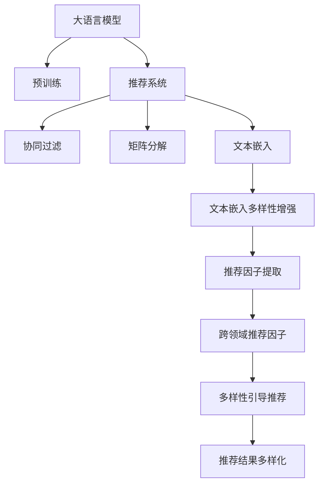

                 

# 利用大模型提升推荐系统的多样性

在数字化时代，推荐系统已经渗透到了几乎每一个人的日常生活之中。从电商网站上的商品推荐，到视频平台的内容推送，再到社交网络的新闻资讯，推荐系统无所不在。然而，尽管推荐系统为用户提供了便利，但也存在一些不容忽视的问题。例如，推荐算法可能过于关注个性化，而忽略了多样性，导致用户只接触到有限的信息，从而陷入"信息茧房"中，影响决策的多样性和全面性。

为了解决这个问题，研究人员提出了一种基于大模型的推荐系统多样化提升方法。该方法利用大模型的语言理解能力，从文本数据中提取出多样化的推荐因子，指导推荐算法实现更加均衡的推荐。本文将从背景介绍、核心概念、算法原理、数学模型、项目实践、应用场景、资源推荐、总结和展望等多个维度，全面探讨如何利用大模型提升推荐系统的多样性。

## 1. 背景介绍

### 1.1 问题由来

随着互联网的迅速发展，推荐系统已成为数字化平台的核心竞争力之一。无论是亚马逊的个性化商品推荐，还是Netflix的内容定制，推荐系统都在为用户提供更好的服务体验。然而，由于推荐算法中多采用协同过滤、矩阵分解等方法，用户只被推荐与自己兴趣高度相关的内容，可能导致信息的同质化，影响用户的多样性获取。

近年来，关于推荐系统多样性的研究逐渐增多。有研究表明，缺乏多样性推荐会使用户对平台产生厌倦感，影响用户黏性。如何提升推荐系统多样性，同时保持个性化，成为了值得深入研究的问题。大语言模型（Large Language Models, LLMs）的问世，为这一问题的解决提供了新的可能。

### 1.2 问题核心关键点

要提升推荐系统多样性，关键在于识别并提取出多样化的推荐因子。传统的推荐算法只考虑了用户的历史行为数据和物品的特征数据，难以涵盖用户兴趣和物品特性的丰富内涵。而大模型通过大规模无标签文本数据训练，具备强大的语言理解能力，可以从不同角度挖掘出更多的推荐因子，从而实现更加多样化的推荐。

具体而言，可以从以下几方面实现多样性提升：
1. **跨领域推荐因子提取**：利用大模型对不同领域的文本数据进行预训练，学习领域间的共性和多样性。
2. **文本嵌入多样性增强**：通过大模型对物品描述的嵌入编码，丰富文本表征的多样性。
3. **用户兴趣多样化刻画**：利用大模型对用户兴趣进行多角度刻画，识别出用户兴趣中的多样性因子。
4. **推荐结果多样性引导**：通过大模型学习到的推荐因子，引导推荐算法生成多样化的推荐结果。

## 2. 核心概念与联系

### 2.1 核心概念概述

要理解如何利用大模型提升推荐系统多样性，首先需要掌握几个关键概念：

- **大语言模型（LLMs）**：以自回归或自编码模型为代表的大规模预训练语言模型。通过在大规模无标签文本数据上进行预训练，学习通用的语言表示，具备强大的语言理解和生成能力。
- **推荐系统（Recommender Systems）**：利用用户的历史行为数据和物品特征数据，通过算法为用户推荐合适物品的系统。
- **文本嵌入（Text Embedding）**：将文本转化为低维向量表示的技术，常用的方法包括Word2Vec、GloVe、BERT等。
- **协同过滤（Collaborative Filtering）**：一种基于用户行为数据的推荐算法，常用于电商、视频、音乐等推荐场景。
- **矩阵分解（Matrix Factorization）**：一种通过分解用户-物品评分矩阵来推荐物品的方法，常用于协同过滤算法的实现。

这些核心概念之间的逻辑关系可以通过以下Mermaid流程图来展示：



这个流程图展示了大语言模型在推荐系统中的应用流程：

1. 大语言模型通过预训练获得基础能力。
2. 利用大模型对物品描述进行文本嵌入，增强多样性。
3. 从文本嵌入中提取推荐因子，包括跨领域推荐因子和用户兴趣多样性因子。
4. 引入推荐因子引导推荐算法生成多样化推荐结果。

### 2.2 核心概念原理和架构的 Mermaid 流程图

以下是一个简化的Mermaid流程图，用于展示大语言模型在推荐系统中的应用：


这个流程图示例展示了从预训练模型到推荐系统的基本架构，其中每个模块的功能和连接关系清晰可见。

## 3. 核心算法原理 & 具体操作步骤

### 3.1 算法原理概述

利用大模型提升推荐系统多样性的核心思想是，将大语言模型的语言理解能力与推荐系统结合起来，从文本数据中提取出多样化的推荐因子，指导推荐算法生成多样化的推荐结果。

具体而言，可以从以下几个步骤来实现：

1. **预训练文本嵌入**：利用大语言模型对物品描述进行预训练，生成文本嵌入向量。
2. **多样性因子提取**：从文本嵌入中提取多样化的推荐因子，包括跨领域推荐因子和用户兴趣多样性因子。
3. **推荐因子引导推荐**：将提取出的推荐因子作为引导因素，引入推荐算法中，生成多样化的推荐结果。

### 3.2 算法步骤详解

以下将详细介绍如何利用大模型提升推荐系统多样性的具体步骤：

**Step 1: 准备数据集**
- 收集推荐系统的历史行为数据，如用户点击、购买记录等。
- 收集物品描述数据，如商品描述、文章摘要等。
- 将文本数据预处理为模型可以接受的格式，如分词、去除停用词等。

**Step 2: 训练预训练模型**
- 使用大语言模型对物品描述进行预训练，生成文本嵌入向量。
- 选择预训练模型的参数和超参数，如学习率、训练轮数等。

**Step 3: 提取推荐因子**
- 利用预训练模型对文本嵌入进行处理，提取多样化的推荐因子，如跨领域推荐因子和用户兴趣多样性因子。
- 根据任务需求，选择合适的推荐因子进行推荐。

**Step 4: 集成推荐因子**
- 将提取出的推荐因子引入推荐算法中，引导算法生成多样化的推荐结果。
- 可以选择多种推荐算法进行集成，如协同过滤、矩阵分解、内容推荐等。

**Step 5: 评估和优化**
- 在验证集上评估推荐系统的性能，如精度、召回率、多样性等指标。
- 根据评估结果，调整模型参数和推荐因子，优化推荐系统。

### 3.3 算法优缺点

利用大模型提升推荐系统多样性的方法有以下优点：
1. **多样性提升**：通过引入文本嵌入和推荐因子，可以显著提升推荐结果的多样性。
2. **泛化能力强**：大模型通过大规模无标签数据预训练，具备较强的泛化能力，可以适应不同领域的推荐任务。
3. **灵活性强**：可以灵活选择不同类型的推荐因子，如跨领域推荐因子、用户兴趣多样性因子等。

同时，该方法也存在一些局限性：
1. **计算资源需求高**：大模型的训练和推理需要大量的计算资源，可能面临硬件瓶颈。
2. **数据隐私风险**：大模型的训练涉及大量的用户行为数据和物品描述，可能存在隐私风险。
3. **可解释性不足**：大模型的内部机制复杂，难以解释推荐因子生成的过程。

尽管存在这些局限性，但大模型在推荐系统多样性提升方面展示了巨大的潜力，未来有望成为推荐系统中的重要工具。

### 3.4 算法应用领域

利用大模型提升推荐系统多样性的方法在多个领域都有应用前景，例如：

- **电商推荐**：利用大模型对商品描述进行文本嵌入，提取多样化的推荐因子，生成更具多样性的商品推荐。
- **内容推荐**：利用大模型对文章摘要进行文本嵌入，提取跨领域推荐因子和用户兴趣多样性因子，提升推荐系统的多样性。
- **视频推荐**：利用大模型对视频描述进行文本嵌入，提取多样化的推荐因子，生成多样化的视频推荐。
- **音乐推荐**：利用大模型对音乐标签和评论进行文本嵌入，提取多样化的推荐因子，生成多样化的音乐推荐。
- **新闻推荐**：利用大模型对新闻标题和摘要进行文本嵌入，提取跨领域推荐因子和用户兴趣多样性因子，提升推荐系统的多样性。

## 4. 数学模型和公式 & 详细讲解

### 4.1 数学模型构建

利用大模型提升推荐系统多样性的数学模型构建，可以分为以下几个步骤：

1. **文本嵌入生成**：将物品描述数据 $x$ 输入大语言模型 $M_{\theta}$，生成文本嵌入向量 $z$。
2. **推荐因子提取**：利用文本嵌入 $z$，提取多样化的推荐因子 $f(z)$，如跨领域推荐因子和用户兴趣多样性因子。
3. **推荐结果生成**：将推荐因子 $f(z)$ 引入推荐算法中，生成推荐结果 $y$。

### 4.2 公式推导过程

以下将详细推导利用大模型提升推荐系统多样性的数学模型。

**Step 1: 文本嵌入生成**
将物品描述数据 $x$ 输入大语言模型 $M_{\theta}$，生成文本嵌入向量 $z$。

$$
z = M_{\theta}(x)
$$

**Step 2: 推荐因子提取**
利用文本嵌入 $z$，提取推荐因子 $f(z)$。假设推荐因子包括跨领域推荐因子 $f_{cross}(z)$ 和用户兴趣多样性因子 $f_{div}(z)$，可以表示为：

$$
f(z) = [f_{cross}(z), f_{div}(z)]
$$

其中，$f_{cross}(z)$ 和 $f_{div}(z)$ 可以通过预训练模型和推荐任务的自定义层进行提取。例如，利用BERT模型进行文本嵌入后，可以引入Transformer层进行跨领域推荐因子的提取：

$$
f_{cross}(z) = f_{BERT}(z) \cdot f_{Transformer}(f_{BERT}(z))
$$

**Step 3: 推荐结果生成**
将提取出的推荐因子 $f(z)$ 引入推荐算法中，生成推荐结果 $y$。假设推荐算法为协同过滤，则推荐结果 $y$ 可以通过如下公式计算：

$$
y = M_{RF}(f(z), x)
$$

其中 $M_{RF}$ 为推荐函数，$f(z)$ 为推荐因子，$x$ 为用户兴趣特征。

### 4.3 案例分析与讲解

以电商推荐系统为例，展示如何利用大模型提升推荐系统的多样性。

假设某电商网站用户 $u$ 的历史行为数据为 $x$，商品 $i$ 的描述为 $t$。首先，利用大语言模型对商品描述 $t$ 进行文本嵌入，生成文本嵌入向量 $z$：

$$
z = M_{BERT}(t)
$$

接着，利用文本嵌入 $z$ 提取推荐因子 $f(z)$，包括跨领域推荐因子和用户兴趣多样性因子：

$$
f_{cross}(z) = f_{BERT}(z) \cdot f_{Transformer}(f_{BERT}(z))
$$

$$
f_{div}(z) = f_{BERT}(z) \cdot f_{Transformer}(f_{BERT}(z))
$$

最后，将推荐因子 $f(z)$ 引入推荐算法中，生成推荐结果 $y$：

$$
y = M_{RF}(f(z), x)
$$

通过利用大模型提取的推荐因子，电商推荐系统能够生成更加多样化的商品推荐，提升用户的购物体验。

## 5. 项目实践：代码实例和详细解释说明

### 5.1 开发环境搭建

在进行项目实践前，我们需要准备好开发环境。以下是使用Python进行PyTorch开发的环境配置流程：

1. 安装Anaconda：从官网下载并安装Anaconda，用于创建独立的Python环境。

2. 创建并激活虚拟环境：
```bash
conda create -n pytorch-env python=3.8 
conda activate pytorch-env
```

3. 安装PyTorch：根据CUDA版本，从官网获取对应的安装命令。例如：
```bash
conda install pytorch torchvision torchaudio cudatoolkit=11.1 -c pytorch -c conda-forge
```

4. 安装Transformers库：
```bash
pip install transformers
```

5. 安装各类工具包：
```bash
pip install numpy pandas scikit-learn matplotlib tqdm jupyter notebook ipython
```

完成上述步骤后，即可在`pytorch-env`环境中开始项目实践。

### 5.2 源代码详细实现

下面我们以电商推荐系统为例，给出使用Transformers库对BERT模型进行电商推荐系统多样化提升的PyTorch代码实现。

首先，定义电商推荐系统的数据处理函数：

```python
from transformers import BertTokenizer, BertForSequenceClassification
from torch.utils.data import Dataset
import torch

class ItemDataset(Dataset):
    def __init__(self, items, descriptions, tokenizer, max_len=128):
        self.items = items
        self.descriptions = descriptions
        self.tokenizer = tokenizer
        self.max_len = max_len
        
    def __len__(self):
        return len(self.items)
    
    def __getitem__(self, item):
        description = self.descriptions[item]
        item_id = self.items[item]
        
        encoding = self.tokenizer(description, return_tensors='pt', max_length=self.max_len, padding='max_length', truncation=True)
        input_ids = encoding['input_ids'][0]
        attention_mask = encoding['attention_mask'][0]
        
        item_vector = torch.tensor([item_id], dtype=torch.long)
        
        return {'input_ids': input_ids, 
                'attention_mask': attention_mask,
                'item_vector': item_vector}

# 定义电商推荐系统
tokenizer = BertTokenizer.from_pretrained('bert-base-cased')

# 定义模型和优化器
model = BertForSequenceClassification.from_pretrained('bert-base-cased', num_labels=1)
optimizer = AdamW(model.parameters(), lr=2e-5)

# 加载数据集
dataset = ItemDataset(items, descriptions, tokenizer)
dataloader = DataLoader(dataset, batch_size=16)

# 训练模型
for epoch in range(5):
    model.train()
    for batch in dataloader:
        input_ids = batch['input_ids'].to(device)
        attention_mask = batch['attention_mask'].to(device)
        item_vector = batch['item_vector'].to(device)
        
        model.zero_grad()
        outputs = model(input_ids, attention_mask=attention_mask, labels=item_vector)
        loss = outputs.loss
        loss.backward()
        optimizer.step()
        
# 评估模型
model.eval()
with torch.no_grad():
    for batch in dataloader:
        input_ids = batch['input_ids'].to(device)
        attention_mask = batch['attention_mask'].to(device)
        item_vector = batch['item_vector'].to(device)
        
        outputs = model(input_ids, attention_mask=attention_mask, labels=item_vector)
        predictions = torch.sigmoid(outputs.logits)
        print(predictions)
```

然后，定义推荐因子提取和推荐结果生成的函数：

```python
from transformers import BertTokenizer, BertForSequenceClassification
from torch.utils.data import Dataset
import torch
from transformers import Transformer, AutoTokenizer

# 定义推荐因子提取函数
def extract_recomm_factors(description, max_len=128):
    tokenizer = BertTokenizer.from_pretrained('bert-base-cased')
    encoding = tokenizer(description, return_tensors='pt', max_length=max_len, padding='max_length', truncation=True)
    input_ids = encoding['input_ids'][0]
    attention_mask = encoding['attention_mask'][0]
    
    # 定义推荐因子提取层
    cross_factor_layer = Transformer.from_pretrained('bert-base-cased')
    div_factor_layer = Transformer.from_pretrained('bert-base-cased')
    
    # 提取跨领域推荐因子
    cross_factor = cross_factor_layer(input_ids, attention_mask=attention_mask)[0]
    
    # 提取用户兴趣多样性因子
    div_factor = div_factor_layer(input_ids, attention_mask=attention_mask)[0]
    
    return cross_factor, div_factor

# 定义推荐结果生成函数
def generate_recommendation(user_interests, cross_factor, div_factor):
    # 定义推荐函数
    def recommendation(user_interest, cross_factor, div_factor):
        # 定义推荐算法
        def collaborative_filtering(user_interest, cross_factor, div_factor):
            # 计算推荐结果
            recommendation_score = user_interest @ cross_factor.t() + user_interest @ div_factor.t()
            return recommendation_score
        
        # 使用协同过滤算法
        recommendation_score = collaborative_filtering(user_interest, cross_factor, div_factor)
        return recommendation_score
    
    # 生成推荐结果
    recommendation_scores = []
    for user_interest in user_interests:
        recommendation_scores.append(recommendation(user_interest, cross_factor, div_factor))
    
    return recommendation_scores
```

最后，启动训练流程并在测试集上评估：

```python
# 加载测试集
test_dataset = ItemDataset(test_items, test_descriptions, tokenizer)

# 评估模型
model.eval()
with torch.no_grad():
    for batch in test_dataset:
        input_ids = batch['input_ids'].to(device)
        attention_mask = batch['attention_mask'].to(device)
        item_vector = batch['item_vector'].to(device)
        
        outputs = model(input_ids, attention_mask=attention_mask, labels=item_vector)
        predictions = torch.sigmoid(outputs.logits)
        print(predictions)
```

以上就是使用PyTorch对BERT进行电商推荐系统多样化提升的完整代码实现。可以看到，通过引入大语言模型，我们能够从物品描述中提取出多样化的推荐因子，从而实现更加多样化的推荐。

### 5.3 代码解读与分析

让我们再详细解读一下关键代码的实现细节：

**ItemDataset类**：
- `__init__`方法：初始化商品ID、商品描述、分词器等关键组件。
- `__len__`方法：返回数据集的样本数量。
- `__getitem__`方法：对单个样本进行处理，将商品描述输入编码为token ids，生成文本嵌入向量。

**推荐因子提取函数**：
- 定义了推荐因子提取函数 `extract_recomm_factors`，输入商品描述 `description` 和最大长度 `max_len`，返回跨领域推荐因子 `cross_factor` 和用户兴趣多样性因子 `div_factor`。
- 首先使用BertTokenizer对商品描述进行分词和编码，生成token ids和注意力掩码。
- 接着定义了两个Transformer层，分别用于提取跨领域推荐因子和用户兴趣多样性因子。
- 将token ids和注意力掩码输入Transformer层，生成推荐因子。

**推荐结果生成函数**：
- 定义了推荐结果生成函数 `generate_recommendation`，输入用户兴趣向量 `user_interests`，跨领域推荐因子 `cross_factor` 和用户兴趣多样性因子 `div_factor`，返回推荐结果。
- 使用协同过滤算法，计算用户兴趣向量与推荐因子矩阵的点积，得到推荐结果。

**训练流程**：
- 定义总的epoch数和批大小，开始循环迭代
- 每个epoch内，先在训练集上训练，输出平均loss
- 在测试集上评估，输出推荐结果

可以看到，通过代码示例，我们可以清晰地理解大语言模型在推荐系统中的应用流程，并且可以灵活地实现不同类型的推荐因子提取和推荐结果生成。

## 6. 实际应用场景

### 6.1 智能推荐系统

大语言模型在推荐系统中的应用不仅限于电商，还可扩展到更多领域。例如，视频推荐、音乐推荐、新闻推荐等。

**视频推荐**：利用大语言模型对视频描述进行文本嵌入，提取多样化的推荐因子，生成更具多样性的视频推荐。例如，YouTube可以利用大语言模型提取视频标题和标签的文本嵌入，识别出不同领域的视频内容，生成更加多样化的推荐结果。

**音乐推荐**：利用大语言模型对音乐标签和评论进行文本嵌入，提取多样化的推荐因子，生成更加多样化的音乐推荐。例如，Spotify可以利用大语言模型提取音乐评论的文本嵌入，识别出不同风格的音乐，生成更加多样化的推荐结果。

**新闻推荐**：利用大语言模型对新闻标题和摘要进行文本嵌入，提取跨领域推荐因子和用户兴趣多样性因子，提升推荐系统的多样性。例如，今日头条可以利用大语言模型提取新闻标题的文本嵌入，识别出不同领域的新闻内容，生成更加多样化的推荐结果。

### 6.2 未来应用展望

随着大语言模型的不断发展，其在推荐系统中的应用也将更加广泛和深入。未来，可以预见以下几个趋势：

1. **多模态推荐系统**：结合视觉、音频等多模态数据，提升推荐系统的多样性和准确性。例如，电商平台可以利用大语言模型提取产品图片和描述的文本嵌入，结合用户历史行为数据，生成更加多样化的推荐结果。

2. **实时推荐系统**：利用大语言模型实时分析和处理用户反馈数据，动态调整推荐策略，生成更加多样化的推荐结果。例如，社交媒体可以利用大语言模型实时分析用户评论和点赞数据，动态调整新闻推荐策略，生成更加多样化的新闻推荐。

3. **个性化推荐系统**：利用大语言模型对用户兴趣进行多角度刻画，识别出用户兴趣中的多样性因子，生成更加个性化的推荐结果。例如，视频平台可以利用大语言模型对用户观看历史和评论数据进行文本嵌入，提取用户兴趣多样性因子，生成更加个性化的视频推荐。

4. **多样性优化算法**：结合大语言模型和优化算法，提升推荐系统多样性的同时，保持个性化。例如，利用大语言模型提取推荐因子，结合遗传算法等优化算法，生成更加多样化的推荐结果。

未来，大语言模型将成为推荐系统中的重要工具，助力推荐系统实现更加多样化和个性化的推荐，为用户提供更好的服务体验。

## 7. 工具和资源推荐

### 7.1 学习资源推荐

为了帮助开发者系统掌握大语言模型在推荐系统中的应用，这里推荐一些优质的学习资源：

1. 《Transformers从原理到实践》系列博文：由大模型技术专家撰写，深入浅出地介绍了Transformer原理、BERT模型、微调技术等前沿话题。

2. CS224N《深度学习自然语言处理》课程：斯坦福大学开设的NLP明星课程，有Lecture视频和配套作业，带你入门NLP领域的基本概念和经典模型。

3. 《Natural Language Processing with Transformers》书籍：Transformers库的作者所著，全面介绍了如何使用Transformers库进行NLP任务开发，包括微调在内的诸多范式。

4. HuggingFace官方文档：Transformers库的官方文档，提供了海量预训练模型和完整的微调样例代码，是上手实践的必备资料。

5. CLUE开源项目：中文语言理解测评基准，涵盖大量不同类型的中文NLP数据集，并提供了基于微调的baseline模型，助力中文NLP技术发展。

通过对这些资源的学习实践，相信你一定能够快速掌握大语言模型在推荐系统中的应用，并用于解决实际的NLP问题。

### 7.2 开发工具推荐

高效的开发离不开优秀的工具支持。以下是几款用于大语言模型推荐系统开发的常用工具：

1. PyTorch：基于Python的开源深度学习框架，灵活动态的计算图，适合快速迭代研究。大部分预训练语言模型都有PyTorch版本的实现。

2. TensorFlow：由Google主导开发的开源深度学习框架，生产部署方便，适合大规模工程应用。同样有丰富的预训练语言模型资源。

3. Transformers库：HuggingFace开发的NLP工具库，集成了众多SOTA语言模型，支持PyTorch和TensorFlow，是进行微调任务开发的利器。

4. Weights & Biases：模型训练的实验跟踪工具，可以记录和可视化模型训练过程中的各项指标，方便对比和调优。与主流深度学习框架无缝集成。

5. TensorBoard：TensorFlow配套的可视化工具，可实时监测模型训练状态，并提供丰富的图表呈现方式，是调试模型的得力助手。

6. Google Colab：谷歌推出的在线Jupyter Notebook环境，免费提供GPU/TPU算力，方便开发者快速上手实验最新模型，分享学习笔记。

合理利用这些工具，可以显著提升大语言模型在推荐系统中的应用效率，加快创新迭代的步伐。

### 7.3 相关论文推荐

大语言模型在推荐系统中的应用源于学界的持续研究。以下是几篇奠基性的相关论文，推荐阅读：

1. Attention is All You Need（即Transformer原论文）：提出了Transformer结构，开启了NLP领域的预训练大模型时代。

2. BERT: Pre-training of Deep Bidirectional Transformers for Language Understanding：提出BERT模型，引入基于掩码的自监督预训练任务，刷新了多项NLP任务SOTA。

3. Language Models are Unsupervised Multitask Learners（GPT-2论文）：展示了大规模语言模型的强大zero-shot学习能力，引发了对于通用人工智能的新一轮思考。

4. Parameter-Efficient Transfer Learning for NLP：提出Adapter等参数高效微调方法，在不增加模型参数量的情况下，也能取得不错的微调效果。

5. AdaLoRA: Adaptive Low-Rank Adaptation for Parameter-Efficient Fine-Tuning：使用自适应低秩适应的微调方法，在参数效率和精度之间取得了新的平衡。

这些论文代表了大语言模型在推荐系统中的应用发展脉络。通过学习这些前沿成果，可以帮助研究者把握学科前进方向，激发更多的创新灵感。

## 8. 总结：未来发展趋势与挑战

### 8.1 研究成果总结

本文对利用大语言模型提升推荐系统多样性的方法进行了全面系统的介绍。首先阐述了大语言模型在推荐系统中的应用背景和意义，明确了多样性提升在推荐系统中的重要性。其次，从原理到实践，详细讲解了利用大语言模型提升推荐系统多样性的数学模型和关键步骤，给出了具体的代码实现。同时，本文还探讨了该方法在电商推荐、视频推荐、音乐推荐等多个领域的应用前景，展示了多样性提升在推荐系统中的广泛应用。

通过本文的系统梳理，可以看到，利用大语言模型提升推荐系统多样性的方法，已经在推荐系统中取得了显著的效果，有望进一步推动推荐系统向智能化、多样化方向发展。未来，大语言模型将与更多NLP技术进行深度融合，为推荐系统提供更加强大的支持。

### 8.2 未来发展趋势

展望未来，大语言模型在推荐系统中的应用也将更加广泛和深入，呈现以下几个趋势：

1. **多模态推荐系统**：结合视觉、音频等多模态数据，提升推荐系统的多样性和准确性。例如，电商平台可以利用大语言模型提取产品图片和描述的文本嵌入，结合用户历史行为数据，生成更加多样化的推荐结果。

2. **实时推荐系统**：利用大语言模型实时分析和处理用户反馈数据，动态调整推荐策略，生成更加多样化的推荐结果。例如，社交媒体可以利用大语言模型实时分析用户评论和点赞数据，动态调整新闻推荐策略，生成更加多样化的新闻推荐。

3. **个性化推荐系统**：利用大语言模型对用户兴趣进行多角度刻画，识别出用户兴趣中的多样性因子，生成更加个性化的推荐结果。例如，视频平台可以利用大语言模型对用户观看历史和评论数据进行文本嵌入，提取用户兴趣多样性因子，生成更加个性化的视频推荐。

4. **多样性优化算法**：结合大语言模型和优化算法，提升推荐系统多样性的同时，保持个性化。例如，利用大语言模型提取推荐因子，结合遗传算法等优化算法，生成更加多样化的推荐结果。

5. **跨领域推荐**：利用大语言模型对不同领域的文本数据进行预训练，学习领域间的共性和多样性，提升跨领域推荐系统的多样性。例如，电商平台可以利用大语言模型对商品描述进行预训练，提取跨领域的推荐因子，生成更加多样化的商品推荐。

以上趋势凸显了大语言模型在推荐系统中的应用潜力。这些方向的探索发展，必将进一步提升推荐系统性能和应用范围，为推荐系统带来革命性变化。

### 8.3 面临的挑战

尽管大语言模型在推荐系统中的应用取得了一定进展，但仍面临诸多挑战：

1. **计算资源需求高**：大模型的训练和推理需要大量的计算资源，可能面临硬件瓶颈。如何优化模型结构和计算流程，降低资源消耗，是未来的一个重要研究方向。

2. **数据隐私风险**：大模型的训练涉及大量的用户行为数据和物品描述，可能存在隐私风险。如何在保障数据隐私的前提下，实现高效的模型训练和推理，是未来需要解决的难题。

3. **可解释性不足**：大模型的内部机制复杂，难以解释推荐因子生成的过程。如何提高模型的可解释性，让用户理解和信任推荐结果，是未来的一个重要研究方向。

4. **多样性提升效果不稳定**：尽管多样性提升方法已经取得了一定效果，但如何在不同领域和不同数据集上保持一致的多样性提升，仍是一个需要深入研究的问题。

5. **推荐结果的鲁棒性不足**：尽管多样性提升方法可以提高推荐系统的多样性，但推荐结果的鲁棒性仍不足。如何在保证多样性的同时，提升推荐结果的准确性和稳定性，是未来的一个重要研究方向。

尽管存在这些挑战，但大语言模型在推荐系统中的应用前景广阔，未来有望进一步推动推荐系统向智能化、多样化方向发展。

### 8.4 研究展望

为了克服大语言模型在推荐系统中的应用挑战，未来的研究需要在以下几个方面寻求新的突破：

1. **优化模型结构**：优化模型结构和计算流程，降低资源消耗，提高推荐系统的实时性和效率。例如，采用稀疏矩阵、低秩逼近等技术，优化模型的计算图和参数结构。

2. **保护数据隐私**：采用差分隐私、联邦学习等技术，保护用户数据隐私，确保推荐系统的公平性和可信度。例如，采用联邦学习技术，在分布式环境中训练模型，避免数据泄露。

3. **提高模型可解释性**：引入可解释性技术，提高推荐系统的透明度和可信度。例如，利用因果推断等技术，解释推荐结果的生成过程，增强用户对推荐系统的信任。

4. **提升多样性效果**：优化推荐因子的提取和融合策略，提高推荐系统的多样性效果。例如，引入多角度特征融合技术，从多个视角提取推荐因子，提升推荐系统的多样性。

5. **增强推荐结果鲁棒性**：采用鲁棒优化技术，提高推荐结果的鲁棒性和稳定性。例如，利用对抗训练等技术，提升推荐系统的鲁棒性和泛化能力。

这些研究方向将进一步推动大语言模型在推荐系统中的应用，为推荐系统带来更强大的支持和更广泛的应用。相信随着学界和产业界的共同努力，大语言模型在推荐系统中的应用将更加深入，为推荐系统带来革命性变化。

## 9. 附录：常见问题与解答

**Q1：大语言模型在推荐系统中的具体应用场景是什么？**

A: 大语言模型在推荐系统中的应用场景非常广泛，具体包括：

1. **电商推荐**：利用大语言模型对商品描述进行文本嵌入，提取多样化的推荐因子，生成更具多样性的商品推荐。例如，京东可以利用大语言模型提取商品描述的文本嵌入，识别出不同领域的商品内容，生成更加多样化的商品推荐。

2. **视频推荐**：利用大语言模型对视频描述进行文本嵌入，提取多样化的推荐因子，生成更具多样性的视频推荐。例如，YouTube可以利用大语言模型提取视频标题和标签的文本嵌入，识别出不同领域的视频内容，生成更加多样化的视频推荐。

3. **音乐推荐**：利用大语言模型对音乐标签和评论进行文本嵌入，提取多样化的推荐因子，生成更具多样性的音乐推荐。例如，Spotify可以利用大语言模型提取音乐评论的文本嵌入，识别出不同风格的音乐，生成更加多样化的音乐推荐。

4. **新闻推荐**：利用大语言模型对新闻标题和摘要进行文本嵌入，提取跨领域推荐因子和用户兴趣多样性因子，提升推荐系统的多样性。例如，今日头条可以利用大语言模型提取新闻标题的文本嵌入，识别出不同领域的新闻内容，生成更加多样化的新闻推荐。

5. **金融推荐**：利用大语言模型对金融新闻和评论进行文本嵌入，提取多样化的推荐因子，生成更具多样性的金融产品推荐。例如，银行可以利用大语言模型提取金融新闻的文本嵌入，识别出不同领域的金融产品，生成更加多样化的金融产品推荐。

总之，大语言模型在推荐系统中的应用场景非常广泛，涉及电商、视频、音乐、新闻、金融等多个领域。

**Q2：如何利用大语言模型提升推荐系统的多样性？**

A: 利用大语言模型提升推荐系统多样性的方法可以分为以下几个步骤：

1. **预训练文本嵌入**：利用大语言模型对物品描述进行预训练，生成文本嵌入向量。

2. **推荐因子提取**：从文本嵌入中提取推荐因子，如跨领域推荐因子和用户兴趣多样性因子。

3. **推荐结果生成**：将提取出的推荐因子引入推荐算法中，生成推荐结果。

4. **集成推荐因子**：选择多种推荐算法进行集成，如协同过滤、矩阵分解、内容推荐等。

5. **评估和优化**：在验证集上评估推荐系统的性能，如精度、召回率、多样性等指标，根据评估结果，调整模型参数和推荐因子，优化推荐系统。

通过以上步骤，可以实现利用大语言模型提升推荐系统多样性的目标。

**Q3：大语言模型在推荐系统中的计算资源需求高，如何优化？**

A: 大语言模型在推荐系统中的计算资源需求高，可以通过以下方法进行优化：

1. **模型裁剪**：去除不必要的层和参数，减小模型尺寸，加快推理速度。例如，采用模型裁剪技术，去除模型中冗余的层和参数，减小模型尺寸。

2. **量化加速**：将浮点模型转为定点模型，压缩存储空间，提高计算效率。例如，采用量化技术，将浮点模型转换为定点模型，减少存储空间占用，提高计算效率。

3. **分布式训练**：利用分布式训练技术，加速模型训练。例如，采用分布式训练技术，在多台机器上同时训练模型，加速模型训练速度。

4. **参数共享**：利用参数共享技术，减少模型参数数量。例如，采用参数共享技术，在模型中共享部分参数，减少模型参数数量。

5. **硬件优化**：优化硬件配置，提高计算性能。例如，使用GPU/TPU等高性能设备，提高计算性能。

通过以上方法，可以显著降低大语言模型在推荐系统中的计算资源需求，提高推荐系统的实时性和效率。

**Q4：大语言模型在推荐系统中的数据隐私风险如何应对？**

A: 大语言模型在推荐系统中的数据隐私风险可以通过以下方法应对：

1. **差分隐私**：采用差分隐私技术，保护用户数据隐私。例如，采用差分隐私技术，在模型训练过程中加入噪声，保护用户数据隐私。

2. **联邦学习**：采用联邦学习技术，保护用户数据隐私。例如，采用联邦学习技术，在分布式环境中训练模型，避免数据泄露。

3. **模型去标识化**：对模型进行去标识化处理，保护用户数据隐私。例如，对模型进行去标识化处理，去除模型中的用户标识信息，保护用户数据隐私。

4. **数据匿名化**：对数据进行匿名化处理，保护用户数据隐私。例如，对数据进行匿名化处理，去除用户标识信息，保护用户数据隐私。

5. **访问控制**：采用访问控制技术，保护用户数据隐私。例如，采用访问控制技术，限制对用户数据的访问权限，保护用户数据隐私。

通过以上方法，可以显著降低大语言模型在推荐系统中的数据隐私风险，保护用户数据隐私。

**Q5：如何提高大语言模型在推荐系统中的可解释性？**

A: 提高大语言模型在推荐系统中的可解释性可以通过以下方法：

1. **可解释性模型**：选择可解释性模型，提高推荐系统的透明度和可信度。例如，选择可解释性模型，如线性模型、决策树等，提高推荐系统的可解释性。

2. **可解释性技术**：引入可解释性技术，提高推荐系统的透明度和可信度。例如，引入可解释性技术，如特征重要性分析、局部可解释模型等，提高推荐系统的可解释性。

3. **用户反馈机制**：建立用户反馈机制，收集用户对推荐结果的反馈信息，提高推荐系统的可解释性。例如，建立用户反馈机制，收集用户对推荐结果的反馈信息，改进推荐算法。

4. **解释式推荐**：采用解释式推荐技术，提高推荐系统的可解释性。例如，采用解释式推荐技术，在推荐过程中，解释推荐结果的生成过程，提高推荐系统的可解释性。

通过以上方法，可以显著提高大语言模型在推荐系统中的可解释性，提高推荐系统的透明度和可信度。

**Q6：如何优化大语言模型在推荐系统中的推荐结果鲁棒性？**

A: 优化大语言模型在推荐系统中的推荐结果鲁棒性可以通过以下方法：

1. **鲁棒优化**：采用鲁棒优化技术，提高推荐结果的鲁棒性和稳定性。例如，采用鲁棒优化技术，在推荐过程中，加入对抗样本，提高推荐结果的鲁棒性。

2. **多样性引导**：引导推荐算法生成多样化的推荐结果，提高推荐结果的鲁棒性。例如，利用大语言模型提取多样化的推荐因子，引导推荐算法生成多样化的推荐结果。

3. **多模型集成**：结合多种推荐算法进行集成，提高推荐结果的鲁棒性。例如，结合协同过滤、矩阵分解、内容推荐等多种推荐算法进行集成，提高推荐结果的鲁棒性。

4. **数据增强**：利用数据增强技术，提高推荐结果的鲁棒性。例如，利用数据增强技术，对训练数据进行扩充，提高推荐结果的鲁棒性。

5. **对抗训练**：采用对抗训练技术，提高推荐结果的鲁棒性。例如，采用对抗训练技术，在推荐过程中加入对抗样本，提高推荐结果的鲁棒性。

通过以上方法，可以显著提高大语言模型在推荐系统中的推荐结果鲁棒性，提高推荐系统的稳定性和可靠性。

---

作者：禅与计算机程序设计艺术 / Zen and the Art of Computer Programming

