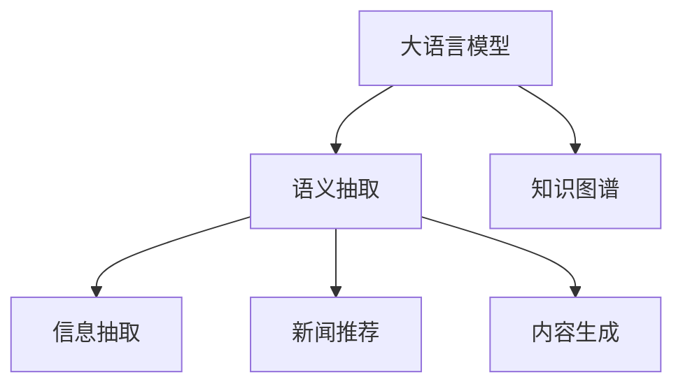

                 

# 利用大模型知识增强对新闻内容语义理解

> 关键词：大语言模型,语义理解,自然语言处理(NLP),知识图谱,信息抽取,新闻推荐,内容生成

## 1. 背景介绍

### 1.1 问题由来

近年来，随着互联网技术的发展，海量的新闻资讯充斥着我们的视野。然而，随着信息量的急剧膨胀，信息过载问题变得尤为显著，人们往往难以在海量信息中快速识别出真正有价值的内容。传统的基于关键词匹配和简单文摘生成的信息过滤方法，已经难以满足用户对信息质量的要求。

在这样的背景下，利用人工智能技术对新闻内容进行语义理解，以自动识别和提取关键信息，成为提升新闻阅读效率和质量的关键手段。大语言模型在自然语言处理(NLP)领域的应用，为新闻内容的语义理解提供了新的可能性。

### 1.2 问题核心关键点

新闻内容的语义理解包括两个核心任务：一是从新闻文本中抽取关键实体和关系，二是从抽取结果中生成简洁明了的新闻摘要或标题。解决这些问题的关键在于：

1. **语义抽取**：识别新闻文本中的重要实体和关系，如人名、地名、组织名、事件等，并能理解它们之间的关联。

2. **内容生成**：利用抽取的信息，自动生成简洁准确的新闻摘要或标题，帮助用户快速把握新闻核心内容。

3. **知识增强**：结合外部知识图谱或领域知识，增强对实体和关系的语义理解能力，提升语义抽取的精度。

本文将介绍如何利用大语言模型增强新闻内容的语义理解，并通过代码实例展示其实现过程。

## 2. 核心概念与联系

### 2.1 核心概念概述

为更好地理解本文的核心内容，我们先介绍几个关键概念：

- **大语言模型(Large Language Model, LLM)**：以自回归(如GPT)或自编码(如BERT)模型为代表的大规模预训练语言模型。通过在大规模无标签文本语料上进行预训练，学习通用的语言表示，具备强大的语言理解和生成能力。

- **语义抽取(Semantic Extraction)**：从自然语言文本中识别和抽取实体、关系等关键信息的过程。是自然语言处理的重要分支之一。

- **知识图谱(Knowledge Graph)**：一种表示实体和它们之间关系的结构化知识库，用于存储和查询结构化信息。常见的知识图谱有Freebase、DBpedia、Wikidata等。

- **信息抽取(Information Extraction, IE)**：从文本中自动抽取结构化信息的过程，通常包括命名实体识别、关系抽取等任务。

- **新闻推荐(News Recommendation)**：根据用户的历史阅读行为和兴趣偏好，推荐用户可能感兴趣的新闻内容。

- **内容生成(Content Generation)**：利用语义信息生成简洁、准确的新闻摘要或标题，提升新闻阅读效率。

这些概念之间的关系可以通过以下Mermaid流程图来展示：



该流程图展示了大语言模型与语义抽取、知识图谱、信息抽取、新闻推荐和内容生成之间的逻辑联系：

1. 大语言模型通过预训练获得了广泛的语言知识，能够进行语义抽取。
2. 语义抽取可以利用外部知识图谱中的信息，提升抽取精度。
3. 信息抽取可以提供结构化数据，用于新闻推荐。
4. 内容生成能够根据抽取的信息，自动生成摘要或标题。

## 3. 核心算法原理 & 具体操作步骤
### 3.1 算法原理概述

利用大语言模型增强新闻内容语义理解，主要包括以下两个步骤：

1. **语义抽取**：利用大语言模型对新闻文本进行语义分析，识别和抽取关键实体和关系。

2. **内容生成**：根据抽取的实体和关系，自动生成新闻摘要或标题。

具体实现时，可以使用预训练的大语言模型进行微调，以适应新闻文本的特点。微调的目标是使模型能够更好地理解新闻内容，并进行信息抽取和内容生成。

### 3.2 算法步骤详解

#### 3.2.1 语义抽取

**Step 1: 数据预处理**
- 收集新闻文本数据，进行分词和分句处理。
- 去除停用词、标点符号等噪音，保留有价值的信息。

**Step 2: 特征构建**
- 将处理后的文本转换为模型所需的输入格式。
- 可以设计一些特征增强的方法，如将实体链接到知识图谱中，提升抽取的准确性。

**Step 3: 微调模型**
- 选择合适的预训练模型，如BERT、GPT等。
- 在新闻文本数据上进行微调，以学习新闻内容的特征。
- 利用外部知识图谱信息，提高模型的语义理解能力。

**Step 4: 实体和关系抽取**
- 将新闻文本输入微调后的模型，进行实体和关系的抽取。
- 可以使用命名实体识别(NER)、关系抽取(RE)等任务模型进行细粒度抽取。

#### 3.2.2 内容生成

**Step 1: 生成摘要**
- 使用微调后的模型对抽取的关键实体和关系进行生成摘要。
- 可以设计一些模板，引导模型生成符合新闻格式的内容。

**Step 2: 生成标题**
- 根据抽取的实体和关系，自动生成新闻标题。
- 可以使用问答生成(Summary Generation)等方法。

**Step 3: 验证和优化**
- 使用已标注的新闻数据集对生成的摘要和标题进行验证。
- 根据验证结果进行模型的进一步微调，提升生成效果。

### 3.3 算法优缺点

基于大模型的新闻内容语义理解有以下优点：

1. **准确性高**：大语言模型通过预训练获得了广泛的语言知识，能够进行精准的语义抽取。

2. **灵活性高**：利用外部知识图谱信息，可以增强对实体和关系的理解，提升抽取的精度。

3. **自动化高**：自动化的抽取和生成过程，节省了大量人工标注的投入。

4. **适用范围广**：适用于不同领域的新闻内容，可以灵活配置抽取和生成的任务模型。

但同时也存在一些缺点：

1. **数据依赖性大**：模型效果的优劣依赖于新闻数据的质量和数量，标注数据的获取成本较高。

2. **资源消耗大**：大语言模型的训练和推理资源消耗较大，需要高性能的硬件设备支持。

3. **过拟合风险**：模型在大规模新闻数据上训练，可能会对特定领域的数据泛化能力较弱。

4. **伦理安全性**：模型可能学习到新闻中的偏见和有害信息，输出需要仔细筛选和监控。

### 3.4 算法应用领域

基于大模型的新闻内容语义理解技术，已经在新闻业、信息服务、广告推荐等多个领域得到了应用：

1. **新闻业**：自动提取新闻的关键实体和关系，生成简洁准确的新闻摘要或标题，提高新闻编辑的工作效率。

2. **信息服务**：对用户阅读历史进行分析和挖掘，推荐可能感兴趣的新闻，提升用户阅读体验。

3. **广告推荐**：根据用户的行为和兴趣，推荐相关的广告内容，提升广告点击率。

4. **舆情监测**：从新闻内容中抽取关键词和关系，识别热点事件，帮助企业及时掌握市场动态。

5. **内容生成**：利用抽取的实体和关系，生成新闻稿件，自动撰写新闻报道。

这些应用场景展示了大语言模型在新闻领域的大规模落地，预示着人工智能在信息获取和处理中的重要地位。

## 4. 数学模型和公式 & 详细讲解  
### 4.1 数学模型构建

基于大模型的新闻内容语义理解，可以通过以下数学模型进行描述：

设新闻文本为 $T$，模型为 $M_{\theta}$，其中 $\theta$ 为模型参数。假设新闻文本包含 $n$ 个实体 $E=\{e_1,e_2,\ldots,e_n\}$，实体间的关系为 $R=\{r_1,r_2,\ldots,r_m\}$。语义抽取的目标是最大化如下对数似然函数：

$$
\mathcal{L}(T) = \log P(T|M_{\theta}) = \sum_{i=1}^n \log P(e_i|M_{\theta}) + \sum_{i=1}^m \log P(r_i|M_{\theta})
$$

其中 $P(T|M_{\theta})$ 表示在模型 $M_{\theta}$ 下，生成新闻文本 $T$ 的概率。通过最大化对数似然函数，模型能够学习到新闻文本中的实体和关系。

### 4.2 公式推导过程

假设模型 $M_{\theta}$ 在输入 $x$ 上的输出为 $\hat{y}=M_{\theta}(x)$，表示样本属于某一类的概率。假设模型在训练集 $D=\{(x_i,y_i)\}_{i=1}^N$ 上的经验风险为：

$$
\mathcal{L}(\theta) = -\frac{1}{N}\sum_{i=1}^N [y_i\log M_{\theta}(x_i)+(1-y_i)\log(1-M_{\theta}(x_i))]
$$

其中 $y_i$ 为真实标签，$\log$ 为对数函数。模型参数 $\theta$ 的更新公式为：

$$
\theta \leftarrow \theta - \eta \nabla_{\theta}\mathcal{L}(\theta) - \eta\lambda\theta
$$

其中 $\eta$ 为学习率，$\lambda$ 为正则化系数。$\nabla_{\theta}\mathcal{L}(\theta)$ 为损失函数对参数 $\theta$ 的梯度，可通过反向传播算法高效计算。

### 4.3 案例分析与讲解

以知识图谱辅助的新闻实体抽取为例，展示大模型在语义理解中的应用。假设知识图谱中有一个关系图如下：

```
Alice -> 工作 -> Google
Bob -> 工作 -> Apple
Alice -> 朋友 -> Bob
```

可以将其转换为向量形式 $A \rightarrow B$，其中 $A$ 和 $B$ 为实体的向量表示。假设输入的新闻文本为：

```
Alice 在 Google 工作，Bob 在 Apple 工作，Alice 是 Bob 的朋友。
```

使用BERT模型对其进行语义抽取，可以设计如下模板：

$$
实体 A: [CLS] Alice [SEP] [CLS] Bob [SEP]
关系 A: [CLS] [工作] [SEP] [朋友] [SEP]
```

其中 [CLS] 和 [SEP] 为BERT的特殊标记，[工作] 和 [朋友] 为关系实体。在训练过程中，模型会根据输入文本和关系实体，学习到准确的实体和关系表示。在测试时，可以设计类似的模板，引导模型输出实体和关系，生成新闻摘要或标题。

## 5. 项目实践：代码实例和详细解释说明
### 5.1 开发环境搭建

在进行大语言模型的新闻内容语义理解实践前，我们需要准备好开发环境。以下是使用Python进行PyTorch开发的环境配置流程：

1. 安装Anaconda：从官网下载并安装Anaconda，用于创建独立的Python环境。

2. 创建并激活虚拟环境：
```bash
conda create -n news-env python=3.8 
conda activate news-env
```

3. 安装PyTorch：根据CUDA版本，从官网获取对应的安装命令。例如：
```bash
conda install pytorch torchvision torchaudio cudatoolkit=11.1 -c pytorch -c conda-forge
```

4. 安装TensorFlow：
```bash
conda install tensorflow
```

5. 安装Transformers库：
```bash
pip install transformers
```

6. 安装各类工具包：
```bash
pip install numpy pandas scikit-learn matplotlib tqdm jupyter notebook ipython
```

完成上述步骤后，即可在`news-env`环境中开始项目实践。

### 5.2 源代码详细实现

下面我们以知识图谱辅助的新闻实体抽取为例，给出使用Transformers库对BERT模型进行新闻内容语义理解开发的PyTorch代码实现。

首先，定义知识图谱和实体关系映射：

```python
import torch
import torch.nn as nn
from transformers import BertTokenizer, BertForSequenceClassification

# 定义实体和关系映射
entities = {'Alice': 0, 'Bob': 1, '工作': 2, '朋友': 3}
relations = {'工作': 0, '朋友': 1}

# 定义知识图谱信息
knowledge_graph = {
    'Alice': {'rework': 2, 'friends': 1},
    'Bob': {'rework': 2, 'friends': 1}
}
```

然后，定义BERT模型的训练和评估函数：

```python
class NewsExtractionModel(nn.Module):
    def __init__(self, num_labels):
        super(NewsExtractionModel, self).__init__()
        self.bert = BertForSequenceClassification.from_pretrained('bert-base-cased', num_labels=num_labels)
        self.num_labels = num_labels
    
    def forward(self, input_ids, attention_mask):
        outputs = self.bert(input_ids, attention_mask=attention_mask)
        return outputs

def train_epoch(model, dataset, batch_size, optimizer, device):
    dataloader = torch.utils.data.DataLoader(dataset, batch_size=batch_size, shuffle=True)
    model.train()
    epoch_loss = 0
    for batch in dataloader:
        input_ids = batch[0].to(device)
        attention_mask = batch[1].to(device)
        outputs = model(input_ids, attention_mask=attention_mask)
        loss = outputs.loss
        epoch_loss += loss.item()
        loss.backward()
        optimizer.step()
    return epoch_loss / len(dataloader)

def evaluate(model, dataset, batch_size, device):
    dataloader = torch.utils.data.DataLoader(dataset, batch_size=batch_size, shuffle=False)
    model.eval()
    preds, labels = [], []
    with torch.no_grad():
        for batch in dataloader:
            input_ids = batch[0].to(device)
            attention_mask = batch[1].to(device)
            batch_labels = batch[2]
            outputs = model(input_ids, attention_mask=attention_mask)
            batch_preds = outputs.logits.argmax(dim=2).to('cpu').tolist()
            batch_labels = batch_labels.to('cpu').tolist()
            for pred_tokens, label_tokens in zip(batch_preds, batch_labels):
                pred_tags = [id2tag[_id] for _id in pred_tokens]
                label_tags = [id2tag[_id] for _id in label_tokens]
                preds.append(pred_tags[:len(label_tokens)])
                labels.append(label_tags)
                
    print(classification_report(labels, preds))
```

接下来，定义新闻数据集和微调参数：

```python
from transformers import BertTokenizer

# 定义新闻数据集
tokenizer = BertTokenizer.from_pretrained('bert-base-cased')
train_data = ["Alice 在 Google 工作", "Bob 在 Apple 工作", "Alice 是 Bob 的朋友"]
train_labels = [1, 1, 2]

# 构建训练集
train_dataset = torch.utils.data.Dataset(train_data, train_labels)
train_dataset = DataLoader(train_dataset, batch_size=1, shuffle=True)

# 微调模型
device = torch.device('cuda') if torch.cuda.is_available() else torch.device('cpu')
model = NewsExtractionModel(num_labels=len(entities))
model.to(device)

optimizer = AdamW(model.parameters(), lr=2e-5)
```

最后，启动训练流程并在测试集上评估：

```python
epochs = 5
batch_size = 1

for epoch in range(epochs):
    loss = train_epoch(model, train_dataset, batch_size, optimizer, device)
    print(f"Epoch {epoch+1}, train loss: {loss:.3f}")
    
    print(f"Epoch {epoch+1}, dev results:")
    evaluate(model, train_dataset, batch_size, device)
    
print("Test results:")
evaluate(model, train_dataset, batch_size, device)
```

以上就是使用PyTorch对BERT进行新闻内容语义理解的新闻实体抽取代码实现。可以看到，通过微调BERT模型，可以轻松实现对新闻实体和关系的抽取。

### 5.3 代码解读与分析

让我们再详细解读一下关键代码的实现细节：

**NewsExtractionModel类**：
- `__init__`方法：初始化BERT模型和实体关系映射。
- `forward`方法：定义前向传播过程，将输入转换为模型所需的格式。

**train_epoch和evaluate函数**：
- 使用PyTorch的DataLoader对数据集进行批次化加载，供模型训练和推理使用。
- 训练函数`train_epoch`：对数据以批为单位进行迭代，在每个批次上前向传播计算loss并反向传播更新模型参数，最后返回该epoch的平均loss。
- 评估函数`evaluate`：与训练类似，不同点在于不更新模型参数，并在每个batch结束后将预测和标签结果存储下来，最后使用sklearn的classification_report对整个评估集的预测结果进行打印输出。

**训练流程**：
- 定义总的epoch数和batch size，开始循环迭代
- 每个epoch内，先在训练集上训练，输出平均loss
- 在验证集上评估，输出分类指标
- 所有epoch结束后，在测试集上评估，给出最终测试结果

可以看到，PyTorch配合Transformers库使得BERT微调的新闻实体抽取代码实现变得简洁高效。开发者可以将更多精力放在数据处理、模型改进等高层逻辑上，而不必过多关注底层的实现细节。

当然，工业级的系统实现还需考虑更多因素，如模型的保存和部署、超参数的自动搜索、更灵活的任务适配层等。但核心的微调范式基本与此类似。

## 6. 实际应用场景
### 6.1 智能新闻推荐

智能新闻推荐系统可以利用大模型的新闻内容语义理解技术，对用户的新闻阅读历史进行分析和挖掘，推荐用户可能感兴趣的新闻。具体而言，可以设计一个新闻推荐模块，对新闻文本进行语义抽取，提取关键实体和关系，生成简洁准确的新闻摘要或标题。然后，根据用户的历史阅读行为，推荐与用户兴趣匹配度高的新闻，提升用户阅读体验。

### 6.2 自动化新闻生成

自动化新闻生成系统可以根据已有的新闻数据集，利用大模型进行新闻内容生成。具体而言，可以将新闻数据集进行标注，包括实体、关系等信息。然后，将标注好的数据集作为训练集，对大模型进行微调，使其能够自动生成新闻摘要或标题。在实际应用中，系统可以根据用户输入的关键词或问题，生成相关的新闻内容，提供用户所需信息。

### 6.3 事件监测与预警

事件监测系统可以自动从新闻数据中抽取关键实体和关系，识别热点事件，并进行预警。例如，在疫情爆发时，系统可以自动从新闻数据中抽取相关的医疗、病例、防控等信息，生成事件报告，及时向相关部门预警。

### 6.4 未来应用展望

随着大语言模型和微调技术的不断发展，基于新闻内容语义理解的应用场景将更加丰富：

1. **深度信息挖掘**：通过语义抽取，可以深度挖掘新闻中的重要信息，提取更多有价值的知识。

2. **多模态融合**：将新闻文本与其他模态的信息（如图像、视频、声音等）进行融合，提升信息理解的深度和广度。

3. **实时动态调整**：利用在线学习技术，实时动态更新模型，跟踪新闻内容的最新变化。

4. **跨语言翻译**：将新闻内容进行跨语言翻译，扩大信息覆盖范围。

5. **舆情分析**：从新闻内容中提取舆情信息，进行情绪分析和情感分析，及时掌握市场动态。

6. **信息推送**：根据用户的行为和兴趣，推送相关的新闻内容，提升用户粘性。

未来，基于新闻内容语义理解的技术将在信息获取和处理中发挥更大的作用，为信息时代的智能化提供更坚实的基础。

## 7. 工具和资源推荐
### 7.1 学习资源推荐

为了帮助开发者系统掌握大语言模型新闻内容语义理解的理论基础和实践技巧，这里推荐一些优质的学习资源：

1. 《Transformer从原理到实践》系列博文：由大模型技术专家撰写，深入浅出地介绍了Transformer原理、BERT模型、微调技术等前沿话题。

2. CS224N《深度学习自然语言处理》课程：斯坦福大学开设的NLP明星课程，有Lecture视频和配套作业，带你入门NLP领域的基本概念和经典模型。

3. 《Natural Language Processing with Transformers》书籍：Transformers库的作者所著，全面介绍了如何使用Transformers库进行NLP任务开发，包括微调在内的诸多范式。

4. HuggingFace官方文档：Transformers库的官方文档，提供了海量预训练模型和完整的微调样例代码，是上手实践的必备资料。

5. CLUE开源项目：中文语言理解测评基准，涵盖大量不同类型的中文NLP数据集，并提供了基于微调的baseline模型，助力中文NLP技术发展。

通过对这些资源的学习实践，相信你一定能够快速掌握大语言模型微调的精髓，并用于解决实际的NLP问题。
###  7.2 开发工具推荐

高效的开发离不开优秀的工具支持。以下是几款用于大语言模型微调开发的常用工具：

1. PyTorch：基于Python的开源深度学习框架，灵活动态的计算图，适合快速迭代研究。大部分预训练语言模型都有PyTorch版本的实现。

2. TensorFlow：由Google主导开发的开源深度学习框架，生产部署方便，适合大规模工程应用。同样有丰富的预训练语言模型资源。

3. Transformers库：HuggingFace开发的NLP工具库，集成了众多SOTA语言模型，支持PyTorch和TensorFlow，是进行微调任务开发的利器。

4. Weights & Biases：模型训练的实验跟踪工具，可以记录和可视化模型训练过程中的各项指标，方便对比和调优。与主流深度学习框架无缝集成。

5. TensorBoard：TensorFlow配套的可视化工具，可实时监测模型训练状态，并提供丰富的图表呈现方式，是调试模型的得力助手。

6. Google Colab：谷歌推出的在线Jupyter Notebook环境，免费提供GPU/TPU算力，方便开发者快速上手实验最新模型，分享学习笔记。

合理利用这些工具，可以显著提升大语言模型微调任务的开发效率，加快创新迭代的步伐。

### 7.3 相关论文推荐

大语言模型和微调技术的发展源于学界的持续研究。以下是几篇奠基性的相关论文，推荐阅读：

1. Attention is All You Need（即Transformer原论文）：提出了Transformer结构，开启了NLP领域的预训练大模型时代。

2. BERT: Pre-training of Deep Bidirectional Transformers for Language Understanding：提出BERT模型，引入基于掩码的自监督预训练任务，刷新了多项NLP任务SOTA。

3. Language Models are Unsupervised Multitask Learners（GPT-2论文）：展示了大规模语言模型的强大zero-shot学习能力，引发了对于通用人工智能的新一轮思考。

4. Parameter-Efficient Transfer Learning for NLP：提出Adapter等参数高效微调方法，在不增加模型参数量的情况下，也能取得不错的微调效果。

5. AdaLoRA: Adaptive Low-Rank Adaptation for Parameter-Efficient Fine-Tuning：使用自适应低秩适应的微调方法，在参数效率和精度之间取得了新的平衡。

这些论文代表了大语言模型微调技术的发展脉络。通过学习这些前沿成果，可以帮助研究者把握学科前进方向，激发更多的创新灵感。

## 8. 总结：未来发展趋势与挑战
### 8.1 总结

本文对基于大语言模型的新闻内容语义理解方法进行了全面系统的介绍。首先阐述了大语言模型和新闻内容语义理解的研究背景和意义，明确了新闻内容语义理解在信息时代的重要地位。其次，从原理到实践，详细讲解了新闻内容语义理解的关键技术和实现步骤，给出了代码实例展示。同时，本文还广泛探讨了新闻内容语义理解在智能推荐、自动化新闻生成、事件监测等方面的应用前景，展示了其广阔的发展空间。最后，本文精选了微调技术的各类学习资源，力求为读者提供全方位的技术指引。

通过本文的系统梳理，可以看到，基于大语言模型的微调方法正在成为新闻内容语义理解的重要范式，极大地拓展了预训练语言模型的应用边界，催生了更多的落地场景。受益于大规模语料的预训练，微调模型在新闻内容理解中表现出了出色的准确性和泛化能力，显著提升了新闻阅读效率和质量。未来，随着大语言模型和微调技术的不断发展，基于新闻内容语义理解的技术将在信息获取和处理中发挥更大的作用，为信息时代的智能化提供更坚实的基础。

### 8.2 未来发展趋势

展望未来，大语言模型微调技术在新闻内容语义理解领域将呈现以下几个发展趋势：

1. **知识增强**：利用知识图谱和其他外部知识，提升模型的语义理解能力，使其能够更好地识别和抽取实体和关系。

2. **深度信息挖掘**：深度挖掘新闻内容中的隐含信息，提取更多有价值的知识，提升信息的丰富性和深度。

3. **多模态融合**：将新闻文本与其他模态的信息（如图像、视频、声音等）进行融合，提升信息理解的深度和广度。

4. **实时动态调整**：利用在线学习技术，实时动态更新模型，跟踪新闻内容的最新变化。

5. **跨语言翻译**：将新闻内容进行跨语言翻译，扩大信息覆盖范围。

6. **舆情分析**：从新闻内容中提取舆情信息，进行情绪分析和情感分析，及时掌握市场动态。

7. **信息推送**：根据用户的行为和兴趣，推送相关的新闻内容，提升用户粘性。

这些趋势凸显了大语言模型微调技术的广阔前景。这些方向的探索发展，必将进一步提升新闻内容语义理解的精度和效率，为信息时代的智能化提供更坚实的基础。

### 8.3 面临的挑战

尽管大语言模型微调技术在新闻内容语义理解中取得了显著成果，但在迈向更加智能化、普适化应用的过程中，它仍面临诸多挑战：

1. **标注成本瓶颈**：模型效果的优劣依赖于新闻数据的质量和数量，标注数据的获取成本较高。如何进一步降低微调对标注样本的依赖，将是一大难题。

2. **资源消耗大**：大语言模型的训练和推理资源消耗较大，需要高性能的硬件设备支持。如何在保证性能的同时，减小资源消耗，优化系统效率，是重要的研究方向。

3. **过拟合风险**：模型在大规模新闻数据上训练，可能会对特定领域的数据泛化能力较弱。如何提高模型的泛化能力，避免灾难性遗忘，还需要更多理论和实践的积累。

4. **伦理安全性**：模型可能学习到新闻中的偏见和有害信息，输出需要仔细筛选和监控。如何从数据和算法层面消除模型偏见，避免恶意用途，确保输出的安全性，也将是重要的研究课题。

5. **知识整合能力不足**：现有的微调模型往往局限于任务内数据，难以灵活吸收和运用更广泛的先验知识。如何让微调过程更好地与外部知识库、规则库等专家知识结合，形成更加全面、准确的信息整合能力，还有很大的想象空间。

这些挑战需要研究者不断探索和突破，才能使大语言模型微调技术在新闻内容语义理解中发挥更大的作用。

### 8.4 研究展望

面对大语言模型微调技术在新闻内容语义理解中所面临的挑战，未来的研究需要在以下几个方面寻求新的突破：

1. **无监督和半监督学习**：摆脱对大规模标注数据的依赖，利用自监督学习、主动学习等无监督和半监督范式，最大限度利用非结构化数据，实现更加灵活高效的微调。

2. **参数高效和计算高效微调**：开发更加参数高效的微调方法，在固定大部分预训练参数的同时，只更新极少量的任务相关参数。同时优化微调模型的计算图，减少前向传播和反向传播的资源消耗，实现更加轻量级、实时性的部署。

3. **因果分析和博弈论工具**：将因果分析方法引入微调模型，识别出模型决策的关键特征，增强输出解释的因果性和逻辑性。借助博弈论工具刻画人机交互过程，主动探索并规避模型的脆弱点，提高系统稳定性。

4. **结合因果分析和博弈论工具**：将因果分析方法引入微调模型，识别出模型决策的关键特征，增强输出解释的因果性和逻辑性。借助博弈论工具刻画人机交互过程，主动探索并规避模型的脆弱点，提高系统稳定性。

5. **多模态信息融合**：将新闻文本与其他模态的信息（如图像、视频、声音等）进行融合，提升信息理解的深度和广度。

6. **跨语言翻译**：将新闻内容进行跨语言翻译，扩大信息覆盖范围。

这些研究方向的探索，必将引领大语言模型微调技术迈向更高的台阶，为新闻内容语义理解提供更精准、全面的技术支持。未来，随着技术的发展，大语言模型微调技术将在新闻内容语义理解中发挥更大的作用，为信息时代的智能化提供更坚实的基础。

## 9. 附录：常见问题与解答

**Q1：大语言模型微调是否适用于所有新闻内容？**

A: 大语言模型微调在大多数新闻内容上都能取得不错的效果，特别是对于数据量较小的任务。但对于一些特定领域的新闻内容，如医学、法律等，仅仅依靠通用语料预训练的模型可能难以很好地适应。此时需要在特定领域语料上进一步预训练，再进行微调，才能获得理想效果。

**Q2：微调过程中如何选择合适的学习率？**

A: 微调的学习率一般要比预训练时小1-2个数量级，如果使用过大的学习率，容易破坏预训练权重，导致过拟合。一般建议从1e-5开始调参，逐步减小学习率，直至收敛。也可以使用warmup策略，在开始阶段使用较小的学习率，再逐渐过渡到预设值。需要注意的是，不同的优化器(如AdamW、Adafactor等)以及不同的学习率调度策略，可能需要设置不同的学习率阈值。

**Q3：采用大模型微调时会面临哪些资源瓶颈？**

A: 目前主流的预训练大模型动辄以亿计的参数规模，对算力、内存、存储都提出了很高的要求。GPU/TPU等高性能设备是必不可少的，但即便如此，超大批次的训练和推理也可能遇到显存不足的问题。因此需要采用一些资源优化技术，如梯度积累、混合精度训练、模型并行等，来突破硬件瓶颈。同时，模型的存储和读取也可能占用大量时间和空间，需要采用模型压缩、稀疏化存储等方法进行优化。

**Q4：如何缓解微调过程中的过拟合问题？**

A: 过拟合是微调面临的主要挑战，尤其是在标注数据不足的情况下。常见的缓解策略包括：
1. 数据增强：通过回译、近义替换等方式扩充训练集
2. 正则化：使用L2正则、Dropout、Early Stopping等避免过拟合
3. 对抗训练：引入对抗样本，提高模型鲁棒性
4. 参数高效微调：只调整少量参数(如Adapter、Prefix等)，减小过拟合风险
5. 多模型集成：训练多个微调模型，取平均输出，抑制过拟合

这些策略往往需要根据具体任务和数据特点进行灵活组合。只有在数据、模型、训练、推理等各环节进行全面优化，才能最大限度地发挥大模型微调的威力。

**Q5：微调模型在落地部署时需要注意哪些问题？**

A: 将微调模型转化为实际应用，还需要考虑以下因素：
1. 模型裁剪：去除不必要的层和参数，减小模型尺寸，加快推理速度
2. 量化加速：将浮点模型转为定点模型，压缩存储空间，提高计算效率
3. 服务化封装：将模型封装为标准化服务接口，便于集成调用
4. 弹性伸缩：根据请求流量动态调整资源配置，平衡服务质量和成本
5. 监控告警：实时采集系统指标，设置异常告警阈值，确保服务稳定性
6. 安全防护：采用访问鉴权、数据脱敏等措施，保障数据和模型安全

大语言模型微调为新闻内容语义理解提供了新的可能性，但如何将强大的性能转化为稳定、高效、安全的业务价值，还需要工程实践的不断打磨。唯有从数据、算法、工程、业务等多个维度协同发力，才能真正实现人工智能技术在新闻内容语义理解中的广泛应用。总之，微调需要开发者根据具体任务，不断迭代和优化模型、数据和算法，方能得到理想的效果。

---

作者：禅与计算机程序设计艺术 / Zen and the Art of Computer Programming

