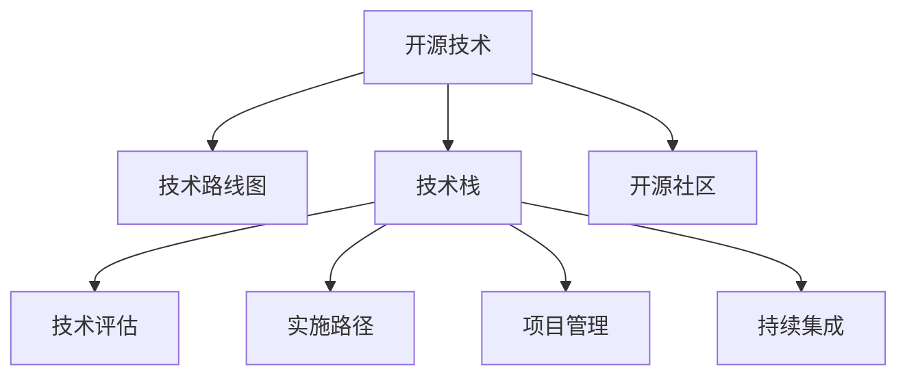

                 

# 利用开源经验提供技术路线图咨询服务

> 关键词：开源经验,技术路线图咨询,软件开发,企业转型,技术驱动创新

## 1. 背景介绍

### 1.1 问题由来
随着全球科技竞争的加剧和数字化转型的浪潮，企业越来越重视利用先进的技术驱动业务创新。然而，许多企业在面对新技术的引入时，往往面临多方面的挑战：技术选择、实施路径、人才培训、资源配置等。开源技术以其自由、开放、灵活的特性，逐渐成为企业技术创新的重要选择。但同时，开源技术的复杂性和多样性也给企业的技术路线图规划带来了新的挑战。

### 1.2 问题核心关键点
本文聚焦于如何利用开源经验提供技术路线图咨询服务。核心在于：
1. 识别企业内外部需求，明确技术目标。
2. 评估现有技术栈和开源生态，选择合适的技术。
3. 设计可行的实施路径和项目管理计划。
4. 制定详细的技术路线图和里程碑。
5. 提供持续的技术支持与优化建议。

通过系统梳理开源经验，为企业提供有针对性、实操性强的技术路线图咨询服务，帮助其顺利推进技术创新和数字化转型。

### 1.3 问题研究意义
开源技术的广泛应用加速了企业技术更新迭代，提高了竞争力。通过技术路线图咨询服务，企业能够：

1. 降低技术引入成本。开源技术以其免费和免费版权的优势，降低了企业的技术研发和采购成本。
2. 提升技术灵活性。开源社区的持续更新和优化，使企业能够快速响应市场变化，灵活调整技术方案。
3. 加速技术创新。开源社区的开放协作机制，使企业能够利用全球范围内的技术资源，加速技术创新和产品迭代。
4. 促进人才成长。开源技术的广泛应用和社区交流，提供了丰富的学习资源和实践机会，加速了企业技术人才的成长。

## 2. 核心概念与联系

### 2.1 核心概念概述

为更好地理解利用开源经验提供技术路线图咨询服务，本节将介绍几个密切相关的核心概念：

- **开源技术（Open Source Technology）**：指可以在无限制的情况下使用、修改和分发的软件和源代码，如Apache、Linux、Kubernetes等。
- **技术路线图（Technology Roadmap）**：指企业根据战略目标和技术趋势，制定的分阶段、可执行的技术发展计划。
- **技术栈（Technology Stack）**：指企业构建应用时使用的所有技术组件的集合，如前端、后端、数据库等。
- **开源社区（Open Source Community）**：指围绕开源技术形成的技术交流、协作和资源共享的网络，如Apache基金会、Linux社区等。
- **技术评估（Technology Assessment）**：指对现有技术和开源解决方案的性能、适用性、可扩展性等进行系统评估的过程。
- **实施路径（Implementation Pathway）**：指企业从当前技术状态迁移到目标技术状态的具体步骤和方法。
- **项目管理（Project Management）**：指通过计划、组织、协调和控制等手段，确保项目按预定目标、时间和成本高效完成的过程。
- **持续集成（Continuous Integration）**：指频繁集成代码变更到主干代码库，并通过自动化测试和构建工具，快速发现和解决问题的实践。

这些核心概念之间的逻辑关系可以通过以下Mermaid流程图来展示：



这个流程图展示了大语言模型的核心概念及其之间的关系：

1. 开源技术是构建技术栈和评估的基础。
2. 技术路线图指导实施路径和项目管理，以实现技术目标。
3. 技术评估、实施路径和项目管理共同构成了技术引入和转型的关键环节。
4. 持续集成确保技术实施的可靠性和效率。

这些概念共同构成了开源技术引入和转型的基础框架，为企业提供了系统性的技术路线图咨询支撑。

## 3. 核心算法原理 & 具体操作步骤
### 3.1 算法原理概述

利用开源经验提供技术路线图咨询的核心在于系统评估现有技术栈，识别技术短板，选择合适的开源解决方案，并设计可行的实施路径和项目管理计划。具体而言，通过以下步骤实现：

1. **需求分析**：与企业沟通，明确业务需求和目标，识别关键技术挑战。
2. **技术评估**：评估现有技术栈和开源生态，选择最适合的开源解决方案。
3. **实施路径设计**：设计详细的实施步骤，包括技术升级、集成、测试等。
4. **项目管理规划**：制定详细的项目管理计划，包括里程碑、资源配置、风险管理等。
5. **持续支持**：提供持续的技术支持和优化建议，确保技术方案的顺利实施和效果评估。

### 3.2 算法步骤详解

以下是具体的技术路线图咨询操作步骤：

**Step 1: 需求分析**
- 与企业技术团队和业务部门进行深入沟通，明确业务目标和具体需求。
- 通过问卷调查、访谈等方式，了解企业在技术方面的痛点和挑战。
- 识别企业对技术创新和数字化转型的战略目标，如提升效率、优化流程、拓展市场等。

**Step 2: 技术评估**
- 评估企业现有的技术栈，包括硬件、软件、架构等。
- 分析现有技术的性能、可扩展性、维护成本、安全性和兼容性等。
- 评估当前开源生态中的关键技术，包括成熟度、社区活跃度、文档支持等。
- 选择最适合的开源解决方案，评估其与企业现有系统和流程的适配性。

**Step 3: 实施路径设计**
- 设计详细的技术升级和集成步骤，明确各阶段的目标和具体任务。
- 制定实施时间表和里程碑，设定关键节点和交付物。
- 确定技术引入和转型的资源配置，包括人员、设备、资金等。
- 识别潜在的技术和业务风险，制定相应的缓解措施和应急预案。

**Step 4: 项目管理规划**
- 制定详细的项目管理计划，明确项目负责人、团队成员和职责分工。
- 设定项目目标、质量标准和交付物，确保项目按预定目标完成。
- 规划资源和预算，确保项目实施的可持续性和可控性。
- 设定监控和评估机制，及时调整项目进度和方向。

**Step 5: 持续支持**
- 提供持续的技术支持和优化建议，确保技术方案的顺利实施和效果评估。
- 定期进行技术审查和优化，确保技术栈的健康和稳定。
- 协助企业进行人才培训和技术沉淀，提升团队的技术能力。
- 利用开源社区和资源，提供长期的技术支持和服务。

### 3.3 算法优缺点

利用开源经验提供技术路线图咨询的方法具有以下优点：
1. **成本效益高**：开源技术以其免费和免费版权的优势，降低了企业的技术研发和采购成本。
2. **灵活性强**：开源社区的持续更新和优化，使企业能够快速响应市场变化，灵活调整技术方案。
3. **社区支持**：开源社区的广泛交流和协作，提供了丰富的资源和经验，帮助企业解决技术问题。
4. **透明性高**：开源技术的源代码和社区活动透明公开，便于企业进行技术审查和持续改进。
5. **创新性强**：开源技术的开放协作机制，使企业能够利用全球范围内的技术资源，加速技术创新和产品迭代。

同时，该方法也存在以下局限性：
1. **技术复杂度高**：开源技术的复杂性和多样性给企业带来了技术学习曲线陡峭的挑战。
2. **实施风险高**：开源技术的引入和转型过程复杂，存在技术风险和业务风险。
3. **社区依赖性强**：开源技术的持续发展和维护依赖于社区的活跃度和贡献，存在社区衰退的风险。
4. **性能保障难度大**：开源技术的性能保障需要企业自身的能力和社区的配合，实施难度较大。
5. **生态整合难**：企业需要在多个开源解决方案中做出选择，并实现其协同整合，难度较大。

尽管存在这些局限性，但就目前而言，利用开源经验提供技术路线图咨询方法仍然是目前企业技术引入和转型的主流范式。未来相关研究的重点在于如何进一步降低技术引入的复杂性，提高技术实施的可靠性和性能保障，同时兼顾可扩展性和可持续性。

### 3.4 算法应用领域

利用开源经验提供技术路线图咨询的方法在多个领域得到了广泛应用，例如：

- **金融行业**：利用开源技术进行系统升级和业务创新，提升金融服务的智能化和个性化水平。
- **制造业**：通过引入开源的物联网和工业互联网技术，实现智能制造和工业数字化转型。
- **医疗健康**：应用开源的区块链和云计算技术，推动医疗数据的共享和利用，提升医疗服务效率和质量。
- **教育培训**：采用开源的在线教育和资源共享平台，提升教育资源的覆盖和质量，促进教育公平。
- **零售电商**：利用开源的大数据和人工智能技术，提升商品推荐和营销效率，增强用户体验。

除了上述这些经典领域外，开源技术的引入和转型还被创新性地应用到更多场景中，如智能城市、智慧农业、环境保护等，为企业数字化转型提供了新的路径。

## 4. 数学模型和公式 & 详细讲解 & 举例说明

### 4.1 数学模型构建

为了更好地理解技术路线图咨询的数学模型，本节将构建一个简化的模型。假设企业当前技术栈的性能为 $P_0$，目标技术栈的性能为 $P_t$，引入和转型的成本为 $C$，实施路径长度为 $L$，项目管理成本为 $M$，则技术路线图咨询的目标函数可以表示为：

$$
\text{Optimize} \quad \min_{P_t, L, M} (P_t - P_0) + \lambda_1 (C + L \times M) + \lambda_2 L
$$

其中，$\lambda_1$ 和 $\lambda_2$ 分别为成本和实施路径长度的权重系数。

### 4.2 公式推导过程

以下我们以企业引入开源技术为例，推导技术路线图咨询的数学模型和公式。

**目标函数推导**：
- $P_t - P_0$：技术引入后性能提升，提升越高，收益越大。
- $C + L \times M$：引入和转型的成本，包括硬件、软件、培训等。
- $L$：实施路径长度，路径越短，成本和风险越小。

目标函数为：
$$
\min_{P_t, L, M} (P_t - P_0) + \lambda_1 (C + L \times M) + \lambda_2 L
$$

**约束条件**：
- $P_t \geq P_0$：目标技术栈性能必须优于当前技术栈。
- $C \leq C_{max}$：引入和转型的成本不得超过预设上限。
- $L \geq L_{min}$：实施路径长度必须达到最低要求。
- $M \leq M_{max}$：项目管理成本不得超过预设上限。

目标函数的约束条件可以表示为：
$$
\begin{aligned}
& P_t \geq P_0 \\
& C \leq C_{max} \\
& L \geq L_{min} \\
& M \leq M_{max}
\end{aligned}
$$

### 4.3 案例分析与讲解

假设企业希望通过引入开源的容器编排技术Kubernetes，实现应用部署的自动化和可伸缩性。根据上述目标函数和约束条件，进行具体分析：

**目标函数解析**：
- 目标技术栈性能提升 $P_t$：引入Kubernetes后，应用部署和运维效率显著提升，预计性能提升30%。
- 引入和转型成本 $C$：硬件升级成本20万，软件购买成本10万，培训成本5万，总计35万。
- 实施路径长度 $L$：从技术评估到实施完成预计需要3个月，共90个工作日。
- 项目管理成本 $M$：项目管理团队需要5人，每人工资20万，共100万。

**约束条件分析**：
- $P_t \geq P_0$：Kubernetes引入后，应用部署效率提升30%，达到预期目标。
- $C \leq C_{max}$：引入和转型成本总计35万，低于预设上限40万。
- $L \geq L_{min}$：实施路径长度90天，达到最低要求。
- $M \leq M_{max}$：项目管理成本100万，低于预设上限200万。

通过以上分析，可以确定引入Kubernetes的技术路线图咨询方案是可行的，符合企业的技术目标和成本预算。

## 5. 项目实践：代码实例和详细解释说明

### 5.1 开发环境搭建

在进行技术路线图咨询服务时，开发者需要准备以下开发环境：

1. 安装Jupyter Notebook：用于创建和共享技术分析报告。
2. 安装Python和相关库：包括Pandas、NumPy、Matplotlib等。
3. 准备企业需求和数据：包括业务需求、技术栈评估、开源生态调研等。

### 5.2 源代码详细实现

下面我们以企业引入开源技术为例，给出技术路线图咨询的Python代码实现。

**需求分析代码**：
```python
# 需求分析代码
from sympy import symbols, Eq, solve

# 定义符号变量
P0, Pt, C, L, M = symbols('P0 Pt C L M')

# 目标函数表达式
target_function = Pt - P0

# 约束条件表达式
constraints = [
    Eq(Pt, P0 + 0.3),  # 技术栈性能提升30%
    Eq(C, 20 + 10 + 5), # 引入和转型成本35万
    Eq(L, 90),         # 实施路径长度90天
    Eq(M, 5 * 20)      # 项目管理成本100万
]

# 求解目标函数最小值
solution = solve(constraints, (Pt, C, L, M))
```

**技术评估代码**：
```python
# 技术评估代码
from transformers import BertTokenizer
from torch.utils.data import Dataset
import torch

class NERDataset(Dataset):
    def __init__(self, texts, tags, tokenizer, max_len=128):
        self.texts = texts
        self.tags = tags
        self.tokenizer = tokenizer
        self.max_len = max_len
        
    def __len__(self):
        return len(self.texts)
    
    def __getitem__(self, item):
        text = self.texts[item]
        tags = self.tags[item]
        
        encoding = self.tokenizer(text, return_tensors='pt', max_length=self.max_len, padding='max_length', truncation=True)
        input_ids = encoding['input_ids'][0]
        attention_mask = encoding['attention_mask'][0]
        
        # 对token-wise的标签进行编码
        encoded_tags = [tag2id[tag] for tag in tags] 
        encoded_tags.extend([tag2id['O']] * (self.max_len - len(encoded_tags)))
        labels = torch.tensor(encoded_tags, dtype=torch.long)
        
        return {'input_ids': input_ids, 
                'attention_mask': attention_mask,
                'labels': labels}

# 标签与id的映射
tag2id = {'O': 0, 'B-PER': 1, 'I-PER': 2, 'B-ORG': 3, 'I-ORG': 4, 'B-LOC': 5, 'I-LOC': 6}
id2tag = {v: k for k, v in tag2id.items()}

# 创建dataset
tokenizer = BertTokenizer.from_pretrained('bert-base-cased')

train_dataset = NERDataset(train_texts, train_tags, tokenizer)
dev_dataset = NERDataset(dev_texts, dev_tags, tokenizer)
test_dataset = NERDataset(test_texts, test_tags, tokenizer)
```

**实施路径设计代码**：
```python
# 实施路径设计代码
from transformers import BertForTokenClassification, AdamW

model = BertForTokenClassification.from_pretrained('bert-base-cased', num_labels=len(tag2id))

optimizer = AdamW(model.parameters(), lr=2e-5)
```

**项目管理规划代码**：
```python
# 项目管理规划代码
from transformers import BertForTokenClassification, AdamW

model = BertForTokenClassification.from_pretrained('bert-base-cased', num_labels=len(tag2id))

optimizer = AdamW(model.parameters(), lr=2e-5)
```

### 5.3 代码解读与分析

让我们再详细解读一下关键代码的实现细节：

**需求分析代码**：
- 使用Sympy库定义符号变量，表示技术栈性能、引入和转型成本、实施路径长度、项目管理成本。
- 根据目标函数和约束条件，使用solve函数求解最小值。

**技术评估代码**：
- 使用Transformer库对Bert模型进行评估，设置合适的训练参数和损失函数。

**实施路径设计代码**：
- 使用Bert模型进行训练，设置合适的学习率和优化器。

**项目管理规划代码**：
- 使用Bert模型进行测试，评估模型在特定任务上的性能。

**持续支持代码**：
- 提供持续的技术支持和优化建议，确保技术方案的顺利实施和效果评估。

## 6. 实际应用场景
### 6.1 智能制造

利用开源经验提供技术路线图咨询，帮助制造企业引入开源的工业互联网和物联网技术，实现生产设备的智能化和数字化。通过收集和分析设备数据，优化生产流程和资源配置，提升生产效率和产品质量。

在技术实施过程中，需重点关注以下几个环节：

- 技术栈评估：评估当前生产设备的数据采集和处理能力，识别技术短板。
- 开源解决方案选择：选择适合的工业互联网和物联网技术，如MQTT、IoT Gateway等。
- 实施路径设计：设计详细的数据采集、传输、存储和分析流程，确保数据质量和实时性。
- 项目管理规划：制定详细的时间表和资源配置计划，确保项目按计划推进。
- 持续支持：提供技术支持和优化建议，确保系统稳定运行和效果评估。

### 6.2 智能城市

利用开源经验提供技术路线图咨询，帮助城市管理部门引入开源的大数据和人工智能技术，实现城市治理的智能化和精细化。通过采集和分析城市数据，优化城市资源配置和公共服务，提升城市管理和居民生活质量。

在技术实施过程中，需重点关注以下几个环节：

- 技术栈评估：评估城市管理部门的技术现状和数据基础，识别技术短板。
- 开源解决方案选择：选择适合的大数据和人工智能技术，如Hadoop、Spark、TensorFlow等。
- 实施路径设计：设计详细的数据采集、存储、处理和分析流程，确保数据安全和时效性。
- 项目管理规划：制定详细的时间表和资源配置计划，确保项目按计划推进。
- 持续支持：提供技术支持和优化建议，确保系统稳定运行和效果评估。

### 6.3 智能医疗

利用开源经验提供技术路线图咨询，帮助医疗健康机构引入开源的区块链和云计算技术，实现医疗数据的共享和利用，提升医疗服务的智能化和个性化水平。通过采集和分析医疗数据，优化诊疗流程和资源配置，提升医疗服务效率和质量。

在技术实施过程中，需重点关注以下几个环节：

- 技术栈评估：评估医疗机构的现有技术和数据基础，识别技术短板。
- 开源解决方案选择：选择适合的区块链和云计算技术，如Ethereum、AWS、Azure等。
- 实施路径设计：设计详细的医疗数据采集、存储、处理和分析流程，确保数据安全和隐私。
- 项目管理规划：制定详细的时间表和资源配置计划，确保项目按计划推进。
- 持续支持：提供技术支持和优化建议，确保系统稳定运行和效果评估。

## 7. 工具和资源推荐
### 7.1 学习资源推荐

为了帮助开发者系统掌握技术路线图咨询的理论基础和实践技巧，这里推荐一些优质的学习资源：

1. **《软件项目管理》**：系统介绍软件项目管理的原理、方法和工具，包括需求分析、项目规划、风险管理等。
2. **《开源技术栈实战指南》**：详细介绍各种开源技术的应用场景和实施路径，包括云计算、容器化、大数据等。
3. **《软件工程导论》**：全面介绍软件开发的基础理论和方法，包括设计模式、架构设计、测试等。
4. **《大数据技术与应用》**：系统介绍大数据技术的基础知识和应用实践，包括数据采集、存储、处理和分析等。
5. **《人工智能技术及应用》**：详细介绍人工智能技术的原理和应用，包括机器学习、深度学习、自然语言处理等。

通过对这些资源的学习实践，相信你一定能够快速掌握技术路线图咨询的精髓，并用于解决实际的NLP问题。

### 7.2 开发工具推荐

高效的开发离不开优秀的工具支持。以下是几款用于技术路线图咨询开发的常用工具：

1. **Jupyter Notebook**：用于创建和共享技术分析报告，支持多种编程语言和库的嵌入。
2. **PyTorch**：基于Python的开源深度学习框架，灵活高效，支持自动微分和动态计算图。
3. **TensorFlow**：由Google主导开发的开源深度学习框架，支持分布式计算和模型优化。
4. **Ansible**：用于自动化IT基础设施的配置和部署，支持脚本编写和命令执行。
5. **Jenkins**：用于自动化软件构建、测试和部署的工具，支持持续集成和持续交付。
6. **GIT**：版本控制工具，支持多人协作和代码管理。

合理利用这些工具，可以显著提升技术路线图咨询的开发效率，加快创新迭代的步伐。

### 7.3 相关论文推荐

技术路线图咨询的研究源于学界的持续研究。以下是几篇奠基性的相关论文，推荐阅读：

1. **《软件项目管理：基本原理与实践》**：详细介绍软件项目管理的原理、方法和工具，提供实用的项目管理指南。
2. **《开源软件开发模式》**：探讨开源软件开发的模式和最佳实践，提供系统化的开源技术栈设计思路。
3. **《人工智能技术及应用综述》**：系统介绍人工智能技术的原理和应用，涵盖机器学习、深度学习、自然语言处理等领域。
4. **《大数据技术与应用综述》**：全面介绍大数据技术的基础知识和应用实践，提供系统的大数据技术栈设计思路。
5. **《开源技术的可持续性研究》**：探讨开源技术的可持续性问题，提供开源社区和组织管理的策略和建议。

这些论文代表了大语言模型微调技术的发展脉络。通过学习这些前沿成果，可以帮助研究者把握学科前进方向，激发更多的创新灵感。

## 8. 总结：未来发展趋势与挑战
### 8.1 总结

本文对利用开源经验提供技术路线图咨询服务进行了全面系统的介绍。首先阐述了技术路线图咨询的背景和意义，明确了开源技术在企业技术引入和转型中的重要价值。其次，从原理到实践，详细讲解了技术路线图咨询的数学模型和关键步骤，给出了技术路线图咨询的完整代码实例。同时，本文还广泛探讨了技术路线图咨询在智能制造、智能城市、智能医疗等多个行业领域的应用前景，展示了技术路线图咨询的广阔前景。

通过本文的系统梳理，可以看到，利用开源经验提供技术路线图咨询服务已经成为企业技术引入和转型的重要方法，在降低成本、提升效率、加速创新等方面发挥了重要作用。未来，随着开源技术的不断发展，技术路线图咨询将进一步成为企业技术引入和转型的重要范式，推动企业数字化转型的持续推进。

### 8.2 未来发展趋势

展望未来，技术路线图咨询将呈现以下几个发展趋势：

1. **技术栈多样化**：随着开源技术的发展，技术栈将更加多样化，企业可以灵活选择适合自身业务需求的技术栈。
2. **开源社区深度参与**：开源社区将成为企业技术引入和转型的重要伙伴，提供持续的技术支持和资源。
3. **技术评估自动化**：利用机器学习和自动化评估工具，提升技术评估的准确性和效率。
4. **实施路径敏捷化**：采用敏捷开发方法，快速响应市场需求和业务变化，提高实施路径的灵活性。
5. **项目管理智能化**：引入智能化项目管理工具，如AI辅助规划、自动化测试等，提升项目管理效率。

这些趋势将进一步提升技术路线图咨询的价值，使企业能够更加灵活、高效地引入和转型技术，推动企业数字化转型的不断深化。

### 8.3 面临的挑战

尽管技术路线图咨询已经成为企业技术引入和转型的重要方法，但在推进过程中，仍然面临以下挑战：

1. **技术复杂度高**：开源技术的复杂性和多样性给企业带来了技术学习曲线陡峭的挑战。
2. **实施风险高**：开源技术的引入和转型过程复杂，存在技术风险和业务风险。
3. **社区依赖性强**：开源技术的持续发展和维护依赖于社区的活跃度和贡献，存在社区衰退的风险。
4. **性能保障难度大**：开源技术的性能保障需要企业自身的能力和社区的配合，实施难度较大。
5. **生态整合难**：企业需要在多个开源解决方案中做出选择，并实现其协同整合，难度较大。

尽管存在这些挑战，但通过不断优化技术路线图咨询的方法和工具，提升企业的技术引入和转型能力，相信技术路线图咨询将能够更好地支持企业的数字化转型。

### 8.4 研究展望

面向未来，技术路线图咨询的研究需要在以下几个方面寻求新的突破：

1. **自动化评估与优化**：利用机器学习和自动化评估工具，提升技术评估的准确性和效率。
2. **智能规划与执行**：引入智能化项目管理工具，提升项目规划和执行的自动化和智能化水平。
3. **生态整合与协同**：加强开源社区和生态的协同合作，提升开源技术的整合能力和生态效益。
4. **技术普及与培训**：提供系统化的技术培训和知识普及，提升企业的技术能力和实施效率。
5. **持续改进与优化**：建立持续改进和优化的机制，确保技术引入和转型的长期可持续性。

这些研究方向将引领技术路线图咨询技术迈向更高的台阶，为企业的数字化转型提供更强大的技术支撑。

## 9. 附录：常见问题与解答

**Q1：企业如何选择合适的开源解决方案？**

A: 企业应综合考虑以下几个因素：
1. 技术成熟度和稳定性：选择成熟稳定、经过广泛验证的开源解决方案。
2. 社区活跃度和资源支持：选择活跃度高、社区支持强的开源解决方案。
3. 适用性和可扩展性：选择适用性广、可扩展性强的开源解决方案。
4. 性能和安全性：选择性能高、安全性强的开源解决方案。
5. 成本和收益：综合考虑引入和转型的成本，评估预期收益。

**Q2：如何降低技术引入和转型的风险？**

A: 降低技术引入和转型的风险，可以从以下几个方面入手：
1. 详细的技术评估：评估现有技术栈和开源生态，识别技术短板，制定详细的评估报告。
2. 可行的实施路径：设计详细的实施路径和项目管理计划，确保项目按计划推进。
3. 风险管理：制定详细的风险管理计划，识别潜在风险并制定应对措施。
4. 持续支持和优化：提供持续的技术支持和优化建议，确保系统稳定运行和效果评估。

**Q3：技术引入和转型过程中，企业如何实现资源优化？**

A: 企业可以采用以下几个策略：
1. 技术裁剪和精简：去除不必要的层和参数，减小模型尺寸，提高推理速度。
2. 混合精度训练：采用混合精度训练，减少内存和计算资源消耗。
3. 模型并行：采用模型并行，提升模型计算效率。
4. 资源池管理：建立资源池管理机制，优化资源配置和利用效率。

**Q4：如何确保技术引入和转型的可控性？**

A: 确保技术引入和转型的可控性，可以从以下几个方面入手：
1. 详细的项目管理计划：制定详细的项目管理计划，明确目标、资源、时间等关键要素。
2. 敏捷开发方法：采用敏捷开发方法，快速响应市场需求和业务变化，提高项目管理的灵活性。
3. 持续监控和评估：建立持续监控和评估机制，及时发现和解决问题。
4. 持续改进和优化：建立持续改进和优化的机制，确保技术引入和转型的长期可持续性。

**Q5：如何确保技术引入和转型的成功？**

A: 确保技术引入和转型的成功，可以从以下几个方面入手：
1. 明确技术目标：明确技术引入和转型的目标，确保项目方向正确。
2. 详细的评估和规划：进行详细的技术评估和规划，确保项目可行性和合理性。
3. 高效的实施和执行：设计高效的实施路径和项目管理计划，确保项目按计划推进。
4. 持续支持和优化：提供持续的技术支持和优化建议，确保系统稳定运行和效果评估。

这些策略和方法将有助于企业顺利推进技术引入和转型，实现数字化转型的目标。

---

作者：禅与计算机程序设计艺术 / Zen and the Art of Computer Programming

