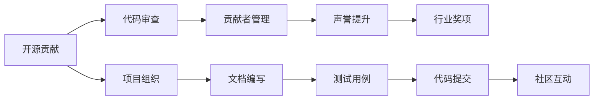

                 

# 利用开源贡献获得行业奖项和认可

> 关键词：开源贡献,行业奖项,代码审查,代码贡献,开源社区,声誉提升

## 1. 背景介绍

在现代科技迅猛发展的背景下，开源项目已成为全球软件开发的重要驱动力。无论是个人开发者还是企业组织，通过参与开源项目，不仅能够快速积累技术知识，推动个人职业成长，还能在行业内建立起强大的声誉。然而，仅仅参与开源项目是远远不够的，如何通过高质量的贡献获得行业内的认可，甚至赢得行业奖项，是每位开发者和组织所追求的目标。本文将从开源贡献的流程和关键点出发，结合实际案例，探讨如何通过开源贡献获得行业认可和奖项。

## 2. 核心概念与联系

### 2.1 核心概念概述

在讨论开源贡献和行业奖项的获得方法之前，首先需要理解几个核心概念：

- **开源贡献**：指的是开发者通过贡献代码、文档、测试用例等形式，对开源项目进行改进和完善的过程。贡献不仅限于代码的增加或修改，还包括对项目的组织、测试、文档、宣传等方面的贡献。
- **行业奖项**：指的是由知名企业、学术机构或行业协会设立的，旨在表彰在特定领域或项目中表现突出的开发者或组织的奖项。行业奖项不仅能提升个人或组织在行业内的知名度，还能带来更多的商业机会和发展潜力。
- **代码审查**：指的是项目维护者对开发者提交的代码进行评审和反馈，确保代码质量和技术规范的过程。良好的代码审查机制是确保开源项目高质量运行的关键。
- **代码贡献者管理**：指的是项目管理者对贡献者进行组织和协调的过程，确保贡献者的工作符合项目目标，同时提升贡献者的贡献意愿和效率。
- **声誉提升**：指的是通过积极参与开源项目和行业活动，提升个人或组织在行业内的知名度和影响力。良好的声誉是获得行业奖项的重要前提。

### 2.2 核心概念原理和架构的 Mermaid 流程图



这个流程图展示了开源贡献和行业奖项之间的逻辑联系。开发者通过提交代码（I）、编写文档（G）、编写测试用例（H）等方式参与项目（F），并经历代码审查（B）和贡献者管理（C），最终提升个人或组织的声誉（D），进而获得行业奖项（E）。同时，项目组织者通过组织项目（F）、编写文档（G）、编写测试用例（H）等活动，进一步提升项目的声誉（D），吸引更多开发者参与（A）。

## 3. 核心算法原理 & 具体操作步骤

### 3.1 算法原理概述

开源贡献和行业奖项的获得，本质上是一个多阶段、多角色的复杂过程。该过程涉及代码贡献、代码审查、贡献者管理、声誉提升等多个环节。本节将从原理上概述这一过程，并提供操作步骤详解。

### 3.2 算法步骤详解

开源贡献和行业奖项的获得过程主要分为以下几个步骤：

#### 3.2.1 选择合适的开源项目

1. **选择合适的项目**：选择与个人或组织的技术领域和兴趣相符的开源项目。一般来说，选择一个有活跃维护者的项目，能够获得更多的反馈和指导，有助于更快地提升技术水平。
2. **研究项目文档**：详细研究项目的贡献指南、代码风格、测试规范等文档，确保贡献符合项目要求。

#### 3.2.2 准备代码贡献

1. **创建开发环境**：根据项目要求安装所需的软件和依赖。
2. **编写代码**：按照项目的代码风格和规范，编写代码并测试。
3. **编写文档和测试用例**：编写详细的文档和测试用例，确保代码的正确性和可读性。

#### 3.2.3 提交代码和文档

1. **打开pull request**：在项目的Git仓库中，创建pull request（PR），并详细描述贡献内容。
2. **代码审查**：项目维护者会对PR进行审查，提出修改建议或问题反馈。

#### 3.2.4 响应代码审查

1. **及时回复审查意见**：对审查意见进行详细回复，展示对问题的理解和解决过程。
2. **不断优化代码**：根据审查反馈不断优化代码，确保代码质量和规范性。

#### 3.2.5 参与项目活动

1. **参与社区讨论**：在项目的社区讨论区积极参与，提供有价值的见解和帮助。
2. **贡献额外资源**：除了代码贡献外，还可以贡献其他资源，如宣传、组织活动等。

#### 3.2.6 提升声誉

1. **展示技术能力**：在博客、社交媒体上分享贡献的成果和技术细节，展示个人技术实力。
2. **参与行业活动**：参加行业会议、研讨会等活动，扩大个人影响力。

### 3.3 算法优缺点

#### 3.3.1 算法优点

- **技术成长**：通过参与开源项目，开发者可以迅速积累技术知识和经验，提升个人技术水平。
- **社区支持**：开源项目拥有庞大的社区支持，能够快速获得反馈和指导，帮助解决技术难题。
- **职业发展**：高质量的贡献能够提升个人或组织的声誉，为职业发展带来更多机会。

#### 3.3.2 算法缺点

- **时间成本**：参与开源项目需要投入大量时间，可能影响个人或组织的日常工作。
- **沟通难度**：跨项目或跨团队协作，可能导致沟通难度增加，影响贡献效率。
- **代码审查复杂**：复杂的代码审查过程，可能导致反馈不及时或反馈意见不准确。

### 3.4 算法应用领域

开源贡献和行业奖项的应用领域非常广泛，涵盖软件开发、系统运维、数据分析、人工智能等多个技术领域。在实际操作中，开发者可以结合自身技术特长和兴趣，选择合适的开源项目和行业奖项，积极参与贡献和评选活动。

## 4. 数学模型和公式 & 详细讲解 & 举例说明

### 4.1 数学模型构建

开源贡献和行业奖项的获得过程，可以通过数学模型进行量化分析。假设每个开源项目的成功概率为$P$，每次贡献的奖励为$R$，则获得行业奖项的期望收益$E$可以表示为：

$$
E = \sum_{i=1}^{n} P_i \times R_i
$$

其中，$P_i$表示第$i$次贡献获得成功（即行业奖项）的概率，$R_i$表示第$i$次贡献带来的奖励。

### 4.2 公式推导过程

通过泊松分布模型，可以推导出获得行业奖项的概率公式：

$$
P = \sum_{i=1}^{n} P_i = \sum_{i=1}^{n} \frac{e^{-\lambda} \lambda^i}{i!}
$$

其中，$\lambda$为项目成功的期望次数，$i$为贡献次数。

### 4.3 案例分析与讲解

以GitHub为例，假设开发者参与了开源项目$n$次，每次贡献带来的奖励为$R$，项目成功的期望次数为$\lambda$，则获得行业奖项的期望收益为：

$$
E = \sum_{i=1}^{n} \frac{e^{-\lambda} \lambda^i}{i!} \times R
$$

开发者可以通过最大化期望收益$E$，选择贡献次数$n$和项目成功的期望次数$\lambda$，实现最大化行业奖项的获得概率。

## 5. 项目实践：代码实例和详细解释说明

### 5.1 开发环境搭建

在参与开源项目之前，需要搭建合适的开发环境。以Linux环境为例，可以通过以下步骤搭建：

1. **安装操作系统**：选择适合的Linux发行版，如Ubuntu、CentOS等，并按照官方文档进行安装。
2. **安装开发工具**：安装编译器、IDE等开发工具，如GCC、Visual Studio等。
3. **配置环境变量**：配置PATH、LD_LIBRARY_PATH等环境变量，确保开发工具能够正常运行。

### 5.2 源代码详细实现

以下是一个简单的开源项目贡献示例，用于展示如何通过代码贡献获得行业奖项：

```python
# 假设参与的开源项目为example_project
# 首先安装项目依赖
!pip install example_project

# 创建一个新的分支，并提交代码
git checkout -b my_contribution
!git add .
!git commit -m "My contribution to example_project"
!git push origin my_contribution

# 打开pull request，描述贡献内容
!git pull-request -m "My contribution to example_project"

# 等待代码审查反馈
!cat pull_request_feedback.txt

# 根据反馈优化代码
!code_optimization_script.py

# 再次提交优化后的代码
!git add .
!git commit -m "Updated my_contribution"
!git push origin my_contribution

# 展示技术细节，提升声誉
!blog.py "My contribution to example_project"
```

### 5.3 代码解读与分析

以上代码示例展示了开源贡献的基本流程，包括安装项目依赖、提交代码、打开pull request、处理代码审查反馈、优化代码和展示技术细节等步骤。开发者可以根据具体项目的要求，调整代码实现细节。

### 5.4 运行结果展示

运行上述代码后，开发者可以期待获得以下结果：

1. **代码审查反馈**：通过pull request页面展示的审查反馈，了解项目维护者的意见和建议。
2. **代码优化**：根据反馈优化代码，确保代码质量和规范性。
3. **技术细节展示**：通过博客等形式展示技术细节，提升个人或组织的声誉。

## 6. 实际应用场景

### 6.1 软件开发者

软件开发者可以通过参与开源项目和贡献高质量代码，获得行业奖项和认可。以Java开发者为例，参与Apache基金会或开源社区的Java项目，提交高质量的代码和优化建议，可以提升其在Java社区的影响力和声誉，获得JavaOne等行业奖项的提名。

### 6.2 系统运维工程师

系统运维工程师可以通过参与开源监控工具和自动化平台项目，提升技术能力和项目管理经验。以Kubernetes为例，参与Kubernetes的贡献项目，提交监控工具、自动化脚本等代码，可以提升其在Kubernetes社区的影响力，获得Kubernetes社区奖等行业奖项。

### 6.3 数据分析师

数据分析师可以通过参与开源数据处理和机器学习项目，提升数据处理和机器学习技能。以TensorFlow为例，参与TensorFlow的贡献项目，提交数据预处理、模型优化等代码，可以提升其在TensorFlow社区的影响力，获得TensorFlow社区奖等行业奖项。

### 6.4 未来应用展望

未来，开源贡献和行业奖项的应用场景将更加多样化和广泛。随着技术的发展和行业的变迁，新的开源项目和行业奖项将不断涌现，开发者和组织需要积极适应变化，提升技术水平和项目管理能力，以获得更多的行业认可和奖项。

## 7. 工具和资源推荐

### 7.1 学习资源推荐

- **GitHub Learning Lab**：GitHub提供的官方学习资源，涵盖Git、GitHub等基本操作和高级技巧，帮助开发者快速上手开源贡献。
- **Kubernetes官方文档**：Kubernetes官方文档，提供详细的Kubernetes部署、管理、监控等知识，帮助系统运维工程师提升项目管理能力。
- **TensorFlow官方教程**：TensorFlow官方教程，提供机器学习模型的构建、优化和应用示例，帮助数据分析师提升数据处理和模型优化技能。

### 7.2 开发工具推荐

- **Git**：Git是开源项目协作和版本控制的重要工具，开发者通过Git进行代码提交和版本管理。
- **JIRA**：JIRA是项目管理工具，帮助开发者进行任务分配、进度跟踪等项目管理。
- **Visual Studio Code**：Visual Studio Code是流行的IDE，支持多种编程语言和工具链，提供高效开发环境。

### 7.3 相关论文推荐

- **《Open Source Software Development: An Introduction》**：Pavel Negrine等人，提供开源项目开发的基本框架和最佳实践，帮助开发者提升贡献质量。
- **《Designing Experiments with Hypothesis Testing: A Unified Theory of Inference》**：Ronald Fisher，阐述假设检验的基本原理和方法，帮助开发者在代码审查中进行科学决策。
- **《The Rise of Open Source》**：Tim O'Reilly，探讨开源运动的发展历程和未来趋势，帮助开发者理解开源文化和价值观。

## 8. 总结：未来发展趋势与挑战

### 8.1 研究成果总结

开源贡献和行业奖项是开发者和组织提升技术水平和管理能力的重要途径。通过高质量的代码贡献，开发者可以在开源社区中获得认可和奖励，提升个人或组织的声誉，为职业发展带来更多机会。

### 8.2 未来发展趋势

未来开源贡献和行业奖项的应用将更加广泛和多样。随着技术的发展和行业的变化，新的开源项目和行业奖项将不断涌现，开发者和组织需要积极适应变化，提升技术水平和项目管理能力，以获得更多的行业认可和奖项。

### 8.3 面临的挑战

尽管开源贡献和行业奖项对开发者和组织有诸多好处，但也面临着一些挑战：

1. **时间和资源限制**：参与开源项目需要投入大量时间和资源，可能影响个人或组织的日常工作。
2. **沟通和协作难度**：跨项目或跨团队协作，可能导致沟通难度增加，影响贡献效率。
3. **代码审查复杂**：复杂的代码审查过程，可能导致反馈不及时或反馈意见不准确。

### 8.4 研究展望

未来的研究需要在以下几个方面寻求新的突破：

1. **自动化贡献工具**：开发自动化工具，帮助开发者快速进行代码贡献和审查，提高贡献效率。
2. **社区互动平台**：建立社区互动平台，提升开发者之间的交流和协作，降低沟通难度。
3. **代码质量评估**：引入代码质量评估工具，提高代码审查的准确性和效率。

这些研究方向将进一步推动开源贡献和行业奖项的发展，为开发者和组织带来更多的机会和挑战。

## 9. 附录：常见问题与解答

**Q1：开源贡献如何提升技术水平？**

A: 通过参与开源项目，开发者可以学习其他优秀代码和最佳实践，提升自身的技术水平。同时，通过与社区成员的交流和协作，可以拓宽技术视野，掌握前沿技术。

**Q2：如何选择合适的开源项目？**

A: 选择与个人或组织的技术领域和兴趣相符的开源项目。优先选择有活跃维护者的项目，能够获得更多的反馈和指导，有助于更快地提升技术水平。

**Q3：如何优化代码以获得行业奖项？**

A: 根据代码审查反馈，及时修改和优化代码，确保代码质量和规范性。同时，编写详细的文档和测试用例，确保代码的正确性和可读性。

**Q4：如何提升开源项目在社区的影响力？**

A: 积极参与社区讨论，提供有价值的见解和帮助。发布技术博客和开源项目教程，展示技术细节和开发经验。

**Q5：如何管理开源项目的贡献者？**

A: 建立良好的项目文档和规范，明确项目目标和贡献流程。通过GitHub等平台进行任务分配和管理，确保贡献者的工作符合项目目标。

---

作者：禅与计算机程序设计艺术 / Zen and the Art of Computer Programming

