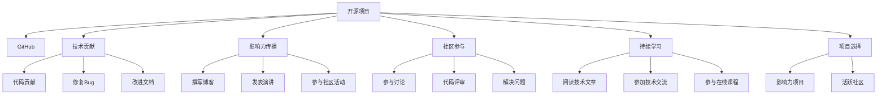

                 

# 利用开源项目打造个人品牌

> 关键词：开源项目, 个人品牌, 技术贡献, 影响力, 社区参与

## 1. 背景介绍

### 1.1 问题由来

在技术日新月异的互联网时代，个人品牌的塑造成为了众多IT从业者的重要目标。优秀的个人品牌不仅能提升个人职业发展，还能在技术圈内积累广泛的影响力和知名度。然而，在信息爆炸的今天，如何有效地塑造和传播个人品牌，成为了众多开发者面临的挑战。

开源项目因其透明度高、协作性强、成果显著等优势，成为了打造个人品牌的重要工具。技术开发者可以通过贡献开源代码、参与项目维护、撰写技术文章等多种方式，将自己打造成某一领域的专家，甚至成为社区的领袖。本文旨在探讨如何利用开源项目打造个人品牌，帮助更多开发者实现这一目标。

### 1.2 问题核心关键点

开源项目打造个人品牌的核心关键点在于以下几点：

1. **技术贡献**：通过高质量的代码贡献，提升个人在技术社区中的声誉。
2. **影响力传播**：通过写作、演讲、教学等方式，传播个人技术见解和经验。
3. **社区参与**：积极参与开源项目讨论、代码评审、问题解决等，建立良好的社区关系。
4. **持续学习**：不断学习新技术、新知识，保持技术前沿。
5. **项目选择**：选择有影响力、社区活跃的开源项目，增加个人曝光度。

本文将从开源项目的贡献方式、影响力传播、社区参与等方面，全面系统地介绍如何利用开源项目打造个人品牌。

## 2. 核心概念与联系

### 2.1 核心概念概述

为了更好地理解利用开源项目打造个人品牌的方法，本节将介绍几个密切相关的核心概念：

- **开源项目**：指的是源码开放、免费共享的计算机软件项目。开发者可以在GitHub、GitLab、Apache等平台贡献代码、讨论交流。
- **GitHub**：世界上最大的开源项目托管平台，提供代码托管、协作开发、版本控制等功能。
- **技术贡献**：指通过编写代码、修复Bug、改进文档等方式，为开源项目做出贡献。
- **影响力传播**：指通过撰写博客、发表演讲、参与社区活动等方式，传播个人技术见解和经验。
- **社区参与**：指积极参与开源项目的讨论、代码评审、问题解决等活动，建立良好的社区关系。
- **持续学习**：指通过阅读最新的技术文章、参加线上线下技术交流活动、参与在线课程等方式，不断学习新知识、新技能。
- **项目选择**：指选择有影响力、社区活跃的开源项目，以增加个人曝光度和影响力。

这些概念之间的逻辑关系可以通过以下Mermaid流程图来展示：



这个流程图展示了一个开发者利用开源项目进行个人品牌塑造的各个环节：

1. 选择一个合适的开源项目。
2. 通过技术贡献提升自己的技术实力。
3. 通过影响力传播推广自己的技术见解。
4. 积极参与社区活动，建立良好的社区关系。
5. 不断学习和提升自己，保持技术前沿。
6. 通过项目选择增加个人曝光度和影响力。

## 3. 核心算法原理 & 具体操作步骤

### 3.1 算法原理概述

利用开源项目打造个人品牌的核心算法原理，可以总结如下：

1. **技术贡献算法**：通过编写高质量的代码，修复已有的Bug，改进项目文档等方式，提升个人在技术社区中的声誉。
2. **影响力传播算法**：通过撰写技术博客、发表演讲、参与社区活动等方式，传播个人技术见解和经验，提升个人影响力。
3. **社区参与算法**：积极参与开源项目的讨论、代码评审、问题解决等活动，建立良好的社区关系，增加个人曝光度。
4. **持续学习算法**：通过阅读最新的技术文章、参加线上线下技术交流活动、参与在线课程等方式，不断学习新知识、新技能，保持技术前沿。
5. **项目选择算法**：选择有影响力、社区活跃的开源项目，以增加个人曝光度和影响力。

### 3.2 算法步骤详解

#### 3.2.1 技术贡献

技术贡献是打造个人品牌的基础。以下是技术贡献的详细步骤：

1. **项目选择**：选择有影响力的开源项目，如TensorFlow、React等，以增加个人曝光度。
2. **代码贡献**：
   - **选择合适的项目**：浏览项目的Issue列表，选择感兴趣的问题进行解决。
   - **编写高质量代码**：确保代码质量和可读性，遵循编码规范。
   - **提交代码**：使用Git等版本控制系统提交代码，确保提交信息的准确性和清晰度。
3. **修复Bug**：
   - **问题定位**：通过阅读问题描述、代码日志等方式，定位问题所在。
   - **修复问题**：编写并提交修复代码。
   - **测试验证**：确保修复代码能够通过测试用例，不会引入新的问题。
4. **改进文档**：
   - **阅读文档**：熟悉项目的文档结构和使用规范。
   - **编写文档**：编写或改进文档内容，确保文档清晰、准确。
   - **提交文档**：将修改后的文档提交至项目仓库。

#### 3.2.2 影响力传播

影响力传播可以帮助开发者建立个人品牌，扩大影响力。以下是影响力传播的详细步骤：

1. **撰写博客**：
   - **选择合适的平台**：选择技术博客平台，如Medium、CSDN等。
   - **撰写高质量文章**：撰写关于最新技术、经验分享的文章，确保内容的原创性和深度。
   - **推广文章**：通过社交媒体、邮件等方式推广文章，增加阅读量。
2. **发表演讲**：
   - **选择合适的平台**：选择技术会议、社区活动等平台。
   - **准备内容**：准备演讲稿，涵盖技术点、案例分析等。
   - **展示演讲**：在活动中进行演讲，展现个人技术实力。
3. **参与社区活动**：
   - **参加线上讨论**：在社区平台（如Stack Overflow、Reddit等）参与讨论。
   - **回答问题**：积极回答问题，展示个人技术能力。
   - **组织活动**：组织技术分享会、代码评审会等，提升社区参与度。

#### 3.2.3 社区参与

社区参与是建立良好社区关系、增加个人曝光度的重要途径。以下是社区参与的详细步骤：

1. **参与讨论**：
   - **加入社区**：加入GitHub、GitLab等开源社区。
   - **积极讨论**：在社区中积极参与讨论，提出问题、分享见解。
   - **反馈建议**：对项目的改进提出建设性建议。
2. **代码评审**：
   - **阅读代码**：仔细阅读代码，理解项目实现逻辑。
   - **提出修改意见**：提出具体的修改建议，帮助作者改进代码。
   - **反馈结果**：对作者的修改进行反馈，确保代码质量。
3. **解决问题**：
   - **定位问题**：通过阅读Issue列表，定位问题所在。
   - **编写解决方案**：编写解决方案代码，提交至项目仓库。
   - **确认解决**：确保解决方案能够解决问题，通过测试用例验证。

#### 3.2.4 持续学习

持续学习是保持技术前沿、提升个人品牌的关键。以下是持续学习的详细步骤：

1. **阅读技术文章**：
   - **选择平台**：选择技术网站，如TechCrunch、InfoQ等。
   - **定期阅读**：定期阅读最新技术文章，关注技术动态。
   - **总结笔记**：将阅读内容整理成笔记，加深理解。
2. **参加技术交流**：
   - **参加会议**：参加技术会议，如Google I/O、NeurIPS等。
   - **参与讨论**：在会议上积极参与讨论，分享见解。
   - **结识同行**：结识领域内的专家和同行，扩展人脉。
3. **参与在线课程**：
   - **选择平台**：选择在线教育平台，如Coursera、Udacity等。
   - **学习课程**：选择感兴趣的技术课程，进行系统学习。
   - **实践项目**：将课程内容应用到实际项目中，巩固知识。

#### 3.2.5 项目选择

选择有影响力、社区活跃的开源项目，是提升个人曝光度和影响力的重要步骤。以下是项目选择的详细步骤：

1. **选择项目**：
   - **选择知名项目**：选择GitHub、GitLab等平台上知名度高的项目。
   - **选择活跃项目**：选择社区活跃、贡献频繁的项目。
   - **选择兴趣项目**：选择与个人兴趣和专业相关联的项目。
2. **参与项目**：
   - **提交Issue**：提交有意义的Issue，展示自己的技术见解。
   - **解决问题**：解决项目中的问题，展示个人技术实力。
   - **贡献代码**：定期提交代码，参与项目维护。
3. **推动项目**：
   - **提出改进建议**：对项目提出建设性改进建议。
   - **组织活动**：组织技术分享会、代码评审会等，提升项目活跃度。
   - **推广项目**：通过博客、社交媒体等方式推广项目，增加曝光度。

### 3.3 算法优缺点

利用开源项目打造个人品牌的方法具有以下优点：

1. **透明性高**：开源项目提供了透明的代码和讨论环境，便于个人展示技术实力。
2. **协作性强**：开源项目鼓励社区协作，可以快速获取反馈和支持。
3. **成果显著**：通过高质量的贡献和影响力的传播，可以获得广泛的认可和关注。
4. **持续学习**：参与开源项目可以不断学习新技术、新知识，保持技术前沿。
5. **增加曝光度**：通过项目选择和社区参与，可以提升个人曝光度和影响力。

同时，该方法也存在以下缺点：

1. **时间成本高**：贡献开源项目和影响力传播需要大量的时间和精力投入。
2. **技术要求高**：需要具备较强的技术能力和代码水平。
3. **社区文化差异**：不同社区有不同的文化，可能需要适应不同的交流方式。
4. **项目选择困难**：选择适合自己并能带来影响力提升的项目可能比较困难。
5. **持续学习的压力**：需要不断学习新知识，保持技术前沿，有一定的学习压力。

尽管存在这些缺点，但就目前而言，利用开源项目打造个人品牌仍是众多开发者实现职业发展的有效途径。未来相关研究的重点在于如何优化贡献方式，降低时间成本，提升社区参与度，同时兼顾技术前沿和社区文化的融合。

### 3.4 算法应用领域

利用开源项目打造个人品牌的方法，在以下领域得到了广泛应用：

1. **技术开发**：通过贡献开源代码、改进项目文档等方式，展示技术实力。
2. **技术传播**：通过撰写博客、发表演讲、参与社区活动等方式，传播个人技术见解和经验。
3. **技术教学**：通过在线教学、技术讲座等方式，分享技术知识和经验。
4. **技术咨询**：通过技术博客、技术问答等方式，提供技术咨询和解决方案。
5. **技术招聘**：通过展示开源项目贡献和影响力传播成果，吸引潜在雇主关注。

## 4. 数学模型和公式 & 详细讲解 & 举例说明

### 4.1 数学模型构建

在利用开源项目打造个人品牌的过程中，可以构建以下数学模型：

设个人品牌影响力为 $I$，社区曝光度为 $E$，技术贡献度为 $C$，影响力传播度为 $S$，持续学习度为 $L$，项目选择度为 $P$。则总影响力模型为：

$$
I = \alpha \times C + \beta \times S + \gamma \times E + \delta \times L + \epsilon \times P
$$

其中 $\alpha, \beta, \gamma, \delta, \epsilon$ 为权重系数，表示各因素对总影响力的贡献比例。

### 4.2 公式推导过程

利用以上模型，可以推导出影响力和曝光度的计算公式。以下是推导过程：

1. **技术贡献度 $C$**：
   - **代码贡献量**：$C = \sum_{i=1}^n C_i$，其中 $C_i$ 为每个代码贡献的权重。
   - **代码质量**：$C_i = w_{code} \times Q_i$，其中 $w_{code}$ 为代码质量的权重，$Q_i$ 为代码质量评分。
   - **代码复杂度**：$Q_i = K_i \times \frac{1}{S_i}$，其中 $K_i$ 为代码复杂度评分，$S_i$ 为代码行数。

2. **影响力传播度 $S$**：
   - **博客阅读量**：$S = \sum_{i=1}^m S_i$，其中 $S_i$ 为每篇文章的阅读量。
   - **演讲观众量**：$S_i = w_{talk} \times A_i$，其中 $w_{talk}$ 为演讲质量的权重，$A_i$ 为演讲观众量。
   - **社区活动参与度**：$A_i = K_i \times \frac{1}{T_i}$，其中 $K_i$ 为活动参与度评分，$T_i$ 为活动时间。

3. **社区曝光度 $E$**：
   - **贡献者数量**：$E = \sum_{i=1}^n E_i$，其中 $E_i$ 为每个贡献者的曝光度。
   - **代码评审数量**：$E_i = w_{review} \times R_i$，其中 $w_{review}$ 为评审质量的权重，$R_i$ 为评审数量。
   - **问题解决数量**：$R_i = K_i \times \frac{1}{T_i}$，其中 $K_i$ 为问题解决数量评分，$T_i$ 为解决问题时间。

4. **持续学习度 $L$**：
   - **技术文章阅读量**：$L = \sum_{i=1}^m L_i$，其中 $L_i$ 为每篇文章的阅读量。
   - **技术会议参与度**：$L_i = w_{meeting} \times P_i$，其中 $w_{meeting}$ 为会议质量的权重，$P_i$ 为会议参与度评分。
   - **在线课程完成度**：$P_i = K_i \times \frac{1}{S_i}$，其中 $K_i$ 为课程完成度评分，$S_i$ 为课程时长。

5. **项目选择度 $P$**：
   - **项目影响力评分**：$P = \sum_{i=1}^n P_i$，其中 $P_i$ 为每个项目的评分。
   - **项目活跃度评分**：$P_i = w_{project} \times A_i$，其中 $w_{project}$ 为项目活跃度的权重，$A_i$ 为项目活跃度评分。
   - **项目贡献度评分**：$A_i = K_i \times \frac{1}{T_i}$，其中 $K_i$ 为项目贡献度评分，$T_i$ 为项目贡献时间。

### 4.3 案例分析与讲解

#### 案例分析

以开源项目贡献为例，介绍一个具体的案例分析：

**背景**：一名开发者希望通过开源项目贡献提升个人品牌影响力。

**步骤**：

1. **选择项目**：选择GitHub上知名度高、社区活跃的TensorFlow项目。
2. **贡献代码**：阅读项目Issue列表，选择感兴趣的问题进行解决。编写高质量代码，确保代码质量和可读性，遵循编码规范。
3. **提交代码**：使用Git等版本控制系统提交代码，确保提交信息的准确性和清晰度。
4. **解决问题**：通过阅读问题描述、代码日志等方式，定位问题所在，编写并提交修复代码。确保修复代码能够通过测试用例，不会引入新的问题。
5. **改进文档**：阅读文档，熟悉项目的文档结构和使用规范，编写或改进文档内容，确保文档清晰、准确。
6. **推广文章**：在Medium上撰写关于TensorFlow使用经验的文章，通过社交媒体、邮件等方式推广文章，增加阅读量。
7. **发表演讲**：在技术会议上展示TensorFlow的使用案例，提升个人影响力。
8. **参与讨论**：在GitHub社区中积极参与讨论，提出问题、分享见解，反馈建议。
9. **持续学习**：定期阅读最新技术文章，参加在线课程，学习TensorFlow的新特性和最佳实践。

**结果**：通过以上步骤，开发者在开源项目上不断贡献，影响力逐步提升，成为TensorFlow社区的活跃成员。

## 5. 项目实践：代码实例和详细解释说明

### 5.1 开发环境搭建

在进行开源项目贡献的实践前，我们需要准备好开发环境。以下是使用Python进行GitHub开源项目贡献的环境配置流程：

1. 安装Anaconda：从官网下载并安装Anaconda，用于创建独立的Python环境。

2. 创建并激活虚拟环境：
```bash
conda create -n python-env python=3.8 
conda activate python-env
```

3. 安装Git：使用最新版的Git，可以从官网下载安装包进行安装。

4. 安装GitHub CLI：
```bash
brew install git
```

5. 安装GitHub Desktop：官网下载GitHub Desktop安装程序，进行安装。

完成上述步骤后，即可在`python-env`环境中开始开源项目贡献实践。

### 5.2 源代码详细实现

以下是一个简单的GitHub开源项目贡献实践代码示例：

```python
# 克隆开源项目
git clone https://github.com/tensorflow/tensorflow.git
cd tensorflow

# 安装依赖
pip install -r requirements.txt

# 贡献代码
# 在Python环境中打开TensorFlow项目
python3 -m pip install -e .

# 编写代码，遵循编码规范
# 在TensorFlow目录下修改或新增代码文件

# 提交代码
git add .
git commit -m "Add new feature"
git push origin master

# 提交Issue
git issue -a "New feature added"
```

### 5.3 代码解读与分析

让我们再详细解读一下关键代码的实现细节：

**克隆开源项目**：
- 使用`git clone`命令从GitHub上克隆开源项目至本地。
- 进入项目目录，安装依赖库。

**贡献代码**：
- 在Python环境中使用`pip install -e .`命令安装TensorFlow项目。
- 编写代码，遵循编码规范，确保代码质量和可读性。
- 提交代码，使用`git add .`命令将修改文件添加到暂存区，使用`git commit`命令提交修改，并添加提交信息。
- 推送代码到GitHub远程仓库，使用`git push origin master`命令将本地代码推送至远程仓库的`master`分支。

**提交Issue**：
- 在GitHub上提交Issue，描述新增功能，请求社区审核。
- 使用`git issue -a`命令在GitHub上提交Issue。

通过以上代码示例，可以看到GitHub开源项目贡献的简洁高效，只需要几个简单的命令，即可完成代码提交和Issue提交。

### 5.4 运行结果展示

在提交代码和Issue后，可以实时查看贡献效果：

1. **代码审核**：社区成员可以查看新提交的代码，进行审核和反馈。
2. **Issue讨论**：社区成员可以讨论新提交的Issue，提供解决方案和建议。
3. **PR合并**：社区管理员会将审核通过的代码合并至项目主分支。

## 6. 实际应用场景

### 6.1 开源项目贡献

开源项目贡献是打造个人品牌的基础。以下是几个典型的应用场景：

1. **技术开发**：通过高质量的代码贡献，展示技术实力。
2. **技术传播**：通过撰写博客、发表演讲等方式，传播个人技术见解和经验。
3. **技术教学**：通过在线教学、技术讲座等方式，分享技术知识和经验。

### 6.2 技术招聘

利用开源项目贡献和影响力传播成果，可以吸引潜在雇主的关注，增加就业机会。以下是几个典型的应用场景：

1. **展示技术实力**：通过开源项目贡献和博客文章，展示个人技术实力。
2. **建立专业形象**：通过技术传播和社区参与，建立专业形象，增加雇主信任。
3. **获取推荐机会**：通过社区反馈和推荐，获取面试机会，提高就业成功率。

### 6.3 技术咨询

通过技术博客、技术问答等方式，提供技术咨询和解决方案，可以建立个人品牌，增加客户信任。以下是几个典型的应用场景：

1. **提供解决方案**：通过技术博客、技术问答等方式，提供详细的技术解决方案。
2. **建立信任关系**：通过高效的技术支持，建立客户信任，增加客户黏性。
3. **开拓市场机会**：通过技术咨询和解决方案，开拓新的市场机会，拓展业务范围。

## 7. 工具和资源推荐

### 7.1 学习资源推荐

为了帮助开发者系统掌握利用开源项目打造个人品牌的方法，这里推荐一些优质的学习资源：

1. **《开源项目开发实战》系列博文**：由GitHub社区专家撰写，详细介绍了GitHub的开源项目开发流程和技术细节。

2. **《GitHub高级开发指南》书籍**：GitHub官方推荐的书籍，全面介绍了GitHub的高级开发技巧和最佳实践。

3. **Coursera《Git和GitHub》课程**：由Coursera开设的Git和GitHub基础课程，系统讲解Git和GitHub的使用方法。

4. **Medium《GitHub入门指南》系列文章**：Medium上关于GitHub入门指南的系列文章，适合初学者学习。

5. **Stack Overflow《GitHub使用指南》社区**：Stack Overflow社区中关于GitHub使用的指南和经验分享，适合技术交流。

通过对这些资源的学习实践，相信你一定能够快速掌握利用开源项目打造个人品牌的方法，并用于解决实际的开发问题。

### 7.2 开发工具推荐

高效的开发离不开优秀的工具支持。以下是几款用于开源项目贡献开发的常用工具：

1. **GitHub Desktop**：GitHub官方提供的桌面客户端，方便进行代码提交、Issue提交等操作。
2. **Visual Studio Code**：轻量级的代码编辑器，支持Git、GitHub等插件，方便开源项目贡献。
3. **Jupyter Notebook**：交互式的代码编辑器，支持Markdown格式，适合技术写作和传播。
4. **Git**：流行的版本控制系统，支持GitHub和其他平台的代码管理。
5. **GitHub CLI**：GitHub的命令行客户端，方便进行远程仓库操作。
6. **GitHub Desktop**：GitHub官方提供的桌面客户端，方便进行代码提交、Issue提交等操作。

合理利用这些工具，可以显著提升开源项目贡献的效率，加速技术实践和传播。

### 7.3 相关论文推荐

利用开源项目打造个人品牌的技术不断发展，以下是几篇奠基性的相关论文，推荐阅读：

1. **《开源项目参与与贡献机制》**：探讨开源项目的参与机制和贡献机制，提供了系统的实践指南。
2. **《开源社区动态分析》**：研究开源社区的动态变化，提出开源项目贡献的趋势和策略。
3. **《技术传播与影响力的提升》**：探讨技术传播对个人品牌的影响，提出技术传播的最佳实践。
4. **《技术社区的演化与创新》**：研究技术社区的演化和创新，提出社区参与的技术策略。
5. **《技术博客与影响力提升》**：研究技术博客对个人品牌的影响，提出技术博客的写作技巧。

这些论文代表了大语言模型微调技术的发展脉络。通过学习这些前沿成果，可以帮助研究者把握学科前进方向，激发更多的创新灵感。

## 8. 总结：未来发展趋势与挑战

### 8.1 总结

本文对利用开源项目打造个人品牌的方法进行了全面系统的介绍。首先阐述了利用开源项目进行个人品牌塑造的背景和意义，明确了开源项目贡献、影响力传播、社区参与、持续学习、项目选择等核心关键点。其次，从技术贡献、影响力传播、社区参与等方面，详细讲解了利用开源项目打造个人品牌的详细步骤和具体方法。同时，本文还探讨了开源项目贡献在技术开发、技术招聘、技术咨询等方面的广泛应用。

通过本文的系统梳理，可以看到，利用开源项目打造个人品牌的方法在技术开发、技术传播、技术招聘、技术咨询等方面具有重要意义。开发者可以通过开源项目贡献和影响力传播，提升技术实力和品牌影响力，在技术圈内建立专业形象，拓展就业机会，提供技术咨询和解决方案。未来，随着开源社区的不断发展和技术生态的不断完善，利用开源项目打造个人品牌将变得更加便捷和高效。

### 8.2 未来发展趋势

展望未来，利用开源项目打造个人品牌的方法将呈现以下几个发展趋势：

1. **开源社区的蓬勃发展**：开源社区的规模和活跃度将持续增长，为开发者提供了更广阔的贡献和交流平台。
2. **技术贡献的多样化**：开源项目贡献将不再局限于代码编写，更多地涉及问题解决、文档改进、测试验证等方面。
3. **影响力传播的智能化**：通过自动化工具和算法，提升技术传播的效果和覆盖范围。
4. **社区参与的协同化**：社区成员将更加协同工作，共同维护和改进开源项目。
5. **技术学习的终身化**：开源项目贡献和影响力传播将成为开发者终身学习的动力。
6. **个人品牌的全球化**：开源项目贡献和影响力传播将使开发者在全球范围内获得认可和关注。

以上趋势凸显了利用开源项目打造个人品牌的前景。这些方向的探索发展，将进一步提升开发者的技术实力和品牌影响力，加速技术进步和传播。

### 8.3 面临的挑战

尽管利用开源项目打造个人品牌的方法已经取得了显著成效，但在迈向更加智能化、普适化应用的过程中，仍面临以下挑战：

1. **时间成本高**：开源项目贡献和影响力传播需要大量的时间和精力投入。
2. **技术要求高**：需要具备较强的技术能力和代码水平。
3. **社区文化差异**：不同社区有不同的文化，可能需要适应不同的交流方式。
4. **项目选择困难**：选择适合自己并能带来影响力提升的项目可能比较困难。
5. **持续学习的压力**：需要不断学习新知识，保持技术前沿，有一定的学习压力。

尽管存在这些挑战，但就目前而言，利用开源项目打造个人品牌仍是众多开发者实现职业发展的有效途径。未来相关研究的重点在于如何优化贡献方式，降低时间成本，提升社区参与度，同时兼顾技术前沿和社区文化的融合。

### 8.4 研究展望

面对利用开源项目打造个人品牌所面临的挑战，未来的研究需要在以下几个方面寻求新的突破：

1. **贡献方式优化**：探索更加高效的开源项目贡献方式，降低时间成本。
2. **社区文化融合**：研究不同社区文化的融合，提升社区参与度和协作效率。
3. **影响力提升**：利用自动化工具和算法，提升技术传播的效果和覆盖范围。
4. **技术学习加速**：开发更加便捷的学习工具，帮助开发者快速掌握新知识。
5. **个人品牌全球化**：研究个人品牌在全球范围内的传播和认可机制。

这些研究方向将进一步提升利用开源项目打造个人品牌的效果，使开发者能够更快地实现职业发展和技术突破。总之，开源项目贡献和影响力传播是开发者打造个人品牌的重要手段，需要在技术贡献、影响力传播、社区参与等多个环节进行全面优化，方能获得理想的效果。

## 9. 附录：常见问题与解答

**Q1：如何选择合适的开源项目进行贡献？**

A: 选择合适的开源项目，可以从以下几个方面考虑：
1. **项目影响力和社区活跃度**：选择知名度高、社区活跃的项目，以增加个人曝光度和影响力。
2. **个人兴趣和专业相关性**：选择与个人兴趣和专业相关联的项目，提升贡献效率。
3. **项目文档和代码规范**：选择文档清晰、代码规范的项目，以减少贡献难度。
4. **项目维护频率**：选择维护频率高、贡献频繁的项目，以获得更多反馈和支持。

**Q2：开源项目贡献需要注意哪些方面？**

A: 开源项目贡献需要注意以下几个方面：
1. **代码质量**：确保代码质量和可读性，遵循编码规范。
2. **问题定位**：仔细阅读问题描述、代码日志等方式，定位问题所在。
3. **修复代码**：编写并提交修复代码，确保修复代码能够通过测试用例，不会引入新的问题。
4. **文档改进**：编写或改进文档内容，确保文档清晰、准确。
5. **社区互动**：积极参与社区讨论，提出问题、分享见解，反馈建议。

**Q3：影响力传播有哪些常见方式？**

A: 影响力传播可以通过以下几种常见方式实现：
1. **撰写博客**：在Medium、CSDN等平台撰写技术博客，分享技术见解和经验。
2. **发表演讲**：在技术会议、社区活动上进行演讲，展示技术实力。
3. **参与社区活动**：在GitHub、Stack Overflow等社区参与讨论，提供解决方案和建议。
4. **技术讲座**：在线上或线下进行技术讲座，分享技术知识和经验。
5. **技术问答**：在博客、技术论坛等平台回答问题，提供技术支持和解决方案。

**Q4：开源项目贡献和影响力传播的路径有哪些？**

A: 开源项目贡献和影响力传播的路径可以从以下几个方面考虑：
1. **选择项目**：选择知名度高、社区活跃的项目。
2. **贡献代码**：编写高质量代码，修复Bug，改进文档等方式。
3. **解决问题**：通过阅读问题描述、代码日志等方式，定位问题，编写并提交解决方案代码。
4. **推广文章**：撰写技术博客、发表演讲、参与社区活动等方式，传播个人技术见解和经验。
5. **持续学习**：定期阅读最新技术文章，参加在线课程，学习新技术、新知识。

**Q5：如何提升开源项目贡献的效率？**

A: 提升开源项目贡献的效率，可以从以下几个方面考虑：
1. **选择合适的问题**：选择感兴趣的问题，避免贡献低质量代码。
2. **使用自动化工具**：利用GitHub Actions、CI/CD等自动化工具，提高代码审核和合并效率。
3. **学习最佳实践**：了解开源项目的最佳实践，遵循编码规范，提高贡献效率。
4. **社区互动**：积极参与社区讨论，获取反馈和建议，优化贡献内容。

这些步骤和技巧可以帮助开发者提升开源项目贡献的效率，更快地建立个人品牌。

