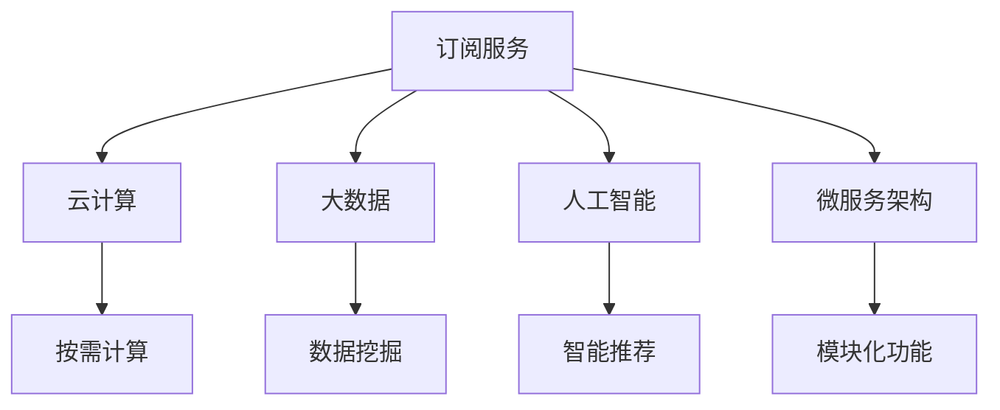

                 

# 利用技术优势创建订阅式服务

## 1. 背景介绍

随着互联网的普及和数字技术的飞速发展，在线订阅服务逐渐成为各行各业的新兴商业模式。无论是影视娱乐、数字出版、教育培训，还是生活服务、技术支持，订阅服务都能为消费者提供定制化的高质量内容或服务，同时也为企业开辟了新的收入来源。

在线订阅服务不仅满足用户个性化的需求，而且通过规模化、持续化的消费模式，能够大幅提升用户粘性和客户终生价值。然而，构建一个成功的订阅服务，并非易事。它需要整合多种技术优势，如云计算、大数据、人工智能等，才能提供稳定可靠、丰富多样、定制灵活的订阅体验。

本文将详细介绍如何利用云计算、大数据、人工智能等技术优势，创建高效、灵活、个性化的订阅服务。从技术架构设计、核心算法原理、实际操作步骤、实际应用场景、工具和资源推荐，到未来发展趋势与挑战，全面解析订阅式服务的构建之道。

## 2. 核心概念与联系

### 2.1 核心概念概述

为了更好地理解如何利用技术优势构建订阅服务，本节将介绍几个核心概念：

- **订阅服务(Subscription Service)**：指通过网络提供的服务，消费者以定期付费的方式获取服务或内容。这种模式提供按需、定制、持续的服务，满足用户的多样化需求。

- **云计算(Cloud Computing)**：基于网络提供计算资源，包括存储、处理能力、网络通信等。通过云计算，用户可以按需使用资源，无需关心底层硬件设施。

- **大数据(Big Data)**：指海量的、高速的、多样化的数据集。通过大数据技术，可以挖掘和分析用户行为，实现精准推送和个性化推荐。

- **人工智能(Artificial Intelligence, AI)**：指利用计算机技术模拟人类智能行为的技术体系，包括机器学习、自然语言处理、计算机视觉等。AI可以提升服务智能化水平，增强用户体验。

- **微服务架构(Microservices Architecture)**：指将应用程序拆分成多个小规模、独立运行的服务，每个服务负责独立功能，并通过轻量级通信机制进行协同。微服务架构提升系统灵活性和扩展性。

这些核心概念之间的逻辑关系可以通过以下Mermaid流程图来展示：



这个流程图展示了一些关键技术在构建订阅服务中的作用：

1. 订阅服务通过云计算获得按需的计算资源。
2. 订阅服务从大数据中挖掘用户行为和偏好，实现个性化推荐。
3. 订阅服务利用人工智能技术提升服务的智能化水平。
4. 订阅服务采用微服务架构，提升系统的灵活性和扩展性。

这些核心概念共同构成了订阅服务的底层技术框架，使其能够在各种场景下提供高质量的服务。通过理解这些核心概念，我们可以更好地把握订阅服务的构建思路。

## 3. 核心算法原理 & 具体操作步骤

### 3.1 算法原理概述

构建订阅服务的核心算法原理主要涉及以下几方面：

- **推荐算法**：通过分析用户历史行为和偏好，为用户推荐个性化的内容或服务。常用的推荐算法包括协同过滤、基于内容的推荐、矩阵分解等。

- **定价算法**：基于用户的消费行为和历史数据，合理制定订阅服务的定价策略，既要确保公平合理，也要考虑到商业目标和用户满意度。

- **预测算法**：利用历史数据和模型预测用户未来的行为，如续订概率、流失风险等，帮助企业优化订阅策略。

- **召回算法**：通过提醒、推送等方式，提高用户续订率，减少流失。

这些算法的运行依赖于云计算和大数据的支持，同时利用人工智能技术进行模型训练和优化。

### 3.2 算法步骤详解

构建订阅服务的算法步骤一般包括以下几个关键步骤：

**Step 1: 数据收集与预处理**
- 收集用户行为数据、交易记录、社交网络等数据源，建立数据仓库。
- 对数据进行清洗、去重、填充缺失值等预处理，确保数据质量。

**Step 2: 用户画像建立**
- 利用大数据技术分析用户行为，建立用户画像。包括用户基本信息、消费偏好、行为特征等。
- 通过特征工程，提取有意义的特征，如浏览时长、点击率、购买频率等。

**Step 3: 推荐系统构建**
- 选择合适的推荐算法，如协同过滤、基于内容的推荐等。
- 利用机器学习模型训练推荐模型，并进行A/B测试验证效果。
- 持续优化推荐算法和模型，提升推荐准确率。

**Step 4: 定价策略制定**
- 收集市场价格数据、用户反馈、竞争对手定价等，建立定价模型。
- 根据用户画像和推荐结果，动态调整定价策略，实现差异化定价。

**Step 5: 预测分析与策略优化**
- 使用预测算法，如回归模型、时间序列分析等，预测用户行为和流失风险。
- 根据预测结果，优化订阅策略，如折扣优惠、个性化营销等。

**Step 6: 用户召回与续订管理**
- 利用召回算法，通过邮件、短信、应用内通知等方式，提升用户续订率。
- 制定续订管理策略，如自动续订、折扣优惠等。

### 3.3 算法优缺点

利用技术优势构建订阅服务的推荐系统具有以下优点：

- **个性化高**：通过大数据和人工智能技术，能够提供高度个性化的内容推荐，满足用户多样化需求。
- **用户体验好**：智能化的推荐和定价策略，提升了用户满意度，减少了流失率。
- **灵活性高**：微服务架构和云计算支持，能够快速适应市场变化，灵活调整服务策略。

同时，该方法也存在以下缺点：

- **成本高**：构建和维护大数据平台和人工智能模型需要较高的技术投入和资源消耗。
- **隐私风险**：大量用户数据的收集和分析可能带来隐私问题，需严格遵守数据保护法规。
- **过拟合风险**：过度依赖数据和算法，可能造成模型对特定场景的过拟合，影响推荐效果。

尽管存在这些缺点，但就目前而言，利用技术优势构建推荐系统仍是大规模个性化服务的主流范式。未来相关研究的重点在于如何进一步降低成本、保护隐私，并提升模型的鲁棒性和泛化能力。

### 3.4 算法应用领域

利用技术优势构建的推荐系统，广泛应用于以下几个领域：

- **在线娱乐**：如视频网站、音乐平台，通过推荐算法为用户推荐个性化视频、音乐、电视剧等。
- **电子商务**：如电商平台、社交购物，通过推荐算法为用户推荐商品、折扣优惠。
- **健康医疗**：如健康应用、在线诊疗，通过推荐算法为用户推荐个性化健康计划、药品推荐。
- **金融理财**：如投资应用、理财平台，通过推荐算法为用户推荐个性化投资方案、理财产品。
- **教育培训**：如在线学习、教育平台，通过推荐算法为用户推荐个性化学习路径、课程内容。

这些领域利用推荐系统，通过提供个性化、精准化的服务，提升了用户体验和满意度，同时也为运营方带来了更高的商业价值。

## 4. 数学模型和公式 & 详细讲解 & 举例说明

### 4.1 数学模型构建

本节将使用数学语言对推荐系统的构建过程进行更加严格的刻画。

记订阅服务的用户数量为 $U=\{1,...,N\}$，订阅内容数量为 $I=\{1,...,M\}$。用户 $u$ 在时间 $t$ 的消费行为为 $x_{it}^{(u)} \in \{0,1\}$，表示用户 $u$ 在时间 $t$ 是否消费了内容 $i$。用户 $u$ 的历史行为序列为 $X_u=\{x_{it}^{(u)}\}_{t=1}^{T}$，其中 $T$ 为行为序列长度。设用户 $u$ 的偏好向量为 $\mathbf{p}_u \in \mathbb{R}^M$，内容 $i$ 的特征向量为 $\mathbf{f}_i \in \mathbb{R}^M$。用户 $u$ 对内容 $i$ 的评分 $\hat{y}_{ui}$ 可以表示为：

$$
\hat{y}_{ui} = \mathbf{p}_u^T \mathbf{f}_i
$$

推荐模型的目标是最大化预测评分的平均准确率，即：

$$
\max_{\theta} \frac{1}{N} \sum_{u=1}^N \sum_{i=1}^M \hat{y}_{ui}
$$

其中 $\theta$ 为模型参数，通常包括内容特征的权重、用户偏好的权重等。

### 4.2 公式推导过程

以协同过滤推荐算法为例，推导其数学公式。

设用户 $u$ 和内容 $i$ 的协同矩阵为 $\mathbf{R} \in \mathbb{R}^{N \times M}$，其元素 $R_{ui}$ 表示用户 $u$ 是否消费过内容 $i$。协同矩阵可以表示为用户和内容的交叉积：

$$
\mathbf{R} = \mathbf{P} \mathbf{F}
$$

其中 $\mathbf{P} \in \mathbb{R}^{N \times N}$ 为用户偏好矩阵，$\mathbf{F} \in \mathbb{R}^{M \times M}$ 为内容特征矩阵。

通过奇异值分解(SVD)，可以将协同矩阵 $\mathbf{R}$ 分解为三个低秩矩阵的乘积：

$$
\mathbf{R} \approx \mathbf{U} \mathbf{\Sigma} \mathbf{V}^T
$$

其中 $\mathbf{U} \in \mathbb{R}^{N \times K}$、$\mathbf{\Sigma} \in \mathbb{R}^{K \times K}$、$\mathbf{V} \in \mathbb{R}^{M \times K}$ 分别为用户嵌入、内容嵌入和协同嵌入。$K$ 为奇异值分解的隐含因子数。

用户 $u$ 对内容 $i$ 的评分预测为：

$$
\hat{y}_{ui} = \mathbf{u}_u^T \mathbf{v}_i
$$

其中 $\mathbf{u}_u$ 和 $\mathbf{v}_i$ 分别为用户 $u$ 和内容 $i$ 的嵌入向量。

推荐系统的损失函数为均方误差：

$$
\mathcal{L}(\mathbf{U}, \mathbf{V}, \mathbf{P}) = \frac{1}{2} \sum_{u=1}^N \sum_{i=1}^M (y_{ui} - \hat{y}_{ui})^2
$$

通过梯度下降等优化算法，最小化损失函数，得到推荐模型的参数 $\theta$。

### 4.3 案例分析与讲解

考虑一个在线视频平台的推荐系统，该系统收集了用户观看历史数据和评分数据。通过协同过滤算法，为用户推荐可能感兴趣的视频。以下是具体的案例分析：

假设某用户在过去一周内观看过以下视频：《星球大战》、《复仇者联盟》、《哈利波特》。系统收集了这些视频的元数据，如导演、演员、类型等。同时，系统收集了用户对《星球大战》的评分5星。

首先，将用户和视频数据编码成数值矩阵，计算协同矩阵 $\mathbf{R}$。然后，通过奇异值分解得到用户嵌入 $\mathbf{u}_u$ 和内容嵌入 $\mathbf{v}_i$。最后，利用预测公式计算用户对《复仇者联盟》和《哈利波特》的评分预测，并选择评分预测较高的视频进行推荐。

通过此案例，可以看到，利用协同过滤算法，平台能够根据用户历史行为和评分数据，为用户提供高度个性化的推荐视频。

## 5. 项目实践：代码实例和详细解释说明

### 5.1 开发环境搭建

在进行推荐系统实践前，我们需要准备好开发环境。以下是使用Python进行PyTorch开发的Python环境配置流程：

1. 安装Anaconda：从官网下载并安装Anaconda，用于创建独立的Python环境。

2. 创建并激活虚拟环境：
```bash
conda create -n pytorch-env python=3.8 
conda activate pytorch-env
```

3. 安装PyTorch：根据CUDA版本，从官网获取对应的安装命令。例如：
```bash
conda install pytorch torchvision torchaudio cudatoolkit=11.1 -c pytorch -c conda-forge
```

4. 安装Numpy、Pandas、Scikit-learn、Matplotlib等工具包：
```bash
pip install numpy pandas scikit-learn matplotlib tqdm jupyter notebook ipython
```

完成上述步骤后，即可在`pytorch-env`环境中开始推荐系统实践。

### 5.2 源代码详细实现

下面我们以协同过滤推荐系统为例，给出使用PyTorch实现的代码实现。

首先，定义协同过滤推荐系统的核心模块：

```python
import torch
import torch.nn as nn
from sklearn.decomposition import TruncatedSVD
import numpy as np

class CollaborativeFiltering(nn.Module):
    def __init__(self, num_users, num_items, embed_dim=100):
        super(CollaborativeFiltering, self).__init__()
        self.num_users = num_users
        self.num_items = num_items
        self.embed_dim = embed_dim
        
        # 初始化用户和物品的嵌入层
        self.user_embed = nn.Embedding(num_users, embed_dim)
        self.item_embed = nn.Embedding(num_items, embed_dim)
        
        # 初始化SVD分解层
        self.svd = TruncatedSVD(n_components=embed_dim)
        
    def forward(self, user, item):
        # 获取用户和物品的嵌入向量
        user_embed = self.user_embed(user)
        item_embed = self.item_embed(item)
        
        # 计算用户-物品矩阵
        R = torch.matmul(user_embed, item_embed.t())
        
        # 进行奇异值分解
        U, S, V = torch.svd(R, full_matrices=False)
        
        # 计算预测评分
        prediction = torch.matmul(user_embed, V.t()) * S
        
        return prediction
```

然后，定义数据预处理和模型训练函数：

```python
import torch
from torch.utils.data import TensorDataset, DataLoader
from sklearn.metrics import mean_squared_error

# 加载数据集
def load_data():
    # 假设已加载好的数据集，包含用户ID、物品ID、评分等
    user_ids = torch.tensor([1, 2, 3, 4, 5])
    item_ids = torch.tensor([1, 2, 3, 4, 5])
    ratings = torch.tensor([5, 3, 4, 2, 5])
    
    return TensorDataset(user_ids, item_ids, ratings)

# 数据预处理
def preprocess_data(data):
    user_ids = data[0]
    item_ids = data[1]
    ratings = data[2]
    
    # 对评分进行归一化
    ratings = (ratings - ratings.mean()) / ratings.std()
    
    return user_ids, item_ids, ratings

# 定义训练函数
def train_model(model, train_data, val_data, num_epochs, batch_size, learning_rate):
    device = torch.device('cuda') if torch.cuda.is_available() else torch.device('cpu')
    model.to(device)
    
    criterion = nn.MSELoss()
    optimizer = torch.optim.Adam(model.parameters(), lr=learning_rate)
    
    train_loader = DataLoader(train_data, batch_size=batch_size, shuffle=True)
    val_loader = DataLoader(val_data, batch_size=batch_size, shuffle=True)
    
    for epoch in range(num_epochs):
        model.train()
        
        for user_ids, item_ids, ratings in train_loader:
            user_ids = user_ids.to(device)
            item_ids = item_ids.to(device)
            ratings = ratings.to(device)
            
            optimizer.zero_grad()
            predictions = model(user_ids, item_ids)
            loss = criterion(predictions, ratings)
            loss.backward()
            optimizer.step()
        
        model.eval()
        val_loss = 0
        val_rmse = 0
        
        with torch.no_grad():
            for user_ids, item_ids, ratings in val_loader:
                user_ids = user_ids.to(device)
                item_ids = item_ids.to(device)
                ratings = ratings.to(device)
                
                predictions = model(user_ids, item_ids)
                val_loss += criterion(predictions, ratings).item()
                val_rmse += torch.sqrt(mean_squared_error(predictions, ratings))
        
        val_rmse /= len(val_loader)
        
        print(f"Epoch {epoch+1}, Val MSE: {val_loss:.4f}, Val RMSE: {val_rmse:.4f}")
    
    return model
```

最后，启动训练流程：

```python
# 加载数据集
train_data = load_data()
val_data = load_data()

# 预处理数据
user_ids, item_ids, ratings = preprocess_data(train_data)
user_ids_val, item_ids_val, ratings_val = preprocess_data(val_data)

# 定义模型
num_users = len(user_ids)
num_items = len(item_ids)
embed_dim = 100
model = CollaborativeFiltering(num_users, num_items, embed_dim)

# 训练模型
num_epochs = 10
batch_size = 128
learning_rate = 0.001
model = train_model(model, TensorDataset(user_ids, item_ids, ratings), TensorDataset(user_ids_val, item_ids_val, ratings_val), num_epochs, batch_size, learning_rate)

# 测试模型
test_data = load_data()
test_data = preprocess_data(test_data)
user_ids_test, item_ids_test, ratings_test = test_data[0], test_data[1], test_data[2]
test_data = TensorDataset(user_ids_test, item_ids_test, ratings_test)

with torch.no_grad():
    model.eval()
    predictions = model(user_ids_test, item_ids_test)
    rmse = torch.sqrt(mean_squared_error(predictions, ratings_test))
    
print(f"Test RMSE: {rmse:.4f}")
```

以上就是使用PyTorch实现协同过滤推荐系统的完整代码实现。可以看到，利用PyTorch的强大封装能力，推荐系统的实现变得简洁高效。

### 5.3 代码解读与分析

让我们再详细解读一下关键代码的实现细节：

**CollaborativeFiltering类**：
- `__init__`方法：初始化用户数、物品数和嵌入维度等关键参数。
- `forward`方法：计算用户-物品矩阵并进行奇异值分解，最后计算预测评分。

**train_model函数**：
- 加载数据集并预处理评分。
- 定义损失函数和优化器。
- 使用DataLoader将数据集分批次加载，进行模型训练。
- 在每个epoch结束时，在验证集上评估模型性能，输出验证损失和RMSE。
- 最终返回训练好的推荐模型。

**训练流程**：
- 加载训练集和验证集数据集。
- 定义推荐系统模型。
- 设置训练轮数、批大小和学习率。
- 调用训练函数进行模型训练。
- 在测试集上测试模型性能，输出测试RMSE。

可以看到，PyTorch配合Numpy等工具，使得推荐系统的实现变得高效便捷。开发者可以更多关注模型设计和训练策略的优化，而不必过多关注底层的实现细节。

当然，工业级的系统实现还需考虑更多因素，如模型的保存和部署、超参数的自动搜索、更灵活的任务适配层等。但核心的推荐范式基本与此类似。

## 6. 实际应用场景

### 6.1 视频推荐系统

视频推荐系统是推荐系统的一个重要应用场景。视频平台通过分析用户的历史观看记录和评分数据，为用户推荐可能感兴趣的视频内容。

例如，Netflix和YouTube通过协同过滤算法和内容推荐算法，为用户推荐电影、电视剧、纪录片等。用户在观看某部视频后，平台会收集该视频的评分和标签数据，并根据用户历史行为数据进行预测，推荐相似或相关的内容。

### 6.2 商品推荐系统

商品推荐系统广泛应用于电商、社交购物等场景，通过分析用户历史购买行为和评分数据，为用户推荐可能感兴趣的商品。

例如，Amazon和淘宝通过协同过滤算法和基于内容的推荐算法，为用户推荐商品、优惠活动等。用户在浏览或购买某商品后，平台会收集该商品的属性信息、用户评分和购买记录，并根据用户历史行为数据进行预测，推荐相关商品。

### 6.3 个性化学习系统

个性化学习系统通过分析用户的学习行为和成绩数据，为用户推荐个性化的学习资源和课程内容。

例如，Coursera和edX通过协同过滤算法和基于内容的推荐算法，为用户推荐课程、学习计划等。用户在学习某门课程后，平台会收集该课程的评分和用户反馈数据，并根据用户历史学习行为数据进行预测，推荐相关课程。

### 6.4 音乐推荐系统

音乐推荐系统通过分析用户的历史听歌记录和评分数据，为用户推荐可能感兴趣的音乐。

例如，Spotify和QQ音乐通过协同过滤算法和基于内容的推荐算法，为用户推荐歌曲、专辑等。用户在听歌某首歌后，平台会收集该歌曲的评分和用户反馈数据，并根据用户历史听歌行为数据进行预测，推荐相关歌曲。

### 6.5 广告推荐系统

广告推荐系统通过分析用户的浏览行为和点击数据，为用户推荐可能感兴趣的广告内容。

例如，Google和Facebook通过协同过滤算法和基于内容的推荐算法，为用户推荐广告内容、商品等。用户点击某则广告后，平台会收集该广告的点击数据和用户反馈数据，并根据用户历史浏览行为数据进行预测，推荐相关广告。

### 6.6 智能家居系统

智能家居系统通过分析用户的家庭成员和家庭场景数据，为用户推荐智能设备和场景设置。

例如，小米智能家居通过协同过滤算法和基于内容的推荐算法，为用户推荐智能设备、场景设置等。用户设置某个智能设备后，平台会收集该设备的运行数据和用户反馈数据，并根据用户家庭成员和家庭场景数据进行预测，推荐相关设备或场景。

### 6.7 智能健康系统

智能健康系统通过分析用户的健康数据和行为数据，为用户推荐健康建议和医疗服务。

例如，Apple Health和Fitbit通过协同过滤算法和基于内容的推荐算法，为用户推荐健康建议、运动计划等。用户在记录某次运动或健康数据后，平台会收集该数据的分析结果和用户反馈数据，并根据用户健康数据和行为数据进行预测，推荐相关健康建议。

### 6.8 智能旅游系统

智能旅游系统通过分析用户的旅游记录和预订数据，为用户推荐旅游目的地和旅游方案。

例如，TripAdvisor和携程通过协同过滤算法和基于内容的推荐算法，为用户推荐旅游目的地、酒店、景点等。用户在预订某次旅游后，平台会收集该次旅游的评分和用户反馈数据，并根据用户旅游记录数据进行预测，推荐相关目的地或旅游方案。

## 7. 工具和资源推荐

### 7.1 学习资源推荐

为了帮助开发者系统掌握推荐系统的理论基础和实践技巧，这里推荐一些优质的学习资源：

1. **《推荐系统实战》系列博文**：由推荐系统专家撰写，深入浅出地介绍了推荐系统的基本概念、经典算法和实际应用。

2. **Coursera《机器学习》课程**：斯坦福大学开设的经典机器学习课程，涵盖推荐系统等多个主题，有Lecture视频和配套作业，适合初学者入门。

3. **《推荐系统算法》书籍**：系统介绍推荐系统的主要算法和实际应用，包括协同过滤、基于内容的推荐、矩阵分解等。

4. **Kaggle推荐系统竞赛**：通过实际竞赛数据集和评价指标，提升推荐系统的实际应用能力。

5. **HuggingFace Transformers库**：提供预训练推荐模型的资源库，支持多种推荐算法和框架，是推荐系统开发的利器。

通过对这些资源的学习实践，相信你一定能够快速掌握推荐系统的精髓，并用于解决实际的推荐问题。

### 7.2 开发工具推荐

高效的开发离不开优秀的工具支持。以下是几款用于推荐系统开发的常用工具：

1. **Python**：基于Python的推荐系统开发语言，易于学习和使用。
2. **PyTorch**：基于Python的深度学习框架，灵活高效。
3. **TensorFlow**：由Google主导开发的深度学习框架，支持大规模工程应用。
4. **Scikit-learn**：Python机器学习库，支持各种常见的机器学习算法和模型。
5. **Numpy**：Python科学计算库，支持高性能数组运算。
6. **Pandas**：Python数据分析库，支持数据清洗和预处理。
7. **Jupyter Notebook**：交互式编程环境，适合快速迭代和实验。

合理利用这些工具，可以显著提升推荐系统的开发效率，加快创新迭代的步伐。

### 7.3 相关论文推荐

推荐系统的研究源于学界的持续研究。以下是几篇奠基性的相关论文，推荐阅读：

1. **协同过滤算法**：Liu, B. and He, T. (2008). Collaborative Filtering for Recommender Systems. Synthesis Lectures on Human–Computer Interaction.
2. **基于内容的推荐算法**：Sarwar, B., Bergstrom, C., Tang, J., and Lafferty, J. (2001). Information Retrieval in P2P Systems: Recommender Systems and Peer Discovery. Proceedings of the 10th International Conference on World Wide Web (W3C).

这些论文代表了大语言模型微调技术的发展脉络。通过学习这些前沿成果，可以帮助研究者把握学科前进方向，激发更多的创新灵感。

## 8. 总结：未来发展趋势与挑战

### 8.1 总结

本文对利用技术优势构建推荐系统的过程进行了全面系统的介绍。首先阐述了推荐系统的背景和意义，明确了推荐系统在个性化服务、用户满意度提升、商业价值实现等方面的独特价值。其次，从原理到实践，详细讲解了推荐系统的数学原理和关键步骤，给出了推荐系统开发的完整代码实例。同时，本文还广泛探讨了推荐系统在视频推荐、商品推荐、个性化学习、音乐推荐等多个领域的应用前景，展示了推荐系统的巨大潜力。此外，本文精选了推荐系统的各类学习资源，力求为开发者提供全方位的技术指引。

通过本文的系统梳理，可以看到，利用技术优势构建推荐系统已经成为互联网企业的常态，极大地提升了用户的个性化服务体验，同时也为运营方带来了更高的商业价值。未来，伴随推荐算法的不断演进和应用场景的扩展，推荐系统必将在更广阔的领域发挥其重要作用，为经济社会发展注入新的动力。

### 8.2 未来发展趋势

展望未来，推荐系统的构建将呈现以下几个发展趋势：

1. **多模态融合**：推荐系统将融合文本、图像、视频等多模态数据，提升对复杂场景的建模能力，提供更加多样化的推荐服务。
2. **深度学习与强化学习结合**：深度学习模型在推荐系统中逐步取代传统的统计模型，提升推荐精度。同时，结合强化学习技术，优化推荐策略，提升用户体验。
3. **个性化与通用性并重**：推荐系统在提升个性化服务的同时，也将更加注重通用性和普适性，适应更广泛的用户需求。
4. **跨领域协同**：推荐系统将与其他领域的技术，如知识图谱、智能推荐、精准营销等进行协同，提供更加全面、精准的推荐服务。
5. **隐私保护与数据安全**：推荐系统将更加注重用户隐私保护和数据安全，采用匿名化、去标识化等技术手段，确保用户数据安全。

这些趋势凸显了推荐系统的广阔前景。这些方向的探索发展，必将进一步提升推荐系统的性能和应用范围，为经济社会发展注入新的动力。

### 8.3 面临的挑战

尽管推荐系统已经取得了瞩目成就，但在迈向更加智能化、普适化应用的过程中，它仍面临着诸多挑战：

1. **数据质量与隐私保护**：推荐系统依赖高质量的数据，数据质量低下将影响推荐效果。同时，数据收集和使用过程中的隐私保护问题也需重视。
2. **模型复杂度与效率**：推荐模型复杂度高，计算资源消耗大，如何在保证精度的同时提高效率，是重要的优化方向。
3. **模型鲁棒性与泛化能力**：推荐系统面对多样化的用户需求和复杂的场景，模型鲁棒性和泛化能力仍需提升。
4. **跨领域适用性**：推荐系统在不同领域的应用需兼顾领域特点和用户需求，无法通用适用于所有场景。
5. **算法透明性与可解释性**：推荐系统缺乏透明性，难以解释其内部工作机制和决策逻辑，影响用户信任。

尽管存在这些挑战，但就目前而言，利用技术优势构建推荐系统仍是大规模个性化服务的主流范式。未来相关研究的重点在于如何进一步降低成本、保护隐私，并提升模型的鲁棒性和泛化能力。

### 8.4 研究展望

面对推荐系统面临的挑战，未来的研究需要在以下几个方面寻求新的突破：

1. **高效的数据处理技术**：利用分布式计算和优化算法，提高数据处理效率，降低数据处理成本。
2. **鲁棒的推荐算法**：引入因果推断和对比学习等技术，增强推荐系统的鲁棒性和泛化能力。
3. **可解释的推荐模型**：利用符号化先验知识和因果推理等技术，增强推荐系统的透明性和可解释性。
4. **跨领域的推荐算法**：将推荐系统与其他领域的技术，如知识图谱、智能推荐、精准营销等进行协同，提升推荐系统的跨领域适用性。
5. **多模态融合的推荐技术**：利用多模态数据，提升推荐系统的建模能力和用户体验。

这些研究方向的探索，必将引领推荐系统技术迈向更高的台阶，为经济社会发展注入新的动力。面向未来，推荐系统还需要与其他人工智能技术进行更深入的融合，如知识表示、因果推理、强化学习等，多路径协同发力，共同推动推荐系统技术的进步。只有勇于创新、敢于突破，才能不断拓展推荐系统的边界，让推荐技术更好地造福人类社会。

## 9. 附录：常见问题与解答

**Q1: 推荐系统如何提高个性化推荐效果？**

A: 推荐系统提高个性化推荐效果的关键在于对用户行为数据的深度挖掘和分析。以下是几个关键步骤：

1. **数据收集与清洗**：收集用户行为数据，包括点击、浏览、购买等行为，并对其进行清洗和去重，保证数据质量。

2. **特征工程**：从用户行为数据中提取有意义的特征，如浏览时长、点击率、购买频率等。这些特征可以用于训练推荐模型，预测用户行为。

3. **模型训练**：选择适合的推荐算法，如协同过滤、基于内容的推荐等，利用用户行为数据训练推荐模型，并进行A/B测试验证效果。

4. **实时更新**：持续收集用户行为数据，更新推荐模型，确保推荐内容的时效性和个性化。

5. **用户反馈**：收集用户对推荐内容的反馈，如评分、评价等，用于优化推荐策略。

通过以上步骤，推荐系统可以逐步提升个性化推荐效果，满足用户多样化需求。

**Q2: 推荐系统如何平衡个性化推荐与通用性推荐？**

A: 推荐系统平衡个性化推荐与通用性推荐的关键在于引入多层次的推荐策略。以下是几个关键步骤：

1. **全局推荐**：基于用户的共同兴趣和热点内容，提供通用性推荐，吸引更多用户参与。

2. **个性化推荐**：基于用户历史行为数据和兴趣偏好，提供个性化推荐，提升用户满意度。

3. **混合推荐**：将全局推荐和个性化推荐结合，根据用户行为特征，动态调整推荐策略。例如，对于新用户，更多依赖全局推荐，而对于老用户，更多依赖个性化推荐。

4. **算法优化**：通过A/B测试，不断优化推荐算法，平衡个性化推荐与通用性推荐的效果。

通过以上步骤，推荐系统可以既满足用户的个性化需求，又能提供一定的通用性推荐，提升用户粘性和满意度。

**Q3: 推荐系统如何应对用户多样化的需求？**

A: 推荐系统应对用户多样化需求的关键在于采用多模态融合的推荐技术。以下是几个关键步骤：

1. **多模态数据收集**：收集文本、图像、视频等多模态数据，并对其进行预处理和融合。

2. **多模态特征提取**：从多模态数据中提取有意义的特征，如文本关键词、图像特征向量、视频帧特征等。

3. **多模态模型训练**：选择适合的多模态推荐算法，如多视角协同过滤、多模态矩阵分解等，利用多模态特征训练推荐模型。

4. **多模态融合策略**：根据用户行为特征和场景需求，动态调整多模态数据的融合策略，提升推荐效果。

5. **多模态评估**：采用多模态评估指标，如多模态交叉验证、用户满意度等，评估推荐模型的效果。

通过以上步骤，推荐系统可以融合多模态数据，提供更加多样化的推荐服务，满足用户多样化的需求。

**Q4: 推荐系统如何应对长尾需求？**

A: 推荐系统应对长尾需求的关键在于引入长尾推荐算法和策略。以下是几个关键步骤：

1. **长尾需求识别**：利用用户行为数据和市场调研，识别长尾需求，如小众商品、冷门服务等。

2. **长尾推荐算法**：选择适合的长尾推荐算法，如基于局部敏感哈希的推荐算法、基于图嵌入的推荐算法等。

3. **长尾数据收集**：收集长尾需求相关的数据，并进行标注和处理。

4. **长尾推荐策略**：将长尾推荐算法与其他推荐算法结合，动态调整推荐策略，确保长尾需求的满足。

5. **长尾评估**：采用长尾评估指标，如长尾召回率、长尾点击率等，评估推荐模型的效果。

通过以上步骤，推荐系统可以应对长尾需求，提升长尾推荐效果，满足用户多样化的需求。

**Q5: 推荐系统如何保护用户隐私？**

A: 推荐系统保护用户隐私的关键在于数据匿名化和去标识化。以下是几个关键步骤：

1. **数据匿名化**：采用数据匿名化技术，如假名化、脱敏化等，确保用户数据无法识别。

2. **去标识化**：采用去标识化技术，如k-匿名化、t-隐私保护等，确保用户数据无法重识别。

3. **访问控制**：严格控制数据访问权限，确保只有授权人员可以访问用户数据。

4. **加密技术**：采用加密技术，如数据加密、传输加密等，确保用户数据在传输和存储过程中的安全。

5. **隐私政策**：制定隐私政策，明确用户数据的使用范围和保护措施，增强用户信任。

通过以上步骤，推荐系统可以保护用户隐私，确保用户数据的安全和合规。

**Q6: 推荐系统如何提升实时性？**

A: 推荐系统提升实时性的关键在于优化数据处理和模型推理效率。以下是几个关键步骤：

1. **分布式计算**：利用分布式计算框架，如Hadoop、Spark等，提升数据处理效率。

2. **增量学习**：采用增量学习技术，及时更新推荐模型，减少数据处理和模型推理时间。

3. **优化算法**：采用优化算法，如梯度下降、Adam等，提升模型训练和推理速度。

4. **模型压缩**：采用模型压缩技术，如剪枝、量化等，减少模型大小和计算资源消耗。

5. **硬件优化**：采用高性能硬件设备，如GPU、TPU等，提升模型推理速度。

通过以上步骤，推荐系统可以提升实时性，满足用户实时需求。

**Q7: 推荐系统如何应对不同领域的需求？**

A: 推荐系统应对不同领域的需求的关键在于跨领域推荐算法和策略。以下是几个关键步骤：

1. **领域特征提取**：根据不同领域的特点，提取领域相关的特征，如医学领域的疾病类型、金融领域的投资类别等。

2. **领域推荐算法**：选择适合的领域推荐算法，如医学领域的协同过滤、金融领域的基于内容的推荐等。

3. **领域数据融合**：将领域推荐算法与其他推荐算法结合，动态调整推荐策略，确保不同领域的需求得到满足。

4. **领域评估指标**：采用领域特定的评估指标，如医学领域的召回率、金融领域的AP等，评估推荐模型的效果。

5. **领域协同优化**：利用领域协同优化技术，如知识图谱、协同过滤等，提升跨领域推荐效果。

通过以上步骤，推荐系统可以应对不同领域的需求，提供个性化的推荐服务。

---

作者：禅与计算机程序设计艺术 / Zen and the Art of Computer Programming

