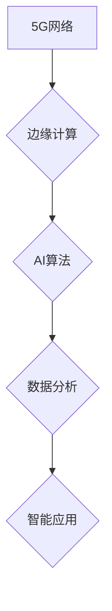

                 

## 5G+AI：注意力经济的新引擎

> 关键词：5G, AI, 注意力经济, 深度学习, 算力, 网络延迟, 智慧城市, 物联网

### 1. 背景介绍

在信息爆炸的时代，人类面临着前所未有的信息过载。如何有效地获取、处理和利用信息，成为了当今社会面临的重大挑战。注意力经济应运而生，它强调了信息获取和处理过程中的注意力资源，并将其作为一种稀缺的、有价值的资源。

5G技术的到来，为注意力经济注入了强劲的动力。5G网络具有极高的带宽、低延迟和海量连接能力，为AI技术的快速发展提供了坚实的基础。AI技术，特别是深度学习，能够通过学习海量数据，识别和理解复杂的模式，从而帮助人们更高效地获取和处理信息。

5G+AI的结合，将深刻地改变我们的生活方式和工作模式。它将催生出新的应用场景，例如智慧城市、智能家居、自动驾驶等，并推动社会经济的数字化转型。

### 2. 核心概念与联系

#### 2.1 注意力经济

注意力经济是指在信息爆炸的时代，人们对信息的获取、处理和利用过程中的注意力资源越来越稀缺，而注意力资源成为了重要的经济资源。

#### 2.2 5G网络

5G是第五代移动通信技术，相比于4G，5G网络具有以下特点：

* **更高的带宽:** 5G网络的带宽比4G网络高出数倍，能够支持更高速率的数据传输。
* **更低的延迟:** 5G网络的延迟比4G网络低得多，能够实现更实时的数据交互。
* **更强的连接能力:** 5G网络能够连接更多的设备，支持万物互联。

#### 2.3 AI技术

人工智能（AI）是指模拟人类智能的计算机系统。深度学习是AI技术的重要分支，它通过多层神经网络来学习和识别复杂的模式。

#### 2.4 5G+AI架构

5G网络为AI技术的快速发展提供了基础设施支持，而AI技术则能够赋能5G网络，使其更加智能化。



### 3. 核心算法原理 & 具体操作步骤

#### 3.1 算法原理概述

深度学习算法是5G+AI的核心算法之一。深度学习算法通过多层神经网络来学习和识别复杂的模式。

#### 3.2 算法步骤详解

1. **数据收集和预处理:** 收集大量相关数据，并进行清洗、格式化等预处理工作。
2. **网络结构设计:** 根据任务需求设计深度学习网络结构，包括神经网络层数、节点数量、激活函数等。
3. **模型训练:** 使用训练数据训练深度学习模型，通过调整模型参数，使模型能够准确地识别和预测目标。
4. **模型评估:** 使用测试数据评估模型的性能，例如准确率、召回率等。
5. **模型部署:** 将训练好的模型部署到实际应用场景中，例如边缘计算设备、云服务器等。

#### 3.3 算法优缺点

**优点:**

* 能够学习和识别复杂的模式。
* 性能优于传统机器学习算法。
* 可应用于多种领域，例如图像识别、自然语言处理等。

**缺点:**

* 需要大量的训练数据。
* 训练时间较长。
* 模型解释性较差。

#### 3.4 算法应用领域

* **图像识别:** 人脸识别、物体检测、图像分类等。
* **自然语言处理:** 语音识别、机器翻译、文本摘要等。
* **推荐系统:** 商品推荐、内容推荐等。
* **医疗诊断:** 疾病诊断、影像分析等。

### 4. 数学模型和公式 & 详细讲解 & 举例说明

#### 4.1 数学模型构建

深度学习模型通常采用多层神经网络结构，每个神经元接收多个输入信号，并通过激活函数进行处理，输出一个信号。

#### 4.2 公式推导过程

神经网络的输出可以表示为：

$$
y = f(W x + b)
$$

其中：

* $y$ 是网络的输出。
* $f$ 是激活函数。
* $W$ 是权重矩阵。
* $x$ 是输入向量。
* $b$ 是偏置向量。

#### 4.3 案例分析与讲解

例如，在图像识别任务中，输入向量 $x$ 表示图像像素值，权重矩阵 $W$ 和偏置向量 $b$ 通过训练得到，激活函数 $f$ 通常采用ReLU函数。

### 5. 项目实践：代码实例和详细解释说明

#### 5.1 开发环境搭建

使用Python语言开发深度学习模型，需要安装以下软件包：

* TensorFlow 或 PyTorch

#### 5.2 源代码详细实现

```python
import tensorflow as tf

# 定义神经网络模型
model = tf.keras.models.Sequential([
    tf.keras.layers.Conv2D(32, (3, 3), activation='relu', input_shape=(28, 28, 1)),
    tf.keras.layers.MaxPooling2D((2, 2)),
    tf.keras.layers.Conv2D(64, (3, 3), activation='relu'),
    tf.keras.layers.MaxPooling2D((2, 2)),
    tf.keras.layers.Flatten(),
    tf.keras.layers.Dense(10, activation='softmax')
])

# 编译模型
model.compile(optimizer='adam',
              loss='sparse_categorical_crossentropy',
              metrics=['accuracy'])

# 训练模型
model.fit(x_train, y_train, epochs=5)

# 评估模型
loss, accuracy = model.evaluate(x_test, y_test)
print('Test loss:', loss)
print('Test accuracy:', accuracy)
```

#### 5.3 代码解读与分析

这段代码定义了一个简单的卷积神经网络模型，用于手写数字识别任务。

* `tf.keras.models.Sequential` 创建了一个顺序模型，即层级结构。
* `tf.keras.layers.Conv2D` 定义了一个卷积层，用于提取图像特征。
* `tf.keras.layers.MaxPooling2D` 定义了一个最大池化层，用于降维。
* `tf.keras.layers.Flatten` 将多维数据转换为一维数据。
* `tf.keras.layers.Dense` 定义了一个全连接层，用于分类。
* `model.compile` 编译模型，指定优化器、损失函数和评价指标。
* `model.fit` 训练模型，使用训练数据进行训练。
* `model.evaluate` 评估模型，使用测试数据进行评估。

#### 5.4 运行结果展示

训练完成后，模型的准确率会随着训练轮数的增加而提高。

### 6. 实际应用场景

#### 6.1 智慧城市

5G+AI可以实现智慧交通、智慧医疗、智慧安防等应用场景，提高城市管理效率和居民生活质量。

#### 6.2 智能家居

5G+AI可以实现智能语音控制、智能家居设备联动等应用场景，为用户提供更加便捷舒适的生活体验。

#### 6.3 自动驾驶

5G+AI可以实现车辆感知、决策、控制等功能，推动自动驾驶技术的发展。

#### 6.4 未来应用展望

5G+AI将催生出更多新的应用场景，例如：

* **虚拟现实/增强现实:** 5G网络的高带宽和低延迟，可以支持更加沉浸式的虚拟现实和增强现实体验。
* **工业互联网:** 5G+AI可以实现工业设备的智能化管理和控制，提高生产效率和降低成本。
* **远程医疗:** 5G+AI可以实现远程医疗诊断和治疗，为偏远地区的人民提供更好的医疗服务。

### 7. 工具和资源推荐

#### 7.1 学习资源推荐

* **书籍:**
    * 深度学习
    * 人工智能：一种现代方法
* **在线课程:**
    * Coursera 深度学习课程
    * Udacity AI编程课程

#### 7.2 开发工具推荐

* **TensorFlow:** 开源深度学习框架
* **PyTorch:** 开源深度学习框架
* **Keras:** 高级深度学习API

#### 7.3 相关论文推荐

* Attention Is All You Need
* Deep Residual Learning for Image Recognition

### 8. 总结：未来发展趋势与挑战

#### 8.1 研究成果总结

5G+AI技术已经取得了显著的成果，并在多个领域得到了应用。

#### 8.2 未来发展趋势

* **模型规模和复杂度提升:** 未来深度学习模型将更加庞大，更加复杂。
* **边缘计算和云计算的融合:** 5G网络将推动边缘计算和云计算的融合，实现更加智能化的应用。
* **跨模态学习:** 未来深度学习模型将能够处理多种模态数据，例如文本、图像、音频等。

#### 8.3 面临的挑战

* **数据安全和隐私保护:** 5G+AI技术需要处理大量的用户数据，因此数据安全和隐私保护是一个重要的挑战。
* **算法可解释性和信任度:** 深度学习模型的决策过程难以解释，这降低了人们对模型的信任度。
* **伦理问题:** 5G+AI技术可能会带来一些伦理问题，例如算法偏见、工作岗位替代等。

#### 8.4 研究展望

未来，5G+AI技术将继续发展，并带来更多新的应用场景和挑战。我们需要加强对该技术的研究，并制定相应的政策和规范，以确保其安全、可持续发展。

### 9. 附录：常见问题与解答

#### 9.1 什么是注意力机制？

注意力机制是一种机器学习技术，它能够帮助模型关注输入数据中最重要的部分。

#### 9.2 5G网络和AI技术的结合有什么优势？

5G网络的高带宽、低延迟和海量连接能力，为AI技术的快速发展提供了基础设施支持。AI技术则能够赋能5G网络，使其更加智能化。

#### 9.3 5G+AI技术有哪些应用场景？

5G+AI技术可以应用于智慧城市、智能家居、自动驾驶等多个领域。


作者：禅与计算机程序设计艺术 / Zen and the Art of Computer Programming 
<end_of_turn>

