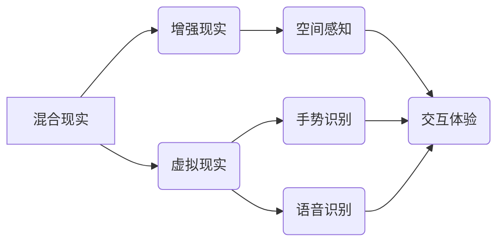

                 

## HoloLens 混合现实应用开发：在 Microsoft HoloLens 设备上创建沉浸式体验

> 关键词：HoloLens, 混合现实, 应用程序开发, Unity, Unreal Engine, C#, Visual Studio, 3D建模,  交互设计

## 1. 背景介绍

混合现实 (MR) 技术正在迅速发展，为我们提供了一种全新的方式来与数字内容互动。其中，Microsoft HoloLens 作为一款领先的 MR 设备，凭借其强大的硬件和软件生态系统，为开发者提供了构建沉浸式体验的绝佳平台。

HoloLens 结合了增强现实 (AR) 和虚拟现实 (VR) 的优势，能够将虚拟对象叠加到现实世界中，创造出逼真的混合现实环境。开发者可以通过 HoloLens 开发各种应用，例如：

* **教育和培训:**  提供身临其境的学习体验，例如虚拟解剖学、3D 模型交互等。
* **医疗保健:**  辅助医生进行手术、远程诊断、患者康复训练等。
* **制造业:**  进行远程指导、虚拟组装、设备维护等。
* **娱乐:**  打造沉浸式游戏、互动电影、虚拟旅游等。

## 2. 核心概念与联系

HoloLens 的核心概念包括：

* **混合现实 (MR):** 将虚拟内容与现实世界融合，创造出新的交互体验。
* **增强现实 (AR):** 将虚拟内容叠加到现实世界中，增强现实世界的感知。
* **虚拟现实 (VR):** 创建完全虚拟的环境，用户沉浸其中。
* **空间感知:** HoloLens 通过传感器和摄像头感知周围环境，并准确定位虚拟对象。
* **手势识别:** 用户可以使用手势与虚拟对象进行交互。
* **语音识别:** 用户可以使用语音指令控制 HoloLens。

**核心概念架构图:**



## 3. 核心算法原理 & 具体操作步骤

### 3.1  算法原理概述

HoloLens 的核心算法包括：

* **视觉 SLAM (Simultaneous Localization and Mapping):** 用于构建环境地图并定位 HoloLens 在其中的位置。
* **物体识别和跟踪:** 用于识别和跟踪现实世界中的物体，以便虚拟对象可以与之交互。
* **手势识别算法:** 用于识别用户的手势，并将其转换为虚拟操作指令。
* **语音识别算法:** 用于识别用户的语音指令，并将其转换为相应的操作。

### 3.2  算法步骤详解

**视觉 SLAM:**

1. **图像采集:** HoloLens 的摄像头采集周围环境的图像。
2. **特征提取:** 从图像中提取特征点，例如角点、边缘等。
3. **特征匹配:** 将图像中的特征点与之前采集的图像中的特征点进行匹配。
4. **地图构建:** 根据特征点匹配结果，构建环境地图。
5. **位置估计:** 利用地图和当前图像中的特征点，估计 HoloLens 的位置。

**物体识别和跟踪:**

1. **图像预处理:** 对图像进行预处理，例如灰度化、边缘检测等。
2. **特征提取:** 从预处理后的图像中提取物体特征，例如颜色、形状、纹理等。
3. **物体分类:** 将提取的特征与训练好的物体分类模型进行比较，识别物体的类别。
4. **物体跟踪:** 利用物体特征，跟踪物体的运动轨迹。

### 3.3  算法优缺点

**视觉 SLAM:**

* **优点:** 能够构建准确的环境地图，并实时估计 HoloLens 的位置。
* **缺点:** 计算量较大，对环境光照和纹理变化敏感。

**物体识别和跟踪:**

* **优点:** 能够识别和跟踪现实世界中的物体，为虚拟对象与现实世界交互提供基础。
* **缺点:** 对物体姿态变化和遮挡敏感。

### 3.4  算法应用领域

* **机器人导航:** 用于帮助机器人自主导航。
* **自动驾驶:** 用于帮助车辆感知周围环境。
* **增强现实游戏:** 用于将虚拟物体叠加到现实世界中，增强游戏体验。

## 4. 数学模型和公式 & 详细讲解 & 举例说明

### 4.1  数学模型构建

视觉 SLAM 的核心是构建一个数学模型来描述环境地图和 HoloLens 的位置关系。常用的数学模型包括：

* **点云地图:** 使用三维点来表示环境地图。
* **网格地图:** 使用网格单元来表示环境地图。
* **概率地图:** 使用概率分布来表示环境地图的不确定性。

### 4.2  公式推导过程

视觉 SLAM 的核心算法之一是卡尔曼滤波，它是一种用于估计系统状态的递归算法。卡尔曼滤波的公式推导过程如下：

* **状态预测:**  $$x_k = F_{k-1}x_{k-1} + w_{k-1}$$
* **状态更新:** $$x_k = x_k^ {pred} + K_k(z_k - H_k x_k^ {pred})$$

其中：

* $x_k$ 是系统状态向量。
* $F_{k-1}$ 是状态转移矩阵。
* $w_{k-1}$ 是过程噪声。
* $z_k$ 是测量值。
* $H_k$ 是观测矩阵。
* $K_k$ 是卡尔曼增益。

### 4.3  案例分析与讲解

假设我们使用卡尔曼滤波来估计 HoloLens 的位置。

* **状态向量:** $x_k = [x, y, z, \theta]^T$，其中 $x$, $y$, $z$ 是 HoloLens 的位置坐标，$\theta$ 是 HoloLens 的旋转角度。
* **状态转移矩阵:** $F_{k-1}$ 描述了 HoloLens 在时间步 $k-1$ 到 $k$ 的运动状态。
* **测量值:** $z_k$ 是 HoloLens 的传感器测量值，例如摄像头图像中的特征点。
* **观测矩阵:** $H_k$ 描述了测量值与状态向量之间的关系。

通过不断迭代卡尔曼滤波算法，我们可以估计 HoloLens 的位置和姿态。

## 5. 项目实践：代码实例和详细解释说明

### 5.1  开发环境搭建

* **操作系统:** Windows 10 或更高版本。
* **开发工具:** Visual Studio 2019 或更高版本。
* **开发框架:** Unity 或 Unreal Engine。
* **HoloLens SDK:** Microsoft HoloLens 开发者套件。

### 5.2  源代码详细实现

以下是一个使用 Unity 开发 HoloLens 应用程序的简单代码示例：

```csharp
using UnityEngine;
using UnityEngine.XR.WSA;

public class HelloWorld : MonoBehaviour
{
    public GameObject cubePrefab;

    void Start()
    {
        // 创建一个立方体对象
        GameObject cube = Instantiate(cubePrefab);

        // 将立方体放置在 HoloLens 前方
        cube.transform.position = transform.position + Vector3.forward * 2;
    }
}
```

### 5.3  代码解读与分析

* `using UnityEngine;`: 引入 UnityEngine 库，用于 Unity 游戏开发。
* `using UnityEngine.XR.WSA;`: 引入 Windows Mixed Reality SDK 库，用于 HoloLens 开发。
* `public GameObject cubePrefab;`: 定义一个公共变量，用于存储立方体预制体。
* `void Start()`: 在游戏开始时执行的函数。
* `GameObject cube = Instantiate(cubePrefab);`: 使用 `Instantiate()` 函数创建立方体对象。
* `cube.transform.position = transform.position + Vector3.forward * 2;`: 设置立方体的初始位置，使其位于 HoloLens 前方 2 米处。

### 5.4  运行结果展示

运行此代码后，一个立方体将出现在 HoloLens 前方，用户可以通过手势与之交互。

## 6. 实际应用场景

HoloLens 的混合现实技术在各个领域都有着广泛的应用场景：

* **教育:** 虚拟解剖学、3D 模型交互、沉浸式历史体验等。
* **医疗保健:** 远程手术指导、虚拟病灶模拟、患者康复训练等。
* **制造业:** 远程设备维护、虚拟组装、产品设计验证等。
* **娱乐:** 沉浸式游戏、互动电影、虚拟旅游等。

### 6.4  未来应用展望

随着 HoloLens 技术的不断发展，未来将有更多创新应用场景出现，例如：

* **元宇宙:** HoloLens 将成为构建元宇宙的重要平台，提供沉浸式的虚拟世界体验。
* **远程协作:** HoloLens 将使远程团队成员能够协同工作，共享虚拟环境。
* **个性化体验:** HoloLens 将根据用户的需求和喜好，提供个性化的混合现实体验。

## 7. 工具和资源推荐

### 7.1  学习资源推荐

* **Microsoft HoloLens 开发者文档:** https://docs.microsoft.com/en-us/windows/mixed-reality/
* **Unity Learn:** https://learn.unity.com/
* **Unreal Engine Learning:** https://www.unrealengine.com/en-US/learn

### 7.2  开发工具推荐

* **Visual Studio:** https://visualstudio.microsoft.com/
* **Unity:** https://unity.com/
* **Unreal Engine:** https://www.unrealengine.com/

### 7.3  相关论文推荐

* **Simultaneous Localization and Mapping (SLAM):** https://en.wikipedia.org/wiki/Simultaneous_localization_and_mapping
* **Kalman Filtering:** https://en.wikipedia.org/wiki/Kalman_filter

## 8. 总结：未来发展趋势与挑战

### 8.1  研究成果总结

HoloLens 混合现实技术取得了显著的进展，为开发者提供了构建沉浸式体验的强大工具。

### 8.2  未来发展趋势

* **更强大的硬件:** HoloLens 将配备更强大的处理器、内存和传感器，提供更逼真的混合现实体验。
* **更丰富的软件生态系统:** 将会有更多应用程序和工具开发出来，丰富 HoloLens 的应用场景。
* **更广泛的应用领域:** HoloLens 将应用于更多领域，例如教育、医疗保健、制造业、娱乐等。

### 8.3  面临的挑战

* **成本:** HoloLens 设备价格较高，限制了其普及率。
* **内容开发:** 缺乏高质量的混合现实内容，限制了 HoloLens 的应用场景。
* **用户体验:** 混合现实技术还存在一些用户体验问题，例如眩晕感、视觉疲劳等。

### 8.4  研究展望

未来研究将集中在以下几个方面：

* **降低成本:** 开发更经济实惠的 HoloLens 设备。
* **丰富内容:** 开发更多高质量的混合现实内容。
* **提升用户体验:** 优化混合现实技术，降低用户体验问题。


## 9. 附录：常见问题与解答

**Q1: HoloLens 需要连接互联网吗？**

A1: HoloLens 可以离线运行，但某些功能，例如云存储和远程协作，需要连接互联网。

**Q2: HoloLens 支持哪些编程语言？**

A2: HoloLens 主要支持 C# 语言，也可以使用 Unity 和 Unreal Engine 等游戏引擎进行开发。

**Q3: HoloLens 的电池续航时间有多长？**

A3: HoloLens 的电池续航时间约为 2-3 小时。

**Q4: HoloLens 的价格是多少？**

A4: HoloLens 的价格取决于型号和配置，一般在几千美元左右。


作者：禅与计算机程序设计艺术 / Zen and the Art of Computer Programming 
<end_of_turn>

