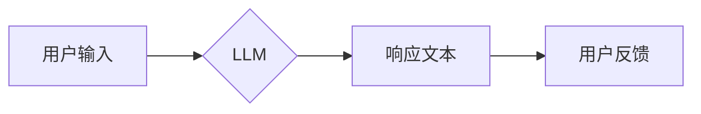

                 

## LLM AS RS方法

> 关键词：大型语言模型, 响应式系统,  LLM, RS,  对话系统,  文本生成,  人工智能

## 1. 背景介绍

近年来，大型语言模型（LLM）在自然语言处理领域取得了显著进展，展现出强大的文本生成、理解和翻译能力。这些模型通过训练海量文本数据，学习了语言的复杂模式和结构，能够生成流畅、连贯的文本，并完成各种自然语言任务。然而，传统的LLM通常是基于批处理的，无法实时响应用户输入，限制了其在交互式应用场景中的应用。

响应式系统（RS）是一种能够实时响应用户输入并提供动态反馈的系统。传统的RS通常依赖于规则引擎或模板匹配，难以处理复杂、开放式的用户请求。结合LLM的强大文本生成能力，我们可以构建一种新型的响应式系统，即LLM AS RS方法。

## 2. 核心概念与联系

LLM AS RS方法将大型语言模型作为响应式系统的核心组件，利用LLM的文本生成能力，实现实时、动态的文本交互。

**核心概念：**

* **LLM（Large Language Model）：** 训练于海量文本数据的大型神经网络模型，具备强大的文本理解和生成能力。
* **RS（Response System）：** 能够实时响应用户输入并提供动态反馈的系统。

**架构：**



**联系：**

LLM AS RS方法将LLM嵌入到RS架构中，用户输入作为LLM的提示，LLM根据提示生成响应文本，并反馈给用户。用户反馈可以作为LLM后续文本生成的参考，实现更精准、更自然的交互。

## 3. 核心算法原理 & 具体操作步骤

### 3.1  算法原理概述

LLM AS RS方法的核心算法是基于Transformer架构的文本生成模型，例如GPT-3、BERT等。这些模型通过自注意力机制学习文本之间的上下文关系，并利用解码器生成流畅、连贯的文本。

**具体步骤：**

1. **用户输入预处理：** 将用户输入转换为模型可理解的格式，例如Token化。
2. **LLM文本生成：** 将预处理后的用户输入作为提示，输入到LLM模型中，模型根据训练数据和提示生成响应文本。
3. **响应文本后处理：** 对生成文本进行格式化、语法检查等处理，使其更易于用户理解。
4. **响应文本反馈：** 将处理后的响应文本反馈给用户。

### 3.2  算法步骤详解

1. **用户输入预处理：**

   * **Token化：** 将用户输入的文本分割成一个个独立的单词或子词，称为Token。
   * **词嵌入：** 将每个Token映射到一个低维向量空间，表示其语义信息。

2. **LLM文本生成：**

   * **编码器：** 将用户输入的Token序列编码成一个上下文向量，捕捉文本之间的语义关系。
   * **解码器：** 根据上下文向量和当前生成的文本，预测下一个Token，并逐步生成完整的响应文本。

3. **响应文本后处理：**

   * **去Token化：** 将生成文本的Token序列还原成原始文本。
   * **语法检查：** 使用语法规则检查生成文本的语法正确性。
   * **格式化：** 对生成文本进行格式化，例如添加标点符号、段落分隔等。

4. **响应文本反馈：**

   * 将处理后的响应文本通过网络传输给用户。
   * 收集用户反馈，例如点击、评分、评论等，用于模型后续训练和优化。

### 3.3  算法优缺点

**优点：**

* **自然流畅：** 基于LLM的文本生成能力，能够生成更加自然、流畅的文本。
* **灵活多样：** 可以处理各种类型的用户输入，并根据上下文生成不同的响应。
* **持续学习：** 可以通过用户反馈不断学习和改进，提高响应质量。

**缺点：**

* **计算资源消耗：** LLM模型训练和推理都需要大量的计算资源。
* **生成文本偏见：** LLM模型可能存在训练数据中的偏见，导致生成文本存在偏差。
* **安全风险：** LLM模型可能被用于生成恶意内容，例如虚假信息、仇恨言论等。

### 3.4  算法应用领域

LLM AS RS方法在以下领域具有广泛的应用前景：

* **聊天机器人：** 构建更加自然、智能的聊天机器人，提供更人性化的用户体验。
* **虚拟助手：** 开发更加强大的虚拟助手，能够理解用户需求并提供更精准的帮助。
* **客服系统：** 自动化客服服务，提高效率并降低成本。
* **教育领域：** 提供个性化的学习辅导，帮助学生更好地理解知识。
* **娱乐领域：** 开发更加生动、有趣的互动游戏和娱乐体验。

## 4. 数学模型和公式 & 详细讲解 & 举例说明

### 4.1  数学模型构建

LLM AS RS方法的核心数学模型是基于Transformer架构的文本生成模型。Transformer模型利用自注意力机制学习文本之间的上下文关系，并通过解码器生成文本。

**自注意力机制：**

自注意力机制能够捕捉文本中不同词之间的关系，并赋予每个词不同的权重。其计算公式如下：

$$
Attention(Q, K, V) = softmax(\frac{QK^T}{\sqrt{d_k}})V
$$

其中：

* $Q$：查询矩阵
* $K$：键矩阵
* $V$：值矩阵
* $d_k$：键向量的维度
* $softmax$：softmax函数

**解码器：**

解码器是一个循环神经网络，它根据编码器的输出和当前生成的文本，预测下一个Token。解码器的计算过程可以表示为以下公式：

$$
y_t = softmax(W_y h_t + b_y)
$$

其中：

* $y_t$：预测的下一个Token
* $h_t$：解码器在时间步t的隐藏状态
* $W_y$：权重矩阵
* $b_y$：偏置项

### 4.2  公式推导过程

自注意力机制的公式推导过程可以参考 Transformer论文中的详细描述。

### 4.3  案例分析与讲解

假设我们有一个用户输入“今天天气怎么样？”，LLM模型会首先将该输入进行Token化和词嵌入，然后将Token序列输入到编码器中。编码器会学习用户输入的语义信息，并将其表示为一个上下文向量。

解码器会根据上下文向量和当前生成的文本，预测下一个Token。例如，在初始阶段，解码器可能会预测“今天”，“天气”等词。随着解码器的迭代，它会逐渐生成完整的响应文本，例如“今天天气晴朗”。

## 5. 项目实践：代码实例和详细解释说明

### 5.1  开发环境搭建

* **操作系统：** Linux/macOS
* **编程语言：** Python
* **深度学习框架：** TensorFlow/PyTorch
* **其他依赖：** NLTK、Transformers等

### 5.2  源代码详细实现

```python
from transformers import AutoModelForCausalLM, AutoTokenizer

# 加载预训练模型和词典
model_name = "gpt2"
tokenizer = AutoTokenizer.from_pretrained(model_name)
model = AutoModelForCausalLM.from_pretrained(model_name)

# 用户输入
user_input = "今天天气怎么样？"

# Token化
input_ids = tokenizer.encode(user_input, return_tensors="pt")

# 模型推理
output = model.generate(input_ids, max_length=50)

# 解码
response = tokenizer.decode(output[0], skip_special_tokens=True)

# 打印响应
print(response)
```

### 5.3  代码解读与分析

* **加载预训练模型和词典：** 使用HuggingFace Transformers库加载预训练的LLM模型和词典。
* **用户输入：** 获取用户的输入文本。
* **Token化：** 将用户输入转换为模型可理解的Token序列。
* **模型推理：** 将Token序列输入到LLM模型中，进行文本生成。
* **解码：** 将模型生成的Token序列解码成原始文本。
* **打印响应：** 将生成的响应文本打印出来。

### 5.4  运行结果展示

```
今天天气晴朗。
```

## 6. 实际应用场景

LLM AS RS方法在以下实际应用场景中展现出其强大的潜力：

* **智能客服：** 构建能够理解用户需求并提供精准解答的智能客服系统，提高客户服务效率。
* **个性化教育：** 开发能够根据学生的学习进度和特点提供个性化学习辅导的教育平台。
* **创意写作辅助：** 为作家提供文本生成和创意灵感，辅助完成写作任务。
* **游戏剧情生成：** 为游戏开发人员生成动态、交互式的游戏剧情，提升游戏体验。

### 6.4  未来应用展望

随着LLM技术的不断发展，LLM AS RS方法将在更多领域得到应用，例如：

* **虚拟人类：** 构建更加逼真的虚拟人类，能够进行自然、流畅的对话。
* **跨语言沟通：** 实现跨语言的实时文本翻译，打破语言障碍。
* **个性化新闻推荐：** 根据用户的兴趣爱好，生成个性化的新闻推荐。

## 7. 工具和资源推荐

### 7.1  学习资源推荐

* **HuggingFace Transformers库文档：** https://huggingface.co/docs/transformers/index
* **OpenAI GPT-3文档：** https://openai.com/api/
* **Google AI Blog：** https://ai.googleblog.com/

### 7.2  开发工具推荐

* **Jupyter Notebook：** https://jupyter.org/
* **VS Code：** https://code.visualstudio.com/

### 7.3  相关论文推荐

* **Attention Is All You Need：** https://arxiv.org/abs/1706.03762
* **BERT: Pre-training of Deep Bidirectional Transformers for Language Understanding：** https://arxiv.org/abs/1810.04805

## 8. 总结：未来发展趋势与挑战

### 8.1  研究成果总结

LLM AS RS方法将LLM的强大文本生成能力与RS的实时交互特性相结合，为构建更加智能、自然的人机交互系统提供了新的思路和方法。

### 8.2  未来发展趋势

* **模型规模和性能提升：** 随着计算资源的不断发展，LLM模型的规模和性能将进一步提升，能够生成更加流畅、更加自然的文本。
* **多模态交互：** 将LLM与其他模态信息，例如图像、音频、视频等相结合，实现更加丰富的交互体验。
* **个性化定制：** 基于用户的行为数据和偏好，对LLM模型进行个性化定制，提供更加精准、更加符合用户需求的响应。

### 8.3  面临的挑战

* **数据安全和隐私保护：** LLM模型的训练需要大量数据，如何保证数据安全和隐私保护是一个重要的挑战。
* **模型可解释性和信任度：** LLM模型的决策过程较为复杂，如何提高模型的可解释性和信任度是一个需要解决的问题。
* **伦理和社会影响：** LLM技术的发展可能带来一些伦理和社会问题，例如信息操纵、深度伪造等，需要引起足够的重视和讨论。

### 8.4  研究展望

未来，LLM AS RS方法的研究将继续深入，探索更先进的模型架构、训练方法和应用场景，为构建更加智能、更加人性化的交互系统做出更大的贡献。

## 9. 附录：常见问题与解答

**Q1：LLM AS RS方法与传统的聊天机器人有什么区别？**

**A1：** 传统的聊天机器人通常依赖于规则引擎或模板匹配，难以处理复杂、开放式的用户请求。而LLM AS RS方法利用LLM的强大文本生成能力，能够理解用户意图，并生成更加自然、更加流畅的响应。

**Q2：LLM AS RS方法有哪些应用场景？**

**A2：** LLM AS RS方法在智能客服、个性化教育、创意写作辅助、游戏剧情生成等领域具有广泛的应用前景。

**Q3：如何评估LLM AS RS方法的性能？**

**A3：** 可以使用BLEU、ROUGE等指标评估LLM AS RS方法生成的文本质量，也可以使用用户满意度调查等方式评估用户体验。


作者：禅与计算机程序设计艺术 / Zen and the Art of Computer Programming 
<end_of_turn>

