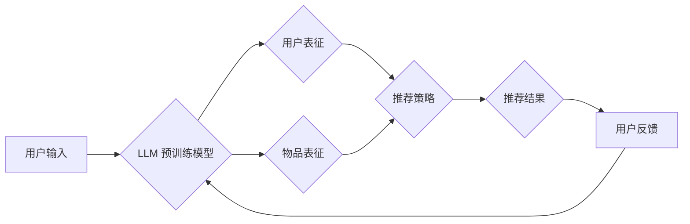

                 

## LLM在推荐系统中的应用综述

> 关键词：大型语言模型 (LLM)、推荐系统、自然语言处理 (NLP)、个性化推荐、内容生成、用户理解

## 1. 背景介绍

推荐系统作为信息过滤和个性化内容呈现的重要工具，在电商、社交媒体、视频平台等领域发挥着至关重要的作用。传统的推荐系统主要依赖于协同过滤、内容过滤和基于知识的推荐算法，这些算法通常基于用户历史行为和物品特征进行建模。然而，随着用户行为数据量的激增和内容的多样性增加，传统的推荐算法面临着挑战，例如数据稀疏性、冷启动问题和推荐结果的单一性。

近年来，大型语言模型 (LLM) 的快速发展为推荐系统带来了新的机遇。LLM 拥有强大的文本理解和生成能力，能够从海量文本数据中学习用户偏好和物品语义，从而提供更精准、个性化和富有创意的推荐结果。

## 2. 核心概念与联系

**2.1  推荐系统概述**

推荐系统旨在根据用户的历史行为、兴趣偏好和上下文信息，预测用户对特定物品的兴趣，并推荐用户可能感兴趣的物品。

**2.2  大型语言模型 (LLM)**

LLM 是近年来深度学习领域取得突破性的进展之一，它是一种基于 Transformer 架构的深度神经网络，能够处理和理解大量的文本数据。LLM 拥有强大的文本生成、翻译、摘要、问答等能力，并能够学习复杂的语言模式和语义关系。

**2.3  LLM 在推荐系统中的应用**

LLM 可以应用于推荐系统的多个环节，例如：

* **用户理解:** LLM 可以分析用户的文本评论、社交媒体帖子等，理解用户的兴趣偏好、需求和情感倾向。
* **物品表征:** LLM 可以生成物品的文本描述、关键词和语义向量，更好地刻画物品的特征和语义。
* **推荐策略:** LLM 可以学习用户和物品之间的关系，并根据用户的历史行为和上下文信息，生成个性化的推荐列表。
* **推荐结果生成:** LLM 可以生成自然语言的推荐描述，例如“您可能喜欢这款电影”或“根据您的兴趣，我们推荐您查看这些商品”。

**2.4  LLM 与传统推荐系统的对比**

| 特性 | 传统推荐系统 | LLM-based 推荐系统 |
|---|---|---|
| 数据依赖 | 主要依赖用户行为数据 | 能够利用文本数据和多模态数据 |
| 理解能力 | 难以理解用户意图和情感 | 能够理解复杂的语言模式和语义关系 |
| 推荐结果 | 通常是基于物品相似度或用户偏好的列表 | 可以生成更个性化、富有创意的推荐描述 |
| 可解释性 | 算法模型难以解释 | 仍然存在可解释性挑战 |

**2.5  LLM 推荐系统架构**



## 3. 核心算法原理 & 具体操作步骤

**3.1  算法原理概述**

LLM 在推荐系统中的应用主要基于以下核心算法原理：

* **文本嵌入:** 将文本数据转换为向量表示，以便模型能够理解和处理文本信息。
* **注意力机制:** 允许模型关注文本中的重要部分，提高对用户意图和物品语义的理解能力。
* **Transformer 架构:** 提供了一种高效的并行处理文本数据的机制，能够学习复杂的语言模式和语义关系。

**3.2  算法步骤详解**

1. **数据预处理:** 收集用户行为数据、物品信息和文本数据，并进行清洗、格式化和编码。
2. **文本嵌入:** 使用预训练的 LLM 模型，将用户评论、物品描述等文本数据转换为向量表示。
3. **用户和物品表征:** 基于用户历史行为和物品特征，构建用户和物品的向量表示。
4. **推荐策略:** 使用 Transformer 架构的模型，学习用户和物品之间的关系，并根据用户的兴趣偏好和上下文信息，生成推荐列表。
5. **推荐结果生成:** 使用 LLM 生成自然语言的推荐描述，例如“您可能喜欢这款电影”或“根据您的兴趣，我们推荐您查看这些商品”。
6. **用户反馈:** 收集用户的点击、评分和评论等反馈信息，并将其用于模型的训练和优化。

**3.3  算法优缺点**

**优点:**

* 能够理解用户意图和情感，提供更精准的推荐结果。
* 可以利用文本数据和多模态数据，提升推荐系统的泛化能力。
* 可以生成更个性化、富有创意的推荐描述。

**缺点:**

* 训练 LLM 模型需要大量的计算资源和时间。
* LLM 模型的解释性较差，难以理解推荐结果背后的逻辑。
* 存在数据偏差和公平性问题。

**3.4  算法应用领域**

LLM-based 推荐系统在以下领域具有广泛的应用前景：

* **电商推荐:** 推荐商品、优惠券和促销活动。
* **内容推荐:** 推荐新闻、视频、音乐和书籍。
* **社交媒体推荐:** 推荐朋友、群组和话题。
* **教育推荐:** 推荐学习资源和课程。
* **医疗推荐:** 推荐医生、医院和治疗方案。

## 4. 数学模型和公式 & 详细讲解 & 举例说明

**4.1  数学模型构建**

LLM-based 推荐系统通常使用 Transformer 架构的模型，其核心是注意力机制和多头注意力机制。

**4.2  公式推导过程**

注意力机制的目的是让模型关注输入序列中最重要的部分。其计算公式如下：

$$
\text{Attention}(Q, K, V) = \text{softmax}\left(\frac{Q K^T}{\sqrt{d_k}}\right) V
$$

其中：

* $Q$ 是查询矩阵，表示模型想要关注的部分。
* $K$ 是键矩阵，表示输入序列中每个元素的特征。
* $V$ 是值矩阵，表示输入序列中每个元素的实际信息。
* $d_k$ 是键向量的维度。

**4.3  案例分析与讲解**

假设我们有一个句子“我喜欢吃苹果和香蕉”，我们想要模型关注“我喜欢吃”这一部分。

* $Q$ 可以是“我喜欢吃”对应的向量表示。
* $K$ 可以是每个单词对应的向量表示。
* $V$ 可以是每个单词的实际信息，例如词义、语法等。

通过计算注意力机制，模型会将“我喜欢吃”对应的向量赋予更高的权重，从而关注到这句话的关键信息。

## 5. 项目实践：代码实例和详细解释说明

**5.1  开发环境搭建**

* Python 3.7+
* PyTorch 或 TensorFlow
* CUDA 和 cuDNN (可选)

**5.2  源代码详细实现**

```python
import torch
import torch.nn as nn

class TransformerRecommender(nn.Module):
    def __init__(self, embedding_dim, num_heads, num_layers):
        super(TransformerRecommender, self).__init__()
        self.embedding = nn.Embedding(vocab_size, embedding_dim)
        self.transformer = nn.Transformer(embedding_dim, num_heads, num_layers)
        self.fc = nn.Linear(embedding_dim, 1)

    def forward(self, user_input, item_input):
        user_embedding = self.embedding(user_input)
        item_embedding = self.embedding(item_input)
        
        # 使用 Transformer 处理用户和物品嵌入
        output = self.transformer(user_embedding, item_embedding)

        # 使用全连接层预测用户对物品的评分
        score = self.fc(output[:, 0, :])
        return score
```

**5.3  代码解读与分析**

* 该代码实现了一个基于 Transformer 架构的推荐模型。
* 模型首先使用 Embedding 层将用户和物品的 ID 转换为向量表示。
* 然后使用 Transformer 层处理用户和物品的嵌入，学习用户和物品之间的关系。
* 最后使用全连接层预测用户对物品的评分。

**5.4  运行结果展示**

运行该模型并使用测试数据进行评估，可以得到模型的准确率、召回率等指标。

## 6. 实际应用场景

**6.1  电商推荐**

LLM 可以分析用户的购物历史、浏览记录和评论，理解用户的兴趣偏好和需求，并推荐个性化的商品、优惠券和促销活动。

**6.2  内容推荐**

LLM 可以分析用户的阅读习惯、观看记录和点赞行为，推荐个性化的新闻、视频、音乐和书籍。

**6.3  社交媒体推荐**

LLM 可以分析用户的社交关系、兴趣爱好和互动行为，推荐个性化的朋友、群组和话题。

**6.4  未来应用展望**

LLM 在推荐系统领域的应用前景广阔，未来可能在以下方面取得突破：

* 更精准的个性化推荐: LLM 可以更好地理解用户的复杂需求和情感倾向，提供更精准的推荐结果。
* 更丰富的推荐内容: LLM 可以生成更丰富的推荐描述，例如推荐理由、相关商品和用户评价等。
* 更智能的交互体验: LLM 可以与用户进行自然语言交互，提供更智能的推荐体验。

## 7. 工具和资源推荐

**7.1  学习资源推荐**

* **书籍:**
    * 《深度学习》
    * 《自然语言处理》
    * 《Transformer 详解》
* **在线课程:**
    * Coursera: 深度学习
    * Udacity: 自然语言处理
    * fast.ai: 深度学习

**7.2  开发工具推荐**

* **PyTorch:** 开源深度学习框架
* **TensorFlow:** 开源深度学习框架
* **Hugging Face Transformers:** 预训练 Transformer 模型库

**7.3  相关论文推荐**

* Attention Is All You Need
* BERT: Pre-training of Deep Bidirectional Transformers for Language Understanding
* GPT-3: Language Models are Few-Shot Learners

## 8. 总结：未来发展趋势与挑战

**8.1  研究成果总结**

LLM 在推荐系统领域的应用取得了显著进展，能够提供更精准、个性化和富有创意的推荐结果。

**8.2  未来发展趋势**

* 更强大的 LLMs: 随着计算资源和算法的不断发展，LLMs 的能力将会进一步提升，能够更好地理解用户需求和物品语义。
* 多模态推荐: LLM 将与其他模态数据，例如图像、音频和视频，进行融合，提供更全面的推荐体验。
* 联邦学习: LLM 将在联邦学习框架下进行训练，保护用户隐私的同时实现个性化推荐。

**8.3  面临的挑战**

* 数据偏差和公平性: LLM 模型容易受到训练数据偏差的影响，导致推荐结果不公平。
* 可解释性: LLM 模型的决策过程难以解释，难以理解推荐结果背后的逻辑。
* 计算资源: 训练大型 LLMs 需要大量的计算资源，成本较高。

**8.4  研究展望**

未来研究将重点关注以下方面:

* 缓解数据偏差和公平性问题。
* 提高 LLM 模型的可解释性。
* 开发更高效的 LLM 训练方法。


## 9. 附录：常见问题与解答

**9.1  LLM 模型训练需要多少数据？**

LLM 模型的训练数据量通常非常庞大，通常需要数十亿甚至数千亿个文本数据。

**9.2  LLM 模型训练需要多少计算资源？**

LLM 模型的训练需要大量的计算资源，通常需要使用高性能 GPU 集群。

**9.3  LLM 模型的推荐结果是否准确？**

LLM 模型的推荐结果准确性取决于训练数据质量、模型架构和训练方法。

**9.4  LLM 模型是否可以解释推荐结果？**

LLM 模型的解释性仍然是一个挑战，目前还没有完全解决这个问题。

**9.5  LLM 模型是否会受到数据偏差的影响？**

LLM 模型容易受到训练数据偏差的影响，因此需要采取措施缓解数据偏差问题。


作者：禅与计算机程序设计艺术 / Zen and the Art of Computer Programming 
<end_of_turn>

