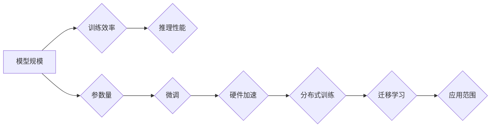

                 

## LLM的可扩展性：机遇与挑战

> 关键词：大型语言模型 (LLM)、可扩展性、模型规模、训练效率、推理性能、参数量、微调、硬件加速、分布式训练、迁移学习

### 1. 背景介绍

大型语言模型 (LLM) 近年来取得了令人瞩目的进展，在自然语言处理 (NLP) 领域展现出强大的能力，例如文本生成、翻译、问答和代码生成等。这些模型通常拥有数十亿甚至数千亿个参数，通过海量文本数据进行训练，从而学习到复杂的语言模式和知识。然而，LLM 的训练和部署面临着巨大的挑战，其中可扩展性是一个至关重要的因素。

随着模型规模的不断增长，训练和推理的资源需求也呈指数级增长。传统的单机训练方法已经难以满足 LLMs 的训练需求，因此，分布式训练和硬件加速成为必要的技术手段。同时，如何有效地利用预训练模型，并将其应用于特定任务，也是 LLMs 可扩展性的关键问题。

### 2. 核心概念与联系

LLM 的可扩展性涉及多个核心概念，包括模型规模、训练效率、推理性能、参数量、微调、硬件加速、分布式训练和迁移学习。这些概念相互关联，共同影响着 LLMs 的整体性能和应用范围。

**Mermaid 流程图：**



**核心概念原理和架构：**

* **模型规模:** 指的是模型中参数的数量。模型规模越大，理论上能够学习到的知识和模式就越多，但同时也意味着更高的计算成本和资源需求。
* **训练效率:** 指的是训练模型所需的时间和资源。随着模型规模的增长，训练效率会显著下降，因此需要采用更有效的训练算法和硬件加速技术。
* **推理性能:** 指的是模型在实际应用中处理输入数据并生成输出结果的速度和准确性。推理性能与模型规模、训练数据和算法设计密切相关。
* **参数量:** 模型参数的数量直接影响模型的复杂度和学习能力。参数量越大，模型越能捕捉语言的复杂性，但同时也意味着更高的存储和计算成本。
* **微调:** 将预训练模型应用于特定任务，通过在特定数据集上进行训练来调整模型参数，从而提高模型在该任务上的性能。
* **硬件加速:** 利用 GPU、TPU 等专用硬件加速模型的训练和推理过程，显著提高计算效率。
* **分布式训练:** 将模型参数和训练数据分布在多个机器上进行训练，从而缩短训练时间和降低单个机器的资源需求。
* **迁移学习:** 利用预训练模型在其他任务上的知识，通过少量数据进行训练，从而提高模型在新任务上的性能。

### 3. 核心算法原理 & 具体操作步骤

#### 3.1  算法原理概述

LLMs 的训练主要基于深度学习算法，其中 Transformer 架构是最常用的模型结构。Transformer 模型利用自注意力机制来捕捉文本序列中的长距离依赖关系，从而实现更准确的语言理解和生成。

#### 3.2  算法步骤详解

1. **数据预处理:** 将文本数据进行清洗、分词、标记等预处理操作，使其能够被模型理解和训练。
2. **模型初始化:** 初始化模型参数，通常采用随机初始化或预训练模型的权重。
3. **前向传播:** 将输入文本序列输入模型，并计算输出结果。
4. **损失函数计算:** 计算模型输出与真实值的差异，即损失函数值。
5. **反向传播:** 利用梯度下降算法，根据损失函数值更新模型参数。
6. **训练迭代:** 重复前向传播、损失函数计算和反向传播步骤，直到模型性能达到预设目标。

#### 3.3  算法优缺点

**优点:**

* 能够捕捉文本序列中的长距离依赖关系。
* 训练效率高，能够处理海量文本数据。
* 在各种 NLP 任务中表现出色。

**缺点:**

* 模型规模庞大，训练和部署成本高。
* 对训练数据质量要求高，容易受到数据偏差的影响。
* 缺乏对真实世界知识的理解和推理能力。

#### 3.4  算法应用领域

* 文本生成：小说、诗歌、剧本等。
* 机器翻译：将一种语言翻译成另一种语言。
* 问答系统：回答用户提出的问题。
* 代码生成：自动生成代码。
* 聊天机器人：与用户进行自然语言对话。

### 4. 数学模型和公式 & 详细讲解 & 举例说明

#### 4.1  数学模型构建

LLMs 的数学模型通常基于神经网络，其中 Transformer 架构是最常用的模型结构。Transformer 模型的核心是自注意力机制，它能够捕捉文本序列中的长距离依赖关系。

#### 4.2  公式推导过程

自注意力机制的计算公式如下：

$$
Attention(Q, K, V) = softmax(\frac{QK^T}{\sqrt{d_k}})V
$$

其中：

* $Q$：查询矩阵
* $K$：键矩阵
* $V$：值矩阵
* $d_k$：键向量的维度
* $softmax$：softmax 函数

#### 4.3  案例分析与讲解

假设我们有一个文本序列 "The cat sat on the mat"，将其转换为词嵌入向量，得到 $Q$, $K$, $V$ 三个矩阵。通过自注意力机制计算，可以得到每个词对其他词的注意力权重，从而捕捉文本序列中的语义关系。例如，"cat" 和 "sat" 之间存在语义关系，因此它们的注意力权重会较高。

### 5. 项目实践：代码实例和详细解释说明

#### 5.1  开发环境搭建

使用 Python 语言和深度学习框架 TensorFlow 或 PyTorch 进行开发。

#### 5.2  源代码详细实现

```python
import tensorflow as tf

# 定义 Transformer 模型
class Transformer(tf.keras.Model):
    def __init__(self, vocab_size, embedding_dim, num_heads, num_layers):
        super(Transformer, self).__init__()
        self.embedding = tf.keras.layers.Embedding(vocab_size, embedding_dim)
        self.transformer_layers = tf.keras.layers.StackedRNNCells([
            tf.keras.layers.MultiHeadAttention(num_heads=num_heads, key_dim=embedding_dim)
            for _ in range(num_layers)
        ])

    def call(self, inputs):
        # ...
```

#### 5.3  代码解读与分析

* `embedding` 层将词索引转换为词嵌入向量。
* `transformer_layers` 层包含多个 Transformer 块，每个块包含多头注意力机制和前馈神经网络。
* `call` 方法定义了模型的输入和输出。

#### 5.4  运行结果展示

训练模型后，可以将其应用于文本生成、机器翻译等任务，并评估模型的性能。

### 6. 实际应用场景

LLMs 在各个领域都有广泛的应用场景，例如：

* **自然语言理解:** 文本分类、情感分析、问答系统等。
* **自然语言生成:** 文本摘要、机器翻译、对话系统等。
* **代码生成:** 自动生成代码、代码补全等。
* **数据分析:** 文本挖掘、知识图谱构建等。

#### 6.4  未来应用展望

随着 LLMs 的不断发展，其应用场景将更加广泛，例如：

* **个性化教育:** 根据学生的学习情况提供个性化的学习内容和辅导。
* **医疗诊断:** 辅助医生进行疾病诊断和治疗方案制定。
* **法律服务:** 自动生成法律文件、分析法律案例等。

### 7. 工具和资源推荐

#### 7.1  学习资源推荐

* **书籍:**
    * 《深度学习》
    * 《自然语言处理》
* **在线课程:**
    * Coursera: 深度学习
    * edX: 自然语言处理
* **博客和论坛:**
    * TensorFlow Blog
    * PyTorch Blog
    * Hugging Face

#### 7.2  开发工具推荐

* **深度学习框架:** TensorFlow, PyTorch
* **文本处理工具:** NLTK, SpaCy
* **云计算平台:** AWS, Google Cloud, Azure

#### 7.3  相关论文推荐

* Attention Is All You Need
* BERT: Pre-training of Deep Bidirectional Transformers for Language Understanding
* GPT-3: Language Models are Few-Shot Learners

### 8. 总结：未来发展趋势与挑战

#### 8.1  研究成果总结

LLMs 在 NLP 领域取得了显著进展，展现出强大的能力和应用潜力。

#### 8.2  未来发展趋势

* 模型规模的进一步扩大
* 训练效率的提升
* 迁移学习的应用
* 伦理和安全问题的研究

#### 8.3  面临的挑战

* 计算资源需求高
* 训练数据质量问题
* 缺乏对真实世界知识的理解
* 伦理和安全风险

#### 8.4  研究展望

未来研究将重点关注以下方面：

* 开发更有效的训练算法和硬件加速技术
* 探索新的模型架构和训练方法
* 研究 LLMs 的伦理和安全问题
* 将 LLMs 应用于更多领域

### 9. 附录：常见问题与解答

* **什么是 LLMs？**

LLMs 是指大型语言模型，是一种能够理解和生成人类语言的深度学习模型。

* **LLMs 的训练数据是什么？**

LLMs 的训练数据通常是海量文本数据，例如书籍、文章、网站内容等。

* **LLMs 的应用场景有哪些？**

LLMs 在各个领域都有广泛的应用场景，例如自然语言理解、自然语言生成、代码生成等。

* **LLMs 的未来发展趋势是什么？**

LLMs 的未来发展趋势是模型规模的进一步扩大、训练效率的提升、迁移学习的应用以及伦理和安全问题的研究。


作者：禅与计算机程序设计艺术 / Zen and the Art of Computer Programming 
<end_of_turn>

