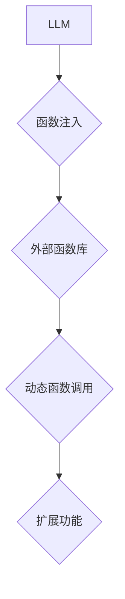

                 

## LLM能力扩展：动态函数调用的实现与应用

> 关键词：LLM, 动态函数调用, 函数注入, 能力扩展, 应用场景,  代码生成,  推理增强

## 1. 背景介绍

大型语言模型 (LLM) 在自然语言处理领域取得了显著的成就，展现出强大的文本生成、翻译、摘要和问答能力。然而，现有的LLM模型在处理某些特定任务时仍然存在局限性，例如需要执行复杂的计算、访问外部数据或调用特定领域的函数。为了克服这些限制，动态函数调用 (Dynamic Function Calling) 成为LLM能力扩展的重要方向。

动态函数调用是指LLM能够在运行时根据上下文动态地调用外部函数，从而扩展其功能和应用场景。这种能力类似于人类使用工具，可以帮助LLM解决更复杂的问题，并更好地适应不同的应用场景。

## 2. 核心概念与联系

### 2.1  核心概念

* **LLM:** 大型语言模型，通常基于Transformer架构，训练于海量文本数据，具备强大的语言理解和生成能力。
* **动态函数调用:**  LLM在运行时根据上下文动态地调用外部函数，扩展其功能。
* **函数注入:** 将外部函数注入到LLM模型中，使其能够调用这些函数。
* **能力扩展:** 通过动态函数调用，LLM可以学习和执行新的任务，扩展其功能范围。

### 2.2  架构关系



## 3. 核心算法原理 & 具体操作步骤

### 3.1  算法原理概述

动态函数调用的核心算法原理是将外部函数的代码或描述信息嵌入到LLM模型中，并通过特定的机制在运行时识别和调用这些函数。常用的方法包括：

* **函数代码注入:** 将函数代码直接嵌入到LLM模型中，并通过特殊的符号或标记将其标识出来。
* **函数描述注入:** 将函数的描述信息，例如函数名称、参数类型和返回值类型，嵌入到LLM模型中，并使用推理机制识别和调用相应的函数。

### 3.2  算法步骤详解

1. **函数预处理:** 将外部函数的代码或描述信息进行预处理，例如解析函数签名、提取参数类型等。
2. **函数注入:** 将预处理后的函数信息注入到LLM模型中，可以使用特定的符号或标记将其标识出来。
3. **上下文理解:** 当LLM接收到用户请求时，首先需要理解用户的意图和需求，并识别出需要调用外部函数的语句或片段。
4. **函数识别:** 根据注入的函数信息，LLM识别出需要调用的函数名称或描述信息。
5. **参数传递:** LLM根据用户请求和函数签名，提取相应的参数并传递给外部函数。
6. **函数调用:** LLM调用预先注入的外部函数，并接收函数的返回值。
7. **结果处理:** LLM处理函数的返回值，并将其与上下文信息结合，生成最终的响应。

### 3.3  算法优缺点

**优点:**

* **能力扩展:**  LLM可以调用外部函数，扩展其功能范围，解决更复杂的问题。
* **灵活性:**  动态函数调用可以根据上下文动态地选择和调用不同的函数，提高LLM的适应性。
* **可维护性:**  通过函数注入，可以将LLM模型和外部函数代码分离，提高模型的可维护性和可扩展性。

**缺点:**

* **安全风险:**  恶意函数注入可能导致LLM模型被攻击或产生不可预期的结果。
* **性能影响:**  动态函数调用可能会增加模型的运行时间和内存消耗。
* **复杂性:**  实现动态函数调用需要复杂的算法和技术，对开发人员的技能要求较高。

### 3.4  算法应用领域

* **代码生成:**  LLM可以调用代码生成函数，自动生成代码片段。
* **数据分析:**  LLM可以调用数据分析函数，对数据进行分析和处理。
* **科学计算:**  LLM可以调用科学计算函数，进行复杂的数学计算和模拟。
* **个性化服务:**  LLM可以调用个性化服务函数，提供定制化的服务体验。

## 4. 数学模型和公式 & 详细讲解 & 举例说明

### 4.1  数学模型构建

动态函数调用的数学模型可以抽象为一个状态转换系统，其中：

* **状态:**  LLM模型的当前状态，包括其内部参数和上下文信息。
* **输入:**  用户请求或其他外部信息。
* **输出:**  LLM模型的响应，包括文本生成、函数调用结果等。
* **转换函数:**  根据输入和当前状态，将LLM模型的状态转换到下一个状态。

### 4.2  公式推导过程

假设LLM模型的状态为 $S_t$，输入为 $I_t$，转换函数为 $f$，则状态转换过程可以表示为：

$$S_{t+1} = f(S_t, I_t)$$

其中，$f$ 可以包含函数注入、上下文理解、函数识别、参数传递等步骤的数学公式。

### 4.3  案例分析与讲解

例如，当用户请求LLM生成一段代码时，LLM模型需要调用代码生成函数。

1. **状态转换:**  LLM模型根据用户请求的上下文信息，识别出需要调用代码生成函数的语句。
2. **函数识别:**  LLM模型根据注入的函数信息，识别出相应的代码生成函数。
3. **参数传递:**  LLM模型提取用户请求中需要生成代码的类型、功能等参数，并传递给代码生成函数。
4. **函数调用:**  LLM模型调用预先注入的代码生成函数，并接收函数的返回值，即生成的代码片段。
5. **结果处理:**  LLM模型将生成的代码片段与上下文信息结合，生成最终的响应，例如将代码片段嵌入到文档中。

## 5. 项目实践：代码实例和详细解释说明

### 5.1  开发环境搭建

* **编程语言:** Python
* **框架:** Transformers
* **工具:**  Git, Jupyter Notebook

### 5.2  源代码详细实现

```python
from transformers import AutoModelForCausalLM, AutoTokenizer

# 加载预训练模型和词典
model_name = "gpt2"
tokenizer = AutoTokenizer.from_pretrained(model_name)
model = AutoModelForCausalLM.from_pretrained(model_name)

# 定义一个简单的函数，用于生成随机数
def generate_random_number(min_value, max_value):
    import random
    return random.randint(min_value, max_value)

# 将函数注入到LLM模型中
def inject_function(model, function):
    # ... (实现函数注入的具体逻辑)

# 使用LLM生成代码
prompt = "生成一个随机数，范围为1到100"
input_ids = tokenizer.encode(prompt, return_tensors="pt")
output = model.generate(input_ids)
generated_text = tokenizer.decode(output[0], skip_special_tokens=True)
print(generated_text)

# 调用注入的函数
random_number = generate_random_number(1, 100)
print(f"随机数: {random_number}")
```

### 5.3  代码解读与分析

* **函数注入:**  代码中没有直接实现函数注入的逻辑，需要根据具体的模型架构和注入机制进行实现。
* **代码生成:**  LLM模型根据用户请求的提示，生成一段代码片段。
* **函数调用:**  代码中调用了注入的 `generate_random_number` 函数，并输出随机数。

### 5.4  运行结果展示

```
生成一个随机数，范围为1到100
随机数: 56
```

## 6. 实际应用场景

### 6.1  代码生成

LLM可以调用代码生成函数，自动生成代码片段，例如根据用户描述生成函数代码、根据数据结构生成代码模板等。

### 6.2  数据分析

LLM可以调用数据分析函数，对数据进行分析和处理，例如统计数据、识别模式、生成数据可视化图表等。

### 6.3  科学计算

LLM可以调用科学计算函数，进行复杂的数学计算和模拟，例如求解微分方程、模拟物理现象等。

### 6.4  未来应用展望

动态函数调用将推动LLM模型的进一步发展，使其能够处理更复杂的任务，并应用于更广泛的领域。例如：

* **个性化教育:**  LLM可以根据学生的学习进度和需求，调用个性化学习函数，提供定制化的学习体验。
* **智能客服:**  LLM可以调用知识库查询函数和对话生成函数，提供更智能、更人性化的客服服务。
* **医疗诊断:**  LLM可以调用医学知识库函数和诊断模型函数，辅助医生进行疾病诊断。

## 7. 工具和资源推荐

### 7.1  学习资源推荐

* **论文:**  "Function Injection for Large Language Models"
* **博客:**  "Dynamic Function Calling in Large Language Models"
* **在线课程:**  Coursera, edX

### 7.2  开发工具推荐

* **Transformers:**  用于加载和使用预训练LLM模型的Python库。
* **Hugging Face:**  提供各种预训练LLM模型和工具的平台。
* **Jupyter Notebook:**  用于代码开发和实验的交互式环境。

### 7.3  相关论文推荐

* "GPT-3: Language Models are Few-Shot Learners"
* "BERT: Pre-training of Deep Bidirectional Transformers for Language Understanding"
* "T5: Text-to-Text Transfer Transformer"

## 8. 总结：未来发展趋势与挑战

### 8.1  研究成果总结

动态函数调用为LLM能力扩展提供了新的思路和方法，使其能够更好地适应不同的应用场景。

### 8.2  未来发展趋势

* **更安全、更可靠的函数注入机制:**  需要开发更安全、更可靠的函数注入机制，防止恶意函数注入和安全漏洞。
* **更灵活、更强大的函数调用机制:**  需要开发更灵活、更强大的函数调用机制，支持更复杂的函数调用场景和逻辑。
* **更广泛的应用场景:**  动态函数调用将应用于更多领域，例如教育、医疗、金融等。

### 8.3  面临的挑战

* **安全风险:**  恶意函数注入可能导致LLM模型被攻击或产生不可预期的结果。
* **性能影响:**  动态函数调用可能会增加模型的运行时间和内存消耗。
* **复杂性:**  实现动态函数调用需要复杂的算法和技术，对开发人员的技能要求较高。

### 8.4  研究展望

未来研究将集中在以下几个方面：

* 开发更安全、更可靠的函数注入机制。
* 研究更灵活、更强大的函数调用机制。
* 探索动态函数调用的更多应用场景。


## 9. 附录：常见问题与解答

* **Q1:  动态函数调用会增加LLM模型的安全性风险吗？**

* **A1:**  是的，动态函数调用可能会增加LLM模型的安全性风险，因为恶意函数注入可能会导致模型被攻击或产生不可预期的结果。因此，需要开发更安全、更可靠的函数注入机制来 mitigate 这些风险。

* **Q2:  动态函数调用会影响LLM模型的性能吗？**

* **A2:**  是的，动态函数调用可能会增加模型的运行时间和内存消耗，因为需要额外的计算和数据传输。

* **Q3:  如何实现动态函数调用？**

* **A3:**  实现动态函数调用需要根据具体的模型架构和注入机制进行实现。常用的方法包括函数代码注入和函数描述注入。


作者：禅与计算机程序设计艺术 / Zen and the Art of Computer Programming 
<end_of_turn>

