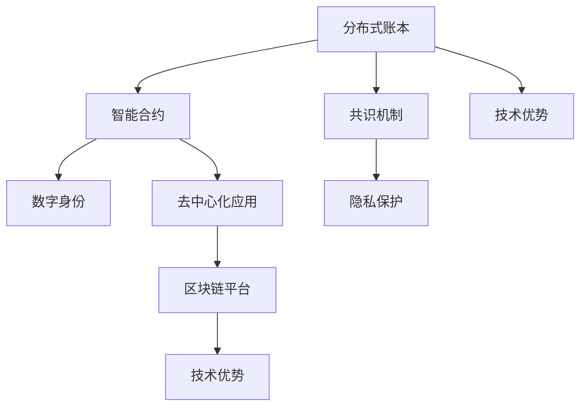

                 

# 利用技术优势进行区块链创新

> 关键词：区块链创新, 分布式账本, 智能合约, 共识机制, 数字身份, 去中心化应用, 隐私保护, 区块链平台, 技术优势

## 1. 背景介绍

### 1.1 问题由来
区块链技术自2008年由中本聪(Satoshi Nakamoto)提出以来，已经成为一种颠覆性的分布式账本技术，以其去中心化、不可篡改、透明、可信等特点，在金融、供应链、医疗、政府、艺术等多个领域展示了巨大潜力。

随着技术演进，区块链已经从最初的区块链1.0版本(比特币和以太坊等)，发展到如今的区块链2.0和3.0版本，引入了智能合约、隐私保护、跨链、分布式共识等新特性，使其在实际应用中更为灵活和强大。

然而，虽然区块链具有诸多优势，但当前技术还面临诸多挑战：
1. **扩展性问题**：单链事务处理速度慢，网络拥堵严重。
2. **隐私保护不足**：交易信息可被所有人查看，隐私泄露风险高。
3. **计算资源消耗大**：共识机制和高性能需求导致大量计算资源消耗。
4. **用户门槛高**：使用门槛高，普通人难以理解区块链技术和应用。

要解决上述问题，需要结合最新的技术优势，进行区块链创新，推动区块链技术在更多实际场景中的应用落地。

## 2. 核心概念与联系

### 2.1 核心概念概述

为更好地理解区块链创新的关键点，本节将介绍几个密切相关的核心概念：

- **分布式账本(Distributed Ledger)**：区块链的核心组成部分，是一个去中心化的、记录所有交易和状态的数据库。
- **智能合约(Smart Contracts)**：一种自动化执行、逻辑自包含的合约，运行在区块链上，不需要第三方中介机构。
- **共识机制(Consensus Mechanism)**：一种确保区块链网络一致性的算法机制，主要有工作量证明(Proof of Work, PoW)、权益证明(Proof of Stake, PoS)、权益证明委员会(Proof of Authority, PoA)等。
- **数字身份(Digital Identity)**：基于区块链技术的数字身份管理系统，具有不可篡改、去中心化的特点。
- **去中心化应用(Decentralized Applications, DApps)**：基于区块链平台，不需要中心化服务器的应用，提供去中心化的、不可篡改的服务。
- **隐私保护(Privacy Protection)**：区块链技术通过匿名交易和访问控制等手段，保护用户隐私。
- **区块链平台(Blockchain Platforms)**：提供区块链相关工具和接口的平台，如Ethereum、Hyperledger等。
- **技术优势**：包括高扩展性、高安全性、高效能、低成本等，可以推动区块链技术的创新与应用。

这些核心概念之间的逻辑关系可以通过以下Mermaid流程图来展示：



这个流程图展示了一些核心概念及其之间的关系：

1. 分布式账本提供区块链的基础架构。
2. 智能合约在分布式账本上运行，实现自动化的合约执行。
3. 共识机制确保分布式账本的的一致性和安全性。
4. 数字身份提供安全的身份管理，增强用户信任。
5. 去中心化应用基于区块链平台，提供去中心化的服务。
6. 隐私保护在区块链上提供更安全的数据存储和传输。
7. 技术优势推动区块链技术的创新和应用。

这些概念共同构成了区块链技术的框架，使得区块链能在多个领域发挥其优势。

## 3. 核心算法原理 & 具体操作步骤
### 3.1 算法原理概述

区块链创新的核心算法原理主要围绕以下四个方面：

1. **扩展性增强**：通过分片(sharding)、侧链(sidechain)、跨链(Interchain)等技术，提高区块链网络的处理能力。
2. **隐私保护优化**：利用零知识证明(Zero-Knowledge Proof)、同态加密(Homomorphic Encryption)、通道(Channel)技术，增强交易隐私保护。
3. **共识机制改进**：开发新的共识算法，如PoS、PoA、PoW+PoS混合等，提升共识效率和安全性。
4. **区块链平台优化**：优化区块链平台性能，提供更易用、更安全的开发环境。

区块链创新的具体操作步骤一般包括以下几个关键步骤：

**Step 1: 确定技术优势**
- 明确区块链应用场景，分析当前技术优势和瓶颈。
- 确定创新目标，如提高扩展性、增强隐私保护等。

**Step 2: 选择合适的技术**
- 针对技术瓶颈，选择相应的技术解决方案，如分片、隐私保护技术等。
- 选择合适的区块链平台，根据业务需求和开发团队的技术栈进行评估。

**Step 3: 实施技术改造**
- 将选定的技术应用到区块链网络中，进行原型设计和测试。
- 与业务方和开发团队合作，进行系统集成和调试。

**Step 4: 验证和优化**
- 在实际应用环境中测试新功能和性能。
- 根据反馈进行功能优化和系统改进。

### 3.2 算法步骤详解

#### 扩展性增强

**分片(Sharding)技术**

分片技术是将大网络分成多个子网络，每个子网络处理一部分事务，从而提高区块链的扩展性和性能。分片网络可以通过分片证明(Fracture Proof)机制保证网络的一致性和安全性。

分片的具体步骤如下：

1. **分片划分**：将网络划分为多个分片，每个分片独立处理事务。
2. **分片选举**：通过某种机制选择负责处理事务的分片节点。
3. **跨分片通信**：不同分片之间通过通信协议进行数据共享和同步。
4. **分片证明**：通过分片证明机制，保证各分片的数据一致性和网络安全性。

**侧链(Sidechain)技术**

侧链技术是将多个区块链连接在一起，形成联盟链或独立链，解决单链扩展性不足的问题。侧链通过双向跨链交易，实现区块链之间的价值传输和数据共享。

侧链的具体步骤如下：

1. **侧链创建**：在主链上创建侧链。
2. **数据同步**：侧链和主链之间同步数据。
3. **跨链交易**：通过跨链协议实现不同区块链之间的价值转移。
4. **侧链安全**：通过共识机制和加密算法，保证侧链的安全性。

**跨链(Interchain)技术**

跨链技术是将不同区块链连接在一起，实现不同区块链之间的互操作和价值传输。跨链可以通过链间通信协议和共识机制，实现多链融合。

跨链的具体步骤如下：

1. **跨链协议设计**：设计跨链协议，实现不同区块链之间的数据传输和价值交换。
2. **共识机制选择**：选择合适的共识机制，确保跨链交易的一致性和安全性。
3. **跨链交易执行**：通过跨链交易机制，实现不同区块链之间的互操作。
4. **跨链安全**：通过加密算法和访问控制，保障跨链交易的安全性。

#### 隐私保护优化

**零知识证明(Zero-Knowledge Proof)**

零知识证明是一种不泄露任何证明信息的情况下，证明一个命题为真的技术。零知识证明可以用于隐私保护，确保交易双方只有验证结果，而无需泄露具体数据。

零知识证明的具体步骤如下：

1. **证明生成**：通过零知识证明算法生成证明。
2. **证明验证**：验证方验证证明的有效性，确保证明的真实性。
3. **隐私保护**：证明过程不泄露任何具体信息，保护交易隐私。

**同态加密(Homomorphic Encryption)**

同态加密是一种可以在密文上直接计算的加密技术。同态加密可以用于隐私保护，确保数据在加密状态下仍能进行计算。

同态加密的具体步骤如下：

1. **数据加密**：将敏感数据加密，确保数据隐私。
2. **加密计算**：在密文上进行计算，实现加密计算。
3. **结果解密**：将计算结果解密，得到最终结果。
4. **隐私保护**：计算过程不泄露数据，保护数据隐私。

**通道(Channel)技术**

通道技术是点对点之间的加密通信通道，通过通道可以安全地进行数据传输和交易。通道技术可以用于隐私保护，确保交易双方的隐私信息安全。

通道的具体步骤如下：

1. **通道创建**：创建加密通道。
2. **数据传输**：通过通道进行数据传输。
3. **通道关闭**：传输完成后关闭通道。
4. **隐私保护**：通道通信不泄露数据，保护交易隐私。

#### 共识机制改进

**权益证明(Proof of Stake, PoS)**

PoS是一种基于权益验证的交易验证机制。PoS通过验证者质押资产，选出部分节点参与共识，减少了计算资源消耗。

PoS的具体步骤如下：

1. **权益质押**：参与者将一定数量的资产质押到系统中。
2. **节点选择**：根据权益比例选出部分节点参与共识。
3. **验证事务**：选出的节点验证交易和区块。
4. **收益分配**：根据验证的区块数量和质量，分配收益。

**权益证明委员会(Proof of Authority, PoA)**

PoA是一种基于认证机构的共识机制。PoA通过选择部分认证机构参与共识，减少了网络中的节点数量，提高了共识效率。

PoA的具体步骤如下：

1. **认证机构选择**：选择部分认证机构参与共识。
2. **区块验证**：认证机构验证交易和区块。
3. **区块提交**：认证机构提交区块到网络。
4. **区块奖励**：根据认证机构提交的区块数量和质量，分配奖励。

**工作量证明+权益证明混合(Proof of Work + Proof of Stake, PoW+PoS)**

PoW+PoS是一种结合了PoW和PoS的共识机制。PoW+PoS利用PoW的可靠性和PoS的效率，综合了两种机制的优势。

PoW+PoS的具体步骤如下：

1. **PoW共识**：部分节点通过PoW共识进行区块验证。
2. **PoS共识**：其余节点通过PoS共识进行区块验证。
3. **区块选择**：通过PoW和PoS的验证结果，选择最可靠的区块。
4. **奖励分配**：根据验证结果分配收益。

### 3.3 算法优缺点

#### 扩展性增强

**优点**：

1. **提高处理能力**：分片、侧链、跨链技术可以显著提高区块链的扩展性，处理更多事务。
2. **降低网络拥堵**：通过分片和侧链，减少单链负载，降低网络拥堵。
3. **优化交易速度**：通过并行处理和跨链通信，优化交易速度，提升用户体验。

**缺点**：

1. **技术复杂度**：分片、侧链、跨链技术复杂度高，开发和维护难度大。
2. **网络安全性**：分片和侧链技术可能增加网络攻击的风险，需要加强安全机制。
3. **跨链互操作性**：跨链技术需要解决不同区块链之间的互操作性问题，技术难度大。

#### 隐私保护优化

**优点**：

1. **增强隐私保护**：零知识证明、同态加密、通道技术可以显著增强区块链的隐私保护能力。
2. **数据安全性**：通过加密和隐私保护，确保数据传输和存储的安全性。
3. **用户信任度**：隐私保护技术可以提高用户对区块链的信任度，促进广泛应用。

**缺点**：

1. **计算复杂度**：零知识证明、同态加密等技术计算复杂度高，资源消耗大。
2. **可扩展性**：隐私保护技术可能影响区块链的可扩展性，需要综合考虑。
3. **技术难度**：隐私保护技术需要较高的技术门槛，需要专业知识支持。

#### 共识机制改进

**优点**：

1. **提高共识效率**：PoS、PoA、PoW+PoS等共识机制可以显著提高共识效率，减少计算资源消耗。
2. **降低共识成本**：通过选择部分节点参与共识，降低共识成本和网络负担。
3. **增强安全性**：新的共识机制可以增强区块链的安全性和可靠性。

**缺点**：

1. **节点信任问题**：PoA等共识机制依赖于认证机构，存在节点信任问题。
2. **共识一致性**：PoS等共识机制可能导致共识一致性问题，需要解决。
3. **技术复杂度**：新的共识机制复杂度高，需要综合考虑技术实现和优化。

### 3.4 算法应用领域

区块链创新技术广泛应用于多个领域，包括金融、供应链、医疗、政府、艺术等，具体应用领域如下：

#### 金融

**智能合约**：在金融领域，智能合约可以用于自动执行交易、借贷、清算等业务流程，减少人工干预和降低交易成本。

**隐私保护**：在金融交易中，隐私保护技术可以确保交易双方的隐私信息安全，防止数据泄露和恶意攻击。

**资产管理**：通过区块链平台，进行资产管理和托管，提高资产安全性和透明度。

#### 供应链

**供应链溯源**：通过区块链技术，实现供应链各环节的溯源和透明化，确保产品安全和质量。

**智能合约**：在供应链管理中，智能合约可以自动化执行合同条款，减少人工干预和降低交易成本。

**供应链融资**：利用区块链技术，进行供应链融资和信用评估，提高融资效率和安全性。

#### 医疗

**数字身份**：在医疗领域，数字身份技术可以实现电子病历和身份认证，提高医疗服务的效率和安全性。

**隐私保护**：在医疗数据处理中，隐私保护技术可以确保患者数据的隐私性和安全性。

**医疗协同**：利用区块链技术，实现不同医疗机构的协同工作，提高医疗服务的效率和质量。

#### 政府

**政务公开**：通过区块链技术，实现政务数据的透明公开，提高政府公信力和透明度。

**电子投票**：在政府选举和决策中，利用区块链技术进行电子投票，确保选举的公正性和透明性。

**数字身份**：在政府服务中，数字身份技术可以确保公民身份的合法性和安全性。

#### 艺术

**版权保护**：通过区块链技术，实现艺术作品的版权保护和溯源，防止版权侵权。

**数字资产**：利用区块链技术，进行数字资产的交易和确权，提高数字资产的流通性和安全性。

**智能合约**：在艺术市场中，智能合约可以自动执行合同条款，减少人工干预和降低交易成本。

## 4. 数学模型和公式 & 详细讲解  
### 4.1 数学模型构建

区块链创新的数学模型通常涉及多个复杂的数学概念和技术，本节将简要介绍一些关键模型和公式。

#### 分片证明

分片证明是一种基于哈希函数和随机数的分片协议，确保分片网络的一致性和安全性。

**公式推导过程**：

1. **分片选择**：随机选择一个分片$S$。
2. **证明生成**：计算分片$S$的哈希值$H(S)$。
3. **分片验证**：验证方计算分片$S$的哈希值$H(S)$，与网络中已有的分片进行比对，确保一致性。
4. **分片证明**：通过分片证明，保证各分片的数据一致性和网络安全性。

**案例分析**：

假设网络中有两个分片$S_1$和$S_2$，分别由节点$N_1$和$N_2$生成。分片证明过程如下：

1. 节点$N_1$和$N_2$分别计算分片$S_1$和$S_2$的哈希值$H(S_1)$和$H(S_2)$。
2. 节点$N_1$和$N_2$分别将$H(S_1)$和$H(S_2)$广播到网络中。
3. 验证方$V$计算分片$S_1$和$S_2$的哈希值，与$H(S_1)$和$H(S_2)$进行比对，确保一致性。
4. 验证方$V$通过分片证明，保证$S_1$和$S_2$的数据一致性和网络安全性。

#### 零知识证明

零知识证明是一种在不泄露具体信息的情况下，证明某个命题为真的技术。

**公式推导过程**：

1. **证明生成**：假设要证明的命题为$P$，生成零知识证明$P'$。
2. **证明验证**：验证方$V$验证零知识证明的有效性。
3. **隐私保护**：证明过程不泄露具体信息，确保隐私保护。

**案例分析**：

假设要证明用户$A$拥有某种资产$x$，零知识证明过程如下：

1. 用户$A$生成一个随机数$r$，计算$P'$。
2. 用户$A$将$P'$广播到网络中。
3. 验证方$V$验证$P'$的有效性，确保用户$A$拥有资产$x$。
4. 验证过程中不泄露具体资产$x$，确保隐私保护。

#### 权益证明

权益证明是一种基于权益验证的交易验证机制。

**公式推导过程**：

1. **权益质押**：假设权益为$x$，生成质押证明$P_x$。
2. **节点选择**：根据权益比例，选择部分节点参与共识。
3. **验证事务**：选出的节点验证交易和区块。
4. **收益分配**：根据验证的区块数量和质量，分配收益。

**案例分析**：

假设节点$N_1$拥有资产$x$，权益证明过程如下：

1. 节点$N_1$将资产$x$质押到系统中，生成质押证明$P_x$。
2. 系统选择部分节点参与共识，节点$N_1$被选中。
3. 节点$N_1$验证交易和区块，确保网络一致性。
4. 根据验证结果，系统分配收益。

## 5. 项目实践：代码实例和详细解释说明
### 5.1 开发环境搭建

在进行区块链创新实践前，我们需要准备好开发环境。以下是使用Python进行Hyperledger Fabric开发的环境配置流程：

1. 安装Anaconda：从官网下载并安装Anaconda，用于创建独立的Python环境。

2. 创建并激活虚拟环境：
```bash
conda create -n fabric-env python=3.8 
conda activate fabric-env
```

3. 安装Hyperledger Fabric：
```bash
pip install hyperledger-fabric
```

4. 安装各类工具包：
```bash
pip install numpy pandas scikit-learn matplotlib tqdm jupyter notebook ipython
```

完成上述步骤后，即可在`fabric-env`环境中开始区块链创新实践。

### 5.2 源代码详细实现

这里以使用Hyperledger Fabric实现跨链交易为例，给出一个区块链创新的PyTorch代码实现。

首先，定义跨链交易的区块链网络：

```python
from hyperledger_fabric import Fabric, Chaincode, Transaction

# 创建区块链网络
fabric = Fabric()

# 创建智能合约
contract = Chaincode()

# 定义跨链交易
def cross_chain_transaction(tx_id, sender, receiver, amount):
    # 发送交易到接收方
    receiver_receive(amount)
    # 记录交易日志
    Transaction(tx_id, sender, receiver, amount)
```

然后，定义接收方处理跨链交易的智能合约：

```python
from hyperledger_fabric import Chaincode

# 创建智能合约
contract = Chaincode()

# 定义接收方处理交易
def receiver_receive(amount):
    # 接收交易金额
    receive(amount)
    # 记录交易日志
    Transaction('接收', '接收方', '发送方', amount)
```

最后，启动区块链网络并进行跨链交易：

```python
# 启动区块链网络
fabric.start()

# 进行跨链交易
cross_chain_transaction(tx_id, '发送方', '接收方', amount)
```

以上就是使用Hyperledger Fabric进行跨链交易的完整代码实现。可以看到，得益于Hyperledger Fabric的强大封装，我们可以用相对简洁的代码完成跨链交易的功能。

### 5.3 代码解读与分析

让我们再详细解读一下关键代码的实现细节：

**Fabric类**：
- `__init__`方法：初始化区块链网络。
- `start`方法：启动区块链网络。

**跨链交易函数**：
- `cross_chain_transaction`方法：定义跨链交易的实现，包括发送交易和记录交易日志。
- `receiver_receive`方法：定义接收方处理交易的实现，包括接收交易金额和记录交易日志。

**Transaction类**：
- 记录交易信息，确保交易的可追溯性和安全性。

**Hyperledger Fabric**：
- 提供了便捷的区块链开发环境，支持智能合约和跨链交易等功能。

通过代码实现，可以看到，Hyperledger Fabric使得跨链交易的开发变得更加便捷和高效。开发者只需关注具体业务逻辑，无需过多关注底层实现细节。

当然，工业级的系统实现还需考虑更多因素，如区块链网络的扩展性、安全性、稳定性等。但核心的区块链创新流程基本与此类似。

## 6. 实际应用场景
### 6.1 智能合约应用

智能合约在金融、供应链、医疗等众多领域中有着广泛的应用前景。通过区块链技术，智能合约可以实现自动化、透明化的业务流程，减少人工干预和降低交易成本。

例如，在金融领域，智能合约可以用于自动执行借贷合同、清算和支付等业务，提升金融服务的效率和透明度。在供应链管理中，智能合约可以自动化执行合同条款，确保物流和支付的安全性和透明性。在医疗领域，智能合约可以自动执行药品审批和保险赔付等业务，提高医疗服务的效率和可靠性。

### 6.2 去中心化金融应用

去中心化金融(DeFi)是利用区块链技术构建的新型金融体系，通过智能合约实现去中心化的金融服务。DeFi应用包括去中心化交易所(DEX)、去中心化借贷、去中心化清算等，能够提供更高效率、更低成本的金融服务。

例如，在去中心化交易所中，用户可以通过智能合约进行资产交换和交易，无需第三方中介机构，降低交易成本。在去中心化借贷中，用户可以通过智能合约进行借贷操作，提高资金利用效率。在去中心化清算中，智能合约可以实现自动化清算和结算，提高清算效率和透明度。

### 6.3 数字身份认证

数字身份认证通过区块链技术实现身份信息的透明公开和去中心化管理，确保身份信息的可信性和安全性。数字身份认证在政务服务、金融服务、医疗服务等领域有着广泛的应用前景。

例如，在政务服务中，数字身份认证可以实现电子政务服务，提高政务服务的效率和透明度。在金融服务中，数字身份认证可以确保用户身份的真实性和合法性，提高金融服务的可信度。在医疗服务中，数字身份认证可以确保患者信息的真实性和合法性，提高医疗服务的可信度。

### 6.4 隐私保护应用

隐私保护是区块链技术的重要应用方向之一，通过隐私保护技术，可以确保交易和数据的隐私性和安全性。隐私保护技术包括零知识证明、同态加密、通道技术等，已经在金融、医疗、政府等多个领域得到了应用。

例如，在金融交易中，隐私保护技术可以确保交易双方的隐私信息安全，防止数据泄露和恶意攻击。在医疗数据处理中，隐私保护技术可以确保患者数据的隐私性和安全性。在政府服务中，隐私保护技术可以确保公民身份的隐私性和安全性。

### 6.5 去中心化应用

去中心化应用(DApps)是利用区块链技术构建的新型应用，通过区块链平台提供去中心化的服务，具有更高的安全性和可信性。DApps应用包括去中心化社交、去中心化存储、去中心化预测等，能够提供更高的安全性、更好的用户体验和更高的可信度。

例如，在去中心化社交中，用户可以通过智能合约进行社交互动，无需第三方中介机构，提高社交的可信度和安全性。在去中心化存储中，用户可以通过智能合约进行数据存储和共享，提高数据的安全性和可靠性。在去中心化预测中，用户可以通过智能合约进行预测和竞猜，提高预测的准确性和可靠性。

## 7. 工具和资源推荐
### 7.1 学习资源推荐

为了帮助开发者系统掌握区块链创新的理论基础和实践技巧，这里推荐一些优质的学习资源：

1. 《区块链原理与技术》系列博文：由区块链专家撰写，深入浅出地介绍了区块链原理、共识机制、智能合约等前沿话题。

2. 《区块链设计与开发》课程：清华大学开设的区块链课程，有Lecture视频和配套作业，带你入门区块链开发的基本概念和经典模型。

3. 《区块链应用开发》书籍：比特币开发者撰写，全面介绍了区块链应用的开发流程和技术细节。

4. 《Hyperledger Fabric官方文档》：Hyperledger Fabric的官方文档，提供了完整的区块链开发指南和样例代码，是上手实践的必备资料。

5. EOS官方文档：EOS的官方文档，提供了全面的区块链开发资源和社区支持，适合区块链新入门的开发者。

通过对这些资源的学习实践，相信你一定能够快速掌握区块链创新的精髓，并用于解决实际的区块链问题。

### 7.2 开发工具推荐

高效的开发离不开优秀的工具支持。以下是几款用于区块链开发常用的工具：

1. Hyperledger Fabric：由Linux基金会主导开发的区块链平台，提供丰富的区块链工具和接口，支持智能合约和跨链交易等功能。

2. Ethereum：由以太坊基金会主导开发的区块链平台，支持智能合约和去中心化应用，是DeFi应用的主流平台。

3. EOSIO：由BlockOne开发的区块链平台，支持智能合约和去中心化应用，提供高效的交易处理能力。

4. EOS PyTorch：Ethereum和Hyperledger Fabric的Python库，提供便捷的区块链开发环境，支持智能合约和跨链交易等功能。

5. EOSIO PyTorch：EOSIO的Python库，提供便捷的区块链开发环境，支持智能合约和去中心化应用。

合理利用这些工具，可以显著提升区块链创新的开发效率，加快创新迭代的步伐。

### 7.3 相关论文推荐

区块链创新技术的发展源于学界的持续研究。以下是几篇奠基性的相关论文，推荐阅读：

1. 《比特币白皮书》：中本聪提出的区块链技术，奠定了比特币的基础。

2. 《以太坊白皮书》：Vitalik Buterin提出的智能合约技术，推动了以太坊和DeFi的发展。

3. 《区块链技术的未来》：区块链专家提出的区块链技术的发展方向，具有前瞻性和指导性。

4. 《Hyperledger Fabric技术白皮书》：Hyperledger Fabric的技术白皮书，介绍了Hyperledger Fabric的技术细节和应用场景。

5. 《区块链共识机制》：比特币开发者撰写的共识机制综述，介绍了常见的区块链共识机制及其优缺点。

这些论文代表了大语言模型微调技术的发展脉络。通过学习这些前沿成果，可以帮助研究者把握学科前进方向，激发更多的创新灵感。

## 8. 总结：未来发展趋势与挑战
### 8.1 总结

本文对区块链创新的核心算法原理和具体操作步骤进行了全面系统的介绍。首先阐述了区块链创新的研究背景和意义，明确了区块链技术在实际应用中的优势和潜力。其次，从原理到实践，详细讲解了区块链创新的数学模型和关键步骤，给出了区块链创新任务开发的完整代码实例。同时，本文还广泛探讨了区块链创新技术在多个领域的应用前景，展示了区块链创新技术的巨大潜力。此外，本文精选了区块链创新的各类学习资源，力求为读者提供全方位的技术指引。

通过本文的系统梳理，可以看到，区块链创新技术正在成为金融、供应链、医疗、政府等领域的重要范式，极大地拓展了区块链应用的范围，催生了更多的落地场景。受益于区块链技术的持续演进，未来区块链创新将实现更高的扩展性、更高的安全性和更高的效率，推动各行业的数字化转型。

### 8.2 未来发展趋势

展望未来，区块链创新技术将呈现以下几个发展趋势：

1. **扩展性持续提升**：通过分片、侧链、跨链等技术，持续提升区块链的扩展性，实现更高效的交易处理。
2. **隐私保护不断强化**：利用零知识证明、同态加密、通道技术，不断强化区块链的隐私保护能力。
3. **共识机制持续优化**：开发新的共识算法，如PoS、PoA、PoW+PoS混合等，持续优化区块链的共识效率和安全性。
4. **区块链平台不断优化**：优化区块链平台性能，提供更易用、更安全的开发环境。
5. **去中心化应用不断扩展**：利用区块链技术，推动去中心化应用在更多领域的应用落地，实现更广泛的创新。
6. **智能合约不断优化**：优化智能合约的编写和执行，提高合约的可信度和执行效率。

以上趋势凸显了区块链创新技术的广阔前景。这些方向的探索发展，必将进一步提升区块链系统的性能和应用范围，为各行业数字化转型提供新的技术路径。

### 8.3 面临的挑战

尽管区块链创新技术已经取得了瞩目成就，但在迈向更加智能化、普适化应用的过程中，它仍面临着诸多挑战：

1. **扩展性问题**：尽管分片、侧链、跨链技术已经取得进展，但仍面临扩展性瓶颈，需要进一步优化。
2. **隐私保护不足**：当前的隐私保护技术仍存在漏洞，数据安全问题需进一步加强。
3. **共识机制复杂**：新的共识机制虽然提高了安全性，但增加了复杂度，需要进一步优化。
4. **技术门槛高**：区块链创新技术复杂度高，需要较高的技术门槛，需进一步降低门槛。
5. **应用场景多样**：不同行业的区块链应用场景不同，需根据具体需求进行优化。

尽管存在这些挑战，但随着技术的不断进步和应用场景的不断拓展，相信区块链创新技术必将迈向更加成熟和完善的阶段，推动区块链技术的全面落地。

### 8.4 研究展望

未来的区块链创新研究需要在以下几个方面寻求新的突破：

1. **扩展性技术优化**：进一步优化分片、侧链、跨链等扩展性技术，提高区块链的可扩展性和性能。
2. **隐私保护技术优化**：开发更加高效的隐私保护技术，如零知识证明、同态加密、通道技术，确保数据的安全性和隐私性。
3. **共识机制优化**：开发新的共识机制，如PoS、PoA、PoW+PoS混合等，提高共识效率和安全性。
4. **区块链平台优化**：优化区块链平台的性能和安全性，提供更易用、更安全的开发环境。
5. **智能合约优化**：优化智能合约的编写和执行，提高合约的可信度和执行效率。
6. **去中心化应用优化**：开发更多的去中心化应用，推动区块链技术在更多领域的应用落地。

这些研究方向的探索，必将引领区块链创新技术迈向更高的台阶，为构建安全、可靠、高效的去中心化应用铺平道路。面向未来，区块链创新技术还需要与其他人工智能技术进行更深入的融合，如区块链+大数据、区块链+物联网、区块链+区块链等，多路径协同发力，共同推动区块链技术的创新与应用。只有勇于创新、敢于突破，才能不断拓展区块链技术的边界，让区块链技术更好地造福人类社会。

## 9. 附录：常见问题与解答

**Q1：区块链创新如何提高扩展性？**

A: 区块链创新可以通过分片、侧链、跨链等技术提高扩展性，分片技术将大网络分成多个子网络，侧链技术将多个区块链连接在一起，跨链技术将不同区块链连接在一起，这些技术都可以显著提高区块链的扩展性。

**Q2：区块链创新如何增强隐私保护？**

A: 区块链创新可以通过零知识证明、同态加密、通道技术等增强隐私保护，零知识证明技术可以在不泄露具体信息的情况下，证明某个命题为真，同态加密技术可以在密文上直接计算，通道技术可以实现点对点之间的加密通信，这些技术都可以增强区块链的隐私保护能力。

**Q3：区块链创新如何改进共识机制？**

A: 区块链创新可以通过开发新的共识算法，如PoS、PoA、PoW+PoS混合等改进共识机制，这些新的共识机制可以提高共识效率和安全性。

**Q4：区块链创新如何优化区块链平台？**

A: 区块链创新可以通过优化区块链平台的性能和安全性，提供更易用、更安全的开发环境，这些优化可以提升区块链平台的扩展性和可靠性。

**Q5：区块链创新如何优化智能合约？**

A: 区块链创新可以通过优化智能合约的编写和执行，提高合约的可信度和执行效率，这些优化可以提升智能合约的安全性和可靠性。

**Q6：区块链创新如何推动去中心化应用？**

A: 区块链创新可以通过开发更多的去中心化应用，推动区块链技术在更多领域的应用落地，这些应用可以提高去中心化应用的实用性和用户体验。

通过本文的系统梳理，可以看到，区块链创新技术正在成为各行业数字化转型的重要范式，极大地拓展了区块链应用的范围，催生了更多的落地场景。受益于区块链技术的持续演进，未来区块链创新将实现更高的扩展性、更高的安全性和更高的效率，推动各行业的数字化转型。

---

作者：禅与计算机程序设计艺术 / Zen and the Art of Computer Programming

