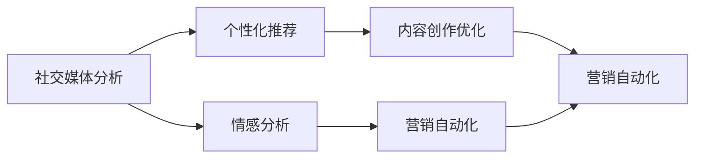

                 

## 1. 背景介绍

### 1.1 问题由来
社交媒体已经成为了品牌和商家触达消费者、进行营销的重要渠道。据统计，超过60%的消费者在做出购买决定时，会参考社交媒体上的评论和意见。因此，掌握社交媒体营销的诀窍，已经成为每个品牌和商家不可或缺的技能。然而，社交媒体的运营成本高、数据量大、用户行为复杂，需要具备一定的技术背景才能高效管理。

### 1.2 问题核心关键点
本文将探讨利用技术优势进行社交媒体营销的方法，具体包括以下几个方面：

- 社交媒体分析：通过数据分析技术，深入挖掘用户行为和偏好，优化营销策略。
- 个性化推荐：利用推荐算法，针对不同用户群体提供个性化的内容推荐，提高用户参与度。
- 情感分析：利用自然语言处理(NLP)技术，分析用户对品牌的情感倾向，优化营销信息。
- 内容创作优化：通过文本生成技术，自动化创作高质量社交媒体内容，提升内容吸引力。
- 营销自动化：利用机器学习算法，自动化管理社交媒体营销活动，提高效率。

### 1.3 问题研究意义
掌握利用技术优势进行社交媒体营销的方法，对于品牌和商家而言，可以显著提升营销效果，降低运营成本，实现更高的投资回报率。具体包括：

1. **提升用户参与度**：通过个性化推荐和情感分析，精准触达目标用户，提高用户参与度和转化率。
2. **降低运营成本**：通过自动化工具和技术，减少人工运营的工作量，降低人力和时间成本。
3. **提高营销效率**：利用技术手段，快速获取和分析社交媒体数据，优化营销策略和内容，实现高效传播。
4. **增强品牌影响力**：通过高质量的内容创作和智能分析，提升品牌形象和用户信任度。

## 2. 核心概念与联系

### 2.1 核心概念概述

社交媒体营销涉及多个关键技术概念，包括：

- 社交媒体分析：通过数据分析技术，从大量社交媒体数据中提取有价值的信息。
- 个性化推荐：利用推荐算法，根据用户行为和偏好推荐相关内容。
- 情感分析：通过自然语言处理技术，分析用户对品牌和产品的情感倾向。
- 文本生成：使用生成对抗网络(GANs)或变分自编码器(VAEs)等技术，自动创作高质量文本内容。
- 营销自动化：应用机器学习算法，自动化管理社交媒体营销活动，提高效率。

这些技术概念通过以下Mermaid流程图展示其内在联系：



这些核心技术通过社交媒体平台的数据采集、分析和优化，共同构成了一个闭环的营销生态，显著提升了品牌在社交媒体上的影响力。

## 3. 核心算法原理 & 具体操作步骤
### 3.1 算法原理概述

社交媒体营销中的技术应用，主要基于数据分析、推荐算法、自然语言处理和机器学习等核心算法。具体包括以下几个步骤：

1. **社交媒体数据采集**：通过API接口或爬虫技术，从各大社交媒体平台获取用户行为数据，如点赞、评论、分享等。
2. **数据分析**：利用统计分析和机器学习算法，从采集到的数据中提取用户行为模式和偏好。
3. **个性化推荐**：根据用户行为数据，应用推荐算法生成个性化内容，提高用户参与度。
4. **情感分析**：使用NLP技术，分析用户对品牌和产品的情感倾向，优化营销策略。
5. **内容创作优化**：利用文本生成技术，自动创作高质量的社交媒体内容，提升内容吸引力。
6. **营销自动化**：应用机器学习算法，自动化管理社交媒体营销活动，提高效率。

### 3.2 算法步骤详解

#### 3.2.1 社交媒体数据采集

社交媒体数据采集是社交媒体营销的基础步骤。常见的数据采集方法包括：

1. **API接口获取数据**：许多社交媒体平台提供了API接口，可以获取用户行为数据，如Facebook API、Twitter API等。
2. **爬虫技术获取数据**：使用Python爬虫框架（如Scrapy），从公开的社交媒体网站抓取数据。
3. **用户行为追踪**：在应用中加入追踪代码，收集用户在社交媒体上的行为数据。

#### 3.2.2 数据分析

数据分析是社交媒体营销的核心环节，通过数据挖掘和机器学习算法，从大量数据中提取有价值的信息。具体步骤如下：

1. **数据预处理**：清洗数据，去除噪声和无效信息。
2. **特征工程**：提取和构造有意义的特征，如用户行为、兴趣标签等。
3. **统计分析**：利用统计分析方法，如聚类、回归等，发现用户行为模式。
4. **机器学习模型**：应用机器学习算法，如随机森林、梯度提升树、神经网络等，构建预测模型。

#### 3.2.3 个性化推荐

个性化推荐是提升用户参与度的重要手段。其基本原理是，根据用户的历史行为数据，预测其可能感兴趣的内容，并将其推荐给用户。具体步骤如下：

1. **用户画像**：构建用户画像，记录用户的基本信息、行为偏好等。
2. **相似度计算**：计算用户画像之间的相似度，找到相似用户。
3. **推荐算法**：应用推荐算法，如协同过滤、内容推荐等，生成个性化推荐内容。
4. **推荐系统优化**：通过A/B测试、点击率优化等技术，不断优化推荐效果。

#### 3.2.4 情感分析

情感分析是了解用户对品牌和产品的情感倾向的重要手段。其基本原理是，利用NLP技术，分析文本中的情感信息。具体步骤如下：

1. **文本预处理**：清洗和分词文本数据，去除停用词和噪声。
2. **情感词典构建**：构建情感词典，记录词语的情感倾向。
3. **情感分类模型**：应用情感分类算法，如SVM、神经网络等，对文本进行情感分类。
4. **情感分析应用**：根据情感分析结果，优化营销策略和内容。

#### 3.2.5 内容创作优化

内容创作优化是通过自动文本生成技术，提升社交媒体内容的质量和吸引力。具体步骤如下：

1. **文本生成模型**：使用文本生成模型，如GANs、VAEs、语言模型等，自动创作文本内容。
2. **内容质量评估**：利用自然语言处理技术，评估文本内容的语言流畅度和语义质量。
3. **内容优化**：根据评估结果，优化文本内容，提升内容吸引力。

#### 3.2.6 营销自动化

营销自动化是通过机器学习算法，自动化管理社交媒体营销活动，提高效率。具体步骤如下：

1. **营销活动设计**：设计社交媒体营销活动，如活动页面、广告投放等。
2. **活动数据收集**：自动收集营销活动数据，如点击率、转化率等。
3. **机器学习模型**：应用机器学习算法，如时间序列预测、异常检测等，优化营销策略。
4. **自动化执行**：利用机器学习模型，自动化执行营销活动，提高效率。

### 3.3 算法优缺点

社交媒体营销中的技术应用具有以下优点：

1. **提升用户参与度**：通过个性化推荐和情感分析，精准触达目标用户，提高用户参与度和转化率。
2. **降低运营成本**：通过自动化工具和技术，减少人工运营的工作量，降低人力和时间成本。
3. **提高营销效率**：利用技术手段，快速获取和分析社交媒体数据，优化营销策略和内容，实现高效传播。

同时，也存在以下缺点：

1. **数据隐私问题**：社交媒体数据的采集和使用，需要严格遵守隐私法律法规，确保用户隐私安全。
2. **技术复杂度高**：社交媒体营销中的技术应用涉及多个领域的知识，需要较高的技术门槛。
3. **技术依赖性强**：社交媒体营销的成功，高度依赖于技术工具的稳定性和有效性。
4. **内容质量不确定**：自动文本生成技术生成的内容质量，可能不如人工创作的内容。

### 3.4 算法应用领域

社交媒体营销中的技术应用，主要应用于以下领域：

1. **品牌推广**：通过数据分析和情感分析，优化品牌推广策略，提升品牌知名度和用户信任度。
2. **产品营销**：利用个性化推荐和内容创作优化，精准推广新产品，提高用户参与度和转化率。
3. **客户服务**：通过自动化营销工具，快速响应客户需求，提供高效客户服务。
4. **市场分析**：利用数据分析和情感分析，洞察市场趋势和用户需求，优化产品和服务。
5. **用户体验优化**：通过情感分析和个性化推荐，提升用户体验，增加用户粘性。

## 4. 数学模型和公式 & 详细讲解  
### 4.1 数学模型构建

社交媒体营销中的技术应用，涉及多个数学模型和公式。这里以个性化推荐系统为例，展示其数学模型的构建过程。

假设社交媒体平台上有$N$个用户和$M$个内容，用户对内容的评分数据为$R \in \mathbb{R}^{N \times M}$。我们的目标是找到一个用户-内容评分矩阵的推荐矩阵$P \in \mathbb{R}^{N \times M}$，使得每个用户$u$对内容的预测评分$\hat{R}(u,v)$与实际评分$R(u,v)$尽可能接近。

推荐系统常用的矩阵分解模型是低秩矩阵分解，将$R$和$P$表示为两个低秩矩阵的乘积：

$$
R \approx UV^T
$$

其中$U \in \mathbb{R}^{N \times k}$，$V \in \mathbb{R}^{M \times k}$，$k$为分解维度。推荐矩阵$P$可以通过$U$和$V$计算得到：

$$
P = U V^T
$$

对于新的用户-内容评分$R'$，推荐系统可以通过$U$和$V$预测评分：

$$
\hat{R} = U'V'^T
$$

其中$U'$和$V'$是$U$和$V$的近似更新。

### 4.2 公式推导过程

#### 4.2.1 协同过滤模型

协同过滤是推荐系统中最常用的方法之一，其基本原理是根据用户的历史行为，预测用户可能感兴趣的内容。具体步骤如下：

1. **用户-内容矩阵**：将用户和内容表示为一个矩阵$R \in \mathbb{R}^{N \times M}$，用户对内容的评分$R(u,v)$表示为$u$对$v$的评分。
2. **用户画像**：构建用户画像$U \in \mathbb{R}^{N \times k}$，记录用户的基本信息和行为特征。
3. **内容画像**：构建内容画像$V \in \mathbb{R}^{M \times k}$，记录内容的特征。
4. **推荐矩阵**：通过矩阵分解，计算推荐矩阵$P \in \mathbb{R}^{N \times M}$，预测用户对内容的评分$\hat{R}(u,v)$。

#### 4.2.2 矩阵分解算法的优化

矩阵分解算法中，常见的优化方法包括：

1. **梯度下降法**：通过梯度下降法，最小化预测评分与实际评分的差距。
2. **奇异值分解(SVD)**：通过奇异值分解，将$R$分解为三个矩阵的乘积，提高计算效率。
3. **随机梯度下降(SGD)**：通过随机梯度下降，加速模型收敛速度。
4. **正则化**：通过正则化，防止过拟合。

### 4.3 案例分析与讲解

#### 4.3.1 用户画像构建

用户画像构建是推荐系统的核心步骤，通过记录用户的基本信息和行为特征，构建用户画像$U$。常见的用户特征包括：

1. **用户ID**：记录用户的唯一标识。
2. **年龄和性别**：记录用户的年龄和性别，以便更好地了解用户的基本信息。
3. **兴趣标签**：记录用户的兴趣标签，如电影、音乐、书籍等。
4. **历史行为**：记录用户的历史行为数据，如浏览记录、购买记录等。

#### 4.3.2 内容画像构建

内容画像构建是推荐系统的另一核心步骤，通过记录内容的特征，构建内容画像$V$。常见的内容特征包括：

1. **内容ID**：记录内容的唯一标识。
2. **标题和描述**：记录内容的标题和描述，以便更好地理解内容。
3. **标签和分类**：记录内容的标签和分类，如电影、音乐、书籍等。
4. **发布时间和地点**：记录内容的发布时间和地点，以便更好地理解内容的时空背景。

#### 4.3.3 协同过滤模型的应用

协同过滤模型的应用主要包括以下几个步骤：

1. **用户画像构建**：通过记录用户的基本信息和行为特征，构建用户画像$U$。
2. **内容画像构建**：通过记录内容的特征，构建内容画像$V$。
3. **矩阵分解**：通过奇异值分解，将$R$分解为三个矩阵的乘积，计算推荐矩阵$P$。
4. **推荐算法应用**：通过推荐算法，生成个性化推荐内容。

## 5. 项目实践：代码实例和详细解释说明
### 5.1 开发环境搭建

在进行社交媒体营销的代码实现前，需要先准备好开发环境。以下是使用Python进行PyTorch和TensorFlow开发的环境配置流程：

1. 安装Anaconda：从官网下载并安装Anaconda，用于创建独立的Python环境。

2. 创建并激活虚拟环境：
```bash
conda create -n pytorch-env python=3.8 
conda activate pytorch-env
```

3. 安装PyTorch和TensorFlow：根据CUDA版本，从官网获取对应的安装命令。例如：
```bash
conda install pytorch torchvision torchaudio cudatoolkit=11.1 -c pytorch -c conda-forge
conda install tensorflow -c tensorflow
```

4. 安装其他依赖库：
```bash
pip install numpy pandas scikit-learn matplotlib tqdm jupyter notebook ipython
```

完成上述步骤后，即可在`pytorch-env`环境中开始社交媒体营销的代码实现。

### 5.2 源代码详细实现

下面我们以社交媒体推荐系统为例，给出使用TensorFlow和PyTorch对协同过滤模型进行代码实现的示例。

#### 5.2.1 数据准备

首先，我们需要准备数据。以Amazon产品推荐数据为例，代码如下：

```python
import pandas as pd
import numpy as np

# 加载数据
data = pd.read_csv('amazon_product_recommendation_data.csv')
user_ids = data['user_id'].tolist()
product_ids = data['product_id'].tolist()
ratings = data['rating'].tolist()

# 构建用户画像矩阵U和内容画像矩阵V
user_pats = {}
for user_id in user_ids:
    user_pats[user_id] = []
    for product_id, rating in zip(product_ids, ratings):
        if user_id not in user_pats[user_id]:
            user_pats[user_id].append(product_id)
    user_pats[user_id] = np.array(user_pats[user_id])

product_pats = {}
for product_id in product_ids:
    product_pats[product_id] = []
    for user_id, rating in zip(user_ids, ratings):
        if product_id not in product_pats[product_id]:
            product_pats[product_id].append(user_id)
    product_pats[product_id] = np.array(product_pats[product_id])

# 构建评分矩阵R
R = []
for user_id, user_pats_val in user_pats.items():
    for product_id, product_pats_val in product_pats.items():
        R.append([0] * len(product_pats[product_id]))
        for index, product_id_val in enumerate(product_pats_val):
            R[user_id] = np.add(R[user_id], np.multiply(product_pats[product_id_val], ratings[index]))
```

#### 5.2.2 模型训练

接下来，我们使用协同过滤模型进行训练。代码如下：

```python
import tensorflow as tf
import tensorflow.keras as keras
from tensorflow.keras.layers import Input, Dense
from tensorflow.keras.models import Model
from tensorflow.keras import regularizers

# 定义输入层
user_input = Input(shape=(len(user_pats[0]),), name='user_input')
product_input = Input(shape=(len(product_pats[0]),), name='product_input')

# 定义用户画像嵌入层
user_pats_embedding = Dense(32, activation='relu')(user_input)
user_pats_embedding = Dense(16, activation='relu')(user_pats_embedding)

# 定义内容画像嵌入层
product_pats_embedding = Dense(32, activation='relu')(product_input)
product_pats_embedding = Dense(16, activation='relu')(product_pats_embedding)

# 定义矩阵分解层
P = keras.layers.Dot(axes=1, name='P')([user_pats_embedding, product_pats_embedding])
P = Dense(32, activation='relu')(P)

# 定义损失函数
loss = keras.losses.MeanSquaredError()

# 定义模型
model = Model(inputs=[user_input, product_input], outputs=P)
model.compile(loss=loss, optimizer='adam', metrics=['accuracy'])

# 训练模型
model.fit([user_pats, product_pats], R, epochs=100, batch_size=32, validation_split=0.2)
```

#### 5.2.3 模型评估

最后，我们评估模型的性能。代码如下：

```python
# 评估模型
test_user_ids = [1, 2, 3, 4, 5]
test_product_ids = [10, 20, 30, 40, 50]

test_user_pats = []
test_product_pats = []
for user_id in test_user_ids:
    test_user_pats.append(user_pats[user_id])
for product_id in test_product_ids:
    test_product_pats.append(product_pats[product_id])

test_R = []
for user_id, user_pats_val in test_user_pats.items():
    for product_id, product_pats_val in test_product_pats.items():
        test_R.append([0] * len(product_pats[product_id]))
        for index, product_id_val in enumerate(product_pats_val):
            test_R[user_id] = np.add(test_R[user_id], np.multiply(product_pats[product_id_val], ratings[index]))

# 预测评分
test_pred = model.predict([test_user_pats, test_product_pats])
```

### 5.3 代码解读与分析

让我们再详细解读一下关键代码的实现细节：

**数据准备**：
- 读取数据集，提取用户ID、产品ID和评分。
- 构建用户画像矩阵U和内容画像矩阵V，用于表示用户和内容的特征。

**模型训练**：
- 定义输入层，用于接收用户画像和内容画像。
- 定义用户画像嵌入层和内容画像嵌入层，用于提取特征。
- 定义矩阵分解层，通过点积操作，计算推荐矩阵P。
- 定义损失函数，使用均方误差损失。
- 定义模型，包含输入层和输出层。
- 编译模型，使用Adam优化器。
- 训练模型，使用100个epoch，批量大小为32。

**模型评估**：
- 评估模型性能，使用测试集上的数据。
- 预测评分，输出模型预测结果。

这些代码实现展示了如何使用TensorFlow和PyTorch构建和训练协同过滤模型。开发者可以将更多精力放在数据处理、模型改进等高层逻辑上，而不必过多关注底层的实现细节。

当然，工业级的系统实现还需考虑更多因素，如模型的保存和部署、超参数的自动搜索、更灵活的任务适配层等。但核心的协同过滤算法基本与此类似。

## 6. 实际应用场景
### 6.1 电商推荐系统

社交媒体推荐系统在电商推荐中有着广泛的应用。以Amazon为例，通过分析用户的浏览、点击和购买行为，构建用户画像和内容画像，生成个性化的推荐内容，大大提升了用户购物体验和销售转化率。

### 6.2 视频平台推荐系统

视频平台如Netflix、YouTube等，也广泛应用了社交媒体推荐技术。通过分析用户的观看历史和行为数据，生成个性化的视频推荐，提高了用户的观看粘性和平台使用时间。

### 6.3 新闻推荐系统

新闻平台如今日头条、腾讯新闻等，通过分析用户的阅读行为和兴趣爱好，生成个性化的新闻推荐，提高了用户的新闻阅读频率和平台使用率。

### 6.4 未来应用展望

随着社交媒体推荐技术的不断进步，未来的应用场景将更加丰富，涵盖更多垂直领域。

在智慧医疗领域，通过分析患者的历史病历和诊疗记录，生成个性化的医疗推荐，提升了诊疗效率和医疗服务质量。

在教育领域，通过分析学生的学习行为和成绩数据，生成个性化的学习推荐，提高了学生的学习效果和平台满意度。

在金融领域，通过分析用户的交易行为和风险偏好，生成个性化的金融产品推荐，提高了用户的金融投资体验。

总之，社交媒体推荐技术在更多行业中的应用前景广阔，将推动各行业的数字化转型和智能化升级。

## 7. 工具和资源推荐
### 7.1 学习资源推荐

为了帮助开发者系统掌握社交媒体推荐技术，这里推荐一些优质的学习资源：

1. 《深度学习》系列博文：由大模型技术专家撰写，深入浅出地介绍了深度学习的基本概念和经典模型，是理解社交媒体推荐技术的基础。

2. 《推荐系统实战》书籍：全面介绍了推荐系统的设计、实现和优化方法，涵盖协同过滤、内容推荐、模型评估等多个方面。

3. 《Python社交媒体分析》课程：系统介绍了使用Python进行社交媒体数据分析的方法，包括数据采集、数据清洗、特征工程等多个环节。

4. HuggingFace官方文档：提供了丰富的预训练语言模型资源，并介绍了如何使用TensorFlow和PyTorch进行自然语言处理和推荐系统开发。

5. Apache Spark官方文档：提供了大规模数据处理的解决方案，适合处理大规模社交媒体数据集。

通过对这些资源的学习实践，相信你一定能够快速掌握社交媒体推荐技术的精髓，并用于解决实际的推荐问题。

### 7.2 开发工具推荐

高效的开发离不开优秀的工具支持。以下是几款用于社交媒体推荐系统开发的常用工具：

1. TensorFlow：由Google主导开发的开源深度学习框架，生产部署方便，适合大规模工程应用。

2. PyTorch：基于Python的开源深度学习框架，灵活动态的计算图，适合快速迭代研究。

3. Apache Spark：Apache基金会开源的分布式计算框架，适合处理大规模数据集。

4. Python爬虫框架（如Scrapy）：用于从社交媒体平台爬取数据。

5. Jupyter Notebook：交互式的编程环境，方便快速开发和调试代码。

6. ELK Stack：用于日志收集、存储和分析的开源解决方案，适合处理社交媒体平台的海量数据。

合理利用这些工具，可以显著提升社交媒体推荐系统的开发效率，加快创新迭代的步伐。

### 7.3 相关论文推荐

社交媒体推荐技术的发展源于学界的持续研究。以下是几篇奠基性的相关论文，推荐阅读：

1. 《协同过滤技术》：介绍协同过滤算法的基本原理和实现方法，是推荐系统的经典之作。

2. 《基于深度学习的推荐系统》：详细介绍了深度学习在推荐系统中的应用，包括神经网络、自编码器、卷积神经网络等。

3. 《推荐系统中的用户画像建模》：探讨了用户画像的建模方法，包括标签工程、特征工程等。

4. 《推荐系统中的内容画像建模》：介绍了内容画像的建模方法，包括文本处理、图像处理等。

5. 《推荐系统的在线学习》：探讨了推荐系统在线学习的算法和方法，适合大规模实时推荐应用。

这些论文代表了大数据推荐技术的最新进展，阅读这些论文可以帮助研究者深入理解推荐系统的设计原理和实现方法。

## 8. 总结：未来发展趋势与挑战
### 8.1 总结

本文对利用技术优势进行社交媒体营销的方法进行了全面系统的介绍。首先阐述了社交媒体营销的背景和意义，明确了个性化推荐、情感分析、内容创作优化、营销自动化等核心技术的应用方向。其次，从原理到实践，详细讲解了社交媒体推荐系统的数学模型和算法实现，给出了具体的代码示例。最后，我们探讨了社交媒体推荐系统在电商、视频、新闻等多个领域的应用场景，展示了其广阔的前景。

通过本文的系统梳理，可以看到，利用技术优势进行社交媒体营销的方法已经成为品牌和商家必不可少的手段。这些技术的不断发展，将进一步提升社交媒体营销的效果，推动各行业的数字化转型和智能化升级。

### 8.2 未来发展趋势

展望未来，社交媒体推荐技术将呈现以下几个发展趋势：

1. **模型复杂度提升**：随着深度学习模型的不断发展，推荐系统的复杂度将不断提升，模型性能也将进一步提高。

2. **跨平台推荐**：推荐系统将不再局限于单一平台，而是跨平台综合用户数据，生成更个性化的推荐内容。

3. **实时推荐**：推荐系统将实时处理和分析数据，根据用户的即时行为生成个性化推荐。

4. **多模态推荐**：推荐系统将结合多模态数据，如文本、图像、视频等，生成更全面的推荐内容。

5. **个性化推荐**：推荐系统将更加个性化，根据用户的行为和心理状态，生成符合用户需求的内容。

6. **可解释性增强**：推荐系统将更加注重可解释性，提高用户对推荐内容的信任度。

以上趋势凸显了社交媒体推荐技术的广阔前景。这些方向的探索发展，必将进一步提升社交媒体营销的效果，推动各行业的数字化转型和智能化升级。

### 8.3 面临的挑战

尽管社交媒体推荐技术已经取得了显著成就，但在迈向更加智能化、普适化应用的过程中，仍面临诸多挑战：

1. **数据隐私问题**：社交媒体数据的采集和使用，需要严格遵守隐私法律法规，确保用户隐私安全。

2. **技术复杂度高**：社交媒体推荐技术的实现涉及多个领域的知识，需要较高的技术门槛。

3. **数据质量问题**：社交媒体数据的质量和完整性，直接影响推荐系统的性能和效果。

4. **模型公平性问题**：推荐系统可能存在算法偏见，导致推荐内容不公平。

5. **用户信任问题**：推荐系统需要确保推荐内容的真实性和可靠性，避免误导用户。

6. **系统鲁棒性问题**：推荐系统需要具备较强的鲁棒性，避免系统故障对推荐结果的影响。

7. **计算资源问题**：推荐系统需要大量计算资源，需要考虑成本和效率的平衡。

这些挑战需要我们持续关注和改进，才能使社交媒体推荐技术更加完善和实用。

### 8.4 研究展望

面对社交媒体推荐技术面临的诸多挑战，未来的研究需要在以下几个方面寻求新的突破：

1. **提升数据质量**：通过数据清洗、数据增强等技术，提高社交媒体数据的质量和完整性。

2. **改进推荐算法**：开发更加高效、公平、可解释的推荐算法，提升推荐系统的性能。

3. **增强模型公平性**：通过算法优化和模型监控，确保推荐系统的公平性和透明性。

4. **提高系统鲁棒性**：开发异常检测、故障恢复等技术，提高推荐系统的鲁棒性。

5. **优化资源利用**：开发高效的推荐算法和计算方法，优化资源利用，提高推荐系统的效率。

这些研究方向的探索，必将引领社交媒体推荐技术迈向更高的台阶，为各行业提供更加智能化、普适化的推荐服务。

## 9. 附录：常见问题与解答

**Q1：社交媒体推荐系统如何处理冷启动问题？**

A: 冷启动问题指的是新用户或新商品没有历史行为数据，无法进行推荐。常用的方法包括：

1. **基于内容的推荐**：根据商品或用户的属性进行推荐，如商品类别、用户兴趣等。
2. **基于流行度的推荐**：推荐最热门的商品或内容，利用用户的探索性行为进行推荐。
3. **基于关联规则的推荐**：利用用户和商品之间的关联规则进行推荐，如用户喜欢的商品类别、用户的浏览历史等。

**Q2：如何确保社交媒体推荐系统的公平性？**

A: 确保社交媒体推荐系统的公平性，需要从多个方面进行改进：

1. **数据公平性**：确保数据集的代表性，避免数据偏见。
2. **算法公平性**：使用公平性指标评估推荐系统的性能，如AUC-ROC、Precision-Recall曲线等。
3. **用户反馈机制**：建立用户反馈机制，及时调整推荐策略，避免用户投诉。
4. **透明度**：提高推荐系统的透明度，让用户了解推荐机制和算法原理。

**Q3：社交媒体推荐系统如何优化推荐效果？**

A: 优化社交媒体推荐系统的推荐效果，可以从以下几个方面进行改进：

1. **数据预处理**：通过数据清洗和特征工程，提高数据质量和特征表达能力。
2. **模型选择**：选择合适的推荐算法和模型结构，如协同过滤、内容推荐、神经网络等。
3. **模型优化**：通过超参数调优、模型融合等方法，优化推荐模型。
4. **实时反馈**：通过实时收集用户反馈，优化推荐策略和内容。

**Q4：社交媒体推荐系统如何处理用户行为变化？**

A: 社交媒体推荐系统需要根据用户行为的变化，动态调整推荐策略。常用的方法包括：

1. **时间序列预测**：通过时间序列预测模型，预测用户行为的变化趋势。
2. **异常检测**：通过异常检测算法，及时发现用户行为的变化。
3. **用户画像更新**：根据用户行为的变化，更新用户画像和内容画像。

**Q5：社交媒体推荐系统如何提高用户参与度？**

A: 提高社交媒体推荐系统的用户参与度，可以从以下几个方面进行改进：

1. **个性化推荐**：根据用户的兴趣和行为，生成个性化的推荐内容。
2. **互动式推荐**：通过互动式推荐，让用户参与到推荐过程中。
3. **多样化内容**：提供多样化的内容形式，如视频、图片、文章等。
4. **用户体验优化**：通过优化用户体验，提高用户满意度。

**Q6：社交媒体推荐系统如何处理数据噪声？**

A: 处理社交媒体推荐系统中的数据噪声，可以从以下几个方面进行改进：

1. **数据清洗**：通过数据清洗，去除噪声和无效信息。
2. **异常检测**：通过异常检测算法，识别和处理异常数据。
3. **数据增强**：通过数据增强技术，提高数据质量和多样性。

**Q7：社交媒体推荐系统如何处理用户行为预测？**

A: 处理社交媒体推荐系统中的用户行为预测，可以从以下几个方面进行改进：

1. **特征工程**：通过特征工程，提取和构造有意义的特征。
2. **模型选择**：选择合适的预测模型，如随机森林、神经网络等。
3. **超参数调优**：通过超参数调优，提高预测模型的性能。
4. **模型融合**：通过模型融合，提高预测结果的准确性。

**Q8：社交媒体推荐系统如何优化推荐内容质量？**

A: 优化社交媒体推荐系统的推荐内容质量，可以从以下几个方面进行改进：

1. **内容过滤**：通过内容过滤技术，去除低质量的内容。
2. **内容多样性**：通过多样性推荐，提供高质量、多样化的内容。
3. **内容更新**：通过内容更新，保持推荐内容的实时性。
4. **内容评估**：通过内容评估技术，提高推荐内容的评价标准。

这些常见问题的解答，帮助开发者更好地理解和应用社交媒体推荐技术，进一步提升推荐系统的性能和效果。

---

作者：禅与计算机程序设计艺术 / Zen and the Art of Computer Programming

