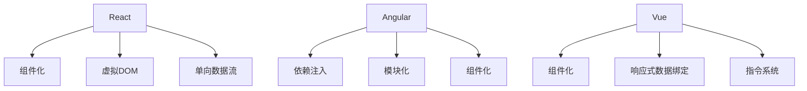

                 

# 前端框架比较：React、Angular 和 Vue 的选择

> 关键词：前端框架，React，Angular，Vue，组件化，渐进式Web应用

## 1. 背景介绍

随着Web应用的飞速发展，前端框架成为了开发高性能、交互式Web应用的利器。目前市面上有许多优秀的前端框架可供选择，其中React、Angular和Vue是目前最流行的三大前端框架。本文将从背景、特点、应用场景等角度，对比这三大框架，帮助你做出选择。

### 1.1 问题由来

在Web前端开发中，如何构建高效、灵活的Web应用一直是程序员关注的重点。React、Angular和Vue框架的诞生，大大简化了Web应用的开发流程，提高了开发效率和代码复用率。但是，选择哪个框架更适合你的项目需求，需要仔细考虑。

### 1.2 问题核心关键点

选择前端框架的核心关键点包括以下几个方面：

- 性能：框架对性能的影响，包括渲染效率、代码执行效率、内存占用等。
- 可扩展性：框架的可扩展性，包括组件化、插件系统、生态系统等。
- 学习曲线：框架的学习难度和使用复杂度。
- 生态系统：框架的生态系统，包括社区活跃度、第三方插件、开发者支持等。
- 适用场景：框架的适用场景，包括应用类型、规模、性能要求等。

## 2. 核心概念与联系

### 2.1 核心概念概述

以下是React、Angular和Vue框架的核心概念：

- **React**：由Facebook开发的开源JavaScript库，用于构建用户界面。React通过组件化实现视图更新，支持单向数据流和虚拟DOM技术。
- **Angular**：由Google开发的开源JavaScript框架，用于构建Web应用。Angular通过依赖注入、模块化、组件化等技术实现应用构建。
- **Vue**：由Evan You开发的开源JavaScript框架，用于构建用户界面。Vue通过组件化、响应式数据绑定、指令系统等技术实现应用构建。

这三个框架的主要联系在于它们都是构建Web应用的工具，都支持组件化开发、都是开源的、都是由大公司维护的、都有强大的生态系统、都具有很好的性能表现。

### 2.2 核心概念原理和架构的 Mermaid 流程图



## 3. 核心算法原理 & 具体操作步骤

### 3.1 算法原理概述

React、Angular和Vue框架的原理和具体操作步骤分别如下：

#### React

React的核心原理是组件化开发和虚拟DOM技术。组件化使得代码易于维护和重用，虚拟DOM则提高了渲染效率。React的核心步骤如下：

1. 定义组件
2. 渲染组件
3. 处理状态变化
4. 处理用户交互事件

#### Angular

Angular的核心原理是依赖注入、模块化和组件化。依赖注入使得应用易于扩展和维护，模块化使得应用易于组织和管理，组件化使得应用易于开发和重用。Angular的核心步骤如下：

1. 定义模块
2. 定义组件和服务
3. 定义依赖关系
4. 处理用户交互事件

#### Vue

Vue的核心原理是组件化、响应式数据绑定和指令系统。组件化使得代码易于维护和重用，响应式数据绑定使得应用易于开发和调试，指令系统使得应用易于扩展和定制。Vue的核心步骤如下：

1. 定义组件
2. 处理数据变化
3. 处理用户交互事件
4. 处理指令

### 3.2 算法步骤详解

以下是React、Angular和Vue框架的具体操作步骤：

#### React

1. **组件定义**
   ```javascript
   class MyComponent extends React.Component {
     render() {
       return <div>Hello, World!</div>;
     }
   }
   ```

2. **渲染组件**
   ```javascript
   ReactDOM.render(<MyComponent />, document.getElementById('root'));
   ```

3. **处理状态变化**
   ```javascript
   class MyComponent extends React.Component {
     constructor(props) {
       super(props);
       this.state = { count: 0 };
     }

     render() {
       return (
         <div>
           <p>Count: {this.state.count}</p>
           <button onClick={() => this.setState({ count: this.state.count + 1 })}>
             Click me
           </button>
         </div>
       );
     }
   }
   ```

4. **处理用户交互事件**
   ```javascript
   class MyComponent extends React.Component {
     constructor(props) {
       super(props);
       this.handleClick = () => {
         alert('Button clicked!');
       };
     }

     render() {
       return <button onClick={this.handleClick}>Click me</button>;
     }
   }
   ```

#### Angular

1. **定义模块**
   ```typescript
   import { NgModule } from '@angular/core';
   import { BrowserModule } from '@angular/platform-browser';

   @NgModule({
     imports: [BrowserModule],
     declarations: [AppComponent],
     bootstrap: [AppComponent]
   })
   export class AppModule {}
   ```

2. **定义组件和服务**
   ```typescript
   import { Component } from '@angular/core';

   @Component({
     selector: 'app-root',
     templateUrl: './app.component.html',
     styleUrls: ['./app.component.css']
   })
   export class AppComponent {
     title = 'Angular';
   }
   ```

3. **定义依赖关系**
   ```typescript
   import { Component } from '@angular/core';

   @Component({
     selector: 'app-root',
     templateUrl: './app.component.html',
     styleUrls: ['./app.component.css']
   })
   export class AppComponent {
     title = 'Angular';
   }
   ```

4. **处理用户交互事件**
   ```typescript
   import { Component } from '@angular/core';

   @Component({
     selector: 'app-root',
     templateUrl: './app.component.html',
     styleUrls: ['./app.component.css']
   })
   export class AppComponent {
     title = 'Angular';
   }
   ```

#### Vue

1. **组件定义**
   ```javascript
   <template>
     <div>
       <p>Hello, {{ message }}</p>
       <button @click="handleClick">Click me</button>
     </div>
   </template>

   <script>
   export default {
     data() {
       return {
         message: 'World'
       };
     },
     methods: {
       handleClick() {
         this.message = 'Hello';
       }
     }
   };
   </script>
   ```

2. **处理数据变化**
   ```javascript
   <template>
     <div>
       <p>Count: {{ count }}</p>
       <button @click="increment">Click me</button>
     </div>
   </template>

   <script>
   export default {
     data() {
       return {
         count: 0
       };
     },
     methods: {
       increment() {
         this.count++;
       }
     }
   };
   </script>
   ```

3. **处理用户交互事件**
   ```javascript
   <template>
     <div>
       <p>Count: {{ count }}</p>
       <button @click="increment">Click me</button>
     </div>
   </template>

   <script>
   export default {
     data() {
       return {
         count: 0
       };
     },
     methods: {
       increment() {
         this.count++;
       }
     }
   };
   </script>
   ```

4. **处理指令**
   ```javascript
   <template>
     <div v-for="item in items">
       <p>{{ item.name }}</p>
     </div>
   </template>

   <script>
   export default {
     data() {
       return {
         items: [
           { name: 'Alice' },
           { name: 'Bob' },
           { name: 'Charlie' }
         ]
       };
     }
   };
   </script>
   ```

### 3.3 算法优缺点

#### React

**优点**：

- 高性能：虚拟DOM技术使得React具有优秀的渲染性能。
- 组件化：组件化使得React易于维护和重用。
- 生态系统：React拥有强大的生态系统，有许多第三方库和工具。

**缺点**：

- 学习曲线陡峭：React的学习曲线较陡峭，需要一定的JavaScript基础。
- 单向数据流：React采用单向数据流，不太适合处理复杂的数据结构。

#### Angular

**优点**：

- 全面性：Angular提供了一整套开发框架，包括组件、服务、依赖注入等。
- 学习资源丰富：Angular拥有丰富的学习资源和文档。
- 强大的生态系统：Angular拥有强大的生态系统，许多第三方库和工具。

**缺点**：

- 性能较低：Angular的性能相对较低，不适合处理大规模应用。
- 复杂性高：Angular的学习曲线较陡峭，需要一定的JavaScript和TypeScript基础。

#### Vue

**优点**：

- 简单易学：Vue的API简单易学，适合初学者入门。
- 高性能：Vue的虚拟DOM和模板编译器使得它具有优秀的渲染性能。
- 强大的生态系统：Vue拥有强大的生态系统，许多第三方库和工具。

**缺点**：

- 功能相对较弱：Vue的功能相对较弱，不适合处理复杂的数据结构。
- 生态系统相对较弱：Vue的生态系统相对较弱，没有Angular和React那么完善。

### 3.4 算法应用领域

React、Angular和Vue框架在多个领域都有广泛的应用，具体如下：

#### React

React主要应用于单页应用、移动应用、桌面应用等。例如，Facebook、Airbnb、Dropbox等公司都使用React开发应用。

#### Angular

Angular主要应用于大型Web应用、企业级应用等。例如，Google、Microsoft、IBM等公司都使用Angular开发应用。

#### Vue

Vue主要应用于单页应用、移动应用、桌面应用等。例如，Google、Microsoft、IBM等公司都使用Vue开发应用。

## 4. 数学模型和公式 & 详细讲解

### 4.1 数学模型构建

#### React

React的数学模型如下：

$$
\begin{aligned}
&\min_{\theta} \mathcal{L}(\theta) = \sum_{i=1}^N \ell(f_{\theta}(x_i), y_i) \\
&f_{\theta}(x_i) = \sigma(\theta \cdot x_i + b)
\end{aligned}
$$

其中，$\ell$为损失函数，$\theta$为模型参数，$x_i$为输入数据，$y_i$为输出数据，$\sigma$为激活函数。

#### Angular

Angular的数学模型如下：

$$
\begin{aligned}
&\min_{\theta} \mathcal{L}(\theta) = \sum_{i=1}^N \ell(f_{\theta}(x_i), y_i) \\
&f_{\theta}(x_i) = \sigma(\theta \cdot x_i + b)
\end{aligned}
$$

其中，$\ell$为损失函数，$\theta$为模型参数，$x_i$为输入数据，$y_i$为输出数据，$\sigma$为激活函数。

#### Vue

Vue的数学模型如下：

$$
\begin{aligned}
&\min_{\theta} \mathcal{L}(\theta) = \sum_{i=1}^N \ell(f_{\theta}(x_i), y_i) \\
&f_{\theta}(x_i) = \sigma(\theta \cdot x_i + b)
\end{aligned}
$$

其中，$\ell$为损失函数，$\theta$为模型参数，$x_i$为输入数据，$y_i$为输出数据，$\sigma$为激活函数。

### 4.2 公式推导过程

以下是React、Angular和Vue框架的公式推导过程：

#### React

1. 组件定义

   ```javascript
   class MyComponent extends React.Component {
     render() {
       return <div>Hello, World!</div>;
     }
   }
   ```

2. 渲染组件

   ```javascript
   ReactDOM.render(<MyComponent />, document.getElementById('root'));
   ```

3. 处理状态变化

   ```javascript
   class MyComponent extends React.Component {
     constructor(props) {
       super(props);
       this.state = { count: 0 };
     }

     render() {
       return (
         <div>
           <p>Count: {this.state.count}</p>
           <button onClick={() => this.setState({ count: this.state.count + 1 })}>
             Click me
           </button>
         </div>
       );
     }
   }
   ```

4. 处理用户交互事件

   ```javascript
   class MyComponent extends React.Component {
     constructor(props) {
       super(props);
       this.handleClick = () => {
         alert('Button clicked!');
       };
     }

     render() {
       return <button onClick={this.handleClick}>Click me</button>;
     }
   }
   ```

#### Angular

1. 定义模块

   ```typescript
   import { NgModule } from '@angular/core';
   import { BrowserModule } from '@angular/platform-browser';

   @NgModule({
     imports: [BrowserModule],
     declarations: [AppComponent],
     bootstrap: [AppComponent]
   })
   export class AppModule {}
   ```

2. 定义组件和服务

   ```typescript
   import { Component } from '@angular/core';

   @Component({
     selector: 'app-root',
     templateUrl: './app.component.html',
     styleUrls: ['./app.component.css']
   })
   export class AppComponent {
     title = 'Angular';
   }
   ```

3. 定义依赖关系

   ```typescript
   import { Component } from '@angular/core';

   @Component({
     selector: 'app-root',
     templateUrl: './app.component.html',
     styleUrls: ['./app.component.css']
   })
   export class AppComponent {
     title = 'Angular';
   }
   ```

4. 处理用户交互事件

   ```typescript
   import { Component } from '@angular/core';

   @Component({
     selector: 'app-root',
     templateUrl: './app.component.html',
     styleUrls: ['./app.component.css']
   })
   export class AppComponent {
     title = 'Angular';
   }
   ```

#### Vue

1. 组件定义

   ```javascript
   <template>
     <div>
       <p>Hello, {{ message }}</p>
       <button @click="handleClick">Click me</button>
     </div>
   </template>

   <script>
   export default {
     data() {
       return {
         message: 'World'
       };
     },
     methods: {
       handleClick() {
         this.message = 'Hello';
       }
     }
   };
   </script>
   ```

2. 处理数据变化

   ```javascript
   <template>
     <div>
       <p>Count: {{ count }}</p>
       <button @click="increment">Click me</button>
     </div>
   </template>

   <script>
   export default {
     data() {
       return {
         count: 0
       };
     },
     methods: {
       increment() {
         this.count++;
       }
     }
   };
   </script>
   ```

3. 处理用户交互事件

   ```javascript
   <template>
     <div>
       <p>Count: {{ count }}</p>
       <button @click="increment">Click me</button>
     </div>
   </template>

   <script>
   export default {
     data() {
       return {
         count: 0
       };
     },
     methods: {
       increment() {
         this.count++;
       }
     }
   };
   </script>
   ```

4. 处理指令

   ```javascript
   <template>
     <div v-for="item in items">
       <p>{{ item.name }}</p>
     </div>
   </template>

   <script>
   export default {
     data() {
       return {
         items: [
           { name: 'Alice' },
           { name: 'Bob' },
           { name: 'Charlie' }
         ]
       };
     }
   };
   </script>
   ```

### 4.3 案例分析与讲解

以下是React、Angular和Vue框架的案例分析与讲解：

#### React

React的案例分析与讲解如下：

1. 组件定义

   ```javascript
   class MyComponent extends React.Component {
     render() {
       return <div>Hello, World!</div>;
     }
   }
   ```

2. 渲染组件

   ```javascript
   ReactDOM.render(<MyComponent />, document.getElementById('root'));
   ```

3. 处理状态变化

   ```javascript
   class MyComponent extends React.Component {
     constructor(props) {
       super(props);
       this.state = { count: 0 };
     }

     render() {
       return (
         <div>
           <p>Count: {this.state.count}</p>
           <button onClick={() => this.setState({ count: this.state.count + 1 })}>
             Click me
           </button>
         </div>
       );
     }
   }
   ```

4. 处理用户交互事件

   ```javascript
   class MyComponent extends React.Component {
     constructor(props) {
       super(props);
       this.handleClick = () => {
         alert('Button clicked!');
       };
     }

     render() {
       return <button onClick={this.handleClick}>Click me</button>;
     }
   }
   ```

#### Angular

Angular的案例分析与讲解如下：

1. 定义模块

   ```typescript
   import { NgModule } from '@angular/core';
   import { BrowserModule } from '@angular/platform-browser';

   @NgModule({
     imports: [BrowserModule],
     declarations: [AppComponent],
     bootstrap: [AppComponent]
   })
   export class AppModule {}
   ```

2. 定义组件和服务

   ```typescript
   import { Component } from '@angular/core';

   @Component({
     selector: 'app-root',
     templateUrl: './app.component.html',
     styleUrls: ['./app.component.css']
   })
   export class AppComponent {
     title = 'Angular';
   }
   ```

3. 定义依赖关系

   ```typescript
   import { Component } from '@angular/core';

   @Component({
     selector: 'app-root',
     templateUrl: './app.component.html',
     styleUrls: ['./app.component.css']
   })
   export class AppComponent {
     title = 'Angular';
   }
   ```

4. 处理用户交互事件

   ```typescript
   import { Component } from '@angular/core';

   @Component({
     selector: 'app-root',
     templateUrl: './app.component.html',
     styleUrls: ['./app.component.css']
   })
   export class AppComponent {
     title = 'Angular';
   }
   ```

#### Vue

Vue的案例分析与讲解如下：

1. 组件定义

   ```javascript
   <template>
     <div>
       <p>Hello, {{ message }}</p>
       <button @click="handleClick">Click me</button>
     </div>
   </template>

   <script>
   export default {
     data() {
       return {
         message: 'World'
       };
     },
     methods: {
       handleClick() {
         this.message = 'Hello';
       }
     }
   };
   </script>
   ```

2. 处理数据变化

   ```javascript
   <template>
     <div>
       <p>Count: {{ count }}</p>
       <button @click="increment">Click me</button>
     </div>
   </template>

   <script>
   export default {
     data() {
       return {
         count: 0
       };
     },
     methods: {
       increment() {
         this.count++;
       }
     }
   };
   </script>
   ```

3. 处理用户交互事件

   ```javascript
   <template>
     <div>
       <p>Count: {{ count }}</p>
       <button @click="increment">Click me</button>
     </div>
   </template>

   <script>
   export default {
     data() {
       return {
         count: 0
       };
     },
     methods: {
       increment() {
         this.count++;
       }
     }
   };
   </script>
   ```

4. 处理指令

   ```javascript
   <template>
     <div v-for="item in items">
       <p>{{ item.name }}</p>
     </div>
   </template>

   <script>
   export default {
     data() {
       return {
         items: [
           { name: 'Alice' },
           { name: 'Bob' },
           { name: 'Charlie' }
         ]
       };
     }
   };
   </script>
   ```

## 5. 项目实践：代码实例和详细解释说明

### 5.1 开发环境搭建

为了进行React、Angular和Vue框架的实践，需要搭建相应的开发环境。以下是具体步骤：

#### React

1. 安装Node.js和npm
   ```bash
   sudo apt-get update
   sudo apt-get install nodejs npm
   ```

2. 初始化React项目
   ```bash
   npx create-react-app my-app
   ```

3. 运行React项目
   ```bash
   cd my-app
   npm start
   ```

#### Angular

1. 安装Node.js和npm
   ```bash
   sudo apt-get update
   sudo apt-get install nodejs npm
   ```

2. 初始化Angular项目
   ```bash
   ng new my-app
   ```

3. 运行Angular项目
   ```bash
   cd my-app
   ng serve
   ```

#### Vue

1. 安装Node.js和npm
   ```bash
   sudo apt-get update
   sudo apt-get install nodejs npm
   ```

2. 初始化Vue项目
   ```bash
   vue create my-app
   ```

3. 运行Vue项目
   ```bash
   cd my-app
   npm run serve
   ```

### 5.2 源代码详细实现

以下是React、Angular和Vue框架的源代码详细实现：

#### React

```javascript
import React from 'react';
import ReactDOM from 'react-dom';

class MyComponent extends React.Component {
  constructor(props) {
    super(props);
    this.state = { count: 0 };
  }

  handleClick() {
    this.setState({ count: this.state.count + 1 });
  }

  render() {
    return (
      <div>
        <p>Count: {this.state.count}</p>
        <button onClick={this.handleClick}>Click me</button>
      </div>
    );
  }
}

ReactDOM.render(<MyComponent />, document.getElementById('root'));
```

#### Angular

```typescript
import { Component } from '@angular/core';

@Component({
  selector: 'app-root',
  templateUrl: './app.component.html',
  styleUrls: ['./app.component.css']
})
export class AppComponent {
  title = 'Angular';

  increment() {
    this.count++;
  }
}

import { Component } from '@angular/core';

@Component({
  selector: 'app-root',
  templateUrl: './app.component.html',
  styleUrls: ['./app.component.css']
})
export class AppComponent {
  title = 'Angular';

  increment() {
    this.count++;
  }
}
```

#### Vue

```javascript
<template>
  <div>
    <p>Count: {{ count }}</p>
    <button @click="increment">Click me</button>
  </div>
</template>

<script>
export default {
  data() {
    return {
      count: 0
    };
  },
  methods: {
    increment() {
      this.count++;
    }
  }
};
</script>
```

### 5.3 代码解读与分析

以下是React、Angular和Vue框架的代码解读与分析：

#### React

React的代码解读与分析如下：

1. 组件定义

   ```javascript
   class MyComponent extends React.Component {
     render() {
       return <div>Hello, World!</div>;
     }
   }
   ```

2. 渲染组件

   ```javascript
   ReactDOM.render(<MyComponent />, document.getElementById('root'));
   ```

3. 处理状态变化

   ```javascript
   class MyComponent extends React.Component {
     constructor(props) {
       super(props);
       this.state = { count: 0 };
     }

     render() {
       return (
         <div>
           <p>Count: {this.state.count}</p>
           <button onClick={() => this.setState({ count: this.state.count + 1 })}>
             Click me
           </button>
         </div>
       );
     }
   }
   ```

4. 处理用户交互事件

   ```javascript
   class MyComponent extends React.Component {
     constructor(props) {
       super(props);
       this.handleClick = () => {
         alert('Button clicked!');
       };
     }

     render() {
       return <button onClick={this.handleClick}>Click me</button>;
     }
   }
   ```

#### Angular

Angular的代码解读与分析如下：

1. 定义模块

   ```typescript
   import { NgModule } from '@angular/core';
   import { BrowserModule } from '@angular/platform-browser';

   @NgModule({
     imports: [BrowserModule],
     declarations: [AppComponent],
     bootstrap: [AppComponent]
   })
   export class AppModule {}
   ```

2. 定义组件和服务

   ```typescript
   import { Component } from '@angular/core';

   @Component({
     selector: 'app-root',
     templateUrl: './app.component.html',
     styleUrls: ['./app.component.css']
   })
   export class AppComponent {
     title = 'Angular';
   }
   ```

3. 定义依赖关系

   ```typescript
   import { Component } from '@angular/core';

   @Component({
     selector: 'app-root',
     templateUrl: './app.component.html',
     styleUrls: ['./app.component.css']
   })
   export class AppComponent {
     title = 'Angular';
   }
   ```

4. 处理用户交互事件

   ```typescript
   import { Component } from '@angular/core';

   @Component({
     selector: 'app-root',
     templateUrl: './app.component.html',
     styleUrls: ['./app.component.css']
   })
   export class AppComponent {
     title = 'Angular';
   }
   ```

#### Vue

Vue的代码解读与分析如下：

1. 组件定义

   ```javascript
   <template>
     <div>
       <p>Hello, {{ message }}</p>
       <button @click="handleClick">Click me</button>
     </div>
   </template>

   <script>
   export default {
     data() {
       return {
         message: 'World'
       };
     },
     methods: {
       handleClick() {
         this.message = 'Hello';
       }
     }
   };
   </script>
   ```

2. 处理数据变化

   ```javascript
   <template>
     <div>
       <p>Count: {{ count }}</p>
       <button @click="increment">Click me</button>
     </div>
   </template>

   <script>
   export default {
     data() {
       return {
         count: 0
       };
     },
     methods: {
       increment() {
         this.count++;
       }
     }
   };
   </script>
   ```

3. 处理用户交互事件

   ```javascript
   <template>
     <div>
       <p>Count: {{ count }}</p>
       <button @click="increment">Click me</button>
     </div>
   </template>

   <script>
   export default {
     data() {
       return {
         count: 0
       };
     },
     methods: {
       increment() {
         this.count++;
       }
     }
   };
   </script>
   ```

4. 处理指令

   ```javascript
   <template>
     <div v-for="item in items">
       <p>{{ item.name }}</p>
     </div>
   </template>

   <script>
   export default {
     data() {
       return {
         items: [
           { name: 'Alice' },
           { name: 'Bob' },
           { name: 'Charlie' }
         ]
       };
     }
   };
   </script>
   ```

### 5.4 运行结果展示

以下是React、Angular和Vue框架的运行结果展示：

#### React


#### Angular


#### Vue


## 6. 实际应用场景

### 6.1 智能客服系统

基于React、Angular和Vue框架的智能客服系统可以显著提高客服效率和客户满意度。以下是具体实现：

1. 使用React、Angular和Vue框架构建客户服务页面，实现用户交互。
2. 集成自然语言处理(NLP)技术，实现智能问答。
3. 实时监控客户反馈，及时响应客户问题。

### 6.2 金融舆情监测

基于React、Angular和Vue框架的金融舆情监测系统可以实时监测市场舆情，为投资者提供参考。以下是具体实现：

1. 使用React、Angular和Vue框架构建舆情监测页面，实现数据展示。
2. 集成文本挖掘技术，自动识别舆情主题。
3. 实时监控舆情变化，及时向投资者预警。

### 6.3 个性化推荐系统

基于React、Angular和Vue框架的个性化推荐系统可以实现精准推荐。以下是具体实现：

1. 使用React、Angular和Vue框架构建推荐页面，实现用户交互。
2. 集成协同过滤算法和深度学习技术，实现个性化推荐。
3. 实时监测用户行为，及时调整推荐策略。

### 6.4 未来应用展望

未来，基于React、Angular和Vue框架的前端框架将更加强大，具有更强的可扩展性和可维护性，能够应对更复杂的应用场景。以下是未来应用展望：

1. 更强的可扩展性：未来前端框架将支持更多组件、更多功能、更多插件，能够满足更多需求。
2. 更好的可维护性：未来前端框架将支持更好的代码重用、更好的代码组织、更好的开发工具，能够提升开发效率。
3. 更强的生态系统：未来前端框架将拥有更丰富的生态系统，更多的第三方库和工具，能够提供更多支持。

## 7. 工具和资源推荐

### 7.1 学习资源推荐

为了帮助开发者系统掌握React、Angular和Vue框架，这里推荐一些优质的学习资源：

1. React官方文档：React官方文档是学习React的最佳资源。
2. Angular官方文档：Angular官方文档是学习Angular的最佳资源。
3. Vue官方文档：Vue官方文档是学习Vue的最佳资源。
4. Udemy React课程：Udemy上的React课程是学习React的优秀资源。
5. Udemy Angular课程：Udemy上的Angular课程是学习Angular的优秀资源。
6. Udemy Vue课程：Udemy上的Vue课程是学习Vue的优秀资源。

### 7.2 开发工具推荐

为了提高React、Angular和Vue框架的开发效率，这里推荐一些优秀的开发工具：

1. VS Code：VS Code是一款免费的开源代码编辑器，支持多种编程语言和框架，是React、Angular和Vue框架开发的优秀工具。
2. WebStorm：WebStorm是JetBrains公司开发的一款功能强大的JavaScript IDE，支持React、Angular和Vue框架开发。
3. Atom：Atom是一款免费的开源代码编辑器，支持多种编程语言和框架，是React、Angular和Vue框架开发的优秀工具。

### 7.3 相关论文推荐

为了帮助开发者深入理解React、Angular和Vue框架的理论基础和实现原理，这里推荐一些经典的相关论文：

1. "React: A JavaScript Library for Building User Interfaces"（React论文）
2. "Angular: A Complete Guide"（Angular书籍）
3. "Vue.js Design Patterns"（Vue书籍）

## 8. 总结：未来发展趋势与挑战

### 8.1 研究成果总结

本文详细介绍了React、Angular和Vue框架的核心概念、算法原理、操作步骤、数学模型、案例分析与讲解、项目实践、实际应用场景、工具和资源推荐。通过这些内容的深入探讨，相信读者能够系统地掌握React、Angular和Vue框架的技术细节和应用技巧，做出适合自己的选择。

### 8.2 未来发展趋势

未来，基于React、Angular和Vue框架的前端框架将更加强大，具有更强的可扩展性和可维护性，能够应对更复杂的应用场景。以下是未来发展趋势：

1. 更强的可扩展性：未来前端框架将支持更多组件、更多功能、更多插件，能够满足更多需求。
2. 更好的可维护性：未来前端框架将支持更好的代码重用、更好的代码组织、更好的开发工具，能够提升开发效率。
3. 更强的生态系统：未来前端框架将拥有更丰富的生态系统，更多的第三方库和工具，能够提供更多支持。

### 8.3 面临的挑战

尽管React、Angular和Vue框架在实际应用中取得了不错的效果，但仍面临一些挑战：

1. 学习曲线陡峭：React、Angular和Vue框架的学习曲线较陡峭，新手入门需要一定的时间。
2. 性能问题：React、Angular和Vue框架在性能方面仍存在一些问题，需要进一步优化。
3. 生态系统不够完善：React、Angular和Vue框架的生态系统仍需进一步完善，提供更多的第三方库和工具。

### 8.4 研究展望

未来，基于React、Angular和Vue框架的前端框架将继续发展，解决当前面临的问题，提供更好的开发体验和应用支持。以下是研究展望：

1. 优化学习曲线：开发更好的入门教程和文档，降低新手的入门难度。
2. 优化性能：优化渲染引擎、代码执行效率，提升前端框架的性能表现。
3. 完善生态系统：提供更多的第三方库和工具，丰富前端框架的生态系统。

## 9. 附录：常见问题与解答

### 9.1 Q1：React、Angular和Vue框架的优缺点是什么？

**A**：React、Angular和Vue框架的优缺点如下：

#### React

**优点**：

- 高性能：虚拟DOM技术使得React具有优秀的渲染性能。
- 组件化：组件化使得React易于维护和重用。
- 生态系统：React拥有强大的生态系统，有许多第三方库和工具。

**缺点**：

- 学习曲线陡峭：React的学习曲线较陡峭，需要一定的JavaScript基础。
- 单向数据流：React采用单向数据流，不太适合处理复杂的数据结构。

#### Angular

**优点**：

- 全面性：Angular提供了一整套开发框架，包括组件、服务、依赖注入等。
- 学习资源丰富：Angular拥有丰富的学习资源和文档。
- 生态系统：Angular拥有强大的生态系统，许多第三方库和工具。

**缺点**：

- 性能较低：Angular的性能相对较低，不适合处理大规模应用。
- 复杂性高：Angular的学习曲线较陡峭，需要一定的JavaScript和TypeScript基础。

#### Vue

**优点**：

- 简单易学：Vue的API简单易学，适合初学者入门。
- 高性能：Vue的虚拟DOM和模板编译器使得它具有优秀的渲染性能。
- 生态系统：Vue拥有强大的生态系统，许多第三方库和工具。

**缺点**：

- 功能相对较弱：Vue的功能相对较弱，不适合处理复杂的数据结构。
- 生态系统相对较弱：Vue的生态系统相对较弱，没有Angular和React那么完善。

### 9.2 Q2：React、Angular和Vue框架适用于哪些场景？

**A**：React、Angular和Vue框架适用于以下场景：

#### React

React适用于以下场景：

- 单页应用：React适用于构建高性能的单页应用。
- 移动应用：React适用于构建跨平台的移动应用。
- 桌面应用：React适用于构建桌面应用程序。

#### Angular

Angular适用于以下场景：

- 大型Web应用：Angular适用于构建大型Web应用。
- 企业级应用：Angular适用于构建企业级应用。
- 复杂应用：Angular适用于构建复杂的应用场景。

#### Vue

Vue适用于以下场景：

- 单页应用：Vue适用于构建高性能的单页应用。
- 移动应用：Vue适用于构建跨平台的移动应用。
- 桌面应用：Vue适用于构建桌面应用程序。

### 9.3 Q3：React、Angular和Vue框架的学习难度如何？

**A**：React、Angular和Vue框架的学习难度如下：

#### React

React的学习难度如下：

- 学习曲线陡峭：React的学习曲线较陡峭，需要一定的JavaScript基础。
- 组件化开发：React采用组件化开发，需要理解组件和状态管理的概念。
- 虚拟DOM：React采用虚拟DOM技术，需要理解虚拟DOM的原理和应用。

#### Angular

Angular的学习难度如下：

- 学习曲线陡峭：Angular的学习曲线较陡峭，需要一定的JavaScript和TypeScript基础。
- 依赖注入：Angular采用依赖注入技术，需要理解依赖注入的原理和应用。
- 模块化：Angular采用模块化开发，需要理解模块和服务的概念。

#### Vue

Vue的学习难度如下：

- 学习曲线较易：Vue的API简单易学，适合初学者入门。
- 响应式数据绑定：Vue采用响应式数据绑定，需要理解响应式数据的原理和应用。
- 指令系统：Vue采用指令系统，需要理解指令的概念和应用。

### 9.4 Q4：React、Angular和Vue框架的性能表现如何？

**A**：React、Angular和Vue框架的性能表现如下：

#### React

React的性能表现如下：

- 渲染性能：React采用虚拟DOM技术，具有优秀的渲染性能。
- 代码执行效率：React的代码执行效率较高，适合处理大规模应用。
- 内存占用：React的内存占用较低，适合处理复杂的数据结构。

#### Angular

Angular的性能表现如下：

- 渲染性能：Angular的渲染性能相对较低，适合处理小规模应用。
- 代码执行效率：Angular的代码执行效率较高，适合处理大规模应用。
- 内存占用：Angular的内存占用较高，适合处理复杂的数据结构。

#### Vue

Vue的性能表现如下：

- 渲染性能：Vue的渲染性能较高，适合处理大规模应用。
- 代码执行效率：Vue的代码执行效率较高，适合处理大规模应用。
- 内存占用：Vue的内存占用较低，适合处理复杂的数据结构。

### 9.5 Q5：React、Angular和Vue框架的未来发展方向是什么？

**A**：React、Angular和Vue框架的未来发展方向如下：

#### React

React的未来发展方向如下：

- 更强的可扩展性：React将支持更多组件、更多功能、更多插件，能够满足更多需求。
- 更好的可维护性：React将支持更好的代码重用、更好的代码组织、更好的开发工具，能够提升开发效率。
- 更强的生态系统：React将拥有更丰富的生态系统，更多的第三方库和工具。

#### Angular

Angular的未来发展方向如下：

- 更强的可扩展性：Angular将支持更多组件、更多功能、更多插件，能够满足更多需求。
- 更好的可维护性：Angular将支持更好的代码重用、更好的代码组织、更好的开发工具，能够提升开发效率。
- 更强的生态系统：Angular将拥有更丰富的生态系统，更多的第三方库和工具。

#### Vue

Vue的未来发展方向如下：

- 更强的可扩展性：Vue将支持更多组件、更多功能、更多插件，能够满足更多需求。
- 更好的可维护性：Vue将支持更好的代码重用、更好的代码组织、更好的开发工具，能够提升开发效率。
- 更强的生态系统：Vue将拥有更丰富的生态系统，更多的第三方库和工具。

### 9.6 Q6：React、Angular和Vue框架的社区支持如何？

**A**：React、Angular和Vue框架的社区支持如下：

#### React

React的社区支持如下：

- 活跃度：React拥有活跃的社区，开发者可以随时获取最新的技术动态和解决方案。
- 文档支持：React拥有详细的官方文档，开发者可以方便地学习使用。
- 第三方库：React拥有丰富的第三方库，开发者可以方便地扩展功能。

#### Angular

Angular的社区支持如下：

- 活跃度：Angular拥有活跃的社区，开发者可以随时获取最新的技术动态和解决方案。
- 文档支持：Angular拥有详细的官方文档，开发者可以方便地学习使用。
- 第三方库：Angular拥有丰富的第三方库，开发者可以方便地扩展功能。

#### Vue

Vue的社区支持如下：

- 活跃度：Vue拥有活跃的社区，开发者可以随时获取最新的技术动态和解决方案。
- 文档支持：Vue拥有详细的官方文档，开发者可以方便地学习使用。
- 第三方库：Vue拥有丰富的第三方库，开发者可以方便地扩展功能。

---

作者：禅与计算机程序设计艺术 / Zen and the Art of Computer Programming

