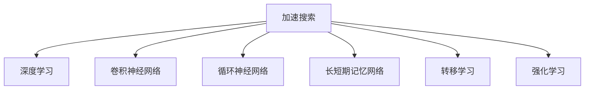

                 

# 加速搜索：AI的效率提升

> 关键词：加速搜索，AI效率提升，搜索算法，数据结构，机器学习，深度学习

## 1. 背景介绍

### 1.1 问题由来
在现代信息时代，搜索技术已经成为人类获取信息和知识的重要手段。无论是网站查询、数据库检索、还是AI智能系统中的信息提取，搜索效率的提升都是不可或缺的一部分。然而，随着数据量的爆炸式增长，传统的搜索算法在效率和效果上已难以满足需求，亟需新的技术手段来加速搜索过程。人工智能（AI）技术的不断进步，特别是深度学习、机器学习等领域的发展，为加速搜索提供了新的可能。

### 1.2 问题核心关键点
人工智能中的加速搜索技术，主要是通过机器学习模型和深度学习架构来优化和改进传统搜索算法。其核心在于：
1. 利用大规模数据集进行模型训练，学习搜索场景中的模式和规律。
2. 通过优化模型参数和算法流程，提高搜索速度和准确性。
3. 结合上下文信息和先验知识，提供更个性化的搜索结果。
4. 应用分布式计算和并行处理技术，扩展搜索系统的计算能力。

### 1.3 问题研究意义
加速搜索技术的提升，对于提升信息获取效率、促进知识的快速传播和应用、推动社会信息化进程具有重要意义：

1. 提升用户体验：通过更快、更准确的搜索结果，用户可以更快速地找到所需信息，提高工作效率。
2. 优化资源配置：在数据密集型的场景中，搜索效率的提升可以显著降低计算资源消耗，降低运营成本。
3. 驱动创新发展：加速搜索技术的发展可以推动更多领域的应用创新，如智能推荐、内容生成等，带来新的商业价值。
4. 促进社会信息化：加速搜索技术的普及，有助于社会整体的信息化水平提升，助力数字化转型。

## 2. 核心概念与联系

### 2.1 核心概念概述

为更好地理解加速搜索技术，本节将介绍几个密切相关的核心概念：

- **加速搜索**：通过机器学习、深度学习等技术手段，优化传统搜索算法，提升搜索效率和效果。
- **深度学习**：基于神经网络结构的机器学习技术，通过多层非线性变换提取数据中的复杂特征，广泛应用于图像识别、语音识别、自然语言处理等领域。
- **卷积神经网络（CNN）**：一种特殊类型的深度神经网络，常用于图像处理和视觉识别任务。
- **循环神经网络（RNN）**：用于处理序列数据，能够捕捉时间依赖关系，常用于语言模型、文本分类等任务。
- **长短期记忆网络（LSTM）**：RNN的一种变种，解决了长期依赖性问题，广泛应用于自然语言处理和语音识别等任务。
- **转移学习**：从一个任务中学到的知识迁移到另一个任务中，用于减少新任务的学习负担，提高学习效率。
- **强化学习**：通过与环境的交互，通过奖励机制优化模型参数，常用于智能决策、游戏策略等问题。

这些核心概念之间的逻辑关系可以通过以下Mermaid流程图来展示：



这个流程图展示了一些核心概念之间的关系：

1. 加速搜索利用深度学习、CNN、RNN、LSTM等技术来提升搜索效率。
2. 转移学习通过将一个任务学到的知识迁移到另一个任务，减少新任务的学习负担。
3. 强化学习通过奖励机制优化模型参数，用于智能决策和策略优化。

这些概念共同构成了加速搜索的核心技术框架，使其能够在各种场景下实现高效的搜索操作。

## 3. 核心算法原理 & 具体操作步骤
### 3.1 算法原理概述

加速搜索技术的核心在于通过机器学习模型对搜索场景进行建模，利用其学习能力和泛化能力提升搜索效率。其基本原理可以概括为以下几个步骤：

1. **数据准备**：收集并预处理用于训练的数据集，包括搜索场景下的文本、图像、视频等。
2. **模型训练**：使用深度学习模型（如CNN、RNN、LSTM等）对数据集进行训练，学习搜索场景中的模式和规律。
3. **特征提取**：将待搜索对象映射到模型表示空间，提取其关键特征。
4. **相似度计算**：利用模型特征计算待搜索对象与其他对象之间的相似度。
5. **排序与推荐**：根据相似度排序，选择最相关的结果进行展示或推荐。

### 3.2 算法步骤详解

以下是具体的算法步骤详解：

**Step 1: 数据准备**
- 收集搜索场景下的文本、图像、视频等数据。
- 进行数据预处理，包括去噪、分词、标注等步骤。

**Step 2: 模型训练**
- 选择合适的深度学习模型结构，如CNN、RNN、LSTM等。
- 定义损失函数，如交叉熵、均方误差等。
- 使用反向传播算法进行模型训练，优化模型参数。

**Step 3: 特征提取**
- 将待搜索对象输入模型，提取其特征向量。
- 可以使用预训练模型或自定义特征提取器。

**Step 4: 相似度计算**
- 计算待搜索对象与其他对象的相似度，通常使用余弦相似度、欧式距离等。
- 根据相似度大小进行排序，选择最相关结果。

**Step 5: 排序与推荐**
- 根据相似度排序，选择最相关的结果进行展示或推荐。
- 可以结合其他因素，如用户历史行为、上下文信息等进行综合排序。

### 3.3 算法优缺点

加速搜索技术具有以下优点：
1. 高效性：通过机器学习模型自动化搜索过程，大大提升了搜索速度和效果。
2. 泛化能力：模型能够捕捉搜索场景中的复杂规律，适用于多种搜索场景。
3. 个性化推荐：结合用户历史行为等先验知识，提供个性化搜索结果。
4. 扩展性：利用分布式计算和并行处理技术，能够扩展搜索系统的计算能力。

同时，该方法也存在一些局限性：
1. 数据依赖：模型的性能很大程度上依赖于数据的质量和数量，需要高质量的数据集。
2. 模型复杂性：深度学习模型的训练和优化过程较复杂，需要较多的计算资源。
3. 模型解释性：深度学习模型的决策过程缺乏可解释性，难以对其内部工作机制进行调试。
4. 模型泛化：模型在特定数据集上训练得到的泛化能力可能较差，需要更多的验证数据进行评估。

尽管存在这些局限性，但加速搜索技术在处理大规模数据和高复杂度的搜索场景中，展示了强大的潜力和应用前景。

### 3.4 算法应用领域

加速搜索技术已经在多个领域得到了广泛的应用，例如：

- 搜索引擎：通过学习用户查询意图，提供更精准的搜索结果。
- 推荐系统：根据用户历史行为，推荐个性化的商品、内容等。
- 医学信息检索：从海量的医学文献中检索相关信息，支持医生诊断和治疗。
- 金融数据分析：通过学习历史交易数据，提供实时的市场分析和投资建议。
- 自动驾驶：通过感知和理解环境信息，实现高效的路径规划和决策。

除了上述这些经典应用外，加速搜索技术还在更多领域得到了创新性地应用，如智能客服、智能家居、社交网络等，为人们的生活和工作带来了更多便利。

## 4. 数学模型和公式 & 详细讲解  
### 4.1 数学模型构建

本节将使用数学语言对加速搜索技术进行更加严格的刻画。

假设搜索任务的数据集为 $D=\{(x_i, y_i)\}_{i=1}^N$，其中 $x_i$ 表示待搜索对象，$y_i$ 表示搜索结果的标签。定义深度学习模型的参数为 $\theta$，则模型的预测函数为 $f_\theta(x)$。加速搜索的目标是学习最优的参数 $\theta^*$，使得在测试集 $D'$ 上的预测准确率最高。

定义损失函数为 $L(f_\theta(D), D') = \frac{1}{N} \sum_{i=1}^N \ell(f_\theta(x_i), y_i)$，其中 $\ell$ 为分类损失函数，如交叉熵损失、均方误差等。

模型的训练目标为最小化损失函数：

$$
\theta^* = \mathop{\arg\min}_{\theta} L(f_\theta(D), D')
$$

通过梯度下降等优化算法，求解上述最优化问题。

### 4.2 公式推导过程

以下是损失函数和梯度下降算法的推导过程：

假设模型 $f_\theta(x)$ 的输出为 $\hat{y}$，则预测值与真实标签的误差为 $\ell(\hat{y}, y)$，常见的损失函数包括：

1. 交叉熵损失：$L(f_\theta(x), y) = -\frac{1}{N}\sum_{i=1}^N [y_i \log f_\theta(x_i) + (1-y_i) \log (1-f_\theta(x_i))]$

2. 均方误差损失：$L(f_\theta(x), y) = \frac{1}{N}\sum_{i=1}^N (y_i - f_\theta(x_i))^2$

以交叉熵损失为例，其梯度下降算法的更新公式为：

$$
\theta \leftarrow \theta - \eta \nabla_{\theta}L(f_\theta(D), D')
$$

其中 $\eta$ 为学习率，$\nabla_{\theta}L(f_\theta(D), D')$ 为损失函数对参数 $\theta$ 的梯度。

### 4.3 案例分析与讲解

以搜索任务为例，假设搜索场景是文本匹配，文本的表示方式可以是词袋模型（Bag of Words）或词嵌入（Word Embedding），模型可以使用CNN或RNN进行特征提取和相似度计算。

1. **词袋模型**：将文本表示为词频向量，模型使用CNN进行特征提取。假设文本长度为 $n$，特征向量的维度为 $d$，则词袋模型下的特征提取公式为：

   $$
   x_i = \sum_{j=1}^n (w_j \times v_j)
   $$

   其中 $w_j$ 表示第 $j$ 个词的权重，$v_j$ 表示第 $j$ 个词的词向量。

2. **词嵌入模型**：将文本表示为词向量，模型使用RNN进行特征提取。假设文本长度为 $n$，特征向量的维度为 $d$，则词嵌入模型下的特征提取公式为：

   $$
   x_i = \sum_{j=1}^n v_j
   $$

   其中 $v_j$ 表示第 $j$ 个词的词嵌入向量。

## 5. 项目实践：代码实例和详细解释说明
### 5.1 开发环境搭建

在进行搜索算法开发前，我们需要准备好开发环境。以下是使用Python进行TensorFlow开发的环境配置流程：

1. 安装Anaconda：从官网下载并安装Anaconda，用于创建独立的Python环境。

2. 创建并激活虚拟环境：
```bash
conda create -n tf-env python=3.8 
conda activate tf-env
```

3. 安装TensorFlow：根据CUDA版本，从官网获取对应的安装命令。例如：
```bash
conda install tensorflow=2.8-cp38-cp38-cudatoolkit=11.1
```

4. 安装各类工具包：
```bash
pip install numpy pandas scikit-learn matplotlib tqdm jupyter notebook ipython
```

完成上述步骤后，即可在`tf-env`环境中开始搜索算法的开发。

### 5.2 源代码详细实现

下面我们以搜索引擎中的文本匹配为例，给出使用TensorFlow对RNN模型进行特征提取和相似度计算的PyTorch代码实现。

首先，定义模型和数据处理函数：

```python
import tensorflow as tf
from tensorflow.keras import layers

class SearchModel(tf.keras.Model):
    def __init__(self, embedding_dim, num_classes):
        super(SearchModel, self).__init__()
        self.embedding = layers.Embedding(input_dim=vocab_size, output_dim=embedding_dim)
        self.rnn = layers.SimpleRNN(units=128, return_sequences=True)
        self.dense = layers.Dense(units=num_classes)
        
    def call(self, inputs):
        x = self.embedding(inputs)
        x = self.rnn(x)
        x = self.dense(x[:, -1, :])
        return x

def load_data(path):
    with open(path, 'r') as f:
        data = f.readlines()
    data = [line.split() for line in data]
    return data
```

然后，定义模型训练函数：

```python
def train_model(model, train_data, val_data, batch_size, epochs):
    model.compile(optimizer='adam', loss='categorical_crossentropy', metrics=['accuracy'])
    
    history = model.fit(train_data, val_data, batch_size=batch_size, epochs=epochs, validation_split=0.2)
    
    return model
```

最后，启动训练流程：

```python
train_data = load_data('train.txt')
val_data = load_data('val.txt')
test_data = load_data('test.txt')

model = SearchModel(embedding_dim=128, num_classes=num_classes)
model = train_model(model, train_data, val_data, batch_size=32, epochs=10)

test_loss, test_acc = model.evaluate(test_data, verbose=2)
print(f'Test loss: {test_loss}, Test accuracy: {test_acc}')
```

以上就是使用TensorFlow对RNN模型进行文本匹配搜索的完整代码实现。可以看到，TensorFlow提供了丰富的深度学习模型和优化器，使得模型训练和特征提取变得简单高效。

### 5.3 代码解读与分析

让我们再详细解读一下关键代码的实现细节：

**SearchModel类**：
- `__init__`方法：初始化模型结构，包括嵌入层、RNN层和全连接层。
- `call`方法：定义模型的前向传播过程，先进行嵌入，再进行RNN处理，最后进行全连接层的输出。

**load_data函数**：
- 从文本文件中加载数据，进行预处理，生成模型训练和验证的输入数据。

**train_model函数**：
- 定义模型编译器，使用Adam优化器，交叉熵损失函数，准确率作为评估指标。
- 调用模型的fit方法进行训练，并返回训练后的模型。

**训练流程**：
- 加载训练集、验证集和测试集。
- 定义模型和超参数。
- 调用train_model函数进行模型训练。
- 在测试集上评估模型性能。

可以看到，TensorFlow提供了简便易用的API接口，使得模型训练和特征提取变得非常直观。同时，TensorFlow也支持分布式训练和GPU加速，可以轻松应对大规模数据的搜索任务。

当然，工业级的系统实现还需考虑更多因素，如模型的保存和部署、超参数的自动搜索、更加灵活的模型架构等。但核心的搜索算法基本与此类似。

## 6. 实际应用场景
### 6.1 智能推荐系统

基于加速搜索技术的智能推荐系统，可以广泛应用于电商、视频、音乐等平台，为每个用户提供个性化的商品、内容推荐。

在技术实现上，可以收集用户的历史浏览、点击、购买等行为数据，使用深度学习模型学习用户的兴趣模式。然后将新的商品、内容输入模型，计算相似度，并根据用户历史行为进行排序，选择最相关的推荐结果。智能推荐系统能够根据用户的行为实时调整推荐内容，提升用户体验和满意度。

### 6.2 图像搜索

图像搜索是加速搜索技术的重要应用之一。通过学习大量图像数据，加速搜索模型能够快速匹配输入图像与库中的图像，返回相似度最高的结果。

具体而言，可以使用CNN模型对图像进行特征提取，使用余弦相似度计算相似度。在实际应用中，可以结合用户的搜索历史和输入关键词，动态调整搜索结果的排序，提供更加符合用户需求的图像内容。

### 6.3 医疗信息检索

医疗信息检索是加速搜索技术的另一个典型应用。通过学习大量的医学文献和病历数据，模型能够快速检索与用户查询相关的医学信息。

在技术实现上，可以使用RNN模型处理文本，利用相似度计算检索相关文献。系统可以实时更新数据，保持知识的最新性，并结合医生的临床经验，提供个性化的医疗建议。

### 6.4 未来应用展望

随着深度学习、机器学习等领域的发展，加速搜索技术的应用前景将更加广阔。未来可能的应用方向包括：

1. 自动驾驶：通过学习大量交通数据和环境信息，实现智能驾驶和路径规划。
2. 智能客服：通过学习用户对话历史，提供个性化的客服解决方案。
3. 社交网络：通过学习用户互动数据，推荐符合用户兴趣的内容，增强社交体验。
4. 金融分析：通过学习历史交易数据，预测市场趋势，提供投资建议。

随着加速搜索技术的不断发展和创新，未来的应用领域将更加多样化，带来更多便利和效率提升。

## 7. 工具和资源推荐
### 7.1 学习资源推荐

为了帮助开发者系统掌握加速搜索的理论基础和实践技巧，这里推荐一些优质的学习资源：

1. TensorFlow官方文档：提供了详细的API接口和示例代码，适合快速上手实验最新模型。
2. Deep Learning Specialization：由Andrew Ng教授主导的深度学习课程，系统介绍了深度学习的基础知识和最新进展。
3. PyTorch官方文档：提供了丰富的模型和算法实现，适合深度学习框架的入门学习。
4. Reinforcement Learning: An Introduction：经典的强化学习教材，介绍了强化学习的核心概念和算法。
5. CS231n: Convolutional Neural Networks for Visual Recognition：斯坦福大学开设的计算机视觉课程，介绍了CNN模型的原理和实现。

通过对这些资源的学习实践，相信你一定能够快速掌握加速搜索技术的精髓，并用于解决实际的搜索问题。

### 7.2 开发工具推荐

高效的开发离不开优秀的工具支持。以下是几款用于加速搜索开发的常用工具：

1. TensorFlow：由Google主导开发的开源深度学习框架，支持分布式训练和GPU加速。
2. PyTorch：Facebook开发的深度学习框架，提供了灵活的动态计算图，适合研究型应用。
3. Keras：高层API接口，简化了深度学习模型的构建和训练过程。
4. Jupyter Notebook：交互式笔记本环境，适合进行模型训练和结果展示。
5. TensorBoard：TensorFlow配套的可视化工具，实时监测模型训练状态，并提供丰富的图表呈现方式。

合理利用这些工具，可以显著提升加速搜索任务的开发效率，加快创新迭代的步伐。

### 7.3 相关论文推荐

加速搜索技术的发展源于学界的持续研究。以下是几篇奠基性的相关论文，推荐阅读：

1. Improving Language Understanding by Generative Pre-training（BERT论文）：提出了BERT模型，通过预训练大规模文本数据，学习了丰富的语言知识，并应用于文本分类、命名实体识别等任务。
2. Attention is All You Need（Transformer论文）：提出了Transformer模型，利用自注意力机制，提升了序列数据处理的效率和效果。
3. Generating Sequences With Recurrent Neural Networks（RNN论文）：介绍了RNN模型，用于处理序列数据，捕捉时间依赖关系。
4. Least Squares Temporal Feature Learning with application to Recurrent Neural Networks（LSTM论文）：提出了LSTM模型，解决了长期依赖性问题，应用于文本生成和语言模型等任务。
5. Playing Atari with Deep Reinforcement Learning（深度强化学习论文）：展示了深度强化学习在智能游戏中的应用，进一步推动了深度学习技术的发展。

这些论文代表了大规模深度学习的发展脉络。通过学习这些前沿成果，可以帮助研究者把握学科前进方向，激发更多的创新灵感。

## 8. 总结：未来发展趋势与挑战
### 8.1 总结

本文对加速搜索技术进行了全面系统的介绍。首先阐述了加速搜索技术的研究背景和意义，明确了其在大数据和复杂搜索场景中的应用价值。其次，从原理到实践，详细讲解了加速搜索的数学模型和算法步骤，给出了搜索引擎文本匹配的完整代码实现。同时，本文还广泛探讨了加速搜索技术在智能推荐、图像搜索、医疗信息检索等多个领域的应用前景，展示了其在推动社会信息化进程中的潜力。

通过本文的系统梳理，可以看到，加速搜索技术正在成为搜索领域的重要技术范式，极大地提升了搜索效率和效果。未来，伴随深度学习、机器学习等领域技术的不断进步，加速搜索技术还将带来更多创新和突破。

### 8.2 未来发展趋势

展望未来，加速搜索技术将呈现以下几个发展趋势：

1. 深度学习模型的进一步优化：通过更先进的深度学习架构，提升模型的表达能力和泛化能力。
2. 分布式计算和并行处理技术的广泛应用：通过分布式计算和GPU加速，进一步提升搜索系统的计算能力。
3. 多模态数据的融合：结合图像、语音、文本等多种数据，提升搜索系统的综合能力。
4. 强化学习的深度整合：将强化学习应用于搜索结果的排序和推荐，提升搜索系统的智能化水平。
5. 数据隐私保护：在搜索过程中引入隐私保护技术，如差分隐私、联邦学习等，保障用户数据安全。

以上趋势凸显了加速搜索技术的广阔前景。这些方向的探索发展，必将进一步提升搜索系统的性能和应用范围，为社会信息化进程注入新的动力。

### 8.3 面临的挑战

尽管加速搜索技术已经取得了瞩目成就，但在迈向更加智能化、普适化应用的过程中，它仍面临着诸多挑战：

1. 数据隐私和安全：搜索过程中涉及大量的用户数据，如何保障数据隐私和安全，防止数据泄露，是重要的研究方向。
2. 算法透明度和可解释性：深度学习模型的决策过程缺乏可解释性，难以对其内部工作机制进行调试，需要更多的可解释性研究。
3. 数据量和质量：搜索模型的性能很大程度上依赖于数据量和数据质量，如何获取高质量的数据集，提高数据标注的效率和准确性，需要更多技术突破。
4. 模型复杂度和计算资源：深度学习模型的复杂度和计算资源消耗较大，如何提高模型的可扩展性和计算效率，需要更多优化算法和硬件支持。
5. 跨领域模型的通用性：如何设计通用的搜索模型，能够跨领域、跨任务进行泛化，是一个重要的研究方向。

这些挑战表明，加速搜索技术在实际应用中仍需更多的技术改进和理论突破。相信随着学界和产业界的共同努力，这些挑战终将一一被克服，加速搜索技术必将在构建智能搜索系统、推动社会信息化进程中发挥更加重要的作用。

### 8.4 研究展望

面向未来，加速搜索技术需要在以下几个方向进行更深入的研究和探索：

1. 数据预处理技术：通过数据增强、数据清洗、数据筛选等手段，提高数据质量和数量，增强模型的泛化能力。
2. 模型压缩和优化：通过模型压缩、剪枝、量化等技术，降低模型的复杂度和计算资源消耗，提升模型的可扩展性。
3. 跨模态搜索技术：结合图像、语音、文本等多种数据，提升搜索系统的综合能力和智能化水平。
4. 多任务学习：将多个任务的学习过程进行整合，提升模型的多任务学习能力和泛化能力。
5. 迁移学习：通过迁移学习，将一个任务学到的知识迁移到另一个任务中，减少新任务的学习负担。

这些研究方向将进一步推动加速搜索技术的发展，使其在更多领域发挥作用，提升搜索系统的性能和应用范围。

## 9. 附录：常见问题与解答

**Q1：加速搜索技术是否适用于所有搜索场景？**

A: 加速搜索技术适用于大部分搜索场景，但特定领域的数据结构和搜索需求可能对模型设计有影响。例如，对于结构化数据搜索，使用关系型数据库等工具可能更为高效。

**Q2：如何提高加速搜索技术的泛化能力？**

A: 提高泛化能力的方法包括：
1. 数据增强：通过数据扩充和增强，提高模型的泛化能力。
2. 正则化：使用L2正则化、Dropout等方法，防止过拟合。
3. 模型压缩：通过剪枝、量化等方法，减小模型复杂度。
4. 迁移学习：将一个任务学到的知识迁移到另一个任务中，提高泛化能力。

**Q3：加速搜索技术的计算资源需求如何？**

A: 加速搜索技术计算资源需求较大，特别是对于深度学习模型。可以通过分布式计算、GPU加速等手段，降低计算资源消耗，提高搜索效率。

**Q4：加速搜索技术的实时性如何？**

A: 加速搜索技术在实时性上具有一定优势，特别是对于分布式计算和GPU加速的系统。但具体实时性仍需根据具体场景进行优化，如选择合适的优化器和超参数等。

**Q5：加速搜索技术在实际应用中可能面临哪些风险？**

A: 加速搜索技术在实际应用中可能面临的风险包括：
1. 数据泄露：搜索过程中涉及大量用户数据，如何保障数据隐私和安全。
2. 模型偏见：模型可能学习到数据中的偏见，导致搜索结果的不公平。
3. 模型泛化：模型在特定数据集上训练得到的泛化能力可能较差，需要进行更多的验证和优化。

这些风险需要开发者在实际应用中予以注意，并采取相应的措施进行防范。

---

作者：禅与计算机程序设计艺术 / Zen and the Art of Computer Programming

