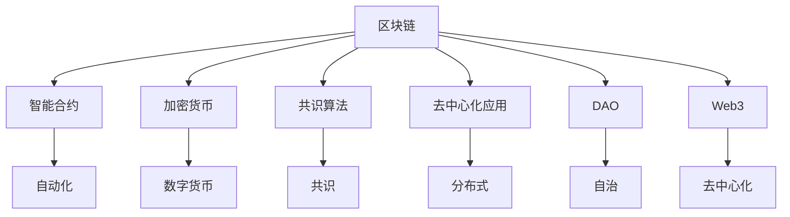

                 

# 区块链技术：程序员的新财富机遇

> 关键词：区块链,智能合约,共识算法,挖矿,加密货币,DeFi,DAO,Web3

## 1. 背景介绍

### 1.1 问题由来
区块链技术自2008年诞生以来，经历了十余年的发展，已经成为互联网领域的新型基础设施。从比特币到以太坊，再到数千种基于区块链的DApp和应用，区块链以其去中心化、透明、不可篡改等特点，被视为未来互联网的革命性技术。然而，尽管区块链技术已经取得了显著进展，但在实际应用场景中仍面临诸多挑战和瓶颈，阻碍了其广泛落地。

这些问题主要包括：
1. **性能瓶颈**：区块链网络处理交易和数据的效率较低，难以应对大规模的商业应用需求。
2. **费用高昂**：由于共识机制的复杂性，区块链网络上的交易费用较高，限制了其在实际应用中的广泛采用。
3. **技术复杂**：区块链技术的底层机制复杂，对开发者的技术要求较高，普及门槛较高。
4. **法律和合规问题**：区块链技术的去中心化特性，使得监管和合规难度增加。

为了解决这些问题，区块链社区不断探索和创新。程序员作为区块链技术的核心力量，不仅需要掌握区块链的技术原理，还需要了解其应用场景，探索新的商业模式，为区块链技术的普及和应用做出贡献。

### 1.2 问题核心关键点
区块链技术的应用范围广泛，涵盖了金融、供应链、物联网、医疗等多个领域。程序员可以通过多种方式参与区块链技术的开发和应用，包括但不限于以下方面：
1. **智能合约开发**：智能合约是区块链的核心应用之一，用于自动化执行预设的业务逻辑。程序员需要熟悉Solidity等编程语言，开发智能合约，实现自动化交易和业务逻辑。
2. **共识机制优化**：共识机制是区块链网络的核心算法，程序员可以通过研究新的共识算法，提高区块链网络的性能和安全性。
3. **去中心化应用开发**：DApp是区块链技术的重要应用形式，程序员可以通过开发DApp，实现去中心化的应用和服务。
4. **加密货币开发**：程序员可以参与加密货币的设计和开发，为区块链网络提供新的货币和激励机制。
5. **DAO和治理系统开发**：DAO是区块链治理的新形式，程序员可以参与DAO的开发，实现社区自治和治理。
6. **Web3技术栈开发**：Web3技术栈是区块链技术的重要组成部分，程序员可以开发Web3浏览器、钱包、应用等，推动Web3的发展。

这些关键点反映了区块链技术的广泛应用和程序员的参与方式。通过对这些关键点的深入理解，程序员可以更好地把握区块链技术的潜力，探索新的商业模式和技术方向。

## 2. 核心概念与联系

### 2.1 核心概念概述

为了更好地理解区块链技术的核心概念和应用，本节将介绍几个关键概念：

- **区块链(Blockchain)**：一种分布式账本技术，通过加密和共识算法，保证数据的安全和透明。
- **共识算法(Consensus Algorithm)**：用于区块链网络中达成一致的机制，如PoW、PoS、DPoS等。
- **智能合约(Smart Contract)**：在区块链网络上自动执行预设业务逻辑的程序，具有自动化的特点。
- **加密货币(CryptoCurrency)**：基于区块链技术的数字货币，如比特币、以太坊等。
- **去中心化应用(DApp, Decentralized Application)**：基于区块链技术的分布式应用，提供去中心化的服务。
- **DAO(Decentralized Autonomous Organization)**：去中心化的自治组织，通过智能合约实现社区自治和治理。
- **Web3**：基于区块链技术的互联网新形态，强调数据、应用和身份的去中心化。

这些核心概念之间的逻辑关系可以通过以下Mermaid流程图来展示：



这个流程图展示了大语言模型的核心概念及其之间的关系：

1. 区块链是分布式账本技术，通过加密和共识算法保证数据的安全和透明。
2. 共识算法用于区块链网络中达成一致，智能合约用于自动化执行预设的业务逻辑。
3. 加密货币是基于区块链技术的数字货币，提供了新的货币和激励机制。
4. 去中心化应用是区块链技术的重要应用形式，提供去中心化的服务。
5. DAO是去中心化的自治组织，通过智能合约实现社区自治和治理。
6. Web3是基于区块链技术的互联网新形态，强调数据、应用和身份的去中心化。

这些核心概念共同构成了区块链技术的核心框架，使得区块链技术在各个领域得到广泛应用。

## 3. 核心算法原理 & 具体操作步骤
### 3.1 算法原理概述

区块链技术的核心在于其去中心化、透明和不可篡改的特性。这种特性是通过共识算法和加密技术实现的。以下是对区块链算法原理的概述：

- **共识算法(Consensus Algorithm)**：用于区块链网络中达成一致的机制。常见的共识算法包括PoW、PoS、DPoS等。共识算法决定了网络中各个节点的权利和责任，确保网络的安全和稳定。
- **加密技术(Cryptography)**：用于保护区块链数据的安全性和完整性。区块链上的所有交易和数据都通过哈希函数进行加密，确保数据的不可篡改性。
- **智能合约(Smart Contract)**：基于区块链技术的自动化执行程序，用于实现预设的业务逻辑。智能合约的执行不受人为干预，确保了交易的透明和可信任。
- **去中心化应用(DApp, Decentralized Application)**：基于区块链技术的分布式应用，提供去中心化的服务。DApp通过区块链网络进行数据存储和传输，确保了数据的安全和隐私。
- **DAO(Decentralized Autonomous Organization)**：基于区块链技术的自治组织，通过智能合约实现社区自治和治理。DAO提供了更加民主、透明的治理机制，提高了社区自治的效率和公平性。
- **Web3**：基于区块链技术的互联网新形态，强调数据、应用和身份的去中心化。Web3通过区块链技术实现去中心化的应用和服务，提供了更加开放、自由的互联网生态。

### 3.2 算法步骤详解

区块链技术的核心步骤包括以下几个方面：

1. **创建区块链网络**：使用共识算法和加密技术创建区块链网络，定义网络规则和节点角色。
2. **设计智能合约**：根据业务需求，设计智能合约的逻辑和功能，编写智能合约代码。
3. **部署智能合约**：将智能合约部署到区块链网络中，自动执行预设的业务逻辑。
4. **执行交易和数据**：通过区块链网络进行数据存储和传输，确保数据的安全和透明。
5. **治理和优化**：通过DAO或社区治理机制，对区块链网络进行治理和优化，确保网络的稳定和高效。

下面以智能合约的部署为例，给出详细的具体操作步骤：

**Step 1: 创建智能合约账户**
- 使用区块链网络的钱包创建智能合约账户。

**Step 2: 编写智能合约代码**
- 编写智能合约的代码，使用Solidity等编程语言，实现预设的业务逻辑。
- 例如，以下是一个简单的智能合约，用于记录和管理数字货币的余额：

```solidity
pragma solidity ^0.8.0;

contract MyToken {
    uint256 public balance;
    event Transfer(uint256 from, uint256 to, uint256 value);
    
    function transfer(address payable recipient, uint256 amount) public payable {
        require(recipient != address(0));
        require(amount > 0);
        balance -= amount;
        recipient.balance += amount;
        emit Transfer(address(this), address(recipient), amount);
    }
}
```

**Step 3: 部署智能合约**
- 将智能合约代码上传到区块链网络，使用部署工具进行合约部署。
- 例如，使用Remix IDE部署智能合约，操作如下：

1. 打开Remix IDE，创建新项目。
2. 在项目中创建智能合约文件，编写上述代码。
3. 在控制台中执行部署命令，将智能合约部署到区块链网络中。

**Step 4: 执行智能合约**
- 使用区块链网络的钱包调用智能合约的方法，执行预设的业务逻辑。
- 例如，以下是一个简单的交易示例：

1. 打开Remix IDE，打开智能合约项目。
2. 在控制台中调用智能合约的`transfer`方法，将数字货币从地址A转移到地址B。
3. 通过智能合约的事件日志，验证交易的执行情况。

### 3.3 算法优缺点

区块链技术在应用中具有以下优点：
1. **去中心化**：区块链网络没有中心化的控制点，提高了数据的安全和隐私。
2. **透明**：所有交易和数据都公开透明，便于监督和审计。
3. **不可篡改**：区块链上的数据一旦被记录，无法篡改，确保了数据的完整性。
4. **智能合约**：自动化执行预设的业务逻辑，提高了交易的效率和可靠性。

但区块链技术也存在一些缺点：
1. **性能瓶颈**：区块链网络的交易和数据处理效率较低，难以应对大规模的商业应用需求。
2. **费用高昂**：区块链网络的交易费用较高，限制了其在实际应用中的广泛采用。
3. **技术复杂**：区块链技术的底层机制复杂，对开发者的技术要求较高，普及门槛较高。
4. **法律和合规问题**：区块链技术的去中心化特性，使得监管和合规难度增加。

尽管存在这些局限性，但区块链技术的去中心化、透明和不可篡改的特性，使其在金融、供应链、物联网、医疗等多个领域具有广阔的应用前景。

### 3.4 算法应用领域

区块链技术在多个领域具有广泛的应用，包括但不限于以下方面：

1. **金融行业**：区块链技术被用于数字货币发行、交易、结算等环节，提高了交易的效率和安全性。
2. **供应链管理**：区块链技术用于供应链的溯源、跟踪和追溯，提高了供应链的透明度和可追溯性。
3. **物联网**：区块链技术用于物联网设备的身份认证、数据安全和追溯，提高了物联网设备的安全性和可靠性。
4. **医疗健康**：区块链技术用于医疗数据的共享、交换和存储，提高了医疗数据的安全性和可访问性。
5. **版权保护**：区块链技术用于版权的记录、管理和保护，提高了版权的追溯和维权能力。
6. **身份认证**：区块链技术用于身份的认证和验证，提高了身份验证的可靠性和安全性。

这些应用领域展示了区块链技术的广泛潜力和应用前景，程序员可以基于自己的技术背景和兴趣，选择适合自己的应用方向，为区块链技术的发展做出贡献。

## 4. 数学模型和公式 & 详细讲解  
### 4.1 数学模型构建

区块链技术的数学模型主要涉及以下几个方面：

1. **哈希函数(Hash Function)**：用于保护数据的安全性和完整性。
2. **加密算法(Cryptography)**：用于保护数据的安全性。
3. **共识算法(Consensus Algorithm)**：用于区块链网络中达成一致的机制。

以下是对这些数学模型的详细讲解：

**哈希函数(Hash Function)**
哈希函数是将任意长度的输入数据，通过加密算法转换成固定长度哈希值的过程。常见的哈希算法包括SHA-256、SHA-3等。哈希函数具有以下特点：
- 不可逆性：无法通过哈希值反推输入数据。
- 单向性：只能通过输入数据计算哈希值，无法通过哈希值计算输入数据。
- 抗碰撞性：对于不同的输入数据，哈希值具有唯一性，难以通过碰撞算法得到相同的哈希值。

哈希函数在区块链技术中用于保证数据的完整性和不可篡改性。例如，在区块链网络中，每个区块都包含前一个区块的哈希值，确保了数据的链式结构。

**加密算法(Cryptography)**
加密算法是将数据通过加密算法转换成加密数据的过程。常见的加密算法包括对称加密算法（如AES）、非对称加密算法（如RSA）等。加密算法具有以下特点：
- 对称性：使用相同的密钥加密和解密数据。
- 非对称性：使用公钥加密数据，使用私钥解密数据。
- 安全性：通过密钥管理和公钥认证，提高数据的安全性。

加密算法在区块链技术中用于保护数据的隐私和安全。例如，在区块链网络中，所有交易和数据都通过哈希函数进行加密，确保数据的不可篡改性。

**共识算法(Consensus Algorithm)**
共识算法是区块链网络中用于达成一致的机制。常见的共识算法包括PoW、PoS、DPoS等。共识算法具有以下特点：
- 去中心化：没有中心化的控制点，网络中的各个节点都有权利参与共识。
- 安全性和可靠性：共识算法通过多数节点的共识，保证网络的稳定和可靠。
- 分布式：节点之间通过网络进行通信和交互，确保网络的安全和透明。

共识算法在区块链技术中用于保证网络的安全和稳定。例如，在比特币网络中，使用PoW共识算法，每个节点通过计算哈希值和证明（Proof of Work）获得区块的奖励，确保网络的安全和稳定。

### 4.2 公式推导过程

以下是对区块链技术的几个关键公式的推导过程：

**哈希函数(Hash Function)**
哈希函数可以将任意长度的输入数据，通过加密算法转换成固定长度的哈希值。假设输入数据为$M$，哈希函数为$H$，则哈希值的计算公式为：

$$
H(M) = \text{hash}(M)
$$

其中，$\text{hash}$表示哈希函数的具体实现。

**加密算法(Cryptography)**
加密算法可以将数据通过加密算法转换成加密数据。假设输入数据为$M$，加密算法为$E$，公钥为$K_{pub}$，私钥为$K_{priv}$，则加密过程的公式为：

$$
C = E(K_{pub}, M)
$$

其中，$C$表示加密后的数据，$E$表示加密算法。解密过程的公式为：

$$
M = D(K_{priv}, C)
$$

其中，$D$表示解密算法。

**共识算法(Consensus Algorithm)**
共识算法是区块链网络中用于达成一致的机制。假设共识算法为$C$，网络中的节点数量为$N$，共识过程的公式为：

$$
C^* = C(N, C^*, T)
$$

其中，$C^*$表示共识结果，$T$表示当前的交易数据。

以上公式展示了区块链技术的核心数学模型，程序员可以基于这些数学模型，深入理解区块链技术的原理和实现。

## 5. 项目实践：代码实例和详细解释说明
### 5.1 开发环境搭建

在进行区块链技术开发前，需要先搭建好开发环境。以下是使用Python进行Solidity开发的环境配置流程：

1. 安装Solidity编译器：从官网下载并安装Solidity编译器。
2. 安装Metamask：从官网下载并安装Metamask钱包，用于测试智能合约的部署和调用。
3. 创建Ropsten测试网账户：在Ropsten测试网上创建账户，用于测试智能合约的部署和调用。
4. 创建Remix IDE账户：在Remix IDE上创建账户，用于编写和测试智能合约。

完成上述步骤后，即可在开发环境中进行区块链技术的开发和测试。

### 5.2 源代码详细实现

下面我们以数字货币钱包为例，给出使用Solidity编写智能合约的PyTorch代码实现。

首先，定义智能合约账户的函数：

```solidity
pragma solidity ^0.8.0;

contract MyWallet {
    uint256 public balance;
    
    function initialize() public {
        balance = 0;
    }
    
    function transfer(address payable recipient, uint256 amount) public payable {
        require(recipient != address(0));
        require(amount > 0);
        balance -= amount;
        recipient.balance += amount;
    }
}
```

然后，在Metamask钱包中进行测试：

1. 打开Metamask钱包，连接到Ropsten测试网。
2. 部署智能合约：在Metamask钱包中，选择智能合约，上传上述代码，进行合约部署。
3. 测试智能合约：在Metamask钱包中，选择智能合约，调用`transfer`方法，进行数字货币的转账操作。

### 5.3 代码解读与分析

让我们再详细解读一下关键代码的实现细节：

**MyWallet智能合约**：
- `initialize`方法：初始化数字货币的余额，设置为0。
- `transfer`方法：实现数字货币的转账操作，将当前账户的数字货币转移到目标账户，同时更新余额。

**MyWallet测试**：
- 在Metamask钱包中，部署智能合约，确保合约成功部署。
- 调用`transfer`方法，进行数字货币的转账操作，验证转账的执行情况。

## 6. 实际应用场景
### 6.1 智能合约

智能合约是区块链技术的重要应用形式，程序员可以开发各类智能合约，实现自动化的业务逻辑。以下是几个典型的智能合约应用场景：

1. **数字货币钱包**：程序员可以开发数字货币钱包，实现数字货币的存储和转账功能。
2. **自动化交易**：程序员可以开发自动化交易系统，实现股票、期货等金融产品的自动交易。
3. **供应链管理**：程序员可以开发供应链管理智能合约，实现供应链的溯源、跟踪和追溯功能。
4. **保险理赔**：程序员可以开发保险理赔智能合约，实现保险理赔的自动化处理。
5. **版权保护**：程序员可以开发版权保护智能合约，实现版权的记录、管理和保护功能。

这些应用场景展示了智能合约的广泛潜力和应用前景，程序员可以基于自己的技术背景和兴趣，选择适合自己的应用方向，为区块链技术的发展做出贡献。

### 6.2 加密货币

加密货币是基于区块链技术的数字货币，程序员可以参与加密货币的设计和开发，为区块链网络提供新的货币和激励机制。以下是几个典型的加密货币应用场景：

1. **比特币**：程序员可以参与比特币的设计和开发，为比特币网络提供新的激励机制。
2. **以太坊**：程序员可以参与以太坊的设计和开发，为以太坊网络提供新的智能合约和应用。
3. **加密货币交易所**：程序员可以开发加密货币交易所，提供加密货币的交易和兑换服务。

这些应用场景展示了加密货币的广泛潜力和应用前景，程序员可以基于自己的技术背景和兴趣，选择适合自己的应用方向，为区块链技术的发展做出贡献。

### 6.3 去中心化应用

去中心化应用是区块链技术的重要应用形式，程序员可以开发各类去中心化应用，提供去中心化的服务。以下是几个典型的去中心化应用场景：

1. **去中心化金融(DeFi)**：程序员可以开发DeFi应用，实现去中心化的金融服务，如借贷、交易、保险等。
2. **去中心化存储(DAO)**：程序员可以开发DAO应用，实现去中心化的数据存储和共享功能。
3. **去中心化身份(Web3)**：程序员可以开发Web3应用，实现去中心化的身份认证和验证功能。

这些应用场景展示了去中心化应用的广泛潜力和应用前景，程序员可以基于自己的技术背景和兴趣，选择适合自己的应用方向，为区块链技术的发展做出贡献。

## 7. 工具和资源推荐
### 7.1 学习资源推荐

为了帮助程序员掌握区块链技术的理论基础和实践技巧，这里推荐一些优质的学习资源：

1. 《区块链技术原理与应用》书籍：详细介绍了区块链技术的基本原理和应用场景。
2. 《以太坊智能合约编程》书籍：介绍了以太坊智能合约的开发和部署方法。
3. 《比特币白皮书》原文：比特币网络的核心设计文档，详细介绍了比特币的原理和实现。
4. 《Web3技术栈》网站：提供了Web3技术的全面介绍和实践指南。
5. 《区块链开发者指南》网站：提供了区块链技术的全面介绍和实践指南。

通过对这些资源的学习实践，相信程序员可以更好地掌握区块链技术的潜力，探索新的商业模式和技术方向。

### 7.2 开发工具推荐

高效的开发离不开优秀的工具支持。以下是几款用于区块链技术开发的常用工具：

1. Solidity编译器：用于编写和测试Solidity智能合约。
2. Metamask钱包：用于测试智能合约的部署和调用。
3. Remix IDE：用于编写和测试Solidity智能合约。
4. Web3.js：用于开发Web3应用的前端库。
5. Truffle框架：用于编写和测试以太坊智能合约的开发框架。

合理利用这些工具，可以显著提升区块链技术的开发效率，加快创新迭代的步伐。

### 7.3 相关论文推荐

区块链技术的发展源于学界的持续研究。以下是几篇奠基性的相关论文，推荐阅读：

1. 《比特币白皮书》：比特币网络的核心设计文档，详细介绍了比特币的原理和实现。
2. 《以太坊白皮书》：以太坊网络的核心设计文档，详细介绍了以太坊的原理和实现。
3. 《共识算法研究综述》：总结了常见的共识算法，如PoW、PoS、DPoS等。
4. 《智能合约安全研究》：介绍了智能合约的安全性和攻击方法，提供了智能合约开发的指导。
5. 《Web3技术栈研究》：介绍了Web3技术的核心组件和实现方法，提供了Web3开发的指导。

这些论文代表了大语言模型微调技术的发展脉络。通过学习这些前沿成果，可以帮助程序员把握区块链技术的方向，激发更多的创新灵感。

## 8. 总结：未来发展趋势与挑战

### 8.1 总结

本文对区块链技术的核心概念和应用进行了全面系统的介绍。首先阐述了区块链技术的背景和意义，明确了智能合约、共识算法、加密货币等关键概念的原理和应用。其次，从原理到实践，详细讲解了区块链技术的核心算法和具体操作步骤，给出了区块链技术开发的完整代码实例。同时，本文还广泛探讨了区块链技术在智能合约、加密货币、去中心化应用等多个领域的应用前景，展示了区块链技术的广阔潜力。最后，本文精选了区块链技术的各类学习资源，力求为程序员提供全方位的技术指引。

通过本文的系统梳理，可以看到，区块链技术已经成为互联网领域的新型基础设施，程序员可以基于自己的技术背景和兴趣，探索新的商业模式和技术方向，为区块链技术的普及和应用做出贡献。

### 8.2 未来发展趋势

展望未来，区块链技术将在更多领域得到应用，为各行各业带来变革性影响。以下是区块链技术未来的发展趋势：

1. **性能提升**：随着共识算法和网络架构的优化，区块链网络的性能将进一步提升，支持更大规模的商业应用。
2. **安全性增强**：通过智能合约和共识算法的设计优化，区块链网络的安全性将进一步增强，降低黑客攻击的风险。
3. **跨链互操作**：跨链技术将实现不同区块链网络之间的互操作，促进区块链网络之间的数据共享和协作。
4. **去中心化身份**：基于区块链技术的去中心化身份认证系统，将提高身份认证的可靠性和安全性。
5. **DeFi生态系统**：基于区块链技术的去中心化金融系统，将为金融领域带来革命性变革，提供更加高效、透明、安全的金融服务。
6. **Web3应用普及**：基于区块链技术的Web3应用将进一步普及，推动互联网的去中心化发展。

这些趋势凸显了区块链技术的广阔前景，程序员可以基于自己的技术背景和兴趣，选择适合自己的应用方向，为区块链技术的发展做出贡献。

### 8.3 面临的挑战

尽管区块链技术已经取得了显著进展，但在迈向更加智能化、普适化应用的过程中，仍面临诸多挑战：

1. **性能瓶颈**：区块链网络的交易和数据处理效率较低，难以应对大规模的商业应用需求。
2. **费用高昂**：区块链网络的交易费用较高，限制了其在实际应用中的广泛采用。
3. **技术复杂**：区块链技术的底层机制复杂，对开发者的技术要求较高，普及门槛较高。
4. **法律和合规问题**：区块链技术的去中心化特性，使得监管和合规难度增加。
5. **安全性问题**：区块链网络的安全性和隐私保护仍然存在挑战，需要进一步提升。

尽管存在这些挑战，但区块链技术的去中心化、透明和不可篡改的特性，使其在金融、供应链、物联网、医疗等多个领域具有广泛的应用前景。程序员可以通过持续学习和创新，探索新的商业模式和技术方向，为区块链技术的发展做出贡献。

### 8.4 研究展望

未来的区块链技术研究需要在以下几个方面寻求新的突破：

1. **共识算法优化**：开发更加高效的共识算法，提高区块链网络的性能和安全性。
2. **智能合约优化**：开发更加安全和可靠的智能合约，提高智能合约的执行效率和可信任度。
3. **跨链互操作**：实现不同区块链网络之间的互操作，促进区块链网络之间的数据共享和协作。
4. **Web3应用开发**：开发更加智能、高效、安全的Web3应用，推动互联网的去中心化发展。
5. **去中心化身份**：开发基于区块链技术的去中心化身份认证系统，提高身份认证的可靠性和安全性。
6. **DeFi生态系统**：开发基于区块链技术的去中心化金融系统，提供更加高效、透明、安全的金融服务。

这些研究方向将引领区块链技术迈向更高的台阶，为各行各业带来革命性变革。程序员可以基于自己的技术背景和兴趣，选择适合自己的研究方向，为区块链技术的发展做出贡献。

## 9. 附录：常见问题与解答

**Q1：如何评估区块链技术的性能？**

A: 区块链技术的性能评估可以从以下几个方面进行：
1. **交易速度**：每秒钟能处理的交易数量，反映区块链网络的处理能力。
2. **交易费用**：每笔交易的费用，反映区块链网络的成本效益。
3. **可扩展性**：区块链网络能支持的并发用户数，反映区块链网络的可扩展性。
4. **网络延迟**：交易从提交到确认的时间，反映区块链网络的效率。

通过这些指标，程序员可以全面评估区块链技术的性能，选择适合的区块链网络进行开发和应用。

**Q2：区块链技术的主要应用场景有哪些？**

A: 区块链技术在多个领域具有广泛的应用，以下是几个典型的应用场景：
1. **数字货币**：比特币、以太坊等数字货币，提供去中心化的货币和交易服务。
2. **智能合约**：自动化执行预设的业务逻辑，提高交易的效率和可靠性。
3. **去中心化应用**：提供去中心化的服务，如去中心化金融(DeFi)、去中心化存储(DAO)等。
4. **供应链管理**：实现供应链的溯源、跟踪和追溯功能。
5. **版权保护**：实现版权的记录、管理和保护功能。
6. **身份认证**：实现去中心化的身份认证和验证功能。

这些应用场景展示了区块链技术的广泛潜力和应用前景，程序员可以基于自己的技术背景和兴趣，选择适合自己的应用方向，为区块链技术的发展做出贡献。

**Q3：区块链技术如何保障安全性？**

A: 区块链技术通过以下方式保障安全性：
1. **共识算法**：通过共识算法确保网络中的各个节点都有权利参与交易的验证和确认。
2. **加密算法**：通过加密算法保护数据的隐私和安全。
3. **智能合约**：通过智能合约实现自动化的业务逻辑，提高交易的可信度和安全性。
4. **去中心化**：通过去中心化的设计，减少单点故障和攻击风险。
5. **分布式账本**：通过分布式账本技术，确保数据的完整性和不可篡改性。

这些措施共同保障了区块链技术的安全性和可靠性，程序员可以基于这些技术原理，深入理解区块链技术的原理和实现。

---

作者：禅与计算机程序设计艺术 / Zen and the Art of Computer Programming

