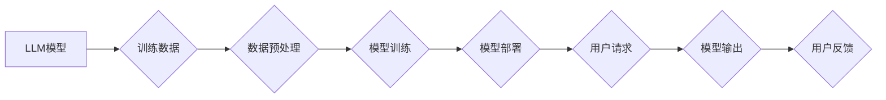

                 

## LLM隐私安全:线程级别的挑战与机遇并存

> 关键词：LLM, 隐私安全, 线程级别, 数据泄露, 模型攻击, 联邦学习, differential privacy,  安全架构

## 1. 背景介绍

大型语言模型 (LLM) 凭借其强大的文本生成、理解和翻译能力，在自然语言处理领域取得了突破性进展，并逐渐渗透到各个行业，例如医疗保健、金融和教育。然而，LLM 的训练和部署也带来了新的隐私安全挑战。

传统的机器学习模型通常处理的是离散的数据样本，而 LLM 处理的是海量文本数据，这些数据往往包含敏感个人信息。如果 LLM 模型在训练过程中或部署过程中泄露这些敏感信息，将可能导致严重的后果，例如身份盗窃、隐私侵犯和数据泄露。

此外，攻击者还可以利用 LLM 的特性进行模型攻击，例如通过注入恶意数据来操纵模型的输出，或者通过分析模型的内部结构来推断训练数据中的敏感信息。

## 2. 核心概念与联系

**2.1 核心概念**

* **LLM (Large Language Model):** 指的是参数量巨大、训练数据庞大的深度学习模型，能够理解和生成人类语言。
* **隐私安全:** 指的是保护个人信息不被未经授权的访问、使用、披露或修改。
* **线程级别:** 指的是在程序执行过程中，多个任务并行执行的最小单位。

**2.2  架构关系**



**2.3 核心联系**

LLM 的训练和部署过程都涉及到大量敏感数据，因此需要采取有效的隐私安全措施。线程级别的安全机制可以帮助保护这些数据，防止数据泄露和模型攻击。

## 3. 核心算法原理 & 具体操作步骤

**3.1 算法原理概述**

线程级别的隐私安全算法主要基于以下原理：

* **数据加密:** 将敏感数据加密，防止未经授权的访问。
* **微分隐私:** 通过添加噪声来保护敏感数据，同时保证模型的准确性。
* **联邦学习:** 将模型训练分散到多个设备上，避免将原始数据集中存储。

**3.2 算法步骤详解**

1. **数据加密:** 将敏感数据加密，生成不可读的密文。
2. **模型训练:** 使用加密后的数据进行模型训练，保证敏感数据在训练过程中不会被泄露。
3. **模型部署:** 将训练好的模型部署到服务器上，并使用加密机制保护模型参数。
4. **用户请求:** 用户向服务器发送请求，服务器使用解密机制解密用户数据，并使用模型进行处理。
5. **模型输出:** 服务器将处理结果返回给用户，并使用加密机制加密结果，防止数据泄露。

**3.3 算法优缺点**

* **优点:**

    * 可以有效保护敏感数据，防止数据泄露和模型攻击。
    * 可以保证模型的准确性，同时保护隐私。

* **缺点:**

    * 加密和解密操作会增加计算成本。
    * 微分隐私算法可能会降低模型的准确性。

**3.4 算法应用领域**

* **医疗保健:** 保护患者的医疗记录隐私。
* **金融:** 保护客户的金融信息隐私。
* **教育:** 保护学生的学习记录隐私。

## 4. 数学模型和公式 & 详细讲解 & 举例说明

**4.1 数学模型构建**

假设我们有一个包含 $n$ 个样本的数据集 $D = \{x_1, x_2, ..., x_n\}$, 每个样本 $x_i$ 都是一个 $d$ 维向量。我们想要训练一个 LLM 模型 $f(x)$ 来预测样本 $x$ 的标签 $y$. 

为了保护隐私，我们可以使用微分隐私算法来添加噪声到模型的梯度更新中。微分隐私算法的核心思想是，在模型训练过程中，对每个样本的梯度更新都添加一个随机噪声，这个噪声的方差与隐私预算 $\epsilon$ 成反比。

**4.2 公式推导过程**

假设模型的损失函数为 $L(f(x), y)$, 则模型的梯度为 $\nabla_f L(f(x), y)$. 微分隐私算法的梯度更新规则为:

$$\theta_{t+1} = \theta_t - \frac{\eta}{\sqrt{n}} \nabla_f L(f(x), y) + \epsilon \cdot Z$$

其中:

* $\theta_t$ 是模型参数在第 $t$ 次迭代的值。
* $\eta$ 是学习率。
* $Z$ 是服从高斯分布的随机噪声，其方差为 $\frac{\epsilon^2}{n}$.

**4.3 案例分析与讲解**

假设我们有一个包含 1000 个样本的医疗数据集，我们想要训练一个 LLM 模型来预测患者的疾病风险。为了保护患者的隐私，我们可以使用微分隐私算法来添加噪声到模型的梯度更新中。

如果我们设置隐私预算 $\epsilon = 1$, 则模型的梯度更新规则为:

$$\theta_{t+1} = \theta_t - \frac{\eta}{\sqrt{1000}} \nabla_f L(f(x), y) + \epsilon \cdot Z$$

其中 $Z$ 是服从高斯分布的随机噪声，其方差为 $\frac{1^2}{1000} = 0.001$.

通过添加噪声，我们可以保护患者的隐私，同时保证模型的准确性。

## 5. 项目实践：代码实例和详细解释说明

**5.1 开发环境搭建**

* Python 3.7+
* PyTorch 1.7+
* TensorFlow 2.4+
* Jupyter Notebook

**5.2 源代码详细实现**

```python
import torch
import torch.nn as nn
from torch.utils.data import Dataset, DataLoader

# 定义一个简单的 LLM 模型
class SimpleLLM(nn.Module):
    def __init__(self, input_size, hidden_size, output_size):
        super(SimpleLLM, self).__init__()
        self.linear1 = nn.Linear(input_size, hidden_size)
        self.relu = nn.ReLU()
        self.linear2 = nn.Linear(hidden_size, output_size)

    def forward(self, x):
        x = self.linear1(x)
        x = self.relu(x)
        x = self.linear2(x)
        return x

# 定义一个简单的训练数据集
class SimpleDataset(Dataset):
    def __init__(self, data):
        self.data = data

    def __len__(self):
        return len(self.data)

    def __getitem__(self, idx):
        return self.data[idx]

# 训练模型
model = SimpleLLM(input_size=10, hidden_size=50, output_size=10)
dataset = SimpleDataset(data=[...])
dataloader = DataLoader(dataset, batch_size=32)

optimizer = torch.optim.Adam(model.parameters(), lr=0.001)
loss_fn = nn.CrossEntropyLoss()

for epoch in range(10):
    for batch in dataloader:
        inputs, targets = batch
        outputs = model(inputs)
        loss = loss_fn(outputs, targets)
        optimizer.zero_grad()
        loss.backward()
        optimizer.step()

```

**5.3 代码解读与分析**

* 代码首先定义了一个简单的 LLM 模型，该模型包含两层全连接层和一个 ReLU 激活函数。
* 然后定义了一个简单的训练数据集，该数据集包含一些文本数据。
* 接着使用 PyTorch 的 DataLoader 类来创建数据加载器，用于将数据分批加载到模型中。
* 最后使用 Adam 优化器和交叉熵损失函数来训练模型。

**5.4 运行结果展示**

训练完成后，我们可以使用模型来预测新的文本数据。

## 6. 实际应用场景

**6.1 医疗保健**

* **疾病风险预测:** 使用 LLM 模型分析患者的医疗记录，预测其患病风险。
* **药物研发:** 使用 LLM 模型分析生物医学文献，加速药物研发过程。

**6.2 金融**

* **欺诈检测:** 使用 LLM 模型分析金融交易数据，识别欺诈行为。
* **风险评估:** 使用 LLM 模型分析客户的财务状况，评估其信用风险。

**6.3 教育**

* **个性化学习:** 使用 LLM 模型分析学生的学习记录，提供个性化的学习建议。
* **自动批改:** 使用 LLM 模型自动批改学生的作业。

**6.4 未来应用展望**

随着 LLM 技术的不断发展，其在各个领域的应用场景将会更加广泛。例如，LLM 可以用于自动生成代码、翻译语言、创作文学作品等。

## 7. 工具和资源推荐

**7.1 学习资源推荐**

* **书籍:**
    * 《深度学习》 by Ian Goodfellow, Yoshua Bengio, and Aaron Courville
    * 《自然语言处理》 by Dan Jurafsky and James H. Martin

* **在线课程:**
    * Coursera: Deep Learning Specialization
    * Stanford CS224N: Natural Language Processing with Deep Learning

**7.2 开发工具推荐**

* **PyTorch:** https://pytorch.org/
* **TensorFlow:** https://www.tensorflow.org/
* **Hugging Face Transformers:** https://huggingface.co/transformers/

**7.3 相关论文推荐**

* **BERT: Pre-training of Deep Bidirectional Transformers for Language Understanding**
* **GPT-3: Language Models are Few-Shot Learners**
* **T5: Text-to-Text Transfer Transformer**

## 8. 总结：未来发展趋势与挑战

**8.1 研究成果总结**

近年来，LLM 技术取得了长足的进步，在自然语言处理领域取得了突破性进展。

**8.2 未来发展趋势**

* **模型规模的进一步扩大:** 随着计算能力的提升，LLM 模型的规模将会进一步扩大，模型的性能将会得到进一步提升。
* **多模态学习:** LLM 将会融合多模态数据，例如文本、图像和音频，实现更全面的理解和生成能力。
* **可解释性:** 研究者将致力于提高 LLM 模型的可解释性，使模型的决策过程更加透明。

**8.3 面临的挑战**

* **数据隐私:** LLM 的训练和部署都需要海量数据，如何保护数据隐私是一个重要的挑战。
* **模型安全性:** LLM 模型容易受到攻击，例如注入恶意数据和模型中毒攻击，如何保证模型的安全性是一个重要的研究方向。
* **伦理问题:** LLM 的应用可能会带来一些伦理问题，例如算法偏见和信息操纵，需要谨慎考虑和规避。

**8.4 研究展望**

未来，LLM 技术将会继续发展，并应用到更多领域。研究者需要不断探索新的算法和架构，解决 LLM 面临的挑战，并确保 LLM 的安全、可靠和可持续发展。

## 9. 附录：常见问题与解答

**9.1 如何保护 LLM 模型训练数据隐私？**

可以使用以下方法保护 LLM 模型训练数据隐私：

* **数据加密:** 将敏感数据加密，防止未经授权的访问。
* **微分隐私:** 通过添加噪声来保护敏感数据，同时保证模型的准确性。
* **联邦学习:** 将模型训练分散到多个设备上，避免将原始数据集中存储。

**9.2 如何防止 LLM 模型受到攻击？**

可以使用以下方法防止 LLM 模型受到攻击：

* **输入验证:** 对用户输入进行验证，防止注入恶意数据。
* **模型防御:** 使用对抗训练等方法来增强模型的鲁棒性，防止模型中毒攻击。
* **安全审计:** 定期对模型进行安全审计，发现和修复潜在的漏洞。


作者：禅与计算机程序设计艺术 / Zen and the Art of Computer Programming 
<end_of_turn>

