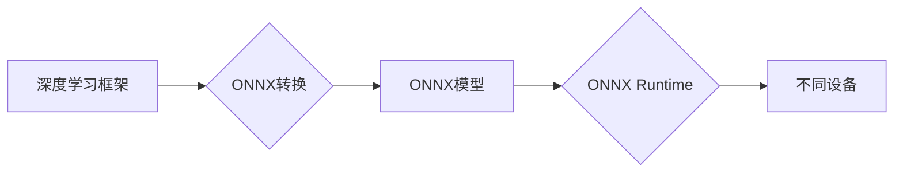

                 

## 1. 背景介绍

深度学习模型的蓬勃发展为各个领域带来了革命性的变革，从图像识别到自然语言处理，深度学习的应用无处不在。然而，深度学习模型的部署是一个复杂的过程，需要考虑模型的性能、效率和可移植性。

传统的深度学习框架，例如TensorFlow和PyTorch，通常针对特定的硬件平台进行优化，这限制了模型在不同设备上的运行。为了解决这个问题，ONNX（Open Neural Network Exchange）应运而生。ONNX是一个开放的标准，用于表示深度学习模型，它允许模型在不同的框架之间进行转换和部署。

ONNX Runtime是微软开发的一个开源深度学习推理引擎，它支持多种硬件平台，包括CPU、GPU和FPGA。ONNX Runtime可以高效地运行ONNX格式的深度学习模型，并提供跨平台部署的解决方案。

## 2. 核心概念与联系

### 2.1 ONNX 标准

ONNX是一个开放的、可移植的深度学习模型格式，它定义了模型结构和参数的表示方式。ONNX标准由多个深度学习框架共同维护，包括TensorFlow、PyTorch、Caffe2等。

### 2.2 ONNX Runtime 引擎

ONNX Runtime是一个高效的深度学习推理引擎，它可以运行ONNX格式的模型。ONNX Runtime支持多种硬件平台，并提供多种优化策略，以提高模型的推理速度和效率。

### 2.3 跨平台部署

ONNX Runtime的跨平台部署能力是其核心优势之一。它可以运行在不同的操作系统和硬件平台上，例如Windows、Linux、macOS、Android、iOS等。

**Mermaid 流程图**



## 3. 核心算法原理 & 具体操作步骤

### 3.1 算法原理概述

ONNX Runtime使用多种算法来优化模型的推理过程，例如：

* **量化：**将模型参数和激活值转换为低精度数据类型，以减少内存占用和计算量。
* **图优化：**对模型的计算图进行优化，例如合并操作、消除冗余计算等，以提高推理速度。
* **并行化：**将模型的计算任务分配到多个CPU核心或GPU上，以并行执行，提高推理效率。

### 3.2 算法步骤详解

1. **模型转换：**将深度学习模型从源框架转换为ONNX格式。
2. **模型优化：**使用ONNX Runtime提供的优化工具对模型进行优化，例如量化、图优化等。
3. **模型部署：**将优化后的模型部署到目标设备上，例如CPU、GPU、FPGA等。
4. **模型推理：**使用ONNX Runtime引擎在目标设备上运行模型，进行推理计算。

### 3.3 算法优缺点

**优点：**

* **跨平台部署：**ONNX Runtime支持多种硬件平台，可以方便地将模型部署到不同的设备上。
* **高性能：**ONNX Runtime使用多种优化算法，可以提高模型的推理速度和效率。
* **开源免费：**ONNX Runtime是一个开源项目，可以免费使用。

**缺点：**

* **模型转换：**将模型从源框架转换为ONNX格式可能需要一些时间和精力。
* **优化策略：**ONNX Runtime提供的优化策略可能并不适用于所有模型，需要根据模型的特点进行选择。

### 3.4 算法应用领域

ONNX Runtime的跨平台部署能力和高性能特性使其在各个领域都有广泛的应用，例如：

* **图像识别：**在智能手机、无人驾驶汽车等设备上进行图像识别。
* **自然语言处理：**在聊天机器人、语音助手等应用中进行自然语言理解和生成。
* **机器翻译：**将文本从一种语言翻译成另一种语言。
* **医疗诊断：**辅助医生进行疾病诊断和治疗。

## 4. 数学模型和公式 & 详细讲解 & 举例说明

### 4.1 数学模型构建

ONNX Runtime使用数学模型来描述模型的结构和计算过程。这些模型通常基于张量计算，并使用各种数学运算符，例如加法、乘法、激活函数等。

### 4.2 公式推导过程

ONNX Runtime的优化算法基于一些数学公式和推导过程。例如，量化算法使用最小二乘法来找到最佳的量化参数，以最小化模型精度损失。

### 4.3 案例分析与讲解

假设我们有一个简单的线性回归模型，其数学表达式为：

$$y = wx + b$$

其中：

* $y$ 是预测值
* $x$ 是输入特征
* $w$ 是权重参数
* $b$ 是偏置参数

ONNX Runtime可以将这个模型转换为ONNX格式，并使用量化算法将权重和偏置参数量化为低精度数据类型，以减少模型的大小和计算量。

## 5. 项目实践：代码实例和详细解释说明

### 5.1 开发环境搭建

为了使用ONNX Runtime，需要先搭建开发环境。ONNX Runtime支持多种操作系统和硬件平台，具体搭建步骤可以参考官方文档。

### 5.2 源代码详细实现

以下是一个简单的ONNX Runtime代码示例，用于运行一个简单的图像分类模型：

```python
import onnxruntime as ort

# 加载ONNX模型
model = ort.InferenceSession("model.onnx")

# 输入数据
input_data = ...

# 进行推理
output = model.run(None, { "input_tensor": input_data })

# 处理输出结果
...
```

### 5.3 代码解读与分析

这段代码首先加载了ONNX模型，然后将输入数据传递给模型进行推理。最后，处理输出结果并进行后续操作。

### 5.4 运行结果展示

运行结果将显示模型对输入数据的预测结果。

## 6. 实际应用场景

ONNX Runtime在各个领域都有广泛的应用场景，例如：

* **边缘计算：**在资源受限的设备上运行深度学习模型，例如智能手机、物联网设备等。
* **云计算：**在云平台上部署深度学习模型，以提供高性能的推理服务。
* **嵌入式系统：**在嵌入式系统中运行深度学习模型，例如无人机、机器人等。

### 6.4 未来应用展望

随着ONNX Runtime的不断发展，其应用场景将更加广泛，例如：

* **实时推理：**在需要实时处理数据的场景中，例如自动驾驶、视频监控等。
* **个性化服务：**根据用户的个人数据进行个性化模型训练和部署。
* **跨设备协同：**在多个设备之间协同运行深度学习模型，以提高模型的性能和效率。

## 7. 工具和资源推荐

### 7.1 学习资源推荐

* **ONNX官方文档：**https://onnx.ai/docs/
* **ONNX Runtime官方文档：**https://onnxruntime.ai/docs/
* **ONNX社区论坛：**https://discuss.onnx.ai/

### 7.2 开发工具推荐

* **ONNX Model Zoo：**https://github.com/onnx/models
* **TensorFlow ONNX导出工具：**https://www.tensorflow.org/guide/onnx
* **PyTorch ONNX导出工具：**https://pytorch.org/docs/stable/onnx.html

### 7.3 相关论文推荐

* **ONNX: Open Neural Network Exchange**
* **ONNX Runtime: An Open-Source Machine Learning Inference Engine**

## 8. 总结：未来发展趋势与挑战

### 8.1 研究成果总结

ONNX Runtime是一个强大的跨平台深度学习推理引擎，它为深度学习模型的部署提供了高效、灵活的解决方案。

### 8.2 未来发展趋势

ONNX Runtime将继续朝着以下方向发展：

* **提高推理速度和效率：**通过开发新的优化算法和硬件加速技术。
* **支持更多硬件平台：**例如ARM、RISC-V等。
* **增强模型可解释性：**提供工具和技术，帮助用户理解模型的决策过程。

### 8.3 面临的挑战

ONNX Runtime还面临一些挑战，例如：

* **模型转换：**将所有深度学习模型转换为ONNX格式仍然是一个挑战。
* **优化策略：**需要开发更智能的优化策略，以适应不同类型的模型和硬件平台。
* **生态系统建设：**需要吸引更多开发者和研究者加入ONNX生态系统，共同推动ONNX Runtime的发展。

### 8.4 研究展望

未来，ONNX Runtime将继续成为深度学习模型部署的重要工具，并推动深度学习技术在各个领域的应用。


## 9. 附录：常见问题与解答

### 9.1 如何将模型转换为ONNX格式？

可以使用源框架提供的ONNX导出工具将模型转换为ONNX格式。例如，TensorFlow可以使用`tf.saved_model.save()`方法导出模型，并使用`onnx.export()`方法将模型转换为ONNX格式。

### 9.2 ONNX Runtime支持哪些硬件平台？

ONNX Runtime支持多种硬件平台，包括CPU、GPU、FPGA等。

### 9.3 如何优化ONNX模型的推理速度？

可以使用ONNX Runtime提供的优化工具对模型进行优化，例如量化、图优化等。

### 9.4 ONNX Runtime的开源许可证是什么？

ONNX Runtime使用MIT开源许可证。


作者：禅与计算机程序设计艺术 / Zen and the Art of Computer Programming 
<end_of_turn>

