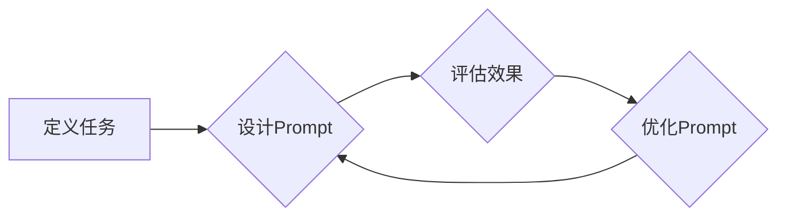

                 

## 1. 背景介绍

在人工智能领域，Prompt的设计与效果至关重要。Prompt可以被理解为与大型语言模型（LLM）进行交互的指令或提示，它直接影响着模型的输出结果。随着LLM技术的快速发展，Prompt工程逐渐成为一个独立的领域，并受到越来越多的关注。

传统的软件开发模式依赖于明确的代码指令，而LLM则更像一个强大的文本理解和生成引擎，需要通过精心设计的Prompt来引导其行为。一个好的Prompt能够有效地传达用户的意图，并引导模型生成高质量、符合预期结果的文本。

然而，Prompt的设计并非易事。它需要考虑多种因素，例如模型的特性、任务类型、输入数据的格式以及期望的输出结果等。一个糟糕的Prompt可能会导致模型产生错误、不相关的或甚至有害的输出。

## 2. 核心概念与联系

### 2.1 Prompt的定义

Prompt是指用于与大型语言模型（LLM）交互的文本指令或提示。它可以包含以下内容：

* **任务描述:** 明确告知模型需要完成的任务，例如翻译、摘要、问答等。
* **输入数据:** 提供模型进行处理的数据，例如文本、代码、图像等。
* **输出格式:** 指定模型输出的格式，例如文本、代码、表格等。
* **其他约束条件:** 例如长度限制、风格要求、偏好设置等。

### 2.2 Prompt工程

Prompt工程是指设计、优化和评估Prompt的过程。它是一个跨学科的领域，涉及自然语言处理、机器学习、软件工程等多个领域。

**Prompt工程流程:**



### 2.3  LLM与Prompt的交互

LLM通过学习大量的文本数据，掌握了语言的结构和语义。当接收到一个Prompt时，LLM会根据其训练数据和Prompt的内容，生成相应的文本输出。

**LLM与Prompt交互过程:**

1. 用户输入Prompt。
2. LLM解析Prompt，理解任务和输入数据。
3. LLM根据训练数据和Prompt内容，生成文本输出。
4. 用户接收并评估输出结果。

## 3. 核心算法原理 & 具体操作步骤

### 3.1  算法原理概述

Prompt设计与效果与以下几个核心算法原理密切相关：

* **Transformer模型:** Transformer模型是LLM的基础架构，其自注意力机制能够捕捉文本中的长距离依赖关系，从而提高文本理解和生成能力。
* **Token化:** 将文本分割成一个个小的单位（token），以便LLM进行处理。
* **嵌入:** 将token映射到向量空间，以便LLM进行数值计算。
* **解码:** 根据输入的Prompt和隐藏状态，生成相应的文本输出。

### 3.2  算法步骤详解

1. **Token化:** 将Prompt和输入数据进行Token化，得到一系列token。
2. **嵌入:** 将token映射到向量空间，得到相应的嵌入向量。
3. **编码:** 将嵌入向量输入到Transformer模型的编码器中，生成隐藏状态。
4. **解码:** 将隐藏状态输入到Transformer模型的解码器中，根据解码器生成的概率分布，生成相应的文本输出。
5. **后处理:** 对生成的文本进行一些后处理，例如去除非法的字符、规范化格式等。

### 3.3  算法优缺点

**优点:**

* 能够生成高质量、符合语义的文本。
* 可以处理多种类型的任务，例如翻译、摘要、问答等。
* 能够适应不同的语言和领域。

**缺点:**

* 需要大量的训练数据。
* 计算资源消耗较大。
* 容易受到Prompt设计的影响，需要精心设计Prompt才能获得理想的输出结果。

### 3.4  算法应用领域

* **自然语言处理:** 机器翻译、文本摘要、问答系统、聊天机器人等。
* **代码生成:** 自动生成代码、代码补全、代码翻译等。
* **创意写作:** 生成诗歌、小说、剧本等。
* **教育:** 自动生成习题、提供个性化学习辅导等。

## 4. 数学模型和公式 & 详细讲解 & 举例说明

### 4.1  数学模型构建

LLM的训练过程本质上是一个优化问题，目标是找到一个模型参数，使得模型在训练数据上的预测结果与真实结果尽可能接近。

**损失函数:**

$$
L = \sum_{i=1}^{N} \mathcal{L}(y_i, \hat{y}_i)
$$

其中：

* $N$ 是训练数据的数量。
* $\mathcal{L}$ 是损失函数，例如交叉熵损失函数。
* $y_i$ 是真实标签。
* $\hat{y}_i$ 是模型预测的标签。

**优化算法:**

常用的优化算法包括梯度下降法、Adam算法等。这些算法通过迭代更新模型参数，逐步降低损失函数的值。

### 4.2  公式推导过程

Transformer模型的核心是自注意力机制。自注意力机制能够捕捉文本中的长距离依赖关系，提高文本理解和生成能力。

**自注意力机制公式:**

$$
Attention(Q, K, V) = softmax(\frac{QK^T}{\sqrt{d_k}})V
$$

其中：

* $Q$ 是查询矩阵。
* $K$ 是键矩阵。
* $V$ 是值矩阵。
* $d_k$ 是键向量的维度。

### 4.3  案例分析与讲解

假设我们有一个句子：“我爱吃苹果”。

* $Q$ 可以表示为每个词的嵌入向量。
* $K$ 和 $V$ 可以表示为所有词的嵌入向量。

通过自注意力机制，模型可以计算出每个词与其他词之间的相关性，例如“我”与“爱”之间的相关性较高，“吃”与“苹果”之间的相关性较高。

## 5. 项目实践：代码实例和详细解释说明

### 5.1  开发环境搭建

* Python 3.7+
* PyTorch 1.7+
* Transformers库

### 5.2  源代码详细实现

```python
from transformers import AutoModelForSeq2SeqLM, AutoTokenizer

# 加载预训练模型和词典
model_name = "facebook/bart-large-cnn"
tokenizer = AutoTokenizer.from_pretrained(model_name)
model = AutoModelForSeq2SeqLM.from_pretrained(model_name)

# 定义Prompt
prompt = "翻译以下句子：Hello, world!"

# Token化Prompt
input_ids = tokenizer.encode(prompt, return_tensors="pt")

# 生成文本输出
output = model.generate(input_ids)

# 解码输出
translated_text = tokenizer.decode(output[0], skip_special_tokens=True)

# 打印输出结果
print(translated_text)
```

### 5.3  代码解读与分析

* 代码首先加载预训练的BART模型和词典。
* 然后定义Prompt，并将其Token化。
* 使用模型的`generate`方法生成文本输出。
* 最后解码输出，并打印结果。

### 5.4  运行结果展示

```
你好，世界！
```

## 6. 实际应用场景

### 6.1  机器翻译

Prompt可以引导LLM进行机器翻译，例如将英文翻译成中文。

### 6.2  文本摘要

Prompt可以指示LLM生成文本摘要，例如将一篇长篇文章总结成几句话。

### 6.3  问答系统

Prompt可以作为问答系统的输入，引导LLM回答用户的问题。

### 6.4  未来应用展望

* **个性化教育:** 根据学生的学习情况，生成个性化的学习内容和练习题。
* **医疗诊断:** 辅助医生进行疾病诊断，提供更精准的医疗建议。
* **法律文本分析:** 自动分析法律文本，提取关键信息，辅助法律工作。

## 7. 工具和资源推荐

### 7.1  学习资源推荐

* **OpenAI API:** https://beta.openai.com/docs/api-reference/introduction
* **HuggingFace Transformers:** https://huggingface.co/docs/transformers/index

### 7.2  开发工具推荐

* **Jupyter Notebook:** https://jupyter.org/
* **VS Code:** https://code.visualstudio.com/

### 7.3  相关论文推荐

* **Attention Is All You Need:** https://arxiv.org/abs/1706.03762
* **BERT: Pre-training of Deep Bidirectional Transformers for Language Understanding:** https://arxiv.org/abs/1810.04805

## 8. 总结：未来发展趋势与挑战

### 8.1  研究成果总结

Prompt工程是一个快速发展的领域，取得了显著的成果。

* **Prompt设计方法:** 出现了多种Prompt设计方法，例如few-shot学习、chain-of-thought prompting等。
* **Prompt优化技术:** 开发了多种Prompt优化技术，例如Prompt模板、Prompt蒸馏等。
* **Prompt评估指标:** 提出了一些新的Prompt评估指标，例如BLEU、ROUGE、Perplexity等。

### 8.2  未来发展趋势

* **自动化Prompt设计:** 研究如何自动生成有效的Prompt，降低人工干预。
* **跨模态Prompt:** 研究如何设计跨模态的Prompt，例如将文本和图像结合起来进行交互。
* **可解释性Prompt:** 研究如何提高Prompt的可解释性，帮助用户理解模型的决策过程。

### 8.3  面临的挑战

* **Prompt设计缺乏标准化:** 目前Prompt设计缺乏标准化，不同领域、不同任务的Prompt设计方法差异较大。
* **Prompt效果难以评估:** 评估Prompt效果是一个复杂的问题，缺乏统一的评估标准。
* **数据安全和隐私问题:** 使用Prompt进行交互可能会涉及到用户数据，需要考虑数据安全和隐私问题。

### 8.4  研究展望

Prompt工程是一个充满机遇和挑战的领域，未来将会有更多的研究和应用。

## 9. 附录：常见问题与解答

* **如何设计一个好的Prompt?**

一个好的Prompt应该清晰、简洁、具体，并明确地表达用户的意图。

* **如何评估Prompt的效果?**

可以使用BLEU、ROUGE、Perplexity等指标来评估Prompt的效果。

* **如何解决Prompt过长的问题?**

可以使用Prompt模板、Prompt蒸馏等技术来解决Prompt过长的问题。


作者：禅与计算机程序设计艺术 / Zen and the Art of Computer Programming 
<end_of_turn>

