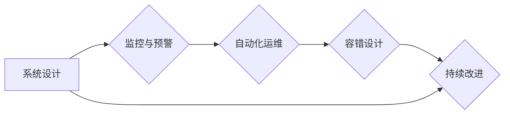

                 

## SRE实践：保障系统高可用

> 关键词：Site Reliability Engineering (SRE)、高可用性、系统监控、故障排除、自动化运维、DevOps、容错设计、性能优化

## 1. 背景介绍

在当今数字化时代，系统高可用性已成为企业核心业务的基石。用户对服务的期望越来越高，任何系统故障都可能导致巨大的经济损失和品牌形象损害。因此，保障系统高可用性显得尤为重要。

Site Reliability Engineering (SRE) 应运而生，它将软件工程的最佳实践应用于运营管理，旨在通过自动化、监控和预警等手段，提高系统可靠性和稳定性。SRE 强调以数据为驱动，通过持续改进和优化，实现系统的高可用性、可扩展性和可维护性。

## 2. 核心概念与联系

SRE 的核心概念包括：

* **可靠性 (Reliability):** 系统能够持续稳定地提供服务的能力。
* **可用性 (Availability):** 系统在特定时间段内能够正常运行和响应请求的概率。
* **可维护性 (Maintainability):** 系统易于维护、升级和修复的能力。
* **可扩展性 (Scalability):** 系统能够根据需求动态调整资源，以满足流量变化。

SRE 将这些概念融入到系统设计、开发和运营的全生命周期中，通过以下方式实现系统高可用性：

* **监控 (Monitoring):** 实时监控系统性能、资源利用率和错误日志等关键指标，及时发现潜在问题。
* **预警 (Alerting):** 当系统出现异常情况时，及时发送预警通知，以便快速响应和处理。
* **自动化 (Automation):** 自动化部署、配置和运维任务，减少人为错误和操作时间。
* **容错设计 (Fault Tolerance):** 设计容错机制，确保系统即使出现部分故障也能继续正常运行。
* **持续改进 (Continuous Improvement):** 通过数据分析和反馈，不断优化系统设计和运营流程，提升可靠性和可用性。

**Mermaid 流程图：**



## 3. 核心算法原理 & 具体操作步骤

### 3.1  算法原理概述

SRE 中常用的算法原理包括：

* **统计过程控制 (SPC):** 通过收集和分析系统指标数据，识别异常值和趋势，及时发现潜在问题。
* **机器学习 (ML):** 利用机器学习算法，预测系统故障风险，并自动采取预防措施。
* **故障树分析 (FTA):** 分析系统故障的潜在原因，识别关键风险点，并制定相应的预防措施。

### 3.2  算法步骤详解

**示例：使用 SPC 算法进行系统监控**

1. **数据收集:** 收集系统关键指标数据，例如 CPU 利用率、内存使用率、网络流量等。
2. **数据分析:** 使用 SPC 算法对数据进行分析，计算控制限和平均值。
3. **异常检测:** 当系统指标数据超出控制限时，视为异常情况，触发预警。
4. **问题诊断:** 根据异常指标和系统日志，诊断故障原因。
5. **问题解决:** 根据故障原因，采取相应的解决措施，例如增加服务器资源、优化代码等。

### 3.3  算法优缺点

**SPC 算法的优缺点:**

* **优点:** 简单易用，能够有效识别系统指标异常。
* **缺点:** 对异常类型有限制，无法识别复杂故障。

### 3.4  算法应用领域

SPC 算法广泛应用于系统监控、故障预警和性能优化等领域。

## 4. 数学模型和公式 & 详细讲解 & 举例说明

### 4.1  数学模型构建

**可用性 (Availability) 的数学模型:**

$$
Availability = \frac{Uptime}{Total Time}
$$

其中：

* Uptime: 系统处于正常运行状态的时间。
* Total Time: 系统运行的总时间。

### 4.2  公式推导过程

可用性公式的推导过程如下：

1. 假设系统运行时间为 T，其中正常运行时间为 U。
2. 可用性定义为系统在运行时间内处于正常状态的比例。
3. 因此，可用性公式为：Availability = U/T。

### 4.3  案例分析与讲解

**案例:**

假设一个系统运行时间为 24 小时，其中正常运行时间为 22 小时，则其可用性为：

$$
Availability = \frac{22 hours}{24 hours} = 0.9167
$$

**解释:**

该系统的可用性为 91.67%，表示系统在 24 小时内 91.67% 的时间处于正常运行状态。

## 5. 项目实践：代码实例和详细解释说明

### 5.1  开发环境搭建

SRE 项目的开发环境搭建需要考虑以下因素：

* **操作系统:** 选择适合 SRE 工具和技术的操作系统，例如 Linux。
* **编程语言:** 选择适合 SRE 开发的编程语言，例如 Python、Go。
* **工具链:** 安装必要的 SRE 工具，例如 Prometheus、Grafana、Kubernetes 等。

### 5.2  源代码详细实现

以下是一个使用 Python 实现的简单 SRE 监控脚本示例：

```python
import psutil
import time

def monitor_cpu_usage():
    while True:
        cpu_percent = psutil.cpu_percent()
        print(f"CPU Usage: {cpu_percent}%")
        time.sleep(5)

if __name__ == "__main__":
    monitor_cpu_usage()
```

**代码解读:**

* 该脚本使用 `psutil` 库获取 CPU 利用率。
* 每隔 5 秒打印 CPU 利用率。

### 5.3  代码解读与分析

* 该脚本演示了如何使用 Python 脚本进行系统监控。
* 可以根据需要修改脚本，监控其他系统指标，例如内存使用率、网络流量等。

### 5.4  运行结果展示

运行该脚本后，会在控制台输出每 5 秒的 CPU 利用率。

## 6. 实际应用场景

SRE 的应用场景非常广泛，例如：

* **云计算平台:** 保障云平台的高可用性和可靠性，确保用户服务稳定运行。
* **电商平台:** 应对高峰流量，保障网站和应用的稳定运行，避免服务中断。
* **金融系统:** 保障金融系统的安全性和可靠性，防止数据丢失和系统故障。

### 6.4  未来应用展望

随着云计算、大数据和人工智能等技术的快速发展，SRE 将在以下领域得到更广泛的应用：

* **微服务架构:** 帮助管理和监控复杂的微服务系统，提高系统可靠性和可维护性。
* **容器化技术:** 优化容器化应用的部署和运维，提高系统弹性和可扩展性。
* **人工智能:** 利用人工智能技术，实现更智能的系统监控、故障预测和自动化运维。

## 7. 工具和资源推荐

### 7.1  学习资源推荐

* **书籍:**
    * 《Site Reliability Engineering: How Google Runs Production Systems》
    * 《The Phoenix Project: A Novel About IT, DevOps, and Helping Your Business Win》
* **在线课程:**
    * Coursera: Site Reliability Engineering Specialization
    * Udemy: SRE Fundamentals

### 7.2  开发工具推荐

* **监控工具:** Prometheus, Grafana, Datadog
* **自动化工具:** Ansible, Terraform, Kubernetes
* **日志分析工具:** ELK Stack, Splunk

### 7.3  相关论文推荐

* **"Building a Self-Healing System"**
* **"Site Reliability Engineering: A Practical Guide"**

## 8. 总结：未来发展趋势与挑战

### 8.1  研究成果总结

SRE 已经成为保障系统高可用性的重要实践，通过自动化、监控和预警等手段，有效提升了系统可靠性和稳定性。

### 8.2  未来发展趋势

SRE 将继续朝着以下方向发展：

* **更智能的自动化:** 利用人工智能技术，实现更智能的系统监控、故障预测和自动化运维。
* **更强大的监控和分析:** 开发更强大的监控和分析工具，能够更深入地了解系统运行状况，并及时发现潜在问题。
* **更完善的容错设计:** 设计更完善的容错机制，能够应对更复杂的故障场景，确保系统高可用性。

### 8.3  面临的挑战

SRE 面临的挑战包括：

* **技能缺口:** SRE 需要具备软件工程、系统运维和数据分析等多方面的技能，但目前人才缺口较大。
* **文化转变:** SRE 需要企业文化和组织结构的转变，才能真正发挥其价值。
* **技术复杂性:** 随着系统架构的复杂化，SRE 的技术难度也越来越高。

### 8.4  研究展望

未来 SRE 研究将重点关注以下方面:

* **人工智能在 SRE 中的应用:** 利用人工智能技术，实现更智能的系统监控、故障预测和自动化运维。
* **SRE 与 DevOps 的融合:** 将 SRE 的最佳实践与 DevOps 的理念相结合，实现更全面的系统开发和运维流程。
* **SRE 的可扩展性和通用性:** 开发更可扩展和通用的 SRE 工具和框架，能够适应不同类型的系统和应用场景。


## 9. 附录：常见问题与解答

**常见问题:**

* **什么是 SRE?**

SRE (Site Reliability Engineering) 是将软件工程的最佳实践应用于运营管理，旨在通过自动化、监控和预警等手段，提高系统可靠性和稳定性。

* **SRE 的核心目标是什么?**

SRE 的核心目标是保障系统的高可用性、可维护性和可扩展性。

* **SRE 与 DevOps 的区别是什么?**

DevOps 侧重于软件开发和运维之间的协作，而 SRE 则更侧重于保障系统可靠性和稳定性。两者相互补充，共同推动了软件开发和运维的效率提升。

**作者：禅与计算机程序设计艺术 / Zen and the Art of Computer Programming**<end_of_turn>

