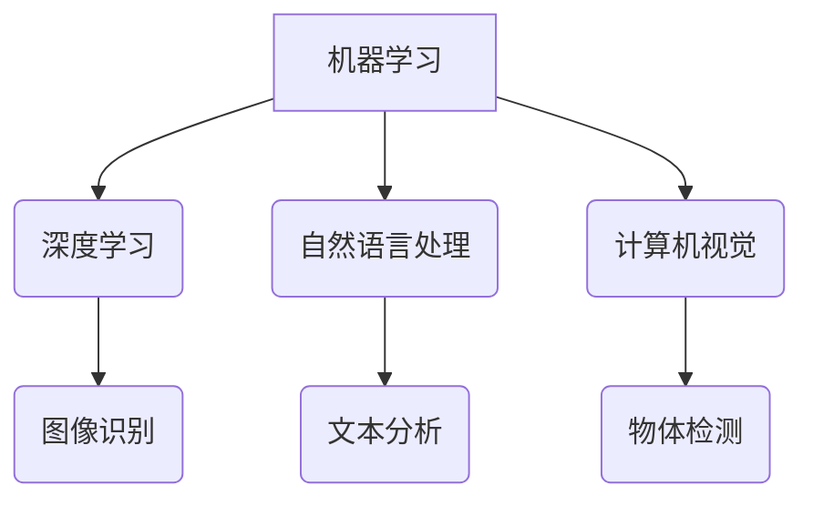

                 

## 人工智能：社会影响与思考

> 关键词：人工智能、机器学习、深度学习、伦理、社会影响、未来趋势

## 1. 背景介绍

人工智能（Artificial Intelligence，简称 AI）正以惊人的速度发展，从自动驾驶汽车到医疗诊断，从个性化推荐到金融风险评估，AI 的应用领域日益广泛。这种前所未有的技术进步不仅为人类社会带来了巨大的机遇，也引发了广泛的社会讨论和伦理思考。

### 1.1 AI 的发展历程

人工智能的发展可以追溯到 20 世纪 50 年代，当时，随着计算机技术的进步，人们开始探索机器能否像人类一样学习和思考。早期 AI 研究主要集中在规则式人工智能，即通过预先定义的规则和逻辑来实现智能行为。然而，随着数据量的爆炸式增长和计算能力的提升，机器学习和深度学习等新兴技术逐渐成为 AI 研究的热点。

### 1.2 AI 的核心概念

人工智能的核心概念包括：

* **机器学习 (Machine Learning)：** 允许机器从数据中学习，并根据学习到的知识进行预测或决策。
* **深度学习 (Deep Learning)：** 一种基于多层神经网络的机器学习方法，能够学习更复杂的模式和特征。
* **自然语言处理 (Natural Language Processing)：** 使机器能够理解和处理人类语言。
* **计算机视觉 (Computer Vision)：** 赋予机器“看”的能力，使其能够识别图像和视频中的物体、场景和事件。

## 2. 核心概念与联系

人工智能的核心概念相互关联，共同构成了一个复杂的生态系统。



## 3. 核心算法原理 & 具体操作步骤

### 3.1 算法原理概述

机器学习算法的核心原理是通过训练模型来学习数据中的模式和规律。训练过程通常包括以下步骤：

1. **数据收集和预处理：** 收集相关数据并进行清洗、转换和特征工程等预处理操作。
2. **模型选择：** 根据具体任务选择合适的机器学习算法，例如线性回归、逻辑回归、决策树、支持向量机、神经网络等。
3. **模型训练：** 使用训练数据训练模型，调整模型参数以最小化预测误差。
4. **模型评估：** 使用测试数据评估模型的性能，例如准确率、召回率、F1-score等。
5. **模型部署：** 将训练好的模型部署到实际应用场景中，用于进行预测或决策。

### 3.2 算法步骤详解

以线性回归为例，详细说明其训练步骤：

1. **数据准备：** 假设我们有关于房屋面积和价格的数据集，其中每个样本包含房屋面积和价格两个特征。
2. **特征工程：** 将特征进行标准化处理，例如将面积转换为平方米，将价格转换为千元。
3. **模型选择：** 选择线性回归算法作为模型。
4. **模型训练：** 使用训练数据训练线性回归模型，求解模型参数，使得模型能够拟合数据中的线性关系。
5. **模型评估：** 使用测试数据评估模型的性能，例如计算预测价格与实际价格之间的均方误差。
6. **模型部署：** 将训练好的线性回归模型部署到实际应用场景中，例如用于预测新房子的价格。

### 3.3 算法优缺点

线性回归算法具有以下优点：

* **易于理解和实现：** 线性回归模型的原理简单易懂，实现代码也相对简洁。
* **计算效率高：** 线性回归模型的训练和预测速度很快。
* **可解释性强：** 线性回归模型的系数可以解释模型的预测结果，例如，系数的正负表示特征对预测结果的影响方向，系数的大小表示特征的影响程度。

然而，线性回归算法也存在一些缺点：

* **假设线性关系：** 线性回归算法假设数据之间存在线性关系，如果数据存在非线性关系，则模型的预测精度会降低。
* **容易受到异常值的影响：** 线性回归算法对异常值敏感，异常值可能会导致模型的训练结果偏差。

### 3.4 算法应用领域

线性回归算法广泛应用于以下领域：

* **房价预测：** 根据房屋面积、位置、设施等特征预测房价。
* **股票价格预测：** 根据股票历史数据、市场趋势等特征预测股票价格。
* **销售预测：** 根据历史销售数据、市场营销活动等特征预测未来销售额。

## 4. 数学模型和公式 & 详细讲解 & 举例说明

### 4.1 数学模型构建

线性回归模型的数学模型可以表示为：

$$y = \theta_0 + \theta_1x_1 + \theta_2x_2 + ... + \theta_nx_n + \epsilon$$

其中：

* $y$ 是预测值
* $\theta_0, \theta_1, ..., \theta_n$ 是模型参数
* $x_1, x_2, ..., x_n$ 是输入特征
* $\epsilon$ 是误差项

### 4.2 公式推导过程

线性回归模型的目标是找到最优的模型参数，使得模型的预测值与实际值之间的误差最小。常用的误差函数是均方误差 (MSE)：

$$MSE = \frac{1}{n}\sum_{i=1}^{n}(y_i - \hat{y}_i)^2$$

其中：

* $n$ 是样本数量
* $y_i$ 是第 $i$ 个样本的实际值
* $\hat{y}_i$ 是第 $i$ 个样本的预测值

通过最小化 MSE，可以求解最优的模型参数。

### 4.3 案例分析与讲解

假设我们有以下房屋面积和价格的数据集：

| 面积 (平方米) | 价格 (万元) |
|---|---|
| 60 | 1.2 |
| 80 | 1.5 |
| 100 | 1.8 |
| 120 | 2.1 |

我们可以使用线性回归模型来预测房屋价格。

通过训练模型，我们可以得到以下线性回归方程：

$$y = 0.08x + 0.8$$

其中：

* $y$ 是预测价格
* $x$ 是房屋面积

例如，如果我们想要预测面积为 150 平方米的房屋价格，我们可以将 $x = 150$ 代入公式：

$$y = 0.08 \times 150 + 0.8 = 12.8$$

因此，我们预测面积为 150 平方米的房屋价格为 12.8 万元。

## 5. 项目实践：代码实例和详细解释说明

### 5.1 开发环境搭建

本项目使用 Python 语言进行开发，需要安装以下软件：

* Python 3.x
* scikit-learn 库

### 5.2 源代码详细实现

```python
import pandas as pd
from sklearn.linear_model import LinearRegression
from sklearn.model_selection import train_test_split

# 加载数据
data = pd.read_csv('house_data.csv')

# 分割数据
X = data[['面积']]
y = data['价格']
X_train, X_test, y_train, y_test = train_test_split(X, y, test_size=0.2, random_state=42)

# 创建线性回归模型
model = LinearRegression()

# 训练模型
model.fit(X_train, y_train)

# 预测测试数据
y_pred = model.predict(X_test)

# 评估模型性能
from sklearn.metrics import mean_squared_error
mse = mean_squared_error(y_test, y_pred)
print('均方误差:', mse)
```

### 5.3 代码解读与分析

1. 首先，我们使用 pandas 库加载数据，并将数据分割成特征和目标变量。
2. 然后，我们使用 scikit-learn 库中的 train_test_split 函数将数据分割成训练集和测试集。
3. 接下来，我们创建线性回归模型，并使用 fit 函数训练模型。
4. 训练完成后，我们使用 predict 函数预测测试数据的目标变量。
5. 最后，我们使用 mean_squared_error 函数评估模型的性能，并打印均方误差。

### 5.4 运行结果展示

运行代码后，会输出测试数据的均方误差值。均方误差值越小，模型的预测精度越高。

## 6. 实际应用场景

### 6.1 医疗诊断

AI 算法可以分析患者的病历、影像数据和基因信息，辅助医生进行诊断，提高诊断准确率和效率。

### 6.2 金融风险评估

AI 算法可以分析客户的财务数据和行为模式，评估客户的信用风险和欺诈风险，帮助金融机构做出更明智的决策。

### 6.3 自动驾驶

AI 算法可以帮助汽车感知周围环境、做出决策和控制车辆，实现自动驾驶功能。

### 6.4 未来应用展望

随着 AI 技术的不断发展，其应用场景将更加广泛，例如：

* **个性化教育：** AI 可以根据学生的学习进度和特点，提供个性化的学习方案。
* **智能客服：** AI 可以模拟人类对话，为客户提供智能客服服务。
* **科学研究：** AI 可以帮助科学家分析海量数据，加速科学研究的进程。

## 7. 工具和资源推荐

### 7.1 学习资源推荐

* **在线课程：** Coursera、edX、Udacity 等平台提供丰富的 AI 课程。
* **书籍：** 《深度学习》、《人工智能：一个现代方法》等书籍是学习 AI 的经典教材。
* **博客和论坛：** AI 相关的博客和论坛可以帮助你了解最新的 AI 研究进展和技术趋势。

### 7.2 开发工具推荐

* **Python：** Python 是 AI 开发最常用的编程语言。
* **TensorFlow：** TensorFlow 是 Google 开发的开源深度学习框架。
* **PyTorch：** PyTorch 是 Facebook 开发的开源深度学习框架。

### 7.3 相关论文推荐

* **《ImageNet Classification with Deep Convolutional Neural Networks》**
* **《Attention Is All You Need》**
* **《BERT: Pre-training of Deep Bidirectional Transformers for Language Understanding》**

## 8. 总结：未来发展趋势与挑战

### 8.1 研究成果总结

近年来，人工智能领域取得了令人瞩目的进展，例如：

* **深度学习算法的突破：** 深度学习算法在图像识别、自然语言处理等领域取得了显著的成果。
* **大规模数据集的积累：** 海量数据的积累为深度学习算法的训练提供了充足的燃料。
* **计算能力的提升：** GPU 和 TPU 等高性能计算硬件的普及加速了深度学习算法的训练速度。

### 8.2 未来发展趋势

未来，人工智能的发展趋势包括：

* **更强大的模型：** 研究人员将继续探索更强大的深度学习模型，例如 Transformer、Generative Adversarial Networks (GANs) 等。
* **更广泛的应用场景：** AI 将应用于更多领域，例如医疗、教育、金融、交通等。
* **更智能的交互：** AI 将能够与人类进行更自然、更智能的交互。

### 8.3 面临的挑战

人工智能的发展也面临着一些挑战：

* **数据隐私和安全：** AI 算法的训练需要大量数据，如何保护数据隐私和安全是一个重要问题。
* **算法偏见：** AI 算法可能会受到训练数据中的偏见影响，导致不公平的结果。
* **伦理问题：** AI 的发展引发了伦理问题，例如 AI 的责任、透明度和可解释性等。

### 8.4 研究展望

未来，人工智能研究需要关注以下几个方面：

* **开发更安全、更可靠的 AI 算法。**
* **解决 AI 算法中的偏见问题。**
* **探索 AI 的伦理问题，并制定相应的规范和政策。**


## 9. 附录：常见问题与解答

### 9.1 什么是机器学习？

机器学习是一种人工智能技术，它允许机器从数据中学习，并根据学习到的知识进行预测或决策。

### 9.2 深度学习与机器学习有什么区别？

深度学习是一种基于多层神经网络的机器学习方法，它能够学习更复杂的模式和特征。

### 9.3 如何评估 AI 算法的性能？

常用的 AI 算法性能评估指标包括准确率、召回率、F1-score、均方误差等。

### 9.4 AI 会取代人类工作吗？

AI 可能会改变一些工作，但它也将会创造新的工作机会。


作者：禅与计算机程序设计艺术 / Zen and the Art of Computer Programming 
<end_of_turn>

