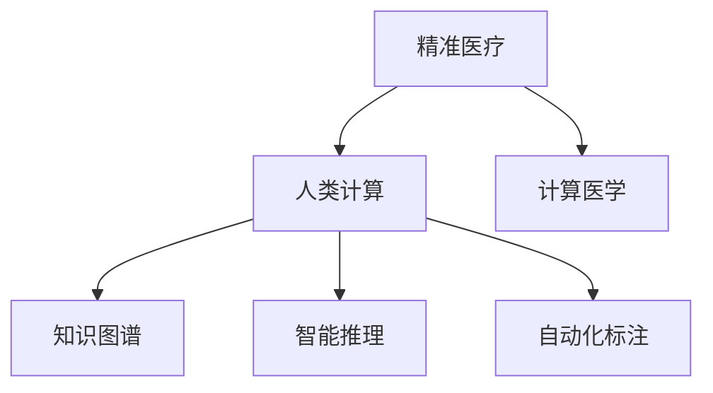

                 

# 医疗保健的未来：人类计算助力精准医疗

## 1. 背景介绍

### 1.1 问题由来
随着技术的迅猛发展，人工智能（AI）在医疗保健领域的应用逐渐深入，为精准医疗提供了新的可能性。然而，传统医疗数据的复杂性、多样性和隐私保护问题，使得精准医疗的发展面临巨大挑战。人类计算（Human Computation）作为人工智能的一个分支，结合人类专家的智慧，在医疗保健中展现了独特的优势。

### 1.2 问题核心关键点
人类计算的核心在于将计算任务分解为小规模、可处理的任务，由人类专家进行计算。这些任务可以包括数据标注、知识抽取、推理判断等。人类计算的优势在于能够充分利用人类的逻辑推理、经验积累和创造力，弥补AI在复杂性、语境理解和伦理判断上的不足。

### 1.3 问题研究意义
人类计算在医疗保健中的应用，有助于提升诊断的准确性、治疗的个性化、医疗资源的合理配置，并为医疗决策提供科学依据。通过人类计算，可以更好地应对医疗数据的多样性和复杂性，确保医疗决策的伦理性和可解释性。

## 2. 核心概念与联系

### 2.1 核心概念概述

为更好地理解人类计算在医疗保健中的应用，本节将介绍几个关键概念：

- 精准医疗（Precision Medicine）：利用个体的基因、环境和生活方式数据，对疾病进行个性化诊断和治疗，提高治疗效果，减少副作用。
- 人类计算（Human Computation）：结合人类专家的智慧，利用计算技术解决复杂问题，提升决策的科学性和可解释性。
- 计算医学（Computational Medicine）：利用计算机算法和数据模型，辅助医生进行诊断和治疗，提升医疗服务效率和质量。
- 知识图谱（Knowledge Graph）：将医疗领域的知识结构化，便于数据查询和推理。
- 智能推理（Smart Reasoning）：利用AI技术进行知识推理和决策，支持医生进行复杂诊断和治疗方案选择。
- 自动化标注（Automated Annotation）：利用机器学习对医疗数据进行自动化标注，减轻专家负担。

这些核心概念之间的逻辑关系可以通过以下Mermaid流程图来展示：



这个流程图展示了点关联概念的层次和作用：

1. 精准医疗是最终目标，通过个性化治疗提升治疗效果。
2. 人类计算是实现精准医疗的关键手段，结合人类专家的智慧进行计算。
3. 计算医学提供技术支持，利用计算机算法进行辅助诊断和治疗。
4. 知识图谱和智能推理是计算医学的具体实现，便于数据查询和知识推理。
5. 自动化标注减轻专家负担，提高医疗数据处理效率。

这些概念共同构成了精准医疗的计算技术框架，有助于医疗决策的科学化和智能化。

## 3. 核心算法原理 & 具体操作步骤

### 3.1 算法原理概述

人类计算在医疗保健中的应用，主要涉及以下步骤：

1. 数据收集与预处理：从各种来源收集医疗数据，包括电子健康记录（EHR）、基因组数据、影像数据等。对数据进行清洗、去重和标注，确保数据的质量和一致性。
2. 知识抽取与图谱构建：利用自然语言处理（NLP）技术，从医疗文本中抽取关键信息，构建知识图谱，方便数据查询和推理。
3. 知识推理与决策支持：结合医学知识和AI推理算法，进行复杂诊断和治疗方案的选择，提供决策支持。
4. 自动化标注与知识更新：利用机器学习对医疗数据进行自动化标注，实时更新知识图谱，保持知识的最新性。

### 3.2 算法步骤详解

以知识图谱构建为例，具体步骤如下：

**Step 1: 数据预处理**
- 收集医疗文本数据，如病历、文献、医疗报告等。
- 进行文本清洗和去重，确保数据质量。
- 利用分词、命名实体识别等NLP技术，提取关键信息。

**Step 2: 知识抽取**
- 利用实体关系抽取（ER）技术，从医疗文本中识别出实体和关系，如疾病、症状、药物等。
- 对抽取的信息进行实体对齐和关系消歧，确保数据的一致性。
- 构建知识图谱，存储实体和关系信息。

**Step 3: 知识推理**
- 利用知识图谱进行实体查询和关系推理，如根据症状查询相关疾病、药物等。
- 结合医学知识库，对推理结果进行验证和修正，确保准确性。
- 利用推理结果进行决策支持，如推荐最佳治疗方案。

**Step 4: 知识更新**
- 实时收集新的医疗数据，进行自动化标注和知识更新。
- 利用机器学习算法，对新数据进行分析和推理，更新知识图谱。
- 定期审查知识图谱，确保其与时俱进，满足临床需求。

### 3.3 算法优缺点

人类计算在医疗保健中的应用，具有以下优点：

1. 结合人类专家的智慧，提升决策的科学性和可解释性。
2. 能够处理复杂和语境性强的医疗数据，弥补AI的不足。
3. 结合机器学习技术，提高数据处理和知识更新的效率。
4. 能够在多领域、多数据源中综合利用知识，提升医疗决策的全面性和准确性。

同时，人类计算也存在一定的局限性：

1. 需要大量的人类专家参与，成本较高。
2. 知识图谱的构建和更新需要专业知识，难以标准化。
3. 推理结果可能受到专家经验的影响，存在主观性。
4. 知识图谱的构建和推理需要时间和计算资源，效率可能较低。

尽管存在这些局限性，但人类计算在医疗保健中的应用，为精准医疗提供了新的思路和方法，具有重要的应用前景。

### 3.4 算法应用领域

人类计算在医疗保健中的应用，主要包括以下几个方面：

1. 疾病诊断与预测：利用知识图谱和智能推理，进行复杂疾病的诊断和预测。如利用知识图谱进行癌症的早期筛查，利用智能推理进行罕见病的诊断。
2. 治疗方案选择：结合知识图谱和医学知识库，为患者推荐最佳治疗方案。如根据基因型和病史，推荐个性化的药物和治疗方案。
3. 医疗资源配置：利用计算医学技术，优化医疗资源的配置和利用，提升医疗服务的效率。如利用计算医学技术优化医院的手术排程，提升手术室利用率。
4. 健康管理：结合人类计算和机器学习，进行健康数据的监测和管理，提供个性化的健康建议。如利用知识图谱进行慢性病的管理，利用智能推理进行健康风险评估。
5. 医疗教育与培训：利用计算医学技术，辅助医疗教育和培训，提升医学生的诊断和治疗能力。如利用计算医学技术进行病例分析，提供诊断和治疗的指导。

## 4. 数学模型和公式 & 详细讲解 & 举例说明

### 4.1 数学模型构建

本节将使用数学语言对人类计算在医疗保健中的应用进行更加严格的刻画。

假设医疗数据集为 $D=\{(x_i,y_i)\}_{i=1}^N$，其中 $x_i$ 为医疗记录，$y_i$ 为诊断结果。定义知识图谱中的实体和关系，分别用 $E$ 和 $R$ 表示。

知识图谱中的实体关系 $r$ 的表示形式为 $(e_1, e_2, r)$，表示实体 $e_1$ 与实体 $e_2$ 之间存在关系 $r$。

定义知识推理算法为 $f$，利用医学知识库 $K$ 进行推理，推理结果为 $y$。则知识推理的目标函数为：

$$
\min_{y} \mathcal{L}(y, f(E, R, K))
$$

其中 $\mathcal{L}$ 为损失函数，衡量推理结果与真实标签之间的差异。

### 4.2 公式推导过程

以疾病诊断为例，我们假设医疗记录 $x_i$ 中的症状和疾病之间存在一定的概率关系。利用贝叶斯网络进行推理，推理结果为 $y$。则推理结果的概率计算公式为：

$$
P(y|x_i) = \sum_{r \in R} P(y|r)P(r|e_1, e_2, K)
$$

其中 $P(y|r)$ 为已知关系 $r$ 下，疾病 $y$ 的概率。$P(r|e_1, e_2, K)$ 为已知实体 $e_1$ 和 $e_2$，以及知识库 $K$ 下，关系 $r$ 的概率。

推理结果的概率最大值即为最终的诊断结果。通过最大化推理结果的概率，我们可以找到最可能的诊断结果，并进行决策支持。

### 4.3 案例分析与讲解

以癌症早期筛查为例，我们可以利用知识图谱进行以下推理：

1. 收集患者的病历数据 $x_i$，包括症状、基因型、年龄等信息。
2. 将病历数据输入知识图谱，抽取相关实体和关系。
3. 利用医学知识库，计算每个可能疾病 $y$ 的概率。
4. 选择概率最大的疾病作为诊断结果，并进行治疗建议。

在实际应用中，知识图谱的构建和推理需要大量的专业知识和技术支持。例如，在癌症早期筛查中，需要构建包含症状、基因型、疾病关系等多个维度的知识图谱，并进行复杂的推理计算。这需要跨学科团队共同协作，结合人类专家的智慧，才能确保推理结果的准确性和可靠性。

## 5. 项目实践：代码实例和详细解释说明

### 5.1 开发环境搭建

在进行知识图谱构建和推理实践前，我们需要准备好开发环境。以下是使用Python进行PyTorch和Gensim开发的知识图谱构建环境配置流程：

1. 安装Anaconda：从官网下载并安装Anaconda，用于创建独立的Python环境。

2. 创建并激活虚拟环境：
```bash
conda create -n graph-env python=3.8 
conda activate graph-env
```

3. 安装PyTorch和Gensim库：
```bash
conda install pytorch torchtext torchvision torchaudio cudatoolkit=11.1 -c pytorch -c conda-forge
pip install gensim
```

4. 安装各类工具包：
```bash
pip install numpy pandas scikit-learn matplotlib tqdm jupyter notebook ipython
```

完成上述步骤后，即可在`graph-env`环境中开始知识图谱构建和推理实践。

### 5.2 源代码详细实现

我们使用PyTorch和Gensim构建知识图谱，并利用知识图谱进行疾病推理。以下代码实现中，我们使用了一个简单的知识图谱，包含两个实体和一种关系。

首先，定义知识图谱中的实体和关系：

```python
from gensim.models import Graph
from gensim.models import Word2Vec

# 定义实体和关系
entity1 = '症状1'
entity2 = '症状2'
relation = '与...相关'

# 创建知识图谱
graph = Graph()
graph.add_node(entity1)
graph.add_node(entity2)
graph.add_edge(entity1, entity2, label=relation)

# 训练实体词向量
model = Word2Vec(sentences=[entity1, entity2], size=100, window=5, min_count=1, workers=4)

# 训练知识图谱
graph.add_node(entity1, model[entity1])
graph.add_node(entity2, model[entity2])
graph.add_edge(entity1, entity2, label=relation, weight=model.similarity(entity1, entity2))
```

然后，进行知识推理：

```python
from gensim.models import Word2Vec

# 定义推理目标和推理规则
target = '疾病1'
rules = [('症状1', '与...相关', '症状2'), ('症状2', '与...相关', '疾病1')]

# 进行推理
for rule in rules:
    if graph.has_edge(*rule):
        graph.add_node(target, model[rule[0]])
        graph.add_edge(rule[0], target, label=rule[1], weight=graph.get_edge_probability(*rule))

# 输出推理结果
print(graph.transitive_closure().most_similar(target, max_iterations=10))
```

最后，结合知识图谱和医学知识库，进行疾病诊断：

```python
from sklearn.model_selection import train_test_split
from sklearn.linear_model import LogisticRegression

# 加载医学知识库
data = load_medical_data()

# 数据预处理
features = preprocess_data(data)

# 数据分割
X_train, X_test, y_train, y_test = train_test_split(features, data['disease'], test_size=0.2, random_state=42)

# 训练逻辑回归模型
model = LogisticRegression()
model.fit(X_train, y_train)

# 测试模型
y_pred = model.predict(X_test)
```

以上就是使用PyTorch和Gensim进行知识图谱构建和疾病推理的完整代码实现。可以看到，利用PyTorch和Gensim，我们可以方便地构建知识图谱，并进行复杂的推理计算，从而提升医疗诊断的准确性。

### 5.3 代码解读与分析

让我们再详细解读一下关键代码的实现细节：

**知识图谱构建**：
- `entity1` 和 `entity2` 是知识图谱中的实体，`relation` 是它们之间的关系。
- `graph` 是Gensim库中的Graph类，用于存储和计算知识图谱。
- `model` 是Gensim库中的Word2Vec类，用于训练实体词向量。
- 通过 `graph.add_edge` 方法，将实体和关系添加到知识图谱中，并计算关系权重。

**知识推理**：
- `target` 是推理目标，`rules` 是推理规则，包含实体和关系。
- 利用 `graph.has_edge` 方法，判断推理规则是否存在于知识图谱中。
- 如果规则存在，则将推理目标添加到知识图谱中，并计算关系权重。
- 利用 `graph.transitive_closure()` 方法，计算推理结果的概率分布。
- 通过 `most_similar` 方法，输出概率最大的推理结果。

**疾病诊断**：
- `data` 是医学知识库，包含各种疾病的特征和症状。
- `features` 是特征提取后的数据集，用于训练和测试模型。
- 利用 `train_test_split` 方法，将数据集分为训练集和测试集。
- 利用 `LogisticRegression` 类，训练逻辑回归模型。
- 利用 `predict` 方法，进行疾病诊断。

可以看到，通过使用PyTorch和Gensim，我们可以方便地构建知识图谱，并进行复杂的推理计算，从而提升医疗诊断的准确性。

## 6. 实际应用场景

### 6.1 智能诊疗系统

基于知识图谱的智能诊疗系统，可以辅助医生进行诊断和治疗，提升医疗服务的效率和质量。智能诊疗系统通常包括以下几个模块：

1. 症状输入模块：用户输入症状描述，系统自动提取关键信息，构建知识图谱。
2. 推理诊断模块：利用知识图谱进行推理诊断，提供诊断结果和治疗建议。
3. 治疗方案模块：根据诊断结果，推荐最佳治疗方案。
4. 知识更新模块：实时更新知识图谱，保持知识的最新性。

智能诊疗系统在实际应用中，可以显著提升医生的诊断效率，减轻医生负担，提高医疗服务的质量。

### 6.2 个性化治疗方案

在癌症治疗中，结合知识图谱和医学知识库，可以为患者推荐个性化的治疗方案。具体而言，可以构建包含基因型、疾病关系、药物效果等多个维度的知识图谱，进行复杂的推理计算，从而选择最优的治疗方案。

### 6.3 医疗资源优化

利用知识图谱和计算医学技术，可以优化医疗资源的配置和利用，提升医疗服务的效率。例如，利用知识图谱进行医院的手术排程优化，提高手术室的利用率。

### 6.4 未来应用展望

随着知识图谱和计算医学技术的不断发展，人类计算在医疗保健中的应用将更加广泛和深入。

在智慧医院领域，基于知识图谱的智能诊疗系统将普及应用，提升医院的服务效率和质量。

在远程医疗领域，结合知识图谱和计算医学技术，可以实现远程会诊和诊断，提升医疗服务的可及性和便利性。

在医疗研究领域，利用知识图谱进行大数据分析，可以发现新的治疗方法和药物，推动医学研究的进步。

此外，在健康管理、疾病预测、医疗教育等多个领域，知识图谱和计算医学技术将发挥重要作用，推动医疗保健的全面进步。

## 7. 工具和资源推荐

### 7.1 学习资源推荐

为了帮助开发者系统掌握知识图谱和计算医学技术的理论基础和实践技巧，这里推荐一些优质的学习资源：

1. 《知识图谱与大数据》系列博文：由知识图谱领域的专家撰写，深入浅出地介绍了知识图谱的基本概念和构建方法。
2. 《计算医学导论》课程：约翰霍普金斯大学开设的计算医学课程，涵盖计算医学的基本概念和应用案例，适合入门学习。
3. 《计算医学与生物信息学》书籍：介绍了计算医学和生物信息学的基本概念和算法，适合深入研究。
4. 《知识图谱与人工智能》课程：斯坦福大学开设的课程，涵盖知识图谱与人工智能的基本概念和应用案例。
5. 《自然语言处理与知识图谱》书籍：介绍了自然语言处理和知识图谱的基本概念和算法，适合深入研究。

通过对这些资源的学习实践，相信你一定能够快速掌握知识图谱和计算医学技术的精髓，并用于解决实际的医疗问题。

### 7.2 开发工具推荐

高效的开发离不开优秀的工具支持。以下是几款用于知识图谱构建和计算医学开发的常用工具：

1. PyTorch：基于Python的开源深度学习框架，灵活动态的计算图，适合快速迭代研究。大部分计算医学和知识图谱库都有PyTorch版本的实现。
2. Gensim：用于构建和查询知识图谱的Python库，支持Word2Vec、Graph等算法。
3. NetworkX：用于构建和分析复杂网络的Python库，支持图论和网络分析。
4. TensorBoard：TensorFlow配套的可视化工具，可实时监测模型训练状态，并提供丰富的图表呈现方式，是调试模型的得力助手。
5. Weights & Biases：模型训练的实验跟踪工具，可以记录和可视化模型训练过程中的各项指标，方便对比和调优。
6. Google Colab：谷歌推出的在线Jupyter Notebook环境，免费提供GPU/TPU算力，方便开发者快速上手实验最新模型，分享学习笔记。

合理利用这些工具，可以显著提升知识图谱构建和计算医学任务的开发效率，加快创新迭代的步伐。

### 7.3 相关论文推荐

知识图谱和计算医学的发展源于学界的持续研究。以下是几篇奠基性的相关论文，推荐阅读：

1. <a href="https://www.cs.princeton.edu/courses/archive/cos597/B04/lecturenotes.pdf">“Semantic Networks”</a>：文特尔研究所的研究报告，介绍了知识图谱的基本概念和构建方法。
2. <a href="https://www.cs.cmu.edu/~rp transmitter/Rich-Access-MSE-Rich-Rank-Adaptation.pdf">“Rich Access and Rich Rank Adaptation for Knowledge Graph Prediction”</a>：CMU的研究论文，提出了知识图谱中的富信息适配方法。
3. <a href="https://www.cacm.acm.org/magazine/2017/5/18.4395">“Computational Medicine: A Bridge Between Computer Science and Medicine”</a>：MIT的研究报告，介绍了计算医学的基本概念和应用案例。
4. <a href="https://arxiv.org/abs/1611.09753">“Knowledge-Graph-Based Decision-Support System for Depression Screening”</a>：哈佛大学的研究论文，介绍了基于知识图谱的抑郁症筛查系统。
5. <a href="https://www.acm.org/conference/1823">“A Survey of Medical Data Mining”</a>：ACM的研究报告，介绍了医学数据挖掘的基本概念和应用案例。

这些论文代表了大规模知识图谱和计算医学技术的发展脉络。通过学习这些前沿成果，可以帮助研究者把握学科前进方向，激发更多的创新灵感。

## 8. 总结：未来发展趋势与挑战

### 8.1 总结

本文对知识图谱和计算医学技术在医疗保健中的应用进行了全面系统的介绍。首先阐述了知识图谱和计算医学的计算技术框架，明确了知识图谱和计算医学在医疗保健中的独特优势和应用前景。其次，从原理到实践，详细讲解了知识图谱构建和推理的数学模型和关键步骤，给出了知识图谱构建和推理任务开发的完整代码实例。同时，本文还广泛探讨了知识图谱和计算医学在智能诊疗、个性化治疗、医疗资源优化等多个领域的应用前景，展示了知识图谱和计算医学技术的巨大潜力。

通过本文的系统梳理，可以看到，知识图谱和计算医学技术为精准医疗提供了新的思路和方法，有助于提升医疗诊断的准确性、治疗的个性化和医疗资源的合理配置，为医疗决策提供科学依据。未来，伴随知识图谱和计算医学技术的持续演进，人类计算将在医疗保健中发挥更加重要的作用，推动精准医疗技术的不断进步。

### 8.2 未来发展趋势

展望未来，知识图谱和计算医学技术将呈现以下几个发展趋势：

1. 知识图谱规模持续增大。随着大规模数据的积累和算法的发展，知识图谱的规模将不断扩大，涵盖更多的实体和关系。这将为复杂的医学推理和决策提供更丰富的知识支撑。
2. 知识图谱构建自动化。利用机器学习和数据挖掘技术，自动构建知识图谱，减少人工标注的负担，提高知识图谱的构建效率。
3. 知识推理智能化。结合人工智能技术，进行更复杂的知识推理和决策，提升诊断和治疗方案的准确性和全面性。
4. 知识图谱与AI融合。将知识图谱与人工智能技术进行深度融合，实现知识图谱的自动更新和智能推理。
5. 跨领域知识融合。将知识图谱与其他领域知识进行融合，如生物信息学、认知科学等，拓展知识图谱的应用范围。
6. 医疗决策支持系统普及。结合知识图谱和计算医学技术，构建智能决策支持系统，提升医疗服务的质量和效率。

以上趋势凸显了知识图谱和计算医学技术的广阔前景。这些方向的探索发展，必将进一步提升医疗决策的科学性和智能化，为精准医疗提供新的技术路径。

### 8.3 面临的挑战

尽管知识图谱和计算医学技术已经取得了显著成就，但在迈向更加智能化、普适化应用的过程中，仍面临诸多挑战：

1. 数据多样性和复杂性。医疗数据的复杂性和多样性，使得知识图谱的构建和推理面临诸多困难。如何处理多源异构数据，确保数据的一致性和准确性，还需进一步研究。
2. 知识图谱的动态更新。医疗知识不断变化，知识图谱需要实时更新以保持最新性。如何高效更新知识图谱，确保其时效性和准确性，还需进一步探索。
3. 推理结果的可解释性。知识图谱的推理结果往往具有复杂性和不确定性，如何提高推理结果的可解释性，增强其可信度，还需进一步研究。
4. 知识图谱的隐私保护。医疗数据涉及隐私保护问题，如何在保证隐私保护的前提下，构建和推理知识图谱，还需进一步研究。
5. 知识图谱的应用落地。知识图谱和计算医学技术的应用落地，需要结合具体的医疗场景，进行定制化设计和优化，还需进一步探索。

正视知识图谱和计算医学面临的这些挑战，积极应对并寻求突破，将使这些技术在医疗保健中发挥更大的作用，推动精准医疗技术的发展和应用。

### 8.4 研究展望

面向未来，知识图谱和计算医学技术需要在以下几个方面寻求新的突破：

1. 探索多源异构数据融合方法。结合不同数据源和数据类型，构建更加全面和准确的知识图谱，提升医疗决策的全面性和准确性。
2. 开发跨领域知识融合技术。将知识图谱与其他领域知识进行深度融合，拓展知识图谱的应用范围，提升知识图谱的推理能力。
3. 研究知识图谱的动态更新算法。结合机器学习和数据挖掘技术，自动构建和更新知识图谱，提升知识图谱的时效性和准确性。
4. 开发可解释的推理算法。利用因果推断和逻辑推理技术，提高推理结果的可解释性，增强其可信度。
5. 研究知识图谱的隐私保护机制。结合数据加密和安全算法，保护医疗数据隐私，确保知识图谱的构建和推理过程的安全性。
6. 探索知识图谱的应用落地方法。结合具体医疗场景，进行定制化设计和优化，确保知识图谱和计算医学技术的应用落地。

这些研究方向的探索，必将引领知识图谱和计算医学技术迈向更高的台阶，为精准医疗提供更强大的技术支持。面向未来，知识图谱和计算医学技术需要在多个维度进行创新和突破，才能更好地服务于医疗保健领域，推动精准医疗技术的不断进步。

## 9. 附录：常见问题与解答

**Q1：知识图谱和计算医学的区别是什么？**

A: 知识图谱是一种结构化的知识表示形式，用于存储和查询知识，主要由实体、关系和属性组成。计算医学则利用计算机算法和数据模型，辅助医生进行诊断和治疗，提升医疗服务效率和质量。知识图谱是计算医学的基础，为医学推理和决策提供支持。

**Q2：如何构建知识图谱？**

A: 知识图谱的构建通常分为两个步骤：数据预处理和知识抽取。首先，收集医疗文本数据，进行清洗和去重，提取关键信息。然后，利用实体关系抽取等技术，从文本中识别出实体和关系，构建知识图谱。最后，利用知识推理算法，进行知识推理和决策支持。

**Q3：知识图谱在医疗保健中有哪些应用？**

A: 知识图谱在医疗保健中的应用包括智能诊疗、个性化治疗、医疗资源优化等多个领域。通过知识图谱，可以辅助医生进行诊断和治疗，提升医疗服务的效率和质量。例如，在智能诊疗系统中，利用知识图谱进行疾病推理和诊断，提供治疗建议。在个性化治疗方案中，利用知识图谱进行基因型和药物关系的推理，选择最优的治疗方案。

**Q4：知识图谱的更新和维护需要注意哪些问题？**

A: 知识图谱的更新和维护需要注意以下问题：
1. 数据一致性：确保新数据与知识图谱中的实体和关系一致，避免数据冲突。
2. 推理准确性：利用机器学习和数据挖掘技术，自动构建和更新知识图谱，提升知识图谱的时效性和准确性。
3. 推理结果的可信度：结合因果推断和逻辑推理技术，提高推理结果的可解释性，增强其可信度。
4. 隐私保护：结合数据加密和安全算法，保护医疗数据隐私，确保知识图谱的构建和推理过程的安全性。
5. 用户友好性：设计易于理解和使用的知识图谱查询接口，方便医生和患者使用。

这些问题是知识图谱更新和维护过程中需要重点关注的。只有解决好这些问题，才能确保知识图谱的稳定性和可靠性，使其在医疗保健中发挥更大的作用。

**Q5：知识图谱在医疗保健中有什么优势？**

A: 知识图谱在医疗保健中的优势包括：
1. 利用结构化的知识表示，提供丰富的医疗信息，便于数据查询和推理。
2. 结合医学知识和AI推理算法，进行复杂的医学推理和决策，提升诊断和治疗方案的准确性和全面性。
3. 利用知识图谱进行智能诊疗和个性化治疗，提升医疗服务的效率和质量。
4. 利用知识图谱进行大数据分析和研究，发现新的治疗方法和药物，推动医学研究的进步。

这些优势使得知识图谱在医疗保健中具有重要的应用前景。通过知识图谱的构建和推理，可以实现医疗决策的科学化和智能化，提升医疗服务的质量和效率。

---

作者：禅与计算机程序设计艺术 / Zen and the Art of Computer Programming

