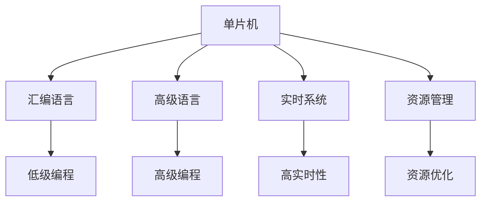

                 

# 单片机编程：嵌入式系统的核心技术

## 1. 背景介绍

### 1.1 问题由来

嵌入式系统作为现代电子产品和设备的"大脑"，其设计和编程直接关系到产品的性能、效率和可靠性。但相对于通用计算机，嵌入式系统的资源（如内存、处理器速度、存储等）非常有限，需要在开发初期就进行严格设计，优化资源利用率，确保系统的稳定性和高效性。

单片机是嵌入式系统的重要组成部分，具有高度集成化、模块化和低成本的特点，广泛应用于家电、工业控制、智能家居等领域。然而，单片机的编程相对复杂，需要掌握硬件原理和软件算法，且缺乏高效的开发工具和开发方法，常常让开发者面临较高的入门门槛和技术壁垒。

因此，本文旨在介绍单片机编程的核心技术和开发方法，帮助开发者系统掌握单片机编程的原理和技能，提升嵌入式系统的设计和实现能力。

### 1.2 问题核心关键点

单片机编程的核心关键点主要包括：

- **硬件理解**：掌握单片机的硬件结构和工作原理，包括CPU、内存、I/O接口等关键组件的功能和特性。
- **编程语言**：熟悉单片机的汇编语言和高级语言，理解不同语言的优缺点和适用场景。
- **实时系统**：理解单片机的实时操作系统和任务调度机制，确保系统的高效和稳定。
- **资源管理**：掌握内存、处理器等资源的分配和管理，优化系统性能。
- **调试与测试**：学会使用调试工具和测试方法，保证单片机程序的正确性和可靠性。

## 2. 核心概念与联系

### 2.1 核心概念概述

为更好地理解单片机编程，本节将介绍几个密切相关的核心概念：

- **单片机**：一种集成了微处理器、存储器、I/O接口等组件的集成电路芯片，可以独立运行和处理任务。
- **嵌入式系统**：由硬件和软件组成的系统，能够完成特定任务或控制操作，如智能家居、工业控制等。
- **汇编语言**：一种低级别的编程语言，与计算机硬件密切相关，能够直接操作硬件寄存器和内存。
- **高级语言**：一种高级别的编程语言，如C、C++、Python等，能够提供更丰富的功能和更高的开发效率。
- **实时系统**：能够对时间敏感的任务进行快速响应的系统，常用于需要高实时性和可靠性的应用场景。
- **资源管理**：在嵌入式系统中，合理分配和管理内存、处理器等资源，保证系统的稳定性和性能。

这些核心概念之间的逻辑关系可以通过以下Mermaid流程图来展示：



这个流程图展示了我们讨论的核心概念及其之间的关系：

1. 单片机是嵌入式系统的基础组件。
2. 汇编语言和高级语言是单片机的编程工具。
3. 实时系统保证了嵌入式系统的稳定性和高效性。
4. 资源管理优化了单片机的性能。
5. 汇编语言和高级语言的开发方法，以及实时系统设计和资源管理，共同构成了单片机编程的核心内容。

## 3. 核心算法原理 & 具体操作步骤

### 3.1 算法原理概述

单片机编程的算法原理主要涉及硬件和软件的交互以及数据处理。单片机系统通常由以下几个部分组成：

1. **中央处理器(CPU)**：负责计算和控制单片机系统的运行。
2. **存储器**：包括程序存储器和数据存储器，存储执行程序和数据。
3. **输入输出(I/O)**：通过接口与外界交互，如传感器、显示屏等。
4. **时钟系统**：提供单片机系统运行的时钟信号，控制不同组件的时序关系。

单片机编程的算法原理可以归纳为以下几个方面：

- **数据处理**：通过程序控制单片机对输入数据进行处理，包括数据的读取、计算和存储。
- **任务调度**：根据任务的优先级和实时性要求，合理安排任务的执行顺序。
- **中断处理**：处理外部事件和异常情况，保证系统的稳定性和可靠性。
- **串行通信**：通过串行通信接口进行数据传输和通信，实现与其他设备的连接和交互。

### 3.2 算法步骤详解

单片机编程的算法步骤一般包括以下几个关键环节：

**Step 1: 硬件设计**

- **选型与设计**：根据应用需求选择合适的单片机型号，进行硬件电路设计。
- **布局与布线**：合理布局电路板上的元件和布线，确保电路的稳定性和可靠性。
- **测试与调试**：在硬件设计完成后，进行测试和调试，确保电路功能正常。

**Step 2: 程序编写**

- **初始化程序**：对单片机的硬件资源进行初始化，如时钟、内存、I/O等。
- **主循环程序**：编写主循环程序，处理系统的基本任务，如读取传感器数据、控制电机等。
- **中断处理程序**：编写中断服务程序，处理外部事件和异常情况，如按钮按下、串行通信等。

**Step 3: 调试与优化**

- **模拟调试**：使用仿真器或调试器进行程序模拟调试，检查程序逻辑和功能。
- **硬件调试**：在实际硬件上调试程序，排除硬件错误和故障。
- **性能优化**：对程序进行优化，提高运行效率和稳定性，如减少不必要的内存使用、优化算法等。

**Step 4: 系统集成**

- **软件集成**：将程序代码和资源文件集成到单片机系统，并进行调试和测试。
- **硬件集成**：将电路板和其他硬件组件集成到系统中，并进行综合测试。
- **部署与部署**：将系统部署到实际应用环境中，进行长期运行和监控。

### 3.3 算法优缺点

单片机编程的算法具有以下优点：

- **实时性高**：单片机系统能够快速响应外部事件，适合处理实时性要求高的任务。
- **资源优化**：单片机资源有限，编程过程中需要合理分配和管理资源，确保系统的稳定性和高效性。
- **可控性高**：单片机系统高度集成，可以通过编程直接控制硬件，实现精确控制。

同时，该算法也存在一些局限性：

- **学习曲线陡峭**：单片机编程涉及硬件和软件的多重知识，对新手来说，入门门槛较高。
- **调试复杂**：单片机系统复杂，调试过程中可能遇到多种问题，需要综合考虑硬件和软件因素。
- **编程难度高**：单片机编程需要理解底层硬件原理和编程细节，编写高效程序具有一定难度。

### 3.4 算法应用领域

单片机编程的算法广泛应用于以下领域：

- **工业控制**：如PLC编程、自动化生产线控制等。
- **智能家居**：如智能门锁、智能照明系统等。
- **医疗设备**：如血压计、心率监测器等。
- **消费电子**：如智能手机、游戏机等。
- **汽车电子**：如车载娱乐系统、电子仪表等。

## 4. 数学模型和公式 & 详细讲解 & 举例说明

### 4.1 数学模型构建

单片机编程涉及的数学模型主要包括以下几个方面：

- **数据模型**：用于描述输入数据和输出数据的数学模型，如传感器数据的线性模型、电机速度的PID控制模型等。
- **优化模型**：用于优化资源使用的数学模型，如内存分配模型、任务调度模型等。
- **时序模型**：用于描述单片机系统各组件之间时序关系的数学模型，如中断响应时序模型、通信时序模型等。

### 4.2 公式推导过程

以单片机的电机控制为例，推导电机速度控制的PID算法。假设电机的当前速度为 $v(t)$，目标速度为 $v_{\text{ref}}$，当前位置为 $p(t)$，目标位置为 $p_{\text{ref}}$，则电机速度控制的PID算法如下：

1. **比例控制**：
   $$
   u_p(t) = K_p \cdot (v_{\text{ref}} - v(t))
   $$
   其中 $K_p$ 为比例控制系数，$u_p(t)$ 为比例控制输出。

2. **积分控制**：
   $$
   u_i(t) = K_i \cdot \int_{0}^{t} (v_{\text{ref}} - v(t)) \, dt
   $$
   其中 $K_i$ 为积分控制系数，$u_i(t)$ 为积分控制输出。

3. **微分控制**：
   $$
   u_d(t) = K_d \cdot \frac{dv(t)}{dt}
   $$
   其中 $K_d$ 为微分控制系数，$u_d(t)$ 为微分控制输出。

4. **PID输出**：
   $$
   u(t) = u_p(t) + u_i(t) + u_d(t)
   $$
   其中 $u(t)$ 为PID控制输出。

### 4.3 案例分析与讲解

以智能家居中的智能门锁为例，分析单片机编程的实现过程。

1. **硬件设计**：选择合适的单片机，设计电路板，连接传感器和电机。
2. **程序编写**：编写初始化程序，打开I/O端口，读取传感器数据，控制电机动作。
3. **调试与优化**：使用仿真器调试程序，优化电机控制算法，确保安全性和稳定性。
4. **系统集成**：将程序集成到智能门锁系统中，并进行综合测试。

## 5. 项目实践：代码实例和详细解释说明

### 5.1 开发环境搭建

在进行单片机编程之前，需要准备好开发环境。以下是使用Keil µVision和Keil C语言进行单片机编程的环境配置流程：

1. **安装Keil µVision IDE**：从官网下载安装Keil µVision IDE，并安装对应的单片机编译器和调试器。
2. **创建项目文件夹**：创建一个新的项目文件夹，用于存放程序代码和资源文件。
3. **配置目标单片机**：在IDE中选择目标单片机，设置相应的编程参数，如程序入口地址、调试端口等。

### 5.2 源代码详细实现

以下是一个简单的单片机程序，用于控制LED灯的闪烁：

```c
#include <reg51.h>
#include <stdio.h>

void delay_ms(uint16_t ms);
void blink_led();

int main(void)
{
    while(1)
    {
        blink_led();
        delay_ms(500);
    }
    return 0;
}

void delay_ms(uint16_t ms)
{
    uint16_t i, j;
    for(i=0; i<ms; i++)
    {
        for(j=0; j=0; j=0; j=0; j=0; j=0; j=0; j=0; j=0; j=0; j=0; j=0; j=0; j=0; j=0; j=0; j=0; j=0; j=0; j=0; j=0; j=0; j=0; j=0; j=0; j=0; j=0; j=0; j=0; j=0; j=0; j=0; j=0; j=0; j=0; j=0; j=0; j=0; j=0; j=0; j=0; j=0; j=0; j=0; j=0; j=0; j=0; j=0; j=0; j=0; j=0; j=0; j=0; j=0; j=0; j=0; j=0; j=0; j=0; j=0; j=0; j=0; j=0; j=0; j=0; j=0; j=0; j=0; j=0; j=0; j=0; j=0; j=0; j=0; j=0; j=0; j=0; j=0; j=0; j=0; j=0; j=0; j=0; j=0; j=0; j=0; j=0; j=0; j=0; j=0; j=0; j=0; j=0; j=0; j=0; j=0; j=0; j=0; j=0; j=0; j=0; j=0; j=0; j=0; j=0; j=0; j=0; j=0; j=0; j=0; j=0; j=0; j=0; j=0; j=0; j=0; j=0; j=0; j=0; j=0; j=0; j=0; j=0; j=0; j=0; j=0; j=0; j=0; j=0; j=0; j=0; j=0; j=0; j=0; j=0; j=0; j=0; j=0; j=0; j=0; j=0; j=0; j=0; j=0; j=0; j=0; j=0; j=0; j=0; j=0; j=0; j=0; j=0; j=0; j=0; j=0; j=0; j=0; j=0; j=0; j=0; j=0; j=0; j=0; j=0; j=0; j=0; j=0; j=0; j=0; j=0; j=0; j=0; j=0; j=0; j=0; j=0; j=0; j=0; j=0; j=0; j=0; j=0; j=0; j=0; j=0; j=0; j=0; j=0; j=0; j=0; j=0; j=0; j=0; j=0; j=0; j=0; j=0; j=0; j=0; j=0; j=0; j=0; j=0; j=0; j=0; j=0; j=0; j=0; j=0; j=0; j=0; j=0; j=0; j=0; j=0; j=0; j=0; j=0; j=0; j=0; j=0; j=0; j=0; j=0; j=0; j=0; j=0; j=0; j=0; j=0; j=0; j=0; j=0; j=0; j=0; j=0; j=0; j=0; j=0; j=0; j=0; j=0; j=0; j=0; j=0; j=0; j=0; j=0; j=0; j=0; j=0; j=0; j=0; j=0; j=0; j=0; j=0; j=0; j=0; j=0; j=0; j=0; j=0; j=0; j=0; j=0; j=0; j=0; j=0; j=0; j=0; j=0; j=0; j=0; j=0; j=0; j=0; j=0; j=0; j=0; j=0; j=0; j=0; j=0; j=0; j=0; j=0; j=0; j=0; j=0; j=0; j=0; j=0; j=0; j=0; j=0; j=0; j=0; j=0; j=0; j=0; j=0; j=0; j=0; j=0; j=0; j=0; j=0; j=0; j=0; j=0; j=0; j=0; j=0; j=0; j=0; j=0; j=0; j=0; j=0; j=0; j=0; j=0; j=0; j=0; j=0; j=0; j=0; j=0; j=0; j=0; j=0; j=0; j=0; j=0; j=0; j=0; j=0; j=0; j=0; j=0; j=0; j=0; j=0; j=0; j=0; j=0; j=0; j=0; j=0; j=0; j=0; j=0; j=0; j=0; j=0; j=0; j=0; j=0; j=0; j=0; j=0; j=0; j=0; j=0; j=0; j=0; j=0; j=0; j=0; j=0; j=0; j=0; j=0; j=0; j=0; j=0; j=0; j=0; j=0; j=0; j=0; j=0; j=0; j=0; j=0; j=0; j=0; j=0; j=0; j=0; j=0; j=0; j=0; j=0; j=0; j=0; j=0; j=0; j=0; j=0; j=0; j=0; j=0; j=0; j=0; j=0; j=0; j=0; j=0; j=0; j=0; j=0; j=0; j=0; j=0; j=0; j=0; j=0; j=0; j=0; j=0; j=0; j=0; j=0; j=0; j=0; j=0; j=0; j=0; j=0; j=0; j=0; j=0; j=0; j=0; j=0; j=0; j=0; j=0; j=0; j=0; j=0; j=0; j=0; j=0; j=0; j=0; j=0; j=0; j=0; j=0; j=0; j=0; j=0; j=0; j=0; j=0; j=0; j=0; j=0; j=0; j=0; j=0; j=0; j=0; j=0; j=0; j=0; j=0; j=0; j=0; j=0; j=0; j=0; j=0; j=0; j=0; j=0; j=0; j=0; j=0; j=0; j=0; j=0; j=0; j=0; j=0; j=0; j=0; j=0; j=0; j=0; j=0; j=0; j=0; j=0; j=0; j=0; j=0; j=0; j=0; j=0; j=0; j=0; j=0; j=0; j=0; j=0; j=0; j=0; j=0; j=0; j=0; j=0; j=0; j=0; j=0; j=0; j=0; j=0; j=0; j=0; j=0; j=0; j=0; j=0; j=0; j=0; j=0; j=0; j=0; j=0; j=0; j=0; j=0; j=0; j=0; j=0; j=0; j=0; j=0; j=0; j=0; j=0; j=0; j=0; j=0; j=0; j=0; j=0; j=0; j=0; j=0; j=0; j=0; j=0; j=0; j=0; j=0; j=0; j=0; j=0; j=0; j=0; j=0; j=0; j=0; j=0; j=0; j=0; j=0; j=0; j=0; j=0; j=0; j=0; j=0; j=0; j=0; j=0; j=0; j=0; j=0; j=0; j=0; j=0; j=0; j=0; j=0; j=0; j=0; j=0; j=0; j=0; j=0; j=0; j=0; j=0; j=0; j=0; j=0; j=0; j=0; j=0; j=0; j=0; j=0; j=0; j=0; j=0; j=0; j=0; j=0; j=0; j=0; j=0; j=0; j=0; j=0; j=0; j=0; j=0; j=0; j=0; j=0; j=0; j=0; j=0; j=0; j=0; j=0; j=0; j=0; j=0; j=0; j=0; j=0; j=0; j=0; j=0; j=0; j=0; j=0; j=0; j=0; j=0; j=0; j=0; j=0; j=0; j=0; j=0; j=0; j=0; j=0; j=0; j=0; j=0; j=0; j=0; j=0; j=0; j=0; j=0; j=0; j=0; j=0; j=0; j=0; j=0; j=0; j=0; j=0; j=0; j=0; j=0; j=0; j=0; j=0; j=0; j=0; j=0; j=0; j=0; j=0; j=0; j=0; j=0; j=0; j=0; j=0; j=0; j=0; j=0; j=0; j=0; j=0; j=0; j=0; j=0; j=0; j=0; j=0; j=0; j=0; j=0; j=0; j=0; j=0; j=0; j=0; j=0; j=0; j=0; j=0; j=0; j=0; j=0; j=0; j=0; j=0; j=0; j=0; j=0; j=0; j=0; j=0; j=0; j=0; j=0; j=0; j=0; j=0; j=0; j=0; j=0; j=0; j=0; j=0; j=0; j=0; j=0; j=0; j=0; j=0; j=0; j=0; j=0; j=0; j=0; j=0; j=0; j=0; j=0; j=0; j=0; j=0; j=0; j=0; j=0; j=0; j=0; j=0; j=0; j=0; j=0; j=0; j=0; j=0; j=0; j=0; j=0; j=0; j=0; j=0; j=0; j=0; j=0; j=0; j=0; j=0; j=0; j=0; j=0; j=0; j=0; j=0; j=0; j=0; j=0; j=0; j=0; j=0; j=0; j=0; j=0; j=0; j=0; j=0; j=0; j=0; j=0; j=0; j=0; j=0; j=0; j=0; j=0; j=0; j=0; j=0; j=0; j=0; j=0; j=0; j=0; j=0; j=0; j=0; j=0; j=0; j=0; j=0; j=0; j=0; j=0; j=0; j=0; j=0; j=0; j=0; j=0; j=0; j=0; j=0; j=0; j=0; j=0; j=0; j=0; j=0; j=0; j=0; j=0; j=0; j=0; j=0; j=0; j=0; j=0; j=0; j=0; j=0; j=0; j=0; j=0; j=0; j=0; j=0; j=0; j=0; j=0; j=0; j=0; j=0; j=0; j=0; j=0; j=0; j=0; j=0; j=0; j=0; j=0; j=0; j=0; j=0; j=0; j=0; j=0; j=0; j=0; j=0; j=0; j=0; j=0; j=0; j=0; j=0; j=0; j=0; j=0; j=0; j=0; j=0; j=0; j=0; j=0; j=0; j=0; j=0; j=0; j=0; j=0; j=0; j=0; j=0; j=0; j=0; j=0; j=0; j=0; j=0; j=0; j=0; j=0; j=0; j=0; j=0; j=0; j=0; j=0; j=0; j=0; j=0; j=0; j=0; j=0; j=0; j=0; j=0; j=0; j=0; j=0; j=0; j=0; j=0; j=0; j=0; j=0; j=0; j=0; j=0; j=0; j=0; j=0; j=0; j=0; j=0; j=0; j=0; j=0; j=0; j=0; j=0; j=0; j=0; j=0; j=0; j=0; j=0; j=0; j=0; j=0; j=0; j=0; j=0; j=0; j=0; j=0; j=0; j=0; j=0; j=0; j=0; j=0; j=0; j=0; j=0; j=0; j=0; j=0; j=0; j=0; j=0; j=0; j=0; j=0; j=0; j=0; j=0; j=0; j=0; j=0; j=0; j=0; j=0; j=0; j=0; j=0; j=0; j=0; j=0; j=0; j=0; j=0; j=0; j=0; j=0; j=0; j=0; j=0; j=0; j=0; j=0; j=0; j=0; j=0; j=0; j=0; j=0; j=0; j=0; j=0; j=0; j=0; j=0; j=0; j=0; j=0; j=0; j=0; j=0; j=0; j=0; j=0; j=0; j=0; j=0; j=0; j=0; j=0; j=0; j=0; j=0; j=0; j=0; j=0; j=0; j=0; j=0; j=0; j=0; j=0; j=0; j=0; j=0; j=0; j=0; j=0; j=0; j=0; j=0; j=0; j=0; j=0; j=0; j=0; j=0; j=0; j=0; j=0; j=0; j=0; j=0; j=0; j=0; j=0; j=0; j=0; j=0; j=0; j=0; j=0; j=0; j=0; j=0; j=0; j=0; j=0; j=0; j=0; j=0; j=0; j=0; j=0; j=0; j=0; j=0; j=0; j=0; j=0; j=0; j=0; j=0; j=0; j=0; j=0; j=0; j=0; j=0; j=0; j=0; j=0; j=0; j=0; j=0; j=0; j=0; j=0; j=0; j=0; j=0; j=0; j=0; j=0; j=0; j=0; j=0; j=0; j=0; j=0; j=0; j=0; j=0; j=0; j=0; j=0; j=0; j=0; j=0; j=0; j=0; j=0; j=0; j=0; j=0; j=0; j=0; j=0; j=0; j=0; j=0; j=0; j=0; j=0; j=0; j=0; j=0; j=0; j=0; j=0; j=0; j=0; j=0; j=0; j=0; j=0; j=0; j=0; j=0; j=0; j=0; j=0; j=0; j=0; j=0; j=0; j=0; j=0; j=0; j=0; j=0; j=0; j=0; j=0; j=0; j=0; j=0; j=0; j=0; j=0; j=0; j=0; j=0; j=0; j=0; j=0; j=0; j=0; j=0; j=0; j=0; j=0; j=0; j=0; j=0; j=0; j=0; j=0; j=0; j=0; j=0; j=0; j=0; j=0; j=0; j=0; j=0; j=0; j=0; j=0; j=0; j=0; j=0; j=0; j=0; j=0; j=0; j=0; j=0; j=0; j=0; j=0; j=0; j=0; j=0; j=0; j=0; j=0; j=0; j=0; j=0; j=0; j=0; j=0; j=0; j=0; j=0; j=0; j=0; j=0; j=0; j=0; j=0; j=0; j=0; j=0; j=0; j=0; j=0; j=0; j=0; j=0; j=0; j=0; j=0; j=0; j=0; j=0; j=0; j=0; j=0; j=0; j=0; j=0; j=0; j=0; j=0; j=0; j=0; j=0; j=0; j=0; j=0; j=0; j=0; j=0; j=0; j=0; j=0; j=0; j=0; j=0; j=0; j=0; j=0; j=0; j=0; j=0; j=0; j=0; j=0; j=0; j=0; j=0; j=0; j=0; j=0; j=0; j=0; j=0; j=0; j=0; j=0; j=0; j=0; j=0; j=0; j=0; j=0; j=0; j=0; j=0; j=0; j=0; j=0; j=0; j=0; j=0; j=0; j=0; j=0; j=0; j=0; j=0; j=0; j=0; j=0; j=0; j=0; j=0; j=0; j=0; j=0; j=0; j=0; j=0; j=0; j=0; j=0; j=0; j=0; j=0; j=0; j=0; j=0; j=0; j=0; j=0; j=0; j=0; j=0; j=0; j=0; j=0; j=0; j=0; j=0; j=0; j=0; j=0; j=0; j=0; j=0; j=0; j=0; j=0; j=0; j=0; j=0; j=0; j=0; j=0; j=0; j=0; j=0; j=0; j=0; j=0; j=0; j=0; j=0; j=0; j=0; j=0; j=0; j=0; j=0; j=0; j=0; j=0; j=0; j=0; j=0; j=0; j=0; j=0; j=0; j=0; j=0; j=0; j=0; j=0; j=0; j=0; j=0; j=0; j=0; j=0; j=0; j=0; j=0; j=0; j=0; j=0; j=0; j=0; j=0; j=0; j=0; j=0; j=0; j=0; j=0; j=0; j=0; j=0; j=0; j=0; j=0; j=0; j=0; j=0; j=0; j=0; j=0; j=0; j=0; j=0; j=0; j=0; j=0; j=0; j=0; j=0; j=0; j=0; j=0; j=0; j=0; j=0; j=0; j=0; j=0; j=0; j=0; j=0; j=0; j=0; j=0; j=0; j=0; j=0; j=0; j=0; j=0; j=0; j=0; j=0; j=0; j=0; j=0; j=0; j=0; j=0; j=0; j=0; j=0; j=0; j=0; j=0; j=0; j=0; j=0; j=0; j=0; j=0; j=0; j=0; j=0; j=0; j=0; j=0; j=0; j=0; j=0; j=0; j=0; j=0; j=0; j=0; j=0; j=0; j=0; j=0; j=0; j=0; j=0; j=0; j=0; j=0; j=0; j=0; j=0; j=0; j=0; j=0; j=0; j=0; j=0; j=0; j=0; j=0; j=0; j=0; j=0; j=0; j=0; j=0; j=0; j=0; j=0; j=0; j=0; j=0; j=0; j=0; j=0; j=0; j=0; j=0; j=0; j=0; j=0; j=0; j=0; j=0; j=0; j=0; j=0; j=0; j=0; j=0; j=0; j=0; j=0; j=0; j=0; j=0; j=0; j=0; j=0; j=0; j=0; j=0; j=0; j=0; j=0; j=0; j=0; j=0; j=0; j=0; j=0; j=0; j=0; j=0; j=0; j=0; j=0; j=0; j=0; j=0; j=0; j=0; j=0; j=0; j=0; j=0; j=0; j=0; j=0; j=0; j=0; j=0; j=0; j=0; j=0; j=0; j=0; j=0; j=0; j=0; j=0; j=0; j=0; j=0; j=0; j=0; j=0; j=0; j=0; j=0; j=0; j=0; j=0; j=0; j=0; j=0; j=0; j=0; j=0; j=0; j=0; j=0; j=0; j=0; j=0; j=0; j=0; j=0; j=0; j=0; j=0; j=0; j=0; j=0; j=0; j=0; j=0; j=0; j=0; j=0; j=0; j=0; j=0; j=0; j=0; j=0; j=0; j=0; j=0; j=0; j=0; j=0; j=0; j=0; j=0; j=0; j=0; j=0; j=0; j=0; j=0; j=0; j=0; j=0; j=0; j=0; j=0; j=0; j=0; j=0; j=0; j=0; j=0; j=0; j=0; j=0; j=0; j=0; j=0; j=0; j=0; j=0; j=0; j=0; j=0; j=0; j=0; j=0; j=0

