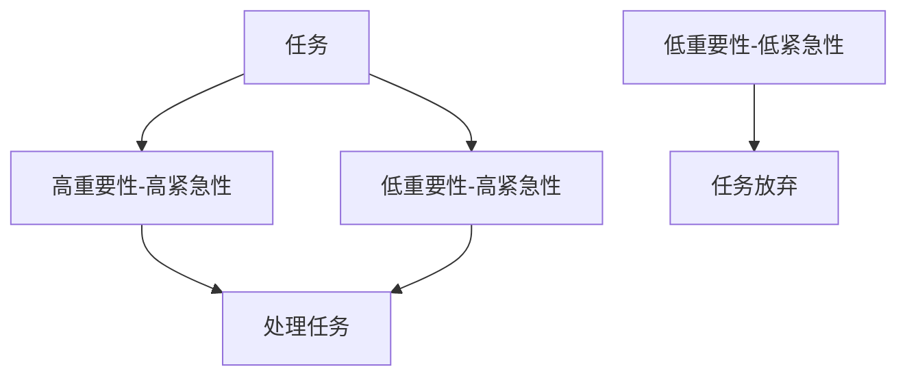

                 

# 双目标清单法助你专注最重要的工作

> 关键词：目标管理, 双目标清单, 时间管理, 优先级排序, 工作效能提升, 专注力训练, 自我管理工具

## 1. 背景介绍

在繁忙的工作和生活中，我们经常面临大量任务，但受限于时间、资源和精力，无法同时处理所有事情。如何在有限的时间内，合理分配精力，高效完成最重要的工作？本文将介绍一种实用的方法——双目标清单法，帮助你在工作中优先处理最重要的任务，提升工作效能。

## 2. 核心概念与联系

### 2.1 核心概念概述

双目标清单法（Double Target Checklist）是一种高效的时间管理工具，它基于“鱼与熊掌不可兼得”的原则，帮助你在完成重要工作的同时，也要考虑到任务完成的质量。该方法将任务分为两种目标，即“高重要性-高紧急性”和“低重要性-高紧急性”的任务，帮助你优先处理对工作或生活影响最大的事情，确保时间和精力的高效利用。

### 2.2 核心概念原理和架构

双目标清单法的核心原理在于任务的双重属性分类。通过将任务划分为高重要性-高紧急性和低重要性-高紧急性两类，我们能够清晰地识别和处理工作中最重要、最紧急的任务，从而提升整体工作效率。

使用Mermaid流程图表表示任务分类和优先级处理流程如下：

## 3. 核心算法原理 & 具体操作步骤

### 3.1 算法原理概述

双目标清单法主要基于任务的双重属性（即重要性和紧急性）进行优先级排序，通过分析任务对工作或生活的影响，确定应优先处理的任务。该方法的核心在于准确评估任务的这两个维度，以便在有限时间内，集中精力完成最重要的工作。

### 3.2 算法步骤详解

1. **任务收集**：列出所有需要完成的任务。可以包括工作任务、家庭事务、学习目标等。

2. **任务评估**：
   - 评估任务的重要性和紧急性。重要性可以通过对任务对工作或生活影响的评估来确定，紧急性则通常由任务的截止日期或其他时间限制决定。
   - 给每个任务打分，一般采用1-5分制，5分表示高重要性/高紧急性。

3. **分类排序**：
   - 将任务按照重要性和紧急性分成两类：高重要性-高紧急性和低重要性-高紧急性。
   - 处理高重要性-高紧急性的任务，确保其按时完成。
   - 对低重要性-高紧急性的任务，尽量快速处理，但也可以考虑委派他人或设定稍后处理时间。

4. **执行与调整**：
   - 根据分类和排序，制定每日、每周的工作计划。
   - 在执行过程中，随时调整任务的优先级，确保最重要的任务始终得到优先处理。

### 3.3 算法优缺点

**优点**：
- 简单高效：方法简单易懂，适用于各种工作场景。
- 聚焦重要任务：通过明确分类和排序，帮助集中精力完成最重要的工作。
- 灵活调整：可以根据实际情况动态调整任务优先级，确保工作计划的有效性。

**缺点**：
- 可能需要较长时间来初始化任务清单。
- 对于低重要性-低紧急性的任务，可能忽略了一些不必要的任务。
- 高度依赖于任务评估的准确性。

### 3.4 算法应用领域

双目标清单法在多个领域都有广泛应用，包括但不限于：
- 项目管理：帮助项目经理优先处理最重要的项目任务，确保项目顺利完成。
- 个人生活：帮助个人合理安排日常事务，平衡工作与生活。
- 企业运营：帮助企业高层决策者优先处理对公司战略影响最大的任务。

## 4. 数学模型和公式 & 详细讲解 & 举例说明

### 4.1 数学模型构建

假设任务集合为 $T=\{t_1, t_2, \dots, t_n\}$，每个任务 $t_i$ 的重要性和紧急性可以通过以下公式进行评估：

$$
I(t_i) = \text{评分}(t_i) \\
E(t_i) = \frac{1}{1+|T_i - D|}
$$

其中，$I(t_i)$ 表示任务 $t_i$ 的重要性，$E(t_i)$ 表示任务的紧急性，$T_i$ 表示任务的截止日期，$D$ 表示当前日期。

### 4.2 公式推导过程

1. **重要性评估**：
   - 假设任务 $t_i$ 的评分通过专家评估或自我评估得到，记为 $I(t_i)$。
   - $I(t_i) \in [1,5]$，其中1表示最低重要性，5表示最高重要性。

2. **紧急性评估**：
   - 假设任务 $t_i$ 的截止日期为 $T_i$，当前日期为 $D$。
   - 紧急性 $E(t_i)$ 定义为 $1/(1+|T_i - D|)$，即截止日期越近，紧急性越高。
   - 当 $T_i = D$ 时，$E(t_i) = 1$。
   - 当 $T_i \to -\infty$ 时，$E(t_i) \to 0$。

### 4.3 案例分析与讲解

假设某工作日待办任务如下：
- 高重要性-高紧急性：项目报告撰写，截止日期为明天；
- 低重要性-高紧急性：回复邮件，截止时间为下午2点；
- 低重要性-低紧急性：阅读行业新闻。

根据双目标清单法，我们首先处理高重要性-高紧急性的项目报告撰写，其次处理低重要性-高紧急性的邮件回复，最后阅读行业新闻。这样可以确保最重要的任务得到优先处理。

## 5. 项目实践：代码实例和详细解释说明

### 5.1 开发环境搭建

要实现双目标清单法，可以使用Excel、Google Sheets、Notion等工具。这里以Excel为例进行说明。

1. 打开Excel，创建一张新表格。
2. 在第一列输入任务名称。
3. 在第二列输入任务评分（1-5分）。
4. 在第三列输入截止日期。
5. 在第四列计算紧急性评分。

### 5.2 源代码详细实现

由于Excel和Google Sheets等工具自带计算功能，无需编写代码。只需在表格中填入任务信息，利用公式进行自动计算即可。

### 5.3 代码解读与分析

代码解读与分析不在此节展开，主要通过Excel的公式功能完成。

### 5.4 运行结果展示

在表格中填入任务信息后，紧急性评分将自动计算出来。例如，对于高重要性-高紧急性的任务，紧急性评分为1，表示任务非常紧急，需要优先处理。

## 6. 实际应用场景

### 6.1 项目管理

在项目管理中，双目标清单法可以帮助项目经理识别和处理最重要的项目任务。例如，在项目进展会议上，根据任务的重要性和紧急性，优先安排最重要的项目任务，确保项目按时完成。

### 6.2 个人生活

个人生活中，双目标清单法可以帮助我们合理安排时间，平衡工作与生活。例如，在每天结束时，回顾当天任务完成情况，标记哪些是高重要性-高紧急性任务，哪些是低重要性-高紧急性任务，以便次日调整优先级。

### 6.3 企业运营

企业高层决策者可以利用双目标清单法，识别和处理对公司战略影响最大的任务。例如，在季度会议中，评估各部门的紧急性和重要性任务，优先安排关键项目，确保公司战略目标的实现。

## 7. 工具和资源推荐

### 7.1 学习资源推荐

1. **《Getting Things Done: The Art of Stress-Free Productivity》**：戴维·艾伦（David Allen）的经典著作，详细介绍了目标管理方法。
2. **《The 7 Habits of Highly Effective People》**：史蒂芬·柯维（Stephen Covey）的著作，强调时间管理和优先级排序的重要性。
3. **《Atomic Habits》**：詹姆斯·克利尔（James Clear）的著作，帮助建立好习惯，提升工作效能。

### 7.2 开发工具推荐

1. **Microsoft Excel**：功能强大，适用于复杂任务分类和计算。
2. **Google Sheets**：在线协作，方便团队成员共同编辑和查看任务清单。
3. **Trello**：基于看板的项目管理工具，支持任务分类和优先级排序。

### 7.3 相关论文推荐

1. **《Effective Decision Making: Towards a New Science of Organizational Decisions》**：迈克尔·斯科特（Michael Scott）的研究，探讨了如何通过任务优先级提升决策效率。
2. **《Goal-Setting Theory: A Meta-Analytic Review and Theoretical Integration》**：爱德华·洛克（Edward Locke）的研究，详细分析了目标设置理论对工作表现的影响。

## 8. 总结：未来发展趋势与挑战

### 8.1 研究成果总结

双目标清单法作为一种简单高效的时间管理工具，已在多个领域得到广泛应用。它帮助人们优先处理最重要的任务，提升工作效率和生活质量。未来，该方法将进一步与人工智能技术结合，实现动态任务优先级调整，提升工作管理智能化水平。

### 8.2 未来发展趋势

1. **智能化任务分类**：结合机器学习技术，自动评估任务的重要性和紧急性，提升任务分类的准确性。
2. **动态优先级调整**：根据实时数据和任务进展，动态调整任务优先级，确保资源高效利用。
3. **多维度任务评估**：引入更多维度（如任务完成难度、时间消耗等）进行任务评估，提升任务分类的全面性。

### 8.3 面临的挑战

1. **任务评估准确性**：任务评估的准确性直接影响方法的有效性。如何设计有效的评估标准，是一个重要挑战。
2. **任务分类复杂性**：对于复杂项目，任务分类可能存在多维度冲突，如何合理处理冲突，是一个重要问题。
3. **技术整合难度**：将双目标清单法与智能化技术结合，需要解决技术整合和系统集成的问题。

### 8.4 研究展望

未来，双目标清单法将在多个领域进一步发展，如跨团队任务管理、项目风险评估等。结合人工智能和物联网技术，将进一步提升任务管理的智能化和自动化水平，推动任务管理科学的发展。

## 9. 附录：常见问题与解答

**Q1：如何使用双目标清单法进行任务分类？**

A: 根据任务的重要性和紧急性进行分类。一般使用1-5分制进行评分，5分表示高重要性/高紧急性。将任务划分为高重要性-高紧急性和低重要性-高紧急性两类。

**Q2：如何处理任务优先级冲突？**

A: 当任务存在多维度冲突时，可以采用如下策略：
1. 建立优先级矩阵，对不同维度的任务优先级进行比较。
2. 引入专家评审机制，综合多方面意见进行决策。
3. 采用随机化方法，根据概率决定优先级。

**Q3：双目标清单法是否适用于所有任务？**

A: 双目标清单法适用于大多数任务，但不适用于非常紧急且不重要的小任务。对于这些任务，可以考虑委派他人处理。

**Q4：如何在任务管理中应用双目标清单法？**

A: 在每日/每周任务计划中，根据任务的重要性和紧急性进行优先级排序。优先处理高重要性-高紧急性的任务，其次是低重要性-高紧急性的任务。确保最重要的任务得到优先处理。

---

作者：禅与计算机程序设计艺术 / Zen and the Art of Computer Programming

