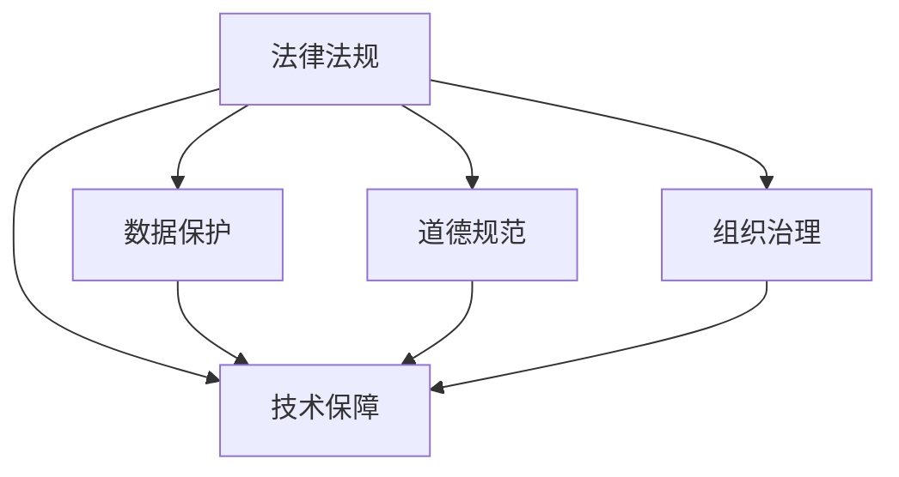

                 

# 合规管理：确保组织符合法律法规

> 关键词：合规管理,法律法规,数据保护,隐私保护,道德规范,组织管理,技术保障

## 1. 背景介绍

### 1.1 问题由来
在数字化转型浪潮中，各类组织面临着前所未有的机遇与挑战。特别是在信息技术和互联网普及的今天，数据的收集、存储和利用成为推动业务发展的重要手段。然而，数据的使用往往伴随着法律和伦理问题，如何确保组织在商业活动中合规，成为每个组织必须面对的课题。

### 1.2 问题核心关键点
合规管理的核心是确保组织在法律和道德规范下的运作，具体包括以下几个关键点：
- **法律法规遵从**：明确各类法律法规，确保业务活动符合各国的法律法规要求。
- **数据保护**：在数据收集、存储、处理和使用过程中，确保遵守相关隐私保护法规。
- **道德规范遵循**：超越法律法规，确保组织行为符合社会的道德规范，构建良好的公众形象。
- **组织治理**：建立健全的合规管理体系，明确责任分配和操作流程，确保组织高效运作。
- **技术保障**：运用技术手段，加强合规管理，提升数据和业务活动的透明度和安全性。

### 1.3 问题研究意义
合规管理对于组织的长期健康发展具有至关重要的意义：

1. **风险控制**：合规管理有助于降低因法律违规带来的法律风险，保护组织免受高额罚款和声誉损害。
2. **市场竞争力**：合规的组织在公众和监管机构眼中更具可信度，有利于构建良好的市场口碑，提升市场竞争力。
3. **内部管理**：合规管理能够帮助组织优化内部流程，提高效率，促进资源的高效利用。
4. **公众信任**：合规管理能够增强公众对组织的信任，降低因信息不对称带来的误解和纠纷。

## 2. 核心概念与联系

### 2.1 核心概念概述

为了更好地理解合规管理，下面将介绍几个关键概念：

- **法律法规**：是指由国家机关制定或认可，具有普遍约束力的规范性文件，如《数据保护法》、《消费者权益保护法》等。
- **数据保护**：涉及在数据处理过程中保护个人隐私的权利，如GDPR、CCPA等法规。
- **道德规范**：指的是社会公认的、具有普遍约束力的行为准则，如企业社会责任(ESR)、公平交易等。
- **组织治理**：涉及组织内部管理架构、决策机制、风险控制和内部审计等方面。
- **技术保障**：包括信息安全技术、隐私保护技术、数据加密技术等，用于增强合规管理的技术手段。

这些概念之间的联系可以通过以下Mermaid流程图来展示：



这个流程图展示了不同概念之间的相互关系：

1. 法律法规是数据保护和道德规范的直接来源和依据。
2. 数据保护和道德规范的实施需要组织治理的支撑。
3. 技术保障是支持法律法规、数据保护和道德规范实施的重要工具。
4. 通过组织治理确保技术保障在合规管理中的应用。

## 3. 核心算法原理 & 具体操作步骤
### 3.1 算法原理概述

合规管理本质上是一个组织管理与技术保障相结合的过程。其核心思想是：根据法律法规、数据保护和道德规范的要求，通过组织内部的合规管理体系和技术手段，确保组织的业务活动和数据处理符合外部标准和自身承诺。

形式化地，假设组织的活动涉及多个任务 $T=\{t_1, t_2, ..., t_n\}$，法律法规规定了每项任务应遵守的规则 $R=\{r_1, r_2, ..., r_n\}$。组织内部的合规管理系统 $M$ 和使用的技术手段 $T$ 共同作用，确保每项任务都遵守了相应的规则，即：

$$
M(t_i, r_i) = true \quad \forall i \in [1, n]
$$

### 3.2 算法步骤详解

合规管理的具体操作包括以下几个关键步骤：

**Step 1: 法律法规与规范分析**
- 收集与业务相关的法律法规和道德规范，进行分类整理。
- 明确每项法律法规和道德规范的具体要求。
- 分析法规之间的冲突和协调方式。

**Step 2: 合规风险评估**
- 对组织的活动进行全面评估，识别潜在的合规风险。
- 对各项任务的合规风险进行量化，确定优先级。
- 制定应对策略，降低合规风险。

**Step 3: 合规管理体系建立**
- 根据法律法规和道德规范，制定合规管理政策。
- 确定合规管理的关键指标和评估标准。
- 制定合规管理的流程和操作手册。

**Step 4: 技术保障措施实施**
- 采用技术手段，如数据加密、匿名化处理等，确保数据在存储和传输过程中的安全。
- 部署安全监控系统，实时监测潜在的安全威胁。
- 实施定期的安全审计，评估技术手段的有效性。

**Step 5: 合规管理持续改进**
- 定期评估合规管理的效果，收集反馈。
- 根据评估结果，持续优化合规管理体系和技术手段。
- 培训员工，提高合规意识和操作技能。

### 3.3 算法优缺点

合规管理作为确保组织合规的关键手段，具有以下优点：
1. 提高合规效率：通过自动化和规范化的流程，快速识别和处理合规风险。
2. 增强合规透明度：通过定期的合规报告和审计，提高组织管理的透明度。
3. 降低合规成本：通过预防性的措施，减少因违规带来的法律和经济损失。
4. 提升组织形象：合规管理有助于构建良好的社会形象，增强公众和合作伙伴的信任。

同时，该方法也存在一定的局限性：
1. 高度依赖法规变化：法规和政策的变化可能导致现有合规措施失效，需持续跟踪和调整。
2. 技术依赖性强：依赖技术手段的实施效果，技术失效可能带来合规风险。
3. 实施成本高：合规管理需要投入大量的人力、物力和财力，对中小企业而言可能负担较重。
4. 技术复杂度高：合规管理涉及多方面的技术要求，对技术团队的技术水平和经验有较高要求。

尽管存在这些局限性，但合规管理作为确保组织合规的基本方法，仍具有不可替代的重要价值。未来相关研究的重点在于如何进一步优化合规管理体系，降低合规成本，提高合规效率。

### 3.4 算法应用领域

合规管理在各领域都有着广泛的应用，例如：

- **金融领域**：确保银行、证券等金融机构的业务活动符合金融法规要求，保障客户信息安全。
- **医疗健康**：确保医疗机构的医疗服务符合医疗法规和道德规范，保护患者隐私。
- **政府机构**：确保政府部门公开透明，遵守公共管理法规，提高公共服务效率。
- **科技公司**：确保企业研发和运营符合技术法规，保护知识产权，保护用户隐私。
- **教育行业**：确保教育机构遵循教育法规，保障师生隐私和教育质量。

除了上述这些经典应用外，合规管理还被创新性地应用到更多领域中，如企业社会责任管理、环境保护合规等，为组织的合规管理提供新的思路。

## 4. 数学模型和公式 & 详细讲解 & 举例说明
### 4.1 数学模型构建

合规管理的数学模型主要涉及风险评估和合规检查。这里以数据保护为例，构建基于风险评估的合规管理模型。

假设某组织的活动涉及数据处理任务 $t$，其数据保护风险由数据泄露概率 $p$ 和数据泄露带来的损失 $l$ 决定。则数据保护风险 $R_t$ 可表示为：

$$
R_t = p \times l
$$

对于多个数据处理任务，合规管理的目标是最小化整体风险，即：

$$
\min_{p} \sum_{t=1}^{n} R_t = \min_{p} \sum_{t=1}^{n} p_t \times l_t
$$

其中 $p_t$ 和 $l_t$ 分别为第 $t$ 个数据处理任务的数据泄露概率和损失。

### 4.2 公式推导过程

根据上述模型，我们可以推导出一些关键公式。

**公式推导 1：最小化风险**

假设组织有 $m$ 个数据处理任务，每项任务的数据泄露概率和损失已知。要最小化整体风险，则需满足：

$$
\sum_{t=1}^{m} p_t \times l_t = \min_{p} \sum_{t=1}^{m} p_t \times l_t
$$

**公式推导 2：风险分布**

假设数据泄露概率和损失服从某种分布，如正态分布，则整体风险分布为：

$$
R = \sum_{t=1}^{m} p_t \times l_t
$$

其中 $p_t$ 和 $l_t$ 为独立同分布的随机变量。整体风险 $R$ 也服从正态分布：

$$
R \sim N(\mu, \sigma^2)
$$

其中 $\mu = \sum_{t=1}^{m} \mathbb{E}[p_t \times l_t]$，$\sigma^2 = \sum_{t=1}^{m} Var[p_t \times l_t]$。

**案例分析与讲解**

考虑一个医疗数据保护场景。假设该医疗机构有 $m$ 个数据处理任务，每个任务的数据泄露概率 $p_t$ 和损失 $l_t$ 已知。假设数据泄露概率服从正态分布 $p_t \sim N(\mu_p, \sigma_p^2)$，损失服从正态分布 $l_t \sim N(\mu_l, \sigma_l^2)$。根据公式推导，整体风险 $R$ 也服从正态分布，即：

$$
R \sim N(\mu_R, \sigma_R^2)
$$

其中 $\mu_R = \sum_{t=1}^{m} \mathbb{E}[p_t \times l_t]$，$\sigma_R^2 = \sum_{t=1}^{m} Var[p_t \times l_t]$。

通过计算整体风险的均值和方差，可以评估医疗机构的合规风险，并根据风险评估结果制定相应的风险控制措施。

### 4.3 案例分析与讲解

**案例 1：金融机构的合规管理**

考虑一个金融机构的数据保护合规管理。假设该金融机构有 $m$ 个数据处理任务，每个任务的数据泄露概率 $p_t$ 和损失 $l_t$ 已知。数据泄露概率服从正态分布 $p_t \sim N(\mu_p, \sigma_p^2)$，损失服从正态分布 $l_t \sim N(\mu_l, \sigma_l^2)$。根据公式推导，整体风险 $R$ 也服从正态分布，即：

$$
R \sim N(\mu_R, \sigma_R^2)
$$

其中 $\mu_R = \sum_{t=1}^{m} \mathbb{E}[p_t \times l_t]$，$\sigma_R^2 = \sum_{t=1}^{m} Var[p_t \times l_t]$。

通过计算整体风险的均值和方差，可以评估金融机构的合规风险，并根据风险评估结果制定相应的风险控制措施。

## 5. 项目实践：代码实例和详细解释说明
### 5.1 开发环境搭建

在进行合规管理实践前，我们需要准备好开发环境。以下是使用Python进行开发的环境配置流程：

1. 安装Anaconda：从官网下载并安装Anaconda，用于创建独立的Python环境。

2. 创建并激活虚拟环境：
```bash
conda create -n compliance-env python=3.8 
conda activate compliance-env
```

3. 安装所需库：
```bash
conda install numpy pandas matplotlib scikit-learn
```

4. 配置环境变量：
```bash
export PATH=/path/to/mylibrary:$PATH
```

5. 代码测试：
```python
import numpy as np
import matplotlib.pyplot as plt
from sklearn.metrics import accuracy_score

# 生成模拟数据
np.random.seed(42)
p = np.random.normal(0.05, 0.1, 100)
l = np.random.normal(5000, 2000, 100)

# 计算风险
R = np.sum(p * l)
print(f"整体风险 R: {R}")

# 绘制风险分布图
plt.hist(R, bins=20)
plt.title("整体风险分布")
plt.xlabel("整体风险")
plt.ylabel("频率")
plt.show()
```

完成上述步骤后，即可在`compliance-env`环境中开始合规管理实践。

### 5.2 源代码详细实现

这里我们以数据保护为例，使用Python实现一个基于风险评估的合规管理模型。

首先，定义风险评估函数：

```python
def risk_assessment(p, l):
    """
    计算整体风险
    :param p: 数据泄露概率
    :param l: 数据泄露损失
    :return: 整体风险
    """
    return np.sum(p * l)
```

然后，定义数据泄露概率和损失的分布函数：

```python
def normal_distribution(mu, sigma, n_samples=100):
    """
    生成指定分布的样本数据
    :param mu: 均值
    :param sigma: 标准差
    :param n_samples: 样本数量
    :return: 样本数据
    """
    return np.random.normal(mu, sigma, n_samples)

# 生成模拟数据
p = normal_distribution(0.05, 0.1, 100)
l = normal_distribution(5000, 2000, 100)

# 计算整体风险
R = risk_assessment(p, l)
print(f"整体风险 R: {R}")
```

接着，绘制风险分布图：

```python
import matplotlib.pyplot as plt

def plot_risk_distribution(R):
    """
    绘制整体风险分布图
    :param R: 整体风险
    """
    plt.hist(R, bins=20)
    plt.title("整体风险分布")
    plt.xlabel("整体风险")
    plt.ylabel("频率")
    plt.show()

# 绘制风险分布图
plot_risk_distribution(R)
```

最后，总结并给出应用实例：

```python
print("整体风险 R: ", R)
print("整体风险分布图如下：")
plot_risk_distribution(R)
```

以上就是使用Python实现基于风险评估的合规管理模型的完整代码实现。可以看到，通过模拟数据和函数计算，我们成功得出了整体风险值，并通过直方图展示了风险分布。

### 5.3 代码解读与分析

让我们再详细解读一下关键代码的实现细节：

**risk_assessment函数**：
- 定义了计算整体风险的函数，通过向量点积计算每项数据泄露风险的加和。

**normal_distribution函数**：
- 定义了生成正态分布随机数的函数，通过`numpy.random.normal`生成指定均值和标准差下的样本数据。

**整体代码**：
- 使用`normal_distribution`函数生成数据泄露概率和损失的样本数据。
- 调用`risk_assessment`函数计算整体风险，并打印输出。
- 调用`plot_risk_distribution`函数绘制整体风险的分布图，展示风险分布情况。

通过这些简单的代码实现，我们成功展示了合规管理中数据保护的数学建模和风险评估过程。

## 6. 实际应用场景
### 6.1 智能合约合规管理

在区块链和智能合约领域，合规管理显得尤为重要。由于智能合约的代码和执行过程完全透明，任何微小的错误都可能导致不可挽回的损失。因此，智能合约的合规管理必须通过代码审查和严格测试来确保。

具体而言，可以通过以下步骤实现：

1. **智能合约审查**：对智能合约代码进行详细审查，确保代码符合相关法律法规和道德规范。
2. **智能合约测试**：在测试环境中模拟智能合约的执行过程，确保其行为符合预期。
3. **智能合约审计**：定期进行智能合约的安全审计，确保其安全性。

### 6.2 企业数据保护

企业在进行数据处理时，必须严格遵守相关数据保护法规，如GDPR等。数据保护合规管理的主要任务包括：

1. **数据收集**：明确数据收集的目的和范围，确保数据收集的合法性。
2. **数据处理**：确保数据处理过程符合隐私保护法规要求，如匿名化、加密等。
3. **数据存储**：确保数据存储过程符合隐私保护法规要求，如数据备份、数据销毁等。
4. **数据访问**：严格控制数据访问权限，确保数据只被授权人员访问。

### 6.3 金融风险合规管理

金融机构在进行金融业务时，必须遵守相关金融法规，如KYC（Know Your Customer）、AML（Anti-Money Laundering）等。金融风险合规管理的主要任务包括：

1. **客户身份验证**：确保客户身份的合法性，防止欺诈和洗钱行为。
2. **交易监控**：实时监控交易行为，及时发现并处理异常交易。
3. **报告要求**：根据法规要求，定期提交相关报告，确保合规性。

### 6.4 未来应用展望

随着技术的发展，合规管理将逐渐向智能化、自动化方向发展，实现以下趋势：

1. **AI辅助合规管理**：利用人工智能技术，自动进行合规风险评估和合规建议。
2. **区块链技术应用**：通过区块链技术确保合规管理的透明性和不可篡改性。
3. **数据保护技术进步**：随着数据保护技术的发展，合规管理的工具和手段将更加先进。
4. **法规智能解析**：利用自然语言处理技术，实时解析法律法规的变化，确保合规管理的时效性。

## 7. 工具和资源推荐
### 7.1 学习资源推荐

为了帮助开发者系统掌握合规管理的理论基础和实践技巧，这里推荐一些优质的学习资源：

1. 《信息安全与合规管理》系列博文：由信息安全专家撰写，深入浅出地介绍了合规管理的原理、工具和实践方法。

2. 《数据保护法规》课程：由知名大学开设的在线课程，详细讲解GDPR、CCPA等重要数据保护法规。

3. 《智能合约安全》书籍：全面介绍智能合约的安全性问题和防范措施，推荐给智能合约开发者阅读。

4. 《合规管理最佳实践》白皮书：由知名合规咨询公司发布，包含大量合规管理的最佳实践案例和经验分享。

5. 《隐私保护技术》课程：讲解数据加密、匿名化等隐私保护技术，适合技术开发者学习。

通过对这些资源的学习实践，相信你一定能够快速掌握合规管理的精髓，并用于解决实际的合规问题。

### 7.2 开发工具推荐

高效的开发离不开优秀的工具支持。以下是几款用于合规管理开发的常用工具：

1. Python：基于Python的开源开发语言，具有强大的数据处理和机器学习能力，适合合规管理开发。

2. Jupyter Notebook：基于Web的交互式开发环境，适合快速迭代研究和开发。

3. TensorFlow：由Google主导开发的开源机器学习框架，支持深度学习模型的构建和训练。

4. Keras：基于TensorFlow的高级API，简化了模型的搭建和训练过程。

5. PyTorch：由Facebook主导开发的开源深度学习框架，具有灵活的动态计算图。

合理利用这些工具，可以显著提升合规管理的开发效率，加快创新迭代的步伐。

### 7.3 相关论文推荐

合规管理作为信息安全的重要组成部分，受到学界的持续关注。以下是几篇奠基性的相关论文，推荐阅读：

1. "Risk Management in the Smart Contracts"（智能合约风险管理）：详细介绍了智能合约的合规管理流程和工具。

2. "Compliance Management in Blockchain"（区块链合规管理）：探讨了区块链技术在合规管理中的应用。

3. "Data Privacy Management with AI"（基于AI的数据隐私管理）：介绍利用人工智能技术进行数据隐私保护的方法。

4. "Smart Contract Auditing Techniques"（智能合约审计技术）：提供了智能合约的审计方法和工具。

这些论文代表了大规模语言模型微调技术的发展脉络。通过学习这些前沿成果，可以帮助研究者把握学科前进方向，激发更多的创新灵感。

## 8. 总结：未来发展趋势与挑战
### 8.1 研究成果总结

本文对基于监督学习的大语言模型微调方法进行了全面系统的介绍。首先阐述了合规管理的背景和意义，明确了合规管理在组织运营中的重要作用。其次，从原理到实践，详细讲解了合规管理的数学模型和关键步骤，给出了合规管理任务开发的完整代码实例。同时，本文还广泛探讨了合规管理在智能合约、企业数据保护、金融风险管理等多个行业领域的应用前景，展示了合规管理范式的广泛适用性。最后，本文精选了合规管理的各类学习资源，力求为读者提供全方位的技术指引。

通过本文的系统梳理，可以看到，合规管理在各领域都有着广泛的应用，对于组织的合规运营和风险控制具有不可替代的重要价值。未来的研究需要在法律法规变化、技术进步、法规解析等方面进行深入探索，才能更好地应对新的挑战。

### 8.2 未来发展趋势

展望未来，合规管理将呈现以下几个发展趋势：

1. **AI辅助合规管理**：利用人工智能技术，自动进行合规风险评估和合规建议，提高合规管理的效率和准确性。

2. **区块链技术应用**：通过区块链技术确保合规管理的透明性和不可篡改性，提高合规管理的可信度。

3. **数据保护技术进步**：随着数据保护技术的发展，合规管理的工具和手段将更加先进，能够更好地保护组织的数据隐私。

4. **法规智能解析**：利用自然语言处理技术，实时解析法律法规的变化，确保合规管理的时效性，及时更新合规策略。

5. **跨领域合规管理**：将合规管理应用于更多领域，如医疗、教育等，拓展合规管理的边界。

以上趋势凸显了合规管理技术的发展方向，这些方向的探索发展，必将进一步提升合规管理的效率和效果，保障组织在数字化转型中的合规运营。

### 8.3 面临的挑战

尽管合规管理已经取得了显著进展，但在迈向更加智能化、普适化应用的过程中，仍面临着诸多挑战：

1. **法规更新频繁**：法律法规和政策变化频繁，导致合规管理体系需要不断调整和更新。

2. **技术复杂度高**：合规管理涉及多方面的技术要求，对技术团队的技术水平和经验有较高要求。

3. **成本高昂**：合规管理需要投入大量的人力、物力和财力，对中小企业而言可能负担较重。

4. **法律风险高**：合规管理一旦失败，可能导致高额罚款和声誉损害，给组织带来巨大风险。

尽管存在这些挑战，但合规管理作为确保组织合规的基本方法，仍具有不可替代的重要价值。未来相关研究的重点在于如何进一步优化合规管理体系，降低合规成本，提高合规效率。

### 8.4 研究展望

面对合规管理面临的种种挑战，未来的研究需要在以下几个方面寻求新的突破：

1. **合规管理的自动化**：利用人工智能和大数据分析技术，自动进行合规风险评估和合规建议，减少人工干预。

2. **合规管理的安全性**：通过区块链技术确保合规管理的透明性和不可篡改性，提高合规管理的可信度。

3. **合规管理的技术优化**：开发更加参数高效和计算高效的合规管理方法，降低合规管理的技术复杂度。

4. **合规管理的伦理规范**：在合规管理中引入伦理规范，确保合规管理符合社会价值观，增强合规管理的社会责任。

这些研究方向将推动合规管理技术的不断进步，为组织的合规运营提供更加强大、可靠的技术保障。

## 9. 附录：常见问题与解答

**Q1：合规管理是否适用于所有行业？**

A: 合规管理在各行业都有着广泛的应用，但对于特定行业，需要结合行业特点进行定制化设计和实施。例如，金融行业的合规管理需要重点关注KYC、AML等法规，医疗行业需要关注患者隐私保护法规等。

**Q2：如何选择合适的合规管理工具？**

A: 选择合适的合规管理工具需要综合考虑工具的功能、易用性、扩展性和成本等因素。建议从需求出发，评估工具的功能覆盖度，结合自身实际情况选择最适合的工具。

**Q3：如何进行合规风险评估？**

A: 合规风险评估需要从多个维度进行，包括法规合规性、数据保护、技术安全等。评估过程需要借助合规管理工具和技术手段，进行全面的风险识别和量化分析。

**Q4：如何提升合规管理的透明度？**

A: 通过引入区块链技术，确保合规管理的透明性和不可篡改性。同时，定期发布合规管理报告，增加公开透明度，提高社会信任。

**Q5：如何提升合规管理的效率？**

A: 利用人工智能和大数据分析技术，自动进行合规风险评估和合规建议，提高合规管理的效率和准确性。同时，采用自动化工具和流程，减少人工干预，提升合规管理的效率。

这些问题的解答有助于更好地理解合规管理的实施过程和关键要点，为合规管理实践提供指导和建议。

---

作者：禅与计算机程序设计艺术 / Zen and the Art of Computer Programming

