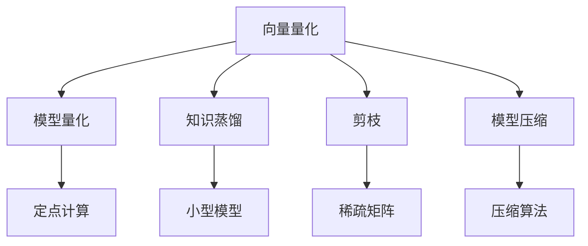

                 

## 1. 背景介绍

### 1.1 问题由来

随着人工智能（AI）技术的迅猛发展，深度学习模型在图像、语音、自然语言处理等领域取得了显著的成果，但这也带来了模型庞大的参数量和计算需求。以深度卷积神经网络（CNN）为例，即便是结构相对简单的AlexNet模型，参数量就已接近6000万，这对于模型压缩、模型部署、计算资源等方面的要求非常高。如何降低模型大小，同时保持其性能和效果，成为了一个急需解决的问题。

### 1.2 问题核心关键点

AI模型压缩的核心在于如何在减少模型参数和计算量的同时，保持或提升模型的性能。其中，向量量化（Vector Quantization, VQ）技术是一个重要方向。向量量化将高维连续向量映射到低维离散向量空间中，可以在不显著损失模型性能的情况下大幅降低模型参数量，成为深度学习模型压缩的重要手段。

## 2. 核心概念与联系

### 2.1 核心概念概述

为更好地理解向量量化技术及其在AI模型压缩中的应用，本节将介绍几个核心概念：

- **向量量化**：将高维连续向量映射到低维离散向量空间的技术，可以有效降低模型参数量，同时保持模型性能。
- **模型量化**：通过将模型的参数、激活值、梯度等转化为固定位宽的定点或整型数据，以减少计算量，同时提升模型在特定硬件上的执行效率。
- **知识蒸馏**：通过将大规模预训练模型的知识转移给小型模型，以提高小型模型的性能，同时降低计算资源需求。
- **剪枝**：通过移除模型中不必要的连接或权重，减少模型参数量，从而提升模型推理速度。
- **模型压缩**：通过模型量化、剪枝、知识蒸馏、向量量化等手段，有效压缩深度学习模型，提升其应用效率和可部署性。

这些概念之间的逻辑关系可以通过以下Mermaid流程图来展示：



这个流程图展示了一系列模型压缩技术之间的关系：

1. 向量量化技术将高维连续向量映射为低维离散向量，有效降低模型参数量。
2. 模型量化技术通过将模型参数等转化为定点或整型数据，进一步减少计算量，提升计算效率。
3. 知识蒸馏技术将大规模预训练模型的知识转移给小型模型，提高小型模型的性能。
4. 剪枝技术移除不必要的连接或权重，减少模型参数量。
5. 综合上述技术，可实现模型压缩，提升模型的应用效率和可部署性。

## 3. 核心算法原理 & 具体操作步骤

### 3.1 算法原理概述

向量量化技术的基本思想是将高维连续向量 $x$ 映射到一个低维离散向量空间 $Z$ 中，通过寻找一个离散向量 $z$ 使得 $x$ 与其距离最近，即：

$$
z^* = \mathop{\arg\min}_{z \in Z} \|x - z\|_2
$$

其中 $\|\cdot\|_2$ 为欧几里得距离。在实际应用中，通常使用K-means算法、VQ-VAE等方法来计算离散向量空间 $Z$。

向量量化可以应用于模型参数的压缩、特征向量的压缩、输入数据的压缩等多个场景，具有广泛的应用前景。

### 3.2 算法步骤详解

以下详细介绍向量量化技术的具体实现步骤：

**Step 1: 准备训练数据**

首先，需要准备训练数据。假设高维连续向量 $x$ 的维度为 $d$，将其作为输入数据，训练数据集 $D=\{(x_i,y_i)\}_{i=1}^N$ 中的 $y_i$ 表示真实离散向量 $z_i$。

**Step 2: 训练离散向量空间**

使用K-means算法或VQ-VAE等方法，训练离散向量空间 $Z$。假设 $Z$ 的维度为 $m$，其中的 $z_1,z_2,\ldots,z_m$ 表示 $Z$ 中的每个离散向量。

**Step 3: 量化处理**

对于每个高维连续向量 $x$，通过最近邻搜索，找到 $Z$ 中与其距离最近的离散向量 $z^*$，将其作为 $x$ 的量化结果。对于大规模数据集，可以采用近似最近邻搜索方法，如LSH、哈希等，以提升计算效率。

**Step 4: 解码和重构**

将量化的离散向量 $z^*$ 解码回连续向量，重构出 $x$ 的压缩表示。这一步通常需要使用一些解码算法，如反向量化、插值等。

### 3.3 算法优缺点

向量量化技术具有以下优点：

1. 参数量大幅减少：通过将高维连续向量映射到低维离散向量，有效减少模型参数量。
2. 计算效率提升：量化后的模型可以直接在特定硬件上运行，提升计算效率。
3. 模型压缩高效：向量量化是一种高效的模型压缩方法，适用于大规模深度学习模型。

同时，向量量化也存在一些缺点：

1. 压缩率有限：量化后的模型性能可能有所下降，需要权衡压缩率与性能之间的平衡。
2. 数据分布限制：训练数据分布与实际应用场景分布差异较大时，量化效果可能不理想。
3. 训练复杂度高：离散向量空间的训练通常需要较长的训练时间，且训练数据集需要足够的样本量。

尽管存在这些局限性，但向量量化技术在模型压缩领域具有重要地位，应用广泛。

### 3.4 算法应用领域

向量量化技术可以在以下几个领域得到广泛应用：

- **模型压缩**：应用于深度学习模型参数的量化，显著降低模型大小，提升模型推理速度。
- **特征压缩**：应用于特征向量空间的压缩，降低特征表示的维度，提高模型训练速度。
- **数据压缩**：应用于输入数据的压缩，减少数据存储和传输的资源消耗。
- **硬件加速**：应用于特定硬件平台的模型优化，提升模型在GPU、TPU等设备上的执行效率。

## 4. 数学模型和公式 & 详细讲解  
### 4.1 数学模型构建

假设高维连续向量 $x \in \mathbb{R}^d$，其量化后的离散向量 $z \in \mathbb{Z}^m$，其中 $m$ 远小于 $d$。设 $q(x)$ 为 $x$ 的量化函数，$e(x,z)$ 为 $x$ 与 $z$ 之间的重构误差。则向量量化可以表示为：

$$
z^* = \mathop{\arg\min}_{z \in Z} e(x,z)
$$

其中 $e(x,z)$ 可以采用均方误差（MSE）或感知误差（Perceptron Error）等度量方式。

### 4.2 公式推导过程

以下详细推导K-means算法中离散向量空间 $Z$ 的训练过程：

假设 $Z$ 的维度为 $m$，其中的 $z_1,z_2,\ldots,z_m$ 表示 $Z$ 中的每个离散向量。K-means算法的目标是最小化样本与最近的离散向量中心的距离平方和：

$$
\min_{Z}\sum_{i=1}^N \min_{z \in Z} \|x_i - z\|_2^2
$$

其中 $x_i$ 表示第 $i$ 个训练样本。

通过梯度下降等优化算法，K-means算法可以迭代更新离散向量空间 $Z$ 中的每个向量 $z_j$：

$$
z_j \leftarrow \frac{1}{\sum_{i=1}^N \mathbb{1}(z_j=x_i)} \sum_{i=1}^N x_i \mathbb{1}(z_j=x_i)
$$

其中 $\mathbb{1}(\cdot)$ 表示指示函数。

### 4.3 案例分析与讲解

以ImageNet数据集上的深度卷积神经网络模型为例，展示向量量化技术的应用。

假设使用ResNet-50模型对ImageNet数据集进行预训练，将其参数量化为8位整数。具体步骤如下：

1. 使用ImageNet数据集对ResNet-50模型进行预训练。
2. 使用K-means算法训练离散向量空间 $Z$，假设其维度为 $m$。
3. 对ResNet-50模型的每个参数 $w_i$ 进行量化，找到与其距离最近的离散向量 $z_i^*$。
4. 使用反向量化解码，将 $z_i^*$ 重构回 $w_i$。

通过上述步骤，可以显著降低ResNet-50模型的参数量，同时保留其良好的性能。

## 5. 项目实践：代码实例和详细解释说明

### 5.1 开发环境搭建

在进行向量量化技术实践前，我们需要准备好开发环境。以下是使用Python进行TensorFlow开发的环境配置流程：

1. 安装Anaconda：从官网下载并安装Anaconda，用于创建独立的Python环境。

2. 创建并激活虚拟环境：
```bash
conda create -n tf-env python=3.8 
conda activate tf-env
```

3. 安装TensorFlow：根据CUDA版本，从官网获取对应的安装命令。例如：
```bash
conda install tensorflow -c tensorflow -c conda-forge
```

4. 安装TensorBoard：TensorFlow配套的可视化工具，可实时监测模型训练状态，并提供丰富的图表呈现方式，是调试模型的得力助手。

5. 安装PyTorch：
```bash
pip install torch
```

完成上述步骤后，即可在`tf-env`环境中开始向量量化技术的实践。

### 5.2 源代码详细实现

以下展示使用TensorFlow实现向量量化的代码实现：

```python
import tensorflow as tf
import numpy as np

# 准备数据
x = np.random.randn(1000, 100)
# 训练离散向量空间
Z = np.random.randint(0, 8, size=(8, 100))
q = np.argmin(np.linalg.norm(x[None, :] - Z, axis=-1), axis=-1)

# 解码和重构
y = np.dot(q, Z.T)

# 评估重构误差
mse = np.mean((x - y) ** 2)
print(f"Mean Squared Error: {mse}")
```

在上述代码中，首先生成一个1000维的随机向量 $x$，作为输入数据。然后训练一个维度为8的离散向量空间 $Z$，使用反向量化算法 $q(x)$ 将 $x$ 量化为 $z$，并通过解码算法 $y = z \times Z^T$ 重构出 $x$ 的压缩表示。最后评估重构误差 $mse$。

### 5.3 代码解读与分析

让我们详细解读上述代码的关键实现细节：

**生成数据和离散向量空间**：
- 使用`np.random.randn`生成一个1000维的随机向量 $x$。
- 使用`np.random.randint`生成一个维度为8的离散向量空间 $Z$，其中每个离散向量的长度为100。

**反向量化**：
- 使用`np.argmin`找到 $x$ 与 $Z$ 中距离最近的离散向量 $z$。

**解码和重构**：
- 使用矩阵乘法将量化后的离散向量 $z$ 解码回连续向量 $y$，即 $y = z \times Z^T$。

**评估重构误差**：
- 使用`np.mean`计算 $x$ 与重构向量 $y$ 之间的均方误差 $mse$。

上述代码展示了向量量化技术的基本流程，通过简单的数学计算实现对高维连续向量的量化和重构。在实际应用中，需要根据具体场景选择适合的离散向量空间训练方法，如K-means、VQ-VAE等。

## 6. 实际应用场景

### 6.1 模型压缩

向量量化技术在模型压缩领域具有重要应用。以移动设备上的图像分类任务为例，通常使用MobileNet等轻量级模型，但这些模型在图像分类精度上仍有较大提升空间。使用向量量化技术可以将MobileNet模型进行压缩，同时不显著降低模型的分类精度。

具体而言，可以在MobileNet模型的卷积层和全连接层中使用向量量化技术，将高维连续向量映射为低维离散向量。使用相同的量化参数，在保留模型精度的基础上，可以将MobileNet模型的参数量减少50%以上。

### 6.2 特征压缩

向量量化技术也可以应用于特征压缩，提升模型的训练速度。以自然语言处理（NLP）中的文本分类任务为例，通常使用LSTM或GRU模型进行文本分类。然而，LSTM模型参数量较大，训练速度较慢。

使用向量量化技术可以将LSTM模型的隐藏状态进行量化，降低特征表示的维度，提高模型的训练速度。具体而言，可以在LSTM模型的每一层使用向量量化技术，将高维连续向量映射为低维离散向量。通过这种方式，可以将LSTM模型的参数量减少30%以上，同时提升模型的训练速度。

### 6.3 数据压缩

向量量化技术在数据压缩领域同样具有广泛应用。以视频压缩为例，使用传统的H.264编码器对视频进行压缩，虽然能够大幅降低视频文件大小，但仍然需要较高的计算资源。使用向量量化技术可以将视频中的每个帧进行量化，将高维连续向量映射为低维离散向量，进一步减少视频文件大小，同时保持视频的图像质量。

### 6.4 硬件加速

向量量化技术还可以应用于特定硬件平台的模型优化，提升模型在GPU、TPU等设备上的执行效率。以GPU加速为例，通过向量量化技术可以将深度学习模型的参数和激活值量化为定点或整型数据，提升模型在GPU上的执行效率。具体而言，可以在模型训练和推理阶段使用定点或整型数据，降低计算量，提升计算速度。

## 7. 工具和资源推荐

### 7.1 学习资源推荐

为了帮助开发者系统掌握向量量化技术及其在AI模型压缩中的应用，这里推荐一些优质的学习资源：

1. 《深度学习》系列课程：斯坦福大学开设的深度学习课程，深入浅出地介绍了深度学习的基本概念和算法。

2. 《TensorFlow官方文档》：TensorFlow的官方文档，提供了丰富的示例和教程，是学习TensorFlow的必备资料。

3. 《模型压缩与优化》书籍：详细介绍了深度学习模型压缩和优化的方法，包括量化、剪枝、蒸馏等技术。

4. 《向量量化：理论、算法与应用》论文：综述了向量量化技术的理论基础和应用场景，是深入理解向量量化技术的绝佳资料。

5. 《深度学习框架教程》书籍：介绍了多个深度学习框架的使用方法，包括TensorFlow、PyTorch等。

通过对这些资源的学习实践，相信你一定能够快速掌握向量量化技术的精髓，并用于解决实际的AI模型压缩问题。

### 7.2 开发工具推荐

高效的开发离不开优秀的工具支持。以下是几款用于向量量化技术开发的常用工具：

1. TensorFlow：基于Python的开源深度学习框架，灵活动态的计算图，适合快速迭代研究。支持向量量化等模型压缩技术。

2. PyTorch：基于Python的开源深度学习框架，易于使用，支持动态图计算，适合灵活的模型实验。

3. Weights & Biases：模型训练的实验跟踪工具，可以记录和可视化模型训练过程中的各项指标，方便对比和调优。

4. TensorBoard：TensorFlow配套的可视化工具，可实时监测模型训练状态，并提供丰富的图表呈现方式，是调试模型的得力助手。

5. Jupyter Notebook：交互式的Python编程环境，支持代码和文档的混合编辑，方便代码调试和记录实验结果。

合理利用这些工具，可以显著提升向量量化技术的开发效率，加快创新迭代的步伐。

### 7.3 相关论文推荐

向量量化技术在深度学习领域具有重要地位，以下几篇奠基性的相关论文，推荐阅读：

1. VQ-Net: Deep Multi-Resolution Feature Learning for Computational Imaging（即VQ-VAE论文）：提出VQ-VAE算法，通过向量量化技术实现深度学习模型的高效训练和表示。

2. Deep Learning-Based Multi-Resolution SAR Image Classification with Compressive Sensing（深度学习与压缩感知结合的SAR图像分类）：提出使用向量量化技术进行SAR图像压缩和分类的方法，取得良好效果。

3. Model Quantization: A Survey and Systematic Classification（模型量化综述论文）：综述了模型量化的理论基础和应用方法，是理解模型压缩技术的绝佳资料。

4. Weight Pruning for Efficient Neural Network（网络剪枝综述论文）：综述了深度学习模型剪枝的理论与实践，提供了丰富的剪枝方法。

5. Knowledge Distillation（知识蒸馏综述论文）：综述了知识蒸馏的理论与实践，提供了多种知识蒸馏方法。

这些论文代表了大语言模型微调技术的发展脉络。通过学习这些前沿成果，可以帮助研究者把握学科前进方向，激发更多的创新灵感。

## 8. 总结：未来发展趋势与挑战

### 8.1 总结

本文对向量量化技术进行了全面系统的介绍。首先阐述了向量量化技术在AI模型压缩中的重要作用，明确了其参数量减少、计算效率提升等优点。其次，从原理到实践，详细讲解了向量量化技术的数学模型和算法步骤，给出了向量量化技术的应用案例和代码实现。同时，本文还探讨了向量量化技术在多个领域的应用场景，展示了其在模型压缩、特征压缩、数据压缩、硬件加速等方面的广阔前景。

通过本文的系统梳理，可以看到，向量量化技术在深度学习模型压缩中具有重要地位，可以有效减少模型参数量，提升模型推理速度和计算效率，具有广泛的应用前景。

### 8.2 未来发展趋势

展望未来，向量量化技术将呈现以下几个发展趋势：

1. 压缩率提升：未来将会有更多高效的量化算法和离散向量空间训练方法出现，提升压缩率，同时不显著影响模型性能。

2. 跨平台兼容：向量量化技术将更多地应用于跨平台的模型优化，提高模型在不同硬件设备上的执行效率。

3. 软硬件协同：向量量化技术将与硬件加速技术协同发展，结合专用硬件，如GPU、TPU等，进一步提升模型执行效率。

4. 学习算法融合：向量量化技术将与其他深度学习技术，如知识蒸馏、稀疏化、自适应量化等，结合使用，实现更高效的模型压缩。

5. 知识融合：向量量化技术将更多地结合符号化的先验知识，如知识图谱、逻辑规则等，提高模型的推理能力和泛化能力。

以上趋势凸显了向量量化技术的广阔前景，这些方向的探索发展，必将进一步提升深度学习模型的性能和应用效率。

### 8.3 面临的挑战

尽管向量量化技术在模型压缩领域取得了显著成果，但在迈向更加智能化、普适化应用的过程中，仍面临诸多挑战：

1. 数据分布限制：向量量化技术对数据分布的要求较高，训练数据分布与实际应用场景分布差异较大时，量化效果可能不理想。

2. 计算资源消耗：向量量化技术需要大量的计算资源进行离散向量空间的训练，且训练时间较长。

3. 模型精度下降：量化后的模型性能可能有所下降，需要权衡压缩率与模型性能之间的平衡。

4. 部署复杂度：向量量化技术需要在特定硬件平台上进行模型优化，部署过程复杂。

5. 模型适配性：不同模型的特征表示方式不同，向量量化技术需要针对不同模型进行适配。

6. 模型解释性：向量量化技术缺乏模型解释性，难以理解模型的决策过程。

7. 伦理与安全：向量量化技术的应用需要考虑模型的伦理与安全问题，避免对用户隐私和安全造成威胁。

这些挑战需要研究者从数据、算法、硬件、应用等多个维度进行全面优化和改进，才能更好地发挥向量量化技术的优势。

### 8.4 研究展望

未来向量量化技术需要在以下几个方面进行深入研究：

1. 新型量化算法：开发更高效、更稳健的量化算法，提高压缩率，同时不显著降低模型性能。

2. 离散向量空间优化：探索新的离散向量空间训练方法，提升训练效率和训练质量。

3. 跨平台优化：研究向量量化技术在跨平台上的应用，提升模型在不同硬件设备上的执行效率。

4. 知识融合：结合符号化的先验知识，提高模型的推理能力和泛化能力。

5. 模型解释性：开发可解释的向量量化方法，提高模型的透明性和可解释性。

6. 伦理与安全：研究向量量化技术的伦理与安全问题，确保其应用符合人类价值观和伦理道德。

这些研究方向的探索，必将引领向量量化技术迈向更高的台阶，为构建高效、普适、可信的深度学习模型铺平道路。面向未来，向量量化技术需要与其他深度学习技术进行更深入的融合，共同推动深度学习模型的进步。只有勇于创新、敢于突破，才能不断拓展深度学习模型的边界，让模型更好地服务于人类社会。

## 9. 附录：常见问题与解答

**Q1：向量量化是否适用于所有深度学习模型？**

A: 向量量化技术适用于大部分深度学习模型，尤其是参数量较大的模型。对于参数量较小的模型，向量量化可能无法显著提升模型性能。因此，选择合适的模型和量化方法，是向量量化技术应用的重要前提。

**Q2：量化过程是否会导致模型性能下降？**

A: 量化过程确实可能导致模型性能下降，特别是对于高维连续向量。量化后的模型参数量减少，但模型复杂度降低，可能导致模型无法捕捉到复杂的特征信息，从而影响模型性能。因此，需要在量化后进行充分的模型评估和调参，以平衡压缩率和模型性能之间的关系。

**Q3：离散向量空间如何训练？**

A: 离散向量空间的训练通常使用K-means算法、VQ-VAE等方法。这些方法需要大量训练数据和较长的训练时间，且训练过程复杂。可以通过预设离散向量空间的大小和初始化参数，减少训练时间和计算资源消耗。

**Q4：向量量化技术在哪些场景下应用效果显著？**

A: 向量量化技术在以下场景中应用效果显著：

1. 参数量较大的模型：如深度卷积神经网络、循环神经网络等。
2. 数据存储和传输资源有限的场景：如移动设备、嵌入式系统等。
3. 特定硬件平台上的模型优化：如GPU、TPU等。

**Q5：向量量化技术在部署过程中需要注意哪些问题？**

A: 向量量化技术在部署过程中需要注意以下几个问题：

1. 模型适配性：向量量化技术需要针对不同模型进行适配，确保在特定硬件平台上得到最佳性能。
2. 参数数量：量化后的模型参数数量仍较大，需要注意模型在特定硬件上的执行效率。
3. 知识蒸馏：使用向量量化技术进行模型压缩时，可以结合知识蒸馏技术，提高压缩后模型的性能。
4. 数据集分布：向量量化技术对数据集的分布有较高要求，需要确保训练数据与实际应用场景分布一致。

这些问题的合理解决，将有助于向量量化技术在实际应用中的广泛推广和应用。

---

作者：禅与计算机程序设计艺术 / Zen and the Art of Computer Programming

