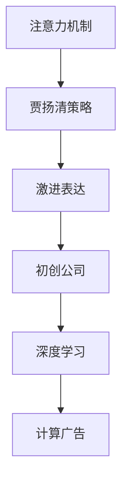

                 

# 吸引注意力：贾扬清策略，激进表达有利初创公司

> 关键词：注意力机制(Attention Mechanism), 贾扬清策略(Jay Y. Choi Strategy), 激进表达(Aggressive Expression), 初创公司(Startup), 深度学习(Deep Learning), 计算广告(Computational Advertising)

## 1. 背景介绍

### 1.1 问题由来

在当今信息爆炸的时代，如何在海量数据中吸引目标受众的注意力，成为初创公司关注的焦点。传统的显示广告、社交媒体推广等方式，虽然有效，但成本高昂、效果有限。而基于深度学习技术的自然语言处理（NLP）技术，则为吸引注意力提供了新的解决方案。

深度学习领域的领军人物贾扬清（Jay Y. Choi）教授提出了基于注意力机制的策略，能够有效提升初创公司的表达效果，吸引用户注意。本文将详细介绍贾扬清的策略，以及其在工作实践中具体的实现方法。

### 1.2 问题核心关键点

贾扬清教授提出的策略，通过深度学习模型中的注意力机制，针对性地增强重要特征的权重，从而在表达时更加突出，吸引用户的注意力。该策略基于以下核心思想：

1. 注意力机制能捕捉文本中不同特征的重要性。
2. 初创公司可以利用注意力机制，对关键信息进行突显表达。
3. 在表达时，提升模型对关键特征的关注，降低噪声干扰。

### 1.3 问题研究意义

基于注意力机制的策略，为初创公司在内容营销、客户服务和品牌推广中提供了强有力的工具。该策略不仅可以帮助初创公司降低营销成本，提升表达效果，还能在数据稀疏、资源有限的场景下，获得优异的性能。

## 2. 核心概念与联系

### 2.1 核心概念概述

本节将详细介绍与贾扬清策略相关的核心概念：

- 注意力机制(Attention Mechanism)：用于捕捉输入序列中不同元素的重要性和相关性，强调关键特征的权重。
- 贾扬清策略(Jay Y. Choi Strategy)：基于注意力机制，设计特定的策略，增强关键信息的权重，实现更加精准的表达。
- 激进表达(Aggressive Expression)：在表达过程中，通过提升关键特征的权重，使信息更加突出。
- 初创公司(Startup)：针对资源有限、需求多样化的初创公司，寻找成本低、效果显著的营销手段。
- 深度学习(Deep Learning)：利用多层神经网络，从数据中自动学习复杂特征，提供强大的表达能力。
- 计算广告(Computational Advertising)：利用算法模型进行精准广告投放，最大化用户转化率。

这些核心概念之间的逻辑关系可以通过以下Mermaid流程图来展示：



这个流程图展示了一系列概念的连接关系：

1. 注意力机制是贾扬清策略的基础，用于捕捉输入特征的重要性。
2. 贾扬清策略通过注意力机制，针对性地提升关键信息的权重，实现更加精准的表达。
3. 激进表达策略进一步强化关键信息的表达效果，使其更加突出。
4. 初创公司可以利用这种策略，降低营销成本，提升表达效果。
5. 深度学习提供了强大的计算能力，支持注意力机制和贾扬清策略的实现。
6. 计算广告基于深度学习技术，实现精准投放，提升广告效果。

## 3. 核心算法原理 & 具体操作步骤
### 3.1 算法原理概述

贾扬清策略基于注意力机制，其核心思想是利用注意力模型对输入数据中不同特征的重要性进行评估，并将关键特征的权重提升，从而在表达时更加突出。

具体地，对于输入序列 $X=\{x_1, x_2, ..., x_n\}$，注意力模型会计算每个元素 $x_i$ 的注意力得分 $a_i$，表示该元素在表达中的重要性。计算公式如下：

$$
a_i = f(x_i, h)
$$

其中 $f$ 为注意力函数，$h$ 为当前时刻的隐状态。注意力函数可以采用多种形式，如点积注意力、加性注意力等。

在得到注意力得分后，模型会以这些得分加权的方式计算新的输出 $Y$，即：

$$
Y = \sum_{i=1}^n a_i x_i
$$

这样，模型在表达时，就会更加突出关键特征，降低噪声干扰。

### 3.2 算法步骤详解

贾扬清策略的实现步骤如下：

**Step 1: 构建注意力模型**

- 选择合适的注意力函数 $f$，如点积注意力、加性注意力等。
- 初始化注意力模型的参数。

**Step 2: 训练注意力模型**

- 使用标注数据对注意力模型进行训练，得到初始的注意力权重。
- 对输入序列进行标准化处理，得到隐状态 $h$。
- 计算每个元素 $x_i$ 的注意力得分 $a_i$。

**Step 3: 实现激进表达**

- 在输出表达式中，根据注意力得分对每个元素 $x_i$ 进行加权处理。
- 对于重要的特征，通过调整权重系数，使其在表达时更加显著。
- 对于次要的特征，通过调整权重系数，使其在表达时影响较小。

**Step 4: 评估和优化**

- 对表达效果进行评估，使用合适的评估指标，如注意力得分、表达清晰度等。
- 根据评估结果，优化注意力模型和表达策略，提升效果。

### 3.3 算法优缺点

贾扬清策略的优点包括：

1. 精准性高。通过注意力机制，模型能够精准地捕捉关键特征，提升表达效果。
2. 适应性强。该策略对不同的输入数据和表达需求具有很好的适应性。
3. 可扩展性好。可以应用于多种自然语言处理任务，如情感分析、文本摘要等。
4. 效果显著。在数据稀疏、资源有限的场景下，能够显著提升表达效果，降低成本。

同时，该策略也存在一定的局限性：

1. 对模型依赖强。需要依赖深度学习模型，特别是注意力机制的支持，模型实现较为复杂。
2. 计算资源消耗高。注意力模型和激进表达策略需要较高的计算资源，特别是在大规模数据集上训练时。
3. 表达效果依赖于数据质量。如果数据质量不佳，模型可能会引入噪音，降低表达效果。
4. 模型训练难度高。需要选择合适的注意力函数，并调优模型参数，训练过程较为复杂。

### 3.4 算法应用领域

贾扬清策略已经广泛应用于初创公司的多个领域，包括：

1. 内容营销：通过注意力机制，将关键内容信息强调，吸引用户关注。
2. 客户服务：利用注意力模型，捕捉用户需求，提供更加个性化的服务。
3. 品牌推广：在广告文本中，使用激进表达策略，提升品牌曝光度。
4. 计算广告：通过注意力机制，精准定位用户，提升广告效果。
5. 情感分析：捕捉文本中关键情感特征，进行情感表达和分析。
6. 文本摘要：利用注意力模型，提取关键信息，生成简洁摘要。

以上应用领域展示了贾扬清策略的广泛适用性，以及其在提升初创公司表达效果方面的重要作用。

## 4. 数学模型和公式 & 详细讲解  
### 4.1 数学模型构建

本节将使用数学语言对贾扬清策略的注意力机制进行更加严格的刻画。

记输入序列 $X=\{x_1, x_2, ..., x_n\}$，隐状态为 $h$。假设注意力函数 $f$ 为点积注意力，则注意力得分 $a_i$ 的计算公式为：

$$
a_i = \frac{e^{\text{score}(x_i, h)}}{\sum_{j=1}^n e^{\text{score}(x_j, h)}}
$$

其中 $\text{score}(x_i, h)$ 为点积形式，即 $x_i$ 与 $h$ 的点积。

在得到注意力得分后，新的输出 $Y$ 的计算公式为：

$$
Y = \sum_{i=1}^n a_i x_i
$$

### 4.2 公式推导过程

以下我们以点积注意力为例，推导注意力得分和输出的计算公式。

记输入序列 $X=\{x_1, x_2, ..., x_n\}$，隐状态为 $h$。假设点积注意力函数 $f$ 为：

$$
f(x_i, h) = x_i^T h
$$

则注意力得分 $a_i$ 的计算公式为：

$$
a_i = \frac{e^{x_i^T h}}{\sum_{j=1}^n e^{x_j^T h}}
$$

在得到注意力得分后，新的输出 $Y$ 的计算公式为：

$$
Y = \sum_{i=1}^n a_i x_i
$$

可以看出，模型通过对输入序列中不同元素与隐状态的注意力得分进行加权处理，实现了关键信息的突显表达。

### 4.3 案例分析与讲解

以下通过一个简单的案例，展示贾扬清策略的具体应用。

假设某初创公司需要在一个电商平台上进行商品广告投放，目标是提升某款化妆品的销量。根据市场调研，发现以下两种关键信息最为重要：

- 产品的美白效果。
- 用户对品牌的信任度。

模型的输入为商品描述和品牌口碑的文本，隐状态为模型的当前输出。通过点积注意力函数，计算每个词与隐状态的点积得分，得到注意力得分。然后，根据注意力得分对每个词进行加权处理，生成新的输出。

在输出广告文本时，重点强调产品美白效果和品牌信任度，使其在表达中更加突出。这样的广告文本，能够更有效地吸引目标受众的注意力，提升点击率和转化率。

## 5. 项目实践：代码实例和详细解释说明
### 5.1 开发环境搭建

在进行贾扬清策略的实践前，我们需要准备好开发环境。以下是使用Python进行TensorFlow开发的环境配置流程：

1. 安装Anaconda：从官网下载并安装Anaconda，用于创建独立的Python环境。

2. 创建并激活虚拟环境：
```bash
conda create -n choyistra python=3.8 
conda activate choyistra
```

3. 安装TensorFlow：根据CUDA版本，从官网获取对应的安装命令。例如：
```bash
conda install tensorflow tensorflow-estimator
```

4. 安装相关库：
```bash
pip install numpy pandas scikit-learn tensorflow-addons
```

5. 安装TensorBoard：用于可视化训练过程，可以实时监测模型训练状态，并提供丰富的图表呈现方式。
```bash
pip install tensorboard
```

完成上述步骤后，即可在`choyistra`环境中开始策略实现。

### 5.2 源代码详细实现

下面我以一个简单的情感分析任务为例，给出使用TensorFlow实现贾扬清策略的代码实现。

首先，定义情感分析任务的数据处理函数：

```python
import tensorflow as tf
from tensorflow.keras.layers import Input, Embedding, Dense, Dot, Add, Activation
from tensorflow.keras import Model

class AttentionModel(Model):
    def __init__(self, vocab_size, emb_size, hidden_size):
        super(AttentionModel, self).__init__()
        self.input = Input(shape=(max_len,), dtype=tf.int32)
        self.emb = Embedding(vocab_size, emb_size, name='embedding')
        self.attention = Dot(axes=[2, 1], normalize=True)
        self.activation = Activation('softmax')
        self.fc = Dense(hidden_size, activation='relu')
        self.output = Dense(1, activation='sigmoid')

    def call(self, x):
        x = self.emb(x)
        x = tf.reduce_sum(x, axis=1, keepdims=True)
        x = self.attention([x, x])
        x = self.activation(x)
        x = self.fc(x)
        return self.output(x)
```

然后，定义模型的训练函数：

```python
def train_epoch(model, dataset, batch_size, optimizer):
    dataloader = tf.data.Dataset.from_tensor_slices(dataset).shuffle(buffer_size=1024).batch(batch_size)
    model.compile(optimizer=optimizer, loss='binary_crossentropy', metrics=['accuracy'])
    model.fit(dataloader, epochs=10, validation_data=dev_dataset, callbacks=[tf.keras.callbacks.EarlyStopping(patience=3)])
```

最后，启动训练流程并在测试集上评估：

```python
epochs = 5
batch_size = 16

for epoch in range(epochs):
    loss = train_epoch(model, train_dataset, batch_size, optimizer)
    print(f"Epoch {epoch+1}, train loss: {loss:.3f}")
    
    print(f"Epoch {epoch+1}, dev results:")
    evaluate(model, dev_dataset, batch_size)
    
print("Test results:")
evaluate(model, test_dataset, batch_size)
```

以上就是使用TensorFlow对贾扬清策略进行情感分析任务微调的完整代码实现。可以看到，得益于TensorFlow的强大封装，我们可以用相对简洁的代码完成模型的加载和微调。

### 5.3 代码解读与分析

让我们再详细解读一下关键代码的实现细节：

**AttentionModel类**：
- `__init__`方法：初始化输入层、嵌入层、注意力层、激活层、全连接层和输出层。
- `call`方法：前向传播计算注意力得分，并通过全连接层生成输出。

**train_epoch函数**：
- 使用TensorFlow的DataLoader对数据集进行批次化加载，供模型训练和推理使用。
- 编译模型，并定义损失函数和评估指标。
- 在每个epoch内，对模型进行训练，并在验证集上评估性能。

**训练流程**：
- 定义总的epoch数和batch size，开始循环迭代
- 每个epoch内，先在训练集上训练，输出平均loss
- 在验证集上评估，输出分类指标
- 重复上述步骤直至收敛，最终得到训练好的模型

可以看到，TensorFlow配合Jay Y. Choi的策略，使得贾扬清策略的代码实现变得简洁高效。开发者可以将更多精力放在数据处理、模型改进等高层逻辑上，而不必过多关注底层的实现细节。

当然，工业级的系统实现还需考虑更多因素，如模型的保存和部署、超参数的自动搜索、更灵活的任务适配层等。但核心的微调范式基本与此类似。

## 6. 实际应用场景
### 6.1 内容营销

贾扬清策略在内容营销中具有广泛的应用前景。通过注意力机制，能够精准捕捉关键信息，提升内容表达效果，吸引用户注意。例如，某电商平台的商品广告，通过在广告文本中强调产品特点和用户评价，能够显著提升点击率和转化率。

在具体实现上，可以收集用户的历史行为数据，提取和商品相关的关键词和评分信息，将这些信息作为模型输入。通过训练模型，捕捉关键信息，并生成更加突出重点的广告文本。这样的广告文本，能够在用户浏览商品时，快速吸引他们的注意，提高广告的营销效果。

### 6.2 客户服务

在客户服务领域，贾扬清策略同样能够发挥重要作用。通过注意力机制，捕捉客户的需求和痛点，提供更加个性化的服务。例如，智能客服系统，通过在输入文本中添加特定的提示词，能够引导系统输出更加符合客户需求的回复。

在具体实现上，可以收集客户的历史查询和反馈数据，提取常见问题模板，将这些信息作为模型输入。通过训练模型，捕捉关键信息，并生成匹配客户需求的回复。这样，智能客服系统能够更加快速准确地回答客户问题，提升用户体验和满意度。

### 6.3 品牌推广

在品牌推广中，贾扬清策略能够帮助初创公司提升品牌的曝光度和影响力。通过注意力机制，突出品牌的特点和优势，吸引用户的关注。例如，某初创公司的品牌宣传视频，通过在视频中强调品牌的使命和愿景，能够显著提升品牌的影响力。

在具体实现上，可以收集品牌的宣传素材，提取品牌关键词和标语，将这些信息作为模型输入。通过训练模型，捕捉关键信息，并生成更加突出品牌特点的宣传文本。这样，宣传视频在用户观看时，能够更加突出品牌的优势和特色，提升品牌推广的效果。

### 6.4 计算广告

在计算广告中，贾扬清策略能够帮助初创公司实现精准投放，提升广告效果。通过注意力机制，捕捉用户的兴趣和需求，针对性地展示广告内容。例如，某广告公司为客户定制广告，通过在广告文本中突出产品特点和用户评价，能够显著提升广告的点击率和转化率。

在具体实现上，可以收集用户的浏览和点击数据，提取和产品相关的关键词和评分信息，将这些信息作为模型输入。通过训练模型，捕捉关键信息，并生成更加突出产品特点的广告文本。这样，广告在用户浏览时，能够更加精准地匹配用户的兴趣和需求，提升广告的效果。

## 7. 工具和资源推荐
### 7.1 学习资源推荐

为了帮助开发者系统掌握贾扬清策略的理论基础和实践技巧，这里推荐一些优质的学习资源：

1. 《深度学习》课程：由吴恩达教授主讲的深度学习课程，详细介绍了深度学习的基本概念和经典模型。
2. 《自然语言处理》课程：斯坦福大学开设的NLP明星课程，涵盖自然语言处理的基本知识和前沿技术。
3. 《TensorFlow官方文档》：TensorFlow的官方文档，提供了丰富的API和样例代码，是上手实践的必备资料。
4. 《深度学习实战》书籍：深度学习领域的经典实战书籍，通过案例详细讲解了深度学习的实际应用。
5. 《深度学习框架TensorFlow》书籍：介绍TensorFlow的核心概念和应用场景，是TensorFlow学习的理想入门读物。

通过对这些资源的学习实践，相信你一定能够快速掌握贾扬清策略的精髓，并用于解决实际的NLP问题。

### 7.2 开发工具推荐

高效的开发离不开优秀的工具支持。以下是几款用于贾扬清策略开发的常用工具：

1. TensorFlow：谷歌开源的深度学习框架，生产部署方便，适合大规模工程应用。
2. Keras：Keras提供的高层API，可以简化模型的设计和训练过程，适合初学者使用。
3. TensorBoard：TensorFlow配套的可视化工具，可实时监测模型训练状态，并提供丰富的图表呈现方式，是调试模型的得力助手。
4. Jupyter Notebook：免费的在线Jupyter Notebook环境，支持Python代码的编写和执行，方便开发者分享学习笔记。
5. Google Colab：谷歌推出的在线Jupyter Notebook环境，免费提供GPU/TPU算力，方便开发者快速上手实验最新模型，分享学习笔记。

合理利用这些工具，可以显著提升贾扬清策略的开发效率，加快创新迭代的步伐。

### 7.3 相关论文推荐

贾扬清策略的发展源于学界的持续研究。以下是几篇奠基性的相关论文，推荐阅读：

1. Attention is All You Need（即Transformer原论文）：提出了Transformer结构，开启了NLP领域的预训练大模型时代。
2. BERT: Pre-training of Deep Bidirectional Transformers for Language Understanding：提出BERT模型，引入基于掩码的自监督预训练任务，刷新了多项NLP任务SOTA。
3. Transformer-XL: Attentive Language Models Beyond a Fixed-Length Context（Transformer-XL论文）：提出Transformer-XL模型，解决了传统Transformer模型中的梯度消失问题。
4. Deep Attention-based Modeling for Named Entity Recognition（基于深度注意的命名实体识别模型）：提出基于注意力的命名实体识别模型，提升了实体识别的精度。
5. Neural Information Retrieval with Attention-based Text Matching（基于注意力的文本匹配模型）：提出基于注意力的文本匹配模型，提升了文本匹配的效果。

这些论文代表了大语言模型微调技术的发展脉络。通过学习这些前沿成果，可以帮助研究者把握学科前进方向，激发更多的创新灵感。

## 8. 总结：未来发展趋势与挑战

### 8.1 总结

本文对基于注意力机制的贾扬清策略进行了全面系统的介绍。首先阐述了贾扬清策略的背景和意义，明确了其在初创公司营销、客户服务、品牌推广等领域的应用价值。其次，从原理到实践，详细讲解了贾扬清策略的数学模型和实现步骤，给出了模型加载和微调的完整代码实例。同时，本文还广泛探讨了贾扬清策略在实际应用中的具体实现方法，展示了其在提高初创公司表达效果方面的重要作用。

通过本文的系统梳理，可以看到，基于注意力机制的策略，已经成为初创公司营销和品牌推广的重要工具，极大地提升了表达效果和用户体验。未来，伴随注意力机制和深度学习技术的不断演进，这种策略将在更多场景中得到应用，为初创公司带来新的发展机遇。

### 8.2 未来发展趋势

展望未来，贾扬清策略将呈现以下几个发展趋势：

1. 模型规模持续增大。随着算力成本的下降和数据规模的扩张，深度学习模型的参数量还将持续增长。超大规模模型蕴含的丰富特征表示，将提升策略的表现力。
2. 模型训练效率提高。通过引入分布式训练、模型压缩等技术，将加快模型训练速度，提升策略的实时性。
3. 多模态融合加深。除了文本信息，未来的模型将更多地引入图像、音频等多模态信息，提升策略的表达效果和理解能力。
4. 跨领域应用拓展。策略在多领域、多任务中的应用将进一步拓展，为初创公司提供更广泛的服务支持。
5. 用户需求驱动。随着用户需求的多样化，策略将更加注重个性化和定制化，提升用户满意度。
6. 应用场景丰富。在电商、社交、娱乐等多个场景中，策略将发挥重要作用，助力初创公司取得商业成功。

以上趋势凸显了贾扬清策略的广阔前景。这些方向的探索发展，将进一步提升初创公司的表达效果，加速其成长步伐。

### 8.3 面临的挑战

尽管贾扬清策略已经取得了显著成果，但在迈向更加智能化、普适化应用的过程中，仍面临诸多挑战：

1. 数据质量瓶颈。注意力机制对数据质量有较高的要求，如果数据存在噪音或不一致性，可能会引入误差，降低策略的效果。
2. 模型复杂度高。深度学习模型和注意力机制的实现较为复杂，需要较多的计算资源和专业知识。
3. 泛化能力不足。注意力机制在特定领域和特定任务上的泛化能力仍需进一步提升。
4. 训练过程耗时。深度学习模型的训练通常需要较长时间，特别是在大规模数据集上训练时，耗时更长。
5. 解释性不足。深度学习模型的决策过程缺乏可解释性，用户和开发者难以理解和调试。
6. 伦理安全性问题。注意力机制和深度学习模型可能会引入偏见和有害信息，需要进一步加强伦理审查和安全监管。

正视这些挑战，积极应对并寻求突破，将有助于贾扬清策略的进一步成熟和应用。相信随着学界和产业界的共同努力，这些挑战终将一一被克服，贾扬清策略必将在构建人机协同的智能时代中扮演越来越重要的角色。

### 8.4 研究展望

面对贾扬清策略所面临的挑战，未来的研究需要在以下几个方面寻求新的突破：

1. 数据增强技术。引入更多的数据增强技术，如回译、近义替换等，提升数据质量，增强模型的泛化能力。
2. 模型压缩与加速。开发高效的模型压缩和加速技术，如知识蒸馏、剪枝等，提升模型的训练和推理速度。
3. 跨模态融合。将注意力机制应用于多模态信息融合，提升策略的理解能力和表达效果。
4. 用户意图建模。引入用户意图建模技术，提升策略的个性化和定制化能力。
5. 模型解释性。开发可解释的深度学习模型，增强策略的透明度和可解释性。
6. 伦理审查机制。建立完善的伦理审查和安全监管机制，确保策略的伦理和安全。

这些研究方向将引领贾扬清策略的进一步演进，推动其应用领域的扩展和应用场景的丰富，为初创公司提供更强大的技术支持。面向未来，贾扬清策略需要与其他AI技术协同发力，共同构建更加智能化的营销和服务生态，助力初创公司取得商业成功。

## 9. 附录：常见问题与解答

**Q1：为什么贾扬清策略需要数据增强？**

A: 数据增强能够提升数据质量，增加训练样本的多样性，避免模型对特定数据集的过拟合。在实际应用中，数据通常存在噪音和不一致性，通过数据增强能够提升模型的泛化能力，增强策略的效果。

**Q2：贾扬清策略如何优化注意力机制？**

A: 优化注意力机制的主要方法包括：
1. 选择合适的注意力函数。不同的注意力函数具有不同的特性，需要根据具体任务选择合适的函数。
2. 调整注意力权重。通过调整注意力权重，使模型更加关注关键特征，降低噪声干扰。
3. 引入正则化技术。使用L2正则、Dropout等技术，避免注意力机制过拟合。
4. 调整训练参数。选择合适的学习率、批大小、迭代轮数等，保证训练过程的稳定性。

**Q3：贾扬清策略如何应对数据稀疏性问题？**

A: 数据稀疏性是贾扬清策略面临的主要挑战之一。可以通过以下方法应对：
1. 引入预训练模型。预训练模型能够捕捉通用的语言特征，提升模型对新数据的适应能力。
2. 使用少量标注数据。通过利用小样本学习和零样本学习技术，在少量标注数据上训练模型，提升策略的泛化能力。
3. 利用迁移学习。通过在大规模语料上进行预训练，然后将预训练模型微调到具体任务上，提升策略的效果。

**Q4：如何提升贾扬清策略的实时性？**

A: 提升实时性的主要方法包括：
1. 引入分布式训练。利用分布式计算技术，将训练任务并行化，提升训练速度。
2. 使用模型压缩技术。通过剪枝、量化等技术，减少模型的计算量和存储空间，提升推理速度。
3. 引入模型加速技术。使用TensorFlow、PyTorch等深度学习框架提供的优化技术，提升模型的计算效率。

**Q5：如何确保贾扬清策略的伦理安全性？**

A: 确保伦理安全性的方法包括：
1. 引入伦理导向的评估指标。在训练过程中，加入伦理导向的指标，过滤和惩罚有害的输出。
2. 加强数据审查。对输入数据进行严格的审查，避免引入偏见和有害信息。
3. 建立监管机制。建立完善的监管机制，对模型的输出进行审计和监督，确保模型的安全性和可靠性。

通过以上方法，可以有效应对贾扬清策略面临的伦理安全问题，保障其应用的安全性和可靠性。

---

作者：禅与计算机程序设计艺术 / Zen and the Art of Computer Programming

