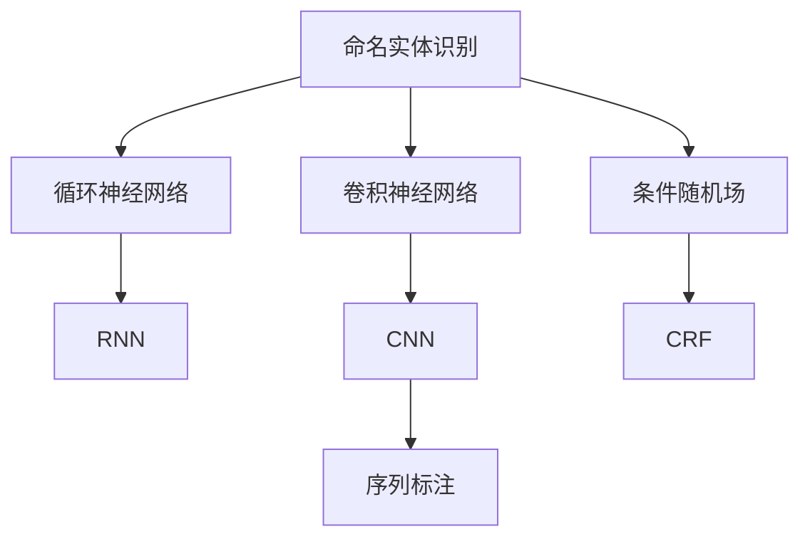

                 

# 命名实体识别：深度学习方法

> 关键词：命名实体识别,深度学习,卷积神经网络,循环神经网络,Transformer,CRF模型,序列标注

## 1. 背景介绍

### 1.1 问题由来

命名实体识别（Named Entity Recognition, NER）是自然语言处理（NLP）中的一个经典任务，旨在从文本中自动识别具有特定意义的命名实体，如人名、地名、机构名等。命名实体识别在信息提取、搜索引擎优化、情感分析、问答系统等多个领域中都有着广泛的应用。

传统的命名实体识别方法主要是基于规则的模板匹配和词典匹配。然而，这些方法在处理复杂句法和语义时，往往效果不佳，容易产生大量的误识别和漏识别现象。此外，对于大规模语料数据集，基于规则的方法也难以高效地处理。因此，随着深度学习技术的发展，深度学习方法在命名实体识别领域逐渐占据主导地位。

近年来，基于深度学习的命名实体识别方法取得了显著的进步。其中，卷积神经网络（CNN）、循环神经网络（RNN）、Transformer等架构被广泛应用于命名实体识别任务中，并取得了优秀的性能。此外，条件随机场（Conditional Random Field, CRF）等序列标注方法也被用来进一步优化实体识别的准确性和召回率。

本文将详细探讨基于深度学习的命名实体识别方法，从原理到实践，全面解析其在自然语言处理领域的应用与挑战。

## 2. 核心概念与联系

### 2.1 核心概念概述

为更好地理解基于深度学习的命名实体识别方法，本节将介绍几个密切相关的核心概念：

- 命名实体识别（NER）：从文本中自动识别具有特定意义的命名实体，如人名、地名、机构名等。
- 卷积神经网络（CNN）：通过卷积操作提取文本中的局部特征，适用于处理序列数据。
- 循环神经网络（RNN）：通过循环结构捕捉序列中的时间依赖性，适用于处理时序数据。
- 条件随机场（CRF）：一种序列标注模型，用于在考虑序列结构的情况下优化标注序列。
- 序列标注：从输入序列中预测输出序列的标签，如命名实体识别、词性标注、依存句法分析等。

这些核心概念之间的逻辑关系可以通过以下Mermaid流程图来展示：



这个流程图展示了大规模语言模型微调的各个核心概念及其之间的关系：

1. 命名实体识别作为序列标注的一个子任务，可以通过CNN、RNN等架构进行处理。
2. 卷积神经网络（CNN）主要通过局部卷积操作提取文本特征。
3. 循环神经网络（RNN）通过循环结构捕捉文本的时间依赖性。
4. 条件随机场（CRF）用于进一步优化序列标注的结果，尤其是处理重叠或交叉的实体识别问题。
5. 序列标注是将输入序列映射到输出序列的标签，而命名实体识别只是序列标注的一个特例。

这些概念共同构成了命名实体识别的理论框架，使得深度学习方法在自然语言处理领域中得以广泛应用。

## 3. 核心算法原理 & 具体操作步骤

### 3.1 算法原理概述

基于深度学习的命名实体识别方法主要分为两个阶段：特征提取和序列标注。特征提取旨在从输入文本中提取有意义的特征表示，而序列标注则是在特征表示的基础上，利用序列标注模型预测命名实体的边界。

### 3.2 算法步骤详解

#### 3.2.1 特征提取

特征提取的主要任务是将输入文本转换为机器可理解的特征表示。常用的方法包括：

- **词向量（Word Embedding）**：将单词映射到高维空间中的向量，捕捉单词的语义信息。词向量通常通过预训练得到，如Word2Vec、GloVe等。
- **字符向量（Character Embedding）**：将文本中的字符映射到高维空间中的向量，捕捉文本的局部特征。
- **双向LSTM（BiLSTM）**：通过双向循环神经网络，捕捉文本中的上下文信息。
- **Transformer**：一种基于自注意力机制的神经网络架构，能够高效地捕捉文本中的长距离依赖关系。

特征提取通常可以通过深度学习模型（如CNN、RNN、Transformer等）自动学习。这些模型通过训练，能够捕捉文本中的多种特征，并生成高维的特征表示。

#### 3.2.2 序列标注

序列标注是命名实体识别的核心步骤，其目标是从输入文本中预测每个位置的标签。常用的序列标注模型包括：

- **条件随机场（CRF）**：一种基于概率图模型的序列标注方法，用于在考虑序列结构的情况下优化标注序列。
- **隐马尔可夫模型（HMM）**：一种基于概率的序列标注模型，用于建模输入序列和输出序列之间的概率关系。

在训练阶段，序列标注模型通过最大化似然函数进行优化。对于每个输入样本，模型将预测一个标注序列，并计算该序列的概率。在测试阶段，模型将对新的输入文本进行标注，输出命名实体的边界。

### 3.3 算法优缺点

基于深度学习的命名实体识别方法具有以下优点：

1. **自动提取特征**：无需手动设计特征，能够自动学习文本中的多种特征表示。
2. **鲁棒性强**：对于不同的文本和语料数据集，均能取得稳定的性能。
3. **可扩展性好**：能够处理大规模文本数据，适用于各种规模的应用场景。

然而，这些方法也存在一些缺点：

1. **模型复杂度高**：深度学习模型通常具有较高的参数量，需要较大的计算资源和存储空间。
2. **训练时间长**：深度学习模型的训练时间较长，需要大量的标注数据和计算资源。
3. **泛化能力有限**：对于特定的命名实体识别任务，模型可能难以泛化到其他领域。
4. **可解释性不足**：深度学习模型的决策过程通常缺乏可解释性，难以对其内部工作机制进行解释。

尽管存在这些局限性，但基于深度学习的命名实体识别方法已经成为了当前领域的主流，并在多个实际应用中取得了显著的成效。

### 3.4 算法应用领域

基于深度学习的命名实体识别方法在多个领域中得到了广泛应用，如：

- **信息提取（Information Extraction）**：从文本中提取具有特定意义的信息，如医疗信息、金融信息等。
- **问答系统（Question Answering）**：在问答系统中，命名实体识别用于理解用户问题并提取关键信息。
- **搜索引擎优化（SEO）**：在搜索引擎中，命名实体识别用于提取网页中的关键信息，并用于优化搜索结果。
- **情感分析（Sentiment Analysis）**：在情感分析中，命名实体识别用于提取文本中的情感信息，如对企业、产品的评价。
- **医疗诊断（Medical Diagnosis）**：在医疗诊断中，命名实体识别用于提取患者病历中的关键信息，如疾病名称、症状等。

除了上述这些经典应用外，命名实体识别还被创新性地应用到更多场景中，如实体链接、知识图谱构建等，为自然语言处理技术带来了新的突破。

## 4. 数学模型和公式 & 详细讲解  
### 4.1 数学模型构建

基于深度学习的命名实体识别方法通常使用以下数学模型进行建模：

假设输入文本为 $X$，输出标注序列为 $Y$，训练数据集为 $\mathcal{D}=\{(X_i, Y_i)\}_{i=1}^N$。命名实体识别任务的目标是最大化似然函数：

$$
\arg\max_{\theta} \prod_{i=1}^N p(Y_i|X_i, \theta)
$$

其中 $\theta$ 为模型的参数，$p(Y_i|X_i, \theta)$ 为给定输入 $X_i$ 和模型参数 $\theta$ 的条件下，输出标注序列 $Y_i$ 的条件概率。

在实践中，通常使用条件随机场（CRF）或隐马尔可夫模型（HMM）来建模序列标注问题。对于CRF模型，其条件概率定义为：

$$
p(Y_i|X_i, \theta) = \frac{\exp(\sum_{j=1}^N E_j(Y_j, Y_{j-1}, X_j; \theta))}{Z}
$$

其中 $E_j$ 为定义在标注序列和上下文输入上的转移能量函数，$Z$ 为归一化因子。

### 4.2 公式推导过程

以条件随机场（CRF）模型为例，其推导过程如下：

假设模型使用双向LSTM提取文本特征，然后通过全连接层映射到标注序列。设双向LSTM的输出为 $H_t \in \mathbb{R}^D$，标注序列 $Y = (y_1, y_2, \ldots, y_n)$。则模型定义为：

$$
p(Y|X, \theta) = \prod_{t=1}^N p(y_t|H_t, \theta)
$$

其中 $p(y_t|H_t, \theta)$ 为在给定上下文输入 $X$ 和模型参数 $\theta$ 的条件下，预测标注 $y_t$ 的条件概率。

假设使用softmax函数将全连接层的输出映射到标注序列的概率分布：

$$
p(y_t|H_t, \theta) = \frac{\exp(z_t^{y_t})}{\sum_{k=1}^K \exp(z_t^{k})}
$$

其中 $z_t^{y_t}$ 为预测标注 $y_t$ 的logit值，$K$ 为标注序列的类别数。

对于双向LSTM的输出 $H_t$，可以表示为：

$$
H_t = \tanh(W^{(i)}[H_{t-1}, X_t] + b^{(i)}) 
$$

其中 $W^{(i)}$ 和 $b^{(i)}$ 为全连接层的权重和偏置。

将上述公式代入条件随机场的定义中，得到：

$$
p(Y|X, \theta) = \prod_{t=1}^N \frac{\exp(z_t^{y_t})}{\sum_{k=1}^K \exp(z_t^{k})}
$$

进一步，将 $\log$ 函数对两边取对数，得到：

$$
\log p(Y|X, \theta) = \sum_{t=1}^N z_t^{y_t} - \sum_{t=1}^N \log \sum_{k=1}^K \exp(z_t^{k})
$$

对于训练过程，模型通过最大化训练集上的条件概率来优化参数 $\theta$。具体而言，使用交叉熵损失函数进行优化：

$$
L(\theta) = -\frac{1}{N} \sum_{i=1}^N \sum_{t=1}^N y_{it} \log p(Y_{it}|X_i, \theta)
$$

其中 $y_{it}$ 为训练集上的标注序列。

### 4.3 案例分析与讲解

以医疗领域中的命名实体识别为例，分析该任务的具体实现过程。假设需要识别的实体包括疾病名称、药物名称、症状等。可以按照以下步骤进行：

1. **数据预处理**：将原始病历文本进行分词和词性标注，去除停用词和标点符号。
2. **特征提取**：使用双向LSTM提取文本中的上下文信息，并将其映射到高维空间中的向量。
3. **标注模型**：使用条件随机场（CRF）模型对双向LSTM的输出进行标注，预测每个位置的标注序列。
4. **模型训练**：在标注数据集上训练模型，并使用交叉熵损失函数进行优化。
5. **模型评估**：在测试集上评估模型的性能，如准确率、召回率和F1值等。

假设双向LSTM的输出为 $H_t \in \mathbb{R}^D$，条件随机场模型的转移能量函数为：

$$
E_{t, t-1}(y_{t-1}, y_t, X_t; \theta) = \tanh(W_{tt}H_{t-1} + W_{ty}y_{t-1} + b_{tt}) + \tanh(W_{tt}H_t + W_{ty}y_t + b_{tt})
$$

其中 $W_{tt}$ 和 $b_{tt}$ 为上下文和标注之间的权重和偏置。

假设训练数据集为 $\mathcal{D}=\{(X_i, Y_i)\}_{i=1}^N$，其中 $X_i$ 为病历文本，$Y_i = (y_{i1}, y_{i2}, \ldots, y_{in})$ 为标注序列。则模型的似然函数为：

$$
p(Y|X, \theta) = \prod_{t=1}^N \frac{\exp(E_{tt}(y_{t-1}, y_t, X_t; \theta))}{\sum_{k=1}^K \exp(E_{tt}(k, y_t, X_t; \theta))}
$$

其中 $E_{tt}$ 为条件随机场模型的转移能量函数。

## 5. 项目实践：代码实例和详细解释说明

### 5.1 开发环境搭建

在进行命名实体识别实践前，我们需要准备好开发环境。以下是使用Python进行PyTorch开发的环境配置流程：

1. 安装Anaconda：从官网下载并安装Anaconda，用于创建独立的Python环境。

2. 创建并激活虚拟环境：
```bash
conda create -n pytorch-env python=3.8 
conda activate pytorch-env
```

3. 安装PyTorch：根据CUDA版本，从官网获取对应的安装命令。例如：
```bash
conda install pytorch torchvision torchaudio cudatoolkit=11.1 -c pytorch -c conda-forge
```

4. 安装Transformers库：
```bash
pip install transformers
```

5. 安装各类工具包：
```bash
pip install numpy pandas scikit-learn matplotlib tqdm jupyter notebook ipython
```

完成上述步骤后，即可在`pytorch-env`环境中开始实践。

### 5.2 源代码详细实现

这里我们以医疗领域的命名实体识别为例，给出使用Transformers库对BERT模型进行微调的PyTorch代码实现。

首先，定义命名实体识别任务的数据处理函数：

```python
from transformers import BertTokenizer
from torch.utils.data import Dataset
import torch

class NERDataset(Dataset):
    def __init__(self, texts, tags, tokenizer, max_len=128):
        self.texts = texts
        self.tags = tags
        self.tokenizer = tokenizer
        self.max_len = max_len
        
    def __len__(self):
        return len(self.texts)
    
    def __getitem__(self, item):
        text = self.texts[item]
        tags = self.tags[item]
        
        encoding = self.tokenizer(text, return_tensors='pt', max_length=self.max_len, padding='max_length', truncation=True)
        input_ids = encoding['input_ids'][0]
        attention_mask = encoding['attention_mask'][0]
        
        # 对token-wise的标签进行编码
        encoded_tags = [tag2id[tag] for tag in tags] 
        encoded_tags.extend([tag2id['O']] * (self.max_len - len(encoded_tags)))
        labels = torch.tensor(encoded_tags, dtype=torch.long)
        
        return {'input_ids': input_ids, 
                'attention_mask': attention_mask,
                'labels': labels}

# 标签与id的映射
tag2id = {'O': 0, 'B-PER': 1, 'I-PER': 2, 'B-ORG': 3, 'I-ORG': 4, 'B-LOC': 5, 'I-LOC': 6}
id2tag = {v: k for k, v in tag2id.items()}

# 创建dataset
tokenizer = BertTokenizer.from_pretrained('bert-base-cased')

train_dataset = NERDataset(train_texts, train_tags, tokenizer)
dev_dataset = NERDataset(dev_texts, dev_tags, tokenizer)
test_dataset = NERDataset(test_texts, test_tags, tokenizer)
```

然后，定义模型和优化器：

```python
from transformers import BertForTokenClassification, AdamW

model = BertForTokenClassification.from_pretrained('bert-base-cased', num_labels=len(tag2id))

optimizer = AdamW(model.parameters(), lr=2e-5)
```

接着，定义训练和评估函数：

```python
from torch.utils.data import DataLoader
from tqdm import tqdm
from sklearn.metrics import classification_report

device = torch.device('cuda') if torch.cuda.is_available() else torch.device('cpu')
model.to(device)

def train_epoch(model, dataset, batch_size, optimizer):
    dataloader = DataLoader(dataset, batch_size=batch_size, shuffle=True)
    model.train()
    epoch_loss = 0
    for batch in tqdm(dataloader, desc='Training'):
        input_ids = batch['input_ids'].to(device)
        attention_mask = batch['attention_mask'].to(device)
        labels = batch['labels'].to(device)
        model.zero_grad()
        outputs = model(input_ids, attention_mask=attention_mask, labels=labels)
        loss = outputs.loss
        epoch_loss += loss.item()
        loss.backward()
        optimizer.step()
    return epoch_loss / len(dataloader)

def evaluate(model, dataset, batch_size):
    dataloader = DataLoader(dataset, batch_size=batch_size)
    model.eval()
    preds, labels = [], []
    with torch.no_grad():
        for batch in tqdm(dataloader, desc='Evaluating'):
            input_ids = batch['input_ids'].to(device)
            attention_mask = batch['attention_mask'].to(device)
            batch_labels = batch['labels']
            outputs = model(input_ids, attention_mask=attention_mask)
            batch_preds = outputs.logits.argmax(dim=2).to('cpu').tolist()
            batch_labels = batch_labels.to('cpu').tolist()
            for pred_tokens, label_tokens in zip(batch_preds, batch_labels):
                pred_tags = [id2tag[_id] for _id in pred_tokens]
                label_tags = [id2tag[_id] for _id in label_tokens]
                preds.append(pred_tags[:len(label_tags)])
                labels.append(label_tags)
                
    print(classification_report(labels, preds))
```

最后，启动训练流程并在测试集上评估：

```python
epochs = 5
batch_size = 16

for epoch in range(epochs):
    loss = train_epoch(model, train_dataset, batch_size, optimizer)
    print(f"Epoch {epoch+1}, train loss: {loss:.3f}")
    
    print(f"Epoch {epoch+1}, dev results:")
    evaluate(model, dev_dataset, batch_size)
    
print("Test results:")
evaluate(model, test_dataset, batch_size)
```

以上就是使用PyTorch对BERT进行命名实体识别任务微调的完整代码实现。可以看到，得益于Transformers库的强大封装，我们可以用相对简洁的代码完成BERT模型的加载和微调。

### 5.3 代码解读与分析

让我们再详细解读一下关键代码的实现细节：

**NERDataset类**：
- `__init__`方法：初始化文本、标签、分词器等关键组件。
- `__len__`方法：返回数据集的样本数量。
- `__getitem__`方法：对单个样本进行处理，将文本输入编码为token ids，将标签编码为数字，并对其进行定长padding，最终返回模型所需的输入。

**tag2id和id2tag字典**：
- 定义了标签与数字id之间的映射关系，用于将token-wise的预测结果解码回真实的标签。

**训练和评估函数**：
- 使用PyTorch的DataLoader对数据集进行批次化加载，供模型训练和推理使用。
- 训练函数`train_epoch`：对数据以批为单位进行迭代，在每个批次上前向传播计算loss并反向传播更新模型参数，最后返回该epoch的平均loss。
- 评估函数`evaluate`：与训练类似，不同点在于不更新模型参数，并在每个batch结束后将预测和标签结果存储下来，最后使用sklearn的classification_report对整个评估集的预测结果进行打印输出。

**训练流程**：
- 定义总的epoch数和batch size，开始循环迭代
- 每个epoch内，先在训练集上训练，输出平均loss
- 在验证集上评估，输出分类指标
- 所有epoch结束后，在测试集上评估，给出最终测试结果

可以看到，PyTorch配合Transformers库使得BERT微调的代码实现变得简洁高效。开发者可以将更多精力放在数据处理、模型改进等高层逻辑上，而不必过多关注底层的实现细节。

当然，工业级的系统实现还需考虑更多因素，如模型的保存和部署、超参数的自动搜索、更灵活的任务适配层等。但核心的微调范式基本与此类似。

## 6. 实际应用场景

### 6.1 医疗领域

在医疗领域中，命名实体识别主要应用于病历信息提取、疾病诊断、药物推荐等。医疗数据通常包含大量的文本信息，如病历记录、检查报告等。通过对这些文本进行命名实体识别，可以提取出医生诊断、药物名称、症状等信息，用于辅助医生诊疗。

以疾病诊断为例，通过命名实体识别，可以从病历记录中提取出患者的基本信息、症状描述、检查结果等，然后利用这些信息进行诊断。具体而言，可以使用双向LSTM提取文本中的上下文信息，通过条件随机场（CRF）模型预测每个位置的标注序列。在训练阶段，模型通过最大化似然函数进行优化，在测试阶段，模型可以对新的病历记录进行命名实体识别，输出患者的基本信息、疾病名称、症状等。

### 6.2 金融领域

在金融领域中，命名实体识别主要应用于财务报表分析、股票分析、交易监控等。金融数据通常包含大量的财务信息、公司名称、股票代码等。通过对这些文本进行命名实体识别，可以提取出重要的财务数据、公司名称、股票代码等，用于辅助财务分析和交易监控。

以财务报表分析为例，通过命名实体识别，可以从财务报表中提取出公司名称、财务数据等，然后利用这些信息进行财务分析和预测。具体而言，可以使用双向LSTM提取文本中的上下文信息，通过条件随机场（CRF）模型预测每个位置的标注序列。在训练阶段，模型通过最大化似然函数进行优化，在测试阶段，模型可以对新的财务报表进行命名实体识别，输出公司名称、财务数据等。

### 6.3 新闻领域

在新闻领域中，命名实体识别主要应用于信息提取、新闻分类、情感分析等。新闻数据通常包含大量的文本信息，如新闻标题、正文等。通过对这些文本进行命名实体识别，可以提取出新闻中的关键信息，用于辅助新闻分类和情感分析。

以新闻分类为例，通过命名实体识别，可以从新闻标题和正文中提取出公司名称、人物名称、时间等，然后利用这些信息进行新闻分类。具体而言，可以使用双向LSTM提取文本中的上下文信息，通过条件随机场（CRF）模型预测每个位置的标注序列。在训练阶段，模型通过最大化似然函数进行优化，在测试阶段，模型可以对新的新闻文本进行命名实体识别，输出公司名称、人物名称、时间等。

### 6.4 未来应用展望

随着深度学习技术的发展，命名实体识别方法将在更多领域得到应用，为文本处理提供新的解决方案。

在智慧城市治理中，命名实体识别用于提取城市事件信息，如交通事故、环境污染等，帮助政府及时响应和处理。在电子商务领域，命名实体识别用于提取产品名称、价格等，辅助商品推荐和定价。在社交媒体领域，命名实体识别用于提取用户标签、事件等，辅助情感分析和舆情监控。

此外，在教育、媒体、法律等诸多领域，命名实体识别技术也将得到广泛应用，为文本处理带来新的突破。相信随着深度学习方法的不断演进，命名实体识别将逐步成为文本处理的核心技术，推动NLP技术向更广泛的领域扩展。

## 7. 工具和资源推荐

### 7.1 学习资源推荐

为了帮助开发者系统掌握深度学习在命名实体识别领域的应用，这里推荐一些优质的学习资源：

1. 《深度学习与自然语言处理》书籍：由深度学习专家撰写，系统介绍了深度学习在NLP领域中的应用，包括命名实体识别、机器翻译、情感分析等。

2. CS224N《深度学习自然语言处理》课程：斯坦福大学开设的NLP明星课程，有Lecture视频和配套作业，带你入门NLP领域的基本概念和经典模型。

3. 《Natural Language Processing with Transformers》书籍：Transformers库的作者所著，全面介绍了如何使用Transformers库进行NLP任务开发，包括命名实体识别在内的诸多范式。

4. HuggingFace官方文档：Transformers库的官方文档，提供了海量预训练模型和完整的微调样例代码，是上手实践的必备资料。

5. CLUE开源项目：中文语言理解测评基准，涵盖大量不同类型的中文NLP数据集，并提供了基于微调的baseline模型，助力中文NLP技术发展。

通过对这些资源的学习实践，相信你一定能够快速掌握深度学习在命名实体识别领域的应用，并用于解决实际的NLP问题。
### 7.2 开发工具推荐

高效的开发离不开优秀的工具支持。以下是几款用于深度学习在命名实体识别领域开发的常用工具：

1. PyTorch：基于Python的开源深度学习框架，灵活动态的计算图，适合快速迭代研究。大部分预训练语言模型都有PyTorch版本的实现。

2. TensorFlow：由Google主导开发的开源深度学习框架，生产部署方便，适合大规模工程应用。同样有丰富的预训练语言模型资源。

3. Transformers库：HuggingFace开发的NLP工具库，集成了众多SOTA语言模型，支持PyTorch和TensorFlow，是进行命名实体识别任务开发的利器。

4. Weights & Biases：模型训练的实验跟踪工具，可以记录和可视化模型训练过程中的各项指标，方便对比和调优。与主流深度学习框架无缝集成。

5. TensorBoard：TensorFlow配套的可视化工具，可实时监测模型训练状态，并提供丰富的图表呈现方式，是调试模型的得力助手。

6. Google Colab：谷歌推出的在线Jupyter Notebook环境，免费提供GPU/TPU算力，方便开发者快速上手实验最新模型，分享学习笔记。

合理利用这些工具，可以显著提升命名实体识别的开发效率，加快创新迭代的步伐。

### 7.3 相关论文推荐

深度学习在命名实体识别领域的研究始于学界的持续探索。以下是几篇奠基性的相关论文，推荐阅读：

1. Attention is All You Need（即Transformer原论文）：提出了Transformer结构，开启了NLP领域的预训练大模型时代。

2. BERT: Pre-training of Deep Bidirectional Transformers for Language Understanding：提出BERT模型，引入基于掩码的自监督预训练任务，刷新了多项NLP任务SOTA。

3. Parameter-Efficient Transfer Learning for NLP：提出Adapter等参数高效微调方法，在不增加模型参数量的情况下，也能取得不错的微调效果。

4. Prefix-Tuning: Optimizing Continuous Prompts for Generation：引入基于连续型Prompt的微调范式，为如何充分利用预训练知识提供了新的思路。

5. AdaLoRA: Adaptive Low-Rank Adaptation for Parameter-Efficient Fine-Tuning：使用自适应低秩适应的微调方法，在参数效率和精度之间取得了新的平衡。

这些论文代表了大语言模型微调技术的发展脉络。通过学习这些前沿成果，可以帮助研究者把握学科前进方向，激发更多的创新灵感。

## 8. 总结：未来发展趋势与挑战

### 8.1 总结

本文对基于深度学习的命名实体识别方法进行了全面系统的介绍。首先阐述了深度学习在命名实体识别任务中的应用背景和重要性，明确了命名实体识别在自然语言处理领域中的核心地位。其次，从原理到实践，详细讲解了深度学习在命名实体识别中的关键算法步骤，给出了深度学习在命名实体识别任务中的完整代码实例。同时，本文还广泛探讨了深度学习在医疗、金融、新闻等多个领域的应用前景，展示了深度学习在命名实体识别任务中的强大能力。

通过本文的系统梳理，可以看到，基于深度学习的命名实体识别方法已经成为了当前领域的主流，并在多个实际应用中取得了显著的成效。未来，伴随深度学习方法的不断演进，命名实体识别将逐步成为自然语言处理的核心技术，推动NLP技术向更广泛的领域扩展。

### 8.2 未来发展趋势

展望未来，深度学习在命名实体识别领域将呈现以下几个发展趋势：

1. **模型规模持续增大**：随着算力成本的下降和数据规模的扩张，深度学习模型将不断增大，具有更高的参数量和更强的表征能力。

2. **模型结构更加多样**：除了卷积神经网络、循环神经网络等传统结构，未来将涌现更多先进的模型结构，如Transformer、GPT等，用于提升命名实体识别的效果。

3. **序列标注范式更加丰富**：除了传统的条件随机场、隐马尔可夫模型，未来将涌现更多序列标注范式，如序列到序列模型、神经图模型等，用于处理更复杂的命名实体识别问题。

4. **跨领域迁移能力增强**：深度学习模型将在不同领域、不同任务间进行迁移，提升其在跨领域命名实体识别中的性能。

5. **多模态命名实体识别**：深度学习模型将融合文本、图像、语音等多模态信息，提升其在多模态命名实体识别中的效果。

6. **端到端系统开发**：深度学习模型将与自然语言生成、问答系统、信息抽取等技术结合，构建更加智能、高效的命名实体识别系统。

以上趋势凸显了深度学习在命名实体识别领域的应用前景。这些方向的探索发展，必将进一步提升深度学习在命名实体识别中的性能和应用范围，为自然语言处理技术带来新的突破。

### 8.3 面临的挑战

尽管深度学习在命名实体识别领域已经取得了显著的进展，但在迈向更加智能化、普适化应用的过程中，它仍面临着诸多挑战：

1. **数据标注成本高**：命名实体识别需要大量的标注数据，而高质量标注数据的获取成本较高。如何降低数据标注成本，利用无监督和半监督学习范式，是未来需要解决的重要问题。

2. **模型鲁棒性不足**：深度学习模型在处理长尾数据、低资源数据时，泛化性能有限。如何提升模型鲁棒性，增强其在不同领域、不同数据集上的泛化能力，还需要更多理论和实践的积累。

3. **推理效率低下**：深度学习模型通常具有较高的推理时间和内存消耗，难以在实时场景中应用。如何优化推理效率，提升模型在实际应用中的响应速度，是未来需要解决的重要问题。

4. **可解释性不足**：深度学习模型通常缺乏可解释性，难以解释其内部工作机制和决策逻辑。如何提升模型的可解释性，使其能够提供更可靠的输出结果，是未来需要解决的重要问题。

5. **安全性和隐私保护**：深度学习模型可能会学习到有偏见、有害的信息，如何在训练过程中过滤和防范这些问题，确保模型的输出安全可靠，是未来需要解决的重要问题。

6. **多领域模型的通用性**：深度学习模型在不同的领域和任务上通常需要重新训练和微调，难以实现跨领域模型的通用性。如何提升模型的跨领域适应能力，是未来需要解决的重要问题。

面对这些挑战，深度学习在命名实体识别领域还需要不断创新和突破。相信随着学界和产业界的共同努力，这些挑战终将一一被克服，深度学习在命名实体识别中的表现将更加出色。

### 8.4 研究展望

为了应对未来命名实体识别领域的技术挑战，需要从以下几个方面进行探索：

1. **无监督和半监督学习**：利用无监督和半监督学习范式，降低数据标注成本，提高模型的泛化能力。

2. **多模态命名实体识别**：融合文本、图像、语音等多模态信息，提升在多模态命名实体识别中的效果。

3. **跨领域迁移学习**：通过迁移学习，提升模型在跨领域命名实体识别中的性能。

4. **序列标注范式创新**：探索新的序列标注范式，如序列到序列模型、神经图模型等，处理更复杂的命名实体识别问题。

5. **端到端系统开发**：将命名实体识别与自然语言生成、问答系统、信息抽取等技术结合，构建更加智能、高效的命名实体识别系统。

6. **模型结构优化**：探索新型模型结构，如Transformer、GPT等，提升模型性能和可解释性。

以上研究方向的探索，必将引领深度学习在命名实体识别领域的不断进步，推动自然语言处理技术的创新和发展。

## 9. 附录：常见问题与解答

**Q1：命名实体识别有哪些应用场景？**

A: 命名实体识别在多个领域中都有广泛的应用，如：

1. **信息提取（Information Extraction）**：从文本中提取具有特定意义的信息，如医疗信息、金融信息等。

2. **问答系统（Question Answering）**：在问答系统中，命名实体识别用于理解用户问题并提取关键信息。

3. **搜索引擎优化（SEO）**：在搜索引擎中，命名实体识别用于提取网页中的关键信息，并用于优化搜索结果。

4. **情感分析（Sentiment Analysis）**：在情感分析中，命名实体识别用于提取文本中的情感信息，如对企业、产品的评价。

5. **医疗诊断（Medical Diagnosis）**：在医疗诊断中，命名实体识别用于提取患者病历中的关键信息，如疾病名称、症状等。

6. **金融分析（Financial Analysis）**：在金融分析中，命名实体识别用于提取公司名称、股票代码、财务信息等。

7. **新闻分类（News Classification）**：在新闻分类中，命名实体识别用于提取新闻中的公司名称、人物名称、事件等。

**Q2：命名实体识别的关键步骤有哪些？**

A: 命名实体识别的关键步骤包括：

1. **数据预处理**：将原始文本进行分词、词性标注、去除停用词和标点符号等处理。

2. **特征提取**：使用深度学习模型（如CNN、RNN、Transformer等）提取文本中的特征表示。

3. **序列标注**：通过条件随机场（CRF）或隐马尔可夫模型（HMM）对特征表示进行标注，预测命名实体的边界。

4. **模型训练**：在标注数据集上训练模型，优化模型参数。

5. **模型评估**：在测试集上评估模型的性能，如准确率、召回率和F1值等。

6. **模型应用**：在新的文本数据上应用模型，进行命名实体识别。

**Q3：什么是条件随机场（CRF）？**

A: 条件随机场（CRF）是一种基于概率图模型的序列标注方法，用于在考虑序列结构的情况下优化标注序列。其核心思想是：给定输入序列和模型参数，最大化标注序列的条件概率。CRF通过定义转移能量函数和发射能量函数，将标注序列的似然函数定义为：

$$
p(Y|X, \theta) = \frac{\exp(\sum_{j=1}^N E_j(Y_j, Y_{j-1}, X_j; \theta))}{Z}
$$

其中 $E_j$ 为定义在标注序列和上下文输入上的转移能量函数，$Z$ 为归一化因子。

CRF在命名实体识别中主要用来处理重叠或交叉的实体识别问题，能够更好地捕捉文本中的局部依赖关系。

**Q4：深度学习在命名实体识别中的优缺点是什么？**

A: 深度学习在命名实体识别中的优点包括：

1. **自动提取特征**：无需手动设计特征，能够自动学习文本中的多种特征表示。

2. **鲁棒性强**：对于不同的文本和语料数据集，均能取得稳定的性能。

3. **可扩展性好**：能够处理大规模文本数据，适用于各种规模的应用场景。

4. **处理复杂问题**：能够处理复杂句法和语义，识别出多个实体之间的关系。

深度学习在命名实体识别中的缺点包括：

1. **模型复杂度高**：深度学习模型通常具有较高的参数量，需要较大的计算资源和存储空间。

2. **训练时间长**：深度学习模型的训练时间较长，需要大量的标注数据和计算资源。

3. **泛化能力有限**：对于特定的命名实体识别任务，模型可能难以泛化到其他领域。

4. **可解释性不足**：深度学习模型通常缺乏可解释性，难以对其内部工作机制进行解释。

5. **安全性和隐私保护**：深度学习模型可能会学习到有偏见、有害的信息，如何在训练过程中过滤和防范这些问题，确保模型的输出安全可靠，是未来需要解决的重要问题。

**Q5：深度学习在命名实体识别中的常见模型结构有哪些？**

A: 深度学习在命名实体识别中的常见模型结构包括：

1. **卷积神经网络（CNN）**：通过卷积操作提取文本中的局部特征。

2. **循环神经网络（RNN）**：通过循环结构捕捉文本中的时间依赖性。

3. **Transformer**：一种基于自注意力机制的神经网络架构，能够高效地捕捉文本中的长距离依赖关系。

4. **双向LSTM**：通过双向循环神经网络，捕捉文本中的上下文信息。

5. **条件随机场（CRF）**：用于在考虑序列结构的情况下优化标注序列。

这些模型结构各有优缺点，通常需要根据具体任务的特点进行选择和优化。

通过本文的系统梳理，可以看到，深度学习在命名实体识别领域已经成为了当前领域的主流，并在多个实际应用中取得了显著的成效。未来，伴随深度学习方法的不断演进，命名实体识别将逐步成为自然语言处理的核心技术，推动NLP技术向更广泛的领域扩展。相信随着学界和产业界的共同努力，这些挑战终将一一被克服，深度学习在命名实体识别中的表现将更加出色。

