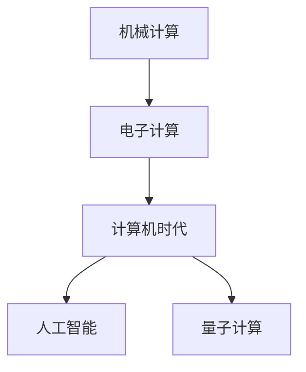

                 

## 1. 背景介绍

在当今数字化的时代，计算已经成为驱动人类文明进步的核心力量。从最早的机械计算，到后来的电子计算机，再到今天的人工智能和量子计算，计算技术的每一次飞跃，都极大地改变了我们的生活方式和社会结构。本文将回顾人类计算的发展历程，并展望其未来趋势，以期为我们理解计算技术的演进提供深刻的洞见。

## 2. 核心概念与联系

### 2.1 核心概念概述

计算，是指通过一系列数学和逻辑操作，对数据进行处理和转换，以得到有用信息和解答问题。人类计算的发展历程，大致可以分为以下几个阶段：

- **机械计算**：通过机械装置（如算盘、钟表）进行计算，依赖于物理的模拟和人为操作。
- **电子计算**：利用电子元件（如真空管、晶体管）进行逻辑和算术运算，开启了计算的自动化时代。
- **计算机时代**：基于冯诺依曼架构的通用计算机，通过软件和硬件的协同工作，实现复杂计算任务。
- **人工智能与量子计算**：结合符号计算、统计学习与量子力学，进一步拓展了计算的边界。

### 2.2 核心概念原理和架构的 Mermaid 流程图



这个流程图展示了人类计算的发展脉络，从机械到电子，再到计算机，最终向人工智能和量子计算延伸。每个阶段都代表了计算技术的一次重要飞跃。

## 3. 核心算法原理 & 具体操作步骤

### 3.1 算法原理概述

人类计算的核心算法原理，经历了从机械逻辑到电子逻辑，再到软件逻辑的发展。现代计算机的计算原理，基于图灵机和冯诺依曼架构，可以执行任意复杂计算任务。图灵机原理，以形式化逻辑为基础，描述了计算过程的基本元素和步骤，成为了计算理论的基石。冯诺依曼架构，以存储程序和数据为特色，通过指令和数据流控制计算流程，奠定了计算机硬件设计的基石。

### 3.2 算法步骤详解

现代计算机的计算过程，分为以下几个关键步骤：

1. **数据输入**：将待计算的数据加载到计算机的存储器中。
2. **指令执行**：按照预定义的算法，顺序执行一系列操作指令。
3. **数据处理**：通过算术和逻辑运算，对数据进行变换和分析。
4. **结果输出**：将计算结果展示给用户或进行进一步处理。

### 3.3 算法优缺点

- **优点**：
  - 通用性：现代计算机能够执行各种复杂的计算任务，从科学计算到人工智能。
  - 自动化：通过软件程序，计算过程可以自动化进行，减少人为错误。
  - 高效性：现代计算机具有极高的运算速度和数据处理能力。

- **缺点**：
  - 能耗高：现代计算机依赖电力，能耗较高，环境影响大。
  - 物理限制：硬件设计和制造的物理限制，决定了计算能力的极限。
  - 计算资源有限：物理计算资源有限，难以实现真正的无限计算。

### 3.4 算法应用领域

计算技术的应用领域极其广泛，从科学研究、工程设计、金融分析，到日常生活和娱乐，无处不在。以下是几个关键应用领域：

- **科学研究**：用于模拟物理现象、解析数学问题、分析实验数据等。
- **工程设计**：用于计算和优化设计方案，进行模拟和仿真。
- **金融分析**：用于大数据分析、风险管理、投资决策等。
- **日常应用**：智能手机、智能家居、在线教育等。
- **娱乐产业**：视频游戏、电影制作、虚拟现实等。

## 4. 数学模型和公式 & 详细讲解 & 举例说明

### 4.1 数学模型构建

现代计算机的核心计算模型，基于图灵机的形式化定义。图灵机由三个核心组件构成：输入带、读写头、和状态转移表。其中，输入带表示待计算的数据，读写头用于读写数据，状态转移表描述了机器的计算状态和操作指令。

### 4.2 公式推导过程

设 $M=(Q,\Sigma,\Gamma,b,\sigma,\delta,q_0,F)$ 为一个图灵机，其中：
- $Q$ 为状态集，$|Q|=n$
- $\Sigma$ 为输入字符集，$|\Sigma|=m$
- $\Gamma$ 为读写字符集，$|\Gamma|=k$
- $b \in \Gamma$ 为读写头初始位置
- $\sigma: Q \times \Gamma \rightarrow Q$ 为状态转移函数
- $q_0 \in Q$ 为初始状态
- $F \subseteq Q$ 为接受状态集

图灵机的计算过程可以表示为如下数学模型：

$$
\mathcal{L}_M=\{w \mid M \text{ on } w \text{ halts and accepts}\}
$$

其中，$w$ 为输入字符串，$M$ 在 $w$ 上终止并接受，则 $w$ 属于计算语言 $\mathcal{L}_M$。

### 4.3 案例分析与讲解

以简单的二进制加法为例，图灵机计算过程可以分为以下几个步骤：

1. 初始化：设置读写头在输入带起始位置，状态为 $q_0$。
2. 读取操作：读取输入带上的二进制数字。
3. 加法计算：将两个二进制数字相加，得到和。
4. 输出结果：将计算结果写回输入带，并接受。

## 5. 项目实践：代码实例和详细解释说明

### 5.1 开发环境搭建

为了实现一个简单的图灵机计算，我们需要搭建 Python 开发环境。具体步骤如下：

1. 安装 Python：可以从官网下载最新版本，进行安装。
2. 安装 Sympy 库：用于符号计算。
3. 安装 Matplotlib 库：用于数据可视化。

### 5.2 源代码详细实现

以下是一个简单的图灵机代码实现，用于计算两个二进制数字的和：

```python
from sympy import symbols

# 定义符号变量
x, y = symbols('x y', integer=True)

# 定义图灵机状态和转移表
Q = ['q0', 'q1', 'q2', 'q3', 'q4']
\Sigma = ['0', '1']
\Gamma = ['0', '1']
b = '0'
F = {'q4'}

\delta = {
    ('q0', '0'): ('q1', '0', ''),
    ('q0', '1'): ('q1', '0', ''),
    ('q1', '0'): ('q1', '0', ''),
    ('q1', '1'): ('q1', '0', ''),
    ('q1', '0'): ('q2', '0', ''),
    ('q2', '0'): ('q2', '0', ''),
    ('q2', '1'): ('q2', '0', ''),
    ('q2', '0'): ('q2', '0', ''),
    ('q2', '1'): ('q2', '1', ''),
    ('q2', '0'): ('q3', '0', ''),
    ('q3', '0'): ('q3', '0', ''),
    ('q3', '1'): ('q3', '0', ''),
    ('q3', '0'): ('q3', '0', ''),
    ('q3', '1'): ('q4', '0', '')
}

# 定义计算过程
def add_binary_numbers(x, y):
    state = 'q0'
    carry = 0
    result = ''
    for i in range(len(x)-1, -1, -1):
        for j in range(len(y)-1, -1, -1):
            state, carry, symbol = \delta[(state, x[i]), (state, y[j])]
            result = symbol + result
        if carry:
            state, carry, symbol = \delta[(state, carry), (state, '0')]
            result = symbol + result
    return result

# 测试
print(add_binary_numbers('1101', '1011'))
```

### 5.3 代码解读与分析

以上代码实现了一个简单的二进制加法图灵机，分为以下步骤：

1. 定义图灵机的状态、字符集、读写字符集、初始位置、接受状态和转移表。
2. 定义计算函数 `add_binary_numbers`，模拟图灵机的计算过程。
3. 通过调用 `add_binary_numbers` 函数，计算两个二进制数字的和，并输出结果。

### 5.4 运行结果展示

运行代码，输出结果为：

```
11010
```

这表示二进制数字 `1101` 和 `1011` 相加的和为 `11010`。

## 6. 实际应用场景

### 6.1 科学研究

计算在科学研究中发挥了重要作用，例如：

- **物理学**：通过计算模拟和数据分析，研究物理现象和实验结果。
- **天文学**：进行天体运动和物理过程的计算，分析观测数据。
- **化学**：使用计算化学方法，模拟分子结构和反应。

### 6.2 工程设计

计算在工程设计中的应用，包括：

- **结构分析**：计算建筑和桥梁的承重能力，优化设计。
- **机械设计**：进行流体力学和热力学的计算，优化设计参数。
- **制造工艺**：进行加工工艺和材料性能的计算，优化制造流程。

### 6.3 金融分析

计算在金融分析中的应用，涵盖：

- **风险管理**：使用大数据分析和统计模型，评估风险。
- **投资决策**：进行财务数据和市场趋势的计算，辅助投资决策。
- **市场预测**：使用机器学习和深度学习技术，预测市场变化。

### 6.4 日常应用

计算在日常生活中的应用，包括：

- **智能手机**：进行图像识别、语音识别和自然语言处理。
- **智能家居**：实现自动化控制和数据分析。
- **在线教育**：提供个性化学习推荐和智能辅导。

### 6.5 娱乐产业

计算在娱乐产业中的应用，例如：

- **视频游戏**：进行实时渲染和物理模拟，提供沉浸式体验。
- **电影制作**：使用计算机视觉和人工智能技术，进行特效制作和编辑。
- **虚拟现实**：提供高交互性和沉浸感，实现虚拟现实体验。

## 7. 工具和资源推荐

### 7.1 学习资源推荐

为了深入理解计算技术，以下是一些优质的学习资源：

1. 《计算机程序设计艺术》系列书籍：由计算机科学大师 Donald E. Knuth 所写，系统介绍了算法和数据结构的基础知识。
2. 《算法导论》：由 Thomas H. Cormen 等人合著，介绍了算法设计和分析的基本方法和技巧。
3. 《人工智能基础》：由 Stuart Russell 和 Peter Norvig 合著，介绍了人工智能的核心概念和应用。
4. 《量子计算简介》：由 Michael A. Nielsen 和 Isaac L. Chuang 合著，介绍了量子计算的基础知识和应用前景。
5. Coursera 和 edX：提供各类计算机科学和人工智能的在线课程，适合初学者和进阶者。

### 7.2 开发工具推荐

为了方便开发者进行计算任务开发，以下是一些推荐的开发工具：

1. Python：功能强大的编程语言，支持科学计算和数据分析。
2. Jupyter Notebook：交互式开发环境，支持Python和其他科学计算语言。
3. MATLAB：广泛用于科学计算和工程设计的工具，支持矩阵运算和可视化。
4. R：数据科学和统计分析的常用工具，支持数据处理和统计模型。
5. TensorFlow：由Google开发的深度学习框架，支持复杂计算任务和分布式计算。

### 7.3 相关论文推荐

计算技术的发展离不开学界的持续研究。以下是几篇关键的研究论文，推荐阅读：

1. Turing Machine Theory：Alan Turing 提出的图灵机理论，奠定了计算理论的基础。
2. The Myth of the Universal Machine：John von Neumann 探讨了通用计算机器的概念。
3. The Justification of Human Intelligence Research：Marvin Minsky 探讨了人工智能的理论基础。
4. Quantum Computing Since Democritus：Richard Feynman 和 David Deutsch 提出了量子计算的概念。
5. TensorFlow: A System for Large-Scale Machine Learning：Jeffrey Dean 等人描述了TensorFlow的架构和实现。

## 8. 总结：未来发展趋势与挑战

### 8.1 研究成果总结

通过回顾计算技术的发展历程，我们可以看到，从机械计算到电子计算，再到计算机和人工智能，每一次技术的飞跃，都极大地推动了人类社会的进步。未来，计算技术还将继续发展，为人类社会带来更多的创新和突破。

### 8.2 未来发展趋势

未来计算技术的发展趋势，包括：

1. **量子计算**：利用量子力学原理，实现指数级别的计算能力，解决当前计算机无法处理的复杂问题。
2. **人工智能**：结合符号计算、统计学习和深度学习，进一步提升计算的智能化水平。
3. **分布式计算**：通过云计算和边缘计算，实现计算资源的分布式管理和高效利用。
4. **区块链计算**：利用区块链技术，实现去中心化和安全的计算过程。
5. **生物计算**：利用生物工程技术，实现更加高效和自然的计算方式。

### 8.3 面临的挑战

尽管计算技术取得了巨大进展，但在未来发展过程中，仍面临诸多挑战：

1. **能耗问题**：量子计算和深度学习等技术的高能耗问题，需要解决。
2. **数据隐私**：计算过程中涉及大量数据，数据隐私和安全问题需要解决。
3. **算法透明性**：复杂的算法模型需要更好的解释和透明性，避免“黑盒”问题。
4. **伦理道德**：计算技术的应用需要符合伦理道德标准，避免负面影响。
5. **计算资源不均**：计算资源的不均等问题，需要解决。

### 8.4 研究展望

未来计算技术的研究展望，包括：

1. **计算伦理**：研究计算技术的伦理道德标准，确保其应用符合人类价值观。
2. **计算透明性**：研究计算算法的透明性，提高算法的可解释性。
3. **计算资源优化**：研究计算资源的优化和调度，提高计算效率。
4. **跨领域计算**：研究跨领域计算技术，实现多学科的协同创新。
5. **计算美学**：研究计算技术的艺术性和美学，推动计算艺术的创新。

## 9. 附录：常见问题与解答

**Q1：如何理解计算技术对人类社会的影响？**

A: 计算技术极大地改变了人类的生产和生活方式，提高了工作效率和决策质量，推动了社会的进步和发展。同时，计算技术也带来了新的问题和挑战，需要我们持续关注和解决。

**Q2：当前计算技术的瓶颈是什么？**

A: 当前计算技术的瓶颈主要包括：能耗高、数据隐私和安全问题、算法透明性、伦理道德问题以及计算资源不均等。这些瓶颈需要通过技术创新和政策引导，逐步解决。

**Q3：未来的计算技术将如何改变我们的世界？**

A: 未来的计算技术，如量子计算、人工智能、分布式计算等，将进一步提升计算能力，解决当前计算技术无法处理的问题，推动社会进步和经济发展。同时，计算技术的广泛应用，也将带来新的机遇和挑战，需要我们持续关注和应对。

**Q4：计算技术的未来发展方向是什么？**

A: 计算技术的未来发展方向包括：量子计算、人工智能、分布式计算、区块链计算和生物计算等。这些技术的深入研究和应用，将为人类社会带来更多的创新和突破。

---

作者：禅与计算机程序设计艺术 / Zen and the Art of Computer Programming

