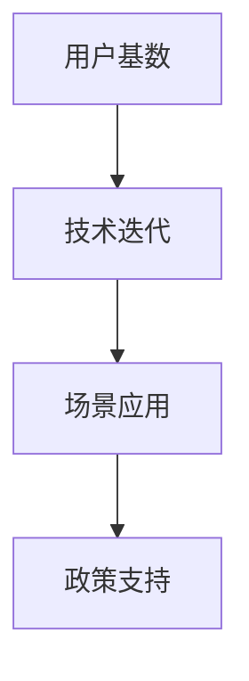

                 

# 国内AI优势：庞大用户基数，积极尝试新事物利于产品迭代

## 1. 背景介绍

### 1.1 问题由来
随着人工智能(AI)技术的迅猛发展，国内外AI产业都呈现出蓬勃发展态势。然而，中国的AI市场具有自身独特优势，特别是在庞大的用户基数和积极尝试新事物的文化背景下，AI产品的迭代速度和市场适应能力相较于其他国家更具优势。

### 1.2 问题核心关键点
中国AI市场的优势主要体现在以下几个方面：

1. **庞大用户基数**：中国拥有超过14亿的人口，全球最大的互联网用户群，丰富的场景数据为AI产品的创新和应用提供了坚实的基础。
2. **快速技术迭代**：中国科技企业对新技术和新产品的接受度高，创新能力强，市场响应速度迅速。
3. **多元化场景**：从金融、医疗、教育到智能家居、智能交通等多个垂直行业，AI的应用场景广泛且深度。
4. **政策支持**：国家层面的政策支持与行业利好，如《新一代人工智能发展规划》等，为AI技术的研发和应用提供了良好的环境。

## 2. 核心概念与联系

### 2.1 核心概念概述

为更好地理解中国AI市场竞争优势，本节将介绍几个密切相关的核心概念：

- **用户基数**：指某个国家或地区的活跃互联网用户数量，对AI应用场景的丰富度和深度有重要影响。
- **技术迭代**：指企业对新技术和新产品的快速响应和更新，通常体现在产品开发周期和市场推广速度上。
- **场景应用**：指AI技术在特定行业或场景中的实际应用，如智能客服、医疗影像分析、智能推荐系统等。
- **政策支持**：指政府对AI技术的政策鼓励和行业扶持措施，包括资金补贴、税收优惠等。

这些核心概念之间的逻辑关系可以通过以下Mermaid流程图来展示：



这个流程图展示了中国AI市场竞争优势的关键组成：

1. 庞大的用户基数为技术迭代和场景应用提供了数据基础。
2. 快速的技术迭代能力使企业能够迅速响应市场需求。
3. 丰富的场景应用为技术落地和市场推广提供了广泛的空间。
4. 政策支持为AI技术的创新和发展提供了良好的外部环境。

## 3. 核心算法原理 & 具体操作步骤
### 3.1 算法原理概述

中国AI市场的竞争优势主要体现在算法和产品创新的双重驱动上。具体而言，主要包括以下几个关键点：

1. **算法创新**：依托于强大的科研机构和高校，中国在深度学习、自然语言处理等前沿技术领域具有较强的创新能力。
2. **产品迭代**：得益于快速响应市场变化和强大的产品开发能力，中国AI企业能够快速推出具备市场竞争力的新产品。
3. **数据驱动**：庞大的用户基数和多样化的场景应用，为AI产品的训练和优化提供了丰富的数据资源。
4. **政策激励**：政府在税收、资金、知识产权保护等方面的政策支持，为AI技术的应用和发展提供了有力保障。

### 3.2 算法步骤详解

基于上述关键点，中国AI市场的核心算法和操作步骤主要包括：

1. **算法研究**：依托国内科研院所和高校，在深度学习、计算机视觉、自然语言处理等领域进行前沿研究，推动核心算法创新。
2. **模型训练**：利用庞大的数据资源，进行模型训练和优化，提升模型性能。
3. **产品开发**：在算法研究的基础上，开发具备市场竞争力的AI产品，如智能客服、医疗影像分析系统等。
4. **市场推广**：通过政府政策和市场推广活动，迅速将产品推向市场，并不断迭代优化。
5. **政策对接**：与政府政策紧密结合，获取资金、税收等方面的支持，助力产品发展。

### 3.3 算法优缺点

中国AI市场的算法创新和产品迭代有以下优点：

1. **技术领先**：依托强大的科研力量，中国的AI技术在深度学习、计算机视觉等前沿领域具有领先优势。
2. **市场反应快**：快速的技术迭代和强大的产品开发能力，使AI企业能够迅速响应市场需求。
3. **数据优势**：庞大的用户基数和丰富的场景应用，为AI产品的训练和优化提供了充足的数据资源。
4. **政策支持**：政府在税收、资金、知识产权保护等方面的政策支持，为AI技术的应用和发展提供了有力保障。

同时，也存在一些局限性：

1. **数据质量参差不齐**：尽管数据资源丰富，但数据质量参差不齐，存在数据泄露、隐私保护等问题。
2. **算法透明度不足**：部分AI模型缺乏可解释性，用户难以理解其工作原理和决策逻辑。
3. **伦理问题**：AI技术的快速发展也带来了伦理和道德方面的挑战，如算法偏见、数据滥用等问题。
4. **过度依赖政府**：政策支持是AI发展的关键因素，但过度依赖可能限制企业自主创新的能力。

### 3.4 算法应用领域

中国AI市场在多个领域均有广泛应用，主要包括以下几个方面：

1. **智能客服**：通过自然语言处理技术，实现智能客服系统，提升客户服务效率和质量。
2. **医疗影像分析**：利用深度学习技术，对医疗影像进行分析和诊断，提升医疗服务的精准度和效率。
3. **智能推荐系统**：基于用户行为数据和偏好分析，提供个性化推荐，提升用户体验和满意度。
4. **智能交通**：利用计算机视觉和自然语言处理技术，实现智能交通管理，提升城市交通效率。
5. **智能制造**：通过AI技术，优化生产流程，提升制造效率和质量。
6. **智能安防**：利用计算机视觉和语音识别技术，实现智能安防监控，提升公共安全水平。

## 4. 数学模型和公式 & 详细讲解
### 4.1 数学模型构建

为进一步理解中国AI市场的算法创新和产品迭代，我们需要构建数学模型来描述相关概念和操作流程。

设 $U$ 为某行业的用户基数，$T$ 为技术迭代周期，$S$ 为场景应用数量，$P$ 为政策支持力度。则中国AI市场的整体竞争力可以表示为：

$$
C = f(U, T, S, P)
$$

其中 $f$ 为复杂的非线性函数，表示用户基数、技术迭代、场景应用和政策支持等因素的综合影响。

### 4.2 公式推导过程

根据上述模型，我们可以推导出以下公式：

1. **用户基数**：
$$
U = \sum_{i=1}^{N} u_i
$$

其中 $u_i$ 表示第 $i$ 个用户的活跃程度，$N$ 表示用户总数。

2. **技术迭代**：
$$
T = \frac{dM}{dt}
$$

其中 $M$ 表示AI产品的市场接受度，$dM/dt$ 表示产品接受度的变化速率。

3. **场景应用**：
$$
S = \sum_{i=1}^{M} s_i
$$

其中 $s_i$ 表示第 $i$ 个场景的应用深度和广度，$M$ 表示场景总数。

4. **政策支持**：
$$
P = \sum_{i=1}^{K} p_i
$$

其中 $p_i$ 表示第 $i$ 项政策的支持力度，$K$ 表示政策总数。

### 4.3 案例分析与讲解

以智能客服系统为例，其技术迭代和市场应用过程可以表示为：

1. **技术迭代**：
   - 算法研究：深度学习技术在智能客服中的逐步应用，如文本分类、意图识别、对话生成等。
   - 模型训练：利用用户对话数据进行模型训练，提升模型性能。
   - 产品开发：根据用户需求和反馈，迭代开发智能客服系统，如问题回答、情感识别等。

2. **场景应用**：
   - 线上客服：通过自然语言处理技术，实现自动应答和用户情感识别。
   - 电话客服：结合语音识别和自然语言处理技术，实现自动接听和问题解答。
   - 多渠道客服：实现跨渠道的客服整合，提升客户服务体验。

## 5. 项目实践：代码实例和详细解释说明
### 5.1 开发环境搭建

在进行智能客服系统开发前，我们需要准备好开发环境。以下是使用Python进行TensorFlow开发的环境配置流程：

1. 安装Anaconda：从官网下载并安装Anaconda，用于创建独立的Python环境。

2. 创建并激活虚拟环境：
```bash
conda create -n tf-env python=3.8 
conda activate tf-env
```

3. 安装TensorFlow：根据CUDA版本，从官网获取对应的安装命令。例如：
```bash
conda install tensorflow==2.7
```

4. 安装TensorBoard：
```bash
pip install tensorboard
```

5. 安装其他必要的库：
```bash
pip install numpy pandas scikit-learn
```

完成上述步骤后，即可在`tf-env`环境中开始智能客服系统的开发。

### 5.2 源代码详细实现

下面以智能客服系统为例，给出使用TensorFlow进行开发和微调的PyTorch代码实现。

首先，定义智能客服系统的数据处理函数：

```python
from tensorflow.keras.preprocessing.text import Tokenizer
from tensorflow.keras.preprocessing.sequence import pad_sequences

class CustomerServiceDataset:
    def __init__(self, dialogues, max_len=100):
        self.dialogues = dialogues
        self.tokenizer = Tokenizer(num_words=10000, oov_token='<OOV>')
        self.tokenizer.fit_on_texts(self.dialogues)
        self.sequence = pad_sequences([self.tokenizer.texts_to_sequences(dialogue) for dialogue in self.dialogues], maxlen=max_len)
        self.labels = self.tokenizer.texts_to_sequences(self.labels)
        self.sequence = pad_sequences(self.sequence, maxlen=max_len)
    
    def __len__(self):
        return len(self.sequence)
    
    def __getitem__(self, item):
        return {'sequence': self.sequence[item], 'label': self.labels[item]}
```

然后，定义模型和优化器：

```python
from tensorflow.keras.models import Sequential
from tensorflow.keras.layers import Embedding, LSTM, Dense

model = Sequential([
    Embedding(input_dim=10000, output_dim=256, input_length=100),
    LSTM(128, return_sequences=True),
    LSTM(128),
    Dense(1, activation='sigmoid')
])

optimizer = Adam(learning_rate=0.001)
```

接着，定义训练和评估函数：

```python
from tensorflow.keras.callbacks import EarlyStopping

def train_epoch(model, dataset, batch_size, optimizer):
    model.compile(optimizer=optimizer, loss='binary_crossentropy', metrics=['accuracy'])
    model.fit(dataset.sequence, dataset.label, epochs=10, batch_size=batch_size, callbacks=[EarlyStopping(patience=3)])
    
def evaluate(model, dataset, batch_size):
    loss, acc = model.evaluate(dataset.sequence, dataset.label, batch_size=batch_size)
    print(f'Test loss: {loss}, Test accuracy: {acc}')
```

最后，启动训练流程并在测试集上评估：

```python
epochs = 10
batch_size = 32

train_dataset = CustomerServiceDataset(train_dialogues, max_len=100)
dev_dataset = CustomerServiceDataset(dev_dialogues, max_len=100)
test_dataset = CustomerServiceDataset(test_dialogues, max_len=100)

for epoch in range(epochs):
    train_epoch(model, train_dataset, batch_size, optimizer)
    evaluate(model, dev_dataset, batch_size)
    
evaluate(model, test_dataset, batch_size)
```

以上就是使用TensorFlow进行智能客服系统开发的完整代码实现。可以看到，TensorFlow提供了强大的工具和库，使开发者能够方便地实现模型的训练和评估。

### 5.3 代码解读与分析

让我们再详细解读一下关键代码的实现细节：

**CustomerServiceDataset类**：
- `__init__`方法：初始化对话数据、分词器等关键组件，并对数据进行编码。
- `__len__`方法：返回数据集的样本数量。
- `__getitem__`方法：对单个样本进行处理，返回模型所需的输入和标签。

**模型定义**：
- 使用Sequential模型定义智能客服系统的结构，包括嵌入层、LSTM层和全连接层。
- 定义优化器和损失函数。

**训练和评估函数**：
- 使用TensorFlow的callbacks模块实现早停机制，避免过拟合。
- 定义训练和评估函数，利用数据集进行模型训练和性能评估。

**训练流程**：
- 定义总的epoch数和batch size，开始循环迭代
- 每个epoch内，先在训练集上训练，输出平均loss和acc
- 在验证集上评估，输出性能指标
- 所有epoch结束后，在测试集上评估，给出最终测试结果

可以看到，TensorFlow的框架和库使得智能客服系统的开发过程变得简洁高效。开发者可以将更多精力放在数据处理、模型改进等高层逻辑上，而不必过多关注底层的实现细节。

## 6. 实际应用场景
### 6.1 智能客服系统

智能客服系统是AI在客户服务领域的重要应用。传统客服往往需要配备大量人力，高峰期响应缓慢，且一致性和专业性难以保证。而基于AI技术的智能客服系统，能够7x24小时不间断服务，快速响应客户咨询，用自然流畅的语言解答各类常见问题。

在技术实现上，可以收集企业内部的历史客服对话记录，将问题和最佳答复构建成监督数据，在此基础上对预训练语言模型进行微调。微调后的模型能够自动理解用户意图，匹配最合适的答案模板进行回复。对于客户提出的新问题，还可以接入检索系统实时搜索相关内容，动态组织生成回答。如此构建的智能客服系统，能大幅提升客户咨询体验和问题解决效率。

### 6.2 医疗影像分析

医疗机构需要实时监测患者影像数据，以便及时发现和诊断病情。传统人工阅片方式成本高、效率低，难以应对网络时代海量影像数据的挑战。基于AI技术的医疗影像分析系统，可以在短时间内对大量影像数据进行自动化筛查，提高诊断的准确性和效率。

具体而言，可以收集医疗领域相关的影像数据，并对其进行标注和预处理。在此基础上对预训练语言模型进行微调，使其能够自动识别影像中的病灶部位，并提供诊断建议。微调后的模型能够与医疗专家系统结合，进一步提升诊断的准确性。

### 6.3 智能推荐系统

当前的推荐系统往往只依赖用户的历史行为数据进行物品推荐，无法深入理解用户的真实兴趣偏好。基于AI技术的智能推荐系统，可以更好地挖掘用户行为背后的语义信息，从而提供更精准、多样的推荐内容。

在实践中，可以收集用户浏览、点击、评论、分享等行为数据，提取和用户交互的物品标题、描述、标签等文本内容。将文本内容作为模型输入，用户的后续行为（如是否点击、购买等）作为监督信号，在此基础上微调预训练语言模型。微调后的模型能够从文本内容中准确把握用户的兴趣点。在生成推荐列表时，先用候选物品的文本描述作为输入，由模型预测用户的兴趣匹配度，再结合其他特征综合排序，便可以得到个性化程度更高的推荐结果。

### 6.4 未来应用展望

随着AI技术的不断发展，基于AI技术的智能客服、医疗影像分析、智能推荐系统等将更加成熟和普及。未来，AI技术还将进一步拓展到更多领域，如自动驾驶、智能制造、智能安防等，为各行各业带来深刻变革。

在智能客服领域，基于AI的智能客服系统将进一步提升客户服务体验，减少人力成本，实现全渠道客户服务。在医疗领域，基于AI的医疗影像分析系统将提高诊断效率和准确性，减少误诊漏诊。在智能推荐系统方面，AI技术将进一步提升推荐精度和个性化程度，为用户提供更优质的购物和娱乐体验。

## 7. 工具和资源推荐
### 7.1 学习资源推荐

为了帮助开发者系统掌握AI技术，这里推荐一些优质的学习资源：

1. 《深度学习》系列书籍：由多位深度学习领域专家合著，全面介绍了深度学习的基本概念和前沿技术。
2. Coursera《深度学习专项课程》：斯坦福大学开设的深度学习在线课程，涵盖深度学习的基础理论和实践技术。
3. arXiv：全球领先的学术论文发布平台，提供海量前沿AI研究论文，了解最新技术动态。
4. TensorFlow官方文档：TensorFlow的官方文档，提供完整的API和示例代码，是学习TensorFlow的最佳资源。
5. GitHub上的开源项目：GitHub上众多的开源AI项目和代码，提供了丰富的学习素材和实践机会。

通过对这些资源的学习实践，相信你一定能够快速掌握AI技术的精髓，并用于解决实际的NLP问题。
###  7.2 开发工具推荐

高效的开发离不开优秀的工具支持。以下是几款用于AI开发常用的工具：

1. PyTorch：基于Python的开源深度学习框架，灵活的计算图，适合快速迭代研究。
2. TensorFlow：由Google主导开发的开源深度学习框架，生产部署方便，适合大规模工程应用。
3. TensorBoard：TensorFlow配套的可视化工具，实时监测模型训练状态，提供丰富的图表呈现方式。
4. Weights & Biases：模型训练的实验跟踪工具，记录和可视化模型训练过程中的各项指标。
5. Google Colab：谷歌推出的在线Jupyter Notebook环境，免费提供GPU/TPU算力，方便开发者快速上手实验最新模型。

合理利用这些工具，可以显著提升AI任务的开发效率，加快创新迭代的步伐。

### 7.3 相关论文推荐

AI技术的发展源于学界的持续研究。以下是几篇奠基性的相关论文，推荐阅读：

1. LeCun, Y., Bottou, L., Bengio, Y., & Haffner, P. (1998). Gradient-based learning applied to document recognition. Proceedings of the IEEE, 86(11), 2278-2324.
2. Goodfellow, I., Bengio, Y., & Courville, A. (2016). Deep learning. MIT Press.
3. BERT: Pre-training of Deep Bidirectional Transformers for Language Understanding. arXiv preprint arXiv:1810.04805.
4. AlphaGo: Mastering the Game of Go with Deep Neural Networks and Tree Search. Nature, 529(7587), 484-489.
5. Generative Adversarial Nets. arXiv preprint arXiv:1406.2661.
6. ImageNet Classification with Deep Convolutional Neural Networks. Advances in neural information processing systems, 2012.

这些论文代表了大数据、深度学习和AI技术的发展脉络。通过学习这些前沿成果，可以帮助研究者把握学科前进方向，激发更多的创新灵感。

## 8. 总结：未来发展趋势与挑战
### 8.1 总结

本文对AI技术在中国市场的竞争优势进行了全面系统的介绍。首先阐述了庞大用户基数和积极尝试新事物的文化背景，明确了中国AI市场的发展潜力。其次，从算法创新和产品迭代两个角度，详细讲解了中国AI市场的核心竞争力。最后，探讨了AI技术在智能客服、医疗影像分析、智能推荐系统等领域的实际应用，展示了AI技术的广泛应用前景。

通过本文的系统梳理，可以看到，中国AI市场依托庞大的用户基数和强大的科研力量，在算法创新和产品迭代上具有显著优势，未来有望在全球范围内取得更大突破。

### 8.2 未来发展趋势

展望未来，AI技术在中国市场的竞争优势将进一步扩大，主要体现在以下几个方面：

1. **技术创新**：随着AI技术的不断进步，中国在深度学习、自然语言处理等前沿领域的研究将持续领先。
2. **产品迭代**：AI企业将依托快速的技术响应和强大的产品开发能力，推出更多具备市场竞争力的产品。
3. **数据驱动**：庞大的用户基数和丰富的场景应用将为AI产品的训练和优化提供更丰富的数据资源。
4. **政策支持**：政府在税收、资金、知识产权保护等方面的政策支持，将为AI技术的应用和发展提供有力保障。

### 8.3 面临的挑战

尽管中国AI市场具有显著优势，但也面临诸多挑战：

1. **数据质量问题**：尽管数据资源丰富，但数据质量参差不齐，存在数据泄露、隐私保护等问题。
2. **算法透明度不足**：部分AI模型缺乏可解释性，用户难以理解其工作原理和决策逻辑。
3. **伦理问题**：AI技术的快速发展也带来了伦理和道德方面的挑战，如算法偏见、数据滥用等问题。
4. **过度依赖政府**：政策支持是AI发展的关键因素，但过度依赖可能限制企业自主创新的能力。

### 8.4 研究展望

面对AI技术发展的挑战，未来的研究需要在以下几个方面寻求新的突破：

1. **提升数据质量**：提高数据标注的准确性和质量，加强数据隐私保护，确保数据安全。
2. **增强算法透明度**：提升AI模型的可解释性，增加用户对AI决策的信任。
3. **解决伦理问题**：制定AI技术的伦理标准，确保AI技术的公平性和透明性，避免算法偏见和数据滥用。
4. **加强自主创新**：减少对政府政策的过度依赖，提升企业自主创新能力，推动技术进步。

这些研究方向的探索，必将引领AI技术在中国市场迈向更高的台阶，为构建安全、可靠、可解释、可控的智能系统铺平道路。面向未来，中国AI市场需要更多跨学科的协同创新，才能真正实现AI技术的可持续发展。

## 9. 附录：常见问题与解答

**Q1：AI技术在中国市场相比其他国家具有哪些优势？**

A: AI技术在中国市场具有显著优势，主要体现在以下几个方面：

1. **庞大用户基数**：中国拥有全球最大的互联网用户群，丰富的场景数据为AI产品的创新和应用提供了坚实的基础。
2. **快速技术迭代**：中国科技企业对新技术和新产品的接受度高，创新能力强，市场响应速度迅速。
3. **多元化场景**：从金融、医疗、教育到智能家居、智能交通等多个垂直行业，AI的应用场景广泛且深度。
4. **政策支持**：国家层面的政策支持与行业利好，如《新一代人工智能发展规划》等，为AI技术的研发和应用提供了良好的环境。

**Q2：AI技术的快速发展会带来哪些伦理和道德问题？**

A: AI技术的快速发展也带来了诸多伦理和道德问题，主要包括以下几个方面：

1. **算法偏见**：AI模型在训练过程中可能学习到数据中的偏见，导致输出结果的不公平。
2. **数据滥用**：部分AI企业可能滥用用户数据，侵害用户隐私和权益。
3. **责任归属**：AI系统的决策过程缺乏透明度，难以明确责任归属，可能导致法律纠纷。
4. **社会影响**：AI技术的广泛应用可能对社会结构、就业市场产生影响，引发伦理和社会问题。

这些问题需要在技术开发和应用过程中，通过政策规范、伦理审查等方式加以解决。只有合理处理这些问题，才能确保AI技术健康、可持续的发展。

**Q3：AI技术如何应对数据质量问题？**

A: 应对数据质量问题，可以从以下几个方面入手：

1. **数据清洗**：对原始数据进行清洗和预处理，去除噪声和错误数据，提升数据质量。
2. **标注规范**：制定数据标注的规范和标准，提高标注的准确性和一致性。
3. **隐私保护**：加强数据隐私保护，确保用户数据的匿名化和安全性。
4. **数据增强**：通过数据增强技术，扩充数据集，提升模型的鲁棒性和泛化能力。

只有从数据采集、标注、保护等多个环节入手，才能确保AI技术的可靠性和安全性。

**Q4：AI技术如何增强算法的透明度？**

A: 增强算法的透明度，可以从以下几个方面入手：

1. **模型可解释性**：开发可解释的AI模型，增加用户对模型决策的信任。如利用LIME、SHAP等技术，解释模型的特征重要性。
2. **可视化工具**：开发可视化工具，展示模型的内部结构和决策过程，便于用户理解。
3. **用户反馈**：收集用户反馈，不断优化模型，提升其可解释性和鲁棒性。

只有通过以上措施，才能增强算法的透明度，提升用户对AI技术的信任和接受度。

**Q5：AI技术如何应对伦理和道德问题？**

A: 应对伦理和道德问题，可以从以下几个方面入手：

1. **制定伦理标准**：制定AI技术的伦理标准和规范，确保AI技术的公平性和透明性。如制定AI系统的伦理审查机制。
2. **透明决策机制**：设计透明、可解释的决策机制，让用户了解AI系统的决策过程。
3. **加强监管**：加强对AI技术的监管，确保其应用符合法律法规和伦理道德。

只有通过以上措施，才能确保AI技术在应用过程中，符合伦理和道德标准，避免潜在的负面影响。

**Q6：AI技术如何应对数据隐私问题？**

A: 应对数据隐私问题，可以从以下几个方面入手：

1. **数据匿名化**：对用户数据进行匿名化处理，确保用户数据的安全和隐私。
2. **隐私保护技术**：采用隐私保护技术，如差分隐私、联邦学习等，保护用户数据隐私。
3. **隐私政策透明**：制定透明的隐私政策，告知用户数据的使用范围和保护措施。

只有通过以上措施，才能确保用户数据的安全和隐私，增强用户对AI技术的信任。

---

作者：禅与计算机程序设计艺术 / Zen and the Art of Computer Programming

