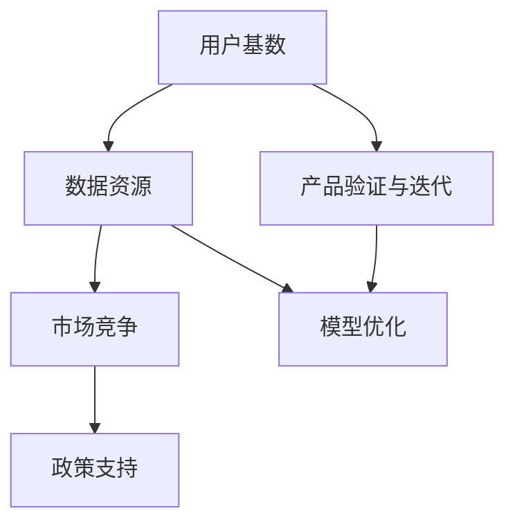

                 

## 1. 背景介绍

### 1.1 问题由来

随着人工智能技术的不断发展和应用，中国已经逐渐成为全球AI领域的重要力量。国内拥有庞大的用户基数和丰富的数据资源，这使得中国AI公司在产品验证和迭代方面具有显著优势。然而，相较于一些AI强国的技术积累，中国AI公司尚存在不足。

### 1.2 问题核心关键点

国内AI公司在用户基数和数据资源上的优势主要体现在以下几个方面：

- **用户基数庞大**：中国拥有14亿人口，这为AI应用提供了庞大且多样的用户基础。不同年龄、性别、职业、地域的广泛分布，使得AI产品在各种场景下都能得到充分的验证和优化。
- **数据资源丰富**：由于语言、文化和地域的差异，中文数据资源具有独特性和多样性，这为AI模型的训练和优化提供了宝贵的参考。海量的中文数据可以极大地提升模型的泛化能力和鲁棒性。
- **市场竞争激烈**：中国AI市场竞争激烈，众多公司竞相推出创新产品，推动AI技术快速迭代。这种竞争环境迫使企业不断优化产品，提升用户体验。
- **政策支持**：中国政府对AI领域给予大力支持，包括设立专项基金、提供税收优惠、建立AI开放平台等，这些政策激励了企业的研发投入和创新活力。

这些优势使得国内AI公司能够更高效地进行产品验证与迭代，加速技术落地和市场应用。

### 1.3 问题研究意义

研究国内AI公司的优势和面临的挑战，对于推动AI技术的发展和应用具有重要意义：

- **提升产品竞争力**：了解国内AI公司的优势可以帮助企业制定更科学的产品开发策略，提升产品和服务的市场竞争力。
- **优化技术生态**：通过分析国内AI公司的优势和不足，可以优化技术生态，推动国内AI技术整体进步。
- **促进国际交流**：了解国内AI公司与国际强国的差距，有助于国内AI企业学习先进经验，提升国际竞争力。
- **推动产业发展**：分析国内AI公司的优势与挑战，可以更好地促进AI产业的快速发展和应用。

## 2. 核心概念与联系

### 2.1 核心概念概述

为更好地理解国内AI公司的优势，本节将介绍几个关键概念：

- **用户基数**：指产品或服务可触及的潜在用户数量，通常与市场规模和潜在价值相关。
- **数据资源**：指可用于训练和优化AI模型的各种数据，包括标注数据、未标注数据、合成数据等。
- **市场竞争**：指不同企业和产品之间在市场中的竞争关系，影响产品和服务的市场接受度与迭代速度。
- **政策支持**：指政府对AI领域提供的各种支持政策，包括资金、税收、知识产权保护等，影响企业的研发投入和技术创新。

这些概念之间通过互动与协同，共同作用于AI产品的开发与迭代。

### 2.2 核心概念原理和架构的 Mermaid 流程图



这个流程图展示了大语言模型微调的原理和各概念间的联系：

1. 庞大的用户基数(A)提供了丰富的数据资源(B)，这些数据资源可以用于训练和优化AI模型。
2. 在激烈的市场竞争(C)中，企业不断验证与迭代产品(E)，以提升市场竞争力。
3. 政策支持(D)激励了企业进行更多的研发投入和创新，进一步推动产品优化和迭代。
4. 通过产品验证与迭代(E)和模型优化(F)，企业不断提升AI模型的效果，增强市场竞争力。

## 3. 核心算法原理 & 具体操作步骤

### 3.1 算法原理概述

基于用户基数和数据资源的优势，国内AI公司在产品验证与迭代方面具有以下优势：

- **数据多样性**：丰富的用户数据使AI模型能够学习到更多样的语言和行为特征，提升模型的泛化能力和鲁棒性。
- **反馈机制高效**：大规模用户基数使得产品反馈迅速，企业能够快速响应和调整，提高产品迭代速度。
- **创新动力强**：激烈的市场竞争促使企业不断推出创新产品，推动技术快速迭代。
- **政策激励**：政府政策的支持可以显著降低企业研发成本，提升创新动力。

### 3.2 算法步骤详解

基于上述优势，国内AI公司的产品验证与迭代通常遵循以下步骤：

**Step 1: 用户数据收集**
- 通过在线平台、APP、社交媒体等渠道，收集用户数据。
- 使用爬虫、API接口等方式，获取更多元的用户行为数据。

**Step 2: 数据预处理**
- 清洗数据，去除噪音和异常值。
- 对数据进行标注，构建训练集和测试集。

**Step 3: 模型训练与优化**
- 利用大规模数据资源，选择适合模型架构，训练AI模型。
- 通过用户反馈，不断优化模型参数，提升模型效果。

**Step 4: 产品部署与迭代**
- 将训练好的模型部署到实际应用中，获取用户反馈。
- 根据反馈，持续改进产品功能，进行产品迭代。

**Step 5: 政策申请与激励**
- 申请政府提供的各种政策支持，如专项基金、税收优惠等。
- 利用政策支持，提升研发投入和创新力度。

### 3.3 算法优缺点

国内AI公司产品验证与迭代的优势主要体现在：

- **数据多样性与丰富性**：丰富的数据资源使AI模型泛化能力更强，适应各种场景。
- **用户反馈高效**：庞大的用户基数使得产品反馈迅速，企业能够快速调整产品。
- **市场竞争推动创新**：激烈的市场竞争促进企业不断推出新产品，提升技术创新速度。
- **政策支持有力**：政府政策提供资金和税收激励，降低研发成本，提升企业创新能力。

同时，这种模式也存在以下缺点：

- **数据隐私问题**：收集大量用户数据可能面临隐私和合规风险。
- **过度依赖用户反馈**：过于依赖用户反馈可能导致创新动力不足，产品陷入用户需求主导的泥潭。
- **竞争风险**：市场竞争激烈可能带来同质化竞争，降低市场空间和利润空间。
- **政策依赖性强**：过度依赖政府政策可能降低企业的自主创新能力。

### 3.4 算法应用领域

基于用户基数和数据资源优势的AI产品验证与迭代方法，已经广泛应用于多个领域，例如：

- **智能客服**：利用大数据和用户反馈，不断优化自然语言理解和生成技术，提升用户体验。
- **智能推荐**：通过分析用户行为和偏好，不断迭代推荐算法，提高推荐效果。
- **医疗影像分析**：通过大量医学数据和专家反馈，提升AI在医疗影像分析上的效果，辅助医生诊断。
- **金融风控**：通过分析交易数据和用户行为，提升风险识别和控制能力，保障金融安全。
- **智能家居**：通过收集用户使用数据，不断优化智能家居系统，提升用户体验和功能。

此外，在城市管理、智能交通、智慧农业等诸多领域，基于用户基数和数据资源优势的AI产品验证与迭代，也有广泛的应用前景。

## 4. 数学模型和公式 & 详细讲解 & 举例说明

### 4.1 数学模型构建

国内AI公司在产品验证与迭代中，通常会使用如下数学模型：

- **模型训练与优化**：

$$
\hat{\theta} = \mathop{\arg\min}_{\theta} \frac{1}{N}\sum_{i=1}^{N} (y_i - \hat{y}_i)^2
$$

其中，$\theta$ 为模型参数，$y_i$ 为真实标签，$\hat{y}_i$ 为模型预测标签。

- **模型效果评估**：

$$
\text{Accuracy} = \frac{1}{N}\sum_{i=1}^{N} \mathbb{I}(y_i = \hat{y}_i)
$$

其中，$\mathbb{I}$ 为指示函数，当 $y_i = \hat{y}_i$ 时，指示函数值为1。

### 4.2 公式推导过程

以下我们以智能推荐系统为例，推导模型训练和评估公式。

**模型训练**：

$$
\hat{\theta} = \mathop{\arg\min}_{\theta} \frac{1}{N}\sum_{i=1}^{N} (y_i - \hat{y}_i)^2
$$

其中，$y_i$ 为用户对商品的评分，$\hat{y}_i$ 为模型预测的评分。

**模型评估**：

$$
\text{RMSE} = \sqrt{\frac{1}{N}\sum_{i=1}^{N} (\hat{y}_i - y_i)^2}
$$

其中，$\text{RMSE}$ 为均方根误差，用于衡量模型的预测精度。

### 4.3 案例分析与讲解

以智能推荐系统为例，具体讲解数学模型在实际中的应用：

- **模型训练**：选择适合算法，如协同过滤、矩阵分解等，利用用户评分数据训练模型。
- **模型评估**：在验证集和测试集上计算RMSE，评估模型预测效果。
- **产品迭代**：根据评估结果，调整算法参数或引入新特征，提高推荐效果。

## 5. 项目实践：代码实例和详细解释说明

### 5.1 开发环境搭建

在进行产品验证与迭代实践前，我们需要准备好开发环境。以下是使用Python进行PyTorch开发的环境配置流程：

1. 安装Anaconda：从官网下载并安装Anaconda，用于创建独立的Python环境。

2. 创建并激活虚拟环境：
```bash
conda create -n pytorch-env python=3.8 
conda activate pytorch-env
```

3. 安装PyTorch：根据CUDA版本，从官网获取对应的安装命令。例如：
```bash
conda install pytorch torchvision torchaudio cudatoolkit=11.1 -c pytorch -c conda-forge
```

4. 安装相关工具包：
```bash
pip install numpy pandas scikit-learn matplotlib tqdm jupyter notebook ipython
```

完成上述步骤后，即可在`pytorch-env`环境中开始产品验证与迭代实践。

### 5.2 源代码详细实现

这里以智能推荐系统为例，给出使用PyTorch进行模型训练和优化的PyTorch代码实现。

首先，定义模型：

```python
import torch
from torch import nn, optim
from torch.utils.data import DataLoader

class Recommender(nn.Module):
    def __init__(self, in_dim, out_dim):
        super().__init__()
        self.fc1 = nn.Linear(in_dim, 128)
        self.fc2 = nn.Linear(128, 128)
        self.fc3 = nn.Linear(128, out_dim)
    
    def forward(self, x):
        x = torch.relu(self.fc1(x))
        x = torch.relu(self.fc2(x))
        x = self.fc3(x)
        return x
```

然后，定义数据集：

```python
import pandas as pd
from sklearn.model_selection import train_test_split

df = pd.read_csv('ratings.csv')
train_df, test_df = train_test_split(df, test_size=0.2, random_state=42)
train_df = train_df.dropna()
test_df = test_df.dropna()

train_x = train_df['user'] + ' ' + train_df['item']
train_y = train_df['rating']
test_x = test_df['user'] + ' ' + test_df['item']
test_y = test_df['rating']
```

接着，进行模型训练：

```python
in_dim = train_x.shape[1]
out_dim = 1

model = Recommender(in_dim, out_dim)
optimizer = optim.Adam(model.parameters(), lr=0.001)
criterion = nn.MSELoss()

for epoch in range(100):
    train_loader = DataLoader(train_df, batch_size=32, shuffle=True)
    for batch_idx, (x, y) in enumerate(train_loader):
        x = torch.tensor(x)
        y = torch.tensor(y).view(-1, 1)
        
        optimizer.zero_grad()
        output = model(x)
        loss = criterion(output, y)
        loss.backward()
        optimizer.step()
        
    print(f'Epoch {epoch+1}, train loss: {loss:.4f}')
```

最后，进行模型评估：

```python
test_loader = DataLoader(test_df, batch_size=32, shuffle=False)
with torch.no_grad():
    for batch_idx, (x, y) in enumerate(test_loader):
        x = torch.tensor(x)
        y = torch.tensor(y).view(-1, 1)
        
        output = model(x)
        loss = criterion(output, y)
        rmse = torch.sqrt(loss)
        
    print(f'Test RMSE: {rmse:.4f}')
```

以上就是使用PyTorch对智能推荐系统进行模型训练和优化的完整代码实现。可以看到，通过选择合适的模型和优化算法，利用大量用户数据进行训练和优化，可以显著提升推荐系统的性能。

### 5.3 代码解读与分析

让我们再详细解读一下关键代码的实现细节：

**定义模型**：
- `nn.Module`继承类，用于定义模型结构。
- 三个全连接层，用于从输入到输出的数据处理和特征映射。

**定义数据集**：
- 利用Pandas读取数据，并进行数据清洗和特征工程。
- 使用`train_test_split`函数划分训练集和测试集。
- 将用户和物品名称拼接成字符串，作为输入特征。
- 将评分作为目标变量。

**模型训练**：
- 使用`DataLoader`将数据集进行批次化处理，方便模型的前向传播和反向传播。
- 定义优化器和损失函数，使用Adam优化器和均方误差损失。
- 在每个epoch内，对模型进行前向传播和反向传播，更新模型参数。

**模型评估**：
- 使用`DataLoader`将测试集进行批次化处理。
- 在测试集上进行前向传播，计算RMSE。

可以看到，利用用户基数和数据资源优势，可以高效进行模型训练和评估，快速迭代优化产品性能。

## 6. 实际应用场景

### 6.1 智能客服系统

基于用户基数和数据资源优势的智能客服系统，可以提供全天候、多渠道的客户服务，提升用户体验。通过分析用户咨询历史和反馈，不断优化自然语言理解和生成技术，提升系统响应速度和准确性。

在技术实现上，可以收集企业内部的历史客服对话记录，将问题和最佳答复构建成监督数据，在此基础上对预训练语言模型进行微调。微调后的对话模型能够自动理解用户意图，匹配最合适的答案模板进行回复。对于客户提出的新问题，还可以接入检索系统实时搜索相关内容，动态组织生成回答。如此构建的智能客服系统，能大幅提升客户咨询体验和问题解决效率。

### 6.2 金融风控系统

金融行业对AI技术的需求尤为迫切，通过分析大量交易数据和用户行为，提升风险识别和控制能力，保障金融安全。基于用户基数和数据资源优势的AI风控系统，可以实时监测异常交易，识别潜在风险，及时预警，防范金融欺诈和风险。

在技术实现上，可以收集用户的交易数据和行为数据，构建监督数据集，利用机器学习算法训练风控模型。模型可以预测交易风险，分类为高风险、低风险和正常交易。同时，利用用户反馈，不断优化模型参数，提高风险识别准确性。

### 6.3 医疗影像诊断系统

在医疗领域，AI技术可以辅助医生进行影像诊断，提高诊断准确性和效率。基于用户基数和数据资源优势的AI系统，可以利用大量医学影像数据和专家反馈，训练高精度的医疗影像诊断模型。模型可以自动分析影像，识别病变区域，辅助医生进行诊断。

在技术实现上，可以收集医疗影像数据和医生标注信息，构建训练集。利用深度学习算法训练影像分类模型，使用卷积神经网络(CNN)等架构。同时，利用专家反馈，不断优化模型参数，提升诊断准确性。

### 6.4 未来应用展望

随着用户基数和数据资源的进一步积累，基于这些优势的AI产品验证与迭代将更加高效，推动AI技术在更多领域的应用。

在智慧城市、智能交通、智能家居等新兴领域，基于用户基数和数据资源优势的AI产品，可以实时监测和分析海量数据，提升城市管理和交通管理的智能化水平。在智能家居系统中，通过分析用户行为和偏好，提供个性化智能推荐，提升用户体验。

此外，在工业制造、农业种植等领域，基于用户基数和数据资源优势的AI产品，可以实时监测生产设备和农业状况，提升生产效率和产品质量。通过分析大量历史数据和用户反馈，不断优化算法和系统，提升AI产品的实用性和可靠性。

## 7. 工具和资源推荐

### 7.1 学习资源推荐

为了帮助开发者系统掌握基于用户基数和数据资源优势的AI产品验证与迭代理论基础和实践技巧，这里推荐一些优质的学习资源：

1. 《深度学习理论与实践》系列博文：由大模型技术专家撰写，深入浅出地介绍了深度学习理论和实践。
2. Coursera《深度学习专项课程》：由Coursera与多所高校合作的深度学习课程，涵盖理论和实践，适合系统学习。
3. 《Python深度学习》书籍：深度学习领域的经典教材，涵盖理论与实践，适合深入学习。
4. TensorFlow官方文档：TensorFlow的官方文档，提供了丰富的API和样例，方便开发者学习和使用。
5. GitHub AI Lab：GitHub提供的AI项目管理和代码托管平台，方便开发者学习和分享。

通过对这些资源的学习实践，相信你一定能够快速掌握基于用户基数和数据资源优势的AI产品验证与迭代的精髓，并用于解决实际的AI问题。

### 7.2 开发工具推荐

高效的开发离不开优秀的工具支持。以下是几款用于AI产品验证与迭代开发的常用工具：

1. PyTorch：基于Python的开源深度学习框架，灵活动态的计算图，适合快速迭代研究。大部分预训练语言模型都有PyTorch版本的实现。
2. TensorFlow：由Google主导开发的开源深度学习框架，生产部署方便，适合大规模工程应用。同样有丰富的预训练语言模型资源。
3. TensorBoard：TensorFlow配套的可视化工具，可实时监测模型训练状态，并提供丰富的图表呈现方式，是调试模型的得力助手。
4. Weights & Biases：模型训练的实验跟踪工具，可以记录和可视化模型训练过程中的各项指标，方便对比和调优。与主流深度学习框架无缝集成。
5. Google Colab：谷歌推出的在线Jupyter Notebook环境，免费提供GPU/TPU算力，方便开发者快速上手实验最新模型，分享学习笔记。

合理利用这些工具，可以显著提升AI产品验证与迭代的开发效率，加快创新迭代的步伐。

### 7.3 相关论文推荐

大语言模型和微调技术的发展源于学界的持续研究。以下是几篇奠基性的相关论文，推荐阅读：

1. Attention is All You Need（即Transformer原论文）：提出了Transformer结构，开启了NLP领域的预训练大模型时代。
2. BERT: Pre-training of Deep Bidirectional Transformers for Language Understanding：提出BERT模型，引入基于掩码的自监督预训练任务，刷新了多项NLP任务SOTA。
3. Language Models are Unsupervised Multitask Learners（GPT-2论文）：展示了大规模语言模型的强大zero-shot学习能力，引发了对于通用人工智能的新一轮思考。
4. Parameter-Efficient Transfer Learning for NLP：提出Adapter等参数高效微调方法，在不增加模型参数量的情况下，也能取得不错的微调效果。
5. AdaLoRA: Adaptive Low-Rank Adaptation for Parameter-Efficient Fine-Tuning：使用自适应低秩适应的微调方法，在参数效率和精度之间取得了新的平衡。

这些论文代表了大语言模型微调技术的发展脉络。通过学习这些前沿成果，可以帮助研究者把握学科前进方向，激发更多的创新灵感。

## 8. 总结：未来发展趋势与挑战

### 8.1 总结

本文对基于用户基数和数据资源优势的AI产品验证与迭代方法进行了全面系统的介绍。首先阐述了用户基数和数据资源对AI产品验证与迭代的优势，明确了数据多样性、用户反馈高效、市场竞争推动创新和政策支持等关键点。其次，从原理到实践，详细讲解了模型训练与优化、产品部署与迭代等关键步骤，给出了AI产品验证与迭代的完整代码实现。同时，本文还广泛探讨了AI产品在多个领域的应用前景，展示了用户基数和数据资源优势的巨大潜力。

通过本文的系统梳理，可以看到，基于用户基数和数据资源优势的AI产品验证与迭代方法，正在成为AI技术的重要范式，极大地拓展了AI产品的应用边界，加速了AI技术的产业化进程。未来，伴随用户基数和数据资源的进一步增长，基于这些优势的AI产品验证与迭代将更加高效，推动AI技术在更多领域的应用。

### 8.2 未来发展趋势

展望未来，基于用户基数和数据资源优势的AI产品验证与迭代技术将呈现以下几个发展趋势：

1. **数据量的持续增长**：随着互联网用户基数不断扩大，收集到的数据量将持续增长，为AI产品验证与迭代提供更丰富的数据资源。
2. **用户反馈的实时化**：利用在线平台和社交媒体等渠道，实时收集用户反馈，加速产品迭代优化。
3. **市场竞争的国际化**：全球化市场竞争将推动AI产品不断创新，提升全球竞争力。
4. **政策支持的体系化**：政府将进一步完善AI支持政策，激励企业进行更多的研发投入和创新。

这些趋势将进一步提升AI产品验证与迭代的速度和质量，推动AI技术在更多领域的应用。

### 8.3 面临的挑战

尽管基于用户基数和数据资源优势的AI产品验证与迭代技术已经取得了瞩目成就，但在迈向更加智能化、普适化应用的过程中，它仍面临诸多挑战：

1. **数据隐私保护**：在收集大量用户数据时，如何保护用户隐私和数据安全，避免数据泄露和滥用，是一个重要问题。
2. **数据标注成本**：尽管数据量丰富，但标注数据的质量和成本仍然较高，如何降低标注成本，提高标注效率，仍需进一步探索。
3. **模型鲁棒性**：在激烈的市场竞争中，如何快速适应不同场景和用户需求，提升模型的鲁棒性和泛化能力，是一个重要课题。
4. **模型可解释性**：在产品部署和应用中，如何提升模型的可解释性，让用户理解AI产品的决策过程，是一个重要挑战。
5. **技术标准化**：在快速迭代的过程中，如何实现技术标准化和规范化，避免重复造轮子，提升技术效率，是一个重要问题。

这些挑战需要我们在技术、伦理、法规等多个层面协同解决，确保AI产品验证与迭代的健康发展。

### 8.4 研究展望

面对基于用户基数和数据资源优势的AI产品验证与迭代所面临的挑战，未来的研究需要在以下几个方面寻求新的突破：

1. **数据隐私保护技术**：研究如何通过技术手段保护用户隐私和数据安全，确保数据使用的合规性和安全性。
2. **数据标注自动化**：探索数据标注自动化技术，降低标注成本，提高标注效率，提升标注数据的质量。
3. **鲁棒性提升方法**：研究模型鲁棒性提升方法，提升模型在不同场景和用户需求下的适应性和泛化能力。
4. **可解释性提升方法**：研究可解释性提升方法，提高模型的可解释性和透明性，让用户理解AI产品的决策过程。
5. **技术标准化框架**：研究技术标准化框架，确保技术体系的规范化和标准化，提升技术效率和协作性。

这些研究方向将为基于用户基数和数据资源优势的AI产品验证与迭代技术提供新的突破，推动AI技术的广泛应用和普及。

## 9. 附录：常见问题与解答

**Q1：如何平衡数据隐私保护与产品开发？**

A: 在产品开发过程中，数据隐私保护是不可忽视的重要环节。以下是一些建议：

- **数据匿名化**：在收集用户数据时，使用数据匿名化技术，去除敏感信息，保护用户隐私。
- **数据脱敏**：对敏感数据进行脱敏处理，确保数据在处理和传输过程中不会泄露用户隐私。
- **用户同意**：在数据收集和使用前，获取用户同意，明确告知用户数据用途和保护措施。
- **合规审查**：定期进行合规审查，确保数据处理和使用符合法律法规要求。

通过这些措施，可以在保护用户隐私的同时，充分利用用户基数和数据资源优势，进行高效的产品开发和迭代。

**Q2：如何降低数据标注成本？**

A: 数据标注是AI产品验证与迭代中成本较高的环节。以下是一些降低标注成本的方法：

- **自动化标注工具**：利用自动化标注工具，如Labelbox、Snorkel等，降低人工标注成本。
- **半监督学习**：利用少量标注数据和大量未标注数据，进行半监督学习，减少对标注数据的依赖。
- **众包标注平台**：利用众包标注平台，如Amazon Mechanical Turk、CrowdFlower等，快速获取标注数据。
- **知识图谱**：利用知识图谱等结构化数据，辅助标注，减少标注成本。

通过这些方法，可以显著降低数据标注成本，提高标注效率，加速产品开发和迭代。

**Q3：如何快速适应不同场景和用户需求？**

A: 快速适应不同场景和用户需求，是提升AI产品鲁棒性的关键。以下是一些方法：

- **多任务学习**：在模型训练阶段，使用多任务学习，同时优化多个任务，提升模型适应性。
- **迁移学习**：在已有模型基础上，利用迁移学习，快速适应新任务，提高模型泛化能力。
- **持续学习**：在实际应用中，利用持续学习，不断更新模型，保持模型最新状态，提升模型适应性。
- **模型压缩**：在资源受限情况下，使用模型压缩技术，减小模型规模，提升模型运行效率。

通过这些方法，可以提升模型在不同场景和用户需求下的适应性和鲁棒性，增强AI产品的实用性。

**Q4：如何提升模型的可解释性？**

A: 提升模型的可解释性，是确保AI产品可靠性和透明性的重要手段。以下是一些方法：

- **可视化技术**：使用可视化技术，如图表、热力图等，展示模型内部工作机制和决策过程，提高模型可解释性。
- **规则注入**：在模型中加入规则约束，确保模型输出符合行业规范和用户期望。
- **知识图谱融合**：将知识图谱等结构化知识融入模型，提升模型决策的合理性和透明性。
- **模型审查**：定期进行模型审查，确保模型输出符合伦理和道德标准。

通过这些方法，可以提升模型的可解释性和透明性，增强AI产品的可靠性。

**Q5：如何实现技术标准化？**

A: 技术标准化是确保AI产品高效、稳定发展的关键。以下是一些方法：

- **开源社区**：参与开源社区，共享代码和资源，提升技术协作效率。
- **行业标准**：推动行业标准制定，确保技术体系规范化，提升技术效率。
- **评估框架**：制定技术评估框架，定期评估技术性能和可靠性，确保技术质量。
- **技术培训**：提供技术培训，提升开发者技术水平，确保技术一致性。

通过这些方法，可以实现技术标准化和规范化，提升技术效率和协作性。

