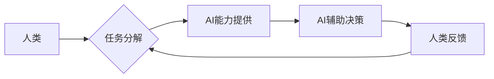

                 

## 人类-AI协作：增强人类智慧与AI能力的融合发展趋势预测与策略

> 关键词：人工智能、人类-AI协作、智慧增强、AI能力、融合发展、未来趋势、策略预测

## 1. 背景介绍

人工智能（AI）技术近年来发展迅速，从语音识别、图像识别到自然语言处理等领域取得了突破性进展。AI技术的应用已经渗透到各个方面，深刻地改变着人类的生活方式和工作模式。然而，AI技术也面临着一些挑战，例如数据依赖、算法偏见、解释性不足等。

人类-AI协作，即人类与人工智能系统共同完成任务，已成为解决这些挑战和充分发挥AI潜力的重要方向。这种协作模式强调人类和AI的互补性，将人类的创造力、批判性思维和情感智能与AI的计算能力、数据处理能力和自动化能力相结合，从而实现智慧的增强和能力的提升。

## 2. 核心概念与联系

**2.1 核心概念**

* **人类智慧:** 指人类通过学习、思考、判断、创造等活动获得的知识、技能和经验。
* **AI能力:** 指人工智能系统通过算法和数据训练获得的模拟人类智能的能力，例如学习、推理、决策、感知等。
* **协作:** 指人类和AI系统在共同目标下，相互配合、分工协作，共同完成任务的过程。

**2.2 联系架构**



**2.3 协作模式**

人类-AI协作模式多种多样，常见的有：

* **监督式协作:** 人类提供明确的指令和反馈，指导AI完成任务。
* **自主式协作:** AI系统自主学习和决策，人类提供必要的监督和评估。
* **混合式协作:** 结合监督式和自主式协作，根据任务需求灵活切换协作模式。

## 3. 核心算法原理 & 具体操作步骤

**3.1 算法原理概述**

人类-AI协作的核心算法原理是基于机器学习、深度学习和自然语言处理等技术的融合。

* **机器学习:** 算法通过学习数据样本，发现数据中的规律，并根据这些规律进行预测或决策。
* **深度学习:** 利用多层神经网络，模拟人类大脑的学习过程，能够处理更复杂的数据和任务。
* **自然语言处理:** 算法能够理解和处理人类语言，例如文本分析、语音识别、机器翻译等。

**3.2 算法步骤详解**

1. **数据收集和预处理:** 收集与任务相关的各种数据，并进行清洗、转换、格式化等预处理工作。
2. **模型选择和训练:** 根据任务需求选择合适的机器学习或深度学习模型，并利用训练数据进行模型训练。
3. **模型评估和优化:** 使用测试数据评估模型的性能，并根据评估结果对模型进行调整和优化。
4. **部署和应用:** 将训练好的模型部署到实际应用场景中，并与人类系统进行交互。

**3.3 算法优缺点**

* **优点:** 能够自动学习和适应数据变化，提高效率和准确性。
* **缺点:** 需要大量的数据进行训练，算法解释性不足，容易受到数据偏差的影响。

**3.4 算法应用领域**

* **医疗诊断:** 利用AI辅助医生进行疾病诊断，提高诊断准确率。
* **金融风险管理:** 利用AI识别金融风险，降低风险损失。
* **智能客服:** 利用AI构建智能客服系统，提供快速、高效的客户服务。
* **个性化教育:** 利用AI根据学生的学习情况提供个性化的学习方案。

## 4. 数学模型和公式 & 详细讲解 & 举例说明

**4.1 数学模型构建**

人类-AI协作过程可以抽象为一个数学模型，其中人类和AI系统分别作为输入和输出，任务目标作为优化目标。

**4.2 公式推导过程**

假设人类的决策权重为 $w_h$，AI系统的决策权重为 $w_a$，则最终决策结果可以表示为：

$$
Decision = w_h * HumanDecision + w_a * AIDecision
$$

其中，$HumanDecision$ 和 $AIDecision$ 分别表示人类和AI系统的决策结果。

**4.3 案例分析与讲解**

例如，在医疗诊断领域，医生和AI系统共同完成诊断任务。医生根据患者的症状和病史进行初步判断，AI系统则根据患者的影像数据和病历信息进行辅助诊断。

在该案例中，$HumanDecision$ 表示医生的诊断结果，$AIDecision$ 表示AI系统的诊断结果。$w_h$ 和 $w_a$ 的值可以根据医生的经验、AI系统的准确率等因素进行调整。

## 5. 项目实践：代码实例和详细解释说明

**5.1 开发环境搭建**

* 操作系统: Ubuntu 20.04
* Python 版本: 3.8
* 必要的库: TensorFlow, PyTorch, scikit-learn

**5.2 源代码详细实现**

```python
import tensorflow as tf

# 定义模型
model = tf.keras.models.Sequential([
  tf.keras.layers.Dense(64, activation='relu', input_shape=(10,)),
  tf.keras.layers.Dense(10, activation='softmax')
])

# 编译模型
model.compile(optimizer='adam',
              loss='sparse_categorical_crossentropy',
              metrics=['accuracy'])

# 训练模型
model.fit(x_train, y_train, epochs=10)

# 评估模型
loss, accuracy = model.evaluate(x_test, y_test)
print('Loss:', loss)
print('Accuracy:', accuracy)
```

**5.3 代码解读与分析**

* 该代码示例展示了如何使用TensorFlow框架构建一个简单的深度学习模型。
* 模型结构包含两层全连接层，第一层有64个神经元，激活函数为ReLU，输入层维度为10。第二层有10个神经元，激活函数为softmax，用于分类任务。
* 模型使用Adam优化器，损失函数为sparse_categorical_crossentropy，用于多分类任务。
* 模型训练了10个epochs，并使用测试数据评估模型性能。

**5.4 运行结果展示**

运行结果会显示模型的训练损失和准确率，以及测试集上的损失和准确率。

## 6. 实际应用场景

**6.1 医疗诊断辅助**

AI系统可以辅助医生进行疾病诊断，例如分析医学影像数据，识别肿瘤、骨折等异常情况。

**6.2 金融风险管理**

AI系统可以分析金融数据，识别欺诈交易、信用风险等潜在风险。

**6.3 智能客服系统**

AI系统可以构建智能客服系统，提供24小时在线服务，解答客户常见问题。

**6.4 个性化教育**

AI系统可以根据学生的学习情况，提供个性化的学习方案和辅导。

**6.5 未来应用展望**

随着AI技术的不断发展，人类-AI协作将在更多领域得到应用，例如：

* **科学研究:** AI可以辅助科学家进行数据分析、模型构建、实验设计等工作。
* **艺术创作:** AI可以辅助艺术家进行创作，例如生成音乐、绘画、诗歌等作品。
* **社会治理:** AI可以辅助政府部门进行决策分析、资源分配、公共服务等工作。

## 7. 工具和资源推荐

**7.1 学习资源推荐**

* **在线课程:** Coursera, edX, Udacity
* **书籍:** 《深度学习》、《人工智能：一种现代方法》
* **开源项目:** TensorFlow, PyTorch

**7.2 开发工具推荐**

* **IDE:** PyCharm, VS Code
* **机器学习库:** TensorFlow, PyTorch, scikit-learn
* **数据可视化工具:** Matplotlib, Seaborn

**7.3 相关论文推荐**

* 《Attention Is All You Need》
* 《BERT: Pre-training of Deep Bidirectional Transformers for Language Understanding》
* 《Generative Adversarial Networks》

## 8. 总结：未来发展趋势与挑战

**8.1 研究成果总结**

人类-AI协作领域取得了显著进展，例如：

* **协作算法:** 发展了多种协作算法，例如强化学习、迁移学习、联邦学习等。
* **解释性AI:** 研究了如何提高AI系统的解释性，使人类能够更好地理解AI的决策过程。
* **伦理问题:** 讨论了人类-AI协作的伦理问题，例如责任归属、数据隐私、算法偏见等。

**8.2 未来发展趋势**

* **更智能的AI系统:** AI系统将更加智能，能够更好地理解人类意图，提供更精准的帮助。
* **更广泛的应用场景:** 人类-AI协作将应用于更多领域，例如医疗、教育、金融、交通等。
* **更紧密的协作模式:** 人类和AI系统将更加紧密地协作，形成一个更加高效、智能的协作体系。

**8.3 面临的挑战**

* **算法安全:** 确保AI系统安全可靠，防止被恶意攻击或操纵。
* **数据隐私:** 保护人类数据隐私，防止数据泄露和滥用。
* **社会影响:** 评估人类-AI协作对社会的影响，并制定相应的政策和措施。

**8.4 研究展望**

未来研究将重点关注以下几个方面:

* **更有效的协作算法:** 开发更有效的协作算法，提高人类-AI协作的效率和准确性。
* **更可解释的AI系统:** 研究如何提高AI系统的解释性，使人类能够更好地理解AI的决策过程。
* **更安全的AI系统:** 开发更安全的AI系统，防止被恶意攻击或操纵。


## 9. 附录：常见问题与解答

**9.1 如何选择合适的协作模式？**

选择合适的协作模式取决于具体的应用场景和任务需求。例如，对于需要高准确率的任务，可以采用监督式协作；对于需要自主学习和决策的任务，可以采用自主式协作。

**9.2 如何评估人类-AI协作的性能？**

可以根据任务目标，设计相应的评估指标，例如准确率、效率、用户满意度等。

**9.3 如何解决AI系统解释性不足的问题？**

可以通过以下方法提高AI系统的解释性：

* 使用可解释的机器学习模型，例如决策树、规则模型等。
* 使用可视化技术，展示AI系统的决策过程。
* 开发AI解释器，解释AI系统的决策结果。


作者：禅与计算机程序设计艺术 / Zen and the Art of Computer Programming 
<end_of_turn>

