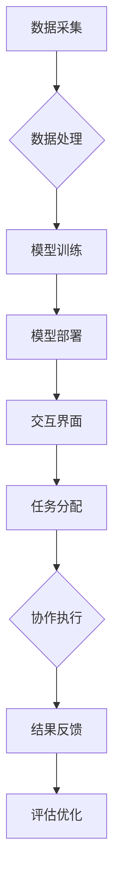

                 

## 人类-AI协作：增强人类智慧与AI能力的融合发展趋势预测分析机遇挑战机遇趋势分析预测

> 关键词：人工智能、人类-AI协作、智慧增强、AI能力、融合发展、趋势预测、机遇挑战

## 1. 背景介绍

人工智能（AI）技术近年来发展迅速，从语音识别、图像识别到自然语言处理等领域取得了突破性进展。AI技术的广泛应用正在深刻地改变着人类的生活方式和工作模式。然而，AI技术也面临着自身的局限性，例如缺乏创造力、缺乏对复杂情境理解的能力以及对伦理道德的缺乏认知。

人类与AI的协作，将AI技术与人类智慧相结合，成为未来发展的重要趋势。人类拥有丰富的经验、创造力和批判性思维能力，而AI则擅长处理海量数据、进行快速计算和识别模式。通过协作，人类和AI可以相互补充，发挥各自优势，共同解决复杂问题，创造更大的价值。

## 2. 核心概念与联系

### 2.1 人类-AI协作模型

人类-AI协作模型是指人类和AI系统共同完成任务的模式。常见的协作模型包括：

* **人类在回路中（Human-in-the-Loop）：** AI系统完成部分任务，需要人类进行干预和决策。
* **人类与AI并行工作（Human-AI Collaboration）：** 人类和AI系统分别负责不同的任务，并相互配合完成最终目标。
* **人类引导AI（Human-Led AI）：** 人类设定目标和策略，AI系统根据指令进行执行和优化。

### 2.2 协作架构

人类-AI协作的架构通常包括以下几个关键组件：

* **数据采集与处理：** 收集人类和AI系统所需的数据，并进行预处理和分析。
* **模型训练与部署：** 训练AI模型，并将其部署到协作平台中。
* **交互界面：** 提供人类与AI系统交互的界面，例如语音、文本、图形等。
* **任务分配与调度：** 根据任务需求，分配任务给人类和AI系统。
* **结果反馈与评估：** 收集协作结果，并进行反馈和评估，以不断优化协作流程。



## 3. 核心算法原理 & 具体操作步骤

### 3.1 算法原理概述

人类-AI协作的核心算法原理包括：

* **强化学习：** AI系统通过与环境交互，学习最佳的决策策略。
* **迁移学习：** 利用已训练好的模型，迁移到新的任务或领域。
* **知识图谱：** 建立人类知识的结构化表示，帮助AI理解和推理。
* **自然语言处理：** 理解和生成人类语言，实现人机自然交互。

### 3.2 算法步骤详解

以强化学习为例，其具体操作步骤如下：

1. **环境建模：** 建立模拟真实世界的环境模型，定义状态、动作和奖励。
2. **策略初始化：** 初始化AI系统的策略，例如随机策略或基于规则的策略。
3. **环境交互：** AI系统与环境交互，根据策略选择动作，并观察环境状态和奖励。
4. **策略更新：** 根据环境反馈，更新AI系统的策略，使其在未来获得更高的奖励。
5. **重复步骤3-4：** 持续与环境交互和策略更新，直到AI系统达到预设的目标。

### 3.3 算法优缺点

**优点：**

* 能够学习复杂的任务，并不断优化策略。
* 适应性强，能够应对变化的环境。

**缺点：**

* 训练时间长，需要大量的样本数据。
* 容易陷入局部最优解。

### 3.4 算法应用领域

强化学习广泛应用于以下领域：

* **游戏 AI：** 训练AI系统玩游戏，例如围棋、Go、Dota 2等。
* **机器人控制：** 训练机器人完成复杂的任务，例如导航、抓取、组装等。
* **推荐系统：** 训练AI系统推荐用户感兴趣的内容，例如电影、音乐、商品等。

## 4. 数学模型和公式 & 详细讲解 & 举例说明

### 4.1 数学模型构建

强化学习的数学模型通常基于马尔可夫决策过程（MDP）。MDP由以下几个要素组成：

* **状态空间 S：** 环境可能存在的各种状态。
* **动作空间 A：** AI系统可以执行的动作。
* **状态转移概率 P(s' | s, a)：** 从状态 s 执行动作 a 后，转移到状态 s' 的概率。
* **奖励函数 R(s, a)：** 在状态 s 执行动作 a 后获得的奖励。
* **折扣因子 γ：** 权衡未来奖励和当前奖励的比例。

### 4.2 公式推导过程

强化学习的目标是找到一个最优策略 π，使得在该策略下，AI系统获得最大的累积奖励。最优策略可以通过动态规划或蒙特卡罗方法来求解。

**Bellman 方程：**

$$
V^{\pi}(s) = \max_a \left[ R(s, a) + \gamma \sum_{s'} P(s' | s, a) V^{\pi}(s') \right]
$$

其中，V^π(s) 表示在策略 π 下，从状态 s 开始的累积奖励。

### 4.3 案例分析与讲解

例如，训练一个AI系统玩游戏，我们可以将游戏状态定义为游戏棋盘的布局，动作定义为玩家可以执行的操作，奖励函数定义为获得分数或完成任务的奖励。通过强化学习算法，AI系统可以学习到最优策略，从而获得更高的分数或完成任务。

## 5. 项目实践：代码实例和详细解释说明

### 5.1 开发环境搭建

* Python 3.x
* TensorFlow 或 PyTorch 等深度学习框架
* Jupyter Notebook 或 VS Code 等代码编辑器

### 5.2 源代码详细实现

```python
import tensorflow as tf

# 定义模型
model = tf.keras.Sequential([
    tf.keras.layers.Dense(128, activation='relu'),
    tf.keras.layers.Dense(64, activation='relu'),
    tf.keras.layers.Dense(1, activation='linear')
])

# 定义损失函数和优化器
loss_fn = tf.keras.losses.MeanSquaredError()
optimizer = tf.keras.optimizers.Adam()

# 训练模型
for epoch in range(100):
    # 训练数据
    x_train = ...
    y_train = ...

    # 计算损失
    with tf.GradientTape() as tape:
        predictions = model(x_train)
        loss = loss_fn(y_train, predictions)

    # 反向传播
    gradients = tape.gradient(loss, model.trainable_variables)
    optimizer.apply_gradients(zip(gradients, model.trainable_variables))

    # 打印损失
    print(f'Epoch {epoch+1}, Loss: {loss.numpy()}')
```

### 5.3 代码解读与分析

* 代码首先定义了一个简单的深度学习模型，包含三个全连接层。
* 然后定义了损失函数和优化器，用于训练模型。
* 训练循环迭代100次，每次迭代使用训练数据训练模型，并计算损失。
* 反向传播算法用于更新模型参数，使其能够更好地拟合训练数据。

### 5.4 运行结果展示

训练完成后，可以将模型应用于新的数据进行预测。

## 6. 实际应用场景

### 6.1 医疗保健

* **辅助诊断：** AI系统可以分析医学影像，辅助医生诊断疾病。
* **个性化治疗：** AI系统可以根据患者的基因信息和病史，推荐个性化的治疗方案。
* **药物研发：** AI系统可以加速药物研发过程，例如预测药物的有效性和安全性。

### 6.2 教育

* **个性化学习：** AI系统可以根据学生的学习进度和能力，提供个性化的学习内容和辅导。
* **智能评估：** AI系统可以自动批改作业，并提供个性化的反馈。
* **虚拟导师：** AI系统可以扮演虚拟导师的角色，为学生提供学习指导和支持。

### 6.3 金融

* **欺诈检测：** AI系统可以分析交易数据，识别潜在的欺诈行为。
* **风险管理：** AI系统可以评估投资风险，帮助金融机构做出更明智的决策。
* **个性化理财：** AI系统可以根据用户的财务状况和风险偏好，提供个性化的理财建议。

### 6.4 未来应用展望

随着AI技术的不断发展，人类-AI协作将在更多领域得到应用，例如：

* **自动驾驶：** AI系统可以辅助驾驶员驾驶车辆，提高安全性。
* **智能制造：** AI系统可以优化生产流程，提高效率。
* **城市管理：** AI系统可以帮助城市管理者优化交通、能源和资源分配。


## 7. 工具和资源推荐

### 7.1 学习资源推荐

* **在线课程：** Coursera、edX、Udacity 等平台提供丰富的AI课程。
* **书籍：** 《深度学习》、《人工智能：一种现代方法》等书籍。
* **开源项目：** TensorFlow、PyTorch、OpenAI 等开源项目提供丰富的代码和资源。

### 7.2 开发工具推荐

* **Python：** 广泛用于AI开发的编程语言。
* **Jupyter Notebook：** 用于代码编写、数据分析和可视化的工具。
* **VS Code：** 功能强大的代码编辑器，支持多种编程语言和插件。

### 7.3 相关论文推荐

* **《深度学习》**
* **《人工智能：一种现代方法》**
* **《强化学习：原理、算法和应用》**

## 8. 总结：未来发展趋势与挑战

### 8.1 研究成果总结

人类-AI协作已取得显著成果，在医疗保健、教育、金融等领域展现出巨大的潜力。

### 8.2 未来发展趋势

* **更强的AI能力：** AI技术的不断发展，将赋予AI更强的学习、推理和决策能力。
* **更紧密的协作：** 人类和AI将更加紧密地协作，共同解决复杂问题。
* **更广泛的应用：** 人类-AI协作将应用于更多领域，改变人们的生活方式和工作模式。

### 8.3 面临的挑战

* **伦理道德问题：** AI系统的决策可能会受到偏见的影响，需要解决伦理道德问题。
* **数据安全问题：** 人类-AI协作需要处理大量数据，需要加强数据安全保护。
* **技术可解释性问题：** AI系统的决策过程往往难以理解，需要提高技术可解释性。

### 8.4 研究展望

未来研究将重点关注以下几个方面：

* **开发更安全、更可靠的AI系统。**
* **提高AI系统的可解释性和透明度。**
* **探索人类-AI协作的新模式和应用场景。**


## 9. 附录：常见问题与解答

**Q1：人类-AI协作会取代人类的工作吗？**

A1：人类-AI协作更像是人类和AI共同进步的过程，AI可以帮助人类完成重复性、繁琐的工作，释放人类的创造力和智力，从而使人类能够专注于更复杂、更具创造性的工作。

**Q2：如何确保AI系统的公平性和公正性？**

A2：开发公平、公正的AI系统需要从多个方面入手，例如：

* 使用多元化的训练数据，避免数据偏见。
* 设计透明、可解释的算法，方便人类进行审计和监督。
* 建立相应的法律法规，规范AI系统的开发和应用。

**Q3：人类-AI协作需要哪些技能？**

A3：人类-AI协作需要以下技能：

* **数据分析能力：** 能够理解和分析数据，从中发现规律和趋势。
* **问题解决能力：** 能够将复杂问题分解成子问题，并找到解决方案。
* **沟通能力：** 能够与AI系统有效地沟通，并解释AI系统的决策结果。
* **学习能力：** 能够不断学习新的知识和技能，适应AI技术的不断发展。


作者：禅与计算机程序设计艺术 / Zen and the Art of Computer Programming 
<end_of_turn>

