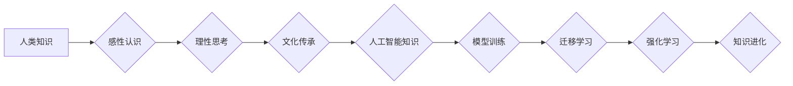

                 

## 人类知识的进化论：从猿猴到人工智能

> 关键词：人工智能、知识进化、机器学习、深度学习、神经网络、认知科学、进化论、算法、模型

### 1. 背景介绍

人类文明的进步离不开知识的不断积累和进化。从猿猴时代开始，人类通过观察、模仿、学习，逐渐掌握了工具的使用、语言的表达、社会生活的规则，并最终建立了复杂的社会结构和文化体系。而如今，人工智能的兴起，为人类知识的进化开辟了新的篇章。

人工智能，作为模拟人类智能的计算机系统，正在以惊人的速度发展。从简单的规则系统到复杂的深度学习模型，人工智能已经展现出强大的学习、推理、决策能力，并在各个领域取得了突破性的进展。

然而，人工智能的发展也引发了许多深刻的思考。人工智能的知识来源、学习机制、认知能力与人类的知识进化有何异同？人工智能是否能够真正理解世界，并像人类一样创造新的知识？

本文将从进化论的角度出发，探讨人类知识的进化历程，并分析人工智能在知识进化中的地位和作用，试图解答这些关键问题。

### 2. 核心概念与联系

#### 2.1 人类知识的进化

人类知识的进化是一个漫长的过程，经历了从感性认识到理性思考的转变。

* **感性认识阶段:** 早期人类通过感官体验和直觉判断，积累了对周围世界的基本认知。
* **理性思考阶段:** 随着语言的出现和抽象思维的发展，人类开始用逻辑推理和科学方法探索世界，并建立起系统的知识体系。
* **文化传承阶段:** 人类通过语言、文字、艺术等文化形式，将知识传承给后代，并不断丰富和完善知识体系。

#### 2.2 人工智能的知识来源

人工智能的知识来源主要有以下几种：

* **人工标注数据:** 人工智能模型需要大量的标注数据进行训练，这些数据由人类专家进行标注，为模型提供知识和规则。
* **文本数据:** 人工智能模型可以从海量的文本数据中学习语言、知识和概念。
* **图像数据:** 人工智能模型可以从图像数据中学习物体识别、场景理解等视觉知识。

#### 2.3 人工智能知识的进化

人工智能的知识进化主要通过以下方式实现：

* **模型训练:** 通过训练数据，人工智能模型不断调整参数，提高对知识的理解和应用能力。
* **迁移学习:** 利用已有的知识模型，迁移到新的任务或领域，加速知识的积累和应用。
* **强化学习:** 通过与环境交互，人工智能模型学习策略和决策规则，不断优化知识应用。

#### 2.4 知识进化模型



### 3. 核心算法原理 & 具体操作步骤

#### 3.1 算法原理概述

深度学习是人工智能领域的核心算法之一，它通过多层神经网络模拟人类大脑的学习机制，能够学习复杂的数据模式和知识表示。

深度学习算法的核心原理是**反向传播算法**，它通过不断调整神经网络参数，使模型的输出与真实值之间的误差最小化。

#### 3.2 算法步骤详解

1. **数据预处理:** 将原始数据转换为深度学习模型可以理解的格式，例如数值化、归一化等。
2. **网络结构设计:** 根据任务需求设计神经网络的层数、节点数、激活函数等结构参数。
3. **参数初始化:** 为神经网络参数赋予初始值，通常采用随机初始化。
4. **前向传播:** 将输入数据通过神经网络层层传递，最终得到输出结果。
5. **损失函数计算:** 计算模型输出与真实值的误差，使用损失函数衡量误差大小。
6. **反向传播:** 将误差信号反向传播到各层神经元，更新神经网络参数。
7. **迭代训练:** 重复前向传播、损失函数计算和反向传播步骤，直到模型达到预设的精度。

#### 3.3 算法优缺点

**优点:**

* 能够学习复杂的数据模式和知识表示。
* 具有强大的泛化能力，能够应用于各种不同的任务。
* 随着数据量的增加，模型性能不断提升。

**缺点:**

* 需要大量的训练数据和计算资源。
* 模型训练过程复杂，需要专业的知识和经验。
* 模型的内部机制难以解释，缺乏可解释性。

#### 3.4 算法应用领域

深度学习算法广泛应用于各个领域，例如：

* **图像识别:** 人脸识别、物体检测、图像分类等。
* **自然语言处理:** 机器翻译、文本摘要、情感分析等。
* **语音识别:** 语音转文本、语音合成等。
* **推荐系统:** 商品推荐、内容推荐等。
* **医疗诊断:** 疾病诊断、影像分析等。

### 4. 数学模型和公式 & 详细讲解 & 举例说明

#### 4.1 数学模型构建

深度学习模型的核心是神经网络，它由多个层级的神经元组成。每个神经元接收来自上一层的输入信号，并通过激活函数进行处理，输出到下一层。

神经网络的数学模型可以表示为：

$$
y = f(W x + b)
$$

其中：

* $y$ 是神经元的输出值。
* $x$ 是神经元的输入值。
* $W$ 是权重矩阵，连接上一层神经元与当前神经元。
* $b$ 是偏置项，用于调整神经元的激活阈值。
* $f$ 是激活函数，例如 sigmoid 函数、ReLU 函数等。

#### 4.2 公式推导过程

反向传播算法的核心是通过梯度下降法更新神经网络参数。

梯度下降法的公式为：

$$
\Delta W = -\eta \frac{\partial L}{\partial W}
$$

$$
\Delta b = -\eta \frac{\partial L}{\partial b}
$$

其中：

* $\Delta W$ 和 $\Delta b$ 是权重和偏置项的更新量。
* $\eta$ 是学习率，控制参数更新的步长。
* $\frac{\partial L}{\partial W}$ 和 $\frac{\partial L}{\partial b}$ 是损失函数对权重和偏置项的梯度。

#### 4.3 案例分析与讲解

假设我们有一个简单的线性回归模型，目标是预测房价。

模型输入特征包括房屋面积和房间数量，输出为房价。

损失函数为均方误差，即预测值与真实值的平方差的平均值。

通过反向传播算法，我们可以计算出损失函数对权重和偏置项的梯度，并根据梯度更新权重和偏置项，最终得到一个能够准确预测房价的模型。

### 5. 项目实践：代码实例和详细解释说明

#### 5.1 开发环境搭建

* Python 3.x
* TensorFlow 或 PyTorch 深度学习框架
* Jupyter Notebook 或 VS Code 代码编辑器

#### 5.2 源代码详细实现

```python
import tensorflow as tf

# 定义模型结构
model = tf.keras.models.Sequential([
  tf.keras.layers.Dense(64, activation='relu', input_shape=(2,)),
  tf.keras.layers.Dense(1)
])

# 编译模型
model.compile(optimizer='adam', loss='mse')

# 训练模型
model.fit(x_train, y_train, epochs=10)

# 评估模型
loss = model.evaluate(x_test, y_test)
```

#### 5.3 代码解读与分析

* 首先，我们使用 TensorFlow 库定义了一个简单的线性回归模型。
* 模型包含两层全连接神经元，第一层有 64 个神经元，使用 ReLU 激活函数，输入特征维度为 2。
* 第二层只有一个神经元，输出房价预测值。
* 然后，我们使用 Adam 优化器和均方误差损失函数编译模型。
* 接着，我们使用训练数据训练模型 10 个 epochs。
* 最后，我们使用测试数据评估模型的性能，并打印损失值。

#### 5.4 运行结果展示

训练完成后，我们可以使用测试数据预测房价，并与真实值进行比较。

### 6. 实际应用场景

#### 6.1 医疗诊断

深度学习算法可以用于分析医学影像，例如 X 光片、CT 扫描、MRI 图像，辅助医生诊断疾病。

#### 6.2 金融风险评估

深度学习算法可以分析金融数据，例如交易记录、客户信息、市场趋势等，识别潜在的金融风险。

#### 6.3 自动驾驶

深度学习算法可以用于训练自动驾驶汽车，识别道路场景、预测车辆运动轨迹，实现自动驾驶功能。

#### 6.4 未来应用展望

随着人工智能技术的不断发展，深度学习算法将在更多领域得到应用，例如：

* 个性化教育
* 智能客服
* 药物研发
* 科学发现

### 7. 工具和资源推荐

#### 7.1 学习资源推荐

* **书籍:**
    * 深度学习 (Deep Learning) - Ian Goodfellow, Yoshua Bengio, Aaron Courville
    * 人工神经网络 (Artificial Neural Networks) - Simon Haykin
* **在线课程:**
    * Coursera: 深度学习 Specialization
    * edX: 机器学习
    * fast.ai: 深度学习课程

#### 7.2 开发工具推荐

* **TensorFlow:** 开源深度学习框架，支持多种硬件平台。
* **PyTorch:** 开源深度学习框架，以其灵活性和易用性而闻名。
* **Keras:** 高级深度学习 API，可以运行在 TensorFlow、Theano 或 CNTK 后端。

#### 7.3 相关论文推荐

* **ImageNet Classification with Deep Convolutional Neural Networks** - Alex Krizhevsky, Ilya Sutskever, Geoffrey E. Hinton
* **Attention Is All You Need** - Ashish Vaswani, Noam Shazeer, Niki Parmar, Jakob Uszkoreit, Llion Jones, Aidan N. Gomez, Łukasz Kaiser, Illia Polosukhin
* **Generative Adversarial Networks** - Ian Goodfellow, Jean Pouget-Abadie, Mehdi Mirza, Bing Xu, David Warde-Farley, Sherjil Ozair, Aaron Courville, Yoshua Bengio

### 8. 总结：未来发展趋势与挑战

#### 8.1 研究成果总结

人工智能领域取得了令人瞩目的进展，深度学习算法在图像识别、自然语言处理等领域取得了突破性成果。

#### 8.2 未来发展趋势

* **模型规模和能力的提升:** 未来深度学习模型将更加庞大，拥有更强的学习能力和泛化能力。
* **算法效率的提高:** 研究人员将致力于开发更高效的深度学习算法，降低训练成本和时间。
* **解释性和可信度的增强:** 如何解释深度学习模型的决策过程，提高模型的可信度，是未来研究的重要方向。
* **跨模态学习:** 深度学习模型将能够处理多种模态数据，例如文本、图像、音频等，实现更全面的知识理解。

#### 8.3 面临的挑战

* **数据获取和隐私问题:** 深度学习算法依赖于大量数据，如何获取高质量数据，并保护数据隐私，是重要的挑战。
* **算法偏见和公平性:** 深度学习模型可能存在算法偏见，导致不公平的结果，需要研究如何解决算法偏见问题。
* **安全性和可控性:** 深度学习模型的安全性和可控性需要得到加强，防止模型被恶意利用。

#### 8.4 研究展望

人工智能的发展将深刻地改变人类社会，我们需要积极探索人工智能的应用，并应对其带来的挑战。

### 9. 附录：常见问题与解答

#### 9.1 什么是深度学习？

深度学习是一种机器学习的子领域，它使用多层神经网络模拟人类大脑的学习机制，能够学习复杂的数据模式和知识表示。

#### 9.2 深度学习算法有哪些？

常见的深度学习算法包括卷积神经网络 (CNN)、循环神经网络 (RNN)、生成对抗网络 (GAN) 等。

#### 9.3 如何训练深度学习模型？

训练深度学习模型需要大量的训练数据和计算资源，通常使用反向传播算法和梯度下降法来更新模型参数。

#### 9.4 深度学习的应用领域有哪些？

深度学习算法广泛应用于各个领域，例如图像识别、自然语言处理、语音识别、推荐系统等。


作者：禅与计算机程序设计艺术 / Zen and the Art of Computer Programming 
<end_of_turn>

