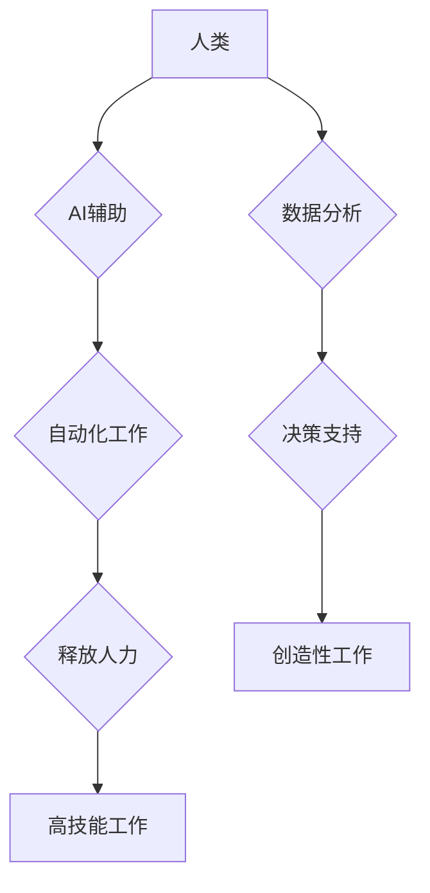

                 

## 人类计算：AI时代的未来就业趋势分析

> 关键词：人工智能、人类计算、未来就业、自动化、技能转移、职业发展、数字经济、伦理问题

## 1. 背景介绍

人工智能（AI）技术近年来发展迅速，其应用领域不断拓展，对人类社会产生了深远影响。从自动驾驶汽车到智能语音助手，从医疗诊断到金融交易，AI正在改变着我们生活的方方面面。然而，AI的发展也引发了人们对未来就业趋势的担忧。一些人担心AI将取代人类工作，导致大量失业。

事实上，AI的发展既带来了机遇也带来了挑战。它将自动化许多重复性、低技能的工作，但也将创造出许多新的工作岗位，需要人类具备更高层次的技能和能力。因此，我们需要认真分析AI对未来就业的影响，并积极应对挑战，把握机遇。

## 2. 核心概念与联系

**2.1 人类计算**

人类计算是指人类利用自身的认知能力、创造力、判断力和解决问题的能力，参与到计算和数据处理过程中。它强调人类在AI时代仍然不可替代的作用，尤其是在需要复杂决策、创造性思维和情感理解等领域。

**2.2 AI与人类计算的协同**

AI和人类计算并非相互对立，而是可以相互协同，共同完成更复杂的任务。AI可以帮助人类自动化重复性工作，解放人类的生产力，使人类能够专注于更具创造性和战略性的工作。

**2.3 未来就业趋势**

AI时代，未来就业趋势将呈现以下特点：

* **自动化取代低技能工作:** AI将自动化许多重复性、低技能的工作，例如数据录入、客服服务等。
* **新兴职业的出现:** AI的发展将催生许多新的职业，例如AI工程师、数据科学家、AI伦理学家等。
* **技能转移和升级:** 人类需要不断学习新的技能，适应AI时代的需求。

**2.4  Mermaid 流程图**



## 3. 核心算法原理 & 具体操作步骤

**3.1 算法原理概述**

人类计算的核心算法原理是基于人类认知能力的模拟。例如，自然语言处理算法可以模拟人类理解和生成语言的能力，计算机视觉算法可以模拟人类视觉感知和识别物体的能力。

**3.2 算法步骤详解**

人类计算算法的具体步骤通常包括以下几个方面：

1. **数据采集和预处理:** 收集与任务相关的原始数据，并进行清洗、转换和格式化等预处理工作。
2. **特征提取:** 从原始数据中提取与任务相关的特征，例如文本中的关键词、图像中的物体形状等。
3. **模型训练:** 使用机器学习算法训练模型，使模型能够从特征中学习到规律，并进行预测或分类。
4. **模型评估:** 使用测试数据评估模型的性能，并进行调整和优化。
5. **应用部署:** 将训练好的模型部署到实际应用场景中，例如智能客服系统、自动驾驶系统等。

**3.3 算法优缺点**

**优点:**

* 可以模拟人类的认知能力，解决复杂问题。
* 可以处理海量数据，发现隐藏的模式。
* 可以不断学习和改进，提高性能。

**缺点:**

* 需要大量的数据进行训练，数据质量对算法性能影响很大。
* 算法的解释性和透明度较低，难以理解模型的决策过程。
* 算法可能存在偏差，导致不公平的结果。

**3.4 算法应用领域**

人类计算算法广泛应用于以下领域:

* 自然语言处理: 语音识别、机器翻译、文本摘要等。
* 计算机视觉: 图像识别、物体检测、人脸识别等。
* 医疗诊断: 病情预测、疾病诊断、药物研发等。
* 金融分析: 风险评估、欺诈检测、投资决策等。

## 4. 数学模型和公式 & 详细讲解 & 举例说明

**4.1 数学模型构建**

人类计算的数学模型通常基于概率论、统计学和机器学习算法。例如，自然语言处理中的词嵌入模型可以将单词映射到一个高维向量空间，其中相似的单词具有相似的向量表示。

**4.2 公式推导过程**

例如，在机器学习算法中，损失函数用于衡量模型预测结果与真实结果之间的误差。常见的损失函数包括均方误差 (MSE) 和交叉熵损失 (Cross-Entropy Loss)。

**4.3 案例分析与讲解**

例如，在图像识别任务中，可以使用卷积神经网络 (CNN) 作为模型。CNN 可以学习图像的特征，并进行分类。

**4.3.1  卷积神经网络 (CNN)**

CNN 是一种专门用于处理图像数据的深度学习算法。它由多个卷积层、池化层和全连接层组成。

* **卷积层:** 使用卷积核对图像进行卷积运算，提取图像的特征。
* **池化层:** 对卷积层的输出进行下采样，减少计算量并提高模型的鲁棒性。
* **全连接层:** 将池化层的输出连接到全连接层，进行分类或回归。

**4.3.2  损失函数**

在图像识别任务中，常用的损失函数是交叉熵损失。

$$
Loss = - \sum_{i=1}^{N} y_i \log(\hat{y}_i)
$$

其中：

* $N$ 是图像类别数。
* $y_i$ 是真实标签，值为 1 或 0。
* $\hat{y}_i$ 是模型预测的概率值。

## 5. 项目实践：代码实例和详细解释说明

**5.1 开发环境搭建**

* Python 3.x
* TensorFlow 或 PyTorch

**5.2 源代码详细实现**

```python
import tensorflow as tf

# 定义模型结构
model = tf.keras.models.Sequential([
    tf.keras.layers.Conv2D(32, (3, 3), activation='relu', input_shape=(28, 28, 1)),
    tf.keras.layers.MaxPooling2D((2, 2)),
    tf.keras.layers.Conv2D(64, (3, 3), activation='relu'),
    tf.keras.layers.MaxPooling2D((2, 2)),
    tf.keras.layers.Flatten(),
    tf.keras.layers.Dense(10, activation='softmax')
])

# 编译模型
model.compile(optimizer='adam',
              loss='sparse_categorical_crossentropy',
              metrics=['accuracy'])

# 加载 MNIST 数据集
(x_train, y_train), (x_test, y_test) = tf.keras.datasets.mnist.load_data()

# 数据预处理
x_train = x_train.astype('float32') / 255.0
x_test = x_test.astype('float32') / 255.0
x_train = x_train.reshape((x_train.shape[0], 28, 28, 1))
x_test = x_test.reshape((x_test.shape[0], 28, 28, 1))

# 训练模型
model.fit(x_train, y_train, epochs=5)

# 评估模型
loss, accuracy = model.evaluate(x_test, y_test)
print('Test loss:', loss)
print('Test accuracy:', accuracy)
```

**5.3 代码解读与分析**

这段代码实现了使用 TensorFlow 库训练一个简单的卷积神经网络模型，用于识别 MNIST 手写数字数据集中的数字。

* 模型结构定义了卷积层、池化层和全连接层，这些层共同提取图像特征并进行分类。
* 模型编译指定了优化器、损失函数和评估指标。
* 数据预处理将图像数据转换为适合模型输入的格式。
* 模型训练使用训练数据进行训练，并记录训练过程中的损失值和准确率。
* 模型评估使用测试数据评估模型的性能。

**5.4 运行结果展示**

运行这段代码后，会输出模型在测试集上的损失值和准确率。

## 6. 实际应用场景

**6.1 智能客服系统**

AI驱动的智能客服系统可以自动处理客户的常见问题，例如订单查询、退货流程等，提高客服效率，降低人工成本。

**6.2 自动驾驶汽车**

自动驾驶汽车利用 AI 技术感知周围环境，做出驾驶决策，实现无人驾驶。

**6.3 医疗诊断**

AI 可以辅助医生进行疾病诊断，例如分析医学影像，识别病灶，提高诊断准确率。

**6.4 未来应用展望**

AI技术将继续发展，在更多领域得到应用，例如个性化教育、精准医疗、智能制造等。

## 7. 工具和资源推荐

**7.1 学习资源推荐**

* **在线课程:** Coursera, edX, Udacity
* **书籍:** 深度学习，机器学习实战

**7.2 开发工具推荐**

* **Python:** TensorFlow, PyTorch, scikit-learn
* **云平台:** AWS, Azure, Google Cloud

**7.3 相关论文推荐**

* **AlphaGo论文:** https://arxiv.org/abs/1607.02886
* **BERT论文:** https://arxiv.org/abs/1810.04805

## 8. 总结：未来发展趋势与挑战

**8.1 研究成果总结**

AI技术取得了显著进展，在图像识别、自然语言处理等领域取得了突破性成果。

**8.2 未来发展趋势**

* **模型规模和能力的提升:** AI模型将变得更大、更强大，能够处理更复杂的任务。
* **边缘计算的普及:** AI计算将从云端转移到边缘设备，实现更低延迟、更高效率的计算。
* **AI伦理和安全问题的关注:** 人们将更加关注 AI 的伦理问题和安全问题，制定相应的规范和政策。

**8.3 面临的挑战**

* **数据获取和隐私保护:** AI模型需要大量数据进行训练，如何获取高质量数据并保护用户隐私是一个挑战。
* **算法解释性和透明度:** AI模型的决策过程往往难以理解，如何提高算法的解释性和透明度是一个重要问题。
* **AI对就业的影响:** AI将自动化许多工作，如何应对就业市场变化是一个需要认真思考的问题。

**8.4 研究展望**

未来，AI研究将更加注重模型的解释性、透明度和安全性，并探索 AI 与人类更加紧密协作的模式。


## 9. 附录：常见问题与解答

**9.1  AI 会取代人类吗？**

AI 可能会自动化许多工作，但它并不会完全取代人类。人类仍然需要发挥创造力、解决问题的能力和情感理解能力。

**9.2  如何应对 AI 带来的就业挑战？**

需要不断学习新的技能，适应 AI 时代的需求。例如，学习数据分析、编程、AI 相关知识等。

**9.3  AI 的伦理问题有哪些？**

AI 的伦理问题包括数据隐私、算法偏见、责任归属等。需要制定相应的规范和政策，确保 AI 的安全和可持续发展。


作者：禅与计算机程序设计艺术 / Zen and the Art of Computer Programming 
<end_of_turn>

