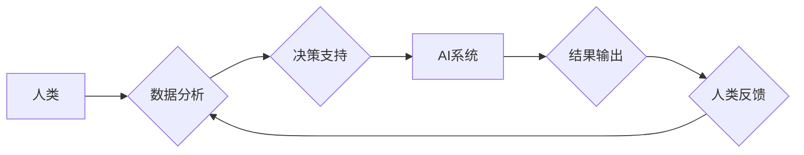

                 

## 人类计算：AI时代的未来技能

> 关键词：人工智能、人类计算、未来技能、认知增强、数据分析、机器学习、算法设计、编程思维

### 1. 背景介绍

人工智能（AI）正在以惊人的速度发展，它正在改变着我们生活的方方面面。从自动驾驶汽车到智能语音助手，AI技术已经渗透到我们的日常生活中。然而，随着AI技术的进步，也引发了人们对未来工作和技能需求的担忧。

传统上，人们认为AI将取代人类的工作。但实际上，AI更像是人类的工具，它可以帮助我们更高效地完成工作，释放出更多的时间和精力去思考和创造。因此，在AI时代，人类需要学习新的技能，才能与AI协同工作，并发挥自身的优势。

### 2. 核心概念与联系

**2.1 人类计算**

人类计算是指利用人类的认知能力和创造力来解决问题，并进行数据分析和决策的过程。人类拥有独特的优势，例如：

* **创造力和想象力:** 人类能够进行抽象思维，并提出新的想法和解决方案。
* **批判性思维和判断力:** 人类能够分析信息，并做出基于逻辑和经验的判断。
* **情感智能和社交能力:** 人类能够理解和处理情感，并与他人建立良好的沟通和合作关系。

**2.2 AI与人类计算的协同**

AI技术可以帮助人类进行更快速、更准确的数据分析，并提供更丰富的决策支持。而人类则可以利用自己的创造力和判断力，对AI的输出进行解读和优化，最终做出更明智的决策。

**2.3 未来技能**

在AI时代，以下技能将变得越来越重要：

* **数据分析和可视化:** 能够从海量数据中提取有价值的信息，并将其以直观的方式呈现出来。
* **算法设计和编程:** 能够理解和设计算法，并使用编程语言将其实现。
* **机器学习和深度学习:** 能够理解和应用机器学习和深度学习算法，并进行模型训练和评估。
* **跨学科思维和创新:** 能够将不同领域的知识和技能结合起来，解决复杂问题，并提出新的解决方案。
* **沟通和协作:** 能够与他人有效地沟通和协作，共同完成任务。

**Mermaid 流程图**



### 3. 核心算法原理 & 具体操作步骤

**3.1 算法原理概述**

人类计算的核心算法原理是基于人类的认知能力和行为模式，模拟人类的思维过程，并将其转化为可执行的算法。这些算法通常涉及以下几个方面：

* **知识表示:** 将人类的知识和经验以计算机可理解的形式表示出来。
* **推理和决策:** 基于已有的知识和规则，进行逻辑推理和决策。
* **学习和适应:** 从数据中学习，并根据新的信息不断调整和优化自己的模型。

**3.2 算法步骤详解**

1. **数据收集和预处理:** 收集相关数据，并进行清洗、转换和格式化等预处理操作。
2. **知识表示:** 将数据转化为知识图谱、规则库或其他形式的知识表示。
3. **推理和决策:** 使用逻辑推理、决策树或其他算法，根据知识表示和输入信息进行推理和决策。
4. **结果输出:** 将推理结果以文本、图形或其他形式输出。
5. **反馈和学习:** 收集用户反馈，并根据反馈信息调整和优化算法模型。

**3.3 算法优缺点**

**优点:**

* 能够模拟人类的思维过程，解决复杂问题。
* 能够处理非结构化数据，例如文本和图像。
* 能够不断学习和适应，提高决策准确性。

**缺点:**

* 算法设计复杂，需要大量的专业知识和经验。
* 训练数据量大，需要大量的计算资源。
* 算法解释性较差，难以理解其决策过程。

**3.4 算法应用领域**

* **医疗诊断:** 基于患者的症状和病史，辅助医生进行诊断。
* **金融风险评估:** 分析客户的信用风险，并进行风险控制。
* **法律决策支持:** 分析法律法规和案例，辅助律师进行法律决策。
* **教育个性化学习:** 根据学生的学习情况，提供个性化的学习方案。

### 4. 数学模型和公式 & 详细讲解 & 举例说明

**4.1 数学模型构建**

人类计算的数学模型通常基于概率论、统计学和机器学习等领域。例如，在自然语言处理领域，可以使用词嵌入模型来表示单词的语义关系，并构建语言模型来预测文本序列。

**4.2 公式推导过程**

例如，在词嵌入模型中，可以使用Word2Vec算法来训练词向量。Word2Vec算法基于神经网络，通过预测上下文词来学习单词的语义表示。其核心公式为：

$$
P(w_i|w_j) = \frac{exp(v_i^T v_j)}{\sum_{k} exp(v_k^T v_j)}
$$

其中，$w_i$和$w_j$分别为两个单词，$v_i$和$v_j$分别为它们的词向量，$P(w_i|w_j)$表示在给定单词$w_j$的情况下，预测单词$w_i$的概率。

**4.3 案例分析与讲解**

例如，在训练Word2Vec模型时，可以将句子“The cat sat on the mat”作为训练数据。模型会学习到“cat”和“sat”之间的语义关系，以及“mat”和“on”之间的语义关系。因此，当输入单词“cat”时，模型可以预测出“sat”和“mat”作为上下文词。

### 5. 项目实践：代码实例和详细解释说明

**5.1 开发环境搭建**

可以使用Python语言和相关的机器学习库，例如TensorFlow或PyTorch，来实现人类计算项目。

**5.2 源代码详细实现**

```python
# 使用Word2Vec算法训练词向量模型
from gensim.models import Word2Vec

# 准备训练数据
sentences = [
    ["The", "cat", "sat", "on", "the", "mat"],
    ["The", "dog", "chased", "the", "ball"],
]

# 训练词向量模型
model = Word2Vec(sentences, vector_size=100, window=5, min_count=5)

# 保存模型
model.save("word2vec_model.bin")

# 使用模型预测上下文词
word = "cat"
similar_words = model.wv.most_similar(word, topn=5)
print(f"与'{word}'相似的词语：{similar_words}")
```

**5.3 代码解读与分析**

这段代码使用Gensim库中的Word2Vec算法训练了一个简单的词向量模型。

* `sentences`变量存储了训练数据，每个句子是一个单词列表。
* `vector_size`参数指定了词向量的维度，这里设置为100。
* `window`参数指定了上下文窗口大小，这里设置为5，表示每个单词的上下文窗口包含前后5个单词。
* `min_count`参数指定了单词出现次数的阈值，这里设置为5，表示只训练出现次数大于5的单词。

**5.4 运行结果展示**

运行这段代码后，会输出与“cat”相似的词语，例如“sat”， “mat”， “dog”， “ball”。

### 6. 实际应用场景

**6.1 医疗诊断辅助系统**

利用人类计算技术，可以构建医疗诊断辅助系统，帮助医生更快、更准确地诊断疾病。例如，可以训练一个模型，根据患者的症状、病史和检查结果，预测可能的疾病诊断。

**6.2 金融风险评估系统**

金融机构可以使用人类计算技术构建风险评估系统，分析客户的信用风险，并进行风险控制。例如，可以训练一个模型，根据客户的财务状况、信用记录和行为模式，预测其违约风险。

**6.3 法律决策支持系统**

法律专业人士可以使用人类计算技术构建决策支持系统，辅助律师进行法律决策。例如，可以训练一个模型，根据法律法规和案例，分析案件的法律风险和可能的判决结果。

**6.4 教育个性化学习系统**

教育机构可以使用人类计算技术构建个性化学习系统，根据学生的学习情况，提供个性化的学习方案。例如，可以训练一个模型，根据学生的学习进度、知识掌握情况和学习风格，推荐合适的学习资源和练习题。

**6.4 未来应用展望**

随着AI技术的不断发展，人类计算将在更多领域得到应用，例如：

* **科学研究:** 帮助科学家进行数据分析、模型构建和实验设计。
* **艺术创作:** 辅助艺术家进行创意灵感、作品构思和艺术风格探索。
* **社会治理:** 帮助政府部门进行决策分析、政策制定和公共服务优化。

### 7. 工具和资源推荐

**7.1 学习资源推荐**

* **书籍:**
    * 《深度学习》
    * 《机器学习》
    * 《人工智能：一种现代方法》
* **在线课程:**
    * Coursera
    * edX
    * Udacity

**7.2 开发工具推荐**

* **Python:** 广泛用于机器学习和人工智能开发。
* **TensorFlow:** 开源深度学习框架。
* **PyTorch:** 开源深度学习框架。
* **Gensim:** 用于词嵌入和主题建模的Python库。

**7.3 相关论文推荐**

* **Attention Is All You Need**
* **BERT: Pre-training of Deep Bidirectional Transformers for Language Understanding**
* **Generative Adversarial Networks**

### 8. 总结：未来发展趋势与挑战

**8.1 研究成果总结**

人类计算技术在近年来取得了显著进展，在医疗诊断、金融风险评估、法律决策支持等领域取得了成功应用。

**8.2 未来发展趋势**

未来，人类计算技术将朝着以下方向发展：

* **更强大的计算能力:** 随着硬件技术的进步，人类计算模型将能够处理更复杂的数据，并进行更精细的分析。
* **更智能的算法:** 研究人员将开发更智能的算法，能够更好地模拟人类的思维过程，并解决更复杂的问题。
* **更广泛的应用场景:** 人类计算技术将应用于更多领域，例如科学研究、艺术创作和社会治理。

**8.3 面临的挑战**

人类计算技术也面临着一些挑战：

* **数据隐私和安全:** 人类计算模型需要大量数据进行训练，如何保护数据隐私和安全是一个重要问题。
* **算法解释性和可信度:** 人类计算模型的决策过程往往难以解释，如何提高算法的解释性和可信度是一个关键挑战。
* **伦理问题:** 人类计算技术可能会带来一些伦理问题，例如算法偏见和人工智能的责任问题。

**8.4 研究展望**

未来，研究人员将继续探索人类计算技术的潜力，并解决其面临的挑战。相信人类计算技术将为人类社会带来巨大的进步。

### 9. 附录：常见问题与解答

**9.1 如何学习人类计算技术？**

学习人类计算技术需要掌握以下知识和技能：

* **数学基础:** 概率论、统计学、线性代数等。
* **编程基础:** Python语言等。
* **机器学习基础:** 监督学习、无监督学习、深度学习等。
* **认知科学基础:** 人类思维过程、知识表示、推理决策等。

**9.2 人类计算技术与AI技术的区别是什么？**

AI技术是一种更广泛的概念，涵盖了各种人工智能方法，而人类计算技术是一种特定的AI技术，旨在模拟人类的思维过程。

**9.3 人类计算技术有哪些应用场景？**

人类计算技术可以应用于医疗诊断、金融风险评估、法律决策支持、教育个性化学习等领域。


作者：禅与计算机程序设计艺术 / Zen and the Art of Computer Programming 
<end_of_turn>

