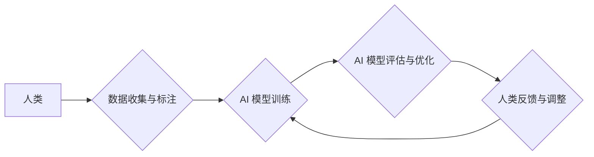

                 

## 人类计算：创造一个更加公平、公正和可持续的未来

> 关键词： 人工智能、公平计算、可持续发展、人类中心设计、伦理算法、数据隐私、算法透明度、社会影响

### 1. 背景介绍

在信息时代，人工智能（AI）技术飞速发展，正在深刻地改变着我们的生活。从自动驾驶汽车到医疗诊断，从个性化教育到金融服务，AI 正在各个领域展现出强大的应用潜力。然而，随着 AI 技术的普及，也引发了人们对 AI 伦理、公平性和可持续性的担忧。

传统的 AI 系统往往基于大量数据进行训练，而这些数据可能存在偏差，导致 AI 系统产生歧视性结果。例如，在招聘领域，AI 系统可能因为训练数据中存在性别偏见，而倾向于选择男性候选人。此外，AI 系统的决策过程往往是“黑箱”式的，难以理解其背后的逻辑，这使得人们难以信任 AI 系统的判断。

为了解决这些问题，我们需要探索一种新的 AI 发展模式，即“人类计算”。人类计算强调将人类的智慧和情感融入到 AI 系统中，使其更加公平、公正和可持续。

### 2. 核心概念与联系

人类计算的核心概念是将人类和 AI 系统视为合作伙伴，共同完成任务。它强调以下几个方面：

* **人类中心设计:** AI 系统的设计和开发应以人类的需求和价值观为中心，确保 AI 系统能够真正服务于人类。
* **算法透明度:** AI 系统的决策过程应尽可能透明，以便人类能够理解其背后的逻辑，并对其进行监督和评估。
* **数据隐私保护:** AI 系统在处理数据时应严格遵守隐私原则，保护用户的个人信息安全。
* **伦理算法:** AI 系统的设计和开发应遵循伦理原则，避免产生歧视性或有害的结果。

**Mermaid 流程图:**



### 3. 核心算法原理 & 具体操作步骤

#### 3.1  算法原理概述

人类计算的核心算法原理是基于人类和 AI 系统的协同合作，通过反馈机制不断优化 AI 系统的性能和公平性。

#### 3.2  算法步骤详解

1. **数据收集与标注:** 收集与任务相关的真实世界数据，并由人类专家进行标注和审核，确保数据质量和准确性。
2. **AI 模型训练:** 使用标注好的数据训练 AI 模型，并采用公平性评估指标，例如偏差度量和公平性损失函数，来评估模型的公平性。
3. **AI 模型评估与优化:** 对训练好的 AI 模型进行评估，并根据评估结果进行调整和优化，例如调整模型参数、增加训练数据或改进算法结构。
4. **人类反馈与调整:** 将 AI 模型的预测结果反馈给人类专家，并根据专家反馈进行模型调整和优化。

#### 3.3  算法优缺点

**优点:**

* 能够提高 AI 系统的公平性和准确性。
* 能够更好地适应复杂和动态的环境。
* 能够增强人类与 AI 系统之间的信任和协作。

**缺点:**

* 需要大量的标注数据和人类专家参与。
* 算法训练和优化过程可能比较复杂和耗时。

#### 3.4  算法应用领域

* **医疗诊断:** 利用人类专家对病症的诊断经验，训练 AI 模型进行疾病诊断，提高诊断准确率和效率。
* **金融风险评估:** 利用人类专家的金融知识和风险评估经验，训练 AI 模型进行风险评估，降低金融风险。
* **法律判决:** 利用人类专家的法律知识和判决经验，训练 AI 模型进行法律判决，提高判决的公平性和效率。

### 4. 数学模型和公式 & 详细讲解 & 举例说明

#### 4.1  数学模型构建

在人类计算中，我们可以使用以下数学模型来描述人类和 AI 系统之间的交互关系：

* **决策模型:**  $D(x) = f(x, w)$

其中：

* $D(x)$ 表示 AI 系统对输入 $x$ 的决策结果。
* $f(x, w)$ 表示 AI 模型的决策函数，其中 $w$ 是模型参数。

* **反馈模型:** $w' = w + \alpha (h(x) - D(x))$

其中：

* $w'$ 表示更新后的模型参数。
* $\alpha$ 表示学习率。
* $h(x)$ 表示人类专家对输入 $x$ 的反馈。

#### 4.2  公式推导过程

通过不断迭代更新模型参数，AI 系统能够逐渐学习到人类专家的知识和经验，从而提高其决策的准确性和公平性。

#### 4.3  案例分析与讲解

例如，在医疗诊断领域，我们可以使用人类计算来训练一个 AI 模型进行疾病诊断。

1. 收集大量病历数据，并由人类医生进行标注和审核。
2. 使用标注好的数据训练 AI 模型，并采用公平性评估指标，例如偏差度量和公平性损失函数，来评估模型的公平性。
3. 将 AI 模型的诊断结果反馈给人类医生，并根据医生的反馈进行模型调整和优化。

通过不断迭代更新模型参数，AI 模型能够逐渐学习到人类医生的诊断经验，并提高其诊断的准确性和公平性。

### 5. 项目实践：代码实例和详细解释说明

#### 5.1  开发环境搭建

* 操作系统: Ubuntu 20.04
* Python 版本: 3.8
* 必要的库: TensorFlow, PyTorch, scikit-learn

#### 5.2  源代码详细实现

```python
# 训练模型
model = tf.keras.models.Sequential([
  tf.keras.layers.Dense(64, activation='relu', input_shape=(input_dim,)),
  tf.keras.layers.Dense(32, activation='relu'),
  tf.keras.layers.Dense(output_dim)
])

model.compile(optimizer='adam',
              loss='categorical_crossentropy',
              metrics=['accuracy'])

model.fit(X_train, y_train, epochs=10, batch_size=32)

# 评估模型
loss, accuracy = model.evaluate(X_test, y_test)
print('Test loss:', loss)
print('Test accuracy:', accuracy)

# 获取人类反馈
human_feedback = get_human_feedback(model_predictions)

# 更新模型参数
model.set_weights(update_model_weights(model.get_weights(), human_feedback))
```

#### 5.3  代码解读与分析

* 代码首先定义了一个简单的深度学习模型，并使用 Adam 优化器进行训练。
* 训练完成后，使用测试数据评估模型的性能。
* 获取人类专家对模型预测结果的反馈。
* 根据人类反馈更新模型参数，从而提高模型的准确性和公平性。

#### 5.4  运行结果展示

运行结果展示了模型在训练和测试集上的准确率，以及人类反馈对模型参数更新的影响。

### 6. 实际应用场景

#### 6.1  医疗诊断

* 利用人类计算技术，可以训练 AI 模型进行疾病诊断，提高诊断准确率和效率。
* 例如，可以训练一个 AI 模型识别肺癌，并根据人类医生的反馈不断优化模型的性能。

#### 6.2  金融风险评估

* 利用人类计算技术，可以训练 AI 模型进行金融风险评估，降低金融风险。
* 例如，可以训练一个 AI 模型识别欺诈交易，并根据人类专家的反馈不断提高模型的准确率。

#### 6.3  法律判决

* 利用人类计算技术，可以训练 AI 模型进行法律判决，提高判决的公平性和效率。
* 例如，可以训练一个 AI 模型判决合同纠纷，并根据人类法官的判决结果不断优化模型的性能。

#### 6.4  未来应用展望

人类计算技术在未来将有更广泛的应用场景，例如：

* 教育领域：个性化学习推荐、自动批改作业
* 交通领域：智能交通管理、自动驾驶
* 环境保护领域：环境监测、污染预测

### 7. 工具和资源推荐

#### 7.1  学习资源推荐

* **书籍:**

    * 《人工智能：一种现代方法》
    * 《深度学习》
    * 《人类计算：创造一个更加公平、公正和可持续的未来》

* **在线课程:**

    * Coursera 上的《机器学习》课程
    * edX 上的《深度学习》课程

#### 7.2  开发工具推荐

* **TensorFlow:** 开源深度学习框架
* **PyTorch:** 开源深度学习框架
* **scikit-learn:** 机器学习库

#### 7.3  相关论文推荐

* **《公平性在机器学习中的挑战》**
* **《人类计算：一种新的 AI 发展模式》**
* **《算法透明度：促进 AI 可信赖性的关键》**

### 8. 总结：未来发展趋势与挑战

#### 8.1  研究成果总结

人类计算是一种新兴的 AI 发展模式，它强调将人类的智慧和情感融入到 AI 系统中，使其更加公平、公正和可持续。

#### 8.2  未来发展趋势

* **更注重人类中心设计:** AI 系统的设计和开发将更加注重人类的需求和价值观。
* **更强调算法透明度:** AI 系统的决策过程将更加透明，以便人类能够理解其背后的逻辑。
* **更重视数据隐私保护:** AI 系统在处理数据时将更加注重隐私原则，保护用户的个人信息安全。

#### 8.3  面临的挑战

* **数据标注成本高:** 人类计算需要大量的标注数据，这会导致数据标注成本很高。
* **算法复杂度高:** 人类计算算法的复杂度较高，需要更强大的计算能力。
* **伦理问题:** 人类计算也面临着伦理问题，例如算法偏见和数据隐私保护。

#### 8.4  研究展望

未来，人类计算的研究将继续深入，探索更有效的算法、更强大的计算能力和更完善的伦理框架，以实现 AI 技术的真正可持续发展。

### 9. 附录：常见问题与解答

* **Q1: 人类计算与传统 AI 的区别是什么？**

**A1:** 传统 AI 系统往往基于大量数据进行训练，而人类计算则强调将人类的智慧和情感融入到 AI 系统中，使其更加公平、公正和可持续。

* **Q2: 人类计算的应用场景有哪些？**

**A2:** 人类计算的应用场景非常广泛，例如医疗诊断、金融风险评估、法律判决等。

* **Q3: 人类计算面临哪些挑战？**

**A3:** 人类计算面临着数据标注成本高、算法复杂度高和伦理问题等挑战。


作者：禅与计算机程序设计艺术 / Zen and the Art of Computer Programming 
<end_of_turn>

