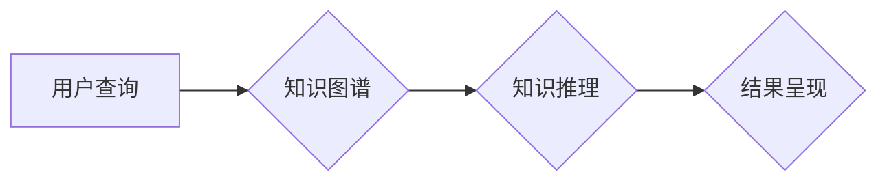

                 

## 从搜索引擎到知识发现引擎：技术的飞跃

> 关键词：搜索引擎、知识图谱、知识发现、机器学习、深度学习、自然语言处理、人工智能

### 1. 背景介绍

互联网的蓬勃发展带来了海量信息爆炸，传统的搜索引擎模式已经难以满足人们对知识获取的更高需求。人们不再仅仅满足于查找网页结果，而是希望能够更深入地理解信息之间的关联，挖掘隐藏的知识和洞察力。因此，从搜索引擎向知识发现引擎的转变成为必然趋势。

知识发现引擎旨在从海量数据中自动识别、提取和解释有价值的知识，并以可理解的方式呈现给用户。它不仅能够提供精准的搜索结果，更能够帮助用户构建知识网络，理解信息之间的关系，从而获得更深入的知识洞察。

### 2. 核心概念与联系

**2.1 搜索引擎与知识发现引擎的差异**

| 特征 | 搜索引擎 | 知识发现引擎 |
|---|---|---|
| **目标** | 返回与查询词相关的网页链接 | 发现和解释数据中的隐藏知识 |
| **数据类型** | 文本数据 | 文本、结构化数据、图像、音频等多类型数据 |
| **处理方式** | 基于关键词匹配和页面排名算法 | 基于机器学习、深度学习和知识图谱构建 |
| **结果呈现** | 网页链接列表 | 知识图谱、关系网络、可视化图表等 |

**2.2 核心概念**

* **知识图谱 (Knowledge Graph):**  知识图谱是一种数据结构，用于表示实体和它们之间的关系。它以节点和边的方式组织知识，节点代表实体，边代表实体之间的关系。
* **机器学习 (Machine Learning):** 机器学习是一种人工智能技术，通过算法从数据中学习模式和规律，从而进行预测和决策。
* **深度学习 (Deep Learning):** 深度学习是一种机器学习的子集，利用多层神经网络来模拟人类大脑的学习过程，能够处理更复杂的数据和任务。
* **自然语言处理 (Natural Language Processing):** 自然语言处理是指使计算机能够理解和处理人类语言的技术。

**2.3 架构图**



### 3. 核心算法原理 & 具体操作步骤

**3.1 算法原理概述**

知识发现引擎的核心算法通常包括：

* **文本挖掘算法:** 用于从文本数据中提取关键词、主题、实体和关系。
* **知识抽取算法:** 用于识别文本中的实体和关系，并将其转换为知识图谱的形式。
* **知识推理算法:** 用于根据知识图谱中的已知知识，推断出新的知识或关系。

**3.2 算法步骤详解**

1. **数据预处理:** 对原始数据进行清洗、格式化和转换，使其适合算法处理。
2. **文本分析:** 使用自然语言处理技术对文本数据进行分析，提取关键词、实体和关系。
3. **知识抽取:** 利用机器学习算法识别文本中的实体和关系，并将其转换为知识图谱的形式。
4. **知识推理:** 使用规则引擎或逻辑推理算法，根据知识图谱中的已知知识，推断出新的知识或关系。
5. **结果呈现:** 将提取和推断出的知识以可理解的方式呈现给用户，例如知识图谱、关系网络、可视化图表等。

**3.3 算法优缺点**

* **优点:** 能够自动发现和解释数据中的隐藏知识，提高知识获取效率。
* **缺点:** 算法的准确性和效率取决于训练数据的质量和算法模型的复杂度。

**3.4 算法应用领域**

* **搜索引擎优化 (SEO):** 帮助网站优化内容，提高搜索排名。
* **市场营销:** 分析客户数据，挖掘潜在需求，进行精准营销。
* **医疗诊断:** 分析患者病历数据，辅助医生进行诊断。
* **金融风险管理:** 分析市场数据，识别潜在风险。

### 4. 数学模型和公式 & 详细讲解 & 举例说明

**4.1 数学模型构建**

知识发现引擎的数学模型通常基于图论、概率论和统计学。

* **图论:** 用于表示知识图谱中的实体和关系。
* **概率论:** 用于计算实体和关系之间的概率关系。
* **统计学:** 用于分析数据分布和模式。

**4.2 公式推导过程**

例如，可以使用PageRank算法来计算实体的重要性。PageRank算法基于以下公式：

$$PR(A) = (1-d) + d \sum_{Page B links to A} \frac{PR(B)}{C(B)}$$

其中：

* $PR(A)$ 是实体 A 的 PageRank 值。
* $d$ 是阻尼系数，通常设置为 0.85。
* $C(B)$ 是实体 B 的出度数。

**4.3 案例分析与讲解**

假设我们有一个知识图谱，其中包含实体 "苹果"、"水果" 和 "红色"，以及关系 "是" 和 "颜色"。

* 实体 "苹果" 是一个水果，因此存在关系 "苹果 是 水果"。
* 苹果的颜色是红色，因此存在关系 "苹果 颜色 红色"。

使用 PageRank 算法可以计算实体的重要性。例如，实体 "苹果" 的 PageRank 值可能比实体 "红色" 高，因为 "苹果" 作为水果的子类，在知识图谱中占据更重要的地位。

### 5. 项目实践：代码实例和详细解释说明

**5.1 开发环境搭建**

* Python 3.x
* Jupyter Notebook
* TensorFlow 或 PyTorch

**5.2 源代码详细实现**

```python
# 使用 TensorFlow 建立一个简单的知识图谱嵌入模型
import tensorflow as tf

# 定义实体和关系的嵌入层
entity_embeddings = tf.keras.layers.Embedding(input_dim=num_entities, output_dim=embedding_dim)
relation_embeddings = tf.keras.layers.Embedding(input_dim=num_relations, output_dim=embedding_dim)

# 定义模型结构
model = tf.keras.Sequential([
    entity_embeddings,
    relation_embeddings,
    tf.keras.layers.Dense(units=1, activation='sigmoid')
])

# 训练模型
model.compile(optimizer='adam', loss='binary_crossentropy', metrics=['accuracy'])
model.fit(x_train, y_train, epochs=10)

# 使用模型预测关系
predictions = model.predict(x_test)
```

**5.3 代码解读与分析**

* 代码使用 TensorFlow 库构建了一个简单的知识图谱嵌入模型。
* 模型包含两个嵌入层，分别用于表示实体和关系。
* 模型结构是一个简单的多层感知机 (MLP)，用于预测实体之间的关系。
* 模型使用 Adam 优化器、二元交叉熵损失函数和准确率作为评估指标进行训练。

**5.4 运行结果展示**

训练完成后，可以使用模型预测实体之间的关系。例如，可以输入实体 "苹果" 和 "水果"，模型可以预测它们之间的关系是 "是"。

### 6. 实际应用场景

**6.1 搜索引擎优化 (SEO)**

知识发现引擎可以帮助网站优化内容，提高搜索排名。例如，可以分析用户搜索的关键词，并根据知识图谱中的关系，推荐相关的内容。

**6.2 市场营销**

知识发现引擎可以分析客户数据，挖掘潜在需求，进行精准营销。例如，可以分析客户的购买历史和浏览记录，推荐他们可能感兴趣的产品。

**6.3 医疗诊断**

知识发现引擎可以分析患者病历数据，辅助医生进行诊断。例如，可以分析患者的症状、检查结果和病史，推荐可能的诊断结果。

**6.4 未来应用展望**

* **个性化教育:** 根据学生的学习情况，提供个性化的学习内容和建议。
* **智能客服:** 使用知识图谱和自然语言处理技术，提供更智能和人性化的客服服务。
* **科学发现:** 帮助科学家发现新的知识和规律，加速科学研究的进程。

### 7. 工具和资源推荐

**7.1 学习资源推荐**

* **Stanford CS224N: Natural Language Processing with Deep Learning:** https://web.stanford.edu/class/cs224n/
* **Deep Learning Specialization by Andrew Ng:** https://www.deeplearning.ai/

**7.2 开发工具推荐**

* **TensorFlow:** https://www.tensorflow.org/
* **PyTorch:** https://pytorch.org/

**7.3 相关论文推荐**

* **Knowledge Graph Embedding: A Survey:** https://arxiv.org/abs/1804.01804
* **Graph Convolutional Networks for Web Knowledge Graph Embedding:** https://arxiv.org/abs/1703.06103

### 8. 总结：未来发展趋势与挑战

**8.1 研究成果总结**

从搜索引擎到知识发现引擎的转变是人工智能领域的重要发展趋势。知识发现引擎能够帮助我们更深入地理解信息，挖掘隐藏的知识和洞察力。

**8.2 未来发展趋势**

* **更强大的知识图谱:** 未来知识图谱将更加庞大、丰富和准确，涵盖更广泛的领域和知识。
* **更智能的推理算法:** 未来推理算法将更加智能，能够处理更复杂的关系和逻辑推理。
* **更个性化的知识发现:** 未来知识发现引擎将更加个性化，能够根据用户的兴趣和需求，提供更精准的知识推荐。

**8.3 面临的挑战**

* **数据质量:** 知识发现引擎的准确性和效率取决于训练数据的质量。
* **算法复杂度:** 知识发现算法通常比较复杂，需要大量的计算资源和时间。
* **知识表示:** 如何更好地表示和组织知识仍然是一个挑战。

**8.4 研究展望**

未来，知识发现引擎将继续朝着更智能、更个性化、更强大的方向发展。随着人工智能技术的不断进步，知识发现引擎将发挥越来越重要的作用，帮助我们更好地理解世界，解决复杂问题。

### 9. 附录：常见问题与解答

**9.1 如何构建知识图谱？**

构建知识图谱需要以下步骤：

1. **数据收集:** 从各种数据源收集相关数据。
2. **数据清洗:** 对收集到的数据进行清洗和格式化。
3. **实体识别:** 使用自然语言处理技术识别数据中的实体。
4. **关系抽取:** 使用机器学习算法识别实体之间的关系。
5. **知识表示:** 将实体和关系转换为知识图谱的形式。

**9.2 如何评估知识发现引擎的性能？**

知识发现引擎的性能可以评估以下指标：

* **准确率:** 预测关系的准确率。
* **召回率:** 发现所有真实关系的比例。
* **F1-score:** 准确率和召回率的调和平均值。
* **覆盖率:** 知识图谱中包含的实体和关系的范围。


作者：禅与计算机程序设计艺术 / Zen and the Art of Computer Programming 
<end_of_turn>

