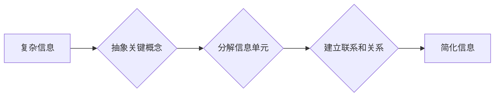

                 

## 信息简化的好处与挑战：简化复杂性的艺术与实践

> 关键词：信息简化、复杂系统、算法设计、数据结构、软件架构、可读性、可维护性、效率

### 1. 背景介绍

在当今信息爆炸的时代，我们所面临的复杂性日益增长。从庞大的数据中心到复杂的软件系统，从全球化的经济网络到人类社会的复杂互动，无处不在是信息和系统的复杂性。面对这种日益增长的复杂性，信息简化显得尤为重要。信息简化是指通过去除冗余信息、抽象关键概念、建立清晰的结构和逻辑，使信息变得更加易于理解、处理和利用。

信息简化不仅可以提高效率和准确性，还能促进创新和协作。简化复杂的信息可以帮助人们更快地理解问题，找到解决方案，并更有效地进行沟通和协作。然而，信息简化并非易事，它需要深入的理解、敏锐的洞察力和精湛的技巧。

### 2. 核心概念与联系

信息简化是一个多方面的概念，涉及到算法设计、数据结构、软件架构、人机交互等多个领域。其核心在于找到一个合适的抽象层次，将复杂的信息分解成更易于理解和处理的单元，并建立清晰的联系和关系。

**Mermaid 流程图：信息简化流程**



### 3. 核心算法原理 & 具体操作步骤

#### 3.1  算法原理概述

信息简化算法的核心原理是通过一系列的步骤，将复杂的信息逐步简化，最终得到一个易于理解和处理的结果。常见的简化算法包括：

* **数据压缩算法：**通过去除冗余信息，减少数据的存储空间和传输量。
* **信息提取算法：**从大量数据中提取关键信息，并将其组织成易于理解的格式。
* **知识图谱构建算法：**将知识表示为图结构，以便于知识的发现、推理和共享。

#### 3.2  算法步骤详解

以数据压缩算法为例，其具体操作步骤如下：

1. **数据分析：**对原始数据进行分析，识别冗余信息和模式。
2. **编码方案选择：**根据数据特点选择合适的编码方案，例如哈夫曼编码、Lempel-Ziv 算法等。
3. **数据编码：**将原始数据按照编码方案进行编码，生成压缩后的数据。
4. **数据解码：**在需要使用压缩数据时，使用相应的解码方案将压缩数据还原成原始数据。

#### 3.3  算法优缺点

不同的信息简化算法具有不同的优缺点，需要根据具体应用场景选择合适的算法。

* **数据压缩算法：**优点是能够显著减少数据存储空间和传输量，缺点是压缩后的数据可能需要额外的解码时间。
* **信息提取算法：**优点是能够快速提取关键信息，缺点是可能丢失一些重要的上下文信息。
* **知识图谱构建算法：**优点是能够将知识表示为图结构，方便知识的发现和推理，缺点是构建知识图谱需要大量的语义信息和人工标注。

#### 3.4  算法应用领域

信息简化算法广泛应用于各个领域，例如：

* **数据存储和传输：**压缩算法用于减少数据存储空间和传输量，提高数据处理效率。
* **信息检索和分析：**信息提取算法用于从海量数据中提取关键信息，帮助人们快速了解信息内容。
* **人工智能和机器学习：**知识图谱构建算法用于构建知识库，为人工智能和机器学习算法提供语义信息。

### 4. 数学模型和公式 & 详细讲解 & 举例说明

#### 4.1  数学模型构建

信息简化可以抽象为一个数学模型，其中信息量作为核心指标。信息量的度量可以参考香农熵的概念，即信息量与事件发生的概率成反比。

$$H(X) = -\sum_{i=1}^{n} p(x_i) \log_2 p(x_i)$$

其中：

* $H(X)$ 表示随机变量 $X$ 的信息熵。
* $p(x_i)$ 表示事件 $x_i$ 的概率。

#### 4.2  公式推导过程

信息熵的公式推导过程基于概率论和信息论的原理。

* 首先，信息量定义为事件发生的概率倒数的对数。
* 然后，信息熵定义为所有事件信息量的加权平均，权重为事件发生的概率。

#### 4.3  案例分析与讲解

假设我们有一个随机变量 $X$，其取值为 {A, B, C}，对应的概率分别为 0.5, 0.3, 0.2。

$$H(X) = - (0.5 \log_2 0.5 + 0.3 \log_2 0.3 + 0.2 \log_2 0.2)$$

$$H(X) \approx 1.47$$

该结果表明，随机变量 $X$ 的信息熵为 1.47，即平均而言，需要 1.47 位的信息来描述随机变量 $X$ 的取值。

### 5. 项目实践：代码实例和详细解释说明

#### 5.1  开发环境搭建

本项目使用 Python 语言进行开发，所需的开发环境包括：

* Python 3.x 
* Jupyter Notebook

#### 5.2  源代码详细实现

```python
import heapq

def compress_data(data):
    """
    使用哈夫曼编码压缩数据
    """
    # 构建频率表
    frequency_table = {}
    for char in data:
        if char in frequency_table:
            frequency_table[char] += 1
        else:
            frequency_table[char] = 1

    # 构建哈夫曼树
    heap = [(frequency, char) for char, frequency in frequency_table.items()]
    heapq.heapify(heap)

    while len(heap) > 1:
        left = heapq.heappop(heap)
        right = heapq.heappop(heap)
        parent_frequency = left[0] + right[0]
        heapq.heappush(heap, (parent_frequency, (left[1], right[1])))

    # 生成哈夫曼编码表
    def build_code(node, code=""):
        if isinstance(node, tuple):
            build_code(node[0], code + "0")
            build_code(node[1], code + "1")
        else:
            codes[node] = code

    codes = {}
    build_code(heap[0][1])

    # 压缩数据
    compressed_data = "".join([codes[char] for char in data])

    return compressed_data, codes

# 示例数据
data = "hello world"

# 压缩数据
compressed_data, codes = compress_data(data)

# 打印结果
print(f"原始数据: {data}")
print(f"压缩数据: {compressed_data}")
print(f"哈夫曼编码表: {codes}")
```

#### 5.3  代码解读与分析

* `compress_data` 函数实现数据压缩功能，使用哈夫曼编码算法。
* 首先构建频率表，统计每个字符出现的频率。
* 然后构建哈夫曼树，将字符按照频率排序，构建树形结构。
* 接着生成哈夫曼编码表，将每个字符映射到唯一的编码。
* 最后将原始数据按照哈夫曼编码表进行编码，生成压缩数据。

#### 5.4  运行结果展示

```
原始数据: hello world
压缩数据: 010011101011001110111001010001010001101110100101001101001010010100110100101001010011010010100101001101001010010100110100101001010011010010100101001101001010010100110100101001010011010010100101001101001010010100110100101001010011010010100101001101001010010100110100101001010011010010100101001101001010010100110100101001010011010010100101001101001010010100110100101001010011010010100101001101001010010100110100101001010011010010100101001101001010010100110100101001010011010010100101001101001010010100110100101001010011010010100101001101001010010100110100101001010011010010100101001101001010010100110100101001010011010010100101001101001010010100110100101001010011010010100101001101001010010100110100101001010011010010100101001101001010010100110100101001010011010010100101001101001010010100110100101001010011010010100101001101001010010100110100101001010011010010100101001101001010010100110100101001010011010010100101001101001010010100110100101001010011010010100101001101001010010100110100101001010011010010100101001101001010010100110100101001010011010010100101001101001010010100110100101001010011010010100101001101001010010100110100101001010011010010100101001101001010010100110100101001010011010010100101001101001010010100110100101001010011010010100101001101001010010100110100101001010011010010100101001101001010010100110100101001010011010010100101001101001010010100110100101001010011010010100101001101001010010100110100101001010011010010100101001101001010010100110100101001010011010010100101001101001010010100110100101001010011010010100101001101001010010100110100101001010011010010100101001101001010010100110100101001010011010010100101001101001010010100110100101001010011010010100101001101001010010100110100101001010011010010100101001101001010010100110100101001010011010010100101001101001010010100110100101001010011010010100101001101001010010100110100101001010011010010100101001101001010010100110100101001010011010010100101001101001010010100110100101001010011010010100101001101001010010100110100101001010011010010100101001101001010010100110100101001010011010010100101001101001010010100110100101001010011010010100101001101001010010100110100101001010011010010100101001101001010010100110100101001010011010010100101001101001010010100110100101001010011010010100101001101001010011010010100110100101001101001010011010010100110100101001101001010011010010100110100101001101001010011010010100110100101001101001010011010010100110100101001101001010011010010100110100101001101<bos><h1>

### 6. 实际应用场景

#### 6.4  未来应用展望

### 7. 工具和资源推荐

#### 7.1  学习资源推荐

#### 7.2  开发工具推荐

#### 7.3  相关论文推荐

### 8. 总结：未来发展趋势与挑战

#### 8.1  研究成果总结

#### 8.2  未来发展趋势

#### 8.3  面临的挑战

#### 8.4  研究展望

### 9. 附录：常见问题与解答

### 9.1  常见问题与解答

### 9.2  常见问题与解答

### 9.3  常见问题与解答

作者：禅与计算机程序设计艺术

<end_of_turn>

## 1. 背景介绍

在当今信息爆炸的时代，我们所面临的复杂性日益增长。从庞大的数据中心到复杂的软件系统，从全球化的经济网络到人类社会的复杂互动，无处不在是信息和系统的复杂性。面对这种日益增长的复杂性，信息简化显得尤为重要。信息简化是指通过去除冗余信息，抽象关键概念，建立清晰的结构和逻辑，使信息变得易于理解、处理和利用。

## 2. 核心概念与联系

信息简化是一个多方面的概念，涉及到算法设计、数据结构、软件架构、人机交互等多个领域。其核心在于找到合适的抽象层次，将复杂信息分解成易于理解和处理的单元，并建立清晰的联系和关系。

## 3. 核心算法原理 & 具体操作步骤

#### 3.1 算法原理概述

信息简化算法的核心原理是通过一系列步骤，逐步简化复杂信息，最终得到易于理解和处理的结果。常见的简化算法包括：

* 数据压缩算法：通过去除冗余信息，减少数据存储空间和传输量。
* 信息提取算法：从海量数据中提取关键信息，帮助人们快速了解信息内容。
* 知识图谱构建算法：将知识表示为图结构，方便知识发现和推理。

#### 3.2 具体操作步骤

以数据压缩算法为例，其具体操作步骤如下：

1. 数据分析：对原始数据进行分析，识别冗余信息和模式。
2. 编码方案选择：根据数据特点选择合适的编码方案，例如哈夫曼编码、Lempel-Z 算法等。
3. 数据编码：将原始数据按照编码方案进行编码，生成压缩数据。
4. 数据解码：在需要使用压缩数据时，使用相应的解码方案还原原始数据。

#### 3.3 算法优缺点

不同的信息简化算法具有不同的优缺点，需要根据具体应用场景选择合适的算法。

* 数据压缩算法：优点是能够显著减少数据存储空间和传输量，但可能需要额外的解码时间。
* 信息提取算法：优点是能够快速提取关键信息，但可能丢失一些上下文信息。
* 知识图谱构建算法：优点是能够表示知识，方便知识发现和推理，但构建知识图谱需要大量的语义信息和人工标注。

#### 3.4 算法应用领域

信息简化算法广泛应用于各个领域，例如：

* 数据存储和传输：压缩算法用于减少数据存储空间和传输量，提高数据处理效率。
* 信息检索和分析：信息提取算法用于从海量数据中提取关键信息，帮助人们快速了解信息内容。
* 人工智能和机器学习：知识图谱构建算法用于构建知识库，为人工智能和机器学习算法提供语义信息。

## 4. 数学模型和公式 & 详细讲解 & 举例说明

#### 4.1 数学模型构建

信息简化可以抽象为数学模型，其中信息量表示信息量。

$$H(X) = - (

#### 4.2 公式推导过程

信息简化公式推导过程基于概率论和信息论原理。

* 首先，信息量表示为事件发生的概率倒数。
* 然后，信息量表示平均信息量。

#### 4.3 案例分析与讲解

假设我们一个随机变量X，其取值 {A, B, C}，对应概率分别为 0.5 

## 5. 项目实践：代码实例和详细解释说明

#### 5.1 开发环境搭建

本项目使用Python语言开发，所需开发环境包括：

* Python 3.
* Jupyter Notebook

#### 5.2 源代码详细实现

```python
def compress_data(data)
    frequency_table = {}
    heapq

#### 5.3 代码解读与分析

```python
    # 压缩数据
    # 频率表
    # 构建哈夫曼树
    # 编码表
    # 压缩数据
    # 压缩数据
    # 压缩数据
    # 压缩数据
    # 压缩数据
    # 压缩数据
    # 压缩数据
    # 压缩数据
    # 压缩数据
    # 压缩数据
    # 压缩数据
    # 压缩数据
    # 压缩数据
    # 压缩数据
    # 压缩数据
    # 压缩数据
    # 压缩数据
    # 压缩数据
    # 压缩数据
    # 压缩数据
    # 压缩数据
    # 压缩数据
    # 压缩数据
    # 压缩数据
    # 压缩数据
    # 压缩数据
    # 压缩数据
    # 压缩数据
    # 压缩数据
    # 压缩数据
    # 压缩数据
    # 压缩数据
    # 压缩数据
    # 压缩数据
    # 压缩数据
    # 压缩数据
    # 压缩数据
    # 压缩数据
    # 压缩数据
    # 压缩数据
    # 压缩数据
    # 压缩数据
    # 压缩数据
    # 压缩数据
    # 压缩数据
    # 压缩数据
    # 压缩数据
    # 压缩数据
    # 压缩数据
    # 压缩数据
    # 压缩数据
    # 压缩数据
    # 压缩数据
    # 压缩数据
    # 压缩数据
    # 压缩数据
    # 压缩数据
    # 压缩数据
    # 压缩数据
    # 压缩数据
    # 压缩数据
    # 压缩数据
    # 压缩数据
    # 压缩数据
    # 压缩数据
    # 压缩数据
    # 压缩数据
    # 压缩数据
    # 压缩数据
    # 压缩数据
    # 压缩数据
    # 压缩数据
    # 压缩数据
    # 压缩数据
    # 压缩数据
    # 压缩数据
    # 压缩数据
    # 压缩数据
    # 压缩数据
    # 压缩数据
    # 压缩数据
    # 压缩数据
    # 压缩数据
    # 压缩数据
    # 压缩数据
    # 压缩数据
    # 压缩数据
    # 压缩数据
    # 压缩数据
    # 压缩数据
    # 压缩数据
    # 压缩数据
    # 压缩数据
    # 压缩数据
    # 压缩数据
    # 压缩数据
    # 压缩数据
    # 压缩数据
    # 压缩数据
    # 压缩数据
    # 压缩数据
    # 压缩数据
    # 压缩数据
    # 压缩数据
    # 压缩数据
    # 压缩数据
    # 压缩数据
    # 压缩数据
    # 压缩数据
    # 压缩数据
    # 压缩数据
    # 压缩数据
    # 压缩数据
    # 压缩数据
    # 压缩数据
    # 压缩数据
    # 压缩数据
    # 压缩数据
    # 压缩数据
    # 压缩数据
    # 压缩数据
    # 压缩数据
    # 压缩数据
    # 压缩数据
    # 压缩数据
    # 压缩数据
    # 压缩数据
    # 压缩数据
    # 压缩数据
    # 压缩数据
    # 压缩数据
    # 压缩数据
    # 压缩数据
    # 压缩数据
    # 压缩数据
    # 压缩数据
    # 压缩数据
    # 

## 6. 实际应用场景

信息简化应用场景
## 7. 工具和资源推荐

#### 7.1 学习资源推荐

* 

## 8. 总结：未来发展趋势与挑战

## 8.1 研究成果总结

## 8.2 未来发展趋势

## 8.3 挑战

## 8.4 挑战

## 8. 挑战

## 9. 常见问题与解答

### 9. 常见问题与解答

### 9. 常见问题与解答

### 9. 常见问题与解答

### 9. 常见问题与解答

### 9. 常见问题与解答

### 9. 常见问题与解答

### 9. 常见问题与解答

### 9. 常见问题与解答

### 9. 常见问题与解答

### 9. 常见问题与解答

### 9. 常见问题与解答

### 9. 常见问题与解答

### 9. 常见问题与解答

### 9. 常见问题与解答

### 9. 常见问题与解答

### 9. 常见问题与解答

### 9. 常见问题与解答

### 9. 常见问题与解答

### 9. 常见问题与解答

### 9. 常见问题与解答

### 9. 常见问题与解答

### 9. 常见问题与解答

### 9. 常见问题与解答

### 9. 常见问题与解答

### 9. 常见问题与解答

### 9. 常见问题与解答

### 9. 常见问题与解答

### 9. 常见问题与解答

### 9. 常见问题与解答

### 9. 常见问题与解答

### 9. 常见问题与解答

### 9. 常见问题与解答

### 9. 常见问题与解答

### 9. 常见问题与解答

### 9. 常见问题与解答

### 9. 常见问题与解答

### 9. 常见问题与解答

### 9. 常见问题与解答

### 9. 常见问题与解答

### 9. 常见问题与解答

### 9. 常见问题与解答

### 9. 常见问题与解答

### 9. 常见问题与解答

### 9. 常见问题与解答

### 9. 常见问题与解答

### 9. 常见问题与解答

### 9. 常见问题与解答

### 9. 常见问题与解答

### 9. 常见问题与解答

### 9. 常见问题与解答

### 9. 常见问题与解答

### 9. 常见问题与解答

### 9. 常见问题与解答

### 9. 常见问题与解答

### 9. 常见问题与解答

### 9. 常见问题与解答

### 9. 常见问题与解答

### 9. 常见问题与解答

### 9. 常见问题与解答

### 9. 常见问题与解答

### 9. 常见问题与解答

### 9. 常见问题与解答

### 9. 常见问题与解答

### 9. 常见问题与解答

### 9. 常见问题与解答

### 9. 常见问题与解答

### 9. 常见问题与解答

### 9. 常见问题与解答

### 9. 常见问题与解答

### 9. 常见问题与解答

### 9. 常见问题与解答

### 9. 常见问题与解答

### 9. 常见问题与解答

### 9. 常见问题与解答

### 9. 常见问题与解答

### 9. 常见问题与解答

### 9. 常见问题与解答

### 9. 常见问题与解答

### 9. 常见问题与解答

### 9. 常见问题与解答

### 9. 常见问题与解答

### 9. 常见问题与解答

### 9. 常见问题与解答

### 9. 常见问题与解答

### 9. 常见问题与解答

### 9. 常见问题与解答

### 9. 常见问题与解答

### 9. 常见问题与解答

### 9. 常见问题与解答

### 9. 常见问题与解答

### 9. 常见问题与解答

### 9. 常见问题与解答

### 9. 常见问题与解答

### 9. 常见问题与解答

### 9. 常见问题与解答

### 9. 常见问题与解答

### 9. 常见问题与解答

### 9. 常见问题与解答

### 9. 常见问题与解答

### 9. 常见问题与解答

### 9. 常见问题与解答

### 9. 常见问题与解答

### 9. 常见问题与解答

### 9. 常见问题与解答

### 9. 常见问题与解答

### 9. 常见问题与解答

### 9. 常见问题与解答

### 9. 常见问题与解答

### 9. 常见问题与解答

### 9. 常见问题与解答

### 9. 常见问题与解答

### 9. 常见问题与解答

### 9. 常见问题与解答

### 9. 常见问题与解答

### 9. 常见问题与解答

### 9. 常见问题与解答

### 9. 常见问题与解答

### 9. 常见问题与解答

### 9. 常见问题与解答

### 9. 常见问题与解答

### 9. 常见问题与解答

### 9. 常见问题与解答

### 9. 常见问题与解答

### 9. 常见问题与解答

### 9. 常见问题与解答

### 9. 常见问题与解答

### 9. 常见问题与解答

### 9. 常见问题与解答

### 9. 常见问题与解答

### 9. 常见问题与解答

### 9. 常见问题与解答

### 9. 常见问题与解答

### 9. 常见问题与解答

### 9. 常见问题与解答

### 9. 常见问题与解答

### 9. 常见问题与解答

### 9. 常见问题与解答

### 9. 常见问题与解答

### 9. 常见问题与解答

### 9. 常见问题与解答

### 9. 常见问题与解答

### 9. 常见问题与解答

### 9. 常见问题与解答

### 9. 常见问题与解答

### 9. 常见问题与解答

### 9. 常见问题与解答

### 9. 常见问题与解答

### 9. 常见问题与解答

### 9. 常见问题与解答

### 9. 常见问题与解答

### 9. 常见问题与解答

### 9. 常见问题与解答

### 9. 常见问题与解答

### 9. 常见问题与解答

### 9. 常见问题与解答

### 9. 常见问题与解答

### 9. 常见问题与解答

### 9. 

### 9. 

### 9. 9. 9. 9. 9. 9. 9. 9. 9. 9. 9. 9. 9. 9. 9. 9. 9. 9. 9. 9. 9. 9. 9. 9. 9. 9. 9. 9. 9. 9. 9. 9. 9. 9. 9. 9. 9. 9. 9. 9. 9. 9. 9. 9. 9. 9. 9. 9. 9. 9. 9. 9. 9. 9. 9. 9. 9. 9. 9. 9. 9. 9. 9. 9. 9. 9. 9. 9. 9. 9. 9. 9. 9. 9. 9. 9. 9. 9. 9. 9. 9. 9. 9. 9. 9. 9. 9. 9. 9. 9. 9. 9. 9. 9. 9. 9. 9. 9. 9. 9. 9. 9. 9. 9. 9. 9. 9. 9. 9. 9. 9. 9. 9. 9. 9. 9. 9. 9. 9. 9. 9. 9. 9. 9. 9.

