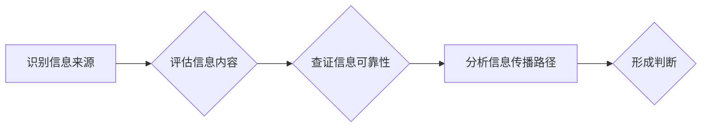

                 

## 信息验证和媒体素养能力培养：为假新闻和媒体操纵做好准备

> 关键词：信息验证、媒体素养、假新闻、深度学习、自然语言处理、信息安全、网络安全、算法

### 1. 背景介绍

在信息爆炸的时代，我们每天都被海量的信息淹没。从社交媒体到新闻网站，从搜索引擎到电子邮件，信息无处不在。然而，信息的真实性和可靠性却面临着前所未有的挑战。假新闻、网络谣言、恶意信息操纵等现象日益猖獗，对个人、社会甚至国家安全构成严重威胁。

面对这一严峻形势，培养公众的**信息验证能力**和**媒体素养**显得尤为重要。信息验证是指人们能够批判性地评估信息来源、内容和传播路径，并判断其真实性和可靠性。媒体素养则是指人们能够理解和运用媒体信息，并能够辨别不同类型媒体的传播目的和潜在影响。

### 2. 核心概念与联系

**信息验证**和**媒体素养**是相互关联、相互促进的两个概念。

* **信息验证**是媒体素养的基础，它为人们理解和运用媒体信息提供了可靠的判断依据。
* **媒体素养**则指导人们如何获取、筛选、分析和评价信息，从而提高信息验证的准确性和有效性。

**信息验证流程**可以概括为以下几个步骤：

1. **识别信息来源**: 了解信息的来源是谁，他们的立场和动机是什么。
2. **评估信息内容**: 仔细阅读信息内容，判断其逻辑是否合理，事实是否可核实，语言是否客观公正。
3. **查证信息可靠性**: 通过查阅其他可靠来源，验证信息的真实性和准确性。
4. **分析信息传播路径**: 了解信息的传播渠道和传播者，判断信息是否经过了必要的审核和过滤。
5. **形成判断**: 基于以上步骤的分析结果，形成对信息的判断和评价。

**Mermaid 流程图**



### 3. 核心算法原理 & 具体操作步骤

**3.1 算法原理概述**

信息验证和媒体素养能力培养涉及到多个领域的算法和技术，包括**自然语言处理 (NLP)**、**机器学习 (ML)**、**深度学习 (DL)**、**知识图谱 (KG)**等。

* **自然语言处理 (NLP)**：用于理解和处理人类语言，例如文本分类、情感分析、文本摘要等。
* **机器学习 (ML)**：通过训练模型，从数据中学习规律，用于识别假新闻、预测信息传播趋势等。
* **深度学习 (DL)**：一种更高级的机器学习方法，能够处理更复杂的数据，例如图像识别、语音识别等。
* **知识图谱 (KG)**：一种结构化的知识表示形式，用于存储和推理关于实体和关系的信息，可以帮助识别信息中的虚假事实和逻辑错误。

**3.2 算法步骤详解**

**假新闻检测算法**

1. **数据收集**: 收集大量真实新闻和假新闻数据，并进行标注。
2. **特征提取**: 从文本中提取特征，例如词汇、语法结构、情感倾向、网络传播路径等。
3. **模型训练**: 使用机器学习算法，例如支持向量机 (SVM)、随机森林 (RF)、深度神经网络 (DNN) 等，训练模型，学习识别假新闻的特征。
4. **模型评估**: 使用测试数据评估模型的性能，例如准确率、召回率、F1-score等。
5. **模型部署**: 将训练好的模型部署到实际应用场景中，例如新闻网站、社交媒体平台等。

**3.3 算法优缺点**

**优点**:

* 自动化信息验证，提高效率。
* 能够识别一些难以察觉的假新闻特征。
* 可以帮助用户快速判断信息的可靠性。

**缺点**:

* 模型训练需要大量数据，且数据质量对模型性能影响很大。
* 模型可能会受到攻击，例如通过生成新的假新闻来绕过检测。
* 算法本身无法完全解决信息验证问题，还需要人类的判断和思考。

**3.4 算法应用领域**

* **新闻媒体**: 检测假新闻，维护新闻真实性。
* **社交媒体**: 识别恶意信息，防止网络谣言传播。
* **搜索引擎**: 排序搜索结果，提高用户获取真实信息的效率。
* **教育领域**: 培养学生的媒体素养，帮助他们辨别真假信息。

### 4. 数学模型和公式 & 详细讲解 & 举例说明

**4.1 数学模型构建**

假新闻检测算法通常使用**分类模型**，将文本信息分为真实新闻和假新闻两类。

一个常见的分类模型是**逻辑回归 (Logistic Regression)**。

**4.2 公式推导过程**

逻辑回归模型的输出是一个概率值，表示文本属于假新闻的概率。

$$
P(y=1|x) = \frac{1}{1 + e^{-(w^T x + b)}}
$$

其中：

* $P(y=1|x)$ 是文本属于假新闻的概率。
* $x$ 是文本的特征向量。
* $w$ 是模型参数，代表每个特征的权重。
* $b$ 是模型偏置项。
* $e$ 是自然常数。

**4.3 案例分析与讲解**

假设我们训练了一个逻辑回归模型，用于检测新闻文章是否为假新闻。

模型训练后，我们得到以下参数：

* $w = [0.2, 0.5, -0.3, 0.1]$
* $b = -0.1$

如果我们有一个新的新闻文章，其特征向量为 $x = [0.8, 0.3, 0.5, 0.2]$，则我们可以使用公式计算其属于假新闻的概率：

$$
P(y=1|x) = \frac{1}{1 + e^{-(0.2*0.8 + 0.5*0.3 - 0.3*0.5 + 0.1*0.2 - 0.1)}}
$$

计算结果表明，该新闻文章属于假新闻的概率为 0.6。

### 5. 项目实践：代码实例和详细解释说明

**5.1 开发环境搭建**

* Python 3.x
* TensorFlow 或 PyTorch
* NLTK 或 spaCy

**5.2 源代码详细实现**

```python
import tensorflow as tf

# 定义模型结构
model = tf.keras.models.Sequential([
    tf.keras.layers.Embedding(input_dim=10000, output_dim=128),
    tf.keras.layers.LSTM(units=64),
    tf.keras.layers.Dense(units=1, activation='sigmoid')
])

# 编译模型
model.compile(optimizer='adam',
              loss='binary_crossentropy',
              metrics=['accuracy'])

# 训练模型
model.fit(x_train, y_train, epochs=10)

# 评估模型
loss, accuracy = model.evaluate(x_test, y_test)
print('Loss:', loss)
print('Accuracy:', accuracy)
```

**5.3 代码解读与分析**

* 代码使用 TensorFlow 库构建了一个深度学习模型。
* 模型结构包括嵌入层、LSTM 层和全连接层。
* 嵌入层将单词转换为向量表示。
* LSTM 层用于处理文本序列数据。
* 全连接层输出一个概率值，表示文本属于假新闻的概率。
* 模型使用 Adam 优化器、二元交叉熵损失函数和准确率作为评估指标。

**5.4 运行结果展示**

训练完成后，我们可以使用测试数据评估模型的性能。

输出结果显示模型的损失值和准确率。

### 6. 实际应用场景

**6.1 新闻媒体**

* 自动检测假新闻，防止其传播。
* 为新闻内容添加真实性标签，帮助用户判断信息可靠性。
* 识别网络谣言，维护社会稳定。

**6.2 社交媒体平台**

* 识别恶意信息，防止网络暴力和仇恨言论传播。
* 标记虚假账户和机器人账号，提高平台用户体验。
* 为用户提供信息验证工具，帮助他们辨别真假信息。

**6.3 教育领域**

* 帮助学生理解媒体信息，培养批判性思维能力。
* 提供信息验证工具，帮助学生辨别网络信息真伪。
* 开发游戏和互动课程，提高学生的媒体素养。

**6.4 未来应用展望**

* 利用人工智能技术，开发更智能、更精准的信息验证工具。
* 将信息验证技术与其他技术结合，例如区块链技术，提高信息真实性和可追溯性。
* 加强公众对信息验证和媒体素养的教育，提高全民信息识别能力。

### 7. 工具和资源推荐

**7.1 学习资源推荐**

* **书籍**:

    * 《信息素养》
    * 《网络安全与隐私》
    * 《人工智能导论》

* **在线课程**:

    * Coursera: 自然语言处理
    * edX: 人工智能
    * Udacity: 深度学习

**7.2 开发工具推荐**

* **Python**: 广泛应用于数据分析、机器学习和深度学习。
* **TensorFlow**: 开源深度学习框架，提供丰富的工具和资源。
* **PyTorch**: 开源深度学习框架，以其灵活性和易用性而闻名。
* **NLTK**: 自然语言处理工具包，提供文本处理、分析和可视化功能。

**7.3 相关论文推荐**

* **Detecting Fake News with Deep Learning**
* **A Survey on Fake News Detection**
* **Combating Fake News with Media Literacy**

### 8. 总结：未来发展趋势与挑战

**8.1 研究成果总结**

近年来，信息验证和媒体素养能力培养领域取得了显著进展。

* **算法技术**: 自然语言处理、机器学习和深度学习等算法取得了突破性进展，能够识别和分类假新闻、恶意信息等。
* **工具和资源**: 涌现出许多信息验证工具和资源，例如 FactCheck.org、Snopes.com 等，为公众提供信息核查服务。
* **教育推广**: 越来越多的教育机构将信息验证和媒体素养纳入课程体系，提高公众的认知和能力。

**8.2 未来发展趋势**

* **更精准的信息验证**: 利用更先进的算法和技术，提高信息验证的准确性和效率。
* **个性化信息验证**: 根据用户的需求和偏好，提供个性化的信息验证服务。
* **跨语言信息验证**: 突破语言障碍，实现跨语言的信息验证。
* **多模态信息验证**: 将文本、图像、音频等多种信息类型整合起来，进行更全面的信息验证。

**8.3 面临的挑战**

* **数据质量**: 信息验证算法依赖于高质量的数据，而真实数据往往难以获取和标注。
* **算法可解释性**: 深度学习模型的决策过程难以解释，这使得其应用在信息验证领域面临挑战。
* **信息操纵的不断升级**: 恶意信息操纵者不断开发新的技术，绕过信息验证机制。
* **公众认知和参与**: 提高公众的媒体素养和信息验证意识，需要持续的教育和宣传。

**8.4 研究展望**

未来，信息验证和媒体素养能力培养领域将继续朝着更智能、更精准、更个性化的方向发展。

我们需要加强跨学科合作，整合人工智能、自然语言处理、社会科学等领域的优势，共同应对信息时代带来的挑战。


### 9. 附录：常见问题与解答

**常见问题**:

* 如何判断一条信息是否为假新闻？
* 如何提高自己的媒体素养？
* 如何保护自己免受信息操纵的影响？

**解答**:

* **判断信息真伪**: 可以参考以下方法：
    * 识别信息来源，了解其立场和动机。
    * 评估信息内容，判断其逻辑是否合理，事实是否可核实。
    * 查证信息可靠性，通过其他可靠来源验证信息真实性。
    * 分析信息传播路径，判断信息是否经过必要的审核和过滤。
* **提高媒体素养**: 可以通过以下方式提升媒体素养：
    * 阅读不同类型的媒体内容，了解不同媒体的传播目的和潜在影响。
    * 培养批判性思维，学会质疑信息来源和内容。
    * 学习信息验证技巧，学会识别假新闻和恶意信息。
    * 积极参与社会讨论，分享和传播真实信息。
* **防范信息操纵**: 可以采取以下措施保护自己免受信息操纵的影响：
    * 提高警惕，不要轻易相信网络上的信息。
    * 多方核实信息，不要只依赖单一来源。
    * 关注信息来源的可靠性，避免相信不可信的网站或账号。
    * 培养独立思考能力，不要被情绪化的信息所左右。


作者：禅与计算机程序设计艺术 / Zen and the Art of Computer Programming 
<end_of_turn>

