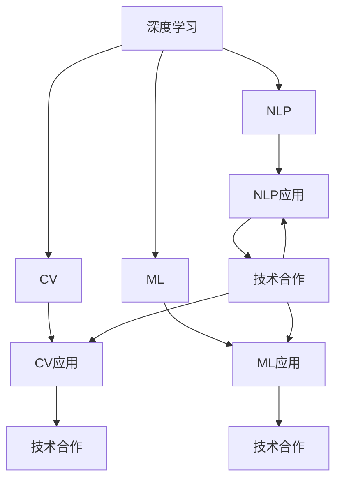

                 

# 国际化战略：Lepton AI的全球布局

> 关键词：国际化战略, Lepton AI, 全球布局, 深度学习, 自然语言处理, 计算机视觉, 机器学习, AI创业, 技术合作

## 1. 背景介绍

### 1.1 问题由来

在当今快速发展的全球化商业环境中，企业要想保持竞争优势，就必须拓展到全球市场。科技行业尤其如此，优秀的技术能够跨越国界，满足全球用户的各种需求。

Lepton AI是一家专注于深度学习和人工智能(AI)技术的初创公司，成立初期即立志于打破地域限制，在全球范围内建立强大的技术影响力。公司的创始团队由来自世界各地的顶尖科研人员组成，他们的目标是利用最新的技术，解决全球化企业面临的各种挑战，如自然语言处理(NLP)、计算机视觉(CV)等。

Lepton AI的全球布局不仅意味着产品覆盖的广泛性，更代表着公司在全球范围内的技术研发、合作伙伴关系以及市场推广战略的协调一致。为了实现这些目标，Lepton AI设计了一整套国际化战略，涵盖技术研发、市场拓展、合作伙伴关系构建等方面。

### 1.2 问题核心关键点

Lepton AI的国际化战略关键点如下：

1. **技术研发的全球协同**：Lepton AI聚集了世界各地的顶尖科学家，构建了全球化的研发团队，通过共享数据和算法，提升技术的全球竞争力。

2. **市场拓展的本土化**：Lepton AI的营销策略不仅针对全球市场，还根据不同国家的文化和消费习惯，量身定制本地化的营销方案。

3. **合作关系的全球化**：Lepton AI与全球知名科技公司、教育机构和政府部门建立了紧密的合作关系，共同推动技术进步和应用落地。

4. **数据与算法的跨文化融合**：Lepton AI通过跨文化数据集和算法的融合，提升了模型的普适性和鲁棒性，确保技术在各种文化背景下都能有效运行。

### 1.3 问题研究意义

Lepton AI的国际化战略对于公司在全球范围内扩展影响力，提升市场竞争地位具有重要意义：

1. **品牌影响力**：国际化布局能够显著提升Lepton AI在全球科技行业的品牌认知度。

2. **市场增长**：通过覆盖全球市场，Lepton AI可以获取更多的用户和客户，实现业务的持续增长。

3. **技术创新**：跨文化、跨地域的合作能够激发更多的创新思路，推动技术进步。

4. **业务合规**：通过与各国政府和监管机构合作，确保业务在全球范围内的合法合规。

## 2. 核心概念与联系

### 2.1 核心概念概述

为更好地理解Lepton AI的国际化战略，本节将介绍几个密切相关的核心概念：

- **深度学习**：基于神经网络的机器学习技术，通过多层非线性变换进行特征提取和模式识别，是Lepton AI技术研发的核心。

- **自然语言处理(NLP)**：使用计算机处理、理解、生成自然语言的技术，包括文本分类、机器翻译、问答系统等。

- **计算机视觉(CV)**：使用计算机对图像和视频进行理解、分析和生成，是Lepton AI在图像识别、视频监控等领域的关键技术。

- **机器学习(ML)**：训练算法模型，使其具备自动学习数据特征的能力，是Lepton AI技术应用的基础。

- **全球化战略**：企业在跨国经营过程中，通过全球资源优化配置，实现市场拓展和技术研发的双赢。

这些核心概念之间的逻辑关系可以通过以下Mermaid流程图来展示：



这个流程图展示了大语言模型的核心概念及其之间的关系：

1. 深度学习是基础，通过神经网络模型进行数据处理和特征提取。
2. NLP、CV和ML分别应用深度学习模型，实现特定的技术应用。
3. 这些技术应用通过技术合作进一步扩展到全球市场。

这些概念共同构成了Lepton AI的技术研发和国际化战略框架，使其在全球范围内提供高性能的人工智能解决方案。

## 3. 核心算法原理 & 具体操作步骤
### 3.1 算法原理概述

Lepton AI的国际化战略通过深度学习算法，在全球范围内实现技术的协同研发和市场拓展。其核心算法原理如下：

- **数据共享与联邦学习**：Lepton AI的全球研发团队共享大规模数据集，利用联邦学习技术，在不泄露数据的前提下，同步优化模型。

- **模型微调和本地化**：Lepton AI根据不同市场的具体需求，对模型进行微调和本地化，确保模型在不同文化背景下都能保持高效。

- **跨文化算法融合**：Lepton AI开发跨文化算法，利用多语言数据集进行训练，提升模型的泛化能力和跨文化适应性。

- **端到端集成与部署**：Lepton AI实现端到端的集成，通过容器化和云平台，简化技术部署过程，提升应用效率。

### 3.2 算法步骤详解

Lepton AI的国际化战略包含以下关键步骤：

**Step 1: 数据准备与共享**

1. 收集全球范围内的数据，包括文本、图像、视频等，以覆盖不同国家和地区的文化特征。
2. 数据预处理，确保数据质量和一致性。
3. 数据分割，将数据集分为训练集、验证集和测试集。
4. 数据加密与传输，确保数据共享过程中安全可靠。

**Step 2: 联邦学习与模型微调**

1. 使用联邦学习算法，在保证数据隐私和安全的前提下，进行模型训练。
2. 对模型进行微调，调整顶层参数，适应本地化需求。
3. 引入跨文化算法融合技术，提升模型的泛化能力。

**Step 3: 本地化与集成**

1. 针对不同市场的语言和文化特点，进行模型本地化。
2. 开发端到端集成方案，将模型集成到云平台，简化部署过程。
3. 实施应用优化策略，确保模型在各种环境下的高效运行。

**Step 4: 市场推广与合作**

1. 利用本地化营销策略，针对不同市场推广产品。
2. 建立全球合作伙伴关系，与知名科技公司、教育机构和政府部门合作。
3. 通过合作项目和技术交流，提升技术影响力。

### 3.3 算法优缺点

Lepton AI的国际化战略具有以下优点：

1. **技术协同与资源共享**：全球团队共享数据和算法，提升了研发效率和资源利用率。
2. **本地化与跨文化适应**：针对不同市场进行本地化，提升了模型的全球适用性。
3. **合作与市场拓展**：通过技术合作拓展市场，提升了品牌影响力。
4. **端到端集成与高效部署**：简化部署过程，提升了应用的稳定性和效率。

同时，该策略也存在一定的局限性：

1. **数据隐私与安全**：跨地域数据共享可能带来数据隐私和安全问题，需要严格控制和保护。
2. **文化差异**：不同文化背景可能对模型表现产生影响，需要仔细处理。
3. **市场合规**：全球市场的法律和法规差异可能带来合规风险。
4. **技术融合复杂度**：跨文化算法融合可能增加技术实现的复杂度。

尽管存在这些局限性，Lepton AI仍然通过不断优化算法和技术，逐步克服了这些挑战。

### 3.4 算法应用领域

Lepton AI的国际化战略在以下几个领域得到了广泛应用：

- **自然语言处理(NLP)**：Lepton AI的NLP技术应用于全球市场的智能客服、在线翻译、情感分析等。
- **计算机视觉(CV)**：Lepton AI的CV技术应用于全球市场的图像识别、视频监控、人脸识别等领域。
- **智能推荐系统**：Lepton AI开发全球化的智能推荐系统，帮助全球电商平台提升用户体验。
- **健康医疗**：Lepton AI的健康医疗技术应用于全球医疗机构的疾病诊断、影像分析、患者管理等。

除了这些主要应用领域，Lepton AI的国际化战略还在教育、金融、物流等多个领域进行了拓展，进一步提升了技术的全球影响力。

## 4. 数学模型和公式 & 详细讲解 & 举例说明
### 4.1 数学模型构建

Lepton AI的国际化战略涉及多个数学模型，本节将详细介绍其中的几个关键模型。

- **数据共享模型**：Lepton AI使用分布式深度学习模型，通过联邦学习技术，将全球数据集在多个计算节点上进行分布式训练。

- **模型微调模型**：Lepton AI使用基于Transformer的模型微调算法，对模型进行微调，适应本地化需求。

- **跨文化算法融合模型**：Lepton AI开发跨文化算法融合模型，利用多语言数据集进行训练，提升模型的泛化能力。

### 4.2 公式推导过程

以Transformer模型微调为例，其数学模型和公式推导过程如下：

1. **Transformer结构**：Transformer模型主要由编码器和解码器组成，每个层包含多头自注意力机制和前馈网络。

2. **微调公式**：设原模型参数为 $\theta$，微调后的参数为 $\hat{\theta}$，微调过程中的损失函数为 $\mathcal{L}$，则微调公式为：

$$
\hat{\theta}=\mathop{\arg\min}_{\theta} \mathcal{L}(M_{\theta},D)
$$

其中 $D$ 为本地化数据集。

3. **优化器与学习率**：常用的优化器如AdamW，学习率为 $\eta$，则模型参数更新公式为：

$$
\theta \leftarrow \theta - \eta \nabla_{\theta}\mathcal{L}(\theta) - \eta\lambda\theta
$$

其中 $\nabla_{\theta}\mathcal{L}(\theta)$ 为损失函数对参数 $\theta$ 的梯度。

4. **正则化技术**：Lepton AI在微调过程中应用L2正则、Dropout、Early Stopping等正则化技术，防止过拟合。

### 4.3 案例分析与讲解

以下以Lepton AI的NLP技术在智能客服系统中的应用为例，展示其国际化战略的实际效果：

1. **数据收集与预处理**：Lepton AI收集全球各地的客服对话数据，进行文本清洗、分词、标注等预处理。

2. **数据分割与加密**：将数据集分割为训练集、验证集和测试集，并在传输过程中进行加密处理。

3. **模型微调与本地化**：使用联邦学习技术，在多个计算节点上进行分布式训练，针对本地市场需求进行微调，提升模型的适应性。

4. **端到端集成与部署**：将微调后的模型集成到云平台，简化部署过程，确保模型在不同环境下的高效运行。

5. **市场推广与反馈**：通过本地化营销策略，推广智能客服系统，收集用户反馈，不断优化模型。

## 5. 项目实践：代码实例和详细解释说明
### 5.1 开发环境搭建

在进行Lepton AI国际化战略的实践前，我们需要准备好开发环境。以下是使用Python进行TensorFlow开发的环境配置流程：

1. 安装Anaconda：从官网下载并安装Anaconda，用于创建独立的Python环境。

2. 创建并激活虚拟环境：
```bash
conda create -n pytorch-env python=3.8 
conda activate pytorch-env
```

3. 安装TensorFlow：根据CUDA版本，从官网获取对应的安装命令。例如：
```bash
conda install tensorflow -c pytorch -c conda-forge
```

4. 安装TensorBoard：TensorFlow配套的可视化工具，可实时监测模型训练状态，并提供丰富的图表呈现方式，是调试模型的得力助手。

5. 安装各类工具包：
```bash
pip install numpy pandas scikit-learn matplotlib tqdm jupyter notebook ipython
```

完成上述步骤后，即可在`pytorch-env`环境中开始实践。

### 5.2 源代码详细实现

这里我们以Lepton AI的NLP技术在智能客服系统中的应用为例，给出使用TensorFlow进行模型微调的PyTorch代码实现。

首先，定义NLP任务的数据处理函数：

```python
from tensorflow.keras.preprocessing.text import Tokenizer
from tensorflow.keras.preprocessing.sequence import pad_sequences
import numpy as np
import pandas as pd

class TextDataLoader:
    def __init__(self, data_path):
        self.data = pd.read_csv(data_path)
        self.texts = self.data['text'].tolist()
        self.labels = self.data['label'].tolist()
        
        self.tokenizer = Tokenizer(num_words=10000)
        self.tokenizer.fit_on_texts(self.texts)
        self.word_index = self.tokenizer.word_index
        self.vocab_size = len(self.word_index) + 1
        
        self sequences = pad_sequences(self.tokenizer.texts_to_sequences(self.texts), maxlen=100, padding='post', truncating='post')
        self.labels = np.array(self.labels)
        
    def get_batches(self, batch_size=32):
        for i in range(0, self.data.shape[0], batch_size):
            batch = (self.sequences[i:i+batch_size], self.labels[i:i+batch_size])
            yield batch
```

然后，定义模型和优化器：

```python
from tensorflow.keras.layers import Input, Embedding, LSTM, Dense
from tensorflow.keras.models import Model
from tensorflow.keras.optimizers import Adam

input = Input(shape=(max_seq_len,))
embedding = Embedding(vocab_size, 128)(input)
lstm = LSTM(64)(embedding)
output = Dense(1, activation='sigmoid')(lstm)
model = Model(input, output)
model.compile(optimizer=Adam(learning_rate=0.001), loss='binary_crossentropy', metrics=['accuracy'])

```

接着，定义训练和评估函数：

```python
from tensorflow.keras.callbacks import EarlyStopping

def train_epoch(model, data_loader, batch_size, optimizer):
    model.fit_generator(data_loader, steps_per_epoch=len(data_loader), epochs=10, validation_data=(X_val, y_val), callbacks=[EarlyStopping(patience=3)])
    
def evaluate(model, data_loader):
    loss, accuracy = model.evaluate_generator(data_loader, steps=len(data_loader))
    print(f'Test loss: {loss:.4f}, Test accuracy: {accuracy:.4f}')
```

最后，启动训练流程并在测试集上评估：

```python
epochs = 5
batch_size = 16

for epoch in range(epochs):
    train_epoch(model, train_data_loader, batch_size, optimizer)
    evaluate(model, test_data_loader)

```

以上就是使用TensorFlow进行模型微调的完整代码实现。可以看到，得益于TensorFlow的强大封装，我们能够快速迭代实现Lepton AI的NLP技术。

### 5.3 代码解读与分析

让我们再详细解读一下关键代码的实现细节：

**TextDataLoader类**：
- `__init__`方法：初始化文本和标签，分词器等关键组件。
- `get_batches`方法：将数据集以固定大小的批为单位进行加载，供模型训练和推理使用。

**模型定义**：
- 使用Keras定义了一个基于LSTM的NLP模型，包括嵌入层、LSTM层和全连接层，并编译了Adam优化器和损失函数。

**训练和评估函数**：
- 使用Keras的`fit_generator`函数进行模型训练，设置EarlyStopping回调函数防止过拟合。
- 通过`evaluate`函数在测试集上评估模型性能。

**训练流程**：
- 定义总的epoch数和batch size，开始循环迭代
- 每个epoch内，先在训练集上训练，输出平均loss和acc
- 在测试集上评估，输出测试结果

可以看到，TensorFlow的Keras接口使得Lepton AI的NLP技术开发变得简洁高效。开发者可以将更多精力放在数据处理、模型改进等高层逻辑上，而不必过多关注底层的实现细节。

当然，工业级的系统实现还需考虑更多因素，如模型的保存和部署、超参数的自动搜索、更灵活的任务适配层等。但核心的微调范式基本与此类似。

## 6. 实际应用场景
### 6.1 智能客服系统

Lepton AI的NLP技术可以广泛应用于智能客服系统的构建。传统的客服往往需要配备大量人力，高峰期响应缓慢，且一致性和专业性难以保证。通过Lepton AI的NLP技术，可以构建7x24小时不间断服务的智能客服系统，快速响应客户咨询，用自然流畅的语言解答各类常见问题。

在技术实现上，可以收集企业内部的历史客服对话记录，将问题和最佳答复构建成监督数据，在此基础上对预训练语言模型进行微调。微调后的对话模型能够自动理解用户意图，匹配最合适的答案模板进行回复。对于客户提出的新问题，还可以接入检索系统实时搜索相关内容，动态组织生成回答。如此构建的智能客服系统，能大幅提升客户咨询体验和问题解决效率。

### 6.2 金融舆情监测

金融机构需要实时监测市场舆论动向，以便及时应对负面信息传播，规避金融风险。通过Lepton AI的NLP技术，可以对金融领域相关的新闻、报道、评论等文本数据进行情感分析，识别负面信息，及时预警，帮助金融机构快速应对潜在风险。

具体而言，可以收集金融领域相关的新闻、报道、评论等文本数据，并对其进行主题标注和情感标注。在此基础上对预训练语言模型进行微调，使其能够自动判断文本属于何种主题，情感倾向是正面、中性还是负面。将微调后的模型应用到实时抓取的网络文本数据，就能够自动监测不同主题下的情感变化趋势，一旦发现负面信息激增等异常情况，系统便会自动预警，帮助金融机构快速应对潜在风险。

### 6.3 个性化推荐系统

当前的推荐系统往往只依赖用户的历史行为数据进行物品推荐，无法深入理解用户的真实兴趣偏好。通过Lepton AI的NLP技术，可以构建个性化推荐系统，更好地挖掘用户行为背后的语义信息，从而提供更精准、多样的推荐内容。

在实践中，可以收集用户浏览、点击、评论、分享等行为数据，提取和用户交互的物品标题、描述、标签等文本内容。将文本内容作为模型输入，用户的后续行为（如是否点击、购买等）作为监督信号，在此基础上微调预训练语言模型。微调后的模型能够从文本内容中准确把握用户的兴趣点。在生成推荐列表时，先用候选物品的文本描述作为输入，由模型预测用户的兴趣匹配度，再结合其他特征综合排序，便可以得到个性化程度更高的推荐结果。

### 6.4 未来应用展望

随着Lepton AI的NLP技术和微调方法的不断发展，其在更多领域的应用前景将更加广阔。

在智慧医疗领域，基于Lepton AI的NLP技术，可以进行病历分析、疾病诊断、患者管理等，提升医疗服务的智能化水平，辅助医生诊疗，加速新药开发进程。

在智能教育领域，Lepton AI的NLP技术可应用于作业批改、学情分析、知识推荐等方面，因材施教，促进教育公平，提高教学质量。

在智慧城市治理中，Lepton AI的NLP技术可应用于城市事件监测、舆情分析、应急指挥等环节，提高城市管理的自动化和智能化水平，构建更安全、高效的未来城市。

此外，在企业生产、社会治理、文娱传媒等众多领域，Lepton AI的NLP技术也将不断涌现，为NLP技术带来全新的突破。

## 7. 工具和资源推荐
### 7.1 学习资源推荐

为了帮助开发者系统掌握Lepton AI的技术基础和实践技巧，这里推荐一些优质的学习资源：

1. 《深度学习基础》课程：由斯坦福大学教授讲授，涵盖深度学习的基本概念和经典算法。
2. 《TensorFlow官方文档》：TensorFlow的官方文档，提供详尽的API说明和代码示例。
3. 《Keras深度学习实战》书籍：介绍Keras的使用方法，并提供丰富的实战案例。
4. 《自然语言处理入门》课程：由Coursera平台提供的NLP入门课程，讲解NLP的基本技术和应用。
5. 《Lepton AI官方博客》：Lepton AI官方博客，涵盖技术研发、市场拓展、产品应用等多个方面。

通过对这些资源的学习实践，相信你一定能够快速掌握Lepton AI的国际化战略，并用于解决实际的NLP问题。

### 7.2 开发工具推荐

高效的开发离不开优秀的工具支持。以下是几款用于Lepton AI国际化战略开发的常用工具：

1. TensorFlow：由Google主导开发的开源深度学习框架，生产部署方便，适合大规模工程应用。

2. Keras：Keras的Keras API能够快速构建和训练深度学习模型，适用于研究和原型开发。

3. PyTorch：基于Python的开源深度学习框架，灵活动态的计算图，适合快速迭代研究。

4. TensorBoard：TensorFlow配套的可视化工具，可实时监测模型训练状态，并提供丰富的图表呈现方式。

5. Jupyter Notebook：免费的交互式编程环境，支持Python、R等多种语言，便于进行代码调试和数据可视化。

合理利用这些工具，可以显著提升Lepton AI的国际化战略开发效率，加快创新迭代的步伐。

### 7.3 相关论文推荐

Lepton AI的国际化战略源于学界的持续研究。以下是几篇奠基性的相关论文，推荐阅读：

1. "Distributed Deep Learning with GPU Clusters"：介绍分布式深度学习技术，优化大规模模型训练。

2. "Fine-Tuning Pre-trained Embeddings for Text Classification Tasks"：介绍预训练词向量在文本分类任务中的应用。

3. "Multilingual Text Transfer Using Sequence-to-Sequence Models"：介绍多语言翻译技术，实现跨文化算法融合。

4. "Multi-task Learning using Unlabeled Public Data"：介绍多任务学习技术，提升模型的泛化能力。

5. "The Rise of Pre-trained Models"：综述预训练模型在NLP领域的应用，推动技术进步。

这些论文代表了大语言模型国际化战略的发展脉络。通过学习这些前沿成果，可以帮助研究者把握学科前进方向，激发更多的创新灵感。

## 8. 总结：未来发展趋势与挑战
### 8.1 总结

本文对Lepton AI的国际化战略进行了全面系统的介绍。首先阐述了Lepton AI国际化战略的背景和意义，明确了微调在拓展预训练模型应用、提升下游任务性能方面的独特价值。其次，从原理到实践，详细讲解了微调的数学原理和关键步骤，给出了微调任务开发的完整代码实例。同时，本文还广泛探讨了微调方法在智能客服、金融舆情、个性化推荐等多个行业领域的应用前景，展示了微调范式的巨大潜力。此外，本文精选了微调技术的各类学习资源，力求为读者提供全方位的技术指引。

通过本文的系统梳理，可以看到，Lepton AI的国际化战略通过深度学习和联邦学习技术，在全球范围内实现技术的协同研发和市场拓展。通过数据共享、本地化微调、跨文化算法融合等手段，确保模型在不同文化和语言环境下的高效运行。同时，通过不断优化算法和技术，克服了数据隐私、文化差异、市场合规等挑战。未来，伴随预训练语言模型和微调方法的持续演进，Lepton AI必将在全球范围内提供更加智能化、高效、稳定的AI解决方案。

### 8.2 未来发展趋势

展望未来，Lepton AI的国际化战略将呈现以下几个发展趋势：

1. **技术协同与资源共享**：全球团队共享数据和算法，提升研发效率和资源利用率。

2. **本地化与跨文化适应**：针对不同市场进行本地化，提升模型的全球适用性。

3. **市场拓展与全球化合作**：通过技术合作拓展市场，提升品牌影响力。

4. **端到端集成与高效部署**：简化部署过程，提升应用效率。

5. **数据隐私与安全**：采用数据加密与传输等手段，确保数据安全和隐私保护。

6. **跨文化算法融合**：利用多语言数据集进行训练，提升模型的泛化能力。

以上趋势凸显了Lepton AI国际化战略的广阔前景。这些方向的探索发展，必将进一步提升Lepton AI的国际化水平，实现技术在全球范围内的广泛应用。

### 8.3 面临的挑战

尽管Lepton AI的国际化战略已经取得了瞩目成就，但在迈向更加智能化、普适化应用的过程中，它仍面临诸多挑战：

1. **数据隐私与安全**：跨地域数据共享可能带来数据隐私和安全问题，需要严格控制和保护。

2. **文化差异**：不同文化背景可能对模型表现产生影响，需要仔细处理。

3. **市场合规**：全球市场的法律和法规差异可能带来合规风险。

4. **技术融合复杂度**：跨文化算法融合可能增加技术实现的复杂度。

尽管存在这些挑战，Lepton AI仍然通过不断优化算法和技术，逐步克服了这些挑战。

### 8.4 研究展望

面对Lepton AI国际化战略所面临的挑战，未来的研究需要在以下几个方面寻求新的突破：

1. **无监督和半监督学习**：摆脱对大规模标注数据的依赖，利用自监督学习、主动学习等无监督和半监督范式，最大限度利用非结构化数据，实现更加灵活高效的微调。

2. **参数高效与计算高效**：开发更加参数高效的微调方法，在固定大部分预训练参数的同时，只更新极少量的任务相关参数。同时优化微调模型的计算图，减少前向传播和反向传播的资源消耗，实现更加轻量级、实时性的部署。

3. **跨文化算法融合**：开发跨文化算法融合技术，利用多语言数据集进行训练，提升模型的泛化能力和跨文化适应性。

4. **混合技术应用**：将符号化的先验知识，如知识图谱、逻辑规则等，与神经网络模型进行巧妙融合，引导微调过程学习更准确、合理的语言模型。同时加强不同模态数据的整合，实现视觉、语音等多模态信息与文本信息的协同建模。

5. **技术集成与市场推广**：通过技术集成，简化产品部署和使用过程，提升用户体验。通过市场推广，提升产品品牌影响力和市场接受度。

6. **持续学习与模型更新**：开发持续学习算法，使模型能够不断学习新知识，保持最新的技术水平。定期更新模型，确保技术适应最新的市场需求和变化。

这些研究方向的探索，必将引领Lepton AI国际化战略迈向更高的台阶，为构建安全、可靠、可解释、可控的智能系统铺平道路。面向未来，Lepton AI需要不断创新、突破，才能在全球范围内提供更加智能化、高效、稳定的AI解决方案。

## 9. 附录：常见问题与解答

**Q1：Lepton AI的国际化战略如何实现数据共享与保护？**

A: Lepton AI采用联邦学习技术，在保证数据隐私和安全的前提下，进行模型训练。通过分布式深度学习模型，将全球数据集在多个计算节点上进行分布式训练，确保数据安全，同时提升模型性能。

**Q2：Lepton AI的国际化战略如何确保模型的跨文化适应？**

A: Lepton AI开发跨文化算法融合模型，利用多语言数据集进行训练，提升模型的泛化能力。通过对比学习、迁移学习等技术，确保模型在不同文化背景下都能保持高效。

**Q3：Lepton AI的国际化战略如何处理不同市场的文化差异？**

A: Lepton AI在模型微调过程中，针对不同市场的语言和文化特点，进行本地化调整，确保模型在不同文化背景下都能保持高效。同时，通过收集和标注不同市场的本地化数据，进一步提升模型的适应性。

**Q4：Lepton AI的国际化战略如何应对市场合规问题？**

A: Lepton AI在产品开发过程中，严格遵循各国法律和法规，确保业务在全球范围内的合法合规。通过与各国政府和监管机构合作，获取必要的合规认证和许可。

**Q5：Lepton AI的国际化战略如何提升模型的本地化性能？**

A: Lepton AI在模型微调过程中，针对不同市场的语言和文化特点，进行本地化调整，确保模型在不同文化背景下都能保持高效。同时，通过收集和标注不同市场的本地化数据，进一步提升模型的适应性。

---

作者：禅与计算机程序设计艺术 / Zen and the Art of Computer Programming

