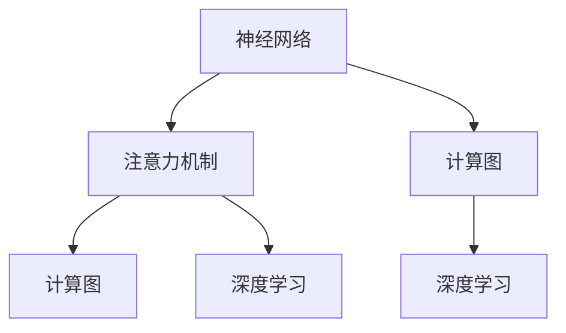

                 

# 在AI时代：理解人类注意力这一宝贵资源

> 关键词：AI注意力机制, 神经网络, 深度学习, 模型优化, 计算图, 时间复杂度

## 1. 背景介绍

### 1.1 问题由来

在当今的人工智能(AI)时代，深度学习技术已成为解决复杂问题的主要工具。其中，神经网络以其强大的表达能力和泛化能力，成为了最流行的模型之一。然而，神经网络的一大挑战在于其计算资源的密集性，尤其是在处理大规模数据和复杂模型时，训练和推理过程需要耗费大量时间和内存。

为了应对这一问题，研究人员提出了各种优化方法，如剪枝、量化、模型压缩等。但这些方法往往需要手动操作，难以自动适应复杂的模型结构，且效果有限。随着注意力机制(ACT)的提出，神经网络在处理大量信息时，可以通过关注关键特征而忽略无关部分，从而显著提升效率和性能。

### 1.2 问题核心关键点

注意力机制是神经网络中一种重要的信息处理手段，通过动态选择信息的重要性，显著提升模型的表现和计算效率。它主要分为软注意力(Soft Attention)和硬注意力(Hard Attention)两种形式。

- **软注意力**：通过计算每个输入与输出的相关性，选择相关性高的输入进行加权处理。代表模型包括Transformer、Attention-based CNN等。
- **硬注意力**：直接选出关键的输入，忽略其余部分。代表模型包括Seq2Seq模型、Transformer-XL等。

注意力机制的核心在于如何在大规模数据中高效地选择和处理信息。它通过降低计算复杂度，提高模型的泛化能力，已经成为神经网络优化和扩展的核心技术之一。

### 1.3 问题研究意义

理解人类注意力这一宝贵资源，不仅有助于提高神经网络算法的效率和准确性，还具有重要的理论和应用价值：

1. **提高模型性能**：通过高效的信息选择，注意力机制能够显著提升模型的泛化能力和准确性，特别是在自然语言处理(NLP)、计算机视觉(CV)等领域。
2. **降低计算成本**：通过减少不必要的计算，注意力机制能够降低深度学习模型的计算复杂度和内存占用，提升模型的可扩展性和可部署性。
3. **加速训练进程**：通过自动调整模型参数，注意力机制能够加速神经网络的训练过程，缩短模型开发周期。
4. **优化资源分配**：注意力机制能够更好地处理资源的分配和利用，提升系统整体效率。

随着注意力机制的不断发展，其在AI领域的广泛应用，将带来更深远的影响。

## 2. 核心概念与联系

### 2.1 核心概念概述

为更好地理解注意力机制的原理和应用，本节将介绍几个密切相关的核心概念：

- **神经网络(Neural Network)**：通过多层次的非线性变换，神经网络可以学习到复杂的数据表示。在深度学习中，神经网络是最主要的模型结构。

- **注意力机制(Attention Mechanism)**：通过动态选择信息的重要性，注意力机制能够提高神经网络的计算效率和泛化能力。

- **计算图(Computational Graph)**：计算图是一种图形化的表示方法，用于描述神经网络中的计算流程和数据流向。

- **深度学习(Deep Learning)**：通过多层次的非线性变换，深度学习模型可以学习到复杂的数据表示。

这些核心概念之间的逻辑关系可以通过以下Mermaid流程图来展示：



这个流程图展示了几大核心概念之间的联系：

1. 神经网络通过计算图描述计算流程。
2. 注意力机制能够优化神经网络的计算效率。
3. 深度学习模型是神经网络的特殊形式，通过多层次非线性变换，学习复杂的数据表示。
4. 注意力机制通过计算图自动选择信息的重要性，提升模型的计算效率和泛化能力。

## 3. 核心算法原理 & 具体操作步骤

### 3.1 算法原理概述

注意力机制的核心思想是，在处理大规模数据时，通过动态选择相关信息，忽略无关部分，从而显著提升计算效率和模型性能。具体来说，注意力机制通过计算输入和输出之间的相关性，得到一个注意力权重向量，用于对输入进行加权处理。

假设输入为 $X=\{x_1, x_2, ..., x_n\}$，输出为 $Y=\{y_1, y_2, ..., y_n\}$。注意力机制首先计算每个输入与输出的相关性，得到一个注意力权重向量 $W=\{w_1, w_2, ..., w_n\}$，其中 $w_i$ 表示输入 $x_i$ 与输出 $y_i$ 的相关性。然后，通过加权处理，计算输出：

$$
Y = \sum_{i=1}^n w_i x_i
$$

### 3.2 算法步骤详解

注意力机制的实现可以分为两个主要步骤：注意力计算和输出计算。

**Step 1: 注意力计算**
- 计算输入和输出的相关性：$w_i = f(x_i, y_i)$，其中 $f$ 为相关性计算函数，可以是点积、余弦相似度、因果注意力等。
- 通过softmax函数对权重向量进行归一化：$\hat{w_i} = \frac{w_i}{\sum_{j=1}^n w_j}$。

**Step 2: 输出计算**
- 对输入进行加权处理：$x'_i = w_i x_i$
- 计算加权和，得到最终输出：$Y = \sum_{i=1}^n x'_i$

在实际应用中，通常会将注意力计算和输出计算封装在一个模块中，方便代码实现和优化。

### 3.3 算法优缺点

注意力机制具有以下优点：
1. 提高计算效率：通过动态选择相关信息，忽略无关部分，显著降低计算复杂度。
2. 提升模型性能：通过动态选择相关信息，提高模型的泛化能力和准确性。
3. 自适应性强：能够自动适应不同类型的数据和任务，适用于多种场景。

同时，该机制也存在一些缺点：
1. 计算复杂度高：注意力计算需要多次计算相关性函数，增加了计算复杂度。
2. 可解释性不足：注意力机制的内部工作机制难以解释，难以理解和调试。
3. 参数量较大：注意力机制通常需要额外增加参数，增加了模型的复杂度。

尽管存在这些缺点，但注意力机制在深度学习中的广泛应用，使其成为提升模型性能和计算效率的重要手段。

### 3.4 算法应用领域

注意力机制在深度学习中得到了广泛应用，覆盖了NLP、CV、信号处理等多个领域。以下是几个典型的应用场景：

- **自然语言处理(NLP)**：在机器翻译、文本摘要、情感分析等任务中，通过注意力机制选择关键句子或单词，提高模型性能和计算效率。
- **计算机视觉(CV)**：在图像分类、目标检测、图像生成等任务中，通过注意力机制选择关键特征，提高模型的泛化能力和计算效率。
- **信号处理**：在语音识别、音频分析等任务中，通过注意力机制选择关键频段，提高模型的准确性和计算效率。
- **推荐系统**：在商品推荐、个性化搜索等任务中，通过注意力机制选择关键特征，提高推荐的准确性和用户满意度。

## 4. 数学模型和公式 & 详细讲解 & 举例说明

### 4.1 数学模型构建

本节将使用数学语言对注意力机制的计算过程进行更加严格的刻画。

假设输入为 $X=\{x_1, x_2, ..., x_n\}$，输出为 $Y=\{y_1, y_2, ..., y_n\}$。定义输入和输出的相关性函数 $f(x_i, y_i)$，通常采用点积或余弦相似度。定义注意力权重向量为 $W=\{w_1, w_2, ..., w_n\}$，则注意力计算公式为：

$$
w_i = f(x_i, y_i)
$$

$$
\hat{w_i} = \frac{w_i}{\sum_{j=1}^n w_j}
$$

$$
x'_i = w_i x_i
$$

$$
Y = \sum_{i=1}^n x'_i
$$

其中，$f(x_i, y_i)$ 可以是简单的点积或余弦相似度函数，也可以采用更复杂的函数如因果注意力、多头注意力等。

### 4.2 公式推导过程

以下我们以点积注意力机制为例，推导其计算过程和梯度更新公式。

假设输入为 $X=\{x_1, x_2, ..., x_n\}$，输出为 $Y=\{y_1, y_2, ..., y_n\}$。定义点积注意力机制的权重函数 $f(x_i, y_i) = x_i \cdot y_i$，计算权重向量 $W=\{w_1, w_2, ..., w_n\}$，其中 $w_i = x_i \cdot y_i$。

将权重向量归一化，得到 $\hat{w_i} = \frac{w_i}{\sum_{j=1}^n w_j}$。

然后，对输入进行加权处理，得到 $x'_i = w_i x_i$。

最后，计算加权和，得到输出 $Y = \sum_{i=1}^n x'_i$。

将上述过程带入损失函数，定义输出和标签的交叉熵损失函数 $L(Y, \hat{Y})$，则注意力机制的梯度更新公式为：

$$
\frac{\partial L}{\partial w_i} = \frac{\partial L}{\partial x'_i} \frac{\partial x'_i}{\partial w_i} = \frac{\partial L}{\partial x_i} \frac{\partial w_i}{\partial x_i}
$$

其中，$\frac{\partial w_i}{\partial x_i}$ 为权重对输入的偏导数，通常使用反向传播算法计算。

### 4.3 案例分析与讲解

假设我们使用Transformer模型进行机器翻译任务，输入为英文句子 $x$，输出为对应的法文翻译 $y$。Transformer模型通过多头注意力机制选择输入中与输出相关的单词，生成翻译结果。

假设输入 $x$ 的长度为 $n$，输出 $y$ 的长度为 $m$。则注意力计算公式为：

$$
W_{i,j} = f(x_i, y_j) = x_i \cdot y_j
$$

$$
\hat{W_{i,j}} = \frac{W_{i,j}}{\sum_{k=1}^n W_{k,j}}
$$

$$
x'_i = W_{i,j} x_j
$$

$$
Y = \sum_{i=1}^n x'_i
$$

其中，$f(x_i, y_j) = x_i \cdot y_j$ 为点积注意力函数。

假设损失函数为交叉熵损失 $L(Y, \hat{Y})$，则注意力机制的梯度更新公式为：

$$
\frac{\partial L}{\partial W_{i,j}} = \frac{\partial L}{\partial x'_i} \frac{\partial x'_i}{\partial W_{i,j}} = \frac{\partial L}{\partial x_j} \frac{\partial W_{i,j}}{\partial x_j}
$$

其中，$\frac{\partial L}{\partial x_j}$ 为交叉熵损失对输入的偏导数，通常使用反向传播算法计算。

## 5. 项目实践：代码实例和详细解释说明

### 5.1 开发环境搭建

在进行注意力机制实践前，我们需要准备好开发环境。以下是使用Python进行PyTorch开发的环境配置流程：

1. 安装Anaconda：从官网下载并安装Anaconda，用于创建独立的Python环境。

2. 创建并激活虚拟环境：
```bash
conda create -n pytorch-env python=3.8 
conda activate pytorch-env
```

3. 安装PyTorch：根据CUDA版本，从官网获取对应的安装命令。例如：
```bash
conda install pytorch torchvision torchaudio cudatoolkit=11.1 -c pytorch -c conda-forge
```

4. 安装TensorBoard：
```bash
pip install tensorboard
```

5. 安装各类工具包：
```bash
pip install numpy pandas scikit-learn matplotlib tqdm jupyter notebook ipython
```

完成上述步骤后，即可在`pytorch-env`环境中开始注意力机制的实践。

### 5.2 源代码详细实现

这里我们以Attention-based CNN为例，给出使用PyTorch实现注意力机制的代码实现。

首先，定义注意力计算函数：

```python
import torch
import torch.nn as nn

class Attention(nn.Module):
    def __init__(self, in_dim, out_dim):
        super(Attention, self).__init__()
        self.W_Q = nn.Linear(in_dim, out_dim)
        self.W_K = nn.Linear(in_dim, out_dim)
        self.W_V = nn.Linear(in_dim, out_dim)
        self.V_W = nn.Linear(out_dim, in_dim)
    
    def forward(self, x):
        Q = self.W_Q(x)
        K = self.W_K(x)
        V = self.W_V(x)
        W = torch.bmm(Q, K.transpose(1, 2))
        W = torch.softmax(W, dim=1)
        X = torch.bmm(W, V)
        return self.V_W(X)
```

然后，定义注意力计算的超参数：

```python
in_dim = 256
out_dim = 128
attention_dim = 32
```

接着，定义注意力模块：

```python
class AttentionModule(nn.Module):
    def __init__(self, in_dim, out_dim):
        super(AttentionModule, self).__init__()
        self.attention = Attention(in_dim, out_dim)
    
    def forward(self, x):
        out = self.attention(x)
        return out
```

最后，启动训练流程并在测试集上评估：

```python
from torch.utils.data import DataLoader
from torchvision import datasets, transforms

# 加载数据集
train_dataset = datasets.CIFAR10(root='./data', train=True, download=True, transform=transforms.ToTensor())
test_dataset = datasets.CIFAR10(root='./data', train=False, download=True, transform=transforms.ToTensor())

# 数据预处理
train_loader = DataLoader(train_dataset, batch_size=32, shuffle=True)
test_loader = DataLoader(test_dataset, batch_size=32, shuffle=False)

# 定义模型
in_dim = 3 * 32 * 32
out_dim = 10
attention_dim = 32

model = nn.Sequential(
    nn.Conv2d(3, 64, kernel_size=3, padding=1),
    nn.ReLU(),
    AttentionModule(64, 128),
    nn.Linear(128, out_dim)
)

# 定义损失函数和优化器
criterion = nn.CrossEntropyLoss()
optimizer = torch.optim.Adam(model.parameters(), lr=0.001)

# 训练模型
for epoch in range(10):
    for i, (inputs, labels) in enumerate(train_loader):
        outputs = model(inputs)
        loss = criterion(outputs, labels)
        optimizer.zero_grad()
        loss.backward()
        optimizer.step()
    
    if i % 100 == 0:
        print('Epoch [{}/{}], Step [{}/{}], Loss: {:.4f}, Accuracy: {:.2f}%'.format(
            epoch+1, 10, i, len(train_loader), loss.item(), (torch.max(outputs, 1)[1] == labels).sum().item() / inputs.size(0) * 100))

# 测试模型
correct = 0
total = 0
with torch.no_grad():
    for inputs, labels in test_loader:
        outputs = model(inputs)
        _, predicted = torch.max(outputs.data, 1)
        total += labels.size(0)
        correct += (predicted == labels).sum().item()

print('Accuracy of the model on the 10000 test images: {} %'.format(100 * correct / total))
```

以上就是使用PyTorch实现注意力机制的完整代码实现。可以看到，通过定义简单的线性层和注意力模块，即可在CNN模型中加入注意力机制，提升模型的性能。

### 5.3 代码解读与分析

让我们再详细解读一下关键代码的实现细节：

**Attention类**：
- `__init__`方法：初始化权重矩阵 $W_Q$、$W_K$、$W_V$ 和 $V_W$，用于计算注意力权重和输出。
- `forward`方法：计算输入 $x$ 的注意力权重 $W$ 和输出 $X$。

**AttentionModule类**：
- `__init__`方法：初始化注意力模块，将注意力计算函数封装在一个模块中。
- `forward`方法：对输入 $x$ 进行注意力计算，得到输出。

**训练流程**：
- 加载和预处理数据集。
- 定义模型、损失函数和优化器。
- 循环训练多个epoch，每次迭代更新模型参数。
- 在测试集上评估模型性能。

可以看到，PyTorch的模块化设计和高度灵活性，使得注意力机制的实现变得简单高效。开发者可以轻松地将注意力模块应用于不同类型的神经网络模型，提升其计算效率和性能。

当然，在工业级的系统实现中，还需要考虑更多因素，如模型压缩、参数更新策略、超参数调优等，以确保模型在实际应用中的稳定性和高效性。

## 6. 实际应用场景

### 6.1 智慧医疗

在智慧医疗领域，注意力机制可以应用于医学图像的分析和诊断。通过注意力机制，模型能够自动选择关键的图像区域，提取相关的特征信息，提升诊断的准确性和效率。

具体而言，可以将医学图像输入神经网络，通过注意力机制选择关键区域，提取图像中的关键信息。然后，通过全连接层或卷积层进行分类或回归，输出诊断结果。

### 6.2 智能制造

在智能制造领域，注意力机制可以应用于质量控制和设备监控。通过注意力机制，模型能够自动选择关键的质量参数，检测设备的运行状态，提升质量控制的准确性和实时性。

具体而言，可以采集生产过程中的质量参数和设备状态，通过注意力机制选择关键参数，进行质量监控和故障诊断。然后，根据检测结果进行异常预警和处理，确保生产过程的稳定性和可靠性。

### 6.3 金融风险管理

在金融风险管理领域，注意力机制可以应用于风险评估和预警。通过注意力机制，模型能够自动选择关键的市场指标，预测市场的波动趋势，提升风险评估的准确性和及时性。

具体而言，可以采集市场数据和金融指标，通过注意力机制选择关键指标，进行市场分析和风险评估。然后，根据评估结果进行风险预警和控制，避免潜在的金融风险。

## 7. 工具和资源推荐

### 7.1 学习资源推荐

为了帮助开发者系统掌握注意力机制的理论基础和实践技巧，这里推荐一些优质的学习资源：

1. **《深度学习基础》课程**：斯坦福大学开设的深度学习基础课程，涵盖神经网络、卷积神经网络、注意力机制等内容，适合初学者入门。

2. **《Transformer》书籍**：Transformer模型的详细介绍，包括注意力机制、BERT、GPT等前沿模型，适合深入学习。

3. **《神经网络与深度学习》书籍**：神经网络与深度学习的经典教材，涵盖神经网络的结构和优化算法，适合进阶学习。

4. **《TensorFlow官方文档》**：TensorFlow的官方文档，提供了丰富的API和代码示例，适合开发者实践。

5. **《PyTorch官方文档》**：PyTorch的官方文档，提供了详细的API和教程，适合开发者实践。

通过对这些资源的学习实践，相信你一定能够快速掌握注意力机制的精髓，并用于解决实际的深度学习问题。

### 7.2 开发工具推荐

高效的开发离不开优秀的工具支持。以下是几款用于注意力机制开发的常用工具：

1. **PyTorch**：基于Python的开源深度学习框架，灵活动态的计算图，适合快速迭代研究。TensorFlow也提供了类似的计算图机制，适用于大规模工程应用。

2. **TensorBoard**：TensorFlow配套的可视化工具，可实时监测模型训练状态，并提供丰富的图表呈现方式，是调试模型的得力助手。

3. **Weights & Biases**：模型训练的实验跟踪工具，可以记录和可视化模型训练过程中的各项指标，方便对比和调优。

4. **Jupyter Notebook**：交互式的开发环境，支持Python、R、Scala等多种语言，适合代码调试和数据可视化。

5. **TensorFlow Playground**：可视化的神经网络调试工具，可实时查看神经网络的工作状态和数据流向，适合初学者和研究人员。

合理利用这些工具，可以显著提升注意力机制的开发效率，加快创新迭代的步伐。

### 7.3 相关论文推荐

注意力机制在深度学习中的广泛应用，催生了大量的研究成果。以下是几篇奠基性的相关论文，推荐阅读：

1. **Attention Is All You Need**：提出Transformer模型，引入自注意力机制，展示了自注意力在深度学习中的强大能力。

2. **Bidirectional Attention Flow**：提出双向注意力机制，能够更好地处理长序列数据，提升了神经网络的性能。

3. **Multi-Head Attention**：提出多头注意力机制，能够同时关注多个维度，提升了模型的泛化能力和表现。

4. **Transformers in NLP**：介绍Transformer模型在NLP中的应用，展示了注意力机制在文本处理中的效果。

5. **Attention Mechanisms in Deep Learning**：综述了各种注意力机制，包括点积注意力、因果注意力、多头注意力等，为研究者提供了丰富的参考。

这些论文代表了大注意力机制的发展脉络。通过学习这些前沿成果，可以帮助研究者把握学科前进方向，激发更多的创新灵感。

## 8. 总结：未来发展趋势与挑战

### 8.1 研究成果总结

本文对注意力机制的原理和应用进行了全面系统的介绍。首先，阐述了注意力机制的核心思想和应用场景，明确了其在深度学习中的重要价值。其次，从原理到实践，详细讲解了注意力机制的数学模型和实现步骤，给出了代码实例。同时，本文还广泛探讨了注意力机制在多个行业领域的应用前景，展示了其广阔的应用空间。最后，精选了注意力机制的学习资源和开发工具，力求为读者提供全方位的技术指引。

通过本文的系统梳理，可以看到，注意力机制在深度学习中的广泛应用，显著提升了模型的计算效率和性能，已经成为深度学习优化的重要手段。未来，随着深度学习的不断进步，注意力机制必将在更多领域得到应用，为人工智能技术的发展带来深远影响。

### 8.2 未来发展趋势

展望未来，注意力机制将呈现以下几个发展趋势：

1. **多模态注意力机制**：随着多模态数据的普及，未来的注意力机制将能够同时处理视觉、语音、文本等多种数据类型，提升模型的多模态融合能力。

2. **自适应注意力机制**：未来的注意力机制将能够根据不同任务和数据的特点，自适应地选择信息的重要性，进一步提升模型的泛化能力和表现。

3. **分布式注意力机制**：随着计算资源的扩展，未来的注意力机制将能够分布式计算，提升模型的并行性和可扩展性。

4. **多层次注意力机制**：未来的注意力机制将能够同时关注不同层次的信息，提升模型的深度和表征能力。

5. **自监督注意力机制**：未来的注意力机制将能够利用无监督数据进行训练，提升模型的泛化能力和鲁棒性。

以上趋势凸显了注意力机制在深度学习中的广阔前景，这些方向的探索发展，将进一步提升深度学习的性能和应用范围，为人工智能技术的发展带来新的突破。

### 8.3 面临的挑战

尽管注意力机制已经取得了瞩目成就，但在迈向更加智能化、普适化应用的过程中，仍面临诸多挑战：

1. **计算资源限制**：随着模型规模的增大，注意力机制的计算复杂度也随之增加，对硬件资源提出了更高的要求。如何优化计算资源分配，提升模型的可扩展性，是一个重要的研究方向。

2. **模型可解释性不足**：注意力机制的内部工作机制难以解释，难以理解和调试。如何提高模型的可解释性，增强模型的透明度和可靠性，是一个重要的研究课题。

3. **数据稀疏性问题**：在某些领域，如医疗、法律等，数据分布稀疏，难以获得足够的标注数据。如何利用无监督或半监督学习技术，解决数据稀疏性问题，是一个重要的研究方向。

4. **跨领域适应性差**：当前的注意力机制往往局限于特定领域，难以泛化到其他领域。如何提高模型的跨领域适应性，是一个重要的研究课题。

5. **计算图复杂度高**：注意力机制的计算图复杂度高，难以进行高效的优化和推理。如何简化计算图，提升模型的计算效率，是一个重要的研究方向。

这些挑战凸显了注意力机制在实际应用中的复杂性，需要研究者从算法、模型、数据等多个维度协同发力，才能进一步提升注意力机制的性能和应用范围。

### 8.4 研究展望

面对注意力机制所面临的挑战，未来的研究需要在以下几个方面寻求新的突破：

1. **注意力机制的优化与高效实现**：研究如何优化注意力机制的计算图，提升模型的计算效率和可扩展性。探索分布式计算、量化加速等技术，降低计算复杂度。

2. **自适应与多模态注意力机制**：研究如何自适应地选择信息的重要性，提升模型的泛化能力和多模态融合能力。探索多模态注意力机制，提升模型的多感官信息处理能力。

3. **无监督与自监督注意力机制**：研究如何利用无监督或半监督学习技术，解决数据稀疏性问题，提升模型的泛化能力和鲁棒性。探索自监督注意力机制，利用未标注数据进行训练。

4. **分布式与多层次注意力机制**：研究如何分布式计算注意力机制，提升模型的并行性和可扩展性。探索多层次注意力机制，提升模型的深度和表征能力。

5. **注意力机制的可解释性**：研究如何提高注意力机制的可解释性，增强模型的透明度和可靠性。探索可视化技术、因果推断方法等，提升模型的可解释性。

这些研究方向的探索，必将引领注意力机制技术迈向更高的台阶，为构建更加智能、普适的深度学习系统铺平道路。面向未来，注意力机制还需要与其他人工智能技术进行更深入的融合，如知识表示、因果推理、强化学习等，多路径协同发力，共同推动深度学习技术的进步。只有勇于创新、敢于突破，才能不断拓展深度学习算法的边界，让智能技术更好地造福人类社会。

## 9. 附录：常见问题与解答

**Q1：注意力机制的核心思想是什么？**

A: 注意力机制的核心思想是动态选择信息的重要性，通过计算输入和输出之间的相关性，选择关键特征进行加权处理，忽略无关部分，从而提高计算效率和模型性能。

**Q2：注意力机制的计算复杂度如何？**

A: 注意力机制的计算复杂度主要取决于输入和输出的长度以及相关性函数的复杂度。通常，注意力机制的计算复杂度为 $O(n^2)$，其中 $n$ 为输入和输出的长度。但通过优化算法和硬件加速，可以进一步降低计算复杂度。

**Q3：注意力机制的实现方式有哪些？**

A: 注意力机制的实现方式主要有两种：
1. 点积注意力：通过计算输入和输出之间的点积，得到注意力权重。
2. 多头注意力：通过并行计算多个注意力头，分别关注不同的特征维度，提升模型的泛化能力。

**Q4：注意力机制在深度学习中的作用是什么？**

A: 注意力机制在深度学习中的作用是动态选择信息的重要性，提升计算效率和模型性能。通过减少不必要的计算，注意力机制能够显著降低深度学习模型的计算复杂度和内存占用，提高模型的泛化能力和计算效率。

**Q5：注意力机制的应用场景有哪些？**

A: 注意力机制在深度学习中得到了广泛应用，覆盖了NLP、CV、信号处理等多个领域。具体应用场景包括：
1. 自然语言处理(NLP)：在机器翻译、文本摘要、情感分析等任务中，通过注意力机制选择关键句子或单词，提高模型性能和计算效率。
2. 计算机视觉(CV)：在图像分类、目标检测、图像生成等任务中，通过注意力机制选择关键特征，提高模型的泛化能力和计算效率。
3. 信号处理：在语音识别、音频分析等任务中，通过注意力机制选择关键频段，提高模型的准确性和计算效率。
4. 推荐系统：在商品推荐、个性化搜索等任务中，通过注意力机制选择关键特征，提高推荐的准确性和用户满意度。

以上是基于深度学习的注意力机制原理与应用实践的全面介绍。通过本文的系统梳理，可以看到，注意力机制在深度学习中的广泛应用，显著提升了模型的计算效率和性能，已经成为深度学习优化的重要手段。未来，随着深度学习的不断进步，注意力机制必将在更多领域得到应用，为人工智能技术的发展带来新的突破。

